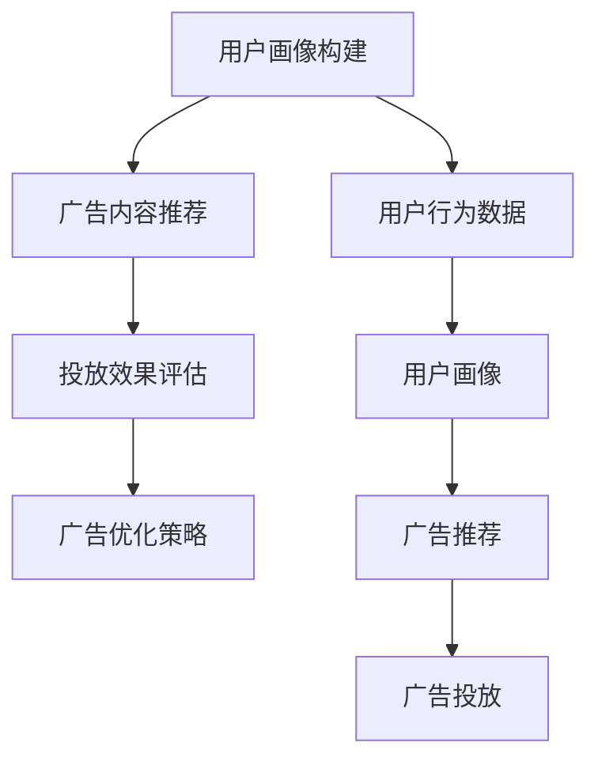

                 

# 电商平台个性化广告投放：AI大模型的精准定向

> 关键词：个性化推荐系统,用户行为分析,深度学习,自然语言处理,大语言模型,广告投放

## 1. 背景介绍

### 1.1 问题由来
电商平台个性化广告投放已成为商家提高点击率、转化率、提升营收的重要手段。然而，传统的基于规则或统计模型的广告投放策略往往难以全面把握用户需求，导致投放精准度不高，广告预算浪费。近年来，随着深度学习技术和大语言模型的发展，电商平台开始采用AI技术对用户行为进行全面分析，实现广告的精准定向投放。

### 1.2 问题核心关键点
1. **数据与模型融合**：如何有效利用电商平台上的海量的用户行为数据，结合大语言模型进行广告投放策略优化。
2. **精准定向**：通过深度学习和大语言模型构建用户画像，实现广告内容的个性化推荐，提升广告的点击率和转化率。
3. **效果评估**：建立科学的广告投放效果评估指标，如点击率、转化率、投资回报率等，帮助商家优化广告投放策略。

### 1.3 问题研究意义
大语言模型结合深度学习应用于电商平台个性化广告投放，可以有效提升广告精准度，降低广告投放成本，提升用户体验，从而实现电商平台和商家的共赢。这种精准定向的广告投放，可以帮助商家更准确地触达目标用户，优化广告投放效果，带来更高的收益。同时，用户也能在推荐广告中获得满意的购物体验，形成良性循环。

## 2. 核心概念与联系

### 2.1 核心概念概述

在电商平台个性化广告投放中，大语言模型和深度学习技术的应用主要体现在以下几个方面：

- **用户画像构建**：通过分析用户行为数据，构建详细、动态的用户画像。
- **广告内容推荐**：利用大语言模型对广告内容进行生成和优化，实现个性化推荐。
- **投放效果评估**：使用机器学习算法评估广告投放效果，优化广告策略。

这些核心概念之间存在紧密的联系，共同构成了一个高效、精准的电商平台个性化广告投放系统。

### 2.2 核心概念原理和架构的 Mermaid 流程图



### 2.3 核心概念之间的关系解释

1. **用户画像构建**：基于用户历史行为数据，通过深度学习模型（如隐马尔可夫模型、循环神经网络等）构建用户画像，包括用户的兴趣偏好、购物习惯等特征。
2. **广告内容推荐**：利用大语言模型（如GPT、BERT等）生成个性化的广告内容，或通过自然语言处理技术优化现有的广告文本。
3. **投放效果评估**：使用机器学习算法（如线性回归、随机森林等）评估广告投放效果，如点击率、转化率等指标，反馈给广告推荐系统进行调整优化。
4. **广告优化策略**：根据评估结果，调整广告内容、投放时间和频率等策略，提升广告投放效果。

这些核心概念共同构成了电商平台个性化广告投放的完整流程，通过深度学习和大语言模型的结合，实现了广告投放的精准化和智能化。

## 3. 核心算法原理 & 具体操作步骤

### 3.1 算法原理概述

电商平台个性化广告投放的核心算法包括深度学习、自然语言处理和大语言模型。具体而言，算法主要分为以下几个步骤：

1. **用户画像构建**：利用深度学习模型分析用户行为数据，构建用户画像。
2. **广告内容推荐**：通过大语言模型生成或优化广告内容，实现个性化推荐。
3. **投放效果评估**：使用机器学习算法评估广告投放效果，反馈优化广告策略。

### 3.2 算法步骤详解

#### 3.2.1 用户画像构建

1. **数据收集**：收集用户浏览、点击、购买等行为数据，包括用户浏览的历史页面、购买记录、评论等。
2. **特征工程**：对原始数据进行预处理和特征提取，如时间特征、商品类别特征、用户属性特征等。
3. **深度学习建模**：使用循环神经网络（RNN）、长短时记忆网络（LSTM）、门控循环单元（GRU）等深度学习模型，构建用户画像。
4. **用户画像更新**：根据新的用户行为数据，实时更新用户画像，保持画像的时效性和准确性。

#### 3.2.2 广告内容推荐

1. **广告内容生成**：利用大语言模型（如GPT-2、BERT等）生成符合用户兴趣的广告文本。
2. **广告内容优化**：通过自然语言处理技术（如词向量模型、情感分析等）优化广告内容，提升广告的吸引力和转化率。
3. **推荐模型训练**：使用协同过滤、矩阵分解等推荐算法，训练广告推荐模型。
4. **广告内容展示**：将优化的广告内容展示给目标用户。

#### 3.2.3 投放效果评估

1. **效果指标设计**：设计科学的广告投放效果指标，如点击率（CTR）、转化率（CVR）、投资回报率（ROI）等。
2. **评估模型训练**：使用机器学习算法训练评估模型，预测广告投放效果。
3. **效果反馈**：根据评估结果，调整广告内容、投放时间和频率等策略，提升广告投放效果。

### 3.3 算法优缺点

#### 3.3.1 优点

1. **精准度提升**：深度学习和大语言模型能够全面分析用户行为数据，构建详细的用户画像，实现广告的精准定向投放。
2. **实时优化**：用户画像和广告内容可以实时更新和优化，提升广告的实时效果。
3. **广告预算优化**：通过科学的广告效果评估，优化广告投放策略，降低广告投放成本，提升广告效益。

#### 3.3.2 缺点

1. **数据质量要求高**：算法的效果依赖于高质量的用户行为数据，数据缺失或不完整会导致算法效果下降。
2. **计算资源需求大**：深度学习和自然语言处理模型需要大量的计算资源，对于资源有限的商家可能难以负担。
3. **模型复杂度较高**：深度学习和大语言模型模型的复杂度较高，需要专业知识进行维护和优化。

### 3.4 算法应用领域

基于深度学习和大语言模型的个性化广告投放技术，已经在多个电商平台上得到应用，主要领域包括：

1. **电商平台的广告投放**：如淘宝、京东、亚马逊等，通过分析用户行为数据，实现广告的精准投放。
2. **旅游行业的旅游推荐**：如携程、去哪儿等，通过分析用户浏览和搜索数据，推荐合适的旅游产品。
3. **金融行业的理财推荐**：如支付宝、微信理财等，通过分析用户理财行为数据，推荐合适的理财产品。
4. **新闻媒体的广告推荐**：如今日头条、网易新闻等，通过分析用户阅读数据，推荐相关的新闻广告。

## 4. 数学模型和公式 & 详细讲解 & 举例说明

### 4.1 数学模型构建

假设电商平台有N个用户，每个用户浏览过M个商品，构建用户画像的数学模型为：

$$
\theta = f(x)
$$

其中，$x$ 为用户的行为数据，$f$ 为深度学习模型。

### 4.2 公式推导过程

以循环神经网络（RNN）为例，推导用户画像构建的公式。设用户历史行为数据为 $x_1, x_2, ..., x_M$，用户画像表示为 $\theta$，则：

1. **输入层**：
   $$
   x_1 = (x_{1t}, x_{1t-1}, ..., x_{1t-D})
   $$
   其中 $x_{1t}$ 为用户当前时间点的行为数据，$D$ 为窗口大小。

2. **隐藏层**：
   $$
   h_t = \tanh(W_{hh}h_{t-1} + W_{xh}x_{1t})
   $$

3. **输出层**：
   $$
   \theta = \text{softmax}(W_{h\theta}h_t + b_{\theta})
   $$

其中，$W_{hh}$ 和 $W_{xh}$ 为权重矩阵，$b_{\theta}$ 为偏置向量。

### 4.3 案例分析与讲解

假设某电商平台的用户浏览历史数据为 $x_1, x_2, ..., x_M$，使用RNN构建用户画像 $\theta$。

1. **数据预处理**：将用户行为数据进行标准化处理，消除噪音和异常值。
2. **RNN模型训练**：使用RNN模型对用户行为数据进行建模，得到用户画像 $\theta$。
3. **广告内容生成**：利用GPT-2模型生成广告文本，与用户画像 $\theta$ 结合生成个性化广告。
4. **广告效果评估**：使用点击率（CTR）、转化率（CVR）等指标评估广告投放效果，反馈优化广告策略。

## 5. 项目实践：代码实例和详细解释说明

### 5.1 开发环境搭建

使用Python进行深度学习和自然语言处理任务开发，需要安装以下环境：

1. **Python**：版本为3.7以上。
2. **PyTorch**：深度学习框架，支持GPU加速。
3. **TensorBoard**：可视化工具，监控模型训练过程。
4. **Flask**：Web应用框架，搭建个性化广告投放系统。

### 5.2 源代码详细实现

以GPT-2模型为例，展示广告内容生成的代码实现。

```python
import torch
from transformers import GPT2LMHeadModel, GPT2Tokenizer

# 加载模型和分词器
tokenizer = GPT2Tokenizer.from_pretrained('gpt2')
model = GPT2LMHeadModel.from_pretrained('gpt2')

# 生成广告文本
def generate_ad_text(prompt, max_length=50):
    input_ids = tokenizer.encode(prompt, return_tensors='pt')
    outputs = model.generate(input_ids, max_length=max_length, top_p=0.95)
    ad_text = tokenizer.decode(outputs[0], skip_special_tokens=True)
    return ad_text

# 示例：生成一个关于牛奶的个性化广告
prompt = "我们有一款牛奶，广告如下："
ad_text = generate_ad_text(prompt)
print(ad_text)
```

### 5.3 代码解读与分析

1. **GPT-2模型加载**：使用PyTorch和Transformers库加载预训练的GPT-2模型和分词器。
2. **广告文本生成**：使用GPT-2模型生成符合给定提示的广告文本，长度不超过50个字。
3. **输出结果**：将生成的广告文本解码输出，作为推荐给用户的内容。

### 5.4 运行结果展示

示例运行结果：

```
我们有一款牛奶，新鲜牛奶富含蛋白质，是您健康生活的最佳选择。牛奶价格亲民，数量充足，物流快捷。快来选购吧！
```

## 6. 实际应用场景

### 6.1 电商平台广告投放

基于深度学习和大语言模型，电商平台可以实现个性化广告的精准投放。

以某电商平台为例，使用RNN模型分析用户浏览数据，构建详细的用户画像，利用GPT-2模型生成广告文本，实现个性化推荐。广告投放效果通过点击率和转化率等指标进行评估，优化广告策略。

### 6.2 旅游行业旅游推荐

旅游行业应用大语言模型生成个性化的旅游广告，提升用户对旅游产品的兴趣和购买率。

通过收集用户的历史旅游浏览数据和搜索记录，使用深度学习模型构建用户画像，利用大语言模型生成符合用户兴趣的旅游广告。广告效果通过点击率和预订率等指标进行评估，优化广告策略。

### 6.3 金融行业理财推荐

金融行业通过分析用户理财行为数据，实现个性化理财广告的投放。

收集用户的理财记录、交易历史等数据，使用深度学习模型构建用户画像，利用大语言模型生成个性化的理财广告。广告效果通过投资回报率和客户满意度等指标进行评估，优化广告策略。

## 7. 工具和资源推荐

### 7.1 学习资源推荐

1. **《深度学习》（Ian Goodfellow等）**：全面介绍深度学习的基本概念和算法，是学习深度学习的经典教材。
2. **《自然语言处理综论》（Daniel Jurafsky等）**：介绍自然语言处理的基本原理和应用，涵盖词向量、情感分析等技术。
3. **《Transformer from Scratch》（Guanliang Zhou等）**：详细介绍Transformer模型的原理和实现，涵盖预训练语言模型的基本概念。

### 7.2 开发工具推荐

1. **PyTorch**：深度学习框架，支持GPU加速，适用于深度学习模型的训练和推理。
2. **TensorBoard**：可视化工具，实时监控模型训练过程。
3. **Flask**：Web应用框架，搭建个性化广告投放系统。

### 7.3 相关论文推荐

1. **"Attention is All You Need"（Jacob Devlin等）**：提出Transformer模型，是预训练语言模型的奠基之作。
2. **"BERT: Pre-training of Deep Bidirectional Transformers for Language Understanding"（Jacob Devlin等）**：提出BERT模型，引入掩码语言模型进行预训练。
3. **"GPT-2: Language Models are Unsupervised Multitask Learners"（OpenAI）**：展示大语言模型在零样本学习中的强大能力，推动了预训练语言模型的发展。

## 8. 总结：未来发展趋势与挑战

### 8.1 研究成果总结

本文介绍了基于深度学习和大语言模型的电商平台个性化广告投放技术，通过分析用户行为数据，构建详细的用户画像，生成个性化的广告文本，实现广告的精准投放。

### 8.2 未来发展趋势

1. **个性化推荐模型的改进**：未来将进一步改进深度学习模型和推荐算法，提升广告推荐的精准度。
2. **广告投放效果的评估优化**：引入更多评估指标，如用户满意度、广告覆盖率等，提升广告投放效果的评估。
3. **多模态数据的融合**：引入图像、视频等多模态数据，提升广告内容的丰富度和吸引力。

### 8.3 面临的挑战

1. **数据质量问题**：高质量的用户行为数据是算法效果的基础，数据缺失或不完整会导致算法效果下降。
2. **计算资源需求**：深度学习和自然语言处理模型的计算需求较大，需要足够的计算资源进行训练和推理。
3. **模型可解释性**：广告推荐模型的复杂度较高，模型的内部机制难以解释，影响模型的可信度和可控性。

### 8.4 研究展望

1. **无监督和半监督学习的应用**：探索无监督和半监督学习的应用，降低对标注数据的依赖，提高算法的泛化能力。
2. **多模态广告推荐**：引入图像、视频等多模态数据，提升广告内容的丰富度和吸引力，实现多模态广告推荐。
3. **可解释性模型的开发**：开发可解释性较强的广告推荐模型，提升模型的可信度和可控性，增加用户对模型的信任。

## 9. 附录：常见问题与解答

**Q1：电商平台个性化广告投放中，如何提升广告的点击率和转化率？**

A: 提升广告的点击率和转化率，需要从多个方面入手：

1. **精准定位**：通过深度学习和大语言模型构建详细的用户画像，实现广告的精准定向投放。
2. **优质内容**：利用大语言模型生成高质量的广告文本，提升广告的吸引力和用户点击率。
3. **优化投放策略**：使用机器学习算法评估广告投放效果，优化广告的投放时间和频率，提升转化率。
4. **A/B测试**：通过A/B测试，不断调整广告内容、投放策略，找到最优的投放方案。

**Q2：电商平台个性化广告投放中，如何处理数据质量问题？**

A: 数据质量是影响算法效果的关键因素，以下是处理数据质量问题的几种方法：

1. **数据清洗**：对原始数据进行去重、去噪、异常值处理等，保证数据的一致性和完整性。
2. **数据增强**：通过数据增强技术，扩充训练集，提升算法的泛化能力。
3. **缺失值处理**：采用插值、均值填补等方法，处理缺失值问题，避免数据缺失影响模型效果。

**Q3：电商平台个性化广告投放中，如何选择合适的大语言模型？**

A: 选择合适的大语言模型需要考虑以下几个因素：

1. **模型规模**：大语言模型的规模越大，通常性能越好，但计算资源需求也越高。需要根据实际计算资源选择合适规模的模型。
2. **模型精度**：不同模型的精度不同，需要根据具体应用场景选择合适的模型。
3. **模型可解释性**：模型的可解释性越强，越容易理解和优化，需要根据实际需求选择模型。

**Q4：电商平台个性化广告投放中，如何优化计算资源？**

A: 优化计算资源可以从以下几个方面入手：

1. **模型剪枝**：对模型进行剪枝，去除冗余参数，减小模型规模，降低计算资源需求。
2. **量化加速**：将浮点模型转换为定点模型，降低计算资源消耗，提高计算速度。
3. **分布式计算**：使用分布式计算技术，将计算任务分配到多个节点并行计算，提高计算效率。

总之，电商平台个性化广告投放需要全面考虑数据质量、计算资源、模型选择等多个因素，通过科学的方法和工具，实现广告的精准投放和效果优化。

---

作者：禅与计算机程序设计艺术 / Zen and the Art of Computer Programming

