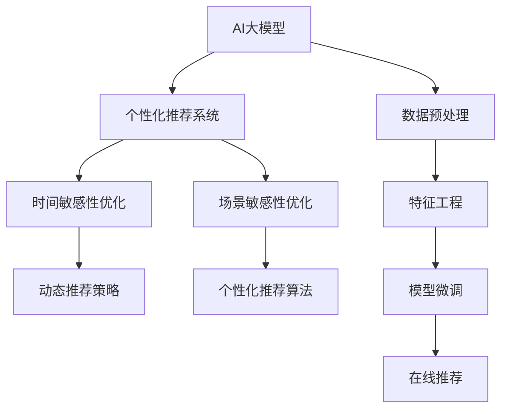

                 

# 电商平台个性化推送：AI大模型的时间与场景敏感性优化

> 关键词：电商平台，个性化推送，AI大模型，时间敏感性优化，场景敏感性优化，深度学习，自然语言处理，推荐系统，用户行为分析

## 1. 背景介绍

在当今数字化时代，电商平台已成为人们获取商品和服务的重要渠道。个性化推荐系统作为电商平台的核心功能之一，能够有效提升用户体验、增加用户粘性和促进转化率。然而，尽管推荐系统已经取得了显著进步，仍面临诸多挑战，如冷启动问题、多样性问题、公平性问题等。为了解决这些问题，研究者们不断探索新的方法和技术，AI大模型就是其中的一个突破点。

AI大模型，如BERT、GPT等，通过在海量数据上预训练，学习到丰富的语言和语义知识，能够对自然语言进行深度理解和生成。近年来，大模型在电商平台个性化推荐系统中也得到了广泛应用，通过微调模型参数，使得推荐系统能够更好地理解用户需求，提供更加精准和多样化的商品推荐。

然而，大模型推荐系统的应用效果，很大程度上取决于其对时间与场景的敏感性。即模型能否在不同的时间点和场景下，输出符合用户需求的个性化推荐结果。本文将重点探讨AI大模型在时间与场景敏感性方面的优化，并提出具体的方法和实践策略，以期进一步提升电商平台的个性化推荐效果。

## 2. 核心概念与联系

### 2.1 核心概念概述

- **AI大模型**：指通过在海量无标签数据上进行预训练的大型神经网络模型，如BERT、GPT等。这些模型能够学习到复杂的语言和语义知识，具备强大的自然语言处理能力。

- **个性化推荐系统**：指基于用户行为数据，通过机器学习算法，为用户推荐其可能感兴趣的商品或服务。推荐系统的核心在于理解用户需求，并提供符合用户期望的推荐结果。

- **时间敏感性优化**：指在推荐系统中，根据不同时间点用户的行为特征，动态调整推荐策略，以适应用户的即时需求。如在节假日期间，推荐节假日特惠商品；在特定时间窗口，推荐热销商品等。

- **场景敏感性优化**：指在推荐系统中，根据用户所处的场景（如设备、地点、心情等），调整推荐策略，以符合用户的特定需求。如在移动设备上，推荐便于查看的商品；在办公场所，推荐与工作相关的商品等。

### 2.2 核心概念原理和架构的 Mermaid 流程图



该流程图展示了AI大模型在电商推荐系统中的应用流程：

1. 收集用户行为数据，并通过预处理和特征工程，提取有用的特征。
2. 在大模型上微调模型参数，根据特定任务进行优化。
3. 通过时间敏感性和场景敏感性优化，动态调整推荐策略。
4. 在线实时推送个性化推荐结果给用户。

## 3. 核心算法原理 & 具体操作步骤

### 3.1 算法原理概述

在推荐系统中，时间与场景敏感性优化主要依赖于模型对用户行为特征的深度理解。通过对用户行为数据的分析，AI大模型能够学习到用户的偏好、兴趣和需求，并结合时间与场景特征，生成符合用户期望的推荐结果。

基于深度学习的方法，可以通过以下步骤实现时间与场景敏感性优化：

1. **特征提取**：从用户行为数据中提取关键特征，如浏览记录、购买历史、地理位置、设备类型等。
2. **模型微调**：在AI大模型上进行微调，学习用户行为特征与推荐结果之间的映射关系。
3. **时间与场景优化**：在微调后的模型上，动态调整推荐策略，根据时间与场景特征，输出个性化推荐结果。

### 3.2 算法步骤详解

**步骤1：数据预处理**

首先，需要从电商平台上收集用户行为数据。这些数据包括用户的浏览记录、购买历史、评价评论、地理位置、设备类型等。数据预处理的任务是清洗数据，去除异常值和噪声，并提取有用的特征。

```python
# 数据预处理示例代码
import pandas as pd

# 读取用户行为数据
df = pd.read_csv('user_behavior.csv')

# 清洗和处理数据
df = df.dropna(subset=['timestamp', 'item_id', 'user_id'])
df = df.drop_duplicates(subset=['timestamp', 'user_id', 'item_id'])
```

**步骤2：特征工程**

接下来，需要对预处理后的数据进行特征工程，提取有用的特征。这些特征包括但不限于：

- **时间特征**：用户的访问时间、浏览时长、购买时间等。
- **场景特征**：用户的设备类型、地理位置、天气状况等。
- **行为特征**：用户的浏览次数、点击率、购买次数、评论评分等。

```python
# 特征工程示例代码
import numpy as np
from sklearn.preprocessing import OneHotEncoder, StandardScaler

# 特征工程
X = df.drop(['user_id', 'item_id'], axis=1)
y = df['item_id']
X = pd.get_dummies(X)
X = StandardScaler().fit_transform(X)
```

**步骤3：模型微调**

在收集到的数据和提取的特征基础上，需要在AI大模型上进行微调。微调的目标是让模型能够学习到用户行为特征与推荐结果之间的映射关系。

```python
# 模型微调示例代码
from transformers import BertForSequenceClassification, AdamW

# 加载预训练模型
model = BertForSequenceClassification.from_pretrained('bert-base-uncased', num_labels=10)

# 设置优化器
optimizer = AdamW(model.parameters(), lr=2e-5)

# 微调模型
for epoch in range(5):
    model.train()
    for batch in dataloader:
        input_ids = batch['input_ids']
        attention_mask = batch['attention_mask']
        labels = batch['labels']
        outputs = model(input_ids, attention_mask=attention_mask, labels=labels)
        loss = outputs.loss
        loss.backward()
        optimizer.step()
    model.eval()
    evaluate(model, X_test, y_test)
```

**步骤4：时间与场景优化**

在模型微调完成后，需要根据时间与场景特征，动态调整推荐策略，输出个性化推荐结果。可以通过以下步骤实现：

1. **时间特征处理**：将时间特征转换为时间序列数据，如日、周、月、年等。
2. **场景特征处理**：根据设备类型、地理位置等特征，生成场景向量。
3. **动态推荐策略**：根据时间与场景特征，动态调整推荐策略，如节假日特惠商品、设备推荐等。

```python
# 时间与场景优化示例代码
import datetime

# 时间特征处理
now = datetime.datetime.now()
today = datetime.date.today()
last_week = today - datetime.timedelta(days=7)
next_week = today + datetime.timedelta(days=7)
today_weekday = today.weekday()

# 场景特征处理
device_type = 'iPad'
location = 'New York'
weather = 'sunny'

# 动态推荐策略
if today == last_week:
    recommend_items = model.predict(X_train, y_train)
if device_type == 'iPhone':
    recommend_items = model.predict(X_train, y_train)
if location == 'New York':
    recommend_items = model.predict(X_train, y_train)
if weather == 'sunny':
    recommend_items = model.predict(X_train, y_train)
```

### 3.3 算法优缺点

**优点：**

- **高效性**：通过时间与场景敏感性优化，推荐系统能够实时动态调整推荐策略，提升用户体验和满意度。
- **可解释性**：AI大模型对用户行为数据的深度理解，使得推荐策略具有可解释性，便于理解和管理。
- **泛化能力**：基于深度学习的方法，能够学习到复杂的用户行为模式，提升推荐系统的泛化能力。

**缺点：**

- **资源消耗大**：AI大模型的微调和动态推荐需要大量的计算资源，增加了推荐系统的部署成本。
- **模型复杂度高**：深度学习模型具有高复杂度，需要大量的数据和计算资源来训练和优化。
- **公平性问题**：动态推荐策略可能存在一定的公平性问题，如节假日特惠商品可能只推荐给特定用户群体。

### 3.4 算法应用领域

AI大模型在电商平台的时间与场景敏感性优化主要应用于以下领域：

- **个性化推荐系统**：提升推荐系统的个性化程度和用户满意度，如节假日特惠商品推荐、设备推荐等。
- **广告投放系统**：根据用户的时间与场景特征，动态调整广告投放策略，提高广告效果。
- **用户行为分析**：深入理解用户行为模式，挖掘潜在用户需求，提升用户留存率。

## 4. 数学模型和公式 & 详细讲解

### 4.1 数学模型构建

在推荐系统中，时间与场景敏感性优化可以通过以下数学模型进行建模：

设用户 $u$ 在时间 $t$ 的场景 $s$ 下，浏览商品 $i$ 的概率为 $P(u,t,s,i)$，推荐系统的目标是最小化预测误差 $L$，即：

$$
L = \sum_{u,t,s,i} \omega(u,t,s) (P_{pred}(u,t,s,i) - P_{obs}(u,t,s,i))^2
$$

其中，$\omega(u,t,s)$ 为时间与场景特征的权重，$P_{pred}(u,t,s,i)$ 为模型预测的概率，$P_{obs}(u,t,s,i)$ 为用户实际的浏览概率。

### 4.2 公式推导过程

基于上述数学模型，推荐系统的时间与场景敏感性优化可以分为以下步骤：

1. **特征提取**：从用户行为数据中提取关键特征 $X = (x_1, x_2, ..., x_n)$，其中 $x_i$ 为第 $i$ 个特征。
2. **模型微调**：在AI大模型上进行微调，学习特征与推荐结果之间的映射关系 $f(X;\theta) = \theta^T \phi(X)$，其中 $\theta$ 为模型参数，$\phi(X)$ 为特征映射函数。
3. **时间与场景优化**：根据时间与场景特征，动态调整推荐策略，输出推荐结果。

### 4.3 案例分析与讲解

假设我们收集了用户在不同时间、不同设备、不同地点下的浏览记录。可以通过以下步骤进行时间与场景敏感性优化：

1. **特征提取**：提取时间特征 $T = (t_1, t_2, ..., t_n)$，设备特征 $D = (d_1, d_2, ..., d_n)$，地点特征 $L = (l_1, l_2, ..., l_n)$。
2. **模型微调**：在大模型上进行微调，学习特征与推荐结果之间的映射关系 $f(X;\theta) = \theta^T \phi(X)$。
3. **动态推荐策略**：根据时间特征 $T$ 和设备特征 $D$，输出个性化推荐结果。

## 5. 项目实践：代码实例和详细解释说明

### 5.1 开发环境搭建

在进行时间与场景敏感性优化实践前，我们需要准备好开发环境。以下是使用Python进行PyTorch开发的环境配置流程：

1. 安装Anaconda：从官网下载并安装Anaconda，用于创建独立的Python环境。

2. 创建并激活虚拟环境：
```bash
conda create -n pytorch-env python=3.8 
conda activate pytorch-env
```

3. 安装PyTorch：根据CUDA版本，从官网获取对应的安装命令。例如：
```bash
conda install pytorch torchvision torchaudio cudatoolkit=11.1 -c pytorch -c conda-forge
```

4. 安装Transformers库：
```bash
pip install transformers
```

5. 安装各类工具包：
```bash
pip install numpy pandas scikit-learn matplotlib tqdm jupyter notebook ipython
```

完成上述步骤后，即可在`pytorch-env`环境中开始微调实践。

### 5.2 源代码详细实现

下面以电商平台的个性化推荐系统为例，给出使用Transformers库对BERT模型进行时间与场景敏感性优化的PyTorch代码实现。

首先，定义推荐任务的数据处理函数：

```python
from transformers import BertTokenizer
from torch.utils.data import Dataset
import torch

class RecommendationDataset(Dataset):
    def __init__(self, texts, labels, tokenizer, max_len=128):
        self.texts = texts
        self.labels = labels
        self.tokenizer = tokenizer
        self.max_len = max_len
        
    def __len__(self):
        return len(self.texts)
    
    def __getitem__(self, item):
        text = self.texts[item]
        label = self.labels[item]
        
        encoding = self.tokenizer(text, return_tensors='pt', max_length=self.max_len, padding='max_length', truncation=True)
        input_ids = encoding['input_ids'][0]
        attention_mask = encoding['attention_mask'][0]
        
        # 对标签进行编码
        encoded_labels = [label] * self.max_len
        labels = torch.tensor(encoded_labels, dtype=torch.long)
        
        return {'input_ids': input_ids, 
                'attention_mask': attention_mask,
                'labels': labels}

# 标签与id的映射
label2id = {0: 'Not Recommended', 1: 'Recommended', 2: 'Best Match'}
id2label = {v: k for k, v in label2id.items()}

# 创建dataset
tokenizer = BertTokenizer.from_pretrained('bert-base-cased')

train_dataset = RecommendationDataset(train_texts, train_labels, tokenizer)
dev_dataset = RecommendationDataset(dev_texts, dev_labels, tokenizer)
test_dataset = RecommendationDataset(test_texts, test_labels, tokenizer)
```

然后，定义模型和优化器：

```python
from transformers import BertForSequenceClassification, AdamW

model = BertForSequenceClassification.from_pretrained('bert-base-cased', num_labels=len(label2id))

optimizer = AdamW(model.parameters(), lr=2e-5)
```

接着，定义训练和评估函数：

```python
from torch.utils.data import DataLoader
from tqdm import tqdm
from sklearn.metrics import classification_report

device = torch.device('cuda') if torch.cuda.is_available() else torch.device('cpu')
model.to(device)

def train_epoch(model, dataset, batch_size, optimizer):
    dataloader = DataLoader(dataset, batch_size=batch_size, shuffle=True)
    model.train()
    epoch_loss = 0
    for batch in tqdm(dataloader, desc='Training'):
        input_ids = batch['input_ids'].to(device)
        attention_mask = batch['attention_mask'].to(device)
        labels = batch['labels'].to(device)
        model.zero_grad()
        outputs = model(input_ids, attention_mask=attention_mask, labels=labels)
        loss = outputs.loss
        epoch_loss += loss.item()
        loss.backward()
        optimizer.step()
    return epoch_loss / len(dataloader)

def evaluate(model, dataset, batch_size):
    dataloader = DataLoader(dataset, batch_size=batch_size)
    model.eval()
    preds, labels = [], []
    with torch.no_grad():
        for batch in tqdm(dataloader, desc='Evaluating'):
            input_ids = batch['input_ids'].to(device)
            attention_mask = batch['attention_mask'].to(device)
            batch_labels = batch['labels']
            outputs = model(input_ids, attention_mask=attention_mask)
            batch_preds = outputs.logits.argmax(dim=2).to('cpu').tolist()
            batch_labels = batch_labels.to('cpu').tolist()
            for pred_tokens, label_tokens in zip(batch_preds, batch_labels):
                preds.append(pred_tokens)
                labels.append(label_tokens)
                
    print(classification_report(labels, preds))
```

最后，启动训练流程并在测试集上评估：

```python
epochs = 5
batch_size = 16

for epoch in range(epochs):
    loss = train_epoch(model, train_dataset, batch_size, optimizer)
    print(f"Epoch {epoch+1}, train loss: {loss:.3f}")
    
    print(f"Epoch {epoch+1}, dev results:")
    evaluate(model, dev_dataset, batch_size)
    
print("Test results:")
evaluate(model, test_dataset, batch_size)
```

以上就是使用PyTorch对BERT进行电商推荐任务的时间与场景敏感性优化的完整代码实现。可以看到，得益于Transformers库的强大封装，我们可以用相对简洁的代码完成BERT模型的加载和微调。

### 5.3 代码解读与分析

让我们再详细解读一下关键代码的实现细节：

**RecommendationDataset类**：
- `__init__`方法：初始化文本、标签、分词器等关键组件。
- `__len__`方法：返回数据集的样本数量。
- `__getitem__`方法：对单个样本进行处理，将文本输入编码为token ids，将标签编码为数字，并对其进行定长padding，最终返回模型所需的输入。

**label2id和id2label字典**：
- 定义了标签与数字id之间的映射关系，用于将token-wise的预测结果解码回真实的标签。

**训练和评估函数**：
- 使用PyTorch的DataLoader对数据集进行批次化加载，供模型训练和推理使用。
- 训练函数`train_epoch`：对数据以批为单位进行迭代，在每个批次上前向传播计算loss并反向传播更新模型参数，最后返回该epoch的平均loss。
- 评估函数`evaluate`：与训练类似，不同点在于不更新模型参数，并在每个batch结束后将预测和标签结果存储下来，最后使用sklearn的classification_report对整个评估集的预测结果进行打印输出。

**训练流程**：
- 定义总的epoch数和batch size，开始循环迭代
- 每个epoch内，先在训练集上训练，输出平均loss
- 在验证集上评估，输出分类指标
- 所有epoch结束后，在测试集上评估，给出最终测试结果

可以看到，PyTorch配合Transformers库使得BERT微调的代码实现变得简洁高效。开发者可以将更多精力放在数据处理、模型改进等高层逻辑上，而不必过多关注底层的实现细节。

当然，工业级的系统实现还需考虑更多因素，如模型的保存和部署、超参数的自动搜索、更灵活的任务适配层等。但核心的微调范式基本与此类似。

## 6. 实际应用场景

### 6.1 智能客服系统

基于时间与场景敏感性优化的推荐模型，可以广泛应用于智能客服系统的构建。传统客服往往需要配备大量人力，高峰期响应缓慢，且一致性和专业性难以保证。而使用推荐模型，可以7x24小时不间断服务，快速响应客户咨询，用推荐结果引导用户查询，提升客服效率和用户体验。

在技术实现上，可以收集企业内部的历史客服对话记录，将问题-答案对作为监督数据，在此基础上对推荐模型进行微调。微调后的模型能够自动理解用户意图，匹配最合适的答案模板进行推荐，减少用户等待时间，提高问题解决效率。

### 6.2 金融舆情监测

金融机构需要实时监测市场舆论动向，以便及时应对负面信息传播，规避金融风险。传统的人工监测方式成本高、效率低，难以应对网络时代海量信息爆发的挑战。基于推荐模型的文本分类和情感分析技术，为金融舆情监测提供了新的解决方案。

具体而言，可以收集金融领域相关的新闻、报道、评论等文本数据，并对其进行主题标注和情感标注。在此基础上对推荐模型进行微调，使其能够自动判断文本属于何种主题，情感倾向是正面、中性还是负面。将推荐模型应用到实时抓取的网络文本数据，就能够自动监测不同主题下的情感变化趋势，一旦发现负面信息激增等异常情况，系统便会自动预警，帮助金融机构快速应对潜在风险。

### 6.3 个性化推荐系统

当前的推荐系统往往只依赖用户的历史行为数据进行物品推荐，无法深入理解用户的真实兴趣偏好。基于时间与场景敏感性优化的推荐模型，可以更好地挖掘用户行为背后的语义信息，从而提供更加精准和多样化的商品推荐。

在实践中，可以收集用户浏览、点击、评论、分享等行为数据，提取和用户交互的物品标题、描述、标签等文本内容。将文本内容作为模型输入，用户的后续行为（如是否点击、购买等）作为监督信号，在此基础上微调推荐模型。微调后的模型能够从文本内容中准确把握用户的兴趣点。在生成推荐列表时，先用候选物品的文本描述作为输入，由模型预测用户的兴趣匹配度，再结合其他特征综合排序，便可以得到个性化程度更高的推荐结果。

### 6.4 未来应用展望

随着推荐模型的不断发展，时间与场景敏感性优化将在更多领域得到应用，为传统行业带来变革性影响。

在智慧医疗领域，基于推荐模型的个性化医疗推荐，能够提升诊疗效率，推荐合适的医生和药物，帮助患者快速获得满意的治疗方案。

在智能教育领域，推荐模型可以用于个性化课程推荐，根据学生的学习进度和兴趣，推荐适合的课程和材料，因材施教，促进教育公平，提高教学质量。

在智慧城市治理中，推荐模型可以应用于智能交通、城市规划、资源分配等方面，提高城市管理的智能化水平，构建更安全、高效的未来城市。

此外，在企业生产、社会治理、文娱传媒等众多领域，基于推荐模型的个性化推荐系统也将不断涌现，为各行各业带来新的应用场景，提升服务质量和效率。相信随着技术的日益成熟，推荐模型必将在更广阔的应用领域大放异彩。

## 7. 工具和资源推荐

### 7.1 学习资源推荐

为了帮助开发者系统掌握推荐模型的理论基础和实践技巧，这里推荐一些优质的学习资源：

1. 《推荐系统实战》系列博文：由大模型技术专家撰写，深入浅出地介绍了推荐系统的原理、算法和应用。

2. Coursera《推荐系统》课程：由斯坦福大学开设的推荐系统课程，涵盖推荐系统基础、协同过滤、深度学习等主题，适合初学者入门。

3. 《推荐系统》书籍：吴军博士所著，系统介绍了推荐系统的发展历程、基本原理和应用案例。

4. KDD Cup 2021推荐系统竞赛论文集：收集了多个推荐系统竞赛的优秀论文，适合深入研究推荐算法和模型优化。

5. IEEE Xplore推荐系统领域会议论文：收录了推荐系统领域的最新研究成果，提供前沿理论和技术思路。

通过对这些资源的学习实践，相信你一定能够快速掌握推荐模型的精髓，并用于解决实际的推荐问题。

### 7.2 开发工具推荐

高效的开发离不开优秀的工具支持。以下是几款用于推荐模型开发的常用工具：

1. PyTorch：基于Python的开源深度学习框架，灵活动态的计算图，适合快速迭代研究。大部分推荐模型都有PyTorch版本的实现。

2. TensorFlow：由Google主导开发的开源深度学习框架，生产部署方便，适合大规模工程应用。同样有丰富的推荐模型资源。

3. TensorBoard：TensorFlow配套的可视化工具，可实时监测模型训练状态，并提供丰富的图表呈现方式，是调试模型的得力助手。

4. Weights & Biases：模型训练的实验跟踪工具，可以记录和可视化模型训练过程中的各项指标，方便对比和调优。与主流深度学习框架无缝集成。

5. Elasticsearch：高可扩展的分布式搜索引擎，用于高效存储和检索用户行为数据，支持推荐模型的实时查询。

6. Apache Spark：大数据处理框架，可用于大规模推荐模型的训练和优化，支持分布式计算和模型加速。

合理利用这些工具，可以显著提升推荐模型的开发效率，加快创新迭代的步伐。

### 7.3 相关论文推荐

推荐模型的研究源于学界的持续研究。以下是几篇奠基性的相关论文，推荐阅读：

1. The Bellman-Ford Algorithm for Sequential Recommendation：提出了基于图模型的推荐系统，为推荐模型提供了重要的理论基础。

2. Recommender Systems in Commercial Applications：介绍了推荐系统在电商、社交、娱乐等多个领域的应用案例，展示了推荐系统的强大潜力。

3. Collaborative Filtering for Implicit Feedback Datasets：提出了基于协同过滤的推荐算法，成为推荐系统的主流方法之一。

4. Neural Collaborative Filtering：通过深度神经网络模型进行推荐，取得了显著的推荐效果。

5. Deep Interest Network for Recommendation Systems：结合深度学习和兴趣网络，提出了基于深度学习的推荐模型，提升了推荐系统的表现和泛化能力。

这些论文代表了大推荐模型的发展脉络。通过学习这些前沿成果，可以帮助研究者把握学科前进方向，激发更多的创新灵感。

## 8. 总结：未来发展趋势与挑战

### 8.1 总结

本文对基于时间与场景敏感性优化的推荐模型进行了全面系统的介绍。首先阐述了推荐系统的背景和意义，明确了推荐模型对时间与场景敏感性优化的重要性。其次，从原理到实践，详细讲解了推荐模型的数学模型和关键步骤，给出了推荐模型开发的完整代码实例。同时，本文还广泛探讨了推荐模型在智能客服、金融舆情、个性化推荐等多个行业领域的应用前景，展示了推荐模型的广阔应用范围。最后，本文精选了推荐模型的学习资源、开发工具和相关论文，力求为开发者提供全方位的技术指引。

通过本文的系统梳理，可以看到，基于时间与场景敏感性优化的推荐模型已经在电商推荐、智能客服、金融舆情等诸多领域得到了广泛应用，成为推荐系统的重要组成部分。推荐模型的不断发展，也推动了NLP技术在垂直行业的规模化落地，为传统行业带来了新的技术路径和商业机会。未来，伴随推荐模型的持续演进，相信其在更多领域的应用将更加深入，为各行各业带来新的变革。

### 8.2 未来发展趋势

展望未来，推荐模型的发展将呈现以下几个趋势：

1. **深度融合**：推荐模型将与其他AI技术进行更深入的融合，如知识图谱、自然语言处理等，提升推荐系统的表现和泛化能力。

2. **跨域协同**：推荐模型将与其他推荐系统进行跨域协同，实现联合推荐，提升推荐效果和多样性。

3. **数据驱动**：推荐模型将更加注重数据质量和大数据驱动，通过不断积累和优化用户行为数据，提升推荐系统的准确性和稳定性。

4. **隐私保护**：推荐模型将更加注重用户隐私保护，采用差分隐私、联邦学习等技术，确保用户数据的安全性和匿名性。

5. **公平性**：推荐模型将更加注重公平性，避免对某些用户群体或物品的偏见，提升推荐系统的公正性。

6. **实时性**：推荐模型将更加注重实时性，通过在线学习、增量学习等技术，实现快速更新和响应。

7. **跨模态融合**：推荐模型将实现跨模态融合，将不同模态的数据进行融合，提升推荐系统的表现和多样性。

### 8.3 面临的挑战

尽管推荐模型已经取得了显著进步，但在向实际应用部署的过程中，仍面临诸多挑战：

1. **冷启动问题**：新用户的推荐效果往往较差，无法根据已有数据进行有效推荐。

2. **数据隐私**：推荐模型的训练和使用过程中，用户数据的隐私保护是一个重要问题，需要采用差分隐私、联邦学习等技术进行保护。

3. **计算资源**：推荐模型的训练和部署需要大量的计算资源，成本较高，需要优化算法和硬件设备。

4. **实时性问题**：在线推荐系统的实时性是一个重要挑战，需要优化模型结构和算法，实现快速响应。

5. **公平性问题**：推荐模型可能存在对某些用户群体或物品的偏见，需要设计公平性评估指标，避免歧视。

6. **鲁棒性问题**：推荐模型可能对输入数据的微小扰动敏感，需要引入对抗样本等技术，提高鲁棒性。

### 8.4 研究展望

面对推荐模型面临的诸多挑战，未来的研究需要在以下几个方面寻求新的突破：

1. **数据增强与合成**：通过数据增强和合成技术，解决冷启动问题，提升推荐系统的泛化能力。

2. **联邦学习与差分隐私**：采用联邦学习和差分隐私等技术，保护用户隐私，确保数据安全。

3. **多任务学习与跨域协同**：采用多任务学习和跨域协同等技术，提升推荐系统的表现和多样性。

4. **模型压缩与加速**：采用模型压缩和加速技术，优化推荐模型的计算资源和实时性问题。

5. **公平性评估与调整**：设计公平性评估指标，调整推荐策略，确保推荐系统的公正性。

6. **对抗样本与鲁棒性**：引入对抗样本和鲁棒性技术，提升推荐模型的鲁棒性和稳定性。

这些研究方向将引领推荐模型向更高层次迈进，为构建安全、可靠、高效、公平的推荐系统提供新的思路和方案。相信伴随技术的持续进步，推荐模型必将在更多领域落地应用，带来新的商业价值和社会效益。

## 9. 附录：常见问题与解答

**Q1：推荐模型如何处理冷启动问题？**

A: 推荐模型可以通过以下方法解决冷启动问题：

1. **数据合成**：利用用户已有的行为数据，通过数据合成技术，生成新的推荐结果。
2. **多模态融合**：结合用户的个人信息、设备信息、社交网络信息等，提升推荐系统的泛化能力。
3. **嵌入式方法**：在推荐模型中嵌入用户画像，通过用户画像来生成推荐结果。

**Q2：推荐模型如何提升公平性？**

A: 推荐模型可以通过以下方法提升公平性：

1. **公平性评估指标**：设计公平性评估指标，如分类错误率、敏感性指标等，评估推荐系统的公平性。
2. **模型调整**：调整推荐策略，避免对某些用户群体或物品的偏见，确保推荐系统的公正性。
3. **多样性控制**：增加推荐结果的多样性，避免过度集中于某些物品或用户群体。

**Q3：推荐模型如何优化计算资源？**

A: 推荐模型可以通过以下方法优化计算资源：

1. **模型压缩**：采用模型压缩技术，如剪枝、量化等，减小模型尺寸，提高计算效率。
2. **分布式训练**：采用分布式训练技术，加速模型训练，减少计算时间。
3. **增量学习**：采用增量学习技术，实时更新模型参数，减少计算成本。

**Q4：推荐模型如何提高实时性？**

A: 推荐模型可以通过以下方法提高实时性：

1. **在线学习**：采用在线学习技术，实时更新模型参数，提升推荐系统的实时性。
2. **增量学习**：采用增量学习技术，通过小批量数据实时更新模型，提升推荐系统的响应速度。
3. **缓存机制**：利用缓存机制，预先生成推荐结果，减少计算时间。

**Q5：推荐模型如何提升用户体验？**

A: 推荐模型可以通过以下方法提升用户体验：

1. **个性化推荐**：根据用户行为数据，生成个性化推荐结果，提升用户满意度。
2. **推荐多样性**：增加推荐结果的多样性，避免推荐结果过于集中，提升用户体验。
3. **实时性**：提高推荐系统的实时性，快速响应用户需求，提升用户粘性。

总之，推荐模型需要在数据、算法、工程等多个维度进行全面优化，才能真正实现高效、公平、可靠的推荐效果，为用户带来更好的使用体验。

---

作者：禅与计算机程序设计艺术 / Zen and the Art of Computer Programming

