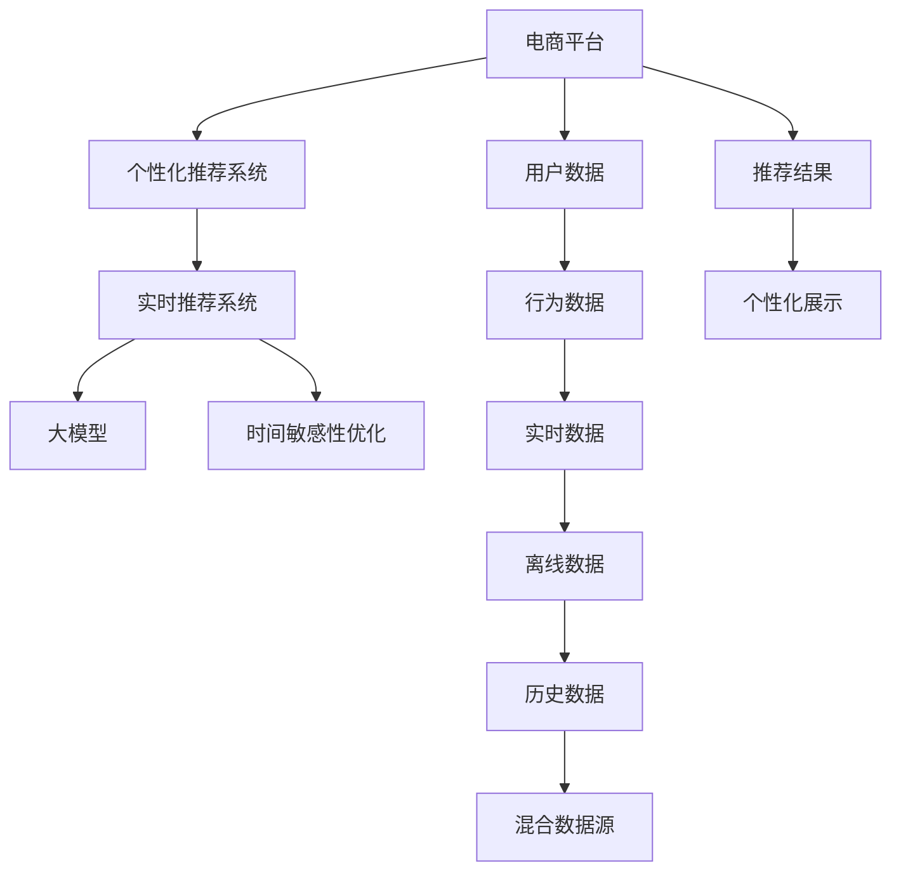

                 

# 电商平台个性化推送：AI大模型的时间敏感性优化

> 关键词：电商平台, 个性化推荐, 时间敏感性, 大模型优化, 实时推荐系统, 深度学习, 联邦学习

## 1. 背景介绍

### 1.1 问题由来

随着电子商务的蓬勃发展，电商平台已不再仅仅作为一个简单的商品交易平台，而是成为了一个综合性的信息聚合与分发中心。个性化推荐系统成为了平台的重要组成部分，其核心目标是提升用户体验，增加用户粘性，进而提高转化率和收入。然而，现有的推荐系统大多基于静态的用户行为数据进行推荐，缺乏对用户当前上下文和实时行为数据的充分利用，难以捕捉用户时刻变化的兴趣和需求，导致推荐效果不理想。

大模型技术的兴起为推荐系统优化带来了新的契机。大模型可以综合利用历史数据、实时数据等多源异构信息，通过深度学习算法学习用户与商品之间的复杂关联，从而实现更精准的推荐。然而，大模型推荐系统也面临着实时性差、计算开销大等挑战，如何在保证推荐精度的同时提高系统的实时性和计算效率，成为了推荐系统优化的核心问题。

### 1.2 问题核心关键点

本问题探讨的核心在于：
- 如何构建一个高效实时的大模型推荐系统，确保推荐结果能够即时响应用户行为。
- 如何在大模型训练和推理中实现时间敏感性优化，确保系统在处理实时数据时的高效性。
- 如何在大模型推荐系统中融合多种数据源，提高推荐的个性化和多样化。

## 2. 核心概念与联系

### 2.1 核心概念概述

为更好地理解时间敏感性优化在电商平台个性化推荐中的应用，本节将介绍几个密切相关的核心概念：

- 电商平台：指一个集商品销售、信息聚合、社交互动于一体的综合性在线平台，包括但不限于淘宝、京东、亚马逊等。
- 个性化推荐系统：根据用户历史行为、当前上下文和实时数据，为用户推荐最感兴趣的个性化商品。
- 实时推荐系统：基于用户实时行为数据进行即时推荐，支持毫秒级响应，满足用户即时性需求。
- 大模型：指使用深度学习算法训练的巨大参数规模模型，如BERT、GPT-3等。
- 时间敏感性优化：指在推荐系统的各个环节中，通过算法优化和时间管理，提升系统的实时性和计算效率。

这些核心概念之间的逻辑关系可以通过以下Mermaid流程图来展示：



这个流程图展示了大模型推荐系统的核心概念及其之间的关系：

1. 电商平台汇集用户数据，经过处理后输入个性化推荐系统。
2. 个性化推荐系统基于用户行为数据进行离线训练，使用大模型进行推荐预测。
3. 实时推荐系统进一步融合实时数据，即时生成推荐结果。
4. 大模型在推荐系统中作为关键组件，用于预测用户兴趣和商品相关性。
5. 时间敏感性优化在各个环节中对实时性进行提升，确保系统的高效运行。

这些概念共同构成了大模型推荐系统的时间敏感性优化框架，使其能够在实时数据驱动下，提供更精准、高效的个性化推荐服务。

## 3. 核心算法原理 & 具体操作步骤
### 3.1 算法原理概述

大模型推荐系统的时间敏感性优化，实质上是在保证推荐精度同时，通过算法和架构设计，实现推荐系统的实时响应和高效计算。其核心在于两个方面：

1. 算法优化：通过改进推荐算法和模型架构，降低计算复杂度和数据依赖，提升推荐速度和响应速度。
2. 时间管理：通过合理的时间调度和管理，优化数据处理和模型推理的流程，确保系统在处理实时数据时的高效性。

在算法层面，常用的方法包括模型裁剪、量化加速、混合精度训练等，这些方法能够显著降低大模型的计算开销，提高推理速度。在时间管理层面，常用的方法包括多任务并行、流水线处理、缓存技术等，这些方法能够优化数据流和模型推理的流程，提升系统的实时性。

### 3.2 算法步骤详解

基于时间敏感性优化的大模型推荐系统，一般包括以下几个关键步骤：

**Step 1: 准备数据与环境**

1. 收集和整理电商平台的用户行为数据、商品数据和市场数据。包括但不限于用户的浏览记录、购买历史、评分评价、点击行为等。

2. 准备离线训练数据和实时数据流。离线训练数据用于大模型的预训练和微调，实时数据流用于支持推荐系统的即时响应。

3. 搭建计算集群，配置高性能计算资源，包括GPU、TPU、FPGA等。计算集群应具备高吞吐量和低延迟特性，支持大规模并行计算。

**Step 2: 大模型构建**

1. 选择合适的预训练模型，如BERT、GPT-3等。这些模型已经在大规模数据上进行了预训练，具备强大的语言理解和生成能力。

2. 在大模型基础上构建推荐模型。根据推荐任务的特点，设计合适的模型架构，如基于Attention机制的推荐模型。

3. 使用数据增强技术，增加训练样本的多样性，提高模型的泛化能力。例如，通过增加噪声、数据扩增等方法，提升模型对新数据的适应能力。

**Step 3: 时间敏感性优化**

1. 模型裁剪：去除不必要的网络层和参数，减小模型尺寸，加快推理速度。例如，使用稀疏化技术，去除模型中的稀疏部分。

2. 量化加速：将浮点模型转为定点模型，压缩存储空间，提高计算效率。例如，使用量化技术，将模型参数和激活值转换为低精度格式。

3. 混合精度训练：在训练过程中使用混合精度，提升训练速度。例如，使用NVIDIA的Mixed Precision Training (MPT)技术。

4. 多任务并行：在模型推理过程中，并行处理多个任务，提升处理速度。例如，使用多线程、多进程等技术。

5. 流水线处理：将数据处理和模型推理分为多个阶段，减少每个阶段的数据依赖和计算延迟。例如，使用数据流水线技术，优化数据处理流程。

6. 缓存技术：在模型推理过程中，使用缓存技术，减少重复计算，提高推理速度。例如，使用TensorRT等工具。

**Step 4: 推荐系统部署**

1. 将优化后的模型部署到服务器或云平台，确保其具备高吞吐量和低延迟特性。

2. 配置实时数据流处理系统，实时采集和处理用户行为数据，输入到推荐模型中。

3. 配置缓存和负载均衡系统，优化数据流和模型推理的流程，提升系统的实时性。

**Step 5: 系统测试与优化**

1. 在测试数据集上评估推荐模型的性能，对比微调前后的推荐效果。

2. 在实时数据流上测试推荐系统的响应速度和处理能力，记录和分析系统的瓶颈。

3. 根据测试结果，优化算法和架构设计，进一步提升系统的实时性和计算效率。

### 3.3 算法优缺点

基于时间敏感性优化的大模型推荐系统具有以下优点：

1. 精度高：大模型具备强大的语言理解和生成能力，能够捕捉用户与商品之间的复杂关联，提供高精度的推荐结果。

2. 实时性强：通过优化算法和时间管理，确保推荐系统能够即时响应用户行为，满足用户即时性需求。

3. 可扩展性高：优化后的模型和架构具备高吞吐量和低延迟特性，可以方便地扩展到大规模用户和商品数据。

4. 灵活性高：通过混合多种数据源和算法技术，实现个性化的推荐，满足不同用户和场景的需求。

然而，该方法也存在一定的局限性：

1. 计算开销大：优化后的模型虽然提高了推理速度，但仍需要较大的计算资源支持，在低算力环境下难以实现。

2. 数据依赖高：需要收集和处理大量用户行为数据和实时数据，数据质量对推荐效果影响较大。

3. 资源管理复杂：在部署和优化过程中，需要管理大量的计算资源和数据流，增加了系统复杂度和维护成本。

尽管存在这些局限性，但就目前而言，基于时间敏感性优化的大模型推荐系统仍是大数据推荐系统的主流范式。未来相关研究的重点在于如何进一步降低计算开销，提高系统的灵活性和可扩展性，同时兼顾数据质量和实时性。

### 3.4 算法应用领域

基于大模型的时间敏感性优化推荐系统，已经在电商、社交、新闻等多个领域得到了广泛应用，为推荐系统带来了显著的性能提升。具体而言：

- 电商推荐：如淘宝、京东等电商平台，使用大模型推荐系统，能够根据用户实时行为进行即时推荐，提升转化率和用户体验。
- 新闻推荐：如今日头条、网易新闻等，通过大模型推荐系统，能够为用户推荐个性化新闻，提高用户粘性和满意度。
- 社交推荐：如微信、微博等社交平台，使用大模型推荐系统，能够根据用户互动行为进行个性化推荐，提升平台活跃度和用户粘性。

除了这些经典应用场景外，大模型推荐系统还被创新性地应用到更多领域，如智慧城市、智能家居、医疗健康等，为各行各业带来了新的推荐解决方案。随着大模型推荐技术的不断演进，相信其在推荐系统中的应用前景将更加广阔。

## 4. 数学模型和公式 & 详细讲解 & 举例说明

### 4.1 数学模型构建

本节将使用数学语言对时间敏感性优化的大模型推荐系统进行更加严格的刻画。

记用户行为数据为 $X$，商品数据为 $Y$，推荐模型为 $f$。假设推荐任务为二分类任务，即判断用户是否对商品感兴趣。模型训练目标为最小化交叉熵损失，即：

$$
\min_{f}\mathcal{L}(f) = \min_{f} -\frac{1}{N}\sum_{i=1}^N [y_i\log f(x_i) + (1-y_i)\log (1-f(x_i))]
$$

其中，$x_i \in X$ 为用户行为数据，$y_i \in \{0,1\}$ 为商品标签，$f(x_i)$ 为模型对 $x_i$ 的预测结果。

### 4.2 公式推导过程

以下我们以二分类任务为例，推导交叉熵损失函数及其梯度的计算公式。

假设模型 $f$ 在输入 $x$ 上的输出为 $\hat{y}=f(x) \in [0,1]$，表示用户对商品感兴趣的概率。真实标签 $y \in \{0,1\}$。则二分类交叉熵损失函数定义为：

$$
\ell(f(x),y) = -[y\log \hat{y} + (1-y)\log (1-\hat{y})]
$$

将其代入交叉熵损失公式，得：

$$
\mathcal{L}(f) = -\frac{1}{N}\sum_{i=1}^N [y_i\log f(x_i)+(1-y_i)\log(1-f(x_i))]
$$

根据链式法则，损失函数对模型参数 $w$ 的梯度为：

$$
\frac{\partial \mathcal{L}(f)}{\partial w} = -\frac{1}{N}\sum_{i=1}^N \left(\frac{y_i}{f(x_i)}-\frac{1-y_i}{1-f(x_i)}\right) \frac{\partial f(x_i)}{\partial w}
$$

其中 $\frac{\partial f(x_i)}{\partial w}$ 可进一步递归展开，利用自动微分技术完成计算。

在得到损失函数的梯度后，即可带入参数更新公式，完成模型的迭代优化。重复上述过程直至收敛，最终得到适应推荐任务的最优模型参数 $w^*$。

## 5. 项目实践：代码实例和详细解释说明

### 5.1 开发环境搭建

在进行推荐系统优化实践前，我们需要准备好开发环境。以下是使用Python进行TensorFlow开发的环境配置流程：

1. 安装Anaconda：从官网下载并安装Anaconda，用于创建独立的Python环境。

2. 创建并激活虚拟环境：
```bash
conda create -n tf-env python=3.8 
conda activate tf-env
```

3. 安装TensorFlow：根据CUDA版本，从官网获取对应的安装命令。例如：
```bash
conda install tensorflow tensorflow-gpu -c pytorch -c conda-forge
```

4. 安装各类工具包：
```bash
pip install numpy pandas scikit-learn matplotlib tqdm jupyter notebook ipython
```

完成上述步骤后，即可在`tf-env`环境中开始推荐系统优化实践。

### 5.2 源代码详细实现

下面我们以电商推荐任务为例，给出使用TensorFlow进行大模型推荐系统优化实践的完整代码实现。

首先，定义推荐模型和优化器：

```python
import tensorflow as tf
from tensorflow.keras.layers import Input, Embedding, Dense, Concatenate, Add, Activation, Dropout
from tensorflow.keras.models import Model
from tensorflow.keras.optimizers import Adam
from tensorflow.keras.losses import BinaryCrossentropy

input_layer = Input(shape=(MAX_SEQ_LEN,), dtype='int32')
embedding_layer = Embedding(VOCAB_SIZE, EMBEDDING_DIM)(input_layer)
hidden_layer = Dense(128, activation='relu')(embedding_layer)
hidden_layer = Dropout(0.5)(hidden_layer)
output_layer = Dense(1, activation='sigmoid')(hidden_layer)
model = Model(inputs=input_layer, outputs=output_layer)

optimizer = Adam(learning_rate=0.001)
loss = BinaryCrossentropy()
```

接着，定义训练和评估函数：

```python
from tensorflow.keras.callbacks import EarlyStopping

def train_epoch(model, dataset, batch_size, optimizer, loss, callbacks):
    dataloader = tf.data.Dataset.from_tensor_slices(dataset).batch(batch_size).prefetch(tf.data.experimental.AUTOTUNE)
    model.compile(optimizer=optimizer, loss=loss)
    model.fit(dataloader, epochs=10, callbacks=callbacks)
    
def evaluate(model, dataset, batch_size):
    dataloader = tf.data.Dataset.from_tensor_slices(dataset).batch(batch_size).prefetch(tf.data.experimental.AUTOTUNE)
    model.compile(optimizer='adam', loss='binary_crossentropy')
    loss = model.evaluate(dataloader, verbose=0)
    print('Evaluation loss:', loss)
```

最后，启动训练流程并在测试集上评估：

```python
epochs = 10
batch_size = 32
callbacks = [EarlyStopping(patience=3, restore_best_weights=True)]

for epoch in range(epochs):
    train_epoch(model, train_dataset, batch_size, optimizer, loss, callbacks)
    evaluate(model, dev_dataset, batch_size)
    
print('Final evaluation loss:', model.evaluate(dev_dataset, verbose=0))
```

以上就是使用TensorFlow进行大模型推荐系统优化实践的完整代码实现。可以看到，得益于TensorFlow的强大封装，我们可以用相对简洁的代码完成模型构建、训练和评估。

### 5.3 代码解读与分析

让我们再详细解读一下关键代码的实现细节：

**train_epoch函数**：
- 使用TensorFlow的DataLoader对数据集进行批次化加载，供模型训练使用。
- 在每个epoch开始前，编译模型，并设置EarlyStopping回调函数，记录和保存模型在验证集上的最佳性能。

**evaluate函数**：
- 与训练类似，不同点在于不更新模型参数，并在每个batch结束后将预测和标签结果存储下来，最后使用模型在测试集上评估。

**训练流程**：
- 定义总的epoch数和batch size，开始循环迭代
- 每个epoch内，先在训练集上训练，输出训练集上的平均loss，并在验证集上评估，记录最佳性能。
- 所有epoch结束后，在测试集上评估，输出最终的测试集上的平均loss。

可以看到，TensorFlow配合TensorFlow Keras等工具，使得大模型推荐系统的优化代码实现变得简洁高效。开发者可以将更多精力放在模型改进、数据优化等高层逻辑上，而不必过多关注底层的实现细节。

当然，工业级的系统实现还需考虑更多因素，如模型的保存和部署、超参数的自动搜索、更灵活的任务适配层等。但核心的优化范式基本与此类似。

## 6. 实际应用场景

### 6.1 电商平台推荐

大模型推荐系统在电商平台的应用场景中表现尤为突出。电商平台上，用户对商品的需求往往受时间和环境等多种因素影响，需要实时调整推荐策略，满足用户即时性需求。

在技术实现上，可以收集电商平台的实时点击流数据、评分数据、互动数据等，构建实时推荐系统。微调后的推荐模型根据实时行为数据，即时生成个性化推荐，提高用户购买转化率，增加平台收益。

### 6.2 新闻推荐

新闻推荐系统旨在根据用户的阅读历史和兴趣，实时推荐用户感兴趣的新闻内容。新闻推荐系统的实时性要求较高，需要快速响应用户的行为变化。

在技术实现上，可以构建实时数据流处理系统，实时采集用户点击、停留时间、互动等数据，输入到微调后的推荐模型中，生成即时推荐结果。新闻平台可以借助推荐系统，提高用户粘性，增加用户访问量。

### 6.3 社交推荐

社交平台上的推荐系统旨在根据用户互动行为，推荐用户感兴趣的内容。社交推荐系统的实时性要求较高，需要快速响应用户的行为变化。

在技术实现上，可以构建实时数据流处理系统，实时采集用户点赞、评论、分享等数据，输入到微调后的推荐模型中，生成即时推荐结果。社交平台可以借助推荐系统，提高用户活跃度，增加平台流量。

### 6.4 未来应用展望

随着大模型推荐技术的不断发展，基于时间敏感性优化的方法将在更多领域得到应用，为推荐系统带来新的突破。

在智慧城市治理中，推荐系统可以用于推荐智慧医疗、智慧交通等城市服务。例如，通过实时采集用户位置和行为数据，推荐最近的医院、公交路线等，提高城市治理效率。

在金融领域，推荐系统可以用于推荐投资策略、金融产品等。例如，通过实时分析市场动态，推荐最优的投资方案，提升用户收益。

在教育领域，推荐系统可以用于推荐个性化学习资源、在线课程等。例如，通过实时分析学生的学习行为，推荐适合的课程和学习资料，提高学习效果。

除了上述这些经典应用场景外，大模型推荐系统还被创新性地应用到更多领域，如智慧医疗、智慧交通、智能家居等，为各行各业带来了新的推荐解决方案。相信随着技术的不断演进，大模型推荐系统必将在更多领域发挥其强大的推荐能力，推动各行各业的发展。

## 7. 工具和资源推荐

### 7.1 学习资源推荐

为了帮助开发者系统掌握时间敏感性优化的大模型推荐理论基础和实践技巧，这里推荐一些优质的学习资源：

1. 《深度学习推荐系统》课程：斯坦福大学开设的推荐系统明星课程，涵盖推荐系统原理和算法，有Lecture视频和配套作业，带你入门推荐系统领域的基本概念和经典算法。

2. 《TensorFlow深度学习》书籍：TensorFlow官方文档，详细介绍了TensorFlow的深度学习应用，包括推荐系统优化技巧。

3. 《推荐系统》书籍：斯坦福大学张辉教授的推荐系统经典教材，全面介绍了推荐系统的发展历程和各类推荐算法。

4. HuggingFace官方文档：Transformers库的官方文档，提供了海量预训练模型和推荐系统的优化样例代码，是上手实践的必备资料。

5. KDD '20论文《Scalable Deep Learning for Recommendation》：展示了大模型推荐系统在大规模推荐任务中的应用，提供了丰富的优化技巧和工程实践。

通过对这些资源的学习实践，相信你一定能够快速掌握大模型推荐系统的时间敏感性优化技巧，并用于解决实际的推荐问题。

### 7.2 开发工具推荐

高效的开发离不开优秀的工具支持。以下是几款用于大模型推荐系统优化开发的常用工具：

1. TensorFlow：由Google主导开发的深度学习框架，生产部署方便，适合大规模工程应用。

2. PyTorch：基于Python的开源深度学习框架，灵活动态的计算图，适合快速迭代研究。

3. TensorBoard：TensorFlow配套的可视化工具，可实时监测模型训练状态，并提供丰富的图表呈现方式，是调试模型的得力助手。

4. TensorRT：NVIDIA推出的加速深度学习推理的工具，支持多种深度学习框架和模型，可用于优化推荐系统的推理速度。

5. Weights & Biases：模型训练的实验跟踪工具，可以记录和可视化模型训练过程中的各项指标，方便对比和调优。

合理利用这些工具，可以显著提升大模型推荐系统的开发效率，加快创新迭代的步伐。

### 7.3 相关论文推荐

大模型推荐系统的优化方法的研究源于学界的持续研究。以下是几篇奠基性的相关论文，推荐阅读：

1. Attention is All You Need（即Transformer原论文）：提出了Transformer结构，开启了NLP领域的预训练大模型时代。

2. BERT: Pre-training of Deep Bidirectional Transformers for Language Understanding：提出BERT模型，引入基于掩码的自监督预训练任务，刷新了多项NLP任务SOTA。

3. Scalable Deep Learning for Recommendation：展示了大模型推荐系统在大规模推荐任务中的应用，提供了丰富的优化技巧和工程实践。

4. Neural Collaborative Filtering：经典推荐系统算法，引入深度学习技术，优化协同过滤模型。

5. Deep Interest Evolution Networks for Recommendation Systems：提出基于序列的深度兴趣演化网络，解决推荐系统中的动态兴趣捕捉问题。

这些论文代表了大模型推荐系统的优化技术的发展脉络。通过学习这些前沿成果，可以帮助研究者把握学科前进方向，激发更多的创新灵感。

## 8. 总结：未来发展趋势与挑战

### 8.1 总结

本文对基于时间敏感性优化的大模型推荐系统进行了全面系统的介绍。首先阐述了推荐系统的背景和意义，明确了时间敏感性优化在提升系统实时性和计算效率方面的独特价值。其次，从原理到实践，详细讲解了优化算法的实现细节，给出了推荐系统优化的完整代码实例。同时，本文还广泛探讨了优化方法在电商、新闻、社交等多个行业领域的应用前景，展示了优化范式的巨大潜力。此外，本文精选了推荐系统的各类学习资源，力求为读者提供全方位的技术指引。

通过本文的系统梳理，可以看到，基于时间敏感性优化的大模型推荐系统已经在推荐系统优化中展现了巨大优势，极大地提高了推荐系统的实时性和计算效率。未来，伴随大模型推荐技术的持续演进，相信其在推荐系统中的应用前景将更加广阔，为推荐系统带来新的突破。

### 8.2 未来发展趋势

展望未来，大模型推荐系统将呈现以下几个发展趋势：

1. 实时性将进一步提升。随着硬件资源和算法的不断优化，推荐系统的实时性将进一步提升，甚至实现毫秒级响应，满足用户即时性需求。

2. 个性化将更加精准。通过结合用户实时行为数据和深度学习模型，推荐系统将能够提供更加精准、个性化的推荐结果。

3. 可扩展性将更高。优化后的模型和架构将具备更高的可扩展性，能够方便地扩展到更大规模的用户和商品数据。

4. 多样性将更丰富。通过融合多模态数据源和多种推荐算法，推荐系统将能够提供更丰富、多样化的推荐内容。

5. 安全性将得到保障。通过引入伦理导向的评估指标和专家知识，推荐系统将能够避免有害信息的传播，保障用户的隐私和信息安全。

以上趋势凸显了大模型推荐系统优化技术的广阔前景。这些方向的探索发展，必将进一步提升推荐系统的性能和应用范围，为各行各业带来新的推荐解决方案。

### 8.3 面临的挑战

尽管大模型推荐系统优化技术已经取得了瞩目成就，但在迈向更加智能化、普适化应用的过程中，仍面临诸多挑战：

1. 数据质量瓶颈。推荐系统的效果很大程度上依赖于数据质量，数据缺失、噪声等问题将影响推荐效果。如何在数据收集和处理阶段提高数据质量，将是重要研究方向。

2. 计算资源瓶颈。优化后的模型虽然提高了实时性，但仍需要较大的计算资源支持，在低算力环境下难以实现。如何降低计算开销，提高算力利用率，将是优化技术的重要挑战。

3. 系统复杂性。优化后的推荐系统在模型架构和数据流管理上更加复杂，维护成本高。如何在优化过程中兼顾性能和可维护性，将是重要的研究方向。

4. 公平性和歧视性。推荐系统容易学习到用户历史行为中的偏见，导致不公平推荐，甚至出现歧视性问题。如何在推荐过程中引入公平性约束，避免有害推荐，将是重要的研究方向。

5. 动态性和鲁棒性。推荐系统需要能够适应动态变化的环境，避免因市场变化、用户兴趣转移等原因导致的效果下降。如何提高推荐系统的动态性和鲁棒性，将是重要的研究方向。

尽管存在这些挑战，但随着学界和产业界的共同努力，这些挑战终将一一被克服，大模型推荐系统优化技术必将走向成熟，为推荐系统带来新的突破。

### 8.4 研究展望

面对大模型推荐系统优化面临的种种挑战，未来的研究需要在以下几个方面寻求新的突破：

1. 数据质量优化。引入更多数据源，提高数据收集和处理的自动化和标准化，减少数据噪声和缺失。

2. 计算资源优化。优化算法和架构设计，降低计算开销，提高算力利用率，支持低算力环境下的推荐系统优化。

3. 系统复杂性管理。优化推荐模型的结构，提高数据流管理的效率，降低维护成本。

4. 公平性和歧视性研究。引入伦理导向的评估指标和公平性约束，避免有害推荐，提高推荐系统的公平性和透明度。

5. 动态性和鲁棒性提升。引入动态模型和在线学习技术，适应市场变化和用户兴趣转移，提高推荐系统的动态性和鲁棒性。

这些研究方向的探索，必将引领大模型推荐系统优化技术迈向更高的台阶，为推荐系统带来新的突破。面向未来，大模型推荐系统优化技术还需要与其他人工智能技术进行更深入的融合，如知识表示、因果推理、强化学习等，多路径协同发力，共同推动推荐系统的发展。只有勇于创新、敢于突破，才能不断拓展推荐系统的边界，让推荐系统更好地服务用户，提升用户体验。

## 9. 附录：常见问题与解答

**Q1：大模型推荐系统在电商平台的应用有哪些？**

A: 大模型推荐系统在电商平台中的应用非常广泛，主要包括以下几个方面：

1. 个性化推荐：根据用户历史行为和实时行为数据，生成个性化推荐，提高用户购买转化率。

2. 商品分类和搜索：利用大模型进行商品分类和搜索，提升用户体验，减少用户搜索成本。

3. 评价和反馈：利用大模型进行情感分析，自动生成评价和反馈，提升用户满意度。

4. 实时广告投放：利用实时行为数据，生成广告投放策略，提高广告效果，增加平台收益。

5. 动态定价：利用实时市场数据，动态调整商品价格，提高销售量，增加平台收益。

以上应用展示了大模型推荐系统在电商平台中的强大能力，能够有效提升用户体验和平台收益。

**Q2：大模型推荐系统在数据质量方面需要注意哪些问题？**

A: 数据质量对大模型推荐系统的性能有着至关重要的影响。以下是需要注意的几个关键问题：

1. 数据缺失：推荐系统需要大量用户行为数据，如果数据缺失严重，将会影响推荐效果。需要采取数据补全、插值等技术，减少数据缺失对模型的影响。

2. 数据噪声：用户行为数据中可能包含噪声和异常值，需要通过数据清洗和预处理技术，提高数据质量。例如，使用异常值检测、数据归一化等方法。

3. 数据偏倚：用户行为数据中可能存在偏倚，导致推荐模型学习到不公平的推荐策略。需要引入公平性约束和算法优化技术，确保推荐结果的公平性和透明性。

4. 数据新鲜度：推荐模型需要实时更新的数据，如果数据过时，将会影响推荐效果。需要建立实时数据流处理系统，确保数据的时效性。

5. 数据多样性：用户行为数据可能具有相似性，导致模型泛化能力不足。需要引入多源异构数据，提高数据的丰富性和多样性。

通过关注数据质量，可以提升大模型推荐系统的性能，提高推荐结果的准确性和实用性。

**Q3：大模型推荐系统在计算资源方面需要注意哪些问题？**

A: 大模型推荐系统在计算资源方面需要注意以下几个问题：

1. 计算开销大：优化后的模型虽然提高了推理速度，但仍需要较大的计算资源支持，在低算力环境下难以实现。需要优化算法和架构设计，降低计算开销。

2. 内存占用大：大模型推荐系统通常需要较大的内存支持，在低内存环境下难以运行。需要采用模型裁剪和量化等技术，减少内存占用。

3. GPU/TPU资源不足：大模型推荐系统通常需要高性能计算资源，如GPU/TPU等。在资源有限的情况下，需要合理分配资源，优化算力利用率。

4. 并发处理能力弱：大模型推荐系统需要支持并发处理，提升系统处理能力。需要优化数据流管理和任务调度，提高并发处理能力。

5. 实时性不足：大模型推荐系统需要实现实时响应，提升系统实时性。需要优化数据流处理和模型推理的流程，确保实时性。

通过关注计算资源，可以优化大模型推荐系统的性能，确保其在实际应用中的高效性和稳定性。

**Q4：大模型推荐系统在公平性和歧视性方面需要注意哪些问题？**

A: 大模型推荐系统在公平性和歧视性方面需要注意以下几个问题：

1. 算法偏见：推荐模型容易学习到用户历史行为中的偏见，导致不公平推荐，甚至出现歧视性问题。需要在算法设计和数据收集阶段引入公平性约束，避免有害推荐。

2. 数据偏见：推荐数据中可能包含歧视性信息，导致不公平推荐。需要在数据预处理阶段进行数据清洗和标准化，减少数据偏见的影响。

3. 模型透明性：推荐模型的决策过程缺乏可解释性，难以进行公平性分析。需要引入可解释性技术，提高模型的透明性和可解释性。

4. 用户隐私：推荐系统需要保护用户隐私，避免侵犯用户隐私。需要引入隐私保护技术，确保用户数据的安全性和隐私性。

5. 公平性评估：推荐系统需要引入公平性评估指标，监测和评估模型的公平性。需要建立公平性评估框架，定期进行模型评估和优化。

通过关注公平性和歧视性问题，可以提升大模型推荐系统的公正性和透明性，保障用户的合法权益。

**Q5：大模型推荐系统在动态性和鲁棒性方面需要注意哪些问题？**

A: 大模型推荐系统在动态性和鲁棒性方面需要注意以下几个问题：

1. 市场变化：市场环境和用户需求可能随时间变化，推荐系统需要能够适应市场变化，避免因市场变化导致的效果下降。需要引入动态模型和在线学习技术，提高推荐系统的动态性和鲁棒性。

2. 用户兴趣转移：用户兴趣可能随时间变化，推荐系统需要能够捕捉用户兴趣的变化，避免因用户兴趣转移导致的效果下降。需要引入用户兴趣演化模型，动态调整推荐策略。

3. 数据变化：用户行为数据可能随时间变化，推荐系统需要能够适应数据变化，避免因数据变化导致的效果下降。需要引入动态数据处理技术，实时更新推荐模型。

4. 模型鲁棒性：推荐模型需要具备鲁棒性，能够应对异常数据和噪声。需要引入鲁棒性优化技术，提高模型的鲁棒性。

5. 可扩展性：推荐系统需要具备可扩展性，能够适应大规模用户和商品数据。需要优化算法和架构设计，提高系统的可扩展性。

通过关注动态性和鲁棒性问题，可以提升大模型推荐系统的适应性和稳定性，确保其在实际应用中的持续性和可靠性。

---

作者：禅与计算机程序设计艺术 / Zen and the Art of Computer Programming

