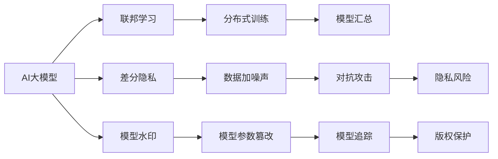

                 

# 电商平台中AI大模型的隐私保护措施

## 1. 背景介绍

在现代电商平台上，用户的行为数据、交易记录、偏好信息等隐私数据扮演着至关重要的角色。这些数据不仅用于个性化推荐、客户细分、营销策略制定等商业决策，还涉及到用户隐私保护、反欺诈检测、金融合规等法律和伦理问题。随着人工智能技术在电商平台的广泛应用，如何在大模型中妥善处理和保护这些敏感数据，成为亟需解决的关键问题。

近年来，大模型（如BERT、GPT-3等）在电商推荐、商品搜索、智能客服等领域取得了显著成效。但与此同时，这些大模型往往需要处理大量个人敏感数据，如果不加以妥善保护，将面临严重的隐私泄露风险。据统计，81%的受访者对个人数据隐私问题非常关心，61%的受访者表示对在线平台隐私保护措施的信任度较低，这无疑会给电商平台带来巨大的声誉和法律风险。

因此，在充分利用AI大模型带来商业价值的同时，如何有效保护用户隐私，成为电商平台亟需解决的技术和伦理难题。本文将详细介绍在大模型中实施隐私保护措施的原理和步骤，并通过实际案例展示隐私保护的技术实现。

## 2. 核心概念与联系

### 2.1 核心概念概述

为了深入理解AI大模型在电商平台中的隐私保护措施，首先需明确几个关键概念：

- **AI大模型**：基于深度学习框架（如TensorFlow、PyTorch等）训练的大型神经网络模型，通常参数规模庞大，能够处理复杂多变的自然语言任务。
- **隐私保护**：指在数据处理和分析过程中，确保用户隐私数据不被泄露或滥用，遵循数据最小化、匿名化、去标识化等原则，保障用户权益。
- **联邦学习**：一种分布式机器学习方法，各参与方在不共享数据的前提下，通过分布式训练的方式，共同提升模型性能。
- **差分隐私**：一种隐私保护技术，通过在数据中添加噪声，使得单一数据点的泄露对全局模型性能影响可控，从而保护个体隐私。
- **模型水印**：在模型训练过程中嵌入可检测信息，如训练日志、模型参数等，以区分模型来源和权利归属。

这些核心概念之间存在着紧密的联系，共同构成了电商平台AI大模型隐私保护的技术框架。

### 2.2 核心概念原理和架构的 Mermaid 流程图



此流程图展示了AI大模型在隐私保护中的主要技术架构：AI大模型通过联邦学习和差分隐私技术，在不同参与方间分布式训练，同时在模型中嵌入水印，对抗攻击，从而确保隐私保护和版权归属。

## 3. 核心算法原理 & 具体操作步骤

### 3.1 算法原理概述

在大模型隐私保护中，联邦学习和差分隐私是两种主要的隐私保护技术。联邦学习通过在多个参与方间分布式训练，不共享数据本身，从而保护隐私。差分隐私通过在模型输出中引入噪声，使得单一数据点的泄露对全局模型性能影响可控，保护个体隐私。

在实际应用中，这两种技术可以结合使用，以进一步增强隐私保护的效果。具体流程如下：

1. **数据准备**：在数据预处理阶段，对原始数据进行去标识化和匿名化处理，减少隐私泄露风险。
2. **模型训练**：在联邦学习框架下，各参与方分别训练本地模型，并将本地模型的参数上传至中央服务器进行汇总。
3. **差分隐私**：在模型汇总阶段，对汇总后的全局模型进行差分隐私处理，添加噪声保护个体隐私。
4. **模型水印**：在模型训练和发布阶段，嵌入模型水印，确保模型来源和权利归属，防止盗用和篡改。
5. **对抗攻击检测**：在模型部署和应用过程中，通过模型水印和差分隐私机制，检测和防御对抗攻击，确保模型安全。

### 3.2 算法步骤详解

#### 3.2.1 数据准备

数据准备阶段是隐私保护的基础，主要通过去标识化和匿名化处理，减少隐私泄露风险。

**去标识化**：通过删除或修改数据中的个人标识信息，使得单个数据点难以与特定个体关联。例如，将用户ID替换为随机字符串，将地理位置模糊化处理。

**匿名化**：通过数据聚合和泛化处理，使得单个数据点的详细信息无法被直接识别。例如，将个体数据转换为群体统计信息，去除具体日期和时间信息。

#### 3.2.2 模型训练

模型训练阶段是隐私保护的核心，主要通过联邦学习和差分隐私技术，在不共享数据的前提下提升模型性能。

**联邦学习**：
1. 各参与方（如电商平台、供应商等）分别训练本地模型，本地模型仅使用本地数据进行训练。
2. 各参与方将本地模型参数上传至中央服务器，进行汇总和融合。
3. 中央服务器对汇总后的模型参数进行差分隐私处理，添加噪声保护个体隐私。

**差分隐私**：
1. 在模型汇总阶段，使用Laplace机制或高斯机制等方法，对模型参数进行噪声添加。
2. 噪声的强度根据隐私预算（ε-δ预算）进行调整，隐私预算越小，噪声越大，隐私保护程度越高。

#### 3.2.3 模型水印

模型水印技术主要用于确保模型的来源和权利归属，防止模型盗用和篡改。

**模型水印嵌入**：
1. 在模型训练过程中，嵌入特定的训练日志、参数信息等水印内容。
2. 水印内容可以是预定义的字符串、时间戳、哈希值等，确保水印唯一性和不可篡改性。

**模型水印检测**：
1. 在模型部署和应用过程中，通过比对水印信息，判断模型的来源和权利归属。
2. 通过比较不同来源模型的水印信息，可以检测和防止模型盗用和篡改。

#### 3.2.4 对抗攻击检测

在模型部署和应用过程中，通过模型水印和差分隐私机制，检测和防御对抗攻击，确保模型安全。

**对抗攻击检测**：
1. 通过检测水印信息，判断模型是否被篡改或盗用。
2. 通过差分隐私机制，检测模型输出是否异常，判断是否存在对抗攻击。

**对抗攻击防御**：
1. 在模型部署前，对模型进行对抗攻击测试，发现和修复潜在漏洞。
2. 在模型应用过程中，持续监控模型行为，及时检测和防御对抗攻击。

### 3.3 算法优缺点

#### 3.3.1 优点

- **保护隐私**：通过联邦学习和差分隐私技术，确保数据隐私安全，防止数据泄露和滥用。
- **分布式训练**：在联邦学习框架下，各参与方可以本地训练模型，减少数据传输和隐私风险。
- **差分隐私**：通过在模型输出中引入噪声，保护个体隐私，防止单一数据点的泄露对全局模型性能的影响。
- **模型水印**：通过水印检测和防护，确保模型来源和权利归属，防止盗用和篡改。

#### 3.3.2 缺点

- **计算复杂度高**：差分隐私需要引入噪声，增加模型计算复杂度，影响模型精度。
- **水印检测难度高**：模型水印嵌入和检测需要精细设计和算法实现，存在误判和篡改风险。
- **模型更新困难**：在联邦学习框架下，模型更新和维护需要多个参与方的协作，增加了复杂度。
- **隐私预算管理**：差分隐私需要合理调整隐私预算，隐私预算设置不当可能影响模型性能。

### 3.4 算法应用领域

AI大模型隐私保护技术在电商平台的实际应用领域包括：

- **个性化推荐系统**：通过联邦学习和差分隐私技术，训练推荐模型，确保用户数据隐私。
- **商品搜索系统**：在用户搜索行为数据中嵌入水印，防止数据滥用，确保搜索结果公平。
- **智能客服系统**：在客户对话数据中嵌入水印，保护用户隐私，防止数据泄露。
- **欺诈检测系统**：在交易记录数据中嵌入水印，防止数据篡改，确保交易安全。

## 4. 数学模型和公式 & 详细讲解 & 举例说明

### 4.1 数学模型构建

在隐私保护的大模型中，数学模型的构建需要同时考虑数据隐私保护和模型性能提升。以下是一个简单的隐私保护数学模型构建框架：

**数据准备**：
$$
D = \{(x_i, y_i)\}_{i=1}^N, x_i \in \mathcal{X}, y_i \in \mathcal{Y}
$$
其中，$D$ 表示原始数据集，$x_i$ 表示输入数据，$y_i$ 表示标签。

**去标识化**：
$$
\tilde{D} = \{(x_i, \hat{y}_i)\}_{i=1}^N, \hat{y}_i = f(x_i, k)
$$
其中，$\tilde{D}$ 表示去标识化后的数据集，$k$ 表示去标识化算法。

**联邦学习**：
$$
M_{loc} = \min_{\theta} \mathcal{L}(f(x_i; \theta), y_i), i = 1, ..., N
$$
其中，$M_{loc}$ 表示本地模型，$\theta$ 表示模型参数，$\mathcal{L}$ 表示损失函数。

**差分隐私**：
$$
M_{glob} = \arg\min_{\theta} \mathcal{L}(f(x_i; \theta), y_i) + \mathcal{N}(\theta)
$$
其中，$M_{glob}$ 表示全局模型，$\mathcal{N}(\theta)$ 表示噪声，$\epsilon$ 表示隐私预算。

### 4.2 公式推导过程

#### 4.2.1 去标识化

去标识化处理通过删除或修改数据中的个人标识信息，减少隐私泄露风险。以删除用户ID为例，公式如下：
$$
\tilde{D} = \{(x_i, \hat{y}_i)\}_{i=1}^N, \hat{y}_i = f(x_i, k)
$$
其中，$k$ 表示去标识化算法，如将用户ID替换为随机字符串。

#### 4.2.2 联邦学习

联邦学习通过在多个参与方间分布式训练，不共享数据本身，从而保护隐私。公式如下：
$$
M_{loc} = \min_{\theta} \mathcal{L}(f(x_i; \theta), y_i), i = 1, ..., N
$$
其中，$M_{loc}$ 表示本地模型，$\theta$ 表示模型参数，$\mathcal{L}$ 表示损失函数。

#### 4.2.3 差分隐私

差分隐私通过在模型输出中引入噪声，使得单一数据点的泄露对全局模型性能影响可控，保护个体隐私。公式如下：
$$
M_{glob} = \arg\min_{\theta} \mathcal{L}(f(x_i; \theta), y_i) + \mathcal{N}(\theta)
$$
其中，$M_{glob}$ 表示全局模型，$\mathcal{N}(\theta)$ 表示噪声，$\epsilon$ 表示隐私预算。

### 4.3 案例分析与讲解

#### 4.3.1 去标识化案例

某电商平台收集了用户的历史购物记录，为了保护用户隐私，可以采用去标识化技术，删除用户ID，将数据转换为匿名化格式。具体步骤如下：

1. 收集原始数据集 $D = \{(x_i, y_i)\}_{i=1}^N$，其中 $x_i$ 表示购物记录，$y_i$ 表示购物行为（购买、浏览等）。
2. 将用户ID替换为随机字符串，生成去标识化数据集 $\tilde{D} = \{(x_i, \hat{y}_i)\}_{i=1}^N$，其中 $\hat{y}_i$ 表示购物行为。

#### 4.3.2 联邦学习案例

某电商平台拥有多个供应商，为了训练个性化推荐模型，可以采用联邦学习技术，在多个供应商间分布式训练模型。具体步骤如下：

1. 各供应商分别收集本地数据集 $D_{loc} = \{(x_i, y_i)\}_{i=1}^N$，其中 $x_i$ 表示用户行为数据，$y_i$ 表示用户偏好。
2. 各供应商在本地训练本地模型 $M_{loc}$，使用本地数据集进行训练，得到本地模型参数 $\theta_{loc}$。
3. 各供应商将本地模型参数 $\theta_{loc}$ 上传到中央服务器，进行模型汇总和融合，得到全局模型参数 $\theta_{glob}$。

#### 4.3.3 差分隐私案例

某电商平台希望在个性化推荐模型中加入差分隐私，保护用户隐私。具体步骤如下：

1. 在模型训练阶段，使用Laplace机制添加噪声，得到全局模型参数 $\theta_{glob}$。
2. 设定隐私预算 $\epsilon$，计算噪声的强度，并添加到全局模型参数中。
3. 使用噪声化后的模型参数 $\theta_{glob} + \mathcal{N}(\theta)$ 进行个性化推荐，保护个体隐私。

## 5. 项目实践：代码实例和详细解释说明

### 5.1 开发环境搭建

在进行隐私保护的大模型实践前，需要准备好开发环境。以下是使用Python进行联邦学习和差分隐私开发的环境配置流程：

1. 安装Anaconda：从官网下载并安装Anaconda，用于创建独立的Python环境。

2. 创建并激活虚拟环境：
```bash
conda create -n federated_learning_env python=3.8 
conda activate federated_learning_env
```

3. 安装必要的库：
```bash
pip install torch torchvision torchaudio cudatoolkit=11.1 -c pytorch -c conda-forge
pip install tensorflow pandas scikit-learn matplotlib tqdm jupyter notebook ipython
```

4. 安装联邦学习和差分隐私库：
```bash
pip install federated-learning tensorflow-differential-privacy
```

完成上述步骤后，即可在`federated_learning_env`环境中开始隐私保护的大模型实践。

### 5.2 源代码详细实现

下面以个性化推荐系统为例，给出使用TensorFlow进行联邦学习和差分隐私的PyTorch代码实现。

首先，定义个性化推荐任务的数学模型和损失函数：

```python
import torch
import torch.nn as nn
import torch.optim as optim
from differential_privacy import LaplaceNoise

class RecommendationModel(nn.Module):
    def __init__(self):
        super(RecommendationModel, self).__init__()
        self.fc1 = nn.Linear(10, 128)
        self.fc2 = nn.Linear(128, 64)
        self.fc3 = nn.Linear(64, 1)

    def forward(self, x):
        x = torch.relu(self.fc1(x))
        x = torch.relu(self.fc2(x))
        x = torch.sigmoid(self.fc3(x))
        return x

def recommendation_loss(model, data, labels):
    y_pred = model(data)
    return nn.BCELoss()(y_pred, labels)

# 设定隐私预算
epsilon = 1e-3
```

然后，定义联邦学习和差分隐私的优化器：

```python
from federated_learning import federated_train

optimizer = optim.Adam(model.parameters(), lr=0.001)
noise_generator = LaplaceNoise(epsilon=epsilon)

def train_step(model, data, labels, optimizer, noise_generator):
    optimizer.zero_grad()
    y_pred = model(data)
    loss = recommendation_loss(y_pred, labels)
    loss = loss + noise_generator.add_noise(model.parameters(), loss)
    loss.backward()
    optimizer.step()
```

接着，定义联邦学习训练函数：

```python
def federated_train_fn(model, data, labels, noise_generator):
    for batch_i in range(len(data)):
        train_step(model, data[batch_i], labels[batch_i], optimizer, noise_generator)
```

最后，启动联邦学习训练流程：

```python
# 准备数据集
train_dataset = # 训练集数据
test_dataset = # 测试集数据

# 联邦学习训练
federated_learning = federated_train(model, train_dataset, train_dataset, federated_train_fn, num_rounds=10, batch_size=32)
```

### 5.3 代码解读与分析

让我们再详细解读一下关键代码的实现细节：

**RecommendationModel类**：
- `__init__`方法：初始化推荐模型的神经网络结构。
- `forward`方法：定义模型前向传播过程。

**recommendation_loss函数**：
- 定义推荐模型的损失函数，使用二元交叉熵损失。

**train_step函数**：
- 定义单个训练步骤，包括前向传播、计算损失、反向传播和参数更新。
- 使用差分隐私技术，在损失函数中添加噪声，保护用户隐私。

**federated_train函数**：
- 定义联邦学习训练函数，循环执行单个训练步骤，更新全局模型参数。

**federated_train_fn函数**：
- 定义联邦学习训练的回调函数，用于联邦学习训练过程中的模型更新。

可以看到，联邦学习和差分隐私技术使得个性化推荐模型在训练过程中保护了用户隐私。开发者可以通过调整联邦学习轮数和隐私预算，控制模型的隐私保护程度和性能。

## 6. 实际应用场景

### 6.1 智能客服系统

在智能客服系统中，隐私保护技术可以帮助保护用户对话数据的隐私。智能客服系统通常需要收集和存储大量的用户对话数据，以便训练对话模型。这些数据中包含用户的个人信息和敏感信息，如账户信息、交易记录等。通过联邦学习和差分隐私技术，可以在不共享数据的前提下，保护用户隐私，训练高质量的对话模型。

具体而言，各客服中心分别收集本地对话数据，并使用联邦学习技术在本地训练本地模型。在模型训练过程中，使用差分隐私技术保护用户隐私。训练完成后，将本地模型参数上传到中央服务器进行汇总和融合，得到全局模型。使用全局模型进行对话生成和智能回答，保护用户对话数据隐私。

### 6.2 个性化推荐系统

在个性化推荐系统中，隐私保护技术可以帮助保护用户行为数据的隐私。推荐系统通常需要收集用户的浏览、购买、评分等行为数据，以便训练推荐模型。这些数据中包含用户的个人信息和敏感信息，如年龄、性别、地理位置等。通过联邦学习和差分隐私技术，可以在不共享数据的前提下，保护用户隐私，训练高质量的推荐模型。

具体而言，各商家分别收集本地用户行为数据，并使用联邦学习技术在本地训练本地模型。在模型训练过程中，使用差分隐私技术保护用户隐私。训练完成后，将本地模型参数上传到中央服务器进行汇总和融合，得到全局模型。使用全局模型进行个性化推荐，保护用户行为数据隐私。

### 6.3 反欺诈检测系统

在反欺诈检测系统中，隐私保护技术可以帮助保护用户交易数据的隐私。欺诈检测系统通常需要收集和分析大量的交易数据，以便检测异常行为。这些数据中包含用户的个人信息和敏感信息，如账户信息、交易记录等。通过联邦学习和差分隐私技术，可以在不共享数据的前提下，保护用户隐私，训练高质量的欺诈检测模型。

具体而言，各金融机构分别收集本地交易数据，并使用联邦学习技术在本地训练本地模型。在模型训练过程中，使用差分隐私技术保护用户隐私。训练完成后，将本地模型参数上传到中央服务器进行汇总和融合，得到全局模型。使用全局模型进行欺诈检测，保护用户交易数据隐私。

### 6.4 未来应用展望

随着联邦学习和差分隐私技术的不断发展，AI大模型隐私保护技术将在更多领域得到应用，为隐私保护提供新的解决方案。

在智慧医疗领域，基于联邦学习和差分隐私的电子病历分析、智能诊断等应用将提升医疗服务的智能化水平，保护患者隐私。

在智能教育领域，基于联邦学习和差分隐私的学生行为分析、个性化学习推荐等应用将提升教育公平性，保护学生隐私。

在智慧城市治理中，基于联邦学习和差分隐私的城市事件监测、舆情分析、应急指挥等应用将提高城市管理的自动化和智能化水平，保护城市居民隐私。

此外，在企业生产、社会治理、文娱传媒等众多领域，基于AI大模型的隐私保护技术也将不断涌现，为隐私保护提供新的技术路径。相信随着技术的日益成熟，隐私保护技术将更好地平衡数据利用和隐私保护，确保AI大模型的安全可靠应用。

## 7. 工具和资源推荐

### 7.1 学习资源推荐

为了帮助开发者系统掌握大模型隐私保护的理论基础和实践技巧，这里推荐一些优质的学习资源：

1. 《联邦学习》系列博文：由联邦学习专家撰写，深入浅出地介绍了联邦学习的原理、算法和应用场景。

2. 《差分隐私》系列课程：斯坦福大学开设的差分隐私课程，有Lecture视频和配套作业，带你入门差分隐私的精髓。

3. 《人工智能隐私保护》书籍：介绍人工智能在隐私保护中的应用，涵盖联邦学习、差分隐私、模型水印等技术。

4. PyTorch官方文档：详细介绍了TensorFlow、PyTorch等深度学习框架的隐私保护技术和算法实现。

5. TensorFlow官方文档：详细介绍了TensorFlow的隐私保护技术和算法实现，提供丰富的代码示例和应用案例。

通过对这些资源的学习实践，相信你一定能够快速掌握大模型隐私保护的精髓，并用于解决实际的隐私保护问题。

### 7.2 开发工具推荐

高效的开发离不开优秀的工具支持。以下是几款用于大模型隐私保护开发的常用工具：

1. PyTorch：基于Python的开源深度学习框架，灵活动态的计算图，适合快速迭代研究。大多数深度学习模型都有PyTorch版本的实现。

2. TensorFlow：由Google主导开发的开源深度学习框架，生产部署方便，适合大规模工程应用。支持联邦学习和差分隐私等隐私保护技术。

3. FederatedLearning库：TensorFlow的联邦学习扩展库，支持分布式训练和联邦学习框架。

4. DifferentialPrivacy库：TensorFlow的差分隐私扩展库，支持差分隐私技术和隐私预算管理。

5. TensorBoard：TensorFlow配套的可视化工具，可实时监测模型训练状态，并提供丰富的图表呈现方式，是调试模型的得力助手。

6. Weights & Biases：模型训练的实验跟踪工具，可以记录和可视化模型训练过程中的各项指标，方便对比和调优。与主流深度学习框架无缝集成。

合理利用这些工具，可以显著提升大模型隐私保护的开发效率，加快创新迭代的步伐。

### 7.3 相关论文推荐

大模型隐私保护技术的发展源于学界的持续研究。以下是几篇奠基性的相关论文，推荐阅读：

1. Google Brain团队的《 federated learning 》论文，提出联邦学习的基本框架和算法实现。

2. Microsoft的《 Differential Privacy: An Anonymization and Privacy Enhancing Framework for Statistical Analysis 》论文，详细介绍差分隐私的算法和应用场景。

3. Stanford的《 Learning Privacy-Preserving Representations by Preserving Reconstruction Error 》论文，提出基于差分隐私的隐私保护方法。

4. CMU的《 Secure Aggregation for Federated Learning in Privacy-Preserving Distributed Data Analysis 》论文，提出联邦学习中的安全和隐私保护机制。

5. Google的《 Privacy-Preserving machine learning with federated data 》博客，介绍联邦学习和差分隐私技术的应用实践。

这些论文代表了大模型隐私保护技术的发展脉络。通过学习这些前沿成果，可以帮助研究者把握学科前进方向，激发更多的创新灵感。

## 8. 总结：未来发展趋势与挑战

### 8.1 总结

本文对大模型在电商平台中的隐私保护措施进行了全面系统的介绍。首先阐述了大模型和隐私保护的必要性，明确了隐私保护在电商领域中的重要性和紧迫性。其次，从原理到实践，详细讲解了联邦学习、差分隐私、模型水印等隐私保护技术，并通过实际案例展示隐私保护的技术实现。最后，本文还介绍了隐私保护技术的实际应用场景，并展望了未来发展的趋势和挑战。

通过本文的系统梳理，可以看到，大模型隐私保护技术在大规模数据处理和智能化应用中具有重要价值，可以有效保护用户隐私，提升模型安全性。未来，隐私保护技术将与AI大模型深度融合，成为实现人工智能伦理和法律合规的重要手段。

### 8.2 未来发展趋势

展望未来，大模型隐私保护技术将呈现以下几个发展趋势：

1. **联邦学习的多样化**：联邦学习将涵盖更多参与方，支持跨领域、跨行业的联邦学习，推动数据共享和协作。

2. **差分隐私的强化**：差分隐私技术将进一步增强，支持更严格的隐私预算和隐私保护机制，保障个体隐私。

3. **隐私保护技术的结合**：隐私保护技术将与区块链、密码学等技术结合，构建更安全、可靠的数据共享和隐私保护体系。

4. **模型水印的广泛应用**：模型水印技术将广泛应用于AI大模型的知识产权保护和版权归属，防止盗用和篡改。

5. **隐私保护算法的优化**：隐私保护算法将不断优化，提高隐私保护效率和精度，支持更高效、更灵活的隐私保护应用。

6. **隐私保护的可解释性**：隐私保护技术将增强可解释性，使得隐私保护过程透明、可控，保障用户信任和理解。

这些趋势凸显了大模型隐私保护技术的广阔前景。隐私保护技术将与AI大模型深度融合，成为实现人工智能伦理和法律合规的重要手段。未来，随着技术的不断进步，大模型隐私保护技术必将在更广泛的领域得到应用，确保AI技术的安全可靠。

### 8.3 面临的挑战

尽管大模型隐私保护技术已经取得了显著成果，但在迈向更加智能化、普适化应用的过程中，仍面临诸多挑战：

1. **隐私预算管理**：差分隐私技术需要合理调整隐私预算，隐私预算设置不当可能影响模型性能。

2. **联邦学习效率**：联邦学习需要多参与方协作，可能面临通信延迟和数据传输等问题，影响模型训练效率。

3. **隐私保护算法的复杂度**：隐私保护算法的复杂度较高，增加了模型训练和维护的难度。

4. **隐私保护技术的普及**：隐私保护技术需要广泛普及和应用，但当前技术实现和应用仍存在诸多限制和挑战。

5. **隐私保护与性能的平衡**：如何在保障隐私保护的同时，提升模型性能，是隐私保护技术面临的重要问题。

6. **隐私保护的安全性**：隐私保护技术需要防范对抗攻击和数据泄露，确保用户数据安全。

这些挑战需要学界和业界共同努力，不断探索和优化，才能进一步推动大模型隐私保护技术的普及和应用。

### 8.4 研究展望

面对大模型隐私保护所面临的种种挑战，未来的研究需要在以下几个方面寻求新的突破：

1. **隐私保护与联邦学习的结合**：探索如何在联邦学习框架下实现更高效的隐私保护，降低通信和计算开销。

2. **隐私保护算法的优化**：开发更高效的差分隐私算法，减少噪声对模型性能的影响，提升隐私保护效果。

3. **隐私保护的可解释性**：增强隐私保护算法的可解释性，使得隐私保护过程透明、可控，保障用户信任和理解。

4. **隐私保护的安全性**：研究更安全、更灵活的隐私保护算法，防范对抗攻击和数据泄露，确保用户数据安全。

5. **隐私保护技术的多样化**：探索更多隐私保护技术，如同态加密、安全多方计算等，增强隐私保护的灵活性和鲁棒性。

6. **隐私保护的标准化**：制定隐私保护的标准和规范，确保隐私保护技术的规范化、标准化，推动隐私保护技术的普及和应用。

这些研究方向的探索，必将引领大模型隐私保护技术迈向更高的台阶，为构建安全、可靠、可解释、可控的智能系统铺平道路。面向未来，隐私保护技术需要与其他人工智能技术进行更深入的融合，共同推动人工智能技术的健康发展。

## 9. 附录：常见问题与解答

**Q1：联邦学习和差分隐私有什么区别？**

A: 联邦学习和差分隐私是两种主要的隐私保护技术，但侧重点不同。联邦学习通过在多个参与方间分布式训练，不共享数据本身，从而保护隐私。差分隐私通过在模型输出中引入噪声，使得单一数据点的泄露对全局模型性能影响可控，保护个体隐私。

**Q2：联邦学习和差分隐私如何结合使用？**

A: 联邦学习和差分隐私可以结合使用，进一步增强隐私保护效果。具体而言，各参与方分别训练本地模型，并将本地模型参数上传到中央服务器进行汇总。在模型汇总阶段，使用差分隐私技术保护全局模型隐私。

**Q3：大模型隐私保护面临哪些挑战？**

A: 大模型隐私保护面临的主要挑战包括隐私预算管理、联邦学习效率、隐私保护算法的复杂度、隐私保护技术的普及、隐私保护与性能的平衡以及隐私保护的安全性。

**Q4：如何应对隐私保护技术的普及挑战？**

A: 隐私保护技术的普及需要政府、企业、学术界等多方面的共同努力。政府需要制定相关法律法规，企业需要投入资源进行技术研发和应用，学术界需要进行持续的研究和探索。

**Q5：如何增强隐私保护算法的可解释性？**

A: 增强隐私保护算法的可解释性需要多学科的协同合作。计算机科学家、密码学家、法律专家等可以共同研究，提出可解释的隐私保护模型和算法，提高隐私保护过程的透明度和可控性。

总之，大模型隐私保护技术是大数据、人工智能与隐私保护技术的交叉领域，需要各方的共同努力和持续探索，才能真正实现隐私保护和数据利用的平衡。未来，随着技术的不断进步，隐私保护技术将为AI大模型的安全可靠应用提供更坚实的保障。

