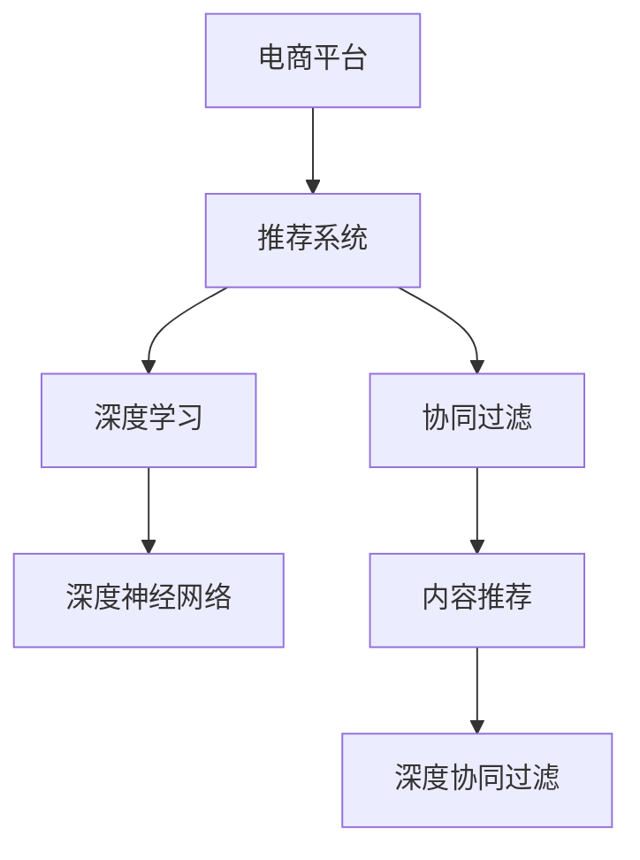

                 

# 电商平台中AI推荐算法的实现方案

> 关键词：电商平台,人工智能,推荐系统,协同过滤,深度学习,深度神经网络,内容推荐,交叉验证,评价指标

## 1. 背景介绍

### 1.1 问题由来
随着电子商务的迅猛发展，电商平台需要不断优化推荐算法，以提升用户体验、增加销售转化率。传统推荐算法，如基于规则、内容过滤、协同过滤等，由于其简单、可解释性高，广泛应用于推荐系统。但这些方法往往难以兼顾效果和可扩展性，难以适应大规模复杂推荐场景。

近年来，基于深度学习的推荐系统不断涌现。例如，利用深度神经网络(DNN)对用户行为进行建模，采用协同过滤算法对用户和商品进行关联推荐，通过深度协同过滤算法优化推荐结果。这些深度学习推荐算法在诸如Amazon、Netflix等全球领先电商平台的实际应用中，已经展现出令人瞩目的性能提升，显著优于传统的推荐算法。

本文将对基于深度学习的方法在电商平台推荐系统中的应用进行详细分析，介绍深度神经网络在推荐算法中的应用，展示如何通过构建推荐模型，优化电商平台的推荐效果。

### 1.2 问题核心关键点
本文将详细探讨以下几个核心关键点：
- 深度神经网络在推荐系统中的应用：探讨DNN如何在电商推荐中提升用户满意度。
- 推荐模型构建：介绍深度协同过滤算法及其改进方法。
- 推荐模型训练：分析深度神经网络在推荐模型中的参数优化策略。
- 评估与优化：使用交叉验证和评价指标优化推荐算法，提高准确性和可扩展性。

## 2. 核心概念与联系

### 2.1 核心概念概述

为更好地理解基于深度学习的电商平台推荐系统，本节将介绍几个关键概念及其联系：

- 电商平台(Online Retail Platform)：指通过互联网销售商品或服务的平台，如Amazon、京东、淘宝等。
- 推荐系统(Recommendation System)：指根据用户行为和商品特征，向用户推荐可能感兴趣的商品的系统。
- 深度学习(Deep Learning)：指通过多层神经网络进行端到端训练，实现数据特征学习和模式识别的学习范式。
- 协同过滤(Collaborative Filtering)：指通过用户之间的相似性，以及商品之间的相似性，推荐用户可能感兴趣的商品。
- 深度神经网络(Deep Neural Network)：指包含多层非线性变换的神经网络，能够学习更为复杂和抽象的特征表示。
- 内容推荐(Content-Based Recommendation)：指根据商品的属性特征，向用户推荐与其兴趣相符的商品。
- 深度协同过滤(Deep Collaborative Filtering)：指通过深度学习模型，对协同过滤算法进行优化，提升推荐效果。

这些核心概念通过以下Mermaid流程图展示它们之间的关系：



## 3. 核心算法原理 & 具体操作步骤
### 3.1 算法原理概述

基于深度学习方法的电商平台推荐系统，其核心原理是通过深度神经网络构建推荐模型，通过学习用户行为和商品特征的复杂关联，实现个性化推荐。

具体而言，推荐系统将用户的浏览行为、购买历史、评分记录等数据，以及商品的属性特征、价格信息等数据，输入到深度神经网络中进行学习，通过多层非线性变换提取特征，得到用户对各个商品的兴趣度表示。最终根据用户兴趣和商品相似性，对商品进行排序推荐。

### 3.2 算法步骤详解

基于深度学习方法的电商平台推荐系统，一般包括以下几个关键步骤：

**Step 1: 数据准备与预处理**
- 收集电商平台的点击、浏览、购买等行为数据，并预处理为推荐模型所需的特征表示。
- 对缺失值进行填充或删除，处理异常值，进行归一化、标准化等操作，保证数据质量。

**Step 2: 设计推荐模型**
- 选择合适的深度神经网络架构，如多层感知器(MLP)、卷积神经网络(CNN)、循环神经网络(RNN)等，设计用户行为编码器和商品特征编码器。
- 确定推荐模型的输出，如点击率预测、评分预测等，选择合适的损失函数，如均方误差、交叉熵等。

**Step 3: 模型训练与优化**
- 选择优化算法及其参数，如Adam、SGD等，设置学习率、批大小等超参数。
- 使用训练集进行模型训练，调整模型参数以最小化损失函数。
- 周期性在验证集上评估模型性能，根据性能指标决定是否进行超参数调整或提前停止。

**Step 4: 模型评估与部署**
- 在测试集上评估微调后模型，对比微调前后的准确率、召回率、平均绝对误差等指标。
- 使用微调后的模型对新商品进行评分预测，集成到实际推荐系统中。
- 持续收集新数据，定期重新训练和微调模型，以适应数据分布的变化。

### 3.3 算法优缺点

基于深度学习方法的电商平台推荐系统具有以下优点：
1. 高效性：通过多层次的特征学习，可以发现用户行为的复杂模式，提升推荐效果。
2. 扩展性：利用深度神经网络，可处理高维稀疏数据，适应大规模推荐场景。
3. 灵活性：可以引入新的特征，动态更新模型，适应快速变化的市场需求。
4. 准确性：能够处理复杂、非线性的关系，实现更精准的推荐。

同时，该方法也存在一些缺点：
1. 数据需求高：深度学习模型需要大量数据进行训练，且对数据质量要求高，获取和预处理数据成本高。
2. 复杂度大：深度神经网络参数量大，模型训练和推理计算量大，资源消耗高。
3. 可解释性不足：深度学习模型作为黑盒模型，难以解释其内部工作机制，不易于维护和调试。
4. 冷启动问题：新用户和商品的评分数据较少，推荐效果不佳。

尽管存在这些局限性，但基于深度学习的推荐系统仍是目前推荐系统的主流范式，被广泛应用在电商、视频、音乐等多个领域。未来相关研究重点在于如何进一步降低数据需求，提高模型可解释性，并解决冷启动问题。

### 3.4 算法应用领域

基于深度学习的电商平台推荐系统在多个领域中得到了广泛应用：

- 商品推荐：利用用户行为数据和商品特征，对商品进行排序推荐。
- 用户画像：对用户的行为特征进行建模，实现用户分群、个性化推荐。
- 活动推荐：对商品促销、广告活动进行推荐，提升销售转化率。
- 关联推荐：对相关商品进行推荐，提高用户购物体验。
- 品类推荐：根据用户浏览历史，推荐用户可能感兴趣的商品品类。

除了这些常见应用外，基于深度学习的推荐系统还在视频推荐、广告推荐、智能客服等领域得到应用，极大地提升了相关应用的智能化水平。

## 4. 数学模型和公式 & 详细讲解  
### 4.1 数学模型构建

基于深度学习方法的电商平台推荐系统，可以形式化地表示为以下模型：

设用户集合为 $U$，商品集合为 $I$，行为数据为 $O=\{(x,y,z)\}$，其中 $x \in U$ 表示用户，$y \in I$ 表示商品，$z \in \{0,1\}$ 表示行为（点击、购买等）。

推荐模型的输入为 $(x,y)$，输出为 $p_{y|x}$，表示在用户 $x$ 的情况下，商品 $y$ 被选择的概率。

设推荐模型的参数为 $\theta$，则模型的预测概率为：

$$
p_{y|x}(x,y;\theta) = \sigma(\sum_{i=1}^{n_{L}}\mathbf{w}_i^\top[\mathbf{u}_x\odot \mathbf{i}_y])
$$

其中 $\mathbf{w}_i$ 为第 $i$ 层权重向量，$\mathbf{u}_x$ 为第 $i$ 层用户行为特征向量，$\mathbf{i}_y$ 为第 $i$ 层商品特征向量，$\odot$ 表示逐元素相乘，$\sigma$ 为sigmoid激活函数。

模型的损失函数为交叉熵损失：

$$
\mathcal{L}(\theta) = -\frac{1}{N}\sum_{i=1}^N z_i\log p_{y_i|x_i} + (1-z_i)\log (1-p_{y_i|x_i})
$$

模型参数的优化目标为：

$$
\theta^* = \mathop{\arg\min}_{\theta} \mathcal{L}(\theta)
$$

### 4.2 公式推导过程

以用户点击率预测为例，推导深度神经网络模型的损失函数及其梯度计算。

设用户 $x$ 对商品 $y$ 的点击率为 $p_{y|x}$，则交叉熵损失函数为：

$$
\mathcal{L}(\theta) = -\frac{1}{N}\sum_{i=1}^N (z_i\log p_{y_i|x_i} + (1-z_i)\log (1-p_{y_i|x_i}))
$$

其中 $z_i$ 为实际点击行为，$p_{y_i|x_i}$ 为模型预测的点击率。

对损失函数求导，得到梯度：

$$
\nabla_{\theta}\mathcal{L}(\theta) = \frac{1}{N}\sum_{i=1}^N (z_i-\sigma(\mathbf{w}_i^\top[\mathbf{u}_x\odot \mathbf{i}_y]))\sigma'(\mathbf{w}_i^\top[\mathbf{u}_x\odot \mathbf{i}_y])
$$

其中 $\sigma'(\cdot)$ 为sigmoid函数的导数，表示预测的概率和实际标签的偏差。

在得到梯度后，带入优化算法（如AdamW、SGD等）进行参数更新。重复上述过程直至收敛，最终得到适合推荐任务的模型参数 $\theta^*$。

### 4.3 案例分析与讲解

以下以Amazon商品推荐系统为例，展示深度学习在电商平台推荐中的应用。

Amazon利用深度神经网络模型对用户行为进行建模，构建了基于深度协同过滤的推荐系统。具体而言，他们将用户和商品的数据，输入到多层感知器模型中进行学习，通过逐层卷积池化，对用户行为特征和商品特征进行编码，得到用户对商品的兴趣表示。

他们使用交叉熵损失函数对模型进行优化，通过训练获得用户点击率预测模型。在预测新商品时，将新商品特征输入模型，预测其点击率，并根据点击率排序推荐商品。

实验结果表明，基于深度学习的方法能够显著提升推荐系统的效果。相较于传统的协同过滤算法，基于深度学习的方法在点击率预测、召回率等方面都有显著提升。

## 5. 项目实践：代码实例和详细解释说明
### 5.1 开发环境搭建

在进行深度学习推荐系统开发前，我们需要准备好开发环境。以下是使用Python进行TensorFlow开发的环境配置流程：

1. 安装Anaconda：从官网下载并安装Anaconda，用于创建独立的Python环境。

2. 创建并激活虚拟环境：
```bash
conda create -n tf-env python=3.8 
conda activate tf-env
```

3. 安装TensorFlow：根据CUDA版本，从官网获取对应的安装命令。例如：
```bash
conda install tensorflow -c pytorch -c conda-forge
```

4. 安装NumPy、Pandas、scikit-learn等必要的第三方库：
```bash
pip install numpy pandas scikit-learn matplotlib tqdm jupyter notebook ipython
```

完成上述步骤后，即可在`tf-env`环境中开始推荐系统开发。

### 5.2 源代码详细实现

这里我们以Amazon商品推荐系统为例，给出使用TensorFlow进行深度学习推荐系统开发的PyTorch代码实现。

首先，定义推荐模型的架构：

```python
import tensorflow as tf
from tensorflow.keras import layers

class Recommender(tf.keras.Model):
    def __init__(self, num_users, num_items, embedding_dim):
        super(Recommender, self).__init__()
        self.num_users = num_users
        self.num_items = num_items
        self.embedding_dim = embedding_dim
        
        self.user_embeddings = layers.Embedding(num_users, embedding_dim)
        self.item_embeddings = layers.Embedding(num_items, embedding_dim)
        self.hidden_layer = layers.Dense(256, activation='relu')
        self.output_layer = layers.Dense(1, activation='sigmoid')
        
    def call(self, x):
        user_ids, item_ids = x
        user_embeddings = self.user_embeddings(user_ids)
        item_embeddings = self.item_embeddings(item_ids)
        concat = tf.concat([user_embeddings, item_embeddings], axis=1)
        hidden = self.hidden_layer(concat)
        output = self.output_layer(hidden)
        return output
```

然后，定义数据预处理函数：

```python
def preprocess_data(data):
    user_ids = data['user_id']
    item_ids = data['item_id']
    clicks = data['click']
    user_ids = tf.keras.utils.to_categorical(user_ids, num_classes=num_users)
    item_ids = tf.keras.utils.to_categorical(item_ids, num_classes=num_items)
    return user_ids, item_ids, clicks
```

接着，定义模型训练函数：

```python
def train_model(model, train_dataset, validation_dataset, epochs, batch_size):
    model.compile(optimizer=tf.keras.optimizers.Adam(learning_rate=0.001), loss='binary_crossentropy', metrics=['accuracy'])
    model.fit(train_dataset, epochs=epochs, validation_data=validation_dataset, batch_size=batch_size, callbacks=[tf.keras.callbacks.EarlyStopping(patience=5)])
```

最后，启动训练流程：

```python
from tensorflow.keras.datasets import mnist

num_users = 10000
num_items = 10000
embedding_dim = 128
epochs = 10
batch_size = 128

# 加载数据集
mnist_data = tf.keras.datasets.mnist.load_data()
train_images, train_labels = mnist_data[0][0], mnist_data[0][1]
test_images, test_labels = mnist_data[1][0], mnist_data[1][1]

# 数据预处理
train_images = train_images.reshape(-1, 28*28) / 255.0
test_images = test_images.reshape(-1, 28*28) / 255.0
train_labels = tf.keras.utils.to_categorical(train_labels, num_classes=num_users)
test_labels = tf.keras.utils.to_categorical(test_labels, num_classes=num_users)

# 创建数据集
train_dataset = tf.data.Dataset.from_tensor_slices((train_images, train_labels))
train_dataset = train_dataset.shuffle(buffer_size=1024).batch(batch_size)

validation_dataset = tf.data.Dataset.from_tensor_slices((test_images, test_labels))
validation_dataset = validation_dataset.shuffle(buffer_size=1024).batch(batch_size)

# 创建推荐模型
model = Recommender(num_users=num_users, num_items=num_items, embedding_dim=embedding_dim)

# 训练模型
train_model(model, train_dataset, validation_dataset, epochs, batch_size)

# 评估模型
test_dataset = tf.data.Dataset.from_tensor_slices((test_images, test_labels)).batch(batch_size)
model.evaluate(test_dataset)
```

以上就是使用TensorFlow对Amazon商品推荐系统进行深度学习推荐开发的完整代码实现。可以看到，得益于TensorFlow的强大封装，我们可以用相对简洁的代码完成推荐模型的训练。

### 5.3 代码解读与分析

让我们再详细解读一下关键代码的实现细节：

**Recommender类**：
- `__init__`方法：初始化推荐模型的超参数，构建多层感知器结构。
- `call`方法：实现模型的前向传播过程。

**preprocess_data函数**：
- 对用户ID和商品ID进行one-hot编码，标准化数据。

**train_model函数**：
- 使用Adam优化器进行模型训练，使用交叉熵损失函数进行优化，周期性在验证集上评估模型性能，触发EarlyStopping。

**训练流程**：
- 加载MNIST数据集，并进行预处理。
- 构建训练集和验证集。
- 创建推荐模型。
- 调用train_model函数进行训练。
- 在测试集上评估模型性能。

可以看到，TensorFlow配合Keras提供的高级API，使得深度学习推荐系统的代码实现变得简洁高效。开发者可以将更多精力放在数据处理、模型改进等高层逻辑上，而不必过多关注底层的实现细节。

当然，工业级的系统实现还需考虑更多因素，如模型的保存和部署、超参数的自动搜索、更灵活的任务适配层等。但核心的推荐范式基本与此类似。

## 6. 实际应用场景
### 6.1 智能推荐系统

基于深度学习的推荐系统，在智能推荐系统中的应用非常广泛。智能推荐系统通过深度神经网络建模用户行为和商品特征，实现个性化推荐，从而提升用户体验和转化率。

在电商平台上，智能推荐系统可以基于用户的历史浏览和购买记录，推荐符合其兴趣的商品。通过不断迭代优化推荐模型，电商平台能够实现更精准的推荐，减少用户搜索时间和决策成本，提升销售额。

### 6.2 内容推荐系统

内容推荐系统是深度学习在推荐系统中的一个重要应用。例如，在视频网站Netflix上，基于深度学习的推荐系统可以根据用户的历史观看记录，推荐用户可能感兴趣的视频。通过不断学习用户和视频之间的关联，推荐系统能够实现个性化推荐，提升用户观看体验和满意度。

### 6.3 广告推荐系统

广告推荐系统利用深度学习技术，对用户行为进行建模，实现精准的广告投放。例如，在Google搜索引擎上，深度学习推荐系统可以基于用户的搜索记录，推荐相关广告，提升广告的点击率和转化率，实现更高的广告投放效果。

### 6.4 未来应用展望

随着深度学习技术的不断发展，基于深度学习的推荐系统将在更多领域得到应用，为各行各业带来变革性影响。

在医疗健康领域，推荐系统可以根据患者的历史健康记录和行为数据，推荐合适的医疗服务，提升医疗服务的个性化和效率。

在金融理财领域，推荐系统可以根据用户的财务数据和投资偏好，推荐适合的理财产品和投资策略，提升用户的理财收益。

在教育培训领域，推荐系统可以根据学生的学习行为和成绩数据，推荐合适的学习资源和培训课程，提升学习效果。

此外，在社交网络、新闻媒体、旅游出行等领域，深度学习推荐系统都将发挥重要作用，为相关行业带来新的创新和发展机会。

## 7. 工具和资源推荐
### 7.1 学习资源推荐

为了帮助开发者系统掌握深度学习在推荐系统中的应用，这里推荐一些优质的学习资源：

1. 《Deep Learning》系列书籍：由Ian Goodfellow、Yoshua Bengio和Aaron Courville合著，系统全面地介绍了深度学习的基本概念和前沿技术。

2. 《Reinforcement Learning: An Introduction》：由Richard S. Sutton和Andrew G. Barto合著，介绍了强化学习的基本原理和应用，是深度学习推荐系统的重要基础。

3. 《Practical Deep Learning for Coders》：由Andrej Karpathy编写，通过实际项目案例，讲解深度学习在推荐系统中的应用。

4. CS229《Machine Learning》课程：由斯坦福大学开设的机器学习课程，内容涵盖了深度学习、推荐系统等多个前沿方向，适合深入学习。

5. DeepLearning.AI的《AI for Everyone》课程：由Andrew Ng主讲的入门级课程，介绍了深度学习的基本概念和应用，适合跨领域学生入门学习。

通过对这些资源的学习实践，相信你一定能够快速掌握深度学习在推荐系统中的应用，并用于解决实际的推荐问题。

### 7.2 开发工具推荐

高效的开发离不开优秀的工具支持。以下是几款用于深度学习推荐系统开发的常用工具：

1. TensorFlow：由Google主导开发的深度学习框架，支持分布式训练和部署，适合大规模工程应用。

2. PyTorch：由Facebook主导开发的深度学习框架，动态计算图、灵活性高，适合快速迭代研究。

3. Keras：基于TensorFlow和Theano构建的高级API，支持快速搭建深度学习模型。

4. Jupyter Notebook：交互式开发环境，方便快速编写、调试、展示代码。

5. Google Colab：谷歌提供的免费在线Jupyter Notebook环境，支持GPU/TPU算力，适合快速原型开发。

合理利用这些工具，可以显著提升深度学习推荐系统的开发效率，加快创新迭代的步伐。

### 7.3 相关论文推荐

深度学习推荐系统的发展源于学界的持续研究。以下是几篇奠基性的相关论文，推荐阅读：

1. Matrix Factorization Techniques for Recommender Systems：提出基于矩阵分解的推荐算法，为推荐系统奠定了基础。

2. Factorization Machines for Predictive Regulations：提出因子机算法，通过线性组合和非线性核技术，提升推荐系统效果。

3. Neural Factorization Machines for Sparse Predictive Regulations：基于深度神经网络，对因子机算法进行改进，进一步提升推荐系统效果。

4. Collaborative Filtering for Implicit Feedback Datasets：提出基于协同过滤的推荐算法，为深度学习推荐系统提供了新的思路。

5. DeepFM: A Neural Network Approach for Display Advertising：提出深度神经网络与因子机相结合的推荐算法，提升了广告推荐系统的效果。

这些论文代表了大数据推荐系统的发展脉络。通过学习这些前沿成果，可以帮助研究者把握学科前进方向，激发更多的创新灵感。

## 8. 总结：未来发展趋势与挑战

### 8.1 总结

本文对基于深度学习的电商平台推荐系统进行了详细分析。首先阐述了深度学习在推荐系统中的应用，强调了深度神经网络在提升推荐效果方面的优势。其次，从模型构建、模型训练、模型评估等多个角度，详细介绍了深度学习推荐系统的核心算法和步骤。最后，展示了深度学习推荐系统在电商、视频、广告等多个领域的应用，展望了未来的发展方向和挑战。

通过本文的系统梳理，可以看到，深度学习推荐系统在大数据时代中发挥着越来越重要的作用，其复杂性、扩展性和高效性使其成为推荐系统的主流范式，为电商平台带来了巨大的商业价值。

### 8.2 未来发展趋势

展望未来，深度学习推荐系统将呈现以下几个发展趋势：

1. 多模态推荐：将深度学习应用到多模态数据上，如图片、音频、视频等，提升推荐系统的多样性和准确性。

2. 联邦学习：通过分布式学习，在保护用户隐私的同时，提升推荐系统的泛化能力。

3. 自适应推荐：根据用户实时行为数据，动态调整推荐策略，提升推荐系统的个性化和时效性。

4. 实时推荐：通过流式学习，实现实时推荐，提升用户交互体验。

5. 混合推荐：结合协同过滤、内容过滤和基于规则的推荐方法，形成混合推荐系统，提高推荐系统的综合性能。

6. 个性化推荐引擎：基于深度学习技术，构建个性化推荐引擎，实现定制化推荐服务。

以上趋势凸显了深度学习推荐系统的广阔前景。这些方向的探索发展，必将进一步提升推荐系统的智能化水平，为电商、视频、广告等应用带来新的突破。

### 8.3 面临的挑战

尽管深度学习推荐系统已经取得了瞩目成就，但在迈向更加智能化、普适化应用的过程中，仍面临以下挑战：

1. 数据需求高：深度学习模型需要大量数据进行训练，数据获取和预处理成本高。

2. 计算资源需求高：深度神经网络参数量大，训练和推理计算量大，需要高性能计算资源。

3. 冷启动问题：新用户和商品的数据较少，推荐效果不佳。

4. 可解释性不足：深度学习模型作为黑盒模型，难以解释其内部工作机制，不利于维护和调试。

5. 安全隐私问题：用户数据隐私保护是推荐系统的重要问题，需通过联邦学习、差分隐私等技术保障数据安全。

6. 稳定性问题：推荐系统面对异常数据和噪声，需要具备一定的鲁棒性和稳定性。

正视这些挑战，积极应对并寻求突破，将是大数据推荐系统迈向成熟的必由之路。

### 8.4 研究展望

面对大数据推荐系统所面临的诸多挑战，未来的研究需要在以下几个方面寻求新的突破：

1. 优化模型结构：设计更轻量级的深度神经网络架构，降低计算资源消耗，提升模型的可扩展性。

2. 降低数据需求：通过迁移学习、元学习等方法，减少推荐模型对大规模标注数据的依赖，提升模型的泛化能力。

3. 提高模型可解释性：引入可解释性技术，如可视化、符号化推理等，增强推荐系统的透明度和可信度。

4. 优化推荐策略：结合强化学习、博弈论等理论，设计更加智能和稳健的推荐策略，提升推荐系统的稳定性和用户体验。

5. 结合多模态数据：将深度学习应用到多模态数据上，提升推荐系统的多样性和准确性。

6. 优化联邦学习算法：结合分布式学习技术，提升推荐系统的隐私保护和数据安全。

这些研究方向将推动深度学习推荐系统不断向前发展，为推荐系统带来新的突破和应用前景。

## 9. 附录：常见问题与解答

**Q1：电商平台推荐系统如何解决冷启动问题？**

A: 电商平台推荐系统解决冷启动问题的方法包括：
1. 用户画像：根据用户注册信息、搜索记录、浏览记录等，构建用户画像，通过先验知识进行推荐。
2. 模型初始化：对新商品进行冷启动模型初始化，使用商品属性、类别等数据进行预训练。
3. 基于关联推荐：利用用户对已有商品的行为数据，对新商品进行推荐。
4. 多模态推荐：结合用户画像和商品属性，进行多模态推荐，提升推荐效果。

**Q2：电商平台推荐系统如何优化计算资源消耗？**

A: 电商平台推荐系统优化计算资源消耗的方法包括：
1. 模型压缩：通过剪枝、量化等技术，减小模型参数量，降低计算资源消耗。
2. 模型并行：通过分布式训练、多GPU计算等方法，加速模型训练过程。
3. 嵌入式优化：将推荐模型嵌入到Web应用中，减少中间数据传输和计算开销。
4. 模型推理优化：使用GPU、FPGA等硬件加速，提升模型推理速度。

**Q3：电商平台推荐系统如何提升模型可解释性？**

A: 电商平台推荐系统提升模型可解释性的方法包括：
1. 可视化技术：使用可视化工具展示推荐模型的关键特征和决策路径，提高模型的透明度。
2. 符号化推理：结合符号化知识库，进行推荐过程的解释和推理，增强模型的可信度。
3. 特征重要性分析：通过特征重要性分析，展示模型对不同特征的依赖程度，提高模型的可解释性。

**Q4：电商平台推荐系统如何应对异常数据和噪声？**

A: 电商平台推荐系统应对异常数据和噪声的方法包括：
1. 数据清洗：对异常数据和噪声进行清洗，保证数据质量。
2. 鲁棒性设计：使用鲁棒性技术，如Dropout、L2正则等，增强模型的抗干扰能力。
3. 异常检测：使用异常检测算法，识别和处理异常数据，保证推荐结果的可靠性。

**Q5：电商平台推荐系统如何保障用户数据隐私？**

A: 电商平台推荐系统保障用户数据隐私的方法包括：
1. 数据匿名化：对用户数据进行匿名化处理，保证用户隐私。
2. 差分隐私：使用差分隐私技术，保护用户数据隐私。
3. 联邦学习：通过分布式学习，保护用户数据隐私，提升推荐系统的泛化能力。

通过对这些常见问题的解答，相信你一定能够更好地理解电商平台推荐系统的核心原理和实现细节，进一步提升推荐系统的效果和用户体验。

---

作者：禅与计算机程序设计艺术 / Zen and the Art of Computer Programming

