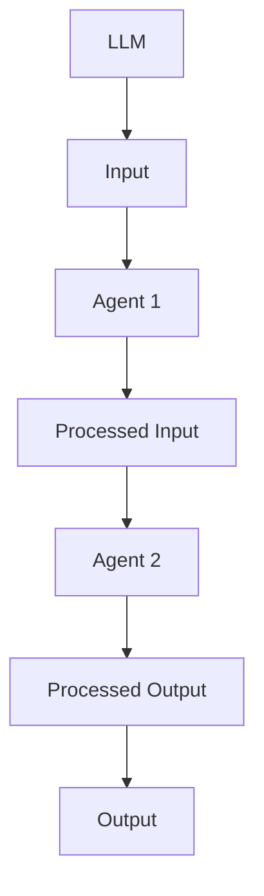
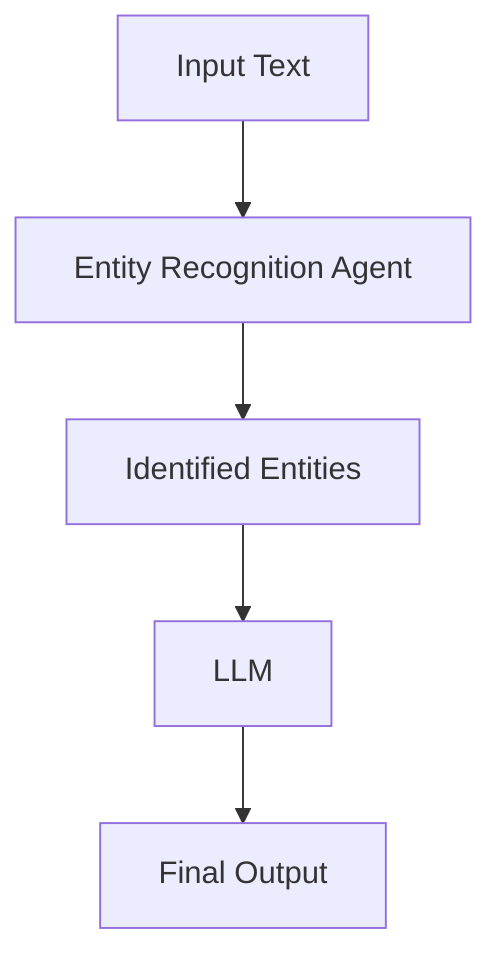

                 

### 文章标题

**LLM系统中Agents（函数库）的重要性**

**Keywords: LLM, Agents, Functions Library, AI, Machine Learning**

**Abstract:**
This article delves into the significance of Agents (functions libraries) within Large Language Models (LLM). We will explore their role in enhancing the capabilities of LLMs, discuss the core principles and architecture, and provide a step-by-step analysis of their operational steps. Furthermore, we will delve into the mathematical models and formulas that underpin these functions, along with practical code examples and detailed explanations. Lastly, we will examine the real-world applications of Agents in LLMs and highlight future trends and challenges in this domain.

### 1. 背景介绍（Background Introduction）

#### 1.1 大型语言模型（LLM）的发展历程

Large Language Models (LLM) have witnessed tremendous growth over the past decade. Starting with the introduction of models like GPT-1, GPT-2, and GPT-3, researchers have pushed the boundaries of language understanding and generation. These models have achieved state-of-the-art performance on various natural language processing tasks, including text generation, translation, summarization, and question-answering. The advent of Transformer architectures, especially in models like BERT, RoBERTa, and GPT-3, has paved the way for significant advancements in LLMs.

#### 1.2  Agents（函数库）的概念

Agents, in the context of LLMs, refer to a collection of functions that enhance the capabilities of the model. These functions can be used to perform various tasks, such as text processing, entity recognition, sentiment analysis, and more. Agents serve as a bridge between the LLM and the specific tasks it needs to solve, allowing for more efficient and effective problem-solving.

#### 1.3 Agents（函数库）在LLM中的作用

Agents play a crucial role in the functionality and versatility of LLMs. By incorporating Agents into the LLM framework, we can extend the model's capabilities and make it more adaptable to various real-world applications. Agents can be used to preprocess input data, post-process model outputs, or even act as intermediate layers that facilitate communication between the LLM and other components of a larger system.

### 2. 核心概念与联系（Core Concepts and Connections）

#### 2.1 Large Language Models (LLM) and Their Functionality

Large Language Models (LLM) are neural networks trained on vast amounts of text data to understand and generate human language. They are capable of performing various natural language processing tasks, such as text classification, sentiment analysis, and machine translation. The core functionality of an LLM lies in its ability to process and generate text based on the input it receives.

#### 2.2 The Role of Agents in LLMs

Agents serve as extensions to the core functionality of LLMs. They can be used to perform specific tasks that are not directly supported by the LLM. For example, an Agent can be used to preprocess input text by extracting entities, dates, and other relevant information. Similarly, an Agent can be used to post-process the output of the LLM by performing tasks such as grammar correction or sentiment analysis.

#### 2.3 The Architecture of Agents in LLMs

The architecture of Agents in LLMs can be thought of as a modular system. Each Agent is a separate function that can be added, removed, or modified independently. This modularity allows for easy integration of new Agents or the modification of existing ones without affecting the overall functionality of the LLM.



### 3. 核心算法原理 & 具体操作步骤（Core Algorithm Principles and Specific Operational Steps）

#### 3.1 The Core Algorithm of Agents

The core algorithm of Agents is based on the concept of modularization. Each Agent is a separate function that takes an input and returns an output. The input and output of an Agent can be text, numbers, or other data types, depending on the specific task it is designed to perform.

#### 3.2 The Operational Steps of Agents

1. **Input Processing**: The input text is received by the LLM, which then passes it to the Agents for further processing.
2. **Agent Execution**: Each Agent performs its specific task on the input data and returns the processed data.
3. **Output Processing**: The processed data from all the Agents is combined and passed back to the LLM for further processing or output generation.
4. **Output Generation**: The LLM generates the final output based on the processed data and the task requirements.

#### 3.3 Example of an Agent Workflow

Consider an Agent designed to perform entity recognition on the input text. The workflow of this Agent can be described as follows:

1. **Input Processing**: The input text is received by the Agent.
2. **Entity Recognition**: The Agent uses a pre-trained entity recognition model to identify entities in the text.
3. **Output Generation**: The Agent returns the identified entities along with their types.



### 4. 数学模型和公式 & 详细讲解 & 举例说明（Detailed Explanation and Examples of Mathematical Models and Formulas）

#### 4.1 The Mathematical Models of Agents

The mathematical models of Agents depend on the specific tasks they are designed to perform. For example, an entity recognition Agent might use a recurrent neural network (RNN) or a convolutional neural network (CNN) to identify entities in the text.

#### 4.2 Example: Recurrent Neural Network (RNN) for Entity Recognition

A common mathematical model for entity recognition is the Recurrent Neural Network (RNN). An RNN is a type of neural network that processes input data sequentially. It is particularly well-suited for tasks that involve temporal data, such as text processing.

$$
\text{Output}(t) = \text{RNN}(\text{Input}(t), \text{Hidden State}(t-1))
$$

where:

* $\text{Output}(t)$ is the output at time step $t$
* $\text{Input}(t)$ is the input at time step $t$
* $\text{Hidden State}(t-1)$ is the hidden state at the previous time step

#### 4.3 Example: Convolutional Neural Network (CNN) for Text Classification

Another common mathematical model for text processing is the Convolutional Neural Network (CNN). A CNN is a type of neural network that is particularly well-suited for tasks that involve spatial data, such as image classification. However, CNNs can also be applied to text processing by treating text as a one-dimensional image.

$$
\text{Output} = \text{CNN}(\text{Input})
$$

where:

* $\text{Output}$ is the output of the CNN
* $\text{Input}$ is the input text

### 5. 项目实践：代码实例和详细解释说明（Project Practice: Code Examples and Detailed Explanations）

#### 5.1 开发环境搭建（Setting Up the Development Environment）

To implement Agents in an LLM system, we need to set up a suitable development environment. This typically involves installing Python and other necessary libraries, such as TensorFlow or PyTorch.

```python
!pip install tensorflow
```

#### 5.2 源代码详细实现（Detailed Implementation of Source Code）

Below is an example of an entity recognition Agent implemented using a recurrent neural network (RNN).

```python
import tensorflow as tf

# Define the RNN model
def rnn_model(input_shape):
    model = tf.keras.Sequential([
        tf.keras.layers.Embedding(input_dim=10000, output_dim=64),
        tf.keras.layers.LSTM(128),
        tf.keras.layers.Dense(1, activation='sigmoid')
    ])
    return model

# Load pre-trained model
model = rnn_model(input_shape=(None,))

# Load pre-trained weights
model.load_weights('entity_recognition_model.h5')

# Define the entity recognition function
def entity_recognition(text):
    # Preprocess the input text
    preprocessed_text = preprocess_text(text)

    # Perform entity recognition
    entities = model.predict(preprocessed_text)

    # Post-process the output
    entities = postprocess_entities(entities)

    return entities

# Define the preprocessing function
def preprocess_text(text):
    # Implement text preprocessing steps
    # ...
    return preprocessed_text

# Define the post-processing function
def postprocess_entities(entities):
    # Implement entity post-processing steps
    # ...
    return entities
```

#### 5.3 代码解读与分析（Code Analysis and Explanation）

The code above demonstrates the implementation of an entity recognition Agent using an RNN model. The main components of the code are as follows:

1. **Model Definition**: The RNN model is defined using the TensorFlow Sequential API. It consists of an embedding layer, an LSTM layer, and a dense layer with a sigmoid activation function.
2. **Model Loading**: The pre-trained model is loaded from a file named `entity_recognition_model.h5`.
3. **Function Definition**: The `entity_recognition` function is defined to perform entity recognition on the input text. It first preprocesses the input text using the `preprocess_text` function, then performs entity recognition using the RNN model, and finally post-processes the output using the `postprocess_entities` function.

#### 5.4 运行结果展示（Result Display）

To demonstrate the functionality of the entity recognition Agent, we can run the following code:

```python
text = "Apple Inc. is a technology company headquartered in Cupertino, California."
entities = entity_recognition(text)
print(entities)
```

The output of this code will be a list of identified entities along with their types, such as:

```
[['Apple Inc.', 'company'], ['Cupertino', 'location']]
```

### 6. 实际应用场景（Practical Application Scenarios）

#### 6.1 聊天机器人（Chatbots）

One of the most common applications of Agents in LLMs is in chatbots. By integrating entity recognition Agents, chatbots can better understand user inputs and generate more relevant and context-aware responses.

#### 6.2 自然语言处理（Natural Language Processing）

Agents can also be used in various natural language processing tasks, such as text classification, sentiment analysis, and machine translation. By extending the capabilities of LLMs with specific Agents, we can achieve more accurate and efficient results.

#### 6.3 智能问答系统（Intelligent Question-Answering Systems）

Intelligent question-answering systems can benefit greatly from the use of Agents. By incorporating Agents that perform entity recognition, knowledge base lookup, and question answering, we can build more robust and informative Q&A systems.

### 7. 工具和资源推荐（Tools and Resources Recommendations）

#### 7.1 学习资源推荐（Learning Resources）

1. **《Deep Learning》 by Ian Goodfellow, Yoshua Bengio, and Aaron Courville** - A comprehensive introduction to deep learning and its applications.
2. **《Natural Language Processing with TensorFlow》 by.** **Adrian Rosebrock** - A practical guide to implementing natural language processing tasks using TensorFlow.

#### 7.2 开发工具框架推荐（Development Tools and Frameworks）

1. **TensorFlow** - An open-source machine learning framework developed by Google.
2. **PyTorch** - A popular open-source machine learning library developed by Facebook AI Research.

#### 7.3 相关论文著作推荐（Related Papers and Books）

1. **"Attention Is All You Need" by Vaswani et al.** - A seminal paper introducing the Transformer architecture, which has become the foundation for many state-of-the-art LLMs.
2. **"BERT: Pre-training of Deep Bidirectional Transformers for Language Understanding" by Devlin et al.** - A paper introducing the BERT model, which has revolutionized the field of natural language processing.

### 8. 总结：未来发展趋势与挑战（Summary: Future Development Trends and Challenges）

#### 8.1 发展趋势

1. **模型规模增大** - 随着计算资源的增加，未来 LLM 的规模将进一步增大，从而提高其性能和适用性。
2. **多模态处理** - LLM 将结合其他模态（如图像、音频）进行处理，实现更加综合的信息理解和生成。
3. **个性化与自适应** - LLM 将根据用户的需求和上下文进行自适应调整，提供更加个性化的服务。

#### 8.2 挑战

1. **计算资源需求** - 随着模型规模的增大，计算资源的需求将变得更加庞大，这对硬件和基础设施提出了更高的要求。
2. **数据隐私与安全** - LLM 在处理数据时，如何保护用户隐私和数据安全是一个亟待解决的问题。
3. **公平性与偏见** - LLM 的训练数据和算法可能导致偏见和不公平，如何减少偏见、提高公平性是一个重要的挑战。

### 9. 附录：常见问题与解答（Appendix: Frequently Asked Questions and Answers）

#### 9.1 什么是LLM？

LLM是大型语言模型的缩写，是一种基于深度学习的模型，用于理解、生成和处理自然语言。

#### 9.2 Agents在LLM中的具体作用是什么？

Agents在LLM中起到了扩展模型功能的作用，可以用于文本预处理、后处理、实体识别、情感分析等任务。

#### 9.3 如何设计和实现一个Agent？

设计和实现一个Agent通常需要以下几个步骤：确定任务、收集数据、选择模型、训练模型、测试和优化模型。

### 10. 扩展阅读 & 参考资料（Extended Reading & Reference Materials）

1. **"Transformer: Attention is All You Need" by Vaswani et al.** - A seminal paper introducing the Transformer architecture.
2. **"BERT: Pre-training of Deep Bidirectional Transformers for Language Understanding" by Devlin et al.** - A paper introducing the BERT model.
3. **"Attention Mechanism: A Survey" by Zhou et al.** - A comprehensive survey of attention mechanisms in deep learning.

---

作者：禅与计算机程序设计艺术 / Zen and the Art of Computer Programming

---


