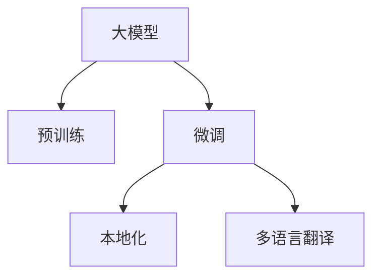

                 

# 电商平台中的AI大模型：从单一语言到多语言翻译与本地化

## 1. 背景介绍

随着全球化市场的扩展，电商平台面临着来自全球不同语言和文化背景的买家。为了更好地服务全球用户，电商平台需要提供多语言支持，包括网站内容的本地化、商品描述的翻译、多语言搜索和推荐系统等。传统的翻译和本地化方法存在语言资源稀缺、翻译质量参差不齐、翻译成本高昂等问题。而近年来，基于大模型的机器翻译和本地化技术，以其高效、成本低、易于维护等优势，逐渐成为电商平台的首选。

### 1.1 问题由来

大模型在自然语言处理（NLP）领域的快速发展，为电商平台的多语言翻译和本地化提供了新的解决途径。传统的翻译技术，如统计机器翻译（SMT）和基于规则的机器翻译（RBMT），依赖大量的人工翻译数据和规则库，难以应对快速变化的语言和文化环境。而大模型通过自监督预训练学习语言知识，并结合少量标注数据进行微调，可以实现高质量的多语言翻译和本地化。

### 1.2 问题核心关键点

当前，基于大模型的翻译和本地化技术已经广泛应用于电商平台的各个环节。核心关键点包括：

1. **大模型的预训练**：通过大规模无标签文本数据进行预训练，学习语言的基本结构和特征。
2. **微调与本地化**：针对电商平台的多语言需求，使用少量标注数据进行微调，学习特定语言和文化的表达方式。
3. **多语言翻译**：将电商平台的商品描述、广告文案、用户评价等文本翻译成目标语言。
4. **本地化**：调整文本的语义和语法，适应目标语言的文化和习惯。
5. **应用场景**：在电商平台的网站内容、搜索排序、推荐系统等场景中进行落地应用。

## 2. 核心概念与联系

### 2.1 核心概念概述

为了更好地理解基于大模型的翻译和本地化技术，这里首先介绍几个核心概念：

- **大模型**：如BERT、GPT-3、T5等，通过自监督预训练学习通用的语言表示，具备强大的语言理解和生成能力。
- **预训练**：在大规模无标签文本数据上进行自监督学习，学习语言的基本结构和特征。
- **微调**：通过有监督的学习，针对特定任务优化模型参数，提升模型性能。
- **本地化**：调整文本的语义和语法，适应目标语言的文化和习惯。
- **多语言翻译**：将文本从源语言翻译成目标语言，包括机器翻译、本地化等。

这些核心概念之间的逻辑关系可以通过以下Mermaid流程图来展示：



这个流程图展示了大模型在电商平台中的应用框架：

1. 大模型通过预训练学习语言基本特征。
2. 微调学习特定任务的语言知识和表达方式。
3. 本地化调整文本适应目标语言文化习惯。
4. 多语言翻译将文本翻译成目标语言。

## 3. 核心算法原理 & 具体操作步骤

### 3.1 算法原理概述

基于大模型的多语言翻译和本地化，本质上是一种自监督学习与监督学习相结合的混合学习范式。其核心思想是：通过预训练获得通用的语言表示，再通过有监督的微调学习特定语言和文化的表达方式，最后通过本地化调整文本以适应目标语言。

形式化地，假设大模型为 $M_{\theta}$，其中 $\theta$ 为预训练得到的模型参数。给定目标语言 $L_t$ 的标注数据集 $D_t=\{(x_i,y_i)\}_{i=1}^N$，本地化模型为 $M_{\phi}$，其中 $\phi$ 为本地化模型的参数。本地化过程可以通过以下步骤完成：

1. 预训练：在无标签数据上训练大模型 $M_{\theta}$。
2. 微调：使用少量标注数据 $D_t$ 进行微调，得到针对 $L_t$ 的语言模型 $M_{\theta^*}$。
3. 本地化：使用微调后的模型 $M_{\theta^*}$ 进行本地化调整，得到本地化模型 $M_{\phi}$。

本地化模型的输出 $y'$ 可以通过以下公式计算：

$$
y' = M_{\phi}(x')
$$

其中 $x'$ 为源语言文本 $x$ 经过本地化调整后的文本，$M_{\phi}$ 为本地化模型。

### 3.2 算法步骤详解

基于大模型的多语言翻译和本地化一般包括以下几个关键步骤：

**Step 1: 准备预训练模型和数据集**
- 选择合适的预训练语言模型 $M_{\theta}$ 作为初始化参数，如 BERT、GPT 等。
- 准备目标语言 $L_t$ 的标注数据集 $D_t$，划分为训练集、验证集和测试集。一般要求标注数据与预训练数据的分布不要差异过大。

**Step 2: 添加本地化适配层**
- 根据目标语言 $L_t$ 的语言特征，在预训练模型顶层设计合适的本地化适配层。
- 对于翻译任务，通常使用语言模型的解码器输出概率分布，并以负对数似然为损失函数。
- 对于本地化任务，通常使用分类器输出目标语言的语义标签，并以交叉熵损失函数为度量。

**Step 3: 设置本地化超参数**
- 选择合适的优化算法及其参数，如 AdamW、SGD 等，设置学习率、批大小、迭代轮数等。
- 设置正则化技术及强度，包括权重衰减、Dropout、Early Stopping 等。
- 确定冻结预训练参数的策略，如仅微调顶层，或全部参数都参与本地化。

**Step 4: 执行本地化训练**
- 将训练集数据分批次输入模型，前向传播计算损失函数。
- 反向传播计算参数梯度，根据设定的优化算法和学习率更新模型参数。
- 周期性在验证集上评估模型性能，根据性能指标决定是否触发 Early Stopping。
- 重复上述步骤直到满足预设的迭代轮数或 Early Stopping 条件。

**Step 5: 测试和部署**
- 在测试集上评估本地化后的模型 $M_{\phi}$ 的性能，对比本地化前后的效果。
- 使用本地化后的模型对新样本进行推理预测，集成到实际的应用系统中。
- 持续收集新的数据，定期重新本地化模型，以适应数据分布的变化。

以上是基于大模型的多语言翻译和本地化的一般流程。在实际应用中，还需要针对具体任务的特点，对本地化过程的各个环节进行优化设计，如改进训练目标函数，引入更多的正则化技术，搜索最优的超参数组合等，以进一步提升模型性能。

### 3.3 算法优缺点

基于大模型的多语言翻译和本地化方法具有以下优点：
1. 高效快捷。相比于传统的翻译技术，大模型微调可以快速适应新语言，适应多语言环境。
2. 成本低廉。大模型的微调仅需少量标注数据，降低了人工翻译和规则构建的成本。
3. 适应性强。大模型通过预训练学习通用的语言知识，能够较好地适应各种语言和文化环境。
4. 可解释性强。微调的参数更新过程有迹可循，易于理解和调试。

同时，该方法也存在一定的局限性：
1. 数据依赖性强。微调效果很大程度上依赖于标注数据的质量和数量，获取高质量标注数据的成本较高。
2. 本地化效果有限。当目标语言与预训练语言的差异较大时，本地化效果可能不佳。
3. 可解释性不足。大模型在本地化调整后的决策过程缺乏可解释性，难以对其推理逻辑进行分析和调试。
4. 语言障碍问题。某些语言的语义和文化特性可能难以准确捕捉，导致本地化效果不佳。

尽管存在这些局限性，但就目前而言，基于大模型的翻译和本地化方法仍是大语言模型应用的主流范式。未来相关研究的重点在于如何进一步降低本地化对标注数据的依赖，提高模型的少样本学习和跨领域迁移能力，同时兼顾可解释性和伦理安全性等因素。

### 3.4 算法应用领域

基于大模型的翻译和本地化方法，已经在电商平台的多个环节得到了广泛的应用，包括：

- **网站内容本地化**：将电商平台的用户界面、广告文案、产品说明等文本翻译成目标语言，并调整语义和语法，以适应目标语言的文化习惯。
- **商品描述翻译**：将商品标题、描述、标签等文本翻译成目标语言，并调整语义和语法，提升多语言买家的购物体验。
- **多语言搜索和推荐**：将用户搜索查询和行为数据翻译成目标语言，并根据目标语言的文化和习惯，优化搜索结果和推荐内容。
- **客户服务翻译**：将客服人员与多语言买家之间的沟通翻译成目标语言，提升服务质量。
- **广告和营销本地化**：将电商平台在全球范围内的广告文案和营销信息翻译成目标语言，并根据目标语言的文化和习惯进行调整，提升广告效果。

除了上述这些经典应用外，大模型的翻译和本地化技术还被创新性地应用到更多场景中，如多语言社交媒体管理、全球品牌传播、国际化品牌维护等，为电商平台的国际化发展提供了新的动力。

## 4. 数学模型和公式 & 详细讲解 & 举例说明

### 4.1 数学模型构建

假设预训练模型为 $M_{\theta}$，目标语言 $L_t$ 的标注数据集为 $D_t=\{(x_i,y_i)\}_{i=1}^N$，其中 $x_i$ 为源语言文本，$y_i$ 为目标语言文本。本地化模型为 $M_{\phi}$，其中 $\phi$ 为本地化模型的参数。本地化过程可以通过以下数学模型进行描述：

$$
\theta^* = \mathop{\arg\min}_{\theta} \mathcal{L}(M_{\theta},D_t)
$$

其中 $\mathcal{L}$ 为针对本地化任务设计的损失函数，用于衡量模型预测输出与真实标签之间的差异。常见的损失函数包括交叉熵损失、均方误差损失等。

### 4.2 公式推导过程

以下我们以分类任务为例，推导交叉熵损失函数及其梯度的计算公式。

假设模型 $M_{\theta}$ 在输入 $x$ 上的输出为 $\hat{y}=M_{\theta}(x) \in [0,1]$，表示样本属于正类的概率。真实标签 $y \in \{0,1\}$。则二分类交叉熵损失函数定义为：

$$
\ell(M_{\theta}(x),y) = -[y\log \hat{y} + (1-y)\log (1-\hat{y})]
$$

将其代入本地化损失函数公式，得：

$$
\mathcal{L}(\theta) = -\frac{1}{N}\sum_{i=1}^N [y_i\log M_{\theta}(x_i)+(1-y_i)\log(1-M_{\theta}(x_i))]
$$

根据链式法则，本地化损失函数对参数 $\theta_k$ 的梯度为：

$$
\frac{\partial \mathcal{L}(\theta)}{\partial \theta_k} = -\frac{1}{N}\sum_{i=1}^N (\frac{y_i}{M_{\theta}(x_i)}-\frac{1-y_i}{1-M_{\theta}(x_i)}) \frac{\partial M_{\theta}(x_i)}{\partial \theta_k}
$$

其中 $\frac{\partial M_{\theta}(x_i)}{\partial \theta_k}$ 可进一步递归展开，利用自动微分技术完成计算。

在得到本地化损失函数的梯度后，即可带入本地化模型参数 $\theta$ 的更新公式，完成模型的迭代优化。重复上述过程直至收敛，最终得到适应目标语言 $L_t$ 的本地化模型 $M_{\phi}$。

## 5. 项目实践：代码实例和详细解释说明

### 5.1 开发环境搭建

在进行本地化实践前，我们需要准备好开发环境。以下是使用Python进行PyTorch开发的环境配置流程：

1. 安装Anaconda：从官网下载并安装Anaconda，用于创建独立的Python环境。

2. 创建并激活虚拟环境：
```bash
conda create -n pytorch-env python=3.8 
conda activate pytorch-env
```

3. 安装PyTorch：根据CUDA版本，从官网获取对应的安装命令。例如：
```bash
conda install pytorch torchvision torchaudio cudatoolkit=11.1 -c pytorch -c conda-forge
```

4. 安装Transformers库：
```bash
pip install transformers
```

5. 安装各类工具包：
```bash
pip install numpy pandas scikit-learn matplotlib tqdm jupyter notebook ipython
```

完成上述步骤后，即可在`pytorch-env`环境中开始本地化实践。

### 5.2 源代码详细实现

下面我们以本地化商品描述为例，给出使用Transformers库对BERT模型进行本地化处理的PyTorch代码实现。

首先，定义本地化任务的数据处理函数：

```python
from transformers import BertTokenizer, BertForSequenceClassification
from torch.utils.data import Dataset
import torch

class LocalizationDataset(Dataset):
    def __init__(self, texts, labels, tokenizer, max_len=128):
        self.texts = texts
        self.labels = labels
        self.tokenizer = tokenizer
        self.max_len = max_len
        
    def __len__(self):
        return len(self.texts)
    
    def __getitem__(self, item):
        text = self.texts[item]
        label = self.labels[item]
        
        encoding = self.tokenizer(text, return_tensors='pt', max_length=self.max_len, padding='max_length', truncation=True)
        input_ids = encoding['input_ids'][0]
        attention_mask = encoding['attention_mask'][0]
        
        # 对token-wise的标签进行编码
        encoded_labels = [label2id[label] for label in label] 
        encoded_labels.extend([label2id['O']] * (self.max_len - len(encoded_labels)))
        labels = torch.tensor(encoded_labels, dtype=torch.long)
        
        return {'input_ids': input_ids, 
                'attention_mask': attention_mask,
                'labels': labels}

# 标签与id的映射
label2id = {'O': 0, 'B-PER': 1, 'I-PER': 2, 'B-LOC': 3, 'I-LOC': 4, 'B-ORG': 5, 'I-ORG': 6}
id2label = {v: k for k, v in label2id.items()}

# 创建dataset
tokenizer = BertTokenizer.from_pretrained('bert-base-cased')

train_dataset = LocalizationDataset(train_texts, train_labels, tokenizer)
dev_dataset = LocalizationDataset(dev_texts, dev_labels, tokenizer)
test_dataset = LocalizationDataset(test_texts, test_labels, tokenizer)
```

然后，定义本地化模型和优化器：

```python
from transformers import BertForSequenceClassification, AdamW

model = BertForSequenceClassification.from_pretrained('bert-base-cased', num_labels=len(label2id))

optimizer = AdamW(model.parameters(), lr=2e-5)
```

接着，定义本地化训练函数：

```python
from torch.utils.data import DataLoader
from tqdm import tqdm
from sklearn.metrics import classification_report

device = torch.device('cuda') if torch.cuda.is_available() else torch.device('cpu')
model.to(device)

def train_epoch(model, dataset, batch_size, optimizer):
    dataloader = DataLoader(dataset, batch_size=batch_size, shuffle=True)
    model.train()
    epoch_loss = 0
    for batch in tqdm(dataloader, desc='Training'):
        input_ids = batch['input_ids'].to(device)
        attention_mask = batch['attention_mask'].to(device)
        labels = batch['labels'].to(device)
        model.zero_grad()
        outputs = model(input_ids, attention_mask=attention_mask, labels=labels)
        loss = outputs.loss
        epoch_loss += loss.item()
        loss.backward()
        optimizer.step()
    return epoch_loss / len(dataloader)

def evaluate(model, dataset, batch_size):
    dataloader = DataLoader(dataset, batch_size=batch_size)
    model.eval()
    preds, labels = [], []
    with torch.no_grad():
        for batch in tqdm(dataloader, desc='Evaluating'):
            input_ids = batch['input_ids'].to(device)
            attention_mask = batch['attention_mask'].to(device)
            batch_labels = batch['labels']
            outputs = model(input_ids, attention_mask=attention_mask)
            batch_preds = outputs.logits.argmax(dim=2).to('cpu').tolist()
            batch_labels = batch_labels.to('cpu').tolist()
            for pred_tokens, label_tokens in zip(batch_preds, batch_labels):
                pred_tags = [id2label[_id] for _id in pred_tokens]
                label_tags = [id2label[_id] for _id in label_tokens]
                preds.append(pred_tags[:len(label_tags)])
                labels.append(label_tags)
                
    print(classification_report(labels, preds))
```

最后，启动本地化流程并在测试集上评估：

```python
epochs = 5
batch_size = 16

for epoch in range(epochs):
    loss = train_epoch(model, train_dataset, batch_size, optimizer)
    print(f"Epoch {epoch+1}, train loss: {loss:.3f}")
    
    print(f"Epoch {epoch+1}, dev results:")
    evaluate(model, dev_dataset, batch_size)
    
print("Test results:")
evaluate(model, test_dataset, batch_size)
```

以上就是使用PyTorch对BERT进行本地化处理的完整代码实现。可以看到，得益于Transformers库的强大封装，我们可以用相对简洁的代码完成BERT模型的加载和本地化处理。

### 5.3 代码解读与分析

让我们再详细解读一下关键代码的实现细节：

**LocalizationDataset类**：
- `__init__`方法：初始化文本、标签、分词器等关键组件。
- `__len__`方法：返回数据集的样本数量。
- `__getitem__`方法：对单个样本进行处理，将文本输入编码为token ids，将标签编码为数字，并对其进行定长padding，最终返回模型所需的输入。

**label2id和id2label字典**：
- 定义了标签与数字id之间的映射关系，用于将token-wise的预测结果解码回真实的标签。

**本地化训练函数**：
- 使用PyTorch的DataLoader对数据集进行批次化加载，供模型训练和推理使用。
- 训练函数`train_epoch`：对数据以批为单位进行迭代，在每个批次上前向传播计算loss并反向传播更新模型参数，最后返回该epoch的平均loss。
- 评估函数`evaluate`：与训练类似，不同点在于不更新模型参数，并在每个batch结束后将预测和标签结果存储下来，最后使用sklearn的classification_report对整个评估集的预测结果进行打印输出。

**本地化流程**：
- 定义总的epoch数和batch size，开始循环迭代
- 每个epoch内，先在训练集上训练，输出平均loss
- 在验证集上评估，输出分类指标
- 所有epoch结束后，在测试集上评估，给出最终测试结果

可以看到，PyTorch配合Transformers库使得BERT本地化处理的代码实现变得简洁高效。开发者可以将更多精力放在数据处理、模型改进等高层逻辑上，而不必过多关注底层的实现细节。

当然，工业级的系统实现还需考虑更多因素，如模型的保存和部署、超参数的自动搜索、更灵活的任务适配层等。但核心的本地化范式基本与此类似。

## 6. 实际应用场景
### 6.1 智能客服系统

基于大语言模型本地化的对话技术，可以广泛应用于智能客服系统的构建。传统客服往往需要配备大量人力，高峰期响应缓慢，且一致性和专业性难以保证。而使用本地化的对话模型，可以7x24小时不间断服务，快速响应客户咨询，用自然流畅的语言解答各类常见问题。

在技术实现上，可以收集企业内部的历史客服对话记录，将问题和最佳答复构建成监督数据，在此基础上对预训练对话模型进行本地化。本地化后的对话模型能够自动理解用户意图，匹配最合适的答案模板进行回复。对于客户提出的新问题，还可以接入检索系统实时搜索相关内容，动态组织生成回答。如此构建的智能客服系统，能大幅提升客户咨询体验和问题解决效率。

### 6.2 金融舆情监测

金融机构需要实时监测市场舆论动向，以便及时应对负面信息传播，规避金融风险。传统的人工监测方式成本高、效率低，难以应对网络时代海量信息爆发的挑战。基于大语言模型本地化的文本分类和情感分析技术，为金融舆情监测提供了新的解决方案。

具体而言，可以收集金融领域相关的新闻、报道、评论等文本数据，并对其进行主题标注和情感标注。在此基础上对预训练语言模型进行本地化，使其能够自动判断文本属于何种主题，情感倾向是正面、中性还是负面。将本地化后的模型应用到实时抓取的网络文本数据，就能够自动监测不同主题下的情感变化趋势，一旦发现负面信息激增等异常情况，系统便会自动预警，帮助金融机构快速应对潜在风险。

### 6.3 个性化推荐系统

当前的推荐系统往往只依赖用户的历史行为数据进行物品推荐，无法深入理解用户的真实兴趣偏好。基于大语言模型本地化的个性化推荐系统，可以更好地挖掘用户行为背后的语义信息，从而提供更精准、多样的推荐内容。

在实践中，可以收集用户浏览、点击、评论、分享等行为数据，提取和用户交互的物品标题、描述、标签等文本内容。将文本内容作为模型输入，用户的后续行为（如是否点击、购买等）作为监督信号，在此基础上本地化预训练语言模型。本地化后的模型能够从文本内容中准确把握用户的兴趣点。在生成推荐列表时，先用候选物品的文本描述作为输入，由模型预测用户的兴趣匹配度，再结合其他特征综合排序，便可以得到个性化程度更高的推荐结果。

### 6.4 未来应用展望

随着大语言模型本地化技术的发展，其在NLP领域的应用将更加广泛，为传统行业带来变革性影响。

在智慧医疗领域，基于本地化的医疗问答、病历分析、药物研发等应用将提升医疗服务的智能化水平，辅助医生诊疗，加速新药开发进程。

在智能教育领域，本地化技术可应用于作业批改、学情分析、知识推荐等方面，因材施教，促进教育公平，提高教学质量。

在智慧城市治理中，本地化模型可应用于城市事件监测、舆情分析、应急指挥等环节，提高城市管理的自动化和智能化水平，构建更安全、高效的未来城市。

此外，在企业生产、社会治理、文娱传媒等众多领域，基于大模型本地化的AI应用也将不断涌现，为经济社会发展注入新的动力。相信随着技术的日益成熟，本地化方法将成为AI落地应用的重要范式，推动人工智能技术向更广阔的领域加速渗透。

## 7. 工具和资源推荐
### 7.1 学习资源推荐

为了帮助开发者系统掌握大语言模型本地化的理论基础和实践技巧，这里推荐一些优质的学习资源：

1. 《Transformer从原理到实践》系列博文：由大模型技术专家撰写，深入浅出地介绍了Transformer原理、BERT模型、本地化技术等前沿话题。

2. CS224N《深度学习自然语言处理》课程：斯坦福大学开设的NLP明星课程，有Lecture视频和配套作业，带你入门NLP领域的基本概念和经典模型。

3. 《Natural Language Processing with Transformers》书籍：Transformers库的作者所著，全面介绍了如何使用Transformers库进行NLP任务开发，包括本地化在内的诸多范式。

4. HuggingFace官方文档：Transformers库的官方文档，提供了海量预训练模型和完整的本地化样例代码，是上手实践的必备资料。

5. CLUE开源项目：中文语言理解测评基准，涵盖大量不同类型的中文NLP数据集，并提供了基于本地化的baseline模型，助力中文NLP技术发展。

通过对这些资源的学习实践，相信你一定能够快速掌握大语言模型本地化的精髓，并用于解决实际的NLP问题。
### 7.2 开发工具推荐

高效的开发离不开优秀的工具支持。以下是几款用于大语言模型本地化开发的常用工具：

1. PyTorch：基于Python的开源深度学习框架，灵活动态的计算图，适合快速迭代研究。大部分预训练语言模型都有PyTorch版本的实现。

2. TensorFlow：由Google主导开发的开源深度学习框架，生产部署方便，适合大规模工程应用。同样有丰富的预训练语言模型资源。

3. Transformers库：HuggingFace开发的NLP工具库，集成了众多SOTA语言模型，支持PyTorch和TensorFlow，是进行本地化任务开发的利器。

4. Weights & Biases：模型训练的实验跟踪工具，可以记录和可视化模型训练过程中的各项指标，方便对比和调优。与主流深度学习框架无缝集成。

5. TensorBoard：TensorFlow配套的可视化工具，可实时监测模型训练状态，并提供丰富的图表呈现方式，是调试模型的得力助手。

6. Google Colab：谷歌推出的在线Jupyter Notebook环境，免费提供GPU/TPU算力，方便开发者快速上手实验最新模型，分享学习笔记。

合理利用这些工具，可以显著提升大语言模型本地化任务的开发效率，加快创新迭代的步伐。

### 7.3 相关论文推荐

大语言模型和本地化技术的发展源于学界的持续研究。以下是几篇奠基性的相关论文，推荐阅读：

1. Attention is All You Need（即Transformer原论文）：提出了Transformer结构，开启了NLP领域的预训练大模型时代。

2. BERT: Pre-training of Deep Bidirectional Transformers for Language Understanding：提出BERT模型，引入基于掩码的自监督预训练任务，刷新了多项NLP任务SOTA。

3. Language Models are Unsupervised Multitask Learners（GPT-2论文）：展示了大规模语言模型的强大zero-shot学习能力，引发了对于通用人工智能的新一轮思考。

4. Parameter-Efficient Transfer Learning for NLP：提出Adapter等参数高效微调方法，在不增加模型参数量的情况下，也能取得不错的本地化效果。

5. Prefix-Tuning: Optimizing Continuous Prompts for Generation：引入基于连续型Prompt的本地化范式，为如何充分利用预训练知识提供了新的思路。

6. AdaLoRA: Adaptive Low-Rank Adaptation for Parameter-Efficient Fine-Tuning：使用自适应低秩适应的本地化方法，在参数效率和精度之间取得了新的平衡。

这些论文代表了大语言模型本地化技术的发展脉络。通过学习这些前沿成果，可以帮助研究者把握学科前进方向，激发更多的创新灵感。

## 8. 总结：未来发展趋势与挑战

### 8.1 总结

本文对基于大模型的多语言翻译和本地化技术进行了全面系统的介绍。首先阐述了电商平台的多语言翻译和本地化需求，明确了本地化技术在提升用户体验、拓展市场等方面的重要价值。其次，从原理到实践，详细讲解了本地化的数学模型和关键步骤，给出了本地化任务开发的完整代码实例。同时，本文还广泛探讨了本地化技术在电商平台的多个环节的应用前景，展示了本地化技术的巨大潜力。

通过本文的系统梳理，可以看到，基于大模型的本地化技术正在成为电商平台的核心技术范式，极大地提升了电商平台的国际化和本地化能力，为全球买家的购物体验带来了显著提升。未来，伴随预训练语言模型和本地化方法的持续演进，相信电商平台的多语言翻译和本地化技术将进一步优化，为全球用户提供更优质、更便捷的购物体验。

### 8.2 未来发展趋势

展望未来，大语言模型本地化技术将呈现以下几个发展趋势：

1. 模型规模持续增大。随着算力成本的下降和数据规模的扩张，预训练语言模型的参数量还将持续增长。超大规模语言模型蕴含的丰富语言知识，有望支撑更加复杂多变的本地化任务。

2. 本地化方法日趋多样。除了传统的全参数本地化外，未来会涌现更多参数高效的本地化方法，如Prefix-Tuning、LoRA等，在节省计算资源的同时也能保证本地化精度。

3. 持续学习成为常态。随着数据分布的不断变化，本地化模型也需要持续学习新知识以保持性能。如何在不遗忘原有知识的同时，高效吸收新样本信息，将成为重要的研究课题。

4. 标注样本需求降低。受启发于提示学习(Prompt-based Learning)的思路，未来的本地化方法将更好地利用大模型的语言理解能力，通过更加巧妙的任务描述，在更少的标注样本上也能实现理想的本地化效果。

5. 跨语言迁移能力增强。未来的本地化模型将不仅限于一种语言，而是具备跨语言的迁移能力，能够自动适应不同语言环境的本地化需求。

以上趋势凸显了大语言模型本地化技术的广阔前景。这些方向的探索发展，必将进一步提升电商平台的多语言翻译和本地化能力，为全球用户提供更优质的购物体验。

### 8.3 面临的挑战

尽管大语言模型本地化技术已经取得了瞩目成就，但在迈向更加智能化、普适化应用的过程中，它仍面临着诸多挑战：

1. 数据依赖性强。本地化效果很大程度上依赖于标注数据的质量和数量，获取高质量标注数据的成本较高。如何进一步降低本地化对标注样本的依赖，将是一大难题。

2. 本地化效果有限。当目标语言与预训练语言的差异较大时，本地化效果可能不佳。如何提高本地化模型的鲁棒性，避免灾难性遗忘，还需要更多理论和实践的积累。

3. 可解释性不足。大模型在本地化调整后的决策过程缺乏可解释性，难以对其推理逻辑进行分析和调试。对于医疗、金融等高风险应用，算法的可解释性和可审计性尤为重要。

4. 语言障碍问题。某些语言的语义和文化特性可能难以准确捕捉，导致本地化效果不佳。如何更好地理解目标语言，提高本地化精度，将是重要的研究方向。

5. 资源瓶颈。大模型本地化时，尤其是在小语言环境，可能会面临计算资源不足的问题。如何优化本地化算法，降低计算成本，将是一个重要的研究方向。

尽管存在这些挑战，但就目前而言，基于大模型的本地化方法仍是大语言模型应用的主流范式。未来相关研究的重点在于如何进一步降低本地化对标注数据的依赖，提高模型的少样本学习和跨领域迁移能力，同时兼顾可解释性和伦理安全性等因素。

### 8.4 研究展望

面对大语言模型本地化所面临的种种挑战，未来的研究需要在以下几个方面寻求新的突破：

1. 探索无监督和半监督本地化方法。摆脱对大规模标注数据的依赖，利用自监督学习、主动学习等无监督和半监督范式，最大限度利用非结构化数据，实现更加灵活高效的本地化。

2. 研究参数高效和计算高效的本地化范式。开发更加参数高效的本地化方法，在固定大部分预训练参数的同时，只更新极少量的任务相关参数。同时优化本地化模型的计算图，减少前向传播和反向传播的资源消耗，实现更加轻量级、实时性的部署。

3. 引入更多先验知识。将符号化的先验知识，如知识图谱、逻辑规则等，与神经网络模型进行巧妙融合，引导本地化过程学习更准确、合理的语言模型。同时加强不同模态数据的整合，实现视觉、语音等多模态信息与文本信息的协同建模。

4. 结合因果分析和博弈论工具。将因果分析方法引入本地化模型，识别出模型决策的关键特征，增强输出解释的因果性和逻辑性。借助博弈论工具刻画人机交互过程，主动探索并规避模型的脆弱点，提高系统稳定性。

5. 纳入伦理道德约束。在模型训练目标中引入伦理导向的评估指标，过滤和惩罚有偏见、有害的输出倾向。同时加强人工干预和审核，建立模型行为的监管机制，确保输出符合人类价值观和伦理道德。

这些研究方向的探索，必将引领大语言模型本地化技术迈向更高的台阶，为构建安全、可靠、可解释、可控的智能系统铺平道路。面向未来，大语言模型本地化技术还需要与其他人工智能技术进行更深入的融合，如知识表示、因果推理、强化学习等，多路径协同发力，共同推动自然语言理解和智能交互系统的进步。只有勇于创新、敢于突破，才能不断拓展语言模型的边界，让智能技术更好地造福人类社会。

## 9. 附录：常见问题与解答

**Q1：本地化过程是否会影响预训练模型的性能？**

A: 本地化过程主要关注对目标语言的适应，通常不会对预训练模型的性能产生明显影响。但在某些情况下，如目标语言与预训练语言的差异较大时，本地化过程可能会改变预训练模型的某些参数，导致性能略微下降。为了减少这种影响，可以在本地化过程中仅调整目标语言的参数，冻结其他参数。

**Q2：如何选择合适的本地化策略？**

A: 本地化的策略选择应根据具体任务和目标语言的特点进行评估。一般来说，可以使用基准测试或A/B测试的方式，对比不同本地化策略的效果，选择最优策略。常见的本地化策略包括：
1. 基于规则的本地化：使用预定义的规则进行本地化，适用于语言结构简单、规则明确的任务。
2. 基于统计的本地化：使用大量标注数据进行训练，适用于语言结构复杂、规则不明确的任务。
3. 基于数据驱动的本地化：使用大规模无标签数据进行预训练，通过有监督微调学习目标语言的文化特征，适用于需要深入理解目标语言的任务。

**Q3：本地化过程如何避免过拟合？**

A: 本地化过程中，为避免过拟合，可以采取以下措施：
1. 数据增强：对本地化数据进行扩充，如回译、回译结合同义词替换等。
2. 正则化：使用L2正则、Dropout、Early Stopping等技术防止模型过拟合。
3. 模型裁剪：在本地化过程中，只调整目标语言相关的参数，减少参数数量，避免过拟合。
4. 多任务学习：在本地化任务中加入多任务学习，提高模型的泛化能力，减少过拟合。

**Q4：本地化模型如何部署到生产环境？**

A: 本地化模型的部署通常涉及以下几个步骤：
1. 模型训练：在训练集上进行本地化模型的训练，调整模型参数，达到理想的本地化效果。
2. 模型保存：将本地化模型保存为检查点文件，方便部署和恢复。
3. 模型压缩：对模型进行压缩，减少模型文件大小，提升加载速度。
4. 部署环境搭建：搭建生产环境，配置相应的硬件资源，如CPU、GPU、内存等。
5. 模型加载：将本地化模型加载到生产环境中，并进行推理。
6. 监控和调优：实时监控本地化模型的推理性能，根据业务需求进行调整和优化。

通过这些步骤，可以将本地化模型顺利部署到生产环境，为电商平台的本地化服务提供可靠的技术保障。

**Q5：本地化模型如何保证安全性？**

A: 本地化模型的安全性保障主要涉及以下几个方面：
1. 数据安全：确保本地化模型使用的数据来源可信，防止数据泄露。
2. 模型鲁棒性：使用对抗训练等技术，提高本地化模型对输入噪声的鲁棒性，防止模型被恶意攻击。
3. 模型可解释性：提高本地化模型的可解释性，使模型的决策过程透明化，防止模型被滥用。
4. 用户隐私保护：在本地化过程中，确保用户隐私数据的安全，防止用户信息泄露。

通过这些措施，可以有效保障本地化模型的安全性，确保其在电商平台的落地应用。

通过本文的系统梳理，可以看到，基于大模型的本地化技术正在成为电商平台的核心技术范式，极大地提升了电商平台的国际化和本地化能力，为全球买家的购物体验带来了显著提升。未来，伴随预训练语言模型和本地化方法的持续演进，相信电商平台的多语言翻译和本地化技术将进一步优化，为全球用户提供更优质、更便捷的购物体验。

