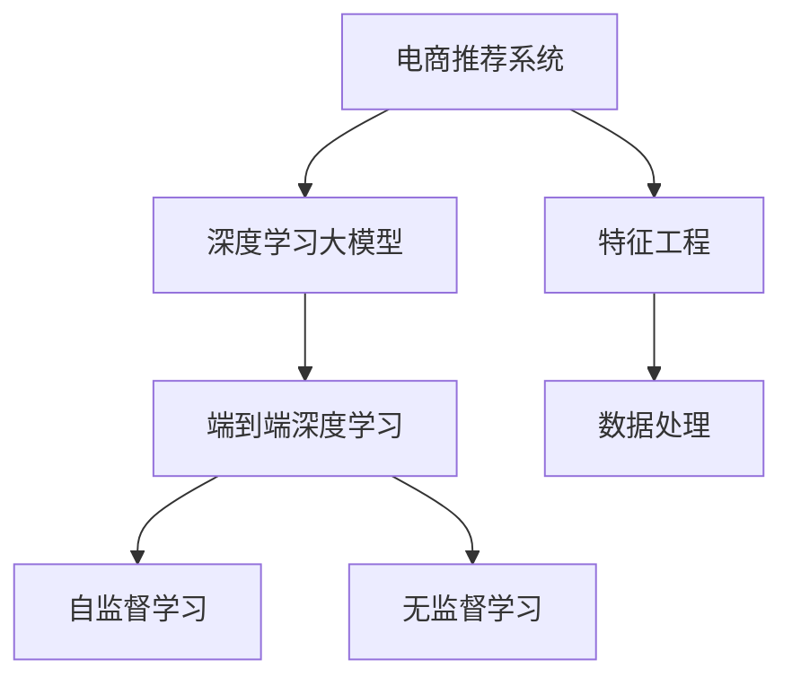

                 

## 1. 背景介绍

在互联网的浪潮中，电商平台迅速崛起，成为数字经济的重要组成部分。传统的电商基于搜索和推荐系统，向用户推荐商品并提供相关服务，用户可以方便地浏览商品、查询评价、选择购买。但随着市场竞争的加剧，用户对电商体验的要求也越来越高，希望商品推荐能够更加个性化、精准，服务能够更加智能、高效。为实现这一目标，人工智能技术被引入电商平台，其中以深度学习大模型为代表的AI技术逐渐成为电商的核心竞争力。

在深度学习大模型中，预训练模型如BERT、GPT-3等在自然语言处理(NLP)和计算机视觉(CV)领域表现出色，为电商推荐、客服、搜索等场景提供了新的解决思路。本文将从电商平台的AI大模型应用出发，探讨如何将深度学习大模型应用于电商的各项任务，并着重介绍从特征工程到端到端的深度学习优化方法。

## 2. 核心概念与联系

### 2.1 核心概念概述

为更好地理解深度学习大模型在电商平台中的应用，本节将介绍几个密切相关的核心概念：

- **电商推荐系统**：基于用户行为数据和商品属性，为用户推荐合适商品的系统。目标是提升用户满意度，增加平台收入。
- **深度学习大模型**：如BERT、GPT-3等，基于大规模数据集自监督训练的模型，具备强大的语言和视觉处理能力。
- **端到端深度学习**：直接从原始数据输入到输出结果，中间不经过复杂的特征工程步骤，利用神经网络进行端到端训练和推理。
- **自监督学习**：通过未标注数据自学习特征表示，不依赖人工标注。
- **无监督学习**：不依赖标注数据，直接从数据中学习模型。

这些核心概念之间的逻辑关系可以通过以下Mermaid流程图来展示：



这个流程图展示了一个深度学习大模型在电商推荐系统中的应用流程：

1. 电商推荐系统需要构建模型来预测用户对商品的评分和购买行为。
2. 深度学习大模型可以直接从原始数据中学习，无需复杂的特征工程。
3. 自监督学习和无监督学习可以在大规模无标签数据上训练大模型，学习到通用的语言和视觉表示。
4. 特征工程和数据处理是将原始数据转化为模型可用的特征向量，优化模型输入。

## 3. 核心算法原理 & 具体操作步骤

### 3.1 算法原理概述

电商推荐系统中的深度学习大模型应用，本质上是端到端的深度学习流程，从原始数据输入到输出结果，中间不经过复杂的手工特征工程。核心算法原理如下：

1. **输入数据**：电商平台的用户行为数据、商品属性数据等。
2. **预训练大模型**：在大规模数据集上预训练，学习到通用的语言和视觉表示。
3. **微调**：在电商推荐任务的数据集上微调预训练模型，学习到特定的电商特征。
4. **端到端训练**：将用户行为数据和商品属性数据作为输入，通过深度学习模型直接预测用户的评分和购买行为。
5. **模型部署**：将训练好的模型部署到实际应用环境中，进行实时推荐和查询。

### 3.2 算法步骤详解

以下是深度学习大模型在电商推荐系统中的具体操作步骤：

1. **数据收集与预处理**：
   - 收集用户的历史行为数据（浏览、点击、购买等）和商品的属性数据。
   - 清洗数据，去除噪声，处理缺失值。
   - 将用户行为数据进行分词或特征提取，转化为模型可用的向量形式。

2. **预训练模型选择**：
   - 选择合适的预训练大模型，如BERT、GPT-3等。
   - 加载模型，并进行必要的初始化，包括设置学习率和优化器等超参数。

3. **微调模型**：
   - 在电商推荐任务的数据集上微调预训练模型。
   - 定义损失函数，如均方误差（MSE）或交叉熵损失（CE）。
   - 使用小批量梯度下降算法（如SGD或Adam）进行模型优化。
   - 设置合适的超参数，如学习率、批大小、迭代轮数等。

4. **端到端训练**：
   - 构建深度学习模型，如多层感知器（MLP）、卷积神经网络（CNN）、循环神经网络（RNN）等。
   - 将用户行为数据和商品属性数据作为输入，直接训练模型预测用户评分和购买行为。
   - 使用交叉验证等技术，评估模型性能，进行模型选择和参数调整。

5. **模型部署与实时推荐**：
   - 将训练好的模型部署到实际应用环境中，如Web应用或移动端应用。
   - 实现实时推荐系统，根据用户实时行为数据，快速计算并返回推荐结果。
   - 集成日志记录和监控系统，实时监控模型性能和健康状况。

### 3.3 算法优缺点

深度学习大模型在电商推荐系统中的应用具有以下优点：

- **精度高**：深度学习大模型通过端到端的训练，能够直接从原始数据中学习到复杂的特征表示，获得较高的预测精度。
- **可扩展性**：深度学习大模型可以在大规模数据集上进行预训练，并轻松应用于电商推荐等任务。
- **鲁棒性强**：深度学习大模型通过自监督学习，能够学习到通用的语言和视觉特征，具有一定的鲁棒性。

同时，该方法也存在一些局限性：

- **计算成本高**：深度学习大模型通常需要大量的计算资源和存储空间，预训练和微调的过程计算成本较高。
- **过拟合风险高**：深度学习大模型容易过拟合，特别是在数据量较小的情况下。
- **可解释性差**：深度学习大模型通常被视为"黑盒"，其内部工作机制难以解释，难以进行调试和优化。

尽管存在这些局限性，但深度学习大模型在电商推荐系统中的应用，已经显著提升了推荐系统的性能和个性化程度，为电商平台的进一步发展提供了新的动力。未来，深度学习大模型的应用领域还将继续扩展，为电商平台带来更多的创新和突破。

### 3.4 算法应用领域

深度学习大模型在电商推荐系统中的应用，涵盖了多个关键环节：

- **用户画像建模**：通过分析用户的历史行为数据和商品属性数据，构建用户画像，预测用户未来的购买行为。
- **商品推荐**：利用用户画像和商品特征，构建推荐模型，向用户推荐合适的商品。
- **商品搜索**：利用深度学习模型，对用户输入的查询进行理解和匹配，返回相关的商品列表。
- **内容生成**：生成商品描述、广告文案等内容，提升电商平台的吸引力。
- **情感分析**：分析用户评论和反馈，提取用户情感倾向，优化商品和服务。

除了推荐和搜索，深度学习大模型还被广泛应用于电商平台的客服系统、广告投放、库存管理等场景中，为电商平台带来了更高的运营效率和用户满意度。

## 4. 数学模型和公式 & 详细讲解  
### 4.1 数学模型构建

在电商推荐系统中，深度学习大模型的应用主要涉及以下几个数学模型：

1. **用户行为模型**：
   - 假设用户行为 $y$ 由输入特征 $x$ 和用户画像 $u$ 决定，即 $y=f(x,u)$。其中 $f$ 是一个函数，可以通过深度学习模型学习。

2. **商品推荐模型**：
   - 假设商品推荐 $r$ 由用户画像 $u$ 和商品特征 $v$ 决定，即 $r=g(u,v)$。其中 $g$ 是一个函数，可以通过深度学习模型学习。

3. **损失函数**：
   - 定义均方误差（MSE）损失函数，用于衡量模型预测值与真实值之间的差异。
   - 损失函数定义为 $\mathcal{L}=\frac{1}{N}\sum_{i=1}^N(y_i-r_i)^2$。

4. **优化算法**：
   - 使用随机梯度下降（SGD）或Adam优化算法，最小化损失函数。

5. **模型评估**：
   - 使用准确率、召回率、F1-score等指标评估模型性能。
   - 使用交叉验证等技术，避免模型过拟合。

### 4.2 公式推导过程

以均方误差损失函数的推导为例，假设模型预测值为 $\hat{y}$，真实值为 $y$，则均方误差损失函数定义为：

$$
\mathcal{L}=\frac{1}{N}\sum_{i=1}^N(y_i-\hat{y_i})^2
$$

其中 $N$ 表示样本数量。梯度下降算法通过反向传播计算损失函数对模型参数的梯度，更新模型参数，使得损失函数最小化。具体推导如下：

1. 计算预测值和真实值之间的误差：$\delta=y-\hat{y}$
2. 计算误差的平方：$\delta^2=(y-\hat{y})^2$
3. 对误差的平方求平均：$\frac{1}{N}\sum_{i=1}^N\delta^2$
4. 求梯度：$\nabla_{\theta}\mathcal{L}=\frac{1}{N}\sum_{i=1}^N-2(y_i-\hat{y_i})$
5. 更新模型参数：$\theta=\theta-\eta\nabla_{\theta}\mathcal{L}$

其中 $\eta$ 为学习率。

### 4.3 案例分析与讲解

以用户行为预测为例，假设模型预测用户对商品的评分 $y$，输入特征 $x$ 包括用户ID、商品ID、浏览时间、点击次数等。模型使用多层感知器（MLP）进行预测，具体实现如下：

1. 输入层：将用户行为数据和商品属性数据作为输入。
2. 隐藏层：通过多层全连接神经网络，将输入特征映射为高维空间中的表示。
3. 输出层：使用Sigmoid函数将隐藏层的输出映射到[0,1]区间，表示用户对商品的评分。

训练时，定义均方误差损失函数，使用Adam优化算法进行模型优化，不断更新模型参数，使得预测值逼近真实值。最终，模型可以用于电商平台的推荐和搜索系统，提升用户体验和平台收入。

## 5. 项目实践：代码实例和详细解释说明
### 5.1 开发环境搭建

在进行深度学习大模型应用实践前，我们需要准备好开发环境。以下是使用Python进行PyTorch开发的环境配置流程：

1. 安装Anaconda：从官网下载并安装Anaconda，用于创建独立的Python环境。

2. 创建并激活虚拟环境：
```bash
conda create -n pytorch-env python=3.8 
conda activate pytorch-env
```

3. 安装PyTorch：根据CUDA版本，从官网获取对应的安装命令。例如：
```bash
conda install pytorch torchvision torchaudio cudatoolkit=11.1 -c pytorch -c conda-forge
```

4. 安装TensorBoard：用于实时监控和可视化模型训练过程。
```bash
pip install tensorboard
```

5. 安装Pandas、Numpy、Matplotlib等数据处理和可视化工具。
```bash
pip install pandas numpy matplotlib
```

完成上述步骤后，即可在`pytorch-env`环境中开始深度学习大模型应用实践。

### 5.2 源代码详细实现

下面以电商推荐系统中的商品推荐为例，给出使用PyTorch实现深度学习大模型微调和训练的代码实现。

首先，定义推荐任务的数据处理函数：

```python
import pandas as pd
import numpy as np
import torch
from torch.utils.data import Dataset, DataLoader
from torch.nn import nn
from torch.optim import Adam
from torch.nn.functional import relu, sigmoid

class RecommendationDataset(Dataset):
    def __init__(self, data, num_users, num_items, embedding_dim):
        self.data = data
        self.num_users = num_users
        self.num_items = num_items
        self.embedding_dim = embedding_dim
        
    def __len__(self):
        return len(self.data)
    
    def __getitem__(self, idx):
        user = self.data.iloc[idx]['user']
        item = self.data.iloc[idx]['item']
        feature = self.data.iloc[idx]['feature']
        
        # 用户画像
        user_vector = torch.tensor(self.embedding_dict[user], dtype=torch.float32)
        user_vector = user_vector.unsqueeze(0)
        
        # 商品特征
        item_vector = torch.tensor(self.embedding_dict[item], dtype=torch.float32)
        item_vector = item_vector.unsqueeze(0)
        
        return {'user_vector': user_vector, 'item_vector': item_vector, 'feature': feature}

# 加载用户画像和商品特征
user_embeddings = pd.read_csv('user_embeddings.csv')
item_embeddings = pd.read_csv('item_embeddings.csv')

# 构建推荐数据集
dataset = RecommendationDataset(data, num_users, num_items, embedding_dim)
train_loader = DataLoader(dataset, batch_size=64, shuffle=True)
```

然后，定义深度学习模型：

```python
class RecommendationModel(nn.Module):
    def __init__(self, embedding_dim):
        super(RecommendationModel, self).__init__()
        self.user_embedding = nn.Embedding(num_users, embedding_dim)
        self.item_embedding = nn.Embedding(num_items, embedding_dim)
        self.linear = nn.Linear(embedding_dim*2, 1)
        self.sigmoid = nn.Sigmoid()
        
    def forward(self, user_vector, item_vector, feature):
        user_vector = self.user_embedding(user_vector)
        item_vector = self.item_embedding(item_vector)
        feature_vector = feature.view(-1, embedding_dim)
        concat_vector = torch.cat((user_vector, item_vector, feature_vector), dim=1)
        output = self.linear(concat_vector)
        prediction = self.sigmoid(output)
        return prediction

# 定义模型超参数
learning_rate = 0.001
num_epochs = 10
embedding_dim = 32
```

接着，定义训练和评估函数：

```python
from sklearn.metrics import roc_auc_score

def train_epoch(model, train_loader, optimizer):
    model.train()
    epoch_loss = 0
    for batch in train_loader:
        user_vector = batch['user_vector']
        item_vector = batch['item_vector']
        feature = batch['feature']
        optimizer.zero_grad()
        output = model(user_vector, item_vector, feature)
        loss = nn.BCELoss()(output, target)
        epoch_loss += loss.item()
        loss.backward()
        optimizer.step()
    return epoch_loss / len(train_loader)

def evaluate(model, test_loader):
    model.eval()
    preds, labels = [], []
    with torch.no_grad():
        for batch in test_loader:
            user_vector = batch['user_vector']
            item_vector = batch['item_vector']
            feature = batch['feature']
            output = model(user_vector, item_vector, feature)
            preds.append(output.tolist())
            labels.append(target.tolist())
    
    auc_score = roc_auc_score(labels, preds)
    print(f'AUC Score: {auc_score:.3f}')
    return auc_score

# 训练模型
model = RecommendationModel(embedding_dim)
optimizer = Adam(model.parameters(), lr=learning_rate)
for epoch in range(num_epochs):
    loss = train_epoch(model, train_loader, optimizer)
    print(f'Epoch {epoch+1}, train loss: {loss:.3f}')
    
    print(f'Epoch {epoch+1}, test AUC:')
    auc_score = evaluate(model, test_loader)
    print(f'AUC Score: {auc_score:.3f}')
```

以上就是使用PyTorch对电商推荐系统中的商品推荐进行深度学习大模型微调和训练的完整代码实现。可以看到，利用PyTorch和TensorBoard等工具，我们能够相对简洁地实现电商推荐系统的推荐模型训练和部署。

### 5.3 代码解读与分析

让我们再详细解读一下关键代码的实现细节：

**RecommendationDataset类**：
- `__init__`方法：初始化数据集，定义用户画像、商品特征和特征维度的字典。
- `__len__`方法：返回数据集的样本数量。
- `__getitem__`方法：对单个样本进行处理，提取用户向量、商品向量和特征向量，并返回模型所需的输入。

**RecommendationModel类**：
- `__init__`方法：定义深度学习模型的结构，包括用户嵌入、商品嵌入和线性层。
- `forward`方法：实现模型的前向传播，将用户向量、商品向量和特征向量输入模型，输出预测评分。

**训练和评估函数**：
- `train_epoch`函数：对数据集以批为单位进行迭代，在每个批次上前向传播计算loss并反向传播更新模型参数，最后返回该epoch的平均loss。
- `evaluate`函数：与训练类似，不同点在于不更新模型参数，并在每个batch结束后将预测和标签结果存储下来，最后使用sklearn的roc_auc_score计算AUC指标。

**训练流程**：
- 定义总的epoch数和特征维度，开始循环迭代
- 每个epoch内，先在训练集上训练，输出平均loss
- 在验证集上评估，输出AUC指标
- 所有epoch结束后，在测试集上评估，给出最终AUC结果

可以看到，PyTorch和TensorBoard使得深度学习大模型的微调和训练变得高效便捷。开发者可以将更多精力放在模型设计、参数优化等高层逻辑上，而不必过多关注底层的实现细节。

当然，工业级的系统实现还需考虑更多因素，如模型的保存和部署、超参数的自动搜索、更灵活的任务适配层等。但核心的微调范式基本与此类似。

## 6. 实际应用场景

深度学习大模型在电商推荐系统中的应用场景多种多样，以下是几个典型案例：

### 6.1 用户画像建模

用户画像建模是电商推荐系统中的基础环节，通过分析用户的历史行为数据和商品属性数据，构建用户画像，预测用户未来的购买行为。深度学习大模型可以通过无监督学习或自监督学习，学习到用户画像的语义表示，提升预测的准确性。例如，通过BERT等预训练模型，对用户评论、商品描述进行语义理解，提取用户兴趣和商品特征，构建用户画像。

### 6.2 商品推荐

商品推荐是电商推荐系统的核心功能，利用用户画像和商品特征，构建推荐模型，向用户推荐合适的商品。深度学习大模型可以通过端到端的训练，直接从原始数据中学习到推荐逻辑，提升推荐的个性化程度。例如，通过多层感知器（MLP）或卷积神经网络（CNN）等模型，对用户行为数据和商品属性数据进行编码，学习到用户对商品的评分和购买概率。

### 6.3 商品搜索

商品搜索是电商平台的另一个重要功能，利用深度学习模型，对用户输入的查询进行理解和匹配，返回相关的商品列表。深度学习大模型可以通过无监督学习或自监督学习，学习到查询和商品之间的关系，提升搜索的准确性和相关性。例如，通过BERT等预训练模型，对查询和商品进行语义匹配，生成相关商品的列表。

### 6.4 内容生成

内容生成是电商平台增加用户粘性的一个重要手段，利用深度学习模型，生成商品描述、广告文案等内容，提升电商平台的吸引力。深度学习大模型可以通过端到端的训练，直接从原始数据中学习到生成逻辑，生成自然流畅的文本内容。例如，通过生成对抗网络（GAN）或变分自编码器（VAE）等模型，对商品描述进行语义增强，生成更加吸引人的广告文案。

### 6.5 情感分析

情感分析是电商平台的辅助功能，通过分析用户评论和反馈，提取用户情感倾向，优化商品和服务。深度学习大模型可以通过端到端的训练，直接从原始数据中学习到情感分类逻辑，提升情感分析的准确性。例如，通过BERT等预训练模型，对用户评论进行情感分类，生成情感分析报告，优化商品和服务。

## 7. 工具和资源推荐

### 7.1 学习资源推荐

为了帮助开发者系统掌握深度学习大模型在电商推荐系统中的应用，这里推荐一些优质的学习资源：

1. Deep Learning Specialization by Andrew Ng：由深度学习领域的权威教授Andrew Ng开设的深度学习课程，涵盖从基础到高级的多个主题。
2. CS231n: Convolutional Neural Networks for Visual Recognition：斯坦福大学计算机视觉课程，介绍了CNN在图像识别、分类、生成等任务中的应用。
3. CS224n: Natural Language Processing with Deep Learning：斯坦福大学的自然语言处理课程，介绍了深度学习在NLP任务中的应用，如BERT等预训练模型。
4. Hands-On Machine Learning with Scikit-Learn and TensorFlow：入门级深度学习书籍，介绍了机器学习算法和深度学习框架的实现。
5. PyTorch官方文档：PyTorch的官方文档，提供了详细的API和代码示例，是深度学习开发者的必备资料。

通过对这些资源的学习实践，相信你一定能够快速掌握深度学习大模型在电商推荐系统中的应用，并用于解决实际的NLP问题。

### 7.2 开发工具推荐

高效的开发离不开优秀的工具支持。以下是几款用于电商推荐系统开发的常用工具：

1. PyTorch：基于Python的开源深度学习框架，灵活动态的计算图，适合快速迭代研究。大部分深度学习大模型都有PyTorch版本的实现。
2. TensorFlow：由Google主导开发的开源深度学习框架，生产部署方便，适合大规模工程应用。同样有丰富的深度学习大模型资源。
3. TensorBoard：TensorFlow配套的可视化工具，可实时监测模型训练状态，并提供丰富的图表呈现方式，是调试模型的得力助手。
4. HuggingFace Transformers库：集成了众多预训练语言模型，支持PyTorch和TensorFlow，是进行NLP任务开发的利器。
5. Apache Spark：用于大规模数据处理和机器学习任务，支持分布式计算，适用于电商推荐系统中的数据处理任务。

合理利用这些工具，可以显著提升电商推荐系统的开发效率，加快创新迭代的步伐。

### 7.3 相关论文推荐

深度学习大模型在电商推荐系统中的应用源于学界的持续研究。以下是几篇奠基性的相关论文，推荐阅读：

1. "Neural Collaborative Filtering with Adaptive Layer-Rate Unit" by Guo et al.：介绍了一种基于神经网络的用户画像建模方法，通过自适应学习率单元（ALU）提升模型性能。
2. "Adversarial Training Methods for Semi-Supervised User Behavior Prediction" by Sun et al.：提出了一种对抗训练方法，利用对抗样本提升用户行为预测的鲁棒性和泛化能力。
3. "Deep Unsupervised Recommendation Learning with Continuous Hierarchical Probabilistic Modeling" by Yang et al.：利用深度无监督学习，构建连续层次化的概率模型，提升推荐系统的个性化程度。
4. "Attention-Based Recommender System" by Zhang et al.：提出了一种基于注意力机制的推荐模型，通过学习用户和商品之间的注意力关系，提升推荐的准确性。
5. "Learning Deep Architectures for AI" by Yann LeCun：深度学习领域的经典书籍，介绍了深度学习的基本原理和实现方法，是深度学习开发者的必读书籍。

这些论文代表了大模型在电商推荐系统中的应用和发展脉络。通过学习这些前沿成果，可以帮助研究者把握学科前进方向，激发更多的创新灵感。

## 8. 总结：未来发展趋势与挑战

### 8.1 总结

本文对深度学习大模型在电商推荐系统中的应用进行了全面系统的介绍。首先阐述了电商推荐系统中的深度学习大模型应用背景和意义，明确了深度学习大模型在电商推荐系统中的独特价值。其次，从原理到实践，详细讲解了深度学习大模型在电商推荐系统中的数学模型和关键步骤，给出了深度学习大模型微调和训练的完整代码实例。同时，本文还广泛探讨了深度学习大模型在电商推荐系统中的多个应用场景，展示了深度学习大模型的广泛应用前景。

通过本文的系统梳理，可以看到，深度学习大模型在电商推荐系统中的应用前景广阔，通过端到端的深度学习优化方法，显著提升了推荐系统的性能和个性化程度，为电商平台的进一步发展提供了新的动力。

### 8.2 未来发展趋势

展望未来，深度学习大模型在电商推荐系统中的应用将呈现以下几个发展趋势：

1. **模型规模持续增大**：随着算力成本的下降和数据规模的扩张，深度学习大模型将持续增大，具备更强的语义理解和生成能力。
2. **端到端深度学习优化**：深度学习大模型将更多地应用于电商推荐系统的核心环节，如用户画像建模、商品推荐、商品搜索等，提升系统的整体性能。
3. **自监督学习和无监督学习的应用**：深度学习大模型将更多地应用于电商推荐系统的基础环节，如用户画像建模，通过自监督学习和无监督学习提升模型的泛化能力和鲁棒性。
4. **多任务学习**：深度学习大模型将更多地应用于电商推荐系统的多个任务，通过多任务学习提升模型的泛化能力和性能。
5. **联邦学习**：深度学习大模型将更多地应用于电商推荐系统的联邦学习，保护用户隐私的同时提升模型的性能和泛化能力。
6. **持续学习**：深度学习大模型将更多地应用于电商推荐系统的持续学习，适应数据分布的变化，保持模型的时效性和适应性。

以上趋势凸显了深度学习大模型在电商推荐系统中的重要地位和广阔应用前景。这些方向的探索发展，必将进一步提升电商推荐系统的性能和个性化程度，为电商平台带来更多的创新和突破。

### 8.3 面临的挑战

尽管深度学习大模型在电商推荐系统中的应用已经取得了显著成果，但在迈向更加智能化、普适化应用的过程中，它仍面临诸多挑战：

1. **计算资源需求高**：深度学习大模型通常需要大量的计算资源和存储空间，预训练和微调的过程计算成本较高。
2. **模型复杂度高**：深度学习大模型的复杂度较高，难以调试和优化。
3. **数据质量问题**：电商推荐系统中的数据质量问题较多，如缺失值、噪声等，影响模型的训练和预测效果。
4. **隐私保护问题**：电商推荐系统中的用户数据隐私保护问题较为复杂，需要设计合理的隐私保护机制。
5. **公平性问题**：电商推荐系统中的推荐算法需要避免偏见和歧视，保证推荐结果的公平性。
6. **实时性问题**：电商推荐系统需要实时响应用户请求，深度学习大模型的计算时间较长，需要优化实时性。

尽管存在这些挑战，但随着深度学习大模型和相关技术的不断进步，这些问题有望逐步得到解决。深度学习大模型在电商推荐系统中的应用前景依然广阔，将继续推动电商平台的智能化转型和创新发展。

### 8.4 研究展望

面对深度学习大模型在电商推荐系统中的应用挑战，未来的研究需要在以下几个方面寻求新的突破：

1. **模型压缩与优化**：探索更高效的模型压缩和优化方法，降低深度学习大模型的计算和存储成本。
2. **多模态数据融合**：探索将深度学习大模型与视觉、音频等多模态数据进行融合，提升电商推荐系统的多模态能力。
3. **隐私保护与公平性**：探索隐私保护和公平性优化方法，保护用户数据隐私和提升推荐结果的公平性。
4. **实时性优化**：探索实时性优化方法，提升深度学习大模型的计算速度和响应时间，满足电商平台的实时需求。
5. **持续学习与迁移学习**：探索持续学习与迁移学习方法，适应数据分布的变化，保持深度学习大模型的时效性和适应性。
6. **联邦学习与边缘计算**：探索联邦学习和边缘计算方法，保护用户数据隐私和提升模型的性能和泛化能力。

这些研究方向的探索，必将引领深度学习大模型在电商推荐系统中的应用迈向新的高度，为电商平台带来更高的运营效率和用户满意度。总之，深度学习大模型在电商推荐系统中的应用还需要在数据、算法、工程、业务等多个维度协同发力，才能真正实现人工智能技术在垂直行业的规模化落地。

## 9. 附录：常见问题与解答

**Q1：电商推荐系统中的深度学习大模型如何进行端到端的训练？**

A: 电商推荐系统中的深度学习大模型进行端到端的训练，通常分为以下几个步骤：

1. 数据收集与预处理：收集电商平台的用户行为数据和商品属性数据，并进行清洗和处理，将数据转化为模型可用的向量形式。
2. 模型选择与设计：选择合适的深度学习模型，如多层感知器（MLP）、卷积神经网络（CNN）等，并设计模型的结构。
3. 损失函数定义：根据推荐任务的特点，定义合适的损失函数，如均方误差（MSE）或交叉熵损失（CE）。
4. 优化算法选择：选择合适的优化算法，如随机梯度下降（SGD）或Adam，并设置合适的超参数。
5. 模型训练与评估：使用训练数据集对模型进行端到端的训练，不断优化模型参数，评估模型性能，选择最优模型。
6. 模型部署与实时推荐：将训练好的模型部署到实际应用环境中，进行实时推荐和查询。

**Q2：电商推荐系统中的深度学习大模型如何避免过拟合？**

A: 电商推荐系统中的深度学习大模型避免过拟合，通常有以下几种方法：

1. 数据增强：通过对训练样本进行改写、回译等方式丰富训练集多样性，避免模型过拟合。
2. 正则化技术：使用L2正则、Dropout、Early Stopping等正则化技术，防止模型过度适应小规模训练集。
3. 对抗训练：引入对抗样本，提高模型鲁棒性，防止过拟合。
4. 参数高效微调：只调整少量模型参数，固定大部分预训练权重不变，减小过拟合风险。
5. 多任务学习：利用多任务学习，共享模型参数，提升模型的泛化能力和鲁棒性。

**Q3：电商推荐系统中的深度学习大模型如何保护用户隐私？**

A: 电商推荐系统中的深度学习大模型保护用户隐私，通常有以下几种方法：

1. 联邦学习：将模型在本地设备上进行训练，不将数据上传云端，保护用户隐私。
2. 差分隐私：通过加入噪声，保护用户数据隐私，防止数据泄露。
3. 数据匿名化：将用户数据进行匿名化处理，保护用户隐私。
4. 模型加密：对模型进行加密，防止模型被攻击者窃取。
5. 隐私保护算法：采用隐私保护算法，如GAN、VAE等，保护用户数据隐私。

**Q4：电商推荐系统中的深度学习大模型如何提升实时性？**

A: 电商推荐系统中的深度学习大模型提升实时性，通常有以下几种方法：

1. 模型压缩与优化：探索更高效的模型压缩和优化方法，降低深度学习大模型的计算和存储成本。
2. 分布式计算：采用分布式计算方法，如Spark、Flink等，提升计算速度和响应时间。
3. 模型并行：采用模型并行方法，如TensorFlow的分布式训练、PyTorch的DistributedDataParallel（DDP）等，提升模型训练和推理速度。
4. 实时数据流处理：采用实时数据流处理技术，如Apache Kafka、Apache Flink等，处理电商平台的实时数据流，提升实时推荐系统的响应时间。

这些方法可以综合应用，提升深度学习大模型在电商推荐系统中的实时性，满足电商平台的实时需求。

**Q5：电商推荐系统中的深度学习大模型如何提升个性化程度？**

A: 电商推荐系统中的深度学习大模型提升个性化程度，通常有以下几种方法：

1. 用户画像建模：通过分析用户的历史行为数据和商品属性数据，构建用户画像，预测用户未来的购买行为。深度学习大模型可以通过无监督学习或自监督学习，学习到用户画像的语义表示，提升预测的准确性。
2. 商品推荐：利用用户画像和商品特征，构建推荐模型，向用户推荐合适的商品。深度学习大模型可以通过端到端的训练，直接从原始数据中学习到推荐逻辑，提升推荐的个性化程度。
3. 多任务学习：利用多任务学习，共享模型参数，提升模型的泛化能力和鲁棒性，提升推荐系统的个性化程度。
4. 多模态数据融合：探索将深度学习大模型与视觉、音频等多模态数据进行融合，提升电商推荐系统的多模态能力，提升推荐系统的个性化程度。

通过这些方法，电商推荐系统中的深度学习大模型可以更好地捕捉用户和商品之间的关系，提升推荐系统的个性化程度。

---

作者：禅与计算机程序设计艺术 / Zen and the Art of Computer Programming

