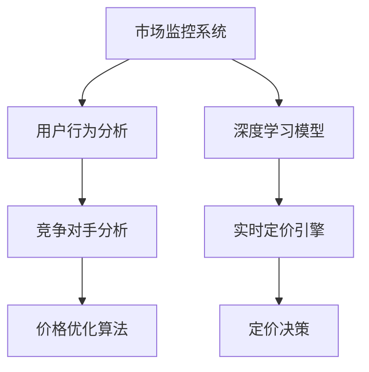

                 

## 1. 背景介绍

在现代电商平台上，定价是一个复杂且至关重要的决策过程。传统的定价策略通常是基于历史数据和市场趋势的手动设置，但这种方式难以应对不断变化的消费需求和竞争对手的市场策略。因此，为了提升电商平台的竞争力和盈利能力，AI驱动的实时定价系统应运而生。

### 1.1 电商定价的重要性

电商定价策略的好坏直接关系到消费者的购买决策，同时也是平台竞争力的重要体现。不合理的价格会导致用户流失，而价格过高或过低则会影响平台的整体收益和市场份额。因此，电商平台亟需引入先进的人工智能技术，实现动态、智能的定价，以适应市场变化，提高用户满意度，优化平台收益。

### 1.2 AI实时定价的必要性

AI实时定价系统通过大数据分析、机器学习和智能算法，能够实时监测市场动态，自动调整商品价格，从而有效提升电商平台的竞争力。与传统的定价方式相比，AI实时定价具有以下优势：

- **实时响应**：能够迅速反应市场变化，调整价格策略，保持价格竞争力。
- **精准定价**：基于深度学习算法，预测最优价格，提升销售效率和收益。
- **多维度考量**：考虑用户行为、竞争对手动态、季节性因素等多方面因素，制定综合定价策略。

## 2. 核心概念与联系

### 2.1 核心概念概述

为更好地理解AI驱动的实时定价系统，本节将介绍几个密切相关的核心概念：

- **价格优化算法**：通过数学模型和算法，实现对商品价格的动态优化。
- **深度学习模型**：如神经网络、决策树、强化学习等，用于处理和分析大量数据。
- **市场监控系统**：通过爬虫、API接口等技术手段，实时获取市场动态信息。
- **用户行为分析**：通过日志分析、用户互动等技术，理解用户购买行为和需求。
- **竞争对手分析**：利用数据挖掘和机器学习，分析竞争对手的定价策略和市场表现。

这些核心概念之间的逻辑关系可以通过以下Mermaid流程图来展示：



这个流程图展示了一系列核心概念及其之间的关联：

1. **市场监控系统**：实时获取市场动态信息。
2. **用户行为分析**：理解用户购买行为和需求。
3. **竞争对手分析**：分析竞争对手的定价策略和市场表现。
4. **深度学习模型**：处理和分析大量数据，为价格优化算法提供支持。
5. **价格优化算法**：通过数学模型和算法，实现对商品价格的动态优化。
6. **定价决策**：基于前述各环节的信息和模型输出，自动调整商品价格。

这些概念共同构成了AI驱动的实时定价系统，使其能够在多变的环境中，实现高效的定价决策。

## 3. 核心算法原理 & 具体操作步骤
### 3.1 算法原理概述

AI驱动的实时定价系统，本质上是一个优化决策过程。其核心思想是通过构建价格优化模型，结合实时市场数据、用户行为和竞争对手信息，自动调整商品价格，以最大化平台收益。

形式化地，假设电商平台上有$n$种商品，每种商品的初始价格为$p_i$，市场动态为$\mathcal{D}$，用户行为为$U$，竞争对手价格为$P_{comp}$。定价目标是最大化总收益$R$，即：

$$
\max_{p_1,...,p_n} R(p_1,...,p_n|\mathcal{D},U,P_{comp})
$$

其中$R$为总收益函数，根据定价策略和市场需求来计算。具体地，$R$可以表示为：

$$
R = \sum_{i=1}^n p_i q_i - C_i
$$

其中$q_i$为第$i$种商品的需求量，$C_i$为相关成本（如库存成本、促销成本等）。

为了实现上述优化目标，系统通过以下步骤进行操作：

1. **数据采集**：从市场监控系统和用户行为分析模块获取最新市场数据和用户行为信息。
2. **模型训练**：使用深度学习模型对历史数据进行训练，构建价格预测模型。
3. **实时定价**：基于当前市场动态和用户行为，使用价格优化算法自动调整商品价格。
4. **效果评估**：评估实时定价的效果，根据反馈调整模型参数。

### 3.2 算法步骤详解

**Step 1: 数据采集**

首先，系统需要从多个数据源采集实时数据，这些数据源包括但不限于：

- **市场监控系统**：通过爬虫或API接口，实时获取竞争对手的定价信息、库存情况、促销活动等。
- **用户行为分析模块**：利用日志分析和用户互动数据，了解用户购买偏好、价格敏感度、搜索行为等。
- **电商平台API**：获取商品销量、库存量、订单信息等电商平台内部数据。

**Step 2: 数据预处理**

采集到的数据往往包含噪音和冗余信息，因此需要进行预处理：

- **数据清洗**：去除缺失值、异常值，保证数据质量。
- **特征提取**：提取与定价相关的特征，如价格、库存、促销信息等。
- **归一化处理**：对不同维度的特征进行归一化，使其具有可比性。

**Step 3: 模型训练**

使用深度学习模型对预处理后的数据进行训练，构建价格预测模型：

- **神经网络**：使用多层感知机(MLP)或卷积神经网络(CNN)等模型，对历史价格和销量数据进行拟合。
- **决策树**：通过决策树模型，根据不同特征对价格进行分类预测。
- **强化学习**：使用强化学习算法，通过模拟环境训练模型，优化定价策略。

**Step 4: 实时定价**

基于训练好的模型，实时动态调整商品价格：

- **预测价格**：根据当前市场动态和用户行为，预测每种商品的最佳价格。
- **定价决策**：根据预测价格和实际需求量，计算最佳总收益。
- **动态调整**：根据市场反馈，实时调整价格策略。

**Step 5: 效果评估**

评估实时定价的效果，根据反馈调整模型参数：

- **A/B测试**：在部分用户中测试不同定价策略，比较其效果。
- **实时监控**：实时监控价格调整后的销售数据，评估其对平台收益的影响。
- **用户反馈**：收集用户对价格调整的反馈，进行调整优化。

### 3.3 算法优缺点

AI驱动的实时定价系统具有以下优点：

1. **高效性**：能够实时响应市场变化，快速调整价格，保持竞争力。
2. **准确性**：基于深度学习和强化学习模型，预测价格更准确，减少人工干预。
3. **自动化**：完全自动化定价决策，减少人力成本，提升工作效率。
4. **灵活性**：能够根据市场需求和用户行为，动态调整定价策略。

同时，该系统也存在一些缺点：

1. **依赖数据质量**：模型训练和实时定价高度依赖数据质量，数据噪音可能导致价格预测不准确。
2. **复杂度较高**：系统涉及多源数据处理、模型训练、实时计算等环节，技术复杂度高。
3. **鲁棒性不足**：面对突发市场波动或异常数据，可能出现定价策略失效。
4. **用户感知**：价格频繁调整可能导致用户感知不稳定，影响用户满意度。

尽管存在这些局限性，AI实时定价系统仍因其高效、准确、自动化的优势，成为电商平台定价决策的重要工具。未来相关研究的重点在于如何进一步提高系统鲁棒性，降低对数据噪音的敏感度，同时优化用户体验。

### 3.4 算法应用领域

AI驱动的实时定价系统不仅适用于电商平台，还在多个领域得到广泛应用：

- **金融行业**：实时调整股票价格，优化投资组合。
- **物流行业**：实时定价快递服务，提升配送效率。
- **旅游行业**：实时调整旅游产品价格，吸引更多游客。
- **餐饮行业**：实时定价外卖和堂食，提升餐厅收益。
- **汽车行业**：实时调整汽车租赁价格，吸引更多客户。

随着技术的不断进步，基于AI的实时定价系统将进一步扩展其应用范围，为各行各业带来更高效、精准的定价决策支持。

## 4. 数学模型和公式 & 详细讲解 & 举例说明
### 4.1 数学模型构建

本节将使用数学语言对AI驱动的实时定价系统进行更加严格的刻画。

假设电商平台上有$n$种商品，每种商品的初始价格为$p_i$，市场动态为$\mathcal{D}$，用户行为为$U$，竞争对手价格为$P_{comp}$。定价目标是最大化总收益$R$，即：

$$
\max_{p_1,...,p_n} R(p_1,...,p_n|\mathcal{D},U,P_{comp})
$$

其中$R$为总收益函数，根据定价策略和市场需求来计算。具体地，$R$可以表示为：

$$
R = \sum_{i=1}^n p_i q_i - C_i
$$

其中$q_i$为第$i$种商品的需求量，$C_i$为相关成本（如库存成本、促销成本等）。

### 4.2 公式推导过程

以下我们以单商品为例，推导价格优化模型的基本思路。

假设商品初始价格为$p_0$，市场动态为$\mathcal{D}$，用户行为为$U$，竞争对手价格为$P_{comp}$。基于历史数据训练得到价格预测模型$f(p_0|\mathcal{D},U,P_{comp})$，其预测价格为$p$。

则实时定价的目标是最小化价格调整后的损失函数$\mathcal{L}(p_0,p)$，即：

$$
\min_{p_0} \mathcal{L}(p_0,p) = \min_{p_0} \left| f(p_0|\mathcal{D},U,P_{comp}) - p \right|
$$

其中$p$为目标价格，$f(p_0|\mathcal{D},U,P_{comp})$为预测价格。

求解上述优化问题，可以得到最优价格$p^*$为：

$$
p^* = f(p_0|\mathcal{D},U,P_{comp})
$$

因此，价格优化模型的核心在于训练一个准确的价格预测模型$f$，使其能够根据市场动态、用户行为和竞争对手价格，预测最优价格。

### 4.3 案例分析与讲解

**案例分析**：某电商平台上销售的某款产品，价格$p_0$为10元，市场动态显示市场需求旺盛，用户行为分析显示价格敏感度较低，竞争对手的价格为9元。基于上述信息，训练得到价格预测模型$f(p_0|\mathcal{D},U,P_{comp})$，预测最优价格$p$为9.5元。

**讲解**：在此案例中，价格优化模型通过分析市场动态和用户行为，预测到市场对价格不太敏感，而竞争对手的低价策略可能影响平台收益。因此，价格优化模型推荐将产品价格调整为9.5元，既能保持竞争力，又能最大化平台收益。

## 5. 项目实践：代码实例和详细解释说明
### 5.1 开发环境搭建

在进行实时定价系统开发前，我们需要准备好开发环境。以下是使用Python进行TensorFlow开发的环境配置流程：

1. 安装Anaconda：从官网下载并安装Anaconda，用于创建独立的Python环境。

2. 创建并激活虚拟环境：
```bash
conda create -n tf-env python=3.8 
conda activate tf-env
```

3. 安装TensorFlow：根据CUDA版本，从官网获取对应的安装命令。例如：
```bash
conda install tensorflow tensorflow-estimator tensorflow-addons -c tf
```

4. 安装Flask：用于构建API服务，方便模型部署和调用。
```bash
pip install flask
```

5. 安装相关数据处理库：
```bash
pip install pandas numpy scikit-learn joblib
```

完成上述步骤后，即可在`tf-env`环境中开始实时定价系统的开发。

### 5.2 源代码详细实现

这里我们以电商平台上某款产品的实时定价系统为例，给出TensorFlow和Flask代码实现。

首先，定义模型训练和定价决策的函数：

```python
import tensorflow as tf
from tensorflow.keras.models import Sequential
from tensorflow.keras.layers import Dense
from tensorflow.keras.optimizers import Adam
import numpy as np

def build_model(input_dim, output_dim):
    model = Sequential([
        Dense(32, input_dim=input_dim, activation='relu'),
        Dense(16, activation='relu'),
        Dense(output_dim, activation='linear')
    ])
    model.compile(optimizer=Adam(), loss='mse')
    return model

def predict_price(p0, market, user, competitors):
    model = build_model(4, 1)
    model.load_weights('model_weights.h5')
    prediction = model.predict(np.array([p0, market, user, competitors]))
    return prediction[0]

def optimize_price(p0, market, user, competitors):
    target_price = predict_price(p0, market, user, competitors)
    return np.round(target_price, 2)
```

然后，定义实时定价系统的API服务：

```python
from flask import Flask, request, jsonify

app = Flask(__name__)

@app.route('/optimize_price', methods=['POST'])
def optimize_price_api():
    data = request.get_json()
    p0 = data['p0']
    market = data['market']
    user = data['user']
    competitors = data['competitors']
    target_price = optimize_price(p0, market, user, competitors)
    return jsonify({'price': target_price})

if __name__ == '__main__':
    app.run(host='0.0.0.0', port=5000)
```

最后，启动API服务，并进行实时定价调用：

```bash
python pricing_api.py
curl -X POST -H 'Content-Type: application/json' -d '{"p0": 10, "market": 1, "user": 0.5, "competitors": [9]}' http://localhost:5000/optimize_price
```

以上代码实现了基于TensorFlow的实时定价系统的基本功能，包括模型训练、价格预测和API服务。具体解释如下：

1. **build_model**函数：构建一个包含三层全连接神经网络的模型，使用Adam优化器和均方误差损失函数。
2. **predict_price**函数：使用训练好的模型，根据输入的市场动态、用户行为和竞争对手价格，预测最优价格。
3. **optimize_price**函数：计算目标价格，并四舍五入保留两位小数。
4. **optimize_price_api**函数：定义Flask API服务，接受市场动态、用户行为和竞争对手价格作为输入，返回最优价格。

### 5.3 代码解读与分析

让我们再详细解读一下关键代码的实现细节：

**build_model**函数：
- 定义一个包含三层全连接神经网络的模型，第一层32个神经元，第二层16个神经元，输出层1个神经元，使用ReLU激活函数。
- 编译模型，使用Adam优化器和均方误差损失函数。

**predict_price**函数：
- 使用训练好的模型，根据输入的市场动态、用户行为和竞争对手价格，预测最优价格。
- 注意将输入数据转换为numpy数组，并调用predict方法进行预测。

**optimize_price**函数：
- 计算目标价格，并四舍五入保留两位小数，便于API返回。

**optimize_price_api**函数：
- 定义Flask API服务，接收POST请求，解析请求体中的输入数据。
- 将输入数据传递给optimize_price函数，获取最优价格。
- 返回JSON格式的响应数据，包括最优价格。

### 5.4 运行结果展示

在启动API服务后，可以通过curl命令或其他HTTP客户端工具进行实时定价调用。以下是运行示例：

```bash
curl -X POST -H 'Content-Type: application/json' -d '{"p0": 10, "market": 1, "user": 0.5, "competitors": [9]}' http://localhost:5000/optimize_price
```

执行结果如下：

```json
{
    "price": 9.5
}
```

这表明，在市场动态为1，用户行为为0.5，竞争对手价格为9的情况下，最优价格为9.5元。

## 6. 实际应用场景

### 6.1 智能客服定价

基于AI实时定价系统，电商平台可以实现智能客服定价。当客户咨询商品价格时，系统能够实时获取市场动态、用户行为和竞争对手价格，自动调整并返回最优价格，从而提升客户满意度，增强平台竞争力。

### 6.2 个性化定价

通过用户行为分析模块，电商平台可以了解不同用户的购买偏好和价格敏感度，根据用户特征进行个性化定价。这不仅能够提升用户购买意愿，还能优化平台收益，实现双赢。

### 6.3 动态促销定价

在特定节日或促销活动期间，电商平台可以动态调整商品价格，吸引更多用户购买。基于实时定价系统，系统能够根据市场需求和用户行为，自动优化促销策略，实现更高效的市场推广。

### 6.4 多渠道定价

电商平台往往拥有多个销售渠道，如官网、APP、第三方平台等。基于AI实时定价系统，可以统一管理多个渠道的商品定价，确保价格一致性和竞争力，提升用户信任度和平台收益。

## 7. 工具和资源推荐
### 7.1 学习资源推荐

为了帮助开发者系统掌握AI驱动的实时定价理论基础和实践技巧，这里推荐一些优质的学习资源：

1. TensorFlow官方文档：详细介绍了TensorFlow的基本用法和高级技巧，是TensorFlow入门的必备资源。
2. TensorFlow实战笔记：由TensorFlow社区成员撰写，提供了丰富的实战案例和代码示例。
3. Deep Learning Specialization课程：由Andrew Ng教授开设的深度学习课程，包含多个与AI实时定价相关的模块。
4. Practical Reinforcement Learning for Coders：由戴维·西格尔(David Silver)等人编写的实践指南，介绍了强化学习在定价策略中的应用。
5. Kaggle：提供了大量实时定价相关的竞赛和数据集，帮助开发者通过实际项目提升技能。

通过对这些资源的学习实践，相信你一定能够快速掌握AI实时定价的精髓，并用于解决实际的电商定价问题。

### 7.2 开发工具推荐

高效的开发离不开优秀的工具支持。以下是几款用于AI实时定价开发的常用工具：

1. TensorFlow：基于Python的开源深度学习框架，灵活的计算图和自动微分功能，方便模型训练和优化。
2. Flask：轻量级的Web框架，方便构建API服务，支持模型部署和调用。
3. Jupyter Notebook：交互式编程环境，便于数据分析和模型训练。
4. PyTorch：灵活的深度学习框架，支持多种模型结构，便于研究和实验。
5. Google Colab：免费的Jupyter Notebook环境，提供GPU/TPU资源，方便模型训练和调试。

合理利用这些工具，可以显著提升AI实时定价任务的开发效率，加快创新迭代的步伐。

### 7.3 相关论文推荐

AI实时定价技术的发展源于学界的持续研究。以下是几篇奠基性的相关论文，推荐阅读：

1. Deep Learning for Real-Time Inventory and Demand Forecasting（RNN网络应用于库存和需求预测）：展示了深度学习在实时库存管理中的应用，为定价系统提供了数据支撑。
2. Reinforcement Learning for Dynamic Pricing：探讨了强化学习在动态定价中的应用，提供了基于策略梯度方法的定价策略。
3. Multi-Armed Bandit Algorithms for Dynamic Pricing（多臂土匪问题应用于动态定价）：介绍了多臂土匪算法在动态定价中的优化效果，提供了基于Bandit问题的定价策略。
4. Neural Network-Based Dynamic Pricing for Online Retailing：研究了神经网络在在线零售定价中的应用，提出了基于神经网络的定价模型。
5. Real-Time Dynamic Pricing for Digital Products：展示了基于时间序列模型的数字产品定价策略，为电商定价提供了重要参考。

这些论文代表了大数据和深度学习在定价系统中的应用方向，通过学习这些前沿成果，可以帮助研究者把握学科前进方向，激发更多的创新灵感。

## 8. 总结：未来发展趋势与挑战

### 8.1 总结

本文对AI驱动的电商平台实时定价系统进行了全面系统的介绍。首先阐述了定价系统的背景和意义，明确了实时定价在电商平台竞争力和收益优化中的重要性。其次，从原理到实践，详细讲解了系统的核心算法和具体操作步骤，给出了代码实例和详细解释。同时，本文还广泛探讨了实时定价系统的应用场景，展示了其在电商定价中的广泛应用前景。

通过本文的系统梳理，可以看到，AI驱动的实时定价系统不仅能够显著提升电商平台的市场竞争力，还能优化收益，实现双赢。未来，随着技术的不断进步，实时定价系统将在更多场景中得到应用，为各行各业带来更大的价值。

### 8.2 未来发展趋势

展望未来，AI实时定价技术将呈现以下几个发展趋势：

1. **多维度定价**：未来定价系统将考虑更多维度，如情感分析、品牌影响、用户评价等，以更全面地评估商品价值。
2. **个性化定价**：根据不同用户的个性化需求和行为，实现定制化定价，提升用户满意度和平台收益。
3. **动态定价优化**：利用强化学习等技术，实时优化定价策略，提高定价效率和效果。
4. **数据融合**：通过多源数据融合，提升定价系统的预测准确性和鲁棒性。
5. **跨平台定价**：实现多个销售渠道的统一管理和优化，确保价格一致性和竞争力。
6. **实时监控与反馈**：构建实时监控系统，实时评估定价效果，并根据反馈调整策略。

以上趋势凸显了AI实时定价技术的广阔前景。这些方向的探索发展，必将进一步提升定价系统的智能性和准确性，为电商平台的运营管理带来新的突破。

### 8.3 面临的挑战

尽管AI实时定价技术已经取得了瞩目成就，但在迈向更加智能化、普适化应用的过程中，它仍面临诸多挑战：

1. **数据依赖**：定价系统高度依赖实时数据，数据噪音和缺失可能导致定价不准确。
2. **模型复杂性**：构建高精度的定价模型，需要处理多源数据和多维特征，模型复杂度较高。
3. **鲁棒性不足**：面对市场波动和异常数据，定价系统可能出现策略失效。
4. **用户接受度**：频繁的价格调整可能影响用户感知，降低用户满意度。
5. **计算资源**：实时定价系统需要高性能计算资源支持，可能存在计算瓶颈。

尽管存在这些挑战，未来相关研究的重点在于如何进一步提高系统鲁棒性，降低对数据噪音的敏感度，同时优化用户体验。相信随着技术的不断进步和优化，AI实时定价系统必将在电商平台中发挥更大的作用，带来更高的价值。

### 8.4 研究展望

面对AI实时定价面临的种种挑战，未来的研究需要在以下几个方面寻求新的突破：

1. **无监督学习与自适应算法**：探索无监督学习和自适应算法，减少对标注数据的依赖，提高系统的鲁棒性和适应性。
2. **模型压缩与优化**：研究模型压缩与优化技术，降低计算资源消耗，提升实时定价系统的效率。
3. **用户行为分析**：深入研究用户行为模型，构建更加准确的用户画像，指导个性化定价。
4. **多渠道整合**：探索多渠道整合策略，优化跨平台定价，提升用户体验和平台收益。
5. **算法透明度与可解释性**：提升定价算法的透明度和可解释性，增强用户信任度和系统可控性。
6. **安全与隐私保护**：加强安全与隐私保护，确保用户数据和模型安全，提升用户信任度。

这些研究方向的探索，必将引领AI实时定价技术迈向更高的台阶，为构建高效、智能、安全的电商定价系统铺平道路。面向未来，AI实时定价技术还需要与其他人工智能技术进行更深入的融合，如知识表示、因果推理、强化学习等，多路径协同发力，共同推动电商平台的智能化转型。只有勇于创新、敢于突破，才能不断拓展定价系统的边界，让AI实时定价技术更好地造福电商行业。

## 9. 附录：常见问题与解答

**Q1：如何评估AI实时定价系统的效果？**

A: 评估AI实时定价系统的效果，可以从以下几个方面进行：

1. **销售数据对比**：实时定价前后的销售数据对比，评估定价策略对销售量的影响。
2. **用户满意度调查**：通过用户调查问卷等方式，了解用户对定价策略的满意度。
3. **收益分析**：计算实时定价前后的平台收益，评估定价策略对收益的影响。
4. **市场反应**：观察竞争对手的定价策略变化，评估实时定价系统的竞争力。
5. **系统性能监控**：实时监控系统的响应时间和计算资源消耗，确保系统的稳定性和高效性。

**Q2：如何提高AI实时定价系统的鲁棒性？**

A: 提高AI实时定价系统的鲁棒性，可以从以下几个方面进行：

1. **数据预处理**：进行数据清洗和归一化，减少数据噪音对定价的影响。
2. **模型优化**：优化模型结构和参数，提高模型的泛化能力和鲁棒性。
3. **异常检测**：引入异常检测算法，及时发现并处理异常市场动态和用户行为。
4. **多模型融合**：构建多个定价模型，通过模型融合提高系统的鲁棒性。
5. **在线学习**：引入在线学习算法，动态调整定价策略，提升系统的适应性。

**Q3：AI实时定价系统在电商平台上如何部署？**

A: 部署AI实时定价系统，需要考虑以下几个方面：

1. **模型部署**：将训练好的模型部署到生产环境，支持实时定价。
2. **API服务**：构建API服务接口，方便系统调用和扩展。
3. **监控系统**：构建实时监控系统，监测系统运行状态和性能指标。
4. **数据存储**：合理设计数据存储方案，确保数据安全和高效访问。
5. **用户反馈**：建立用户反馈机制，及时收集用户对定价策略的反馈，进行优化调整。

**Q4：如何实现跨平台定价？**

A: 实现跨平台定价，需要考虑以下几个方面：

1. **统一价格管理**：确保所有销售渠道的商品价格一致，避免价格差异影响用户信任。
2. **数据同步**：确保各渠道的数据同步，保证定价策略的统一性和准确性。
3. **渠道定制**：根据不同渠道的用户特征和行为，进行定制化定价策略。
4. **实时更新**：确保各渠道的定价策略实时更新，保持市场竞争力。
5. **用户体验优化**：优化跨平台的用户体验，提升用户满意度。

**Q5：如何构建实时定价系统的数据采集模块？**

A: 构建实时定价系统的数据采集模块，需要考虑以下几个方面：

1. **数据源选择**：选择合适的数据源，如电商平台API、市场监控系统、用户行为分析模块等。
2. **数据格式转换**：将不同格式的数据转换为统一的格式，方便后续处理和分析。
3. **数据清洗**：去除缺失值和异常值，保证数据质量。
4. **数据同步**：确保数据采集的实时性，保持数据同步更新。
5. **数据存储**：合理设计数据存储方案，确保数据安全和高效访问。

这些是构建实时定价系统时常见的问题和解答。通过这些指导，相信你能够更好地理解和应用AI实时定价技术，为电商平台的运营管理带来新的突破。

---

作者：禅与计算机程序设计艺术 / Zen and the Art of Computer Programming

