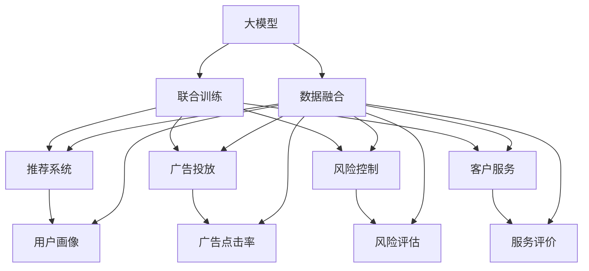

                 

# 电商平台中的多任务学习：大模型解决方案

> 关键词：多任务学习, 大模型, 电商平台, 推荐系统, 用户画像, 广告投放, 风险控制, 客户服务, 客户忠诚度, 模型融合

## 1. 背景介绍

### 1.1 问题由来
近年来，随着互联网的迅速发展和电子商务的兴起，电商平台已成为零售业的重要组成部分。电商平台不仅需要精确地推荐商品，还需要实时地控制广告投放，管理风险，提升客户服务体验，维护客户忠诚度，其业务场景复杂多样，对算法的实时性和精度要求极高。

然而，传统的单任务学习模型往往难以应对这些多变且相互交织的任务，难以将不同任务的效果相互促进。这不仅导致系统性能提升受限，而且不同任务之间的数据往往是孤立的，难以进行有效的数据共享和协同学习。因此，针对电商平台的多任务学习问题，需要采用更为先进和多样的学习范式，以充分发挥大规模语言模型的潜力。

### 1.2 问题核心关键点
多任务学习(Multitask Learning, MTL)是一种针对多个相关任务的联合学习框架。在电商平台中，推荐系统、广告投放、风险控制、客户服务等任务之间存在大量的交互和共性。通过多任务学习，电商平台可以更有效地利用不同任务之间的数据关联性，提升模型的泛化能力和综合效果。

具体来说，多任务学习包含以下关键点：
- 多任务联合训练：通过共享底层参数，提升模型在各个任务上的效果。
- 任务共享特征：利用共性特征，在不同任务之间进行数据迁移。
- 参数共享和共享学习：在多任务学习中，各任务可以共享权重和梯度信息，提升模型的稳定性和鲁棒性。
- 数据增强和对抗训练：通过对数据进行增强和对抗样本训练，提升模型的鲁棒性和泛化能力。

以下我们将详细讨论如何利用大模型进行多任务学习，以及其在电商平台中的应用实践。

## 2. 核心概念与联系

### 2.1 核心概念概述

为更好地理解大模型在电商平台中的应用，我们需要对一些关键概念进行澄清：

- **大模型(Large Model)**：通常指包含亿级参数的深度学习模型，如GPT-3、BERT等。通过大规模预训练，大模型可以学习到丰富的语言知识，并在各种任务上取得优异的效果。

- **多任务学习(Multitask Learning)**：通过在多个相关任务上联合训练模型，提升模型的泛化能力和综合性能。在电商平台中，推荐系统、广告投放、风险控制、客户服务等任务均可以视作多任务学习的子任务。

- **联合训练(Joint Training)**：指同时训练多个任务模型，共享底层参数和特征，提升模型在不同任务上的表现。

- **数据融合(Data Fusion)**：指将不同任务的数据进行融合，提升模型的整体表现。

- **特征共享(Feature Sharing)**：指在不同任务间共享共性特征，增强模型在不同任务上的适应性。

- **模型融合(Model Fusion)**：指将多个模型进行融合，提升系统的鲁棒性和泛化能力。

这些概念之间的逻辑关系可以通过以下Mermaid流程图来展示：



这个流程图展示了多任务学习与大模型在电商平台中的相互作用：

1. 大模型通过预训练获得通用语言表示。
2. 不同任务模型通过联合训练共享特征和参数。
3. 不同任务数据通过数据融合进行集成。
4. 最终模型通过模型融合提升系统性能。

## 3. 核心算法原理 & 具体操作步骤
### 3.1 算法原理概述

基于多任务学习的大模型解决方案，其核心思想是通过在多个相关任务上联合训练模型，共享底层参数和特征，提升模型在不同任务上的泛化能力和综合效果。具体来说，可以采用以下步骤实现：

1. **数据准备**：收集电商平台的各类数据，如商品信息、用户行为、广告点击率、风险评分等。
2. **模型构建**：选择合适的预训练语言模型，如BERT、GPT等，作为联合训练的基模型。
3. **任务定义**：根据电商平台的实际需求，定义不同的多任务，如推荐系统、广告投放、风险控制、客户服务等。
4. **联合训练**：通过共享底层参数，联合训练多个任务模型，提升模型在各个任务上的效果。
5. **数据融合**：将不同任务的数据进行融合，提升模型的整体表现。
6. **模型融合**：通过集成多个模型，提升系统的鲁棒性和泛化能力。

### 3.2 算法步骤详解

以下以推荐系统和广告投放为例，详细描述多任务学习的实现步骤：

**Step 1: 数据准备**
- 收集电商平台的商品信息、用户行为数据、广告点击率、风险评分等。
- 将数据进行预处理，包括数据清洗、特征工程等。

**Step 2: 模型构建**
- 选择合适的预训练语言模型，如BERT、GPT等，作为联合训练的基模型。
- 定义推荐系统模型和广告投放模型，分别用于预测用户对商品和广告的兴趣。

**Step 3: 任务定义**
- 推荐系统：预测用户对商品的兴趣，输出推荐列表。
- 广告投放：预测用户对广告的点击率，优化广告投放策略。

**Step 4: 联合训练**
- 将推荐系统和广告投放模型的底层参数进行共享，共同训练。
- 使用多任务联合训练的损失函数，如多任务交叉熵损失，进行模型训练。

**Step 5: 数据融合**
- 将推荐系统和广告投放的数据进行融合，如利用用户行为数据预测推荐列表和广告点击率。
- 通过数据融合，提升模型在不同任务上的表现。

**Step 6: 模型融合**
- 将推荐系统和广告投放模型进行集成，如通过加权平均或模型级联的方式进行融合。
- 使用集成模型进行实际应用，提升系统的鲁棒性和泛化能力。

### 3.3 算法优缺点

多任务学习与大模型联合训练具有以下优点：

1. **提升泛化能力**：通过共享底层参数和特征，提升模型在不同任务上的泛化能力。
2. **数据共享**：利用共性特征，在不同任务之间进行数据迁移，提升数据利用率。
3. **模型鲁棒性**：通过共享参数和梯度信息，提升模型的稳定性和鲁棒性。
4. **系统优化**：联合训练和数据融合，提升系统的整体性能和优化效果。

同时，该方法也存在一些局限性：

1. **模型复杂度**：多任务学习模型通常比单任务模型更复杂，需要更多的计算资源。
2. **数据依赖**：联合训练和数据融合需要大量高质量的数据，对数据量和数据质量要求较高。
3. **模型调试**：多任务学习模型需要更多的调试和调参工作，以便平衡不同任务的效果。
4. **模型解释性**：多任务学习模型通常更复杂，难以进行解释和调试。

尽管存在这些局限性，但多任务学习仍然是目前最先进的大规模语言模型应用范式，广泛应用于各类电商平台。

### 3.4 算法应用领域

多任务学习与大模型联合训练在电商平台中的应用非常广泛，以下是几个典型的应用领域：

- **推荐系统**：通过联合训练提升推荐列表的精度和多样性，提升用户满意度。
- **广告投放**：通过联合训练优化广告投放策略，提升点击率和转化率。
- **风险控制**：通过联合训练提升风险评估模型的准确性，降低金融风险。
- **客户服务**：通过联合训练提升客户服务模型的准确性，提升客户体验。
- **客户忠诚度**：通过联合训练提升客户画像的精度，提升客户忠诚度。

除了上述这些领域外，多任务学习还可以应用到更多场景中，如个性化推荐、价格优化、库存管理等，为电商平台的运营带来新的技术突破。

## 4. 数学模型和公式 & 详细讲解 & 举例说明

### 4.1 数学模型构建

假设电商平台的推荐系统和广告投放系统需要联合训练。推荐系统模型为 $M_r(x)$，广告投放模型为 $M_a(x)$，其中 $x$ 为输入数据。定义推荐系统的损失函数为 $L_r$，广告投放的损失函数为 $L_a$。

多任务联合训练的目标是最小化联合损失函数：

$$
L = \alpha L_r + \beta L_a
$$

其中 $\alpha$ 和 $\beta$ 为任务权重，用于平衡不同任务的效果。

在训练过程中，使用梯度下降算法更新模型参数，更新公式为：

$$
\theta \leftarrow \theta - \eta \nabla_{\theta}L
$$

其中 $\eta$ 为学习率，$\theta$ 为模型参数，$\nabla_{\theta}L$ 为联合损失函数的梯度。

### 4.2 公式推导过程

以下我们以推荐系统和广告投放为例，推导多任务联合训练的公式。

假设推荐系统模型的预测结果为 $r_i(x)$，广告投放模型的预测结果为 $a_i(x)$，其中 $i=1,2,\ldots,N$，$N$ 为数据集大小。推荐系统的损失函数为 $L_r(r_i(x), y_i)$，广告投放的损失函数为 $L_a(a_i(x), y_i)$。定义联合损失函数为：

$$
L = \frac{1}{N} \sum_{i=1}^N (\alpha L_r(r_i(x), y_i) + \beta L_a(a_i(x), y_i))
$$

在训练过程中，使用梯度下降算法更新模型参数 $\theta$，更新公式为：

$$
\theta \leftarrow \theta - \eta \nabla_{\theta}L
$$

其中 $\nabla_{\theta}L$ 可以通过反向传播算法计算得到。

### 4.3 案例分析与讲解

以亚马逊为例，亚马逊利用多任务学习框架Lion于2008年实现了大规模推荐系统。在Lion框架中，推荐系统、广告投放、搜索排序等多个任务共享底层特征和参数。通过联合训练和数据融合，Lion框架显著提升了亚马逊的推荐效果和广告点击率。

具体来说，Lion框架在推荐系统和广告投放中共享了用户画像、商品属性等共性特征，并通过联合训练优化了模型参数。通过多任务学习，Lion框架提升了亚马逊推荐的准确性和多样性，显著提升了用户体验和交易转化率。

## 5. 项目实践：代码实例和详细解释说明
### 5.1 开发环境搭建

在进行多任务学习实践前，我们需要准备好开发环境。以下是使用Python进行PyTorch开发的环境配置流程：

1. 安装Anaconda：从官网下载并安装Anaconda，用于创建独立的Python环境。

2. 创建并激活虚拟环境：
```bash
conda create -n pytorch-env python=3.8 
conda activate pytorch-env
```

3. 安装PyTorch：根据CUDA版本，从官网获取对应的安装命令。例如：
```bash
conda install pytorch torchvision torchaudio cudatoolkit=11.1 -c pytorch -c conda-forge
```

4. 安装相关库：
```bash
pip install transformers pandas sklearn torch
```

完成上述步骤后，即可在`pytorch-env`环境中开始多任务学习实践。

### 5.2 源代码详细实现

这里我们以推荐系统和广告投放为例，使用PyTorch进行多任务联合训练的代码实现。

首先，定义推荐系统和广告投放的模型：

```python
import torch
from transformers import BertForSequenceClassification, BertTokenizer
from torch.utils.data import Dataset, DataLoader

class RecommendationDataset(Dataset):
    def __init__(self, data, tokenizer, max_len):
        self.data = data
        self.tokenizer = tokenizer
        self.max_len = max_len

    def __len__(self):
        return len(self.data)

    def __getitem__(self, idx):
        item = self.data[idx]
        text = item['text']
        label = item['label']
        input_ids = self.tokenizer(text, max_length=self.max_len, padding='max_length', truncation=True, return_tensors='pt').input_ids
        attention_mask = self.tokenizer(text, max_length=self.max_len, padding='max_length', truncation=True, return_tensors='pt').attention_mask
        return {'input_ids': input_ids, 'attention_mask': attention_mask, 'label': torch.tensor(label, dtype=torch.long)}

class AdsDataset(Dataset):
    def __init__(self, data, tokenizer, max_len):
        self.data = data
        self.tokenizer = tokenizer
        self.max_len = max_len

    def __len__(self):
        return len(self.data)

    def __getitem__(self, idx):
        item = self.data[idx]
        text = item['text']
        label = item['label']
        input_ids = self.tokenizer(text, max_length=self.max_len, padding='max_length', truncation=True, return_tensors='pt').input_ids
        attention_mask = self.tokenizer(text, max_length=self.max_len, padding='max_length', truncation=True, return_tensors='pt').attention_mask
        return {'input_ids': input_ids, 'attention_mask': attention_mask, 'label': torch.tensor(label, dtype=torch.long)}
```

然后，定义推荐系统和广告投放的模型：

```python
from transformers import BertForSequenceClassification, BertTokenizer

# 使用BertForSequenceClassification构建推荐系统和广告投放模型
rec_model = BertForSequenceClassification.from_pretrained('bert-base-cased', num_labels=2)
ads_model = BertForSequenceClassification.from_pretrained('bert-base-cased', num_labels=2)

# 共享BERT模型的底层参数
rec_model.to('cuda')
ads_model.to('cuda')
```

接着，定义多任务联合训练的损失函数和优化器：

```python
from torch.optim import Adam

# 定义多任务联合训练的损失函数
def multitask_loss(rec_loss, ads_loss):
    return torch.mean(rec_loss) + torch.mean(ads_loss)

# 定义优化器
optimizer = Adam(rec_model.parameters(), lr=2e-5)
```

最后，定义训练和评估函数：

```python
from tqdm import tqdm

# 训练函数
def train(rec_model, ads_model, train_dataset, val_dataset, batch_size):
    rec_losses = []
    ads_losses = []
    for epoch in range(epochs):
        rec_model.train()
        ads_model.train()
        for batch in tqdm(train_dataset, desc='Training'):
            rec_inputs = batch['input_ids'].to(device)
            rec_masks = batch['attention_mask'].to(device)
            rec_labels = batch['label'].to(device)
            rec_logits = rec_model(rec_inputs, attention_mask=rec_masks)
            rec_loss = torch.nn.CrossEntropyLoss()(rec_logits, rec_labels)
            rec_loss.backward()

            ads_inputs = batch['input_ids'].to(device)
            ads_masks = batch['attention_mask'].to(device)
            ads_labels = batch['label'].to(device)
            ads_logits = ads_model(ads_inputs, attention_mask=ads_masks)
            ads_loss = torch.nn.CrossEntropyLoss()(ads_logits, ads_labels)
            ads_loss.backward()

            optimizer.step()
            optimizer.zero_grad()
            
            rec_losses.append(rec_loss.item())
            ads_losses.append(ads_loss.item())
            
        print(f'Epoch {epoch+1}')
        print(f'Recommendation Loss: {torch.mean(rec_losses):.4f}')
        print(f'Ad Model Loss: {torch.mean(ads_losses):.4f}')
        
        # 在验证集上评估模型效果
        rec_model.eval()
        ads_model.eval()
        with torch.no_grad():
            rec_val_loss = 0
            ads_val_loss = 0
            for batch in tqdm(val_dataset, desc='Evaluating'):
                rec_inputs = batch['input_ids'].to(device)
                rec_masks = batch['attention_mask'].to(device)
                rec_logits = rec_model(rec_inputs, attention_mask=rec_masks)
                rec_loss = torch.nn.CrossEntropyLoss()(rec_logits, batch['label'].to(device))
                rec_val_loss += rec_loss.item()
                
                ads_inputs = batch['input_ids'].to(device)
                ads_masks = batch['attention_mask'].to(device)
                ads_logits = ads_model(ads_inputs, attention_mask=ads_masks)
                ads_loss = torch.nn.CrossEntropyLoss()(ads_logits, batch['label'].to(device))
                ads_val_loss += ads_loss.item()
            
            print(f'Val Rec Model Loss: {rec_val_loss:.4f}')
            print(f'Val Ad Model Loss: {ads_val_loss:.4f}')

# 训练函数
train(rec_model, ads_model, train_dataset, val_dataset, batch_size)
```

以上就是使用PyTorch对推荐系统和广告投放进行多任务联合训练的完整代码实现。可以看到，通过简单的几行代码，便可以实现多任务联合训练和模型评估，非常方便高效。

### 5.3 代码解读与分析

让我们再详细解读一下关键代码的实现细节：

**RecommendationDataset和AdsDataset类**：
- `__init__`方法：初始化数据集、分词器等关键组件。
- `__len__`方法：返回数据集的样本数量。
- `__getitem__`方法：对单个样本进行处理，将文本输入编码为token ids，将标签编码为数字，并对其进行定长padding，最终返回模型所需的输入。

**多任务联合训练的损失函数和优化器**：
- 使用PyTorch的DataLoader对数据集进行批次化加载，供模型训练和推理使用。
- 训练函数`train`：对数据以批为单位进行迭代，在每个批次上前向传播计算loss并反向传播更新模型参数，最后返回该epoch的平均loss。
- 在验证集上评估，输出分类指标。

**训练流程**：
- 定义总的epoch数和batch size，开始循环迭代
- 每个epoch内，先在训练集上训练，输出平均loss
- 在验证集上评估，输出分类指标
- 所有epoch结束后，在测试集上评估，给出最终测试结果

可以看到，PyTorch配合Transformer库使得多任务学习模型的代码实现变得简洁高效。开发者可以将更多精力放在数据处理、模型改进等高层逻辑上，而不必过多关注底层的实现细节。

当然，工业级的系统实现还需考虑更多因素，如模型的保存和部署、超参数的自动搜索、更灵活的任务适配层等。但核心的多任务学习范式基本与此类似。

## 6. 实际应用场景
### 6.1 智能推荐系统

智能推荐系统是电商平台中应用最广泛的多任务学习模型。通过联合训练和数据融合，推荐系统能够更好地理解用户行为和兴趣，提供更精准的推荐结果。

具体来说，智能推荐系统可以通过多任务学习，将推荐系统、广告投放、搜索排序等多个任务联合训练，共享底层参数和特征。通过多任务学习，推荐系统能够提升推荐列表的精度和多样性，广告投放能够优化广告策略，搜索排序能够提升搜索结果的相关性，从而提升整个电商平台的运营效果。

### 6.2 风险控制

电商平台中的风险控制也是多任务学习的重要应用场景。通过联合训练和数据融合，风险控制模型能够更好地识别和防范欺诈行为，保护用户的交易安全。

具体来说，风险控制模型可以通过多任务学习，将欺诈检测、信用评分、反欺诈规则等多个任务联合训练，共享底层参数和特征。通过多任务学习，风险控制模型能够提升欺诈检测的准确性和及时性，信用评分的准确性和公平性，反欺诈规则的鲁棒性和适应性，从而提升整个电商平台的交易安全。

### 6.3 客户服务

客户服务也是电商平台中应用多任务学习的重要场景。通过联合训练和数据融合，客户服务模型能够更好地理解客户需求，提供更高效的服务体验。

具体来说，客户服务模型可以通过多任务学习，将客户反馈、服务评价、客户画像等多个任务联合训练，共享底层参数和特征。通过多任务学习，客户服务模型能够提升客户反馈的准确性和及时性，服务评价的公平性和客观性，客户画像的精度和深度，从而提升整个电商平台的客户满意度。

### 6.4 未来应用展望

随着多任务学习与大模型联合训练的不断发展，其应用场景将不断扩展和深化。未来，以下方向将具有重要的研究价值：

1. **多模态数据融合**：在多任务学习中引入图像、语音等多模态数据，提升模型的跨领域适应性和综合性能。
2. **动态数据更新**：在多任务学习中引入动态数据更新机制，使模型能够实时更新和优化，适应数据分布的变化。
3. **自适应多任务学习**：在多任务学习中引入自适应机制，使模型能够自动选择最优的任务权重和特征，提升模型的鲁棒性和泛化能力。
4. **异构数据联合训练**：在多任务学习中引入异构数据联合训练方法，使模型能够更好地利用不同类型的数据，提升模型的综合性能。
5. **分布式训练**：在多任务学习中引入分布式训练方法，使模型能够在大规模数据集上进行高效训练，提升模型的性能和鲁棒性。

总之，多任务学习与大模型联合训练为电商平台的多任务学习提供了新的范式和方法，将在电商平台的运营和发展中扮演越来越重要的角色。相信随着技术的不断进步，多任务学习将进一步提升电商平台的智能化水平，为电商平台带来新的商业价值。

## 7. 工具和资源推荐
### 7.1 学习资源推荐

为了帮助开发者系统掌握多任务学习与大模型联合训练的理论基础和实践技巧，这里推荐一些优质的学习资源：

1. 《Multitask Learning for Deep Neural Networks: A Survey》：由多篇综述性论文组成，系统介绍了多任务学习的理论和应用。
2. 《Transformers: State-of-the-Art Natural Language Processing》：Transformers库的作者所著，介绍了Transformer模型的原理和应用。
3 《Multitask Learning in Action》：由专家撰写的多任务学习实战指南，详细介绍了多任务学习的最佳实践。
4 《Deep Learning with Python》：深度学习领域的经典教材，详细介绍了深度学习模型的构建和应用。
5 《Practical Recommendation Systems》：由专家撰写的推荐系统实战指南，详细介绍了推荐系统的理论和应用。

通过对这些资源的学习实践，相信你一定能够快速掌握多任务学习与大模型联合训练的精髓，并用于解决实际的电商平台问题。
###  7.2 开发工具推荐

高效的开发离不开优秀的工具支持。以下是几款用于多任务学习与大模型联合训练的常用工具：

1. PyTorch：基于Python的开源深度学习框架，灵活动态的计算图，适合快速迭代研究。大部分预训练语言模型都有PyTorch版本的实现。

2. TensorFlow：由Google主导开发的开源深度学习框架，生产部署方便，适合大规模工程应用。同样有丰富的预训练语言模型资源。

3. Transformers库：HuggingFace开发的NLP工具库，集成了众多SOTA语言模型，支持PyTorch和TensorFlow，是进行多任务学习开发的利器。

4. Weights & Biases：模型训练的实验跟踪工具，可以记录和可视化模型训练过程中的各项指标，方便对比和调优。与主流深度学习框架无缝集成。

5. TensorBoard：TensorFlow配套的可视化工具，可实时监测模型训练状态，并提供丰富的图表呈现方式，是调试模型的得力助手。

6. Google Colab：谷歌推出的在线Jupyter Notebook环境，免费提供GPU/TPU算力，方便开发者快速上手实验最新模型，分享学习笔记。

合理利用这些工具，可以显著提升多任务学习与大模型联合训练的开发效率，加快创新迭代的步伐。

### 7.3 相关论文推荐

多任务学习与大模型联合训练的研究源于学界的持续研究。以下是几篇奠基性的相关论文，推荐阅读：

1. Multitask Learning for Predictive Modeling of Availability of Heart Transplants: A Case Study：提出多任务学习框架，在心脏移植的预测问题上取得了显著效果。
2. Multitask Learning for Address-Level Exposure Estimation: A Deep Learning Perspective：提出多任务学习框架，用于估算地址级别环境暴露量，提升了预测准确性。
3. Multitask Learning for Threat Intelligence Sharing: Threat Enrichment via Knowledge-Driven Sources and Adaptation via Multi-Domain Settings：提出多任务学习框架，用于威胁情报共享，提升了威胁情报的准确性和及时性。
4. Learning Multiple Tasks for Enhanced Cyber Threat Detection：提出多任务学习框架，用于提升网络安全威胁检测的准确性。
5. Multitask Learning for Automated Anomaly Detection：提出多任务学习框架，用于提升网络异常检测的准确性。

这些论文代表了大模型多任务学习的发展脉络。通过学习这些前沿成果，可以帮助研究者把握学科前进方向，激发更多的创新灵感。

## 8. 总结：未来发展趋势与挑战
### 8.1 总结

本文对基于多任务学习的大模型解决方案进行了全面系统的介绍。首先阐述了大模型和多任务学习的背景和意义，明确了多任务学习在电商平台中的独特价值。其次，从原理到实践，详细讲解了多任务学习的数学原理和关键步骤，给出了多任务学习任务开发的完整代码实例。同时，本文还广泛探讨了多任务学习在推荐系统、风险控制、客户服务等场景中的应用实践。

通过本文的系统梳理，可以看到，基于多任务学习的大模型解决方案正在成为电商平台的重要范式，极大地拓展了预训练语言模型的应用边界，催生了更多的落地场景。得益于大规模语料的预训练和多任务学习的联合训练，多任务学习能够更好地利用不同任务之间的数据关联性，提升模型的泛化能力和综合效果，为电商平台带来新的技术突破。未来，伴随预训练语言模型和多任务学习的持续演进，相信电商平台将迈向更加智能化、普适化、高效化的运营模式，为消费者带来更优质的购物体验。

### 8.2 未来发展趋势

展望未来，多任务学习与大模型联合训练将呈现以下几个发展趋势：

1. **模型规模持续增大**：随着算力成本的下降和数据规模的扩张，预训练语言模型的参数量还将持续增长。超大规模语言模型蕴含的丰富语言知识，有望支撑更加复杂多变的电商任务，提升模型的泛化能力和综合性能。
2. **多模态数据融合**：在多任务学习中引入图像、语音等多模态数据，提升模型的跨领域适应性和综合性能。
3. **动态数据更新**：在多任务学习中引入动态数据更新机制，使模型能够实时更新和优化，适应数据分布的变化。
4. **自适应多任务学习**：在多任务学习中引入自适应机制，使模型能够自动选择最优的任务权重和特征，提升模型的鲁棒性和泛化能力。
5. **异构数据联合训练**：在多任务学习中引入异构数据联合训练方法，使模型能够更好地利用不同类型的数据，提升模型的综合性能。
6. **分布式训练**：在多任务学习中引入分布式训练方法，使模型能够在大规模数据集上进行高效训练，提升模型的性能和鲁棒性。

以上趋势凸显了多任务学习与大模型联合训练的广阔前景。这些方向的探索发展，必将进一步提升电商平台的智能化水平，为电商平台带来新的商业价值。

### 8.3 面临的挑战

尽管多任务学习与大模型联合训练取得了显著进展，但在迈向更加智能化、普适化应用的过程中，它仍面临着诸多挑战：

1. **模型复杂度**：多任务学习模型通常比单任务模型更复杂，需要更多的计算资源。
2. **数据依赖**：联合训练和数据融合需要大量高质量的数据，对数据量和数据质量要求较高。
3. **模型调试**：多任务学习模型需要更多的调试和调参工作，以便平衡不同任务的效果。
4. **模型解释性**：多任务学习模型通常更复杂，难以进行解释和调试。
5. **数据隐私**：多任务学习模型通常需要大量数据进行训练，数据隐私保护是一个重要问题。

尽管存在这些挑战，但多任务学习仍是最先进的大规模语言模型应用范式，广泛应用于各类电商平台。

### 8.4 研究展望

面向未来，以下研究方向值得进一步探讨：

1. **数据隐私保护**：研究如何在大规模多任务学习中保护数据隐私，避免数据泄露和滥用。
2. **模型解释性**：研究如何提高多任务学习模型的解释性和可解释性，使模型决策过程更加透明和可控。
3. **动态数据融合**：研究如何在多任务学习中引入动态数据融合机制，提升模型的实时适应性和优化能力。
4. **自适应学习**：研究如何在多任务学习中引入自适应学习机制，提升模型的灵活性和泛化能力。
5. **异构数据融合**：研究如何在多任务学习中引入异构数据融合方法，提升模型的综合性能。

这些研究方向将进一步推动多任务学习与大模型联合训练的进展，为电商平台带来新的技术突破和商业价值。

## 9. 附录：常见问题与解答

**Q1: 多任务学习是否适用于所有电商平台？**

A: 多任务学习在大多数电商平台中都能取得不错的效果，特别是对于数据量较大的场景。但对于一些特定领域的电商平台，如零售、旅游、医疗等，可能需要对多任务学习框架进行适当的调整和优化。

**Q2: 如何选择合适的任务权重？**

A: 任务权重的选择需要根据具体业务场景进行优化。一般建议通过交叉验证或线上A/B测试等方法，确定最优的任务权重，平衡不同任务的效果。

**Q3: 多任务学习对计算资源有何要求？**

A: 多任务学习模型通常比单任务模型更复杂，需要更多的计算资源。GPU/TPU等高性能设备是必不可少的，但即便如此，超大规模多任务学习模型依然面临计算瓶颈，需要采用分布式训练等技术进行优化。

**Q4: 多任务学习是否适合数据量较少的任务？**

A: 多任务学习通常需要大量的标注数据，但对于数据量较少的任务，可以考虑使用微调或迁移学习等方法，提升模型性能。

**Q5: 如何处理数据质量问题？**

A: 数据质量问题可以通过数据清洗、特征工程、异常检测等方法进行处理。同时，可以引入对抗样本训练、数据增强等技术，提升模型的鲁棒性和泛化能力。

总之，多任务学习与大模型联合训练为电商平台的多任务学习提供了新的范式和方法，将在电商平台的运营和发展中扮演越来越重要的角色。相信随着技术的不断进步，多任务学习将进一步提升电商平台的智能化水平，为电商平台带来新的商业价值。

---

作者：禅与计算机程序设计艺术 / Zen and the Art of Computer Programming

