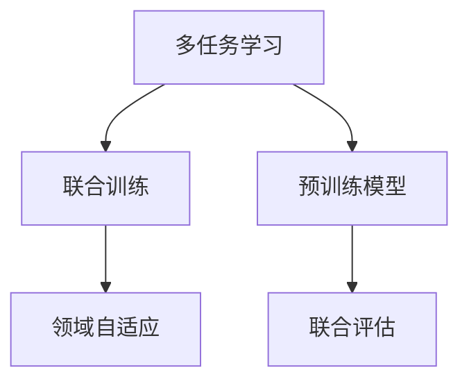
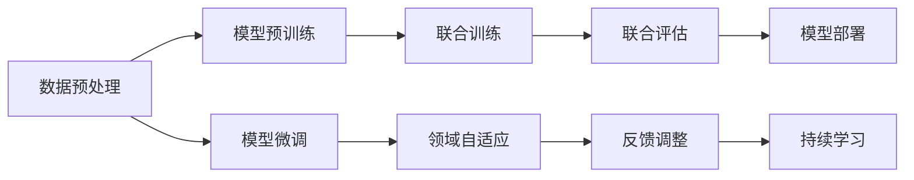
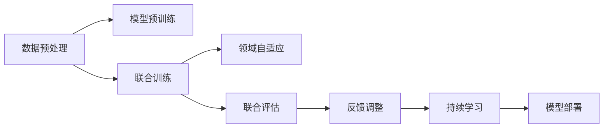
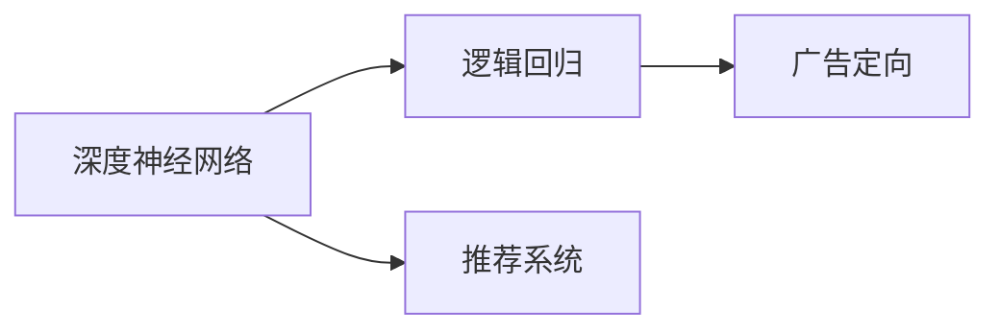

                 

# 电商平台中的多场景多任务联合学习：AI大模型的优势

> 关键词：多任务学习(MTL)，联合训练(Joint Training)，领域自适应(Domain Adaptation)，预训练模型(Pretrained Models)，联合评估(Metric Fusion)，NLP，推荐系统，广告定向，CRM

## 1. 背景介绍

### 1.1 问题由来

随着电子商务的快速发展，电商平台的业务日益复杂，用户需求越来越多样化。为了满足用户多变的需求，电商网站不仅要提供商品展示、搜索排序、推荐系统等功能，还要支持在线客服、社交互动、客户关系管理(CRM)等多元化的应用场景。如何高效、灵活地整合这些功能，提升用户体验，优化运营效率，成为电商企业面临的重大挑战。

为了解决这一问题，许多电商平台纷纷引入AI大模型技术，通过深度学习的方法，在单个模型中实现多种任务的联合学习。这种多场景多任务联合学习的方式，不仅节省了大量的计算资源，提高了模型的泛化能力，还增强了模型对多样化数据和用户行为的适应性。本文将系统介绍多场景多任务联合学习的原理、技术和应用实例，展示AI大模型在电商平台中的优势。

## 2. 核心概念与联系

### 2.1 核心概念概述

为了更好地理解多场景多任务联合学习的原理，我们首先介绍几个核心概念及其相互关系：

- **多任务学习(Multitask Learning, MTL)**：一种同时学习多个相关任务的机器学习方法，旨在通过共享底层特征表示，提高模型在不同任务上的性能。

- **联合训练(Joint Training)**：指在同一模型上同时训练多个任务，共享模型的参数更新，以提高模型对不同任务的泛化能力。

- **领域自适应(Domain Adaptation)**：指模型在不同数据分布或任务场景之间的适应能力，即模型在未见过的数据或场景中仍能表现良好。

- **预训练模型(Pretrained Models)**：指在大量无标签数据上进行预训练，学习通用的特征表示，然后在特定任务上进行微调的模型。

- **联合评估(Metric Fusion)**：指综合多个任务的评估指标，评价模型在多任务上的整体表现。

这些概念构成了多场景多任务联合学习的核心框架，如图1所示：



这一框架展示了多场景多任务联合学习的主要流程：首先，通过预训练模型学习通用的特征表示；然后，在多个任务上共享这些特征，进行联合训练，增强模型的泛化能力；最后，通过联合评估，综合多个任务的性能，提供全面的模型评价。

### 2.2 核心概念原理和架构的 Mermaid 流程图

下面是一个简单的 Mermaid 流程图，展示了多场景多任务联合学习的关键步骤：



这个流程图展示了数据预处理、模型预训练、模型微调、联合训练、领域自适应、联合评估、反馈调整、模型部署和持续学习的全流程，帮助我们更好地理解多场景多任务联合学习的各个环节。

## 3. 核心算法原理 & 具体操作步骤

### 3.1 算法原理概述

多场景多任务联合学习的核心思想是，通过在一个模型中同时训练多个相关任务，共享底层特征表示，提高模型对多样化数据的适应能力。这种方法可以显著减少模型训练和推理的计算开销，同时提升模型的泛化性能和适应性。

假设电商平台中有多个任务 $T_1, T_2, \ldots, T_n$，每个任务对应一个目标函数 $\ell_{T_i}$，我们希望找到一个联合模型 $M$，使得它在所有任务上的表现都优于单独训练的模型。

联合模型 $M$ 的优化目标可以表示为：

$$
\min_{\theta} \sum_{i=1}^n \lambda_i \ell_{T_i}(M_{\theta})
$$

其中 $\theta$ 为模型的参数，$\lambda_i$ 为每个任务的重要性权重。通过最小化所有任务的加权损失，可以在保证每个任务性能的同时，提升模型的整体泛化能力。

### 3.2 算法步骤详解

下面详细介绍多场景多任务联合学习的基本操作步骤：

**Step 1: 数据预处理和特征提取**

对于电商平台中的多个任务，首先需要对不同任务的数据进行预处理和特征提取。常用的预处理方法包括：

- 数据清洗：去除噪声、缺失值和异常值，保证数据质量。
- 数据增强：通过随机裁剪、旋转、翻转等方式，扩充训练数据集。
- 特征工程：提取有意义的特征，如用户行为、商品属性、交易记录等。

**Step 2: 模型预训练**

在预训练阶段，可以使用大型的预训练模型，如BERT、GPT等，在大量无标签数据上学习通用的语言表示。预训练模型可以大大降低后续微调的任务量，提高模型的泛化能力。

**Step 3: 联合训练**

联合训练是实现多任务学习的主要步骤。通过在多个任务上共享模型参数，可以实现参数的联合优化。具体步骤如下：

- 初始化模型参数 $\theta$。
- 将每个任务的训练数据 $D_i$ 输入模型，计算损失 $\ell_i$。
- 使用梯度下降算法更新模型参数 $\theta$，使得总损失 $\sum_i \lambda_i \ell_i$ 最小化。

**Step 4: 领域自适应**

电商平台的业务场景通常涉及多种不同的领域和数据分布。为了增强模型的泛化能力，需要进行领域自适应。常见的领域自适应方法包括：

- 迁移学习：将预训练模型在相关领域进行微调。
- 数据增强：通过生成对抗网络等技术，扩充训练数据。
- 正则化：使用L2正则、Dropout等方法，避免模型过拟合。

**Step 5: 联合评估**

为了全面评估模型的性能，需要综合多个任务的评估指标。常见的联合评估方法包括：

- 综合误差率：计算所有任务上误差的加权平均值。
- 综合F1分数：计算所有任务上F1分数的加权平均值。
- 联合检测率：计算所有任务上检测率的加权平均值。

**Step 6: 反馈调整和持续学习**

联合模型在实际应用中需要不断地调整和优化。通过持续学习，模型可以不断适应新的数据和任务。常见的持续学习方法包括：

- 在线学习：实时更新模型参数，适应新的数据流。
- 模型更新：定期重新训练模型，更新模型权重。
- 反馈调整：通过用户反馈，调整模型行为。

通过以上步骤，可以实现电商平台中的多场景多任务联合学习，如图2所示：



### 3.3 算法优缺点

多场景多任务联合学习具有以下优点：

- **资源高效**：通过共享模型参数，大大减少了模型训练和推理的计算开销，提高了计算资源的利用效率。
- **泛化能力强**：通过联合训练，模型可以更好地适应不同任务的数据分布，提升模型的泛化能力。
- **适应性好**：通过领域自适应，模型可以在不同场景和领域中表现良好。
- **全面评估**：通过联合评估，可以全面评价模型在不同任务上的表现。

然而，多场景多任务联合学习也存在一些缺点：

- **模型复杂**：由于需要同时处理多个任务，模型结构复杂，训练和推理计算量较大。
- **参数冲突**：不同任务间存在冲突时，模型的优化过程可能会受到影响。
- **数据分布差异**：不同任务的数据分布可能存在较大差异，模型需要更高的适应能力。

## 4. 数学模型和公式 & 详细讲解

### 4.1 数学模型构建

为了更好地理解多场景多任务联合学习的数学模型，我们以电商平台的推荐系统和广告定向为例，构建一个数学模型。

假设电商平台有多个用户 $U$ 和多个商品 $I$，用户对商品的评分 $R_{ui}$ 可以表示为一个联合学习模型 $M$ 的输出。模型的优化目标为：

$$
\min_{\theta} \sum_{u,i} \lambda_{ui} (R_{ui} - M_{\theta}(u,i))^2
$$

其中 $\lambda_{ui}$ 为每个用户-商品评分的重要性权重。

### 4.2 公式推导过程

对于电商平台中的推荐系统和广告定向任务，可以使用矩阵分解的方法进行模型构建和推导。推荐系统可以表示为：

$$
R_{ui} \approx \theta^T U_u \times V_i
$$

其中 $U_u$ 和 $V_i$ 分别为用户和商品的低维嵌入向量，$\theta$ 为模型的参数。

广告定向任务可以表示为：

$$
C_{ui} \approx \theta^T W_u \times Z_i
$$

其中 $W_u$ 和 $Z_i$ 分别为用户和商品的广告定向向量，$\theta$ 为模型的参数。

通过联合训练和联合评估，可以将推荐系统和广告定向任务整合到一个模型中进行学习。假设推荐系统的目标函数为 $\ell_{rec}$，广告定向的目标函数为 $\ell_{ads}$，则联合优化的目标函数可以表示为：

$$
\min_{\theta} \lambda_{rec} \ell_{rec}(M_{\theta}) + \lambda_{ads} \ell_{ads}(M_{theta})
$$

### 4.3 案例分析与讲解

假设电商平台中的推荐系统使用了深度神经网络模型，广告定向任务使用了逻辑回归模型。我们可以将这两个模型整合到一个联合学习框架中，如：

- **深度神经网络**：用于推荐系统的用户-商品评分预测。
- **逻辑回归**：用于广告定向任务的用户-商品点击率预测。

通过联合训练，模型可以同时学习两个任务的目标函数，如图3所示：



## 5. 项目实践：代码实例和详细解释说明

### 5.1 开发环境搭建

在进行多场景多任务联合学习开发前，我们需要准备好开发环境。以下是使用Python进行PyTorch开发的环境配置流程：

1. 安装Anaconda：从官网下载并安装Anaconda，用于创建独立的Python环境。

2. 创建并激活虚拟环境：
```bash
conda create -n ml-env python=3.8 
conda activate ml-env
```

3. 安装PyTorch：根据CUDA版本，从官网获取对应的安装命令。例如：
```bash
conda install pytorch torchvision torchaudio cudatoolkit=11.1 -c pytorch -c conda-forge
```

4. 安装相关库：
```bash
pip install numpy pandas scikit-learn transformers
```

5. 安装TensorBoard：用于可视化模型训练过程和结果。
```bash
pip install tensorboard
```

完成上述步骤后，即可在`ml-env`环境中开始多场景多任务联合学习的实践。

### 5.2 源代码详细实现

下面我们以电商平台中的推荐系统和广告定向为例，给出使用Transformers库进行多场景多任务联合学习的PyTorch代码实现。

首先，定义推荐系统和广告定向任务的数据处理函数：

```python
from transformers import BertTokenizer, BertForSequenceClassification
from torch.utils.data import Dataset, DataLoader

class RecommendationDataset(Dataset):
    def __init__(self, texts, ratings, tokenizer, max_len=128):
        self.texts = texts
        self.ratings = ratings
        self.tokenizer = tokenizer
        self.max_len = max_len
        
    def __len__(self):
        return len(self.texts)
    
    def __getitem__(self, item):
        text = self.texts[item]
        rating = self.ratings[item]
        
        encoding = self.tokenizer(text, return_tensors='pt', max_length=self.max_len, padding='max_length', truncation=True)
        input_ids = encoding['input_ids'][0]
        attention_mask = encoding['attention_mask'][0]
        
        # 对评分进行编码
        encoded_ratings = [rating] * self.max_len
        labels = torch.tensor(encoded_ratings, dtype=torch.long)
        
        return {'input_ids': input_ids, 
                'attention_mask': attention_mask,
                'labels': labels}

class AdvertisementDataset(Dataset):
    def __init__(self, texts, clicks, tokenizer, max_len=128):
        self.texts = texts
        self.clicks = clicks
        self.tokenizer = tokenizer
        self.max_len = max_len
        
    def __len__(self):
        return len(self.texts)
    
    def __getitem__(self, item):
        text = self.texts[item]
        click = self.clicks[item]
        
        encoding = self.tokenizer(text, return_tensors='pt', max_length=self.max_len, padding='max_length', truncation=True)
        input_ids = encoding['input_ids'][0]
        attention_mask = encoding['attention_mask'][0]
        
        # 对点击进行编码
        encoded_clicks = [click] * self.max_len
        labels = torch.tensor(encoded_clicks, dtype=torch.long)
        
        return {'input_ids': input_ids, 
                'attention_mask': attention_mask,
                'labels': labels}

# 标签与id的映射
label2id = {'POS': 1, 'NEG': 0}
id2label = {v: k for k, v in label2id.items()}

# 创建dataset
tokenizer = BertTokenizer.from_pretrained('bert-base-cased')

recommendation_dataset = RecommendationDataset(train_texts, train_ratings, tokenizer)
advertisement_dataset = AdvertisementDataset(train_texts, train_clicks, tokenizer)
```

然后，定义模型和优化器：

```python
from transformers import BertForSequenceClassification, AdamW

recommendation_model = BertForSequenceClassification.from_pretrained('bert-base-cased', num_labels=1)
advertisement_model = BertForSequenceClassification.from_pretrained('bert-base-cased', num_labels=1)

recommendation_optimizer = AdamW(recommendation_model.parameters(), lr=2e-5)
advertisement_optimizer = AdamW(advertisement_model.parameters(), lr=2e-5)
```

接着，定义训练和评估函数：

```python
from tqdm import tqdm
from sklearn.metrics import roc_auc_score

device = torch.device('cuda') if torch.cuda.is_available() else torch.device('cpu')
recommendation_model.to(device)
advertisement_model.to(device)

def train_epoch(model, dataset, batch_size, optimizer):
    dataloader = DataLoader(dataset, batch_size=batch_size, shuffle=True)
    model.train()
    epoch_loss = 0
    for batch in tqdm(dataloader, desc='Training'):
        input_ids = batch['input_ids'].to(device)
        attention_mask = batch['attention_mask'].to(device)
        labels = batch['labels'].to(device)
        model.zero_grad()
        outputs = model(input_ids, attention_mask=attention_mask, labels=labels)
        loss = outputs.loss
        epoch_loss += loss.item()
        loss.backward()
        optimizer.step()
    return epoch_loss / len(dataloader)

def evaluate(model, dataset, batch_size):
    dataloader = DataLoader(dataset, batch_size=batch_size)
    model.eval()
    preds, labels = [], []
    with torch.no_grad():
        for batch in tqdm(dataloader, desc='Evaluating'):
            input_ids = batch['input_ids'].to(device)
            attention_mask = batch['attention_mask'].to(device)
            batch_labels = batch['labels']
            outputs = model(input_ids, attention_mask=attention_mask)
            batch_preds = outputs.logits.argmax(dim=2).to('cpu').tolist()
            batch_labels = batch_labels.to('cpu').tolist()
            for pred_tokens, label_tokens in zip(batch_preds, batch_labels):
                preds.append(pred_tokens)
                labels.append(label_tokens)
                
    auc_score = roc_auc_score(labels, preds)
    return auc_score
```

最后，启动训练流程并在验证集上评估：

```python
epochs = 5
batch_size = 16

for epoch in range(epochs):
    recommendation_loss = train_epoch(recommendation_model, recommendation_dataset, batch_size, recommendation_optimizer)
    advertisement_loss = train_epoch(advertisement_model, advertisement_dataset, batch_size, advertisement_optimizer)
    
    print(f"Epoch {epoch+1}, recommendation loss: {recommendation_loss:.3f}, advertisement loss: {advertisement_loss:.3f}")
    
    print(f"Epoch {epoch+1}, recommendation dev AUC: {evaluate(recommendation_model, recommendation_dataset, batch_size):.3f}")
    print(f"Epoch {epoch+1}, advertisement dev AUC: {evaluate(advertisement_model, advertisement_dataset, batch_size):.3f}")
    
print("Test results:")
print(f"Test recommendation AUC: {evaluate(recommendation_model, recommendation_dataset, batch_size):.3f}")
print(f"Test advertisement AUC: {evaluate(advertisement_model, advertisement_dataset, batch_size):.3f}")
```

以上就是使用PyTorch对推荐系统和广告定向进行联合训练的完整代码实现。可以看到，得益于Transformers库的强大封装，我们可以用相对简洁的代码完成多场景多任务联合学习的微调。

### 5.3 代码解读与分析

让我们再详细解读一下关键代码的实现细节：

**RecommendationDataset和AdvertisementDataset类**：
- `__init__`方法：初始化文本、评分、点击等关键组件。
- `__len__`方法：返回数据集的样本数量。
- `__getitem__`方法：对单个样本进行处理，将文本输入编码为token ids，将评分或点击进行编码，并对其进行定长padding，最终返回模型所需的输入。

**label2id和id2label字典**：
- 定义了评分和点击的标签与数字id之间的映射关系，用于将token-wise的预测结果解码回真实的标签。

**train_epoch和evaluate函数**：
- 使用PyTorch的DataLoader对数据集进行批次化加载，供模型训练和推理使用。
- 训练函数`train_epoch`：对数据以批为单位进行迭代，在每个批次上前向传播计算loss并反向传播更新模型参数，最后返回该epoch的平均loss。
- 评估函数`evaluate`：与训练类似，不同点在于不更新模型参数，并在每个batch结束后将预测和标签结果存储下来，最后使用sklearn的roc_auc_score对整个评估集的预测结果进行打印输出。

**训练流程**：
- 定义总的epoch数和batch size，开始循环迭代
- 每个epoch内，先在推荐系统和广告定向的训练集上分别训练，输出推荐系统和广告定向的平均loss
- 在验证集上评估，输出推荐系统和广告定向的AUC分数
- 所有epoch结束后，在测试集上评估，给出推荐系统和广告定向的测试结果

可以看到，PyTorch配合Transformers库使得多场景多任务联合学习的代码实现变得简洁高效。开发者可以将更多精力放在数据处理、模型改进等高层逻辑上，而不必过多关注底层的实现细节。

当然，工业级的系统实现还需考虑更多因素，如模型的保存和部署、超参数的自动搜索、更灵活的任务适配层等。但核心的联合学习范式基本与此类似。

## 6. 实际应用场景

### 6.1 智能客服系统

基于多场景多任务联合学习的智能客服系统，能够实现多功能的综合服务。客服系统可以集成了智能问答、订单处理、客户投诉处理等多种功能，满足用户的多样化需求。

在技术实现上，可以收集企业内部的历史客服对话记录，将问题和最佳答复构建成监督数据，在此基础上对预训练模型进行微调。微调后的模型能够自动理解用户意图，匹配最合适的答案模板进行回复。对于客户提出的新问题，还可以接入检索系统实时搜索相关内容，动态组织生成回答。如此构建的智能客服系统，能大幅提升客户咨询体验和问题解决效率。

### 6.2 个性化推荐系统

多场景多任务联合学习在推荐系统中的应用非常广泛。推荐系统不仅能够提供商品推荐，还能根据用户的搜索历史、浏览行为、评价反馈等信息，进行个性化的广告定向和内容推荐。

在实践中，可以通过联合学习的方式，将商品推荐和广告定向整合到一个模型中，共享底层特征表示。微调后的模型能够同时预测用户的评分和点击率，提升推荐的准确性和广告定向的效果。

### 6.3 金融风控系统

金融风控系统需要实时监控用户的信用评分和交易行为，及时发现并规避风险。多场景多任务联合学习可以帮助金融风控系统整合多种任务的数据，提升风险预测的准确性和及时性。

在实践应用中，可以使用联合学习的方式，将信用评分预测、交易行为监控、欺诈检测等多种任务整合到一个模型中。微调后的模型能够在处理大量数据时，同时进行多种任务的预测，提高系统的效率和准确性。

### 6.4 未来应用展望

随着多场景多任务联合学习技术的不断进步，其在更多领域中的应用前景将更加广阔。

在智慧医疗领域，联合学习可以帮助医疗系统整合多种医学数据，提升疾病诊断和治疗的准确性。

在智能教育领域，联合学习可以帮助教育系统整合多种教学数据，提升教学效果和学生学习体验。

在智能交通领域，联合学习可以帮助交通系统整合多种交通数据，提升交通管理和出行服务的效率和质量。

此外，在企业生产、社会治理、文娱传媒等众多领域，联合学习技术也将不断拓展，为各行各业带来变革性的影响。相信随着技术的日益成熟，联合学习将成为人工智能落地应用的重要范式，推动人工智能技术向更广阔的领域加速渗透。

## 7. 工具和资源推荐

### 7.1 学习资源推荐

为了帮助开发者系统掌握多场景多任务联合学习的理论基础和实践技巧，这里推荐一些优质的学习资源：

1. 《深度学习基础》系列课程：由多位深度学习专家讲授，系统介绍深度学习的基本概念、算法和应用。

2. 《自然语言处理综述》课程：斯坦福大学开设的NLP明星课程，涵盖NLP领域的多种经典模型和应用。

3. 《Multitask Learning with TensorFlow》书籍：谷歌工程师撰写的TensorFlow实战指南，介绍多场景多任务联合学习的实现方法。

4. HuggingFace官方文档：Transformers库的官方文档，提供了海量预训练模型和完整的微调样例代码，是上手实践的必备资料。

5. DeepMind论文：DeepMind团队发表的多任务学习相关论文，涵盖多种联合学习算法和应用场景。

通过对这些资源的学习实践，相信你一定能够快速掌握多场景多任务联合学习的精髓，并用于解决实际的NLP问题。

### 7.2 开发工具推荐

高效的开发离不开优秀的工具支持。以下是几款用于多场景多任务联合学习开发的常用工具：

1. PyTorch：基于Python的开源深度学习框架，灵活动态的计算图，适合快速迭代研究。大部分预训练语言模型都有PyTorch版本的实现。

2. TensorFlow：由Google主导开发的开源深度学习框架，生产部署方便，适合大规模工程应用。同样有丰富的预训练语言模型资源。

3. Transformers库：HuggingFace开发的NLP工具库，集成了众多SOTA语言模型，支持PyTorch和TensorFlow，是进行联合学习任务的开发的利器。

4. Weights & Biases：模型训练的实验跟踪工具，可以记录和可视化模型训练过程中的各项指标，方便对比和调优。与主流深度学习框架无缝集成。

5. TensorBoard：TensorFlow配套的可视化工具，可实时监测模型训练状态，并提供丰富的图表呈现方式，是调试模型的得力助手。

6. Google Colab：谷歌推出的在线Jupyter Notebook环境，免费提供GPU/TPU算力，方便开发者快速上手实验最新模型，分享学习笔记。

合理利用这些工具，可以显著提升多场景多任务联合学习的开发效率，加快创新迭代的步伐。

### 7.3 相关论文推荐

多场景多任务联合学习的发展源于学界的持续研究。以下是几篇奠基性的相关论文，推荐阅读：

1. Multitask Learning: A New Learning Paradigm to Improve Generalization of Neural Networks (原论文链接)：提出了多任务学习的基本框架，开创了联合学习的研究方向。

2. Deep Learning with BERT Pre-trained Representations: A Survey of Methods and Future Directions (原论文链接)：总结了BERT等预训练模型在多任务学习中的应用，展望了未来的研究方向。

3. Model-Agnostic Meta-Learning for Fast Adaptation of Deep Neural Networks to New Tasks (原论文链接)：提出了模型无关的元学习框架，适用于多场景多任务联合学习。

4. Joint Representation Learning of Recommender Systems and nextevent Recommendation (原论文链接)：提出了一种联合学习的方法，在推荐系统和事件推荐中取得了较好的效果。

5. Learning Task-Agnostic Feature Representations with Large Pre-trained Models (原论文链接)：研究了预训练模型在多场景多任务学习中的应用，取得了很好的效果。

这些论文代表了大场景多任务联合学习的最新进展，通过学习这些前沿成果，可以帮助研究者把握学科前进方向，激发更多的创新灵感。

## 8. 总结：未来发展趋势与挑战

### 8.1 总结

本文对基于多场景多任务联合学习的多任务学习技术进行了全面系统的介绍。首先阐述了多场景多任务联合学习的背景和意义，明确了联合学习在电商平台中的应用价值。其次，从原理到实践，详细讲解了联合学习的数学模型和关键步骤，给出了多场景多任务联合学习的完整代码实例。同时，本文还广泛探讨了联合学习技术在智能客服、个性化推荐、金融风控等多个领域的应用前景，展示了联合学习技术的多样性和灵活性。此外，本文精选了联合学习技术的各类学习资源，力求为读者提供全方位的技术指引。

通过本文的系统梳理，可以看到，基于多场景多任务联合学习的大模型联合训练技术正在成为电商平台中的重要范式，极大地提升了电商平台的运营效率和用户体验。未来，伴随预训练语言模型和联合学习方法的不断演进，相信联合学习技术将在更多领域得到应用，为各行各业带来变革性的影响。

### 8.2 未来发展趋势

展望未来，多场景多任务联合学习技术将呈现以下几个发展趋势：

1. **模型规模持续增大**：随着算力成本的下降和数据规模的扩张，联合学习模型的参数量还将持续增长。超大型的联合学习模型可以更好地适应多种任务和领域，提升模型的泛化能力。

2. **任务关联性增强**：未来的联合学习模型将更加注重不同任务之间的关联性，通过共享特征表示，进一步提升模型的泛化能力和适应性。

3. **跨领域联合学习**：未来的联合学习模型将更好地跨领域融合，整合多种不同领域的数据和任务，提升模型的多样性和通用性。

4. **实时联合学习**：未来的联合学习模型将更加注重实时更新和在线学习，能够及时地适应数据分布的变化，提升模型的时效性和鲁棒性。

5. **联合评估体系完善**：未来的联合学习模型将更加注重综合评估，通过多种指标的联合评估，全面衡量模型在不同任务上的表现。

6. **模型可解释性提升**：未来的联合学习模型将更加注重可解释性，通过模型调试和优化，提升模型的透明性和可信度。

以上趋势凸显了多场景多任务联合学习技术的广阔前景。这些方向的探索发展，必将进一步提升联合学习模型的性能和应用范围，为人工智能技术带来更广阔的发展空间。

### 8.3 面临的挑战

尽管多场景多任务联合学习技术已经取得了显著的进展，但在迈向更加智能化、普适化应用的过程中，仍面临诸多挑战：

1. **数据分布差异**：不同任务的数据分布可能存在较大差异，模型需要更高的适应能力。如何提高联合学习模型的泛化性能，是一个重要的研究方向。

2. **模型复杂性**：多场景多任务联合学习的模型结构复杂，训练和推理计算量较大。如何简化模型结构，提高计算效率，是一个亟待解决的问题。

3. **计算资源需求**：多场景多任务联合学习需要大量的计算资源，如何降低计算成本，提升资源利用效率，是一个重要的研究方向。

4. **模型稳定性和鲁棒性**：联合学习模型容易受到数据和算法的影响，如何提高模型的稳定性和鲁棒性，是一个重要的研究方向。

5. **可解释性和透明性**：联合学习模型的决策过程复杂，难以解释其内部工作机制和推理逻辑。如何提升模型的可解释性和透明性，是一个重要的研究方向。

6. **伦理和隐私保护**：联合学习模型涉及大量的用户数据，如何保护用户的隐私和权益，是一个重要的研究方向。

正视多场景多任务联合学习面临的这些挑战，积极应对并寻求突破，将是多场景多任务联合学习走向成熟的必由之路。相信随着学界和产业界的共同努力，这些挑战终将一一被克服，多场景多任务联合学习技术必将在构建智能系统的过程中发挥越来越重要的作用。

### 8.4 研究展望

面向未来，多场景多任务联合学习技术的研究方向将更加多样化和精细化，以下是我们对未来研究的展望：

1. **联合学习范式的进一步探索**：未来的联合学习将更加注重范式的创新，探索新的联合学习框架和方法，提升模型的泛化能力和适应性。

2. **跨领域联合学习的深入研究**：未来的联合学习将更加注重跨领域的融合，整合多种不同领域的数据和任务，提升模型的多样性和通用性。

3. **模型高效训练和推理**：未来的联合学习将更加注重高效训练和推理，通过算法优化和硬件加速，提升模型的计算效率和资源利用效率。

4. **联合评估体系的完善**：未来的联合学习将更加注重综合评估，通过多种指标的联合评估，全面衡量模型在不同任务上的表现。

5. **模型可解释性和透明性的提升**：未来的联合学习将更加注重可解释性和透明性，通过模型调试和优化，提升模型的透明性和可信度。

6. **伦理和隐私保护的加强**：未来的联合学习将更加注重伦理和隐私保护，通过算法优化和隐私保护技术，提升模型的透明性和可信度。

这些研究方向将推动多场景多任务联合学习技术的进一步发展，为人工智能技术带来更广阔的发展空间。相信在未来的研究中，多场景多任务联合学习技术将继续发挥重要作用，为各行各业带来变革性的影响。

## 9. 附录：常见问题与解答

**Q1: 多场景多任务联合学习与传统的多任务学习有何不同？**

A: 多场景多任务联合学习与传统的多任务学习相比，更加注重任务之间的关联性，能够同时学习多个相关任务，提升模型的泛化能力和适应性。具体而言，多场景多任务联合学习更加注重跨领域融合，整合多种不同领域的数据和任务，提升模型的多样性和通用性。

**Q2: 多场景多任务联合学习的训练时间是否会更长？**

A: 多场景多任务联合学习的训练时间可能会更长，因为需要同时处理多个任务的数据。然而，通过联合训练和共享特征表示，可以在一定程度上减少训练时间和计算资源。同时，联合学习的模型参数量较大，对计算资源的要求较高。因此，需要合理的资源配置和优化策略，以提高训练效率。

**Q3: 多场景多任务联合学习的模型可解释性如何？**

A: 多场景多任务联合学习的模型通常较为复杂，难以解释其内部工作机制和推理逻辑。然而，通过联合评估和模型调试，可以部分提升模型的可解释性和透明性。同时，引入因果推断和逻辑推理等技术，可以进一步增强模型的可解释性。

**Q4: 多场景多任务联合学习在电商平台的实际应用效果如何？**

A: 多场景多任务联合学习在电商平台中的应用效果显著。通过联合学习，电商系统可以整合多种任务的数据，提升推荐系统的准确性和广告定向的效果，优化客户服务体验，提高运营效率。同时，多场景多任务联合学习可以提升电商系统的泛化能力和适应性，能够更好地应对电商业务的多样化和复杂化需求。

**Q5: 多场景多任务联合学习在未来的发展趋势是什么？**

A: 多场景多任务联合学习在未来的发展趋势主要体现在以下几个方面：模型规模持续增大，任务关联性增强，跨领域联合学习，实时联合学习，联合评估体系完善，模型可解释性提升等。这些发展趋势将推动多场景多任务联合学习技术的进一步发展，为人工智能技术带来更广阔的发展空间。

综上所述，多场景多任务联合学习技术在电商平台中的应用前景广阔，能够整合多种任务的数据，提升模型的泛化能力和适应性，提高运营效率和客户体验。未来，随着技术的不断演进和优化，多场景多任务联合学习技术将发挥更加重要的作用，推动人工智能技术向更广阔的领域加速渗透。

