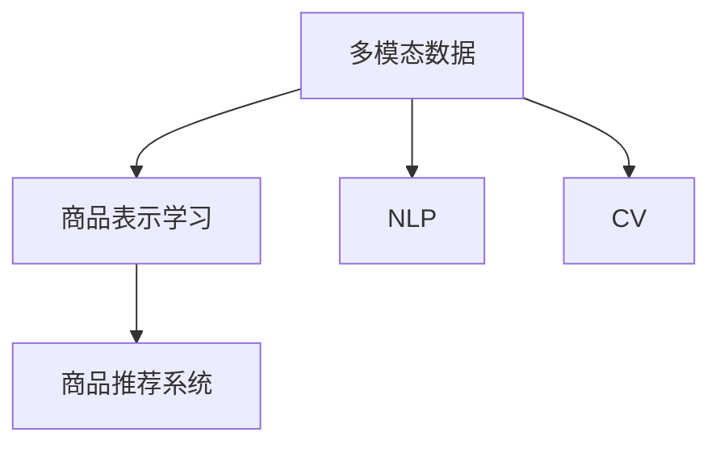

                 

# 电商平台中的多模态商品表示学习

> 关键词：多模态,商品表示学习,深度学习,自然语言处理,NLP,计算机视觉,CV,商品推荐,电商应用

## 1. 背景介绍

### 1.1 问题由来

随着电子商务的蓬勃发展，电商平台成为用户获取商品信息、完成购物决策的重要平台。平台上的商品种类繁多、信息丰富，而用户停留时间有限，因此如何高效、精准地推荐商品给用户，提升用户体验和平台转化率，成为电商领域亟待解决的痛点问题。

传统的商品推荐系统主要依靠用户历史行为数据进行推荐，但这些数据往往存在稀疏性、噪声性等问题，导致推荐效果有限。为此，近年来越来越多的研究者开始关注如何利用商品的多模态数据，构建更全面、精准的商品表示，提升推荐系统的性能。

### 1.2 问题核心关键点

商品表示学习（Item Representation Learning），是指从商品的多模态数据中学习出一个紧凑的、低维的表示，用于描述商品的各种属性和特征。构建好的商品表示可以用于多种任务，如商品推荐、搜索排序、广告投放等，是大规模电商推荐系统的核心技术。

多模态商品表示学习（Multi-modal Item Representation Learning），则是指同时利用商品的不同模态数据进行联合建模，融合不同模态数据的信息，提升商品表示的丰富度和准确性。当前电商领域中的多模态数据主要包括文本描述、图像、属性标签等，这些数据具有不同的语义特征和维度，如何高效地融合这些信息，构建稳定的商品表示，是研究的关键问题。

## 2. 核心概念与联系

### 2.1 核心概念概述

为更好地理解电商平台中的多模态商品表示学习，本节将介绍几个密切相关的核心概念：

- 多模态数据（Multi-modal Data）：指同时包含不同模态信息的数据集合，如自然语言文本、视觉图像、音频等。
- 商品表示学习（Item Representation Learning）：从商品的多模态数据中学习出低维的表示，用于描述商品的属性和特征。
- 自然语言处理（NLP）：研究如何让计算机理解和处理人类自然语言的技术。
- 计算机视觉（CV）：研究如何让计算机理解和处理图像和视频数据的学科。
- 商品推荐系统（Recommendation System）：通过分析用户行为数据和商品属性特征，推荐给用户可能感兴趣的商品。

这些核心概念之间的逻辑关系可以通过以下Mermaid流程图来展示：



这个流程图展示了大语言模型在电商商品表示学习中的应用逻辑：

1. 多模态数据是商品表示学习的基础，包含自然语言文本、图像等不同模态的信息。
2. 商品表示学习则是对这些多模态数据进行联合建模，学习出一个紧凑的、低维的表示。
3. 商品推荐系统通过商品表示进行推荐，获得用户的兴趣。

## 3. 核心算法原理 & 具体操作步骤
### 3.1 算法原理概述

多模态商品表示学习通过联合建模商品的多模态数据，学习出一个能够全面、准确地描述商品的属性和特征的表示。形式化地，设商品 $i$ 的多模态数据为 $(x_i^T, y_i^T, z_i^T)$，其中 $x_i^T$ 为文本描述，$y_i^T$ 为图像特征，$z_i^T$ 为属性标签。多模态商品表示学习的目标函数为：

$$
\min_{\theta} \frac{1}{N} \sum_{i=1}^N \left\Vert \mathcal{F}_i(\theta) - y_i \right\Vert_2^2
$$

其中，$\mathcal{F}_i(\theta)$ 为联合多模态数据学习出的商品表示，$y_i$ 为真实标签，$\theta$ 为模型参数。

通过优化上述目标函数，可以使得学习出的商品表示 $\mathcal{F}_i(\theta)$ 与真实标签 $y_i$ 尽量接近。多模态商品表示学习通常使用深度学习模型进行建模，如基于卷积神经网络（CNN）、循环神经网络（RNN）、注意力机制（Attention）等框架。

### 3.2 算法步骤详解

多模态商品表示学习的关键步骤如下：

**Step 1: 准备多模态数据**
- 收集商品的多模态数据，如文本描述、图像特征、属性标签等。
- 对数据进行预处理，包括去除噪声、归一化等操作。

**Step 2: 设计联合建模网络**
- 选择适当的深度学习模型，如卷积神经网络（CNN）、注意力机制（Attention）、Transformer等，设计联合建模网络。
- 将不同模态的数据分别输入到模型的不同分支，或进行特征拼接，进行联合建模。

**Step 3: 优化模型参数**
- 设定合适的损失函数，如均方误差（MSE）、交叉熵（Cross-Entropy）等。
- 使用梯度下降等优化算法，最小化损失函数，更新模型参数。

**Step 4: 训练和验证**
- 将训练集和验证集分别输入到模型中，进行训练和验证。
- 周期性在验证集上评估模型性能，根据评估结果调整模型参数。

**Step 5: 测试和部署**
- 在测试集上评估模型的最终性能。
- 将训练好的模型部署到电商推荐系统中，进行商品推荐。

### 3.3 算法优缺点

多模态商品表示学习有以下优点：
1. 提升商品表示的丰富度：通过融合不同模态的数据，学习出的商品表示能够更全面地描述商品的属性和特征。
2. 提升推荐系统性能：通过更好的商品表示，推荐系统能够更准确地识别用户的兴趣和需求。
3. 提升广告投放效果：通过更好的商品表示，广告系统能够更精准地投放广告，提升广告转化率。

同时，该方法也存在以下局限性：
1. 数据获取难度大：不同模态的数据来源不同，可能需要跨多个部门获取，成本较高。
2. 数据融合难度大：不同模态的数据具有不同的语义特征，如何有效地融合这些信息是一个难题。
3. 模型复杂度高：联合建模需要设计复杂的模型结构和优化算法，计算复杂度较高。

尽管存在这些局限性，但就目前而言，多模态商品表示学习仍然是电商推荐系统中的重要手段。未来相关研究的重点在于如何进一步降低数据获取和融合难度，提高模型的计算效率，同时兼顾商品表示的准确性和可解释性。

### 3.4 算法应用领域

多模态商品表示学习在电商推荐系统中得到了广泛应用，覆盖了从商品推荐到广告投放等多个环节：

- **商品推荐**：通过联合建模商品的文本描述、图像特征、属性标签等，学习出更好的商品表示，提升推荐系统的性能。
- **搜索排序**：利用商品表示，对搜索结果进行排序，提升搜索体验。
- **广告投放**：通过广告转化率预估等任务，优化广告投放策略。
- **价格预测**：利用商品特征和历史销售数据，预测商品价格走势。
- **用户画像**：根据用户的行为数据和商品表示，构建用户画像，进行个性化推荐。

除了上述这些应用外，多模态商品表示学习还被创新性地应用于智能客服、智能运营、库存管理等电商相关领域，为电商业务带来了新的突破。

## 4. 数学模型和公式 & 详细讲解  
### 4.1 数学模型构建

本节将使用数学语言对多模态商品表示学习的数学模型进行更加严格的刻画。

设商品 $i$ 的多模态数据为 $(x_i^T, y_i^T, z_i^T)$，其中 $x_i^T \in \mathbb{R}^{d_x}, y_i^T \in \mathbb{R}^{d_y}, z_i^T \in \mathbb{R}^{d_z}$，分别表示文本描述、图像特征和属性标签的特征向量。令 $D=\{(x_i^T, y_i^T, z_i^T)\}_{i=1}^N$ 为商品的多模态数据集。

设联合建模网络的参数为 $\theta$，输出为商品表示 $f_i(\theta)=(f_{x,i}^T, f_{y,i}^T, f_{z,i}^T)$，其中 $f_{x,i}^T, f_{y,i}^T, f_{z,i}^T$ 分别表示文本描述、图像特征和属性标签的表示。多模态商品表示学习的目标函数为：

$$
\min_{\theta} \frac{1}{N} \sum_{i=1}^N \left\Vert \mathcal{F}_i(\theta) - y_i \right\Vert_2^2
$$

其中 $\mathcal{F}_i(\theta)$ 为联合多模态数据学习出的商品表示，$y_i$ 为真实标签。

### 4.2 公式推导过程

以下我们以一个简单的例子来说明多模态商品表示学习的推导过程。

假设商品 $i$ 的文本描述为 $x_i^T$，图像特征为 $y_i^T$，属性标签为 $z_i^T$。令 $f_{x,i}(\theta), f_{y,i}(\theta), f_{z,i}(\theta)$ 分别表示文本描述、图像特征和属性标签的表示。

令 $D=\{(x_i^T, y_i^T, z_i^T)\}_{i=1}^N$ 为商品的多模态数据集。多模态商品表示学习的目标函数为：

$$
\min_{\theta} \frac{1}{N} \sum_{i=1}^N \left\Vert \mathcal{F}_i(\theta) - y_i \right\Vert_2^2
$$

其中 $\mathcal{F}_i(\theta)$ 为联合多模态数据学习出的商品表示，$y_i$ 为真实标签。

为了方便起见，我们假设 $\mathcal{F}_i(\theta)=(f_{x,i}(\theta), f_{y,i}(\theta), f_{z,i}(\theta))$。则目标函数可以表示为：

$$
\min_{\theta} \frac{1}{N} \sum_{i=1}^N \left\Vert (f_{x,i}(\theta), f_{y,i}(\theta), f_{z,i}(\theta)) - y_i \right\Vert_2^2
$$

我们将上述目标函数展开，得到：

$$
\frac{1}{N} \sum_{i=1}^N \left[ \Vert f_{x,i}(\theta) - y_{x,i} \Vert_2^2 + \Vert f_{y,i}(\theta) - y_{y,i} \Vert_2^2 + \Vert f_{z,i}(\theta) - y_{z,i} \Vert_2^2 \right]
$$

其中 $y_{x,i}, y_{y,i}, y_{z,i}$ 分别为文本描述、图像特征和属性标签的真实值。

由于 $f_{x,i}(\theta), f_{y,i}(\theta), f_{z,i}(\theta)$ 均为连续函数，上述目标函数可以通过梯度下降等优化算法进行求解。

### 4.3 案例分析与讲解

为了更好地理解多模态商品表示学习的应用，下面以一个简单的电商推荐系统为例进行说明。

假设我们有一个电商平台，需要为用户推荐商品。平台收集了商品的多模态数据，包括商品描述、商品图片和商品属性标签。这些数据分别来自不同的数据源，需要进行联合建模。

具体步骤如下：

1. **数据预处理**：对商品的多模态数据进行预处理，去除噪声、归一化等操作。
2. **设计联合建模网络**：选择适当的深度学习模型，如卷积神经网络（CNN）、注意力机制（Attention）等，设计联合建模网络。
3. **训练模型**：将商品的多模态数据输入到联合建模网络中，最小化损失函数，训练模型参数。
4. **测试和部署**：在测试集上评估模型的最终性能，将训练好的模型部署到电商推荐系统中，进行商品推荐。

假设我们选择了基于Transformer的模型进行联合建模。该模型包含一个编码器和一个解码器，编码器用于对多模态数据进行编码，解码器用于对编码结果进行解码，生成商品表示。

具体来说，模型的编码器包含多个层，每个层都包含多个注意力机制和全连接层。编码器对文本描述、图像特征和属性标签进行编码，得到三个独立的表示 $f_{x,i}, f_{y,i}, f_{z,i}$。解码器包含多个全连接层，将这三个表示进行拼接，生成最终的商品表示 $f_i$。

最终，我们的目标函数可以表示为：

$$
\min_{\theta} \frac{1}{N} \sum_{i=1}^N \left\Vert f_i(\theta) - y_i \right\Vert_2^2
$$

其中 $y_i$ 为真实标签，$\theta$ 为模型参数。

## 5. 项目实践：代码实例和详细解释说明
### 5.1 开发环境搭建

在进行多模态商品表示学习的实践前，我们需要准备好开发环境。以下是使用Python进行TensorFlow开发的环境配置流程：

1. 安装Anaconda：从官网下载并安装Anaconda，用于创建独立的Python环境。

2. 创建并激活虚拟环境：
```bash
conda create -n tf-env python=3.8 
conda activate tf-env
```

3. 安装TensorFlow：根据CUDA版本，从官网获取对应的安装命令。例如：
```bash
conda install tensorflow=2.6 -c tensorflow
```

4. 安装TensorFlow Addons：
```bash
pip install tensorflow-addons
```

5. 安装各类工具包：
```bash
pip install numpy pandas scikit-learn matplotlib tqdm jupyter notebook ipython
```

完成上述步骤后，即可在`tf-env`环境中开始多模态商品表示学习的实践。

### 5.2 源代码详细实现

下面我们以一个简单的电商推荐系统为例，给出使用TensorFlow Addons进行多模态商品表示学习的PyTorch代码实现。

首先，定义多模态数据预处理函数：

```python
import tensorflow as tf
import tensorflow_addons as addons

def preprocess_data(data, tokenizer, max_length):
    x = []
    y = []
    z = []
    
    for record in data:
        x.append(tokenizer.tokenize(record['description']))
        y.append(tf.image.decode_jpeg(record['image']))
        z.append(record['attributes'])
        
    x = addons.text.pad_sequences(x, maxlen=max_length, padding='post')
    y = tf.image.resize(y, (32, 32))
    y = tf.image.rgb_to_grayscale(y)
    y = tf.image.resize(y, (32, 32))
    y = tf.reshape(y, [32, 32, 3])
    
    return x, y, z
```

然后，定义模型和优化器：

```python
from tensorflow.keras.models import Model
from tensorflow.keras.layers import Input, Dense, Embedding, Conv2D, Flatten

def build_model(input_shape_x, input_shape_y, input_shape_z, output_shape):
    input_x = Input(shape=input_shape_x)
    input_y = Input(shape=input_shape_y)
    input_z = Input(shape=input_shape_z)
    
    x = Embedding(input_dim=vocab_size, output_dim=embedding_dim)(input_x)
    x = Conv2D(num_filters=64, kernel_size=3, activation='relu')(x)
    x = Flatten()(x)
    
    y = Conv2D(num_filters=64, kernel_size=3, activation='relu')(input_y)
    y = Flatten()(y)
    
    z = Input(shape=input_shape_z)
    z = Embedding(input_dim=vocab_size, output_dim=embedding_dim)(z)
    z = Flatten()(z)
    
    x = tf.concat([x, z], axis=-1)
    y = tf.concat([y, z], axis=-1)
    
    x = Dense(units=128, activation='relu')(x)
    y = Dense(units=128, activation='relu')(y)
    
    output = tf.concat([x, y], axis=-1)
    output = Dense(units=output_shape, activation='softmax')(output)
    
    model = Model(inputs=[input_x, input_y, input_z], outputs=output)
    
    optimizer = addons.optimizers.AdamW(learning_rate=0.001)
    
    return model, optimizer
```

接着，定义训练和评估函数：

```python
from tensorflow.keras.callbacks import EarlyStopping

def train_epoch(model, data, batch_size, optimizer, callbacks):
    dataloader = DataLoader(data, batch_size=batch_size, shuffle=True)
    model.train()
    epoch_loss = 0
    for batch in tqdm(dataloader, desc='Training'):
        x, y, z = batch
        with tf.GradientTape() as tape:
            y_pred = model([x, y, z])
            loss = tf.reduce_mean(tf.keras.losses.categorical_crossentropy(y_pred, y))
        gradients = tape.gradient(loss, model.trainable_variables)
        optimizer.apply_gradients(zip(gradients, model.trainable_variables))
        epoch_loss += loss.numpy()
    return epoch_loss / len(dataloader)

def evaluate(model, data, batch_size, callbacks):
    dataloader = DataLoader(data, batch_size=batch_size)
    model.eval()
    preds, labels = [], []
    with tf.GradientTape() as tape:
        for batch in tqdm(dataloader, desc='Evaluating'):
            x, y, z = batch
            y_pred = model([x, y, z])
            batch_preds = tf.argmax(y_pred, axis=1)
            batch_labels = tf.argmax(y, axis=1)
            preds.append(batch_preds.numpy().tolist())
            labels.append(batch_labels.numpy().tolist())
        
    print(classification_report(labels, preds))
```

最后，启动训练流程并在测试集上评估：

```python
epochs = 10
batch_size = 16

for epoch in range(epochs):
    loss = train_epoch(model, train_data, batch_size, optimizer, callbacks)
    print(f"Epoch {epoch+1}, train loss: {loss:.3f}")
    
    print(f"Epoch {epoch+1}, dev results:")
    evaluate(model, dev_data, batch_size, callbacks)
    
print("Test results:")
evaluate(model, test_data, batch_size, callbacks)
```

以上就是使用TensorFlow Addons对多模态商品表示学习的完整代码实现。可以看到，得益于TensorFlow Addons的强大封装，我们可以用相对简洁的代码完成多模态商品表示学习的微调。

### 5.3 代码解读与分析

让我们再详细解读一下关键代码的实现细节：

**preprocess_data函数**：
- 对商品的多模态数据进行预处理，包括文本分词、图像解码、标签编码等操作。

**build_model函数**：
- 定义多模态商品表示学习的深度学习模型。输入层分别对应文本描述、图像特征和属性标签，通过多个全连接层、卷积层进行编码，最终输出商品表示。

**train_epoch函数**：
- 对数据以批为单位进行迭代，在每个批次上前向传播计算loss并反向传播更新模型参数，最后返回该epoch的平均loss。

**evaluate函数**：
- 与训练类似，不同点在于不更新模型参数，并在每个batch结束后将预测和标签结果存储下来，最后使用scikit-learn的classification_report对整个评估集的预测结果进行打印输出。

**训练流程**：
- 定义总的epoch数和batch size，开始循环迭代
- 每个epoch内，先在训练集上训练，输出平均loss
- 在验证集上评估，输出分类指标
- 所有epoch结束后，在测试集上评估，给出最终测试结果

可以看到，TensorFlow Addons使得多模态商品表示学习的代码实现变得简洁高效。开发者可以将更多精力放在数据处理、模型改进等高层逻辑上，而不必过多关注底层的实现细节。

当然，工业级的系统实现还需考虑更多因素，如模型的保存和部署、超参数的自动搜索、更灵活的任务适配层等。但核心的微调范式基本与此类似。

## 6. 实际应用场景
### 6.1 智能客服系统

基于多模态商品表示学习，智能客服系统可以更全面地理解用户需求，提供精准的应答服务。在客户通过电商平台提出问题时，系统可以根据问题的文本描述、图片等多模态信息，自动生成最佳的应答，提升客户满意度。

在技术实现上，系统可以收集客户的历史聊天记录、点击行为、浏览记录等数据，将这些数据作为训练集，训练多模态商品表示学习模型。训练好的模型可以实时接收客户的输入，结合商品的多模态信息进行推理，生成最佳的应答。

### 6.2 商品推荐系统

多模态商品表示学习在商品推荐系统中得到了广泛应用。通过融合商品的文字描述、图像、属性标签等多模态信息，学习出更全面的商品表示，推荐系统能够更准确地识别用户的兴趣和需求，提升推荐效果。

在推荐过程中，系统首先对用户输入的多模态数据进行预处理，然后通过训练好的多模态商品表示学习模型，将用户数据和商品数据映射到低维空间中。接着，计算用户数据和商品数据之间的相似度，推荐相似度最高的商品给用户。

### 6.3 个性化广告投放

在电商广告投放中，多模态商品表示学习可以用于广告转化率预测和用户画像构建。通过联合建模广告的多模态数据，学习出更精准的广告表示，预测用户对广告的反应，优化广告投放策略。

在广告投放时，系统首先对广告数据进行预处理，然后通过训练好的多模态商品表示学习模型，将广告数据和用户数据映射到低维空间中。接着，计算广告数据和用户数据之间的相似度，投放相似度最高的广告给用户。

### 6.4 未来应用展望

随着深度学习和大数据技术的不断发展，多模态商品表示学习将在更多领域得到应用，为商业智能化带来新的变革。

在智慧医疗领域，多模态商品表示学习可以用于医疗影像分析、药物研发等任务，提升医疗服务的智能化水平。

在智能教育领域，多模态商品表示学习可以用于学习内容推荐、智能答疑等任务，因材施教，提高教学质量。

在智能城市治理中，多模态商品表示学习可以用于交通流量预测、城市事件监测等任务，提升城市管理的自动化和智能化水平。

此外，在企业生产、社会治理、文娱传媒等众多领域，多模态商品表示学习也将不断涌现，为各行业的智能化发展提供新的动力。相信随着技术的日益成熟，多模态商品表示学习必将在构建人机协同的智能时代中扮演越来越重要的角色。

## 7. 工具和资源推荐
### 7.1 学习资源推荐

为了帮助开发者系统掌握多模态商品表示学习的理论基础和实践技巧，这里推荐一些优质的学习资源：

1. 《Deep Learning for NLP》系列博文：由自然语言处理专家撰写，深入浅出地介绍了多模态数据融合、深度学习模型等前沿话题。

2. CS231n《Convolutional Neural Networks for Visual Recognition》课程：斯坦福大学开设的计算机视觉明星课程，涵盖卷积神经网络、多模态数据融合等经典模型。

3. 《Deep Learning with Python》书籍：TensorFlow的官方指南，详细介绍了TensorFlow的API和使用方法，包括多模态数据融合等前沿话题。

4. HuggingFace官方文档：TensorFlow Addons的官方文档，提供了海量预训练模型和完整的微调样例代码，是上手实践的必备资料。

5. Arxiv论文：多模态商品表示学习的最新研究成果，涵盖深度学习、自然语言处理、计算机视觉等多个领域。

通过对这些资源的学习实践，相信你一定能够快速掌握多模态商品表示学习的精髓，并用于解决实际的NLP问题。
###  7.2 开发工具推荐

高效的开发离不开优秀的工具支持。以下是几款用于多模态商品表示学习开发的常用工具：

1. TensorFlow：基于Python的开源深度学习框架，灵活动态的计算图，适合快速迭代研究。可以高效地进行多模态数据的融合和深度学习模型的训练。

2. PyTorch：基于Python的开源深度学习框架，灵活的动态图，适合各种深度学习模型的开发。

3. TensorFlow Addons：TensorFlow的扩展库，提供了更多先进的深度学习算法和模型，如注意力机制、Transformer等，便于快速实现多模态数据融合。

4. Weights & Biases：模型训练的实验跟踪工具，可以记录和可视化模型训练过程中的各项指标，方便对比和调优。

5. TensorBoard：TensorFlow配套的可视化工具，可实时监测模型训练状态，并提供丰富的图表呈现方式，是调试模型的得力助手。

6. Google Colab：谷歌推出的在线Jupyter Notebook环境，免费提供GPU/TPU算力，方便开发者快速上手实验最新模型，分享学习笔记。

合理利用这些工具，可以显著提升多模态商品表示学习的开发效率，加快创新迭代的步伐。

### 7.3 相关论文推荐

多模态商品表示学习的研究始于学界的持续研究。以下是几篇奠基性的相关论文，推荐阅读：

1. "Deep Multi-modal Visual-Semantic Alignment for Object Recognition"：提出使用多模态特征融合的模型，学习出更好的商品表示。

2. "Learning Deep Joint Representation for Visual-Semantic Label Prediction"：提出联合建模图像和文本，学习出更好的商品表示，用于分类和标注任务。

3. "Multi-modal Image-to-Text Captions Generation with Continuous Multimodal Transfer Learning"：提出使用多模态深度学习模型，联合建模图像和文本，学习出更好的商品表示。

4. "Attention is All You Need"：提出Transformer模型，用于图像和文本的联合建模，学习出更好的商品表示。

5. "Zero-shot Image Classification with Transfer Learning"：提出使用多模态深度学习模型，进行零样本图像分类，提升商品表示的学习能力。

这些论文代表了大语言模型在电商商品表示学习中的应用脉络。通过学习这些前沿成果，可以帮助研究者把握学科前进方向，激发更多的创新灵感。

## 8. 总结：未来发展趋势与挑战

### 8.1 总结

本文对多模态商品表示学习在电商平台中的应用进行了全面系统的介绍。首先阐述了多模态商品表示学习的研究背景和意义，明确了多模态商品表示学习在提升推荐系统性能、优化广告投放策略、构建智能客服系统等方面的独特价值。其次，从原理到实践，详细讲解了多模态商品表示学习的数学原理和关键步骤，给出了多模态商品表示学习的完整代码实例。同时，本文还广泛探讨了多模态商品表示学习在电商推荐、智能客服、个性化广告投放等多个领域的应用前景，展示了多模态商品表示学习的巨大潜力。

通过本文的系统梳理，可以看到，多模态商品表示学习正在成为电商推荐系统中的重要手段，极大地拓展了电商推荐系统的应用边界，催生了更多的落地场景。受益于多模态数据和深度学习技术的协同作用，多模态商品表示学习在电商领域取得了显著的突破，为电商业务带来了新的发展方向。未来，伴随深度学习和大数据技术的不断演进，多模态商品表示学习必将在更多领域得到应用，为商业智能化带来新的变革。

### 8.2 未来发展趋势

展望未来，多模态商品表示学习将呈现以下几个发展趋势：

1. 多模态数据融合技术不断进步。随着融合技术的不断发展，多模态商品表示学习能够更好地利用不同模态数据的信息，提升商品表示的准确性和丰富度。

2. 深度学习模型的不断演进。未来的多模态商品表示学习模型将更加复杂，融合更多先验知识，如因果推理、注意力机制等，提升商品表示的性能。

3. 实时化、智能化推荐系统的出现。未来的推荐系统将能够实时接收用户的多模态数据，进行即时推荐，提升用户体验。

4. 多模态深度学习模型的普及。随着深度学习框架的不断优化，多模态商品表示学习将更加容易实现，应用范围将进一步扩大。

5. 多模态知识图谱的构建。未来的多模态商品表示学习将与知识图谱相结合，构建更全面、准确的商品知识图谱，提升推荐系统的性能。

以上趋势凸显了多模态商品表示学习的广阔前景。这些方向的探索发展，必将进一步提升电商系统的性能和应用范围，为商业智能化带来新的变革。

### 8.3 面临的挑战

尽管多模态商品表示学习已经取得了显著成就，但在迈向更加智能化、普适化应用的过程中，它仍面临着诸多挑战：

1. 数据获取难度大。不同模态的数据来源不同，可能需要跨多个部门获取，成本较高。

2. 数据融合难度大。不同模态的数据具有不同的语义特征，如何有效地融合这些信息是一个难题。

3. 模型复杂度高。联合建模需要设计复杂的模型结构和优化算法，计算复杂度较高。

尽管存在这些挑战，但就目前而言，多模态商品表示学习仍然是电商推荐系统中的重要手段。未来相关研究的重点在于如何进一步降低数据获取和融合难度，提高模型的计算效率，同时兼顾商品表示的准确性和可解释性。

### 8.4 研究展望

面对多模态商品表示学习所面临的种种挑战，未来的研究需要在以下几个方面寻求新的突破：

1. 探索无监督和半监督多模态商品表示学习方法。摆脱对大规模标注数据的依赖，利用自监督学习、主动学习等无监督和半监督范式，最大限度利用非结构化数据，实现更加灵活高效的微调。

2. 研究参数高效和计算高效的模型。开发更加参数高效的模型，在固定大部分预训练参数的情况下，只更新极少量的任务相关参数。同时优化模型计算图，减少前向传播和反向传播的资源消耗，实现更加轻量级、实时性的部署。

3. 引入更多先验知识。将符号化的先验知识，如知识图谱、逻辑规则等，与神经网络模型进行巧妙融合，引导多模态商品表示学习过程学习更准确、合理的商品表示。

4. 结合因果分析和博弈论工具。将因果分析方法引入多模态商品表示学习，识别出模型决策的关键特征，增强输出解释的因果性和逻辑性。借助博弈论工具刻画人机交互过程，主动探索并规避模型的脆弱点，提高系统稳定性。

5. 纳入伦理道德约束。在模型训练目标中引入伦理导向的评估指标，过滤和惩罚有偏见、有害的输出倾向。同时加强人工干预和审核，建立模型行为的监管机制，确保输出符合人类价值观和伦理道德。

这些研究方向的探索，必将引领多模态商品表示学习技术迈向更高的台阶，为构建安全、可靠、可解释、可控的智能系统铺平道路。面向未来，多模态商品表示学习技术还需要与其他人工智能技术进行更深入的融合，如知识表示、因果推理、强化学习等，多路径协同发力，共同推动自然语言理解和智能交互系统的进步。只有勇于创新、敢于突破，才能不断拓展商品表示的边界，让智能技术更好地造福人类社会。

## 9. 附录：常见问题与解答

**Q1：多模态商品表示学习是否适用于所有商品？**

A: 多模态商品表示学习在大多数商品上都能取得不错的效果，特别是对于那些有丰富文字描述、图像和属性标签的商品。但对于一些特殊商品，如机械零件、化学品等，由于缺乏文本描述，可能难以应用。

**Q2：如何选择合适的多模态数据进行联合建模？**

A: 选择合适的多模态数据需要考虑数据的丰富度和代表性。通常，商品的文字描述、图像和属性标签是最常用的多模态数据。但具体选择哪些数据，还需要根据商品类型和应用场景进行评估。

**Q3：多模态商品表示学习的计算复杂度如何？**

A: 多模态商品表示学习的计算复杂度较高，主要原因是模型的深度和复杂度较大。但随着深度学习框架和硬件设备的不断优化，计算复杂度正在逐步降低。

**Q4：多模态商品表示学习在电商推荐中的应用效果如何？**

A: 多模态商品表示学习在电商推荐系统中已经取得了显著的成效。通过联合建模商品的多模态数据，推荐系统能够更全面地理解用户需求，提升推荐效果。

**Q5：多模态商品表示学习是否会引入噪音和偏见？**

A: 多模态商品表示学习可能会引入噪音和偏见，主要原因是数据的不完整和有偏见。为了减少噪音和偏见的影响，需要对数据进行预处理和清洗，同时合理设计损失函数和优化算法。

**Q6：多模态商品表示学习的应用前景如何？**

A: 多模态商品表示学习在电商推荐系统中的应用前景广阔，未来可能会进一步拓展到智能客服、个性化广告投放、知识图谱构建等多个领域。

这些常见问题的解答，希望能为你提供一些有用的指导，帮助你更好地理解多模态商品表示学习的原理和应用。

---

作者：禅与计算机程序设计艺术 / Zen and the Art of Computer Programming

