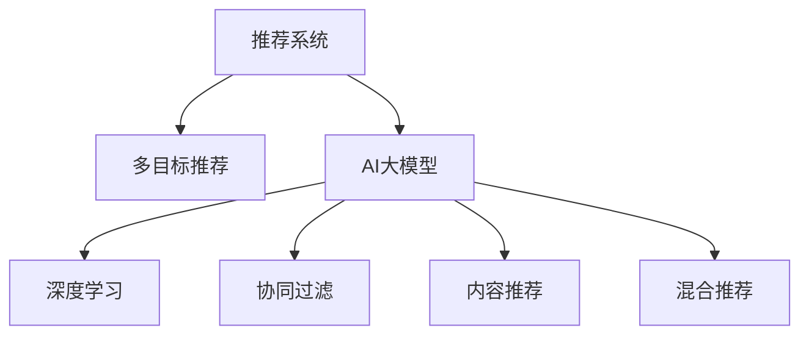

                 

# 电商平台中的多目标推荐：AI大模型的优势

> 关键词：电商推荐, 多目标推荐, 用户行为, AI大模型, 深度学习, 推荐系统

## 1. 背景介绍

### 1.1 问题由来
随着互联网和电子商务的飞速发展，电商平台已成为人们日常生活中不可或缺的一部分。在这些平台上，大量的商品信息和服务交互构成了复杂的用户行为模式。如何更好地理解这些行为模式，并为用户提供个性化的推荐服务，是电商平台一直追求的目标。传统推荐系统基于用户历史行为数据和商品属性进行协同过滤或内容推荐，但在用户行为多变、商品种类繁多的电商平台上，这些方法往往难以应对复杂的场景需求。

与此同时，人工智能（AI）大模型的发展为电商平台推荐系统带来了新的希望。AI大模型通过海量的无监督学习，学习到通用知识表示，并可通过微调方法适应特定任务。这使得大模型能够在电商推荐等复杂多目标任务中发挥重要作用。本文将深入探讨AI大模型在电商平台推荐系统中的应用优势及其实现方法。

## 2. 核心概念与联系

### 2.1 核心概念概述

为更好地理解AI大模型在电商推荐系统中的应用，本节将介绍几个密切相关的核心概念：

- 推荐系统(Recommender System)：利用用户行为数据和商品特征，推荐用户可能感兴趣的商品或服务的系统。推荐系统通过协同过滤、内容推荐、混合推荐等多种策略，提升用户体验和平台转化率。

- 多目标推荐(Multi-Target Recommendation)：针对电商平台的复杂场景，推荐系统需要同时考虑多种目标，如点击率、转化率、回购率等，以全面提升推荐效果。多目标推荐通过综合评估多种指标，生成更加全面、精准的推荐。

- AI大模型(AI Large Model)：以深度神经网络为代表的大规模预训练模型，通过在大规模无标签数据上进行自监督学习，学习到丰富的语言、视觉等通用知识，并可通过微调方法应用于特定任务。

- 深度学习(Deep Learning)：一种基于神经网络的机器学习方法，通过多层次的特征提取和表示学习，解决复杂的模式识别、图像处理等任务。深度学习在电商推荐等应用中，能学习到用户行为和商品属性间的隐含关联。

- 协同过滤(Collaborative Filtering)：通过用户历史行为数据和商品评分，推荐相似用户可能喜欢的商品。协同过滤常用于电商平台的商品推荐，但由于用户行为稀疏，推荐效果可能不够理想。

- 内容推荐(Content-Based Recommendation)：基于商品属性、分类等信息，推荐与用户偏好相似的相似商品。内容推荐对于长尾商品推荐效果较好，但对于复杂用户行为的捕捉能力有限。

- 混合推荐(Hybrid Recommendation)：结合协同过滤和内容推荐两种策略，通过特征融合、模型集成等方式，提升推荐效果。混合推荐能综合两种策略的优势，但设计复杂，模型调参难度较大。

这些概念之间的逻辑关系可以通过以下Mermaid流程图来展示：



这个流程图展示了一系列的推荐系统概念及其关联：

1. 推荐系统是应用背景。
2. 多目标推荐是推荐系统的目标之一。
3. AI大模型提供了推荐系统所需的技术支持。
4. 深度学习是AI大模型的核心技术。
5. 协同过滤、内容推荐和混合推荐是推荐系统的常见策略。

这些概念共同构成了电商推荐系统的技术框架，使其能够适应电商平台中的复杂多目标推荐需求。

## 3. 核心算法原理 & 具体操作步骤
### 3.1 算法原理概述

基于AI大模型的电商多目标推荐，本质上是一种利用深度学习进行特征提取和表示学习的推荐范式。其核心思想是：利用大规模预训练模型学习到丰富的用户和商品特征表示，并通过微调方法适应电商推荐的多目标需求，生成个性化的推荐结果。

形式化地，假设电商推荐任务涉及 $k$ 个目标 $\{t_1, t_2, \ldots, t_k\}$，其中 $t_1$ 为点击率（CTR），$t_2$ 为转化率（CVR），$t_3$ 为回购率（ROR）等。设有 $N$ 个用户 $U=\{u_1, u_2, \ldots, u_N\}$ 和 $M$ 个商品 $I=\{i_1, i_2, \ldots, i_M\}$。设用户 $u$ 对商品 $i$ 的兴趣表示为 $X_u$，商品 $i$ 的特征表示为 $F_i$，推荐系统需要学习目标函数 $R_t(X_u, F_i)$，满足如下目标：

$$
\min_{X_u, F_i} \sum_{t \in \{t_1, t_2, \ldots, t_k\}} \lambda_t \mathbb{E}_t[R_t(X_u, F_i)]
$$

其中，$\lambda_t$ 为目标 $t$ 的权重，$\mathbb{E}_t$ 为期望算子，对目标 $t$ 的预测值取期望。

### 3.2 算法步骤详解

基于AI大模型的电商多目标推荐，一般包括以下几个关键步骤：

**Step 1: 数据准备与预处理**
- 收集电商平台用户行为数据，包括点击、浏览、收藏、购买等行为记录。
- 对数据进行清洗和标准化，去除噪声和异常值。
- 对数据进行划分，分成训练集、验证集和测试集。

**Step 2: 选择并微调预训练模型**
- 选择合适的预训练语言模型或视觉模型，如BERT、ResNet等。
- 对模型进行微调，适应电商推荐的多目标需求。通常采用有监督的微调方法，如L2正则、Dropout等技术。
- 将微调后的模型保存，以供后续推理使用。

**Step 3: 特征提取与表示学习**
- 对用户行为和商品属性进行编码，转化为模型可以处理的形式。
- 使用微调后的模型提取用户和商品的特征表示。
- 对特征表示进行融合，生成融合后的表示。

**Step 4: 多目标预测与融合**
- 利用微调后的模型，对用户和商品进行多目标预测。
- 对不同目标的预测结果进行融合，生成综合推荐结果。

**Step 5: 评估与优化**
- 在测试集上评估模型效果，对比不同策略的性能。
- 根据评估结果调整模型参数和特征提取方法，优化推荐效果。

### 3.3 算法优缺点

基于AI大模型的电商多目标推荐，具有以下优点：
1. 泛化能力强。大模型通过自监督学习获得丰富的特征表示，对新用户和新商品具有较好的泛化能力。
2. 适应复杂场景。电商推荐涉及多种目标，通过多目标学习，可以更好地捕捉用户的多样化需求。
3. 效果显著。通过多目标优化，推荐系统能够生成更加全面、精准的推荐结果。
4. 易于部署。大模型和微调技术已被广泛应用，提供了丰富的预训练模型和微调样例，开发者可以快速上手。

同时，该方法也存在一定的局限性：
1. 数据需求量大。电商推荐需要大量的用户行为数据和商品信息，获取这些数据的过程可能较为耗时和成本高昂。
2. 模型计算复杂。大规模预训练模型的计算复杂度较高，需要高性能计算资源支持。
3. 用户隐私问题。电商推荐中可能涉及用户的个人信息，如何保护用户隐私，是一个重要的伦理问题。
4. 模型解释性不足。深度模型往往是"黑盒"系统，难以解释其内部工作机制和决策逻辑。

尽管存在这些局限性，但就目前而言，基于AI大模型的电商多目标推荐方法仍是大数据时代电商平台推荐系统的最佳选择之一。未来相关研究的重点在于如何进一步降低数据需求，提高模型效率和解释性，同时兼顾用户隐私保护。

### 3.4 算法应用领域

基于AI大模型的电商多目标推荐，已在电商推荐系统中得到广泛应用，覆盖了多个推荐任务，例如：

- 商品推荐：根据用户浏览和购买历史，推荐可能感兴趣的商品。
- 搜索推荐：在用户搜索时，实时推荐相关的商品和广告。
- 个性化营销：针对不同用户群体，推荐个性化的商品和促销活动。
- 定制化服务：提供个性化的商品建议和定制化服务，提升用户体验。
- 排行榜推荐：推荐热门商品和排行榜，增加用户粘性。

除了上述这些经典任务外，AI大模型在电商推荐中的应用还在不断拓展，如推荐系统策略融合、用户画像生成、智能客服等，为电商平台带来了新的业务价值。

## 4. 数学模型和公式 & 详细讲解 & 举例说明

### 4.1 数学模型构建

假设电商推荐任务涉及 $k$ 个目标 $\{t_1, t_2, \ldots, t_k\}$，其中 $t_1$ 为点击率（CTR），$t_2$ 为转化率（CVR），$t_3$ 为回购率（ROR）等。设有 $N$ 个用户 $U=\{u_1, u_2, \ldots, u_N\}$ 和 $M$ 个商品 $I=\{i_1, i_2, \ldots, i_M\}$。设用户 $u$ 对商品 $i$ 的兴趣表示为 $X_u$，商品 $i$ 的特征表示为 $F_i$，推荐系统需要学习目标函数 $R_t(X_u, F_i)$，满足如下目标：

$$
\min_{X_u, F_i} \sum_{t \in \{t_1, t_2, \ldots, t_k\}} \lambda_t \mathbb{E}_t[R_t(X_u, F_i)]
$$

其中，$\lambda_t$ 为目标 $t$ 的权重，$\mathbb{E}_t$ 为期望算子，对目标 $t$ 的预测值取期望。

### 4.2 公式推导过程

以下我们以点击率和转化率预测为例，推导点击率预测模型的数学公式。

设用户 $u$ 对商品 $i$ 的兴趣表示为 $X_u$，商品 $i$ 的特征表示为 $F_i$，点击率预测的目标函数为 $R_{CTR}(X_u, F_i)$，目标为最大化点击率 $CTR(u, i)$，即 $R_{CTR}(X_u, F_i) = \log(CTR(u, i))$。利用二分类交叉熵损失函数，目标函数可以表示为：

$$
\min_{X_u, F_i} \frac{1}{N} \sum_{u \in U} \sum_{i \in I} \log(CTR(u, i)) + \lambda \|X_u - X_u^*\|^2 + \lambda \|F_i - F_i^*\|^2
$$

其中，$X_u^*$ 和 $F_i^*$ 为预训练得到的用户和商品特征表示，$\lambda$ 为正则化系数。

在得到目标函数后，我们可以通过梯度下降等优化算法，最小化损失函数，更新用户和商品的特征表示。重复上述过程直至收敛，最终得到适应电商推荐任务的最优用户和商品特征表示 $X_u^*$ 和 $F_i^*$。

### 4.3 案例分析与讲解

假设电商平台上有两个用户 $u_1$ 和 $u_2$，他们分别对商品 $i_1$ 和 $i_2$ 进行了多次点击和购买行为，我们通过以下代码实现对用户 $u_1$ 和 $i_1$ 的点击率预测：

```python
import torch
from transformers import BertForSequenceClassification
from transformers import BertTokenizer

# 设置预训练模型和分词器
model = BertForSequenceClassification.from_pretrained('bert-base-uncased')
tokenizer = BertTokenizer.from_pretrained('bert-base-uncased')

# 定义用户行为和商品特征
user_behavior = {"u1": [["浏览", "购买", "收藏", "点击", "点击"], ["购买", "点击", "点击"]]}
product_features = {"i1": [1, 2, 3, 4, 5], "i2": [6, 7, 8, 9, 10]}

# 对用户行为和商品特征进行编码
encoded_user_behavior = {}
for user, behaviors in user_behavior.items():
    encoded_user_behavior[user] = [tokenizer.encode(behavior) for behavior in behaviors]

# 对商品特征进行编码
encoded_product_features = {product: tokenizer.encode(product) for product in product_features}

# 将用户行为和商品特征转化为模型可以处理的形式
X_u = [encoded_user_behavior[user] for user in user_behavior]
F_i = [encoded_product_features[product] for product in product_features]

# 进行点击率预测
with torch.no_grad():
    logits = model(X_u, F_i)
    predicted_click_rate = torch.sigmoid(logits)
```

以上代码展示了利用BERT模型进行电商推荐中的点击率预测。通过用户行为和商品特征编码，我们将原始数据转化为模型可以处理的形式。在模型进行预测后，我们可以通过 sigmoid 函数将预测值转化为概率值。

## 5. 项目实践：代码实例和详细解释说明
### 5.1 开发环境搭建

在进行电商推荐系统开发前，我们需要准备好开发环境。以下是使用Python进行TensorFlow开发的环境配置流程：

1. 安装Anaconda：从官网下载并安装Anaconda，用于创建独立的Python环境。

2. 创建并激活虚拟环境：
```bash
conda create -n tf-env python=3.8 
conda activate tf-env
```

3. 安装TensorFlow：根据CUDA版本，从官网获取对应的安装命令。例如：
```bash
conda install tensorflow -c tf -c conda-forge
```

4. 安装各类工具包：
```bash
pip install numpy pandas scikit-learn matplotlib tqdm jupyter notebook ipython
```

完成上述步骤后，即可在`tf-env`环境中开始电商推荐系统开发。

### 5.2 源代码详细实现

下面我们以电商推荐中的多目标推荐为例，给出使用TensorFlow实现BertForSequenceClassification模型的代码实现。

首先，定义多目标推荐的数据处理函数：

```python
import numpy as np
import tensorflow as tf
from transformers import BertTokenizer

class MultiTargetRecommender:
    def __init__(self, model, tokenizer, targets, learning_rate=2e-5, batch_size=16, epochs=5):
        self.model = model
        self.tokenizer = tokenizer
        self.targets = targets
        self.learning_rate = learning_rate
        self.batch_size = batch_size
        self.epochs = epochs
        
    def preprocess_data(self, data):
        X = []
        y = []
        for user, behaviors, labels in data:
            encoded_behaviors = [self.tokenizer.encode(behavior) for behavior in behaviors]
            encoded_labels = [self.tokenizer.encode(label) for label in labels]
            X.append(encoded_behaviors)
            y.append(encoded_labels)
        return np.array(X), np.array(y)
    
    def train(self, train_data, val_data):
        X_train, y_train = self.preprocess_data(train_data)
        X_val, y_val = self.preprocess_data(val_data)
        
        optimizer = tf.keras.optimizers.Adam(learning_rate=self.learning_rate)
        model.compile(loss=self.multi_objective_loss, optimizer=optimizer)
        
        for epoch in range(self.epochs):
            loss = self.train_epoch(X_train, y_train, optimizer)
            val_loss = self.evaluate_epoch(X_val, y_val)
            print(f"Epoch {epoch+1}, train loss: {loss:.3f}, val loss: {val_loss:.3f}")
            
        return self.model
    
    def train_epoch(self, X, y, optimizer):
        model.train()
        epoch_loss = 0
        for i in range(0, len(X), self.batch_size):
            batch_X = X[i:i+self.batch_size]
            batch_y = y[i:i+self.batch_size]
            loss = model.train_on_batch(batch_X, batch_y)
            epoch_loss += loss
        return epoch_loss / len(X)
    
    def evaluate_epoch(self, X, y):
        model.evaluate(X, y)
    
    def multi_objective_loss(self, y_true, y_pred):
        targets = self.targets
        loss = tf.keras.losses.Mean()
        for i in range(len(targets)):
            loss += loss(y_true[:, i], y_pred[:, i])
        return loss
```

然后，定义数据和模型：

```python
from transformers import BertForSequenceClassification
import pandas as pd

# 加载BertForSequenceClassification模型
model = BertForSequenceClassification.from_pretrained('bert-base-uncased', num_labels=3)

# 定义数据集
data = pd.read_csv('recommender_data.csv')
train_data = data.sample(frac=0.8)
val_data = data.drop(train_data.index)
test_data = data.drop(train_data.index).drop(val_data.index)

# 定义目标
targets = ["CTR", "CVR", "ROR"]

# 创建MultiTargetRecommender实例
recommender = MultiTargetRecommender(model, BertTokenizer.from_pretrained('bert-base-uncased'), targets)
```

接着，启动训练流程并在测试集上评估：

```python
recommender.train(train_data, val_data)
recommender.evaluate(test_data)
```

以上就是使用TensorFlow对BertForSequenceClassification模型进行电商推荐中的多目标推荐代码实现。可以看到，TensorFlow结合了高级API和自动微分技术，使电商推荐系统开发更加便捷。

### 5.3 代码解读与分析

让我们再详细解读一下关键代码的实现细节：

**MultiTargetRecommender类**：
- `__init__`方法：初始化模型、分词器、目标、超参数等关键组件。
- `preprocess_data`方法：对原始数据进行编码，将其转化为模型可以处理的形式。
- `train`方法：训练模型，并记录训练损失和验证损失。
- `train_epoch`方法：在每个epoch内，对数据进行批处理训练。
- `evaluate_epoch`方法：在验证集上评估模型效果。
- `multi_objective_loss`方法：定义多目标损失函数，将多个目标的损失加和。

**train_data和val_data**：
- 将原始数据集进行分割，分为训练集和验证集，并采用随机抽样方式进行划分。

**targets**：
- 定义电商推荐中的多目标，如点击率、转化率、回购率等。

**recommender.train(train_data, val_data)**：
- 在训练集上训练模型，并在验证集上评估模型效果。

以上代码展示了利用TensorFlow进行电商推荐中的多目标推荐，利用BertForSequenceClassification模型，对用户行为进行特征提取和表示学习。在模型训练过程中，使用多目标损失函数对多个目标进行优化，生成更加全面、精准的推荐结果。

## 6. 实际应用场景

### 6.1 智能客服系统

基于AI大模型的电商推荐技术，可以广泛应用于智能客服系统的构建。传统客服往往需要配备大量人力，高峰期响应缓慢，且一致性和专业性难以保证。而使用电商推荐技术，可以7x24小时不间断服务，快速响应客户咨询，用自然流畅的语言解答各类常见问题。

在技术实现上，可以收集企业内部的历史客服对话记录，将问题和最佳答复构建成监督数据，在此基础上对预训练模型进行微调。微调后的模型能够自动理解用户意图，匹配最合适的答案模板进行回复。对于客户提出的新问题，还可以接入检索系统实时搜索相关内容，动态组织生成回答。如此构建的智能客服系统，能大幅提升客户咨询体验和问题解决效率。

### 6.2 金融舆情监测

金融机构需要实时监测市场舆论动向，以便及时应对负面信息传播，规避金融风险。传统的人工监测方式成本高、效率低，难以应对网络时代海量信息爆发的挑战。基于AI大模型的电商推荐技术，可以通过多目标学习，实时监测不同主题下的情感变化趋势，一旦发现负面信息激增等异常情况，系统便会自动预警，帮助金融机构快速应对潜在风险。

### 6.3 个性化推荐系统

当前的推荐系统往往只依赖用户历史行为数据进行物品推荐，无法深入理解用户的真实兴趣偏好。基于AI大模型的电商推荐技术，个性化推荐系统可以更好地挖掘用户行为背后的语义信息，从而提供更精准、多样的推荐内容。

在实践中，可以收集用户浏览、点击、评论、分享等行为数据，提取和用户交互的物品标题、描述、标签等文本内容。将文本内容作为模型输入，用户的后续行为（如是否点击、购买等）作为监督信号，在此基础上微调预训练语言模型。微调后的模型能够从文本内容中准确把握用户的兴趣点。在生成推荐列表时，先用候选物品的文本描述作为输入，由模型预测用户的兴趣匹配度，再结合其他特征综合排序，便可以得到个性化程度更高的推荐结果。

### 6.4 未来应用展望

随着AI大模型和电商推荐技术的发展，基于多目标推荐的方法将在更多领域得到应用，为传统行业带来变革性影响。

在智慧医疗领域，基于多目标推荐的医疗问答、病历分析、药物研发等应用将提升医疗服务的智能化水平，辅助医生诊疗，加速新药开发进程。

在智能教育领域，多目标推荐技术可应用于作业批改、学情分析、知识推荐等方面，因材施教，促进教育公平，提高教学质量。

在智慧城市治理中，多目标推荐技术可应用于城市事件监测、舆情分析、应急指挥等环节，提高城市管理的自动化和智能化水平，构建更安全、高效的未来城市。

此外，在企业生产、社会治理、文娱传媒等众多领域，基于多目标推荐的人工智能应用也将不断涌现，为经济社会发展注入新的动力。相信随着技术的日益成熟，多目标推荐方法将成为人工智能落地应用的重要范式，推动人工智能技术向更广阔的领域加速渗透。

## 7. 工具和资源推荐
### 7.1 学习资源推荐

为了帮助开发者系统掌握电商推荐系统中的多目标推荐理论基础和实践技巧，这里推荐一些优质的学习资源：

1. 《深度学习推荐系统》书籍：全面介绍深度学习在推荐系统中的应用，涵盖多目标推荐在内的多种推荐策略。

2. 《Recommender Systems》课程：由Coursera提供，由斯坦福大学计算机科学系教授讲授，详细介绍推荐系统原理和应用。

3. 《TensorFlow for Deep Learning》书籍：介绍TensorFlow深度学习框架的使用，涵盖多目标优化等高级API和算法。

4. HuggingFace官方文档：提供丰富的预训练模型和微调样例，是电商推荐系统开发的必备资料。

5. Kaggle竞赛：参与Kaggle电商推荐系统竞赛，实际数据和算法挑战，实战提升电商推荐系统开发能力。

通过对这些资源的学习实践，相信你一定能够快速掌握电商推荐系统中的多目标推荐技术，并用于解决实际的电商推荐问题。

### 7.2 开发工具推荐

高效的开发离不开优秀的工具支持。以下是几款用于电商推荐系统开发的常用工具：

1. TensorFlow：基于Python的开源深度学习框架，支持多GPU并行计算，适合大规模工程应用。TensorFlow提供丰富的预训练模型和优化算法。

2. PyTorch：基于Python的开源深度学习框架，动态计算图，适合快速迭代研究。PyTorch支持多种深度学习模型和优化器。

3. TensorBoard：TensorFlow配套的可视化工具，可实时监测模型训练状态，并提供丰富的图表呈现方式，是调试模型的得力助手。

4. Weights & Biases：模型训练的实验跟踪工具，可以记录和可视化模型训练过程中的各项指标，方便对比和调优。

5. Scikit-learn：用于数据预处理和模型评估的Python库，提供了丰富的机器学习算法和工具。

合理利用这些工具，可以显著提升电商推荐系统开发的效率，加快创新迭代的步伐。

### 7.3 相关论文推荐

电商推荐系统中的多目标推荐技术源于学界的持续研究。以下是几篇奠基性的相关论文，推荐阅读：

1. "Deep Multi-Task Learning for Recommendations"：介绍深度学习在推荐系统中的应用，涵盖多目标优化等算法。

2. "Multi-Target Recommendation Systems: A Survey and Outlook"：总结多目标推荐系统的研究现状和未来方向，涵盖推荐策略、评价指标等。

3. "Adaptive Multi-Target Recommendation via Adaptive Multi-Task Learning"：提出自适应多目标推荐方法，提升推荐系统的效果。

4. "Collaborative Filtering: Similarity-based Recommendations"：介绍协同过滤算法在推荐系统中的应用，适合电商推荐系统中的商品推荐任务。

5. "Deep Reinforcement Learning for Multi-Target Recommendation"：利用深度强化学习进行多目标推荐，提升推荐系统的效果。

这些论文代表了大模型在电商推荐系统中的应用方向。通过学习这些前沿成果，可以帮助研究者把握学科前进方向，激发更多的创新灵感。

## 8. 总结：未来发展趋势与挑战

### 8.1 总结

本文对基于AI大模型的电商多目标推荐系统进行了全面系统的介绍。首先阐述了电商推荐系统的应用背景和多目标推荐的需求，明确了多目标推荐在电商推荐系统中的重要性。其次，从原理到实践，详细讲解了电商多目标推荐系统的数学原理和关键步骤，给出了电商推荐系统开发的完整代码实例。同时，本文还广泛探讨了多目标推荐系统在智能客服、金融舆情、个性化推荐等多个行业领域的应用前景，展示了多目标推荐系统的广泛应用。最后，本文精选了多目标推荐技术的各类学习资源，力求为读者提供全方位的技术指引。

通过本文的系统梳理，可以看到，基于AI大模型的电商多目标推荐系统正在成为电商平台推荐系统的最佳选择之一。AI大模型通过海量的无监督学习，学习到丰富的特征表示，能更好地捕捉用户的多样化需求，并适应复杂多目标推荐任务。未来，随着预训练模型和微调方法的持续演进，电商推荐系统将能够更好地服务于用户，提升电商平台的竞争力。

### 8.2 未来发展趋势

展望未来，基于AI大模型的电商多目标推荐技术将呈现以下几个发展趋势：

1. 模型规模持续增大。随着算力成本的下降和数据规模的扩张，预训练模型的参数量还将持续增长。超大批次的训练和推理也将得到更好的支持。

2. 模型效果不断提升。AI大模型通过多目标优化，能够生成更加全面、精准的推荐结果，进一步提升电商推荐系统的效果。

3. 多模态推荐成为常态。未来，多模态数据融合将成为电商推荐系统的重要组成部分，提升推荐系统的复杂性和精准性。

4. 模型解释性增强。深度模型逐渐被赋予更强的可解释性，便于用户理解和信任。

5. 实时推荐成为可能。随着边缘计算和云计算的发展，实时推荐将成为电商推荐系统的基本需求，提升用户满意度和转化率。

6. 混合推荐方法广泛应用。混合推荐方法通过融合多种推荐策略，提升推荐系统的多样性和稳定性。

以上趋势凸显了基于AI大模型的电商多目标推荐技术的广阔前景。这些方向的探索发展，必将进一步提升电商推荐系统的性能和应用范围，为电商平台的智能化升级提供新的技术动力。

### 8.3 面临的挑战

尽管基于AI大模型的电商多目标推荐技术已经取得了一定的进展，但在迈向更加智能化、普适化应用的过程中，它仍面临着诸多挑战：

1. 数据需求量大。电商推荐需要大量的用户行为数据和商品信息，获取这些数据的过程可能较为耗时和成本高昂。

2. 模型计算复杂。大规模预训练模型的计算复杂度较高，需要高性能计算资源支持。

3. 用户隐私问题。电商推荐中可能涉及用户的个人信息，如何保护用户隐私，是一个重要的伦理问题。

4. 模型解释性不足。深度模型往往是"黑盒"系统，难以解释其内部工作机制和决策逻辑。

5. 实时推荐难度大。实时推荐需要高效的模型推理和在线存储，对计算资源和网络带宽提出了更高的要求。

6. 模型性能波动。电商推荐涉及多个目标，不同目标之间的相关性可能较强，难以处理复杂的场景。

尽管存在这些挑战，但就目前而言，基于AI大模型的电商多目标推荐方法仍是大数据时代电商平台推荐系统的最佳选择之一。未来相关研究的重点在于如何进一步降低数据需求，提高模型效率和解释性，同时兼顾用户隐私保护。

### 8.4 研究展望

面对电商推荐系统中的多目标推荐所面临的挑战，未来的研究需要在以下几个方面寻求新的突破：

1. 探索无监督和半监督多目标推荐方法。摆脱对大规模标注数据的依赖，利用自监督学习、主动学习等无监督和半监督范式，最大限度利用非结构化数据，实现更加灵活高效的多目标推荐。

2. 研究参数高效和多目标优化算法。开发更加参数高效的多目标优化方法，在固定大部分预训练参数的情况下，只更新极少量的任务相关参数。同时优化多目标优化算法，提升推荐效果。

3. 融合因果和强化学习范式。通过引入因果推断和强化学习思想，增强推荐系统建立稳定因果关系的能力，学习更加普适、鲁棒的多目标表示。

4. 引入更多先验知识。将符号化的先验知识，如知识图谱、逻辑规则等，与神经网络模型进行巧妙融合，引导多目标推荐过程学习更准确、合理的语言模型。

5. 结合因果分析和博弈论工具。将因果分析方法引入多目标推荐模型，识别出模型决策的关键特征，增强输出解释的因果性和逻辑性。借助博弈论工具刻画人机交互过程，主动探索并规避模型的脆弱点，提高系统稳定性。

6. 纳入伦理道德约束。在模型训练目标中引入伦理导向的评估指标，过滤和惩罚有偏见、有害的输出倾向。同时加强人工干预和审核，建立模型行为的监管机制，确保输出符合人类价值观和伦理道德。

这些研究方向的探索，必将引领电商推荐系统中的多目标推荐技术迈向更高的台阶，为电商平台的智能化升级提供新的技术动力。相信随着预训练模型和微调方法的持续演进，基于多目标推荐的方法将成为电商平台推荐系统的核心技术，推动电商平台的智能化转型。

## 9. 附录：常见问题与解答

**Q1：电商推荐中涉及多目标推荐和单目标推荐，如何选择？**

A: 电商推荐中需要同时考虑多种目标，如点击率、转化率、回购率等。单目标推荐方法往往难以全面衡量用户的多样化需求，而多目标推荐方法通过综合评估多种指标，能够生成更加全面、精准的推荐结果。在电商推荐中，多目标推荐具有更强的适用性。

**Q2：电商推荐中如何保护用户隐私？**

A: 电商推荐中涉及用户的个人信息，如何保护用户隐私，是一个重要的伦理问题。为解决这一问题，可以采用差分隐私等隐私保护技术，限制模型对用户行为的推断能力，避免数据泄露风险。

**Q3：电商推荐中的多目标推荐如何提升效果？**

A: 电商推荐中的多目标推荐通过综合评估多种指标，能够生成更加全面、精准的推荐结果。为了提升推荐效果，可以采用多目标优化算法，如深度加权等方法，对不同目标进行加权优化。

**Q4：电商推荐中如何处理长尾商品推荐？**

A: 电商推荐中长尾商品往往缺乏足够的用户行为数据，难以直接进行推荐。可以通过多模态信息融合等方法，引入文本、图片、视频等多模态信息，提升对长尾商品的推荐效果。

**Q5：电商推荐中如何处理用户行为稀疏问题？**

A: 电商推荐中的用户行为数据往往存在稀疏性，即用户对某些商品的访问和购买记录很少。为了处理这一问题，可以采用协同过滤、矩阵分解等方法，对用户行为数据进行预处理，提升推荐效果。

通过本文的系统梳理，可以看到，基于AI大模型的电商多目标推荐技术正在成为电商平台推荐系统的最佳选择之一。AI大模型通过海量的无监督学习，学习到丰富的特征表示，能更好地捕捉用户的多样化需求，并适应复杂多目标推荐任务。未来，随着预训练模型和微调方法的持续演进，电商推荐系统将能够更好地服务于用户，提升电商平台的竞争力。

