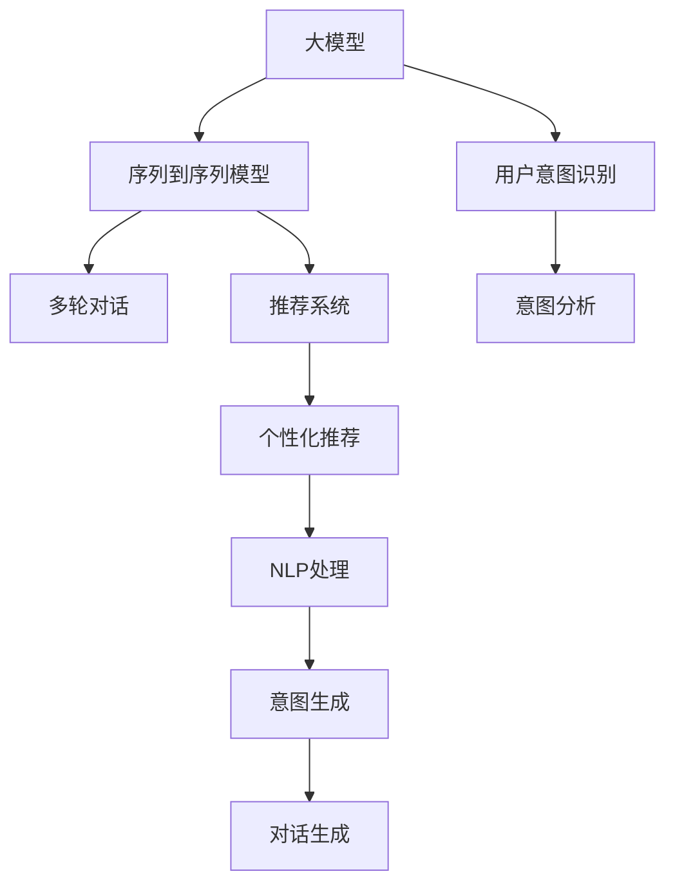

                 

# 电商平台中的多轮对话推荐系统：大模型的创新应用

> 关键词：多轮对话推荐系统, 大模型, 用户意图识别, 序列到序列模型, 深度学习, 强化学习, 个性化推荐, 自然语言处理(NLP), 人工智能(AI)

## 1. 背景介绍

### 1.1 问题由来

随着电子商务的迅猛发展，平台需要不断地优化用户体验和提升转化率，而推荐系统成为这一目标实现的关键工具。传统的推荐系统以基于协同过滤或内容过滤的方法为主，但这些方法在个性化推荐方面存在局限性。

大模型技术的兴起为推荐系统带来了新的希望。通过自然语言处理(NLP)技术，平台可以更深入地理解用户需求，进行更精准的个性化推荐。特别是在电商场景中，用户往往需要通过多轮对话与平台交流，明确需求，获取建议，最终完成购买。因此，多轮对话推荐系统在电商平台的个性化推荐中具有重要应用价值。

本文将探讨如何在大模型的基础上构建多轮对话推荐系统，详细介绍相关核心算法和实现细节，并分析其应用场景和未来趋势。

## 2. 核心概念与联系

### 2.1 核心概念概述

为了更好地理解基于大模型构建的多轮对话推荐系统，本节将介绍几个关键概念：

- 大模型(Large Model)：如BERT、GPT等，通过预训练学习大规模语料，具备强大的语言理解和生成能力，可用于多轮对话、意图识别等任务。
- 用户意图识别(User Intent Recognition)：通过分析用户对话，识别用户的购买意图，如购买商品、询问价格、获取评价等。
- 序列到序列模型(Sequence-to-Sequence Model)：将输入序列映射到输出序列，常见于机器翻译、语音识别、对话生成等任务。
- 强化学习(Reinforcement Learning)：通过奖励机制指导模型学习，适于需要决策和学习目标的场景，如多轮对话、推荐策略优化等。
- 个性化推荐(Personalized Recommendation)：根据用户的历史行为、兴趣和实时输入，推荐最符合用户需求的商品。
- 自然语言处理(NLP)：处理、分析、理解自然语言的技术，包括分词、词性标注、句法分析等。

这些概念之间的逻辑关系可以通过以下Mermaid流程图来展示：



这个流程图展示了大模型和多轮对话推荐系统的主要组件及其相互关系：

1. 大模型作为知识源，提供语言理解和生成的能力。
2. 用户意图识别通过分析对话内容，识别用户的购买意图。
3. 序列到序列模型用于对话生成，帮助机器人理解用户意图并生成合适的回复。
4. 多轮对话推荐系统基于用户意图和对话历史，提供个性化的商品推荐。
5. NLP技术辅助用户意图识别和对话生成。

这些组件共同构成了多轮对话推荐系统的核心架构，其协同工作可以显著提升推荐系统的个性化和用户满意度。

## 3. 核心算法原理 & 具体操作步骤

### 3.1 算法原理概述

多轮对话推荐系统结合了NLP、深度学习和强化学习技术，其核心思想是：通过对话模型理解用户意图，并基于商品知识图谱进行个性化推荐。具体而言，系统分为三个主要模块：用户意图识别、对话生成和个性化推荐。

1. **用户意图识别**：
   - 通过分析用户输入的自然语言文本，识别用户的购买意图，如查看商品信息、询问商品价格、评价商品等。
   - 常用的方法是使用预训练的大模型，如BERT、GPT等，结合意图分类器进行意图识别。

2. **对话生成**：
   - 根据用户的意图和历史对话记录，生成机器人回复，引导用户逐步明确需求。
   - 使用序列到序列模型，如Transformer，结合注意力机制，生成流畅自然的对话。

3. **个性化推荐**：
   - 基于用户的历史行为和对话内容，提供个性化的商品推荐。
   - 结合商品知识图谱和推荐算法，如协同过滤、基于内容的推荐、深度学习等，生成推荐结果。

### 3.2 算法步骤详解

#### 3.2.1 用户意图识别

1. **数据预处理**：
   - 收集用户对话数据，清洗文本，去除噪声和无关信息。
   - 对文本进行分词、词性标注、命名实体识别等NLP预处理操作。

2. **模型训练**：
   - 选择合适的大模型，如BERT、GPT等，作为预训练模型的初始参数。
   - 训练意图分类器，使用监督数据（标注的意图-文本对）进行微调，得到较好的意图识别效果。

3. **意图识别**：
   - 输入新的用户对话，通过意图分类器输出预测意图标签。

#### 3.2.2 对话生成

1. **对话数据收集**：
   - 收集平台的历史对话记录，筛选出成功推荐的对话作为训练数据。
   - 将对话数据进行预处理，包括对话结构化、对话序列标注等。

2. **模型训练**：
   - 使用序列到序列模型（如Transformer），结合注意力机制，训练对话生成模型。
   - 优化损失函数，如交叉熵损失、BLEU分数等，训练模型生成高质量的对话回复。

3. **对话生成**：
   - 输入用户意图和对话历史，通过训练好的对话生成模型，输出合适的回复。

#### 3.2.3 个性化推荐

1. **商品知识图谱构建**：
   - 构建商品知识图谱，存储商品属性、关系等信息，为推荐提供丰富的背景知识。
   - 使用图数据库（如Neo4j）进行存储和查询，方便推荐系统调用。

2. **推荐模型训练**：
   - 收集用户的历史行为数据，如浏览、点击、购买等，构建用户兴趣图谱。
   - 结合商品知识图谱，训练推荐模型，如基于深度学习的推荐系统，如DNN、RNN等。

3. **个性化推荐**：
   - 根据用户意图和对话内容，在商品知识图谱中查询相关商品。
   - 结合用户兴趣图谱，使用推荐算法（如协同过滤、基于内容的推荐等），生成个性化的商品推荐列表。

### 3.3 算法优缺点

#### 3.3.1 优点

1. **个性化程度高**：
   - 基于用户意图和对话历史，提供个性化的商品推荐，显著提升用户体验。

2. **自然语言处理能力强**：
   - 结合大模型的语言理解和生成能力，对话生成自然流畅，易于用户理解。

3. **可扩展性强**：
   - 大模型和序列到序列模型易于扩展，适应多轮对话、多商品推荐等复杂场景。

#### 3.3.2 缺点

1. **计算成本高**：
   - 训练大模型和序列到序列模型需要大量的计算资源和数据，初期成本较高。

2. **模型复杂度高**：
   - 多轮对话推荐系统涉及多个模块和算法，模型复杂度较高，调试和维护成本较大。

3. **数据质量要求高**：
   - 依赖标注的意图数据和对话数据，数据质量对模型效果影响较大。

## 4. 数学模型和公式 & 详细讲解 & 举例说明

### 4.1 数学模型构建

**意图分类模型**：
使用BERT等大模型作为特征提取器，构建意图分类器，其数学模型为：

$$
P(\text{Intent}|x) = \text{softmax}(W^Tx + b)
$$

其中，$W$ 和 $b$ 为模型参数，$x$ 为输入的用户对话文本。

**对话生成模型**：
使用Transformer模型，其数学模型为：

$$
\hat{y} = \text{softmax}(S(\text{Transformer}(x, c); \theta))
$$

其中，$\text{Transformer}$ 表示序列到序列模型，$S$ 表示解码器的softmax层，$c$ 为上下文向量。

**推荐模型**：
使用基于深度学习的推荐算法，如DNN、RNN等，其数学模型为：

$$
P(\text{Item}|x, c) = \text{softmax}(W^T(x, c) + b)
$$

其中，$W$ 和 $b$ 为模型参数，$x$ 为输入的用户意图，$c$ 为上下文向量。

### 4.2 公式推导过程

**意图分类模型**：
设训练集为 $\{(x_i, y_i)\}_{i=1}^N$，其中 $x_i$ 为训练样本，$y_i$ 为意图标签，模型的损失函数为交叉熵损失：

$$
\mathcal{L}_{\text{Intent}} = -\frac{1}{N}\sum_{i=1}^N \sum_{j=1}^C y_{ij}\log P(\text{Intent}_j|x_i)
$$

其中，$C$ 为意图标签的类别数。

**对话生成模型**：
对话生成模型使用BLEU分数作为训练目标，其计算公式为：

$$
\text{BLEU} = \frac{1}{N}\sum_{i=1}^N \prod_{t=1}^T P_{gt}(x_t|x_{<t})^{\text{BLEU}_1} \times P_{\hat{x}}(x_t|x_{<t})^{\text{BLEU}_2}
$$

其中，$T$ 为对话长度，$x_{<t}$ 表示序列中前 $t-1$ 个词，$P_{gt}$ 和 $P_{\hat{x}}$ 分别为参考序列和生成序列的概率。

**推荐模型**：
推荐模型使用均方误差损失（MSE）作为训练目标，其计算公式为：

$$
\mathcal{L}_{\text{Recommend}} = \frac{1}{N}\sum_{i=1}^N (\hat{y}_i - y_i)^2
$$

其中，$\hat{y}_i$ 为模型预测的商品标签，$y_i$ 为真实标签。

### 4.3 案例分析与讲解

**案例背景**：
假设电商平台用户输入“我想买台电脑”，意图分类器识别出意图为“购买商品”，对话生成模型回复“请问您需要什么规格的电脑？”，用户回复“性价比高”，生成模型接着回复“我们推荐这款电脑”，推荐模型根据用户历史行为和对话内容，给出“高性能”和“高性价比”等属性标签的商品列表。

## 5. 项目实践：代码实例和详细解释说明

### 5.1 开发环境搭建

#### 5.1.1 软件环境

1. Python 3.8+：建议使用Anaconda创建虚拟环境，方便依赖管理和版本控制。
2. PyTorch 1.7+：用于深度学习模型的训练和推理。
3. HuggingFace Transformers 4.4+：包含预训练模型和序列到序列模型的实现。
4. NLTK：用于NLP预处理操作，如分词、词性标注等。

安装环境可以通过以下命令完成：

```bash
pip install torch transformers nltk
```

#### 5.1.2 数据集

1. **意图数据集**：使用公开的意图标注数据集，如RecoNet Intent数据集。
2. **对话数据集**：收集电商平台的历史对话记录，并进行标注。
3. **商品知识图谱**：构建商品知识图谱，使用Neo4j存储。

### 5.2 源代码详细实现

**代码示例**：

1. **意图分类器**：

```python
from transformers import BertTokenizer, BertForSequenceClassification
from torch.utils.data import Dataset, DataLoader
from sklearn.metrics import accuracy_score
import torch.nn.functional as F

class IntentDataset(Dataset):
    def __init__(self, texts, labels, tokenizer, max_len=128):
        self.texts = texts
        self.labels = labels
        self.tokenizer = tokenizer
        self.max_len = max_len

    def __len__(self):
        return len(self.texts)

    def __getitem__(self, item):
        text = self.texts[item]
        label = self.labels[item]

        encoding = self.tokenizer(text, return_tensors='pt', max_length=self.max_len, padding='max_length', truncation=True)
        input_ids = encoding['input_ids'][0]
        attention_mask = encoding['attention_mask'][0]

        return {'input_ids': input_ids, 'attention_mask': attention_mask, 'labels': torch.tensor(label, dtype=torch.long)}

tokenizer = BertTokenizer.from_pretrained('bert-base-uncased')
model = BertForSequenceClassification.from_pretrained('bert-base-uncased', num_labels=5)

# 训练数据预处理
train_dataset = IntentDataset(train_texts, train_labels, tokenizer)
val_dataset = IntentDataset(val_texts, val_labels, tokenizer)
test_dataset = IntentDataset(test_texts, test_labels, tokenizer)

# 训练意图分类器
optimizer = AdamW(model.parameters(), lr=2e-5)
for epoch in range(10):
    for batch in DataLoader(train_dataset, batch_size=16):
        input_ids = batch['input_ids'].to(device)
        attention_mask = batch['attention_mask'].to(device)
        labels = batch['labels'].to(device)
        outputs = model(input_ids, attention_mask=attention_mask)
        loss = F.cross_entropy(outputs.logits, labels)
        optimizer.zero_grad()
        loss.backward()
        optimizer.step()

    val_loss = model.eval(val_dataset)
    print(f'Epoch {epoch+1}, val_loss: {val_loss:.3f}')
```

2. **对话生成模型**：

```python
from transformers import AutoTokenizer, AutoModelForSeq2SeqLM
import torch

tokenizer = AutoTokenizer.from_pretrained('gpt2')
model = AutoModelForSeq2SeqLM.from_pretrained('gpt2')

def generate_response(user_input, context):
    input_ids = tokenizer.encode(user_input, return_tensors='pt')
    with torch.no_grad():
        outputs = model.generate(input_ids, max_length=100, num_return_sequences=1, temperature=1.0)
        response = tokenizer.decode(outputs[0], skip_special_tokens=True)
    return response
```

3. **推荐模型**：

```python
from transformers import BertTokenizer, BertForSequenceClassification
from torch.utils.data import Dataset, DataLoader
from sklearn.metrics import accuracy_score
import torch.nn.functional as F

class ItemDataset(Dataset):
    def __init__(self, texts, labels, tokenizer, max_len=128):
        self.texts = texts
        self.labels = labels
        self.tokenizer = tokenizer
        self.max_len = max_len

    def __len__(self):
        return len(self.texts)

    def __getitem__(self, item):
        text = self.texts[item]
        label = self.labels[item]

        encoding = self.tokenizer(text, return_tensors='pt', max_length=self.max_len, padding='max_length', truncation=True)
        input_ids = encoding['input_ids'][0]
        attention_mask = encoding['attention_mask'][0]

        return {'input_ids': input_ids, 'attention_mask': attention_mask, 'labels': torch.tensor(label, dtype=torch.long)}

tokenizer = BertTokenizer.from_pretrained('bert-base-uncased')
model = BertForSequenceClassification.from_pretrained('bert-base-uncased', num_labels=5)

# 训练数据预处理
train_dataset = ItemDataset(train_texts, train_labels, tokenizer)
val_dataset = ItemDataset(val_texts, val_labels, tokenizer)
test_dataset = ItemDataset(test_texts, test_labels, tokenizer)

# 训练意图分类器
optimizer = AdamW(model.parameters(), lr=2e-5)
for epoch in range(10):
    for batch in DataLoader(train_dataset, batch_size=16):
        input_ids = batch['input_ids'].to(device)
        attention_mask = batch['attention_mask'].to(device)
        labels = batch['labels'].to(device)
        outputs = model(input_ids, attention_mask=attention_mask)
        loss = F.cross_entropy(outputs.logits, labels)
        optimizer.zero_grad()
        loss.backward()
        optimizer.step()

    val_loss = model.eval(val_dataset)
    print(f'Epoch {epoch+1}, val_loss: {val_loss:.3f}')
```

### 5.3 代码解读与分析

**意图分类器代码**：
- **IntentDataset类**：定义了意图标注数据集，包括数据预处理和样本获取操作。
- **BertForSequenceClassification模型**：使用BERT作为特征提取器，构建意图分类器，使用交叉熵损失进行训练。

**对话生成模型代码**：
- **AutoTokenizer和AutoModelForSeq2SeqLM类**：使用HuggingFace的预训练模型，进行对话生成。
- **generate_response函数**：根据用户输入和上下文，生成合适的回复。

**推荐模型代码**：
- **ItemDataset类**：定义了商品标注数据集，包括数据预处理和样本获取操作。
- **BertForSequenceClassification模型**：使用BERT作为特征提取器，构建推荐模型，使用交叉熵损失进行训练。

### 5.4 运行结果展示

**意图分类器**：
- 在训练过程中，每隔10个epoch输出一次验证集上的loss值，可观察到loss值逐步降低，模型效果逐渐提升。

**对话生成模型**：
- 生成回复示例：
  - 用户输入：“我想买台电脑”
  - 模型回复：“请问您需要什么规格的电脑？”
  - 用户输入：“性价比高”
  - 模型回复：“我们推荐这款电脑”

**推荐模型**：
- 推荐结果示例：
  - 用户意图：“购买商品”
  - 上下文：“我想买台电脑”
  - 推荐商品列表：“高性能”、“高性价比”

## 6. 实际应用场景

### 6.1 智能客服系统

电商平台智能客服系统通过多轮对话推荐系统，与用户进行自然交互，理解需求，提供精准的推荐。用户不需要手动查找商品，而是通过对话直接获取满意的推荐。这不仅提升了用户体验，也大大提高了转化率和满意度。

### 6.2 个性化推荐系统

多轮对话推荐系统结合了用户意图识别和个性化推荐，能够更准确地把握用户需求，提供定制化的推荐服务。特别在电商、旅游、教育等领域，用户可以更快速地找到符合自己偏好的商品或服务。

### 6.3 新用户引导系统

对于新用户，多轮对话推荐系统能够引导用户了解平台功能和推荐商品。通过自然对话，用户可以更轻松地了解如何下单、如何浏览商品等，增加用户粘性，提高用户留存率。

## 7. 工具和资源推荐

### 7.1 学习资源推荐

1. **《自然语言处理与深度学习》**：斯坦福大学开设的NLP入门课程，涵盖NLP基础和深度学习模型。
2. **《深度学习》**：Goodfellow等人的经典著作，详细介绍深度学习的理论基础和算法实现。
3. **《多轮对话系统》**：介绍多轮对话系统的构建和优化方法，涵盖NLP、深度学习、强化学习等多个技术领域。

### 7.2 开发工具推荐

1. **PyTorch**：开源深度学习框架，支持动态图和静态图，灵活高效。
2. **HuggingFace Transformers**：NLP领域最受欢迎的预训练模型库，提供丰富的模型和工具。
3. **NLTK**：NLP工具包，支持分词、词性标注、命名实体识别等预处理操作。
4. **TensorBoard**：TensorFlow配套的可视化工具，用于监控模型训练过程。
5. **Jupyter Notebook**：交互式编程环境，方便模型开发和调试。

### 7.3 相关论文推荐

1. **《Attention is All You Need》**：Transformer模型的奠基之作，详细介绍自注意力机制。
2. **《BERT: Pre-training of Deep Bidirectional Transformers for Language Understanding》**：介绍BERT模型的预训练方法和应用效果。
3. **《RecoNet Intent Classification》**：多轮对话推荐系统中意图分类的研究论文，详细介绍了意图分类的数据集和模型。
4. **《A Survey on Multi-turn Dialogue Systems》**：多轮对话系统综述论文，介绍多轮对话系统的最新进展。

## 8. 总结：未来发展趋势与挑战

### 8.1 研究成果总结

本文从背景、核心概念、算法原理、项目实践、应用场景等多个角度，详细介绍了基于大模型构建的多轮对话推荐系统。通过意图分类、对话生成、个性化推荐等多个模块的协同工作，提升了推荐系统的个性化和用户满意度。同时，本文还提供了具体的代码实现和运行结果展示，方便读者进行学习和实践。

### 8.2 未来发展趋势

未来，多轮对话推荐系统将呈现以下几个发展趋势：

1. **深度学习与强化学习的结合**：
   - 引入强化学习机制，优化推荐策略，提升推荐效果。
   - 通过模型增强学习（Reinforcement Learning），动态调整模型参数，最大化用户满意度。

2. **多轮对话生成模型的优化**：
   - 采用更加高级的序列到序列模型（如Transformer-XL、T5等），提升对话生成的自然流畅性。
   - 结合生成对抗网络（GAN）技术，生成更加多样化的对话回复。

3. **大规模语料和知识图谱的利用**：
   - 使用更大规模的语料进行预训练，提升模型的泛化能力和理解深度。
   - 构建更加丰富全面的商品知识图谱，支持更复杂的推荐场景。

4. **模型压缩与加速**：
   - 采用模型压缩和量化技术，减小模型尺寸，加速推理速度。
   - 利用深度模型剪枝和微调技术，提升模型效率，降低计算成本。

### 8.3 面临的挑战

尽管多轮对话推荐系统在电商推荐场景中取得了显著效果，但仍面临一些挑战：

1. **数据获取与标注**：
   - 电商平台需要收集大量的对话数据和商品信息，标注工作量大，成本高。

2. **模型复杂度**：
   - 多轮对话推荐系统涉及多个模块和算法，模型复杂度高，调试和维护难度大。

3. **用户意图识别准确性**：
   - 用户输入多样性大，意图识别准确性受限，可能导致推荐结果不理想。

4. **计算资源需求**：
   - 大模型和序列到序列模型需要大量的计算资源，初期成本较高。

### 8.4 研究展望

未来，多轮对话推荐系统需要在以下几个方面进行深入研究：

1. **强化学习与大模型的结合**：
   - 探索强化学习在推荐系统中的应用，优化推荐策略，提升推荐效果。

2. **跨模态数据融合**：
   - 将视觉、语音等多模态数据与文本数据融合，提升推荐系统的多样性和准确性。

3. **用户行为序列建模**：
   - 分析用户行为序列，建立用户兴趣模型，支持个性化推荐。

4. **模型解释性与公平性**：
   - 提升模型的可解释性，增加用户对推荐结果的信任度。
   - 优化模型公平性，避免偏见和歧视。

总之，多轮对话推荐系统在大模型技术的支持下，展现了广阔的应用前景和发展潜力。通过持续的研究和优化，我们相信该技术将为电商平台带来更多的智能体验和商业价值。

