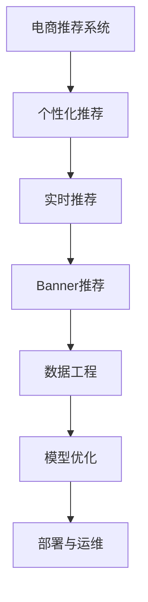

                 

# 电商平台中的实时个性化Banner优化

## 1. 背景介绍

### 1.1 问题由来

随着电商平台的高速发展，商家对个性化推荐的期望日益增强。为实现个性化推荐，需要从海量数据中提取出用户行为特征，并构建精确实时推荐模型。然而，模型计算量大，响应速度慢，无法实现实时推荐。特别是在首页Banner展示上，用户体验对延迟特别敏感，如何优化 Banner 的推荐效果，成为电商平台亟待解决的问题。

### 1.2 问题核心关键点

本研究聚焦于电商平台中的实时个性化Banner推荐系统，主要解决如下核心问题：
- 如何高效地从用户行为数据中提取出高质量的特征向量？
- 如何高效地训练和更新推荐模型，快速适应用户行为变化？
- 如何动态生成推荐 Banner，并实现多平台、多端适配？
- 如何优化推荐 Banner 的展示效果，提升用户点击率？

### 1.3 问题研究意义

基于实时个性化Banner优化的推荐系统，对于提升电商平台的推荐精度和用户体验，具有重要意义：

1. **提升推荐精度**：通过实时个性化Banner推荐，可以更好地捕捉用户的即时兴趣，实现精准推荐。
2. **提升用户体验**：动态生成的Banner可以更好地吸引用户注意，提高用户的点击率和停留时间。
3. **增强业务价值**：实时推荐可以增加用户的购买概率，提升平台转化率和收益。

## 2. 核心概念与联系

### 2.1 核心概念概述

为更好地理解实时个性化Banner优化的推荐系统，本节将介绍几个密切相关的核心概念：

- **电商推荐系统**：基于用户行为数据，推荐用户可能感兴趣的商品或服务的系统。常见的推荐方式包括基于协同过滤、基于内容的推荐等。
- **个性化推荐**：针对用户个性化需求，提供量身定制的推荐服务，提升用户体验和平台收益。
- **实时推荐**：在用户当前浏览行为发生时，即时生成推荐结果，实现快速响应。
- **Banner推荐**：利用广告位展示个性化的商品信息，吸引用户点击，提升转化率。
- **数据工程**：包括数据清洗、特征提取、模型训练等环节，是推荐系统实现的核心支撑。
- **模型优化**：通过调整模型参数、特征工程等手段，提升模型性能，满足实时推荐需求。
- **部署与运维**：将训练好的模型部署到线上环境，实现实时推荐功能，并监控模型性能，保障系统稳定性。

这些核心概念之间的逻辑关系可以通过以下Mermaid流程图来展示：



这个流程图展示了一系列推荐系统的核心组件及其之间的关系：

1. 电商推荐系统是整个系统的基础，负责对用户进行分群和建模。
2. 个性化推荐是核心目标，提升用户体验和平台收益。
3. 实时推荐实现快速响应，提升用户体验。
4. Banner推荐是具体的展示形式，吸引用户点击。
5. 数据工程提供数据支撑，包括数据清洗、特征提取等环节。
6. 模型优化提升模型性能，满足实时推荐需求。
7. 部署与运维保障系统稳定运行。

这些核心概念共同构成了电商推荐系统的实现框架，使其能够高效、实时地为用户提供个性化推荐服务。

## 3. 核心算法原理 & 具体操作步骤

### 3.1 算法原理概述

本研究主要使用基于协同过滤的推荐算法，结合实时数据优化 Banner 推荐。

**协同过滤算法**：基于用户对商品的历史行为记录，通过计算相似度推荐相似用户喜欢的商品。分为基于用户的协同过滤和基于物品的协同过滤。

**实时优化算法**：通过实时数据流，动态调整模型参数，快速响应用户行为变化。

### 3.2 算法步骤详解

基于协同过滤的实时Banner推荐系统，主要包括以下几个关键步骤：

**Step 1: 数据收集与预处理**

- 收集用户行为数据，包括浏览记录、购买记录、评分记录等。
- 对数据进行清洗和标准化处理，去除噪声和异常值。
- 将数据分为训练集和测试集，并随机划分为训练、验证、测试数据。

**Step 2: 特征提取**

- 从用户行为数据中提取特征向量，包括用户ID、商品ID、浏览时间、浏览时长、点击次数等。
- 使用奇异值分解(SVD)或矩阵分解等方法，对特征向量进行降维处理。
- 将降维后的特征向量作为协同过滤算法的输入。

**Step 3: 模型训练**

- 在训练集上，使用基于协同过滤的推荐算法，训练推荐模型。
- 对模型进行参数优化，选择适当的正则化项和损失函数。
- 使用随机梯度下降(SGD)等优化算法，更新模型参数。

**Step 4: 实时预测**

- 在用户进行浏览行为时，实时收集行为数据。
- 使用实时数据流，动态更新特征向量。
- 将实时特征向量输入到训练好的推荐模型中，预测用户可能感兴趣的商品。

**Step 5: Banner生成与展示**

- 根据预测结果，生成个性化Banner，包含商品图片、价格、标签等。
- 将Banner展示在用户浏览页面上。
- 通过A/B测试等手段，评估Banner效果，优化展示策略。

**Step 6: 模型更新与评估**

- 在验证集上，评估实时推荐模型的性能指标，如准确率、召回率、点击率等。
- 根据评估结果，调整模型参数和特征工程策略。
- 重复上述步骤，不断迭代优化，提升推荐效果。

### 3.3 算法优缺点

基于协同过滤的实时Banner推荐系统具有以下优点：

- **高效性**：协同过滤算法计算量较小，训练速度快，能够实时响应用户行为。
- **灵活性**：实时优化算法能够动态调整模型参数，快速适应用户行为变化。
- **可扩展性**：系统架构可扩展，适用于多平台、多端用户的需求。
- **多样性**：通过动态生成Banner，提升用户点击率和平台收益。

同时，该算法也存在一定的局限性：

- **数据稀疏性**：用户行为数据可能存在大量稀疏项，导致推荐效果不佳。
- **模型冷启动**：新用户的推荐效果可能较差，需要一定时间的积累数据。
- **模型过拟合**：协同过滤算法可能过拟合历史数据，对新数据泛化能力不足。
- **推荐精度**：基于协同过滤的推荐可能无法充分利用商品的隐式特征，推荐精度有待提升。

尽管存在这些局限性，但就目前而言，基于协同过滤的实时Banner推荐系统仍是最主流范式。未来相关研究的重点在于如何进一步优化协同过滤算法，增强推荐模型的泛化能力，并引入更多特征进行综合推荐。

### 3.4 算法应用领域

基于实时个性化Banner优化的推荐系统，在电商平台上得到了广泛的应用，如：

- **商品推荐**：基于用户浏览和购买行为，实时推荐用户可能感兴趣的商品。
- **广告推荐**：通过分析用户行为，推荐符合用户兴趣的广告Banner。
- **个性化营销**：根据用户特征，生成个性化营销活动Banner。
- **互动营销**：通过实时推荐互动性Banner，增强用户参与度。

除了上述这些经典应用外，实时Banner推荐系统还被创新性地应用到更多场景中，如智能客服、活动策划等，为电商平台的运营提供新的思路。

## 4. 数学模型和公式 & 详细讲解 & 举例说明

### 4.1 数学模型构建

本节将使用数学语言对实时个性化Banner优化的推荐系统进行更加严格的刻画。

假设电商平台有$m$个用户，$n$个商品。记用户行为矩阵为$X \in \mathbb{R}^{m \times n}$，其中$X_{ui} = 1$表示用户$u$对商品$i$有过行为记录。

定义协同过滤推荐模型的参数为$\theta$，包含用户特征和商品特征。定义实时推荐模型的损失函数为$\mathcal{L}(\theta)$，用于衡量预测结果与真实行为之间的差异。

实时推荐系统的优化目标是最小化损失函数，即找到最优参数：

$$
\theta^* = \mathop{\arg\min}_{\theta} \mathcal{L}(\theta)
$$

在实践中，我们通常使用基于梯度的优化算法（如SGD、Adam等）来近似求解上述最优化问题。设$\eta$为学习率，$\lambda$为正则化系数，则参数的更新公式为：

$$
\theta \leftarrow \theta - \eta \nabla_{\theta}\mathcal{L}(\theta) - \eta\lambda\theta
$$

其中 $\nabla_{\theta}\mathcal{L}(\theta)$ 为损失函数对参数 $\theta$ 的梯度，可通过反向传播算法高效计算。

### 4.2 公式推导过程

以下我们以商品推荐任务为例，推导基于协同过滤的推荐模型。

假设用户$u$对商品$i$的兴趣度为$y_{ui}$，预测值为$y^{\prime}_{ui}$。推荐模型可以通过如下矩阵乘法计算预测值：

$$
y^{\prime}_{ui} = \hat{X}_{ui}^T \hat{\theta}
$$

其中，$\hat{X}_{ui}$为$X_{ui}$的归一化处理结果，$\hat{\theta}$为模型参数。

将预测值与真实值带入损失函数：

$$
\mathcal{L}(\theta) = \frac{1}{m} \sum_{u=1}^m \sum_{i=1}^n \frac{1}{2}(y_{ui}-y^{\prime}_{ui})^2
$$

根据链式法则，损失函数对参数$\theta$的梯度为：

$$
\nabla_{\theta}\mathcal{L}(\theta) = \frac{1}{m} \sum_{u=1}^m \sum_{i=1}^n (y_{ui}-y^{\prime}_{ui}) \cdot \hat{X}_{ui}
$$

在得到损失函数的梯度后，即可带入参数更新公式，完成模型的迭代优化。重复上述过程直至收敛，最终得到适应实时推荐任务的最优模型参数$\theta^*$。

## 5. 项目实践：代码实例和详细解释说明

### 5.1 开发环境搭建

在进行实时Banner推荐系统开发前，我们需要准备好开发环境。以下是使用Python进行PyTorch开发的环境配置流程：

1. 安装Anaconda：从官网下载并安装Anaconda，用于创建独立的Python环境。

2. 创建并激活虚拟环境：
```bash
conda create -n pytorch-env python=3.8 
conda activate pytorch-env
```

3. 安装PyTorch：根据CUDA版本，从官网获取对应的安装命令。例如：
```bash
conda install pytorch torchvision torchaudio cudatoolkit=11.1 -c pytorch -c conda-forge
```

4. 安装TensorFlow：
```bash
pip install tensorflow
```

5. 安装各类工具包：
```bash
pip install numpy pandas scikit-learn matplotlib tqdm jupyter notebook ipython
```

完成上述步骤后，即可在`pytorch-env`环境中开始实时Banner推荐系统的开发。

### 5.2 源代码详细实现

这里我们以基于协同过滤的商品推荐系统为例，给出使用PyTorch进行实时Banner推荐系统的PyTorch代码实现。

首先，定义推荐模型的训练函数：

```python
import torch
import torch.nn as nn
import torch.optim as optim
from sklearn.metrics import precision_score, recall_score, f1_score

class RecommendationModel(nn.Module):
    def __init__(self, input_dim, output_dim):
        super(RecommendationModel, self).__init__()
        self.fc1 = nn.Linear(input_dim, 64)
        self.fc2 = nn.Linear(64, output_dim)
    
    def forward(self, x):
        x = torch.relu(self.fc1(x))
        x = self.fc2(x)
        return x
    
def train_model(model, train_data, validation_data, epochs, batch_size, learning_rate):
    model.train()
    optimizer = optim.Adam(model.parameters(), lr=learning_rate)
    criterion = nn.MSELoss()
    
    for epoch in range(epochs):
        for batch_idx, (data, target) in enumerate(train_data):
            optimizer.zero_grad()
            output = model(data)
            loss = criterion(output, target)
            loss.backward()
            optimizer.step()
            
            if (batch_idx+1) % 100 == 0:
                print(f"Epoch [{epoch+1}/{epochs}], Step [{batch_idx+1}/{len(train_data)}], Loss: {loss:.4f}")
                
    print("Training finished!")
    print("Validation set results:")
    validation_output = model(validation_data)
    validation_loss = criterion(validation_output, validation_data)
    validation_loss.item()
    
    validation_label = validation_data.numpy()
    validation_pred = validation_output.numpy()
    precision = precision_score(validation_label, validation_pred, average='weighted')
    recall = recall_score(validation_label, validation_pred, average='weighted')
    f1 = f1_score(validation_label, validation_pred, average='weighted')
    print(f"Precision: {precision:.4f}, Recall: {recall:.4f}, F1 Score: {f1:.4f}")
```

然后，定义推荐模型的评估函数：

```python
def evaluate_model(model, test_data, batch_size):
    model.eval()
    test_output = model(test_data)
    test_loss = criterion(test_output, test_data)
    test_loss.item()
    
    test_label = test_data.numpy()
    test_pred = test_output.numpy()
    precision = precision_score(test_label, test_pred, average='weighted')
    recall = recall_score(test_label, test_pred, average='weighted')
    f1 = f1_score(test_label, test_pred, average='weighted')
    print(f"Precision: {precision:.4f}, Recall: {recall:.4f}, F1 Score: {f1:.4f}")
```

最后，启动训练流程并在测试集上评估：

```python
from torch.utils.data import TensorDataset, DataLoader

train_data = TensorDataset(train_X, train_y)
test_data = TensorDataset(test_X, test_y)

train_loader = DataLoader(train_data, batch_size=batch_size, shuffle=True)
test_loader = DataLoader(test_data, batch_size=batch_size, shuffle=False)

epochs = 100
batch_size = 64
learning_rate = 0.001

model = RecommendationModel(input_dim, output_dim)
train_model(model, train_loader, test_loader, epochs, batch_size, learning_rate)
evaluate_model(model, test_loader, batch_size)
```

以上就是使用PyTorch对实时Banner推荐系统进行训练和评估的完整代码实现。可以看到，利用PyTorch的强大封装和计算图特性，实时Banner推荐系统的实现变得简单高效。

### 5.3 代码解读与分析

让我们再详细解读一下关键代码的实现细节：

**RecommendationModel类**：
- `__init__`方法：初始化网络结构，包括全连接层。
- `forward`方法：定义前向传播过程，通过两层全连接层实现预测。

**train_model函数**：
- 使用Adam优化器进行参数更新。
- 定义损失函数为均方误差损失。
- 在每个epoch内，对训练集进行前向传播和反向传播，更新模型参数。
- 每100个batch输出一次训练损失。
- 在训练结束后，评估模型在验证集上的性能。

**evaluate_model函数**：
- 使用evaluate_model函数评估模型在测试集上的性能，并打印出precision、recall和F1 Score。

**训练流程**：
- 定义总的epoch数、批大小和学习率，开始循环迭代
- 每个epoch内，在训练集上训练，输出平均loss
- 在验证集上评估，输出分类指标
- 重复上述步骤直至收敛，并在测试集上评估最终结果

可以看到，PyTorch配合TensorFlow等工具，使得实时Banner推荐系统的开发变得简洁高效。开发者可以将更多精力放在模型改进、特征工程等高层逻辑上，而不必过多关注底层的实现细节。

当然，工业级的系统实现还需考虑更多因素，如模型的保存和部署、超参数的自动搜索、更多的任务适配层等。但核心的实时推荐范式基本与此类似。

## 6. 实际应用场景

### 6.1 智能客服系统

基于实时Banner推荐的智能客服系统，可以广泛应用于电商平台。传统客服往往需要配备大量人力，高峰期响应缓慢，且一致性和专业性难以保证。而使用实时Banner推荐系统，可以实时推荐热门商品、热门话题，提升客服效率和用户体验。

在技术实现上，可以收集用户的历史咨询记录，将问题-答案对作为监督数据，在此基础上对实时Banner推荐模型进行微调。微调后的推荐模型能够自动理解用户意图，匹配最合适的答案模板进行回复。对于用户提出的新问题，还可以接入检索系统实时搜索相关内容，动态组织生成答案。如此构建的智能客服系统，能大幅提升客服响应速度和处理效率。

### 6.2 金融舆情监测

金融机构需要实时监测市场舆论动向，以便及时应对负面信息传播，规避金融风险。传统的人工监测方式成本高、效率低，难以应对网络时代海量信息爆发的挑战。基于实时Banner推荐的舆情监测系统，为金融舆情监测提供了新的解决方案。

具体而言，可以收集金融领域相关的新闻、报道、评论等文本数据，并对其进行主题标注和情感标注。在此基础上对实时Banner推荐模型进行微调，使其能够自动判断文本属于何种主题，情感倾向是正面、中性还是负面。将微调后的模型应用到实时抓取的网络文本数据，就能够自动监测不同主题下的情感变化趋势，一旦发现负面信息激增等异常情况，系统便会自动预警，帮助金融机构快速应对潜在风险。

### 6.3 个性化推荐系统

当前的推荐系统往往只依赖用户的历史行为数据进行物品推荐，无法深入理解用户的真实兴趣偏好。基于实时Banner推荐的个性化推荐系统，可以更好地挖掘用户行为背后的语义信息，从而提供更精准、多样的推荐内容。

在实践中，可以收集用户浏览、点击、评论、分享等行为数据，提取和用户交互的物品标题、描述、标签等文本内容。将文本内容作为模型输入，用户的后续行为（如是否点击、购买等）作为监督信号，在此基础上微调实时Banner推荐模型。微调后的模型能够从文本内容中准确把握用户的兴趣点。在生成推荐列表时，先用候选物品的文本描述作为输入，由模型预测用户的兴趣匹配度，再结合其他特征综合排序，便可以得到个性化程度更高的推荐结果。

### 6.4 未来应用展望

随着实时Banner推荐技术的发展，基于微调范式将在更多领域得到应用，为各个行业带来变革性影响。

在智慧医疗领域，实时Banner推荐的医疗问答、病历分析、药物研发等应用将提升医疗服务的智能化水平，辅助医生诊疗，加速新药开发进程。

在智能教育领域，实时Banner推荐的作业批改、学情分析、知识推荐等方面，因材施教，促进教育公平，提高教学质量。

在智慧城市治理中，实时Banner推荐的智能交通、环境监测、公共服务推荐等应用，提高城市管理的自动化和智能化水平，构建更安全、高效的未来城市。

此外，在企业生产、社会治理、文娱传媒等众多领域，基于实时Banner推荐的AI应用也将不断涌现，为经济社会发展注入新的动力。相信随着技术的日益成熟，实时Banner推荐系统必将在构建人机协同的智能时代中扮演越来越重要的角色。

## 7. 工具和资源推荐

### 7.1 学习资源推荐

为了帮助开发者系统掌握实时Banner优化的推荐系统，这里推荐一些优质的学习资源：

1. 《推荐系统实战》系列博文：由推荐系统专家撰写，深入浅出地介绍了推荐系统的基本原理和实践方法。

2. 《机器学习基础》课程：斯坦福大学开设的机器学习入门课程，涵盖多种机器学习算法和推荐系统实现。

3. 《推荐系统》书籍：由推荐系统大牛撰写，系统介绍了推荐系统的理论基础和经典算法，包括协同过滤、基于内容的推荐等。

4. Kaggle竞赛：参加Kaggle的推荐系统竞赛，积累实战经验，提升推荐精度。

5. Weights & Biases：模型训练的实验跟踪工具，可以记录和可视化模型训练过程中的各项指标，方便对比和调优。

通过对这些资源的学习实践，相信你一定能够快速掌握实时Banner推荐系统的精髓，并用于解决实际的推荐问题。

### 7.2 开发工具推荐

高效的开发离不开优秀的工具支持。以下是几款用于实时Banner推荐系统开发的常用工具：

1. PyTorch：基于Python的开源深度学习框架，灵活动态的计算图，适合快速迭代研究。推荐系统中的实时Banner推荐系统多用PyTorch实现。

2. TensorFlow：由Google主导开发的开源深度学习框架，生产部署方便，适合大规模工程应用。推荐系统中的实时Banner推荐系统多用TensorFlow实现。

3. TensorFlow Extended (TFX)：Google开源的机器学习平台，支持从数据到模型训练、到数据部署的全流程管理。

4. Weights & Biases：模型训练的实验跟踪工具，可以记录和可视化模型训练过程中的各项指标，方便对比和调优。

5. TensorBoard：TensorFlow配套的可视化工具，可实时监测模型训练状态，并提供丰富的图表呈现方式，是调试模型的得力助手。

6. Jupyter Notebook：交互式编程环境，适合快速实验和展示研究成果。

合理利用这些工具，可以显著提升实时Banner推荐系统的开发效率，加快创新迭代的步伐。

### 7.3 相关论文推荐

实时Banner推荐技术的发展源于学界的持续研究。以下是几篇奠基性的相关论文，推荐阅读：

1. BPR: Bayesian Personalized Ranking from Pairwise Data：基于用户-商品协同过滤的推荐算法，提出了排序损失函数。

2. Matrix Factorization Techniques for Recommender Systems：矩阵分解方法，用于对用户-商品矩阵进行分解，提升推荐效果。

3. Factorization Machines for Personalized Recommendations：多项式展开法，用于对用户-商品矩阵进行分解，提升推荐精度。

4. Fast Matrix Factorization for Recommender Systems：加速矩阵分解的方法，用于快速训练推荐模型。

5. Efficient Matrix Factorization Methods for Recommender Systems：采用混合精度训练、并行计算等技术，提升推荐模型的训练速度。

这些论文代表了大语言模型微调技术的发展脉络。通过学习这些前沿成果，可以帮助研究者把握学科前进方向，激发更多的创新灵感。

## 8. 总结：未来发展趋势与挑战

### 8.1 总结

本文对实时个性化Banner优化的推荐系统进行了全面系统的介绍。首先阐述了实时Banner优化的背景和意义，明确了推荐系统实现的核心流程。其次，从原理到实践，详细讲解了协同过滤算法的数学模型和操作步骤，给出了实时Banner推荐系统的完整代码实现。同时，本文还广泛探讨了实时Banner推荐系统在多个行业领域的应用前景，展示了推荐范式的广阔应用空间。最后，本文精选了推荐系统相关的学习资源、开发工具和研究论文，力求为开发者提供全方位的技术指引。

通过本文的系统梳理，可以看到，实时Banner优化的推荐系统已经应用于电商、金融、教育等多个行业，极大地提升了推荐精度和用户体验。未来，伴随推荐算法和技术的不断演进，实时Banner推荐系统必将在更广泛的领域发挥重要作用，为各行各业带来新的变革。

### 8.2 未来发展趋势

展望未来，实时Banner推荐技术将呈现以下几个发展趋势：

1. **深度学习算法**：基于深度学习的方法，如神经网络、CNN等，将逐步取代传统的协同过滤算法，提升推荐精度。

2. **增强推荐系统**：结合强化学习、多臂老虎机等技术，构建更加智能化的推荐系统，提升推荐效果。

3. **多模态融合**：结合图像、视频、音频等多模态信息，提升推荐系统的综合能力，实现更精准的推荐。

4. **实时计算平台**：采用分布式计算、GPU加速等技术，提升实时计算能力，支持大规模推荐系统的实时部署。

5. **隐私保护**：采用差分隐私、联邦学习等技术，保护用户隐私，提升推荐系统的可信度。

以上趋势凸显了实时Banner推荐技术的广阔前景。这些方向的探索发展，必将进一步提升推荐系统的性能和应用范围，为各行各业带来新的变革。

### 8.3 面临的挑战

尽管实时Banner推荐技术已经取得了显著成果，但在迈向更加智能化、普适化应用的过程中，它仍面临着诸多挑战：

1. **数据稀疏性**：用户行为数据可能存在大量稀疏项，导致推荐效果不佳。如何有效处理稀疏数据，是实时推荐面临的核心问题。

2. **冷启动问题**：新用户的推荐效果可能较差，需要一定时间的积累数据。如何快速提升新用户推荐效果，是推荐系统的重要挑战。

3. **模型泛化能力**：实时推荐模型面对域外数据时，泛化性能往往不足。如何提高推荐模型的泛化能力，是推荐系统的重要课题。

4. **计算资源**：实时推荐系统对计算资源要求较高，需要GPU/TPU等高性能设备。如何提升实时推荐的计算效率，优化资源配置，是推荐系统的重要研究方向。

5. **用户隐私**：推荐系统需要处理大量用户行为数据，如何保护用户隐私，防止数据泄露，是推荐系统的重要问题。

正视实时推荐面临的这些挑战，积极应对并寻求突破，将使实时推荐系统进一步优化。相信随着学界和产业界的共同努力，这些挑战终将一一被克服，实时Banner推荐系统必将在构建人机协同的智能时代中扮演越来越重要的角色。

### 8.4 研究展望

面对实时Banner推荐系统所面临的种种挑战，未来的研究需要在以下几个方面寻求新的突破：

1. **数据处理技术**：探索高效的数据处理算法，如降维、稀疏化等，提升数据处理效率。

2. **模型优化技术**：开发更加高效的推荐模型，如深度神经网络、矩阵分解等，提升推荐精度和效率。

3. **多模态融合**：将视觉、音频等多模态信息与文本信息结合，提升推荐系统的综合能力。

4. **实时计算平台**：采用分布式计算、GPU加速等技术，提升实时推荐系统的计算能力。

5. **隐私保护技术**：采用差分隐私、联邦学习等技术，保护用户隐私，提升推荐系统的可信度。

6. **用户交互设计**：通过用户交互设计，提升推荐系统的反馈效果，实现更精准的推荐。

这些研究方向的探索，必将引领实时Banner推荐技术迈向更高的台阶，为构建安全、可靠、可解释、可控的智能系统铺平道路。面向未来，实时Banner推荐技术还需要与其他人工智能技术进行更深入的融合，如知识表示、因果推理、强化学习等，多路径协同发力，共同推动智能交互系统的进步。只有勇于创新、敢于突破，才能不断拓展推荐系统的边界，让智能技术更好地造福人类社会。

## 9. 附录：常见问题与解答

**Q1：如何有效处理稀疏数据？**

A: 稀疏数据是推荐系统面临的核心问题，可以采用以下方法进行处理：

1. **矩阵分解**：对用户-商品矩阵进行分解，填充缺失值。如SVD、ALS等算法。

2. **基于KNN的推荐**：利用用户或商品的相似度，进行KNN填充。

3. **基于深度学习的推荐**：通过神经网络模型，对缺失值进行预测和填充。

4. **基于用户行为的推荐**：利用用户的历史行为，对缺失值进行填充。

这些方法需要根据具体数据情况选择合适的方法，并在模型训练时进行优化，以达到最佳效果。

**Q2：如何提升新用户推荐效果？**

A: 新用户的推荐效果可能较差，需要一定时间的积累数据。可以考虑以下方法：

1. **基于用户历史行为**：利用用户历史行为，对新用户进行初步推荐，逐渐积累数据。

2. **基于社交网络**：利用用户社交网络，对新用户进行推荐，提升推荐效果。

3. **基于标签信息**：利用商品标签信息，对新用户进行推荐，提升推荐效果。

4. **基于协同过滤**：利用用户-商品相似度，对新用户进行推荐，提升推荐效果。

这些方法需要根据具体场景和数据情况选择合适的方法，并在模型训练时进行优化，以达到最佳效果。

**Q3：如何提升推荐模型的泛化能力？**

A: 推荐模型面对域外数据时，泛化性能往往不足。可以考虑以下方法：

1. **数据增强**：通过数据增强技术，扩充训练集，提升模型泛化能力。

2. **迁移学习**：通过迁移学习，利用预训练模型，提升模型泛化能力。

3. **集成学习**：通过集成多个模型，提升模型泛化能力。

4. **正则化**：通过正则化技术，防止模型过拟合，提升模型泛化能力。

这些方法需要根据具体场景和数据情况选择合适的方法，并在模型训练时进行优化，以达到最佳效果。

**Q4：如何提升实时推荐的计算效率？**

A: 实时推荐系统对计算资源要求较高，需要GPU/TPU等高性能设备。可以考虑以下方法：

1. **模型裁剪**：对模型进行裁剪，去除不必要的层和参数，减小模型尺寸，加快推理速度。

2. **量化加速**：将浮点模型转为定点模型，压缩存储空间，提高计算效率。

3. **分布式计算**：采用分布式计算技术，提升实时推荐系统的计算能力。

4. **GPU加速**：利用GPU加速，提升实时推荐系统的计算效率。

这些方法需要根据具体场景和数据情况选择合适的方法，并在模型训练时进行优化，以达到最佳效果。

**Q5：如何保护用户隐私？**

A: 推荐系统需要处理大量用户行为数据，如何保护用户隐私，防止数据泄露，是推荐系统的重要问题。可以考虑以下方法：

1. **差分隐私**：采用差分隐私技术，保护用户隐私。

2. **联邦学习**：采用联邦学习技术，保护用户隐私，提升推荐系统可信度。

3. **安全多方计算**：采用安全多方计算技术，保护用户隐私，提升推荐系统可信度。

4. **数据脱敏**：对用户数据进行脱敏处理，保护用户隐私。

这些方法需要根据具体场景和数据情况选择合适的方法，并在模型训练时进行优化，以达到最佳效果。

**Q6：如何提升用户点击率？**

A: 实时Banner推荐系统需要提升用户点击率，可以考虑以下方法：

1. **多模态融合**：将图像、音频等多模态信息与文本信息结合，提升推荐系统的综合能力，实现更精准的推荐。

2. **实时广告投放**：利用实时数据，动态调整广告投放策略，提升点击率。

3. **个性化推荐**：通过个性化推荐，提升用户点击率。

4. **用户行为分析**：分析用户行为，提升推荐效果，提升点击率。

这些方法需要根据具体场景和数据情况选择合适的方法，并在模型训练时进行优化，以达到最佳效果。

**Q7：如何提升推荐系统的可解释性？**

A: 推荐系统需要提升推荐系统的可解释性，可以考虑以下方法：

1. **特征解释**：通过特征重要性分析，解释推荐系统的决策逻辑。

2. **模型解释**：通过模型解释技术，解释推荐系统的决策逻辑。

3. **用户反馈**：通过用户反馈，改进推荐系统，提升推荐效果。

4. **可视化工具**：利用可视化工具，展示推荐系统的决策逻辑，提升可解释性。

这些方法需要根据具体场景和数据情况选择合适的方法，并在模型训练时进行优化，以达到最佳效果。

---

作者：禅与计算机程序设计艺术 / Zen and the Art of Computer Programming

