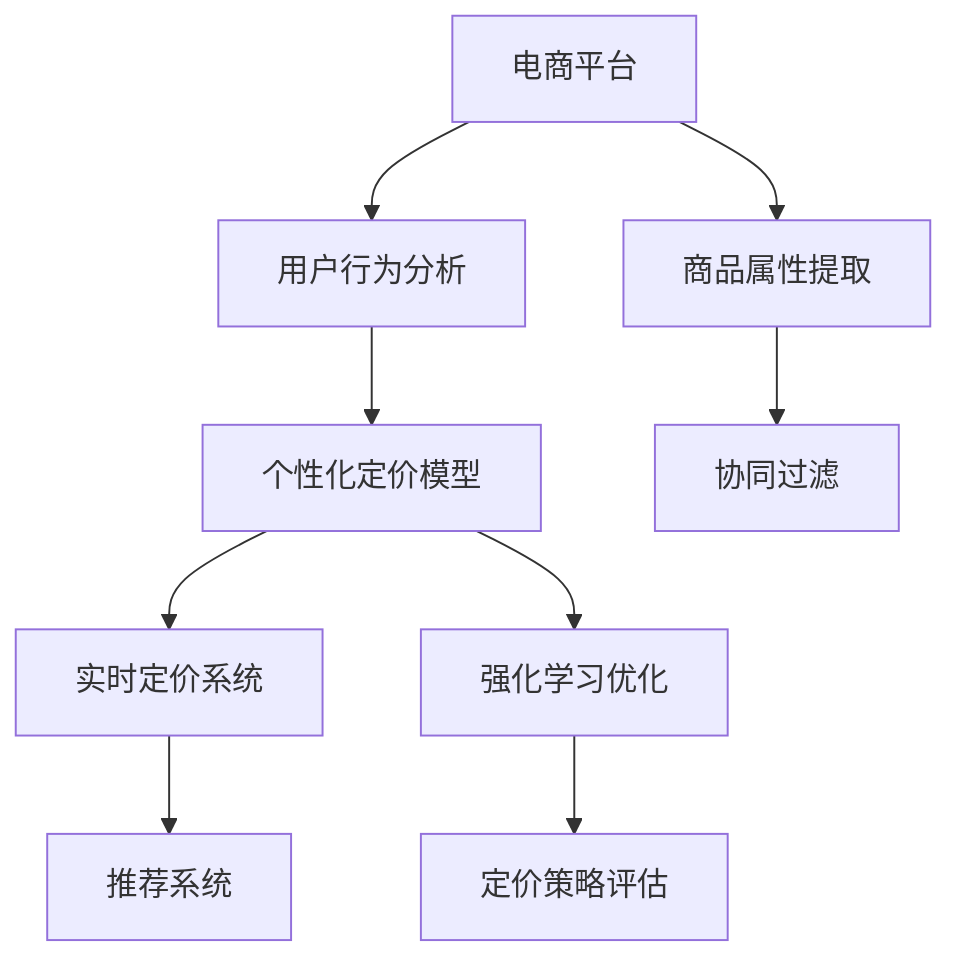

                 

# 电商平台中的实时个性化定价策略

> 关键词：
    - 个性化定价
    - 电商平台
    - 实时性
    - 深度学习
    - 协同过滤
    - 强化学习
    - 推荐系统

## 1. 背景介绍

随着电商市场的蓬勃发展，各电商平台纷纷通过差异化的服务策略来吸引用户，以保持竞争优势。个性化定价策略作为其中重要一环，通过动态调整商品价格，提升用户体验和平台收益。如何设计高效、公平且有效的定价策略，是电商平台亟需解决的问题。本文将对个性化定价策略的实现方法和技术手段进行深入探讨，以期为电商平台提供有益的参考。

## 2. 核心概念与联系

### 2.1 核心概念概述

个性化定价策略是基于用户行为、商品属性等多维度信息，对商品价格进行动态调整的策略。其核心在于通过数据分析和机器学习技术，预测用户对不同价格的敏感度，进而实现个性化和实时的价格优化。

- **个性化定价**：针对不同用户或细分市场，制定差异化价格策略，以提高用户满意度和平台收益。
- **电商平台**：提供商品交易、信息交流和用户交互的平台，如亚马逊、淘宝、京东等。
- **实时性**：定价策略能够快速响应市场变化，及时调整价格，保证价格的有效性和竞争力。
- **深度学习**：通过深度神经网络模型，挖掘用户行为和商品属性之间的复杂关系，实现精准预测和决策。
- **协同过滤**：基于用户行为或商品特征的相似性，进行推荐和定价，提高用户体验和平台收益。
- **强化学习**：通过奖励和惩罚机制，不断优化定价策略，以提高模型性能和效果。
- **推荐系统**：利用用户历史行为和商品属性，生成个性化的商品推荐和定价方案，提升用户购买意愿和平台转化率。

### 2.2 核心概念原理和架构的 Mermaid 流程图



这个流程图展示了个性化定价策略的核心组件和数据流向：

1. **用户行为分析**：收集用户历史行为数据，如浏览记录、购买历史、评分等。
2. **商品属性提取**：抽取商品属性特征，如价格、类别、库存等。
3. **个性化定价模型**：基于用户行为和商品属性，预测用户对不同价格的敏感度。
4. **实时定价系统**：根据个性化定价模型输出，动态调整商品价格。
5. **协同过滤**：利用用户行为和商品特征的相似性，推荐商品并辅助定价。
6. **推荐系统**：生成个性化商品推荐，提高用户购买意愿和平台转化率。
7. **强化学习优化**：通过不断学习，优化定价策略，提升模型性能。
8. **定价策略评估**：评估定价策略的效果，并进行迭代优化。

## 3. 核心算法原理 & 具体操作步骤

### 3.1 算法原理概述

个性化定价策略主要基于深度学习、协同过滤和强化学习等技术，进行用户行为和商品属性的分析、预测和优化。其核心算法原理如下：

1. **深度学习**：通过神经网络模型，挖掘用户行为和商品属性之间的复杂关系，实现精准预测和决策。
2. **协同过滤**：基于用户行为或商品特征的相似性，进行推荐和定价，提高用户体验和平台收益。
3. **强化学习**：通过奖励和惩罚机制，不断优化定价策略，以提高模型性能和效果。

### 3.2 算法步骤详解

**Step 1: 数据收集与预处理**
- 收集电商平台的用户行为数据，如浏览记录、购买历史、评分等。
- 抽取商品属性数据，如价格、类别、库存等。
- 进行数据清洗和预处理，包括缺失值填补、异常值处理等。

**Step 2: 特征工程与建模**
- 设计特征工程流程，提取和构造关键特征，如用户ID、商品ID、价格变化量、用户购买力等。
- 使用深度学习模型，如神经网络、LSTM等，对用户行为和商品属性进行建模。
- 训练模型，获取用户对不同价格的敏感度预测结果。

**Step 3: 实时定价**
- 根据预测结果，生成个性化定价策略。
- 利用实时定价系统，动态调整商品价格。
- 实时监控定价效果，调整价格策略。

**Step 4: 协同过滤与推荐**
- 利用协同过滤算法，对用户行为和商品特征进行分析，生成推荐列表。
- 根据推荐列表，辅助定价策略的优化。
- 实时推荐商品给用户，提高用户购买意愿和平台转化率。

**Step 5: 强化学习优化**
- 定义定价策略的优化目标，如最大化平台收益、用户满意度等。
- 利用强化学习算法，如Q-learning、策略梯度等，不断优化定价策略。
- 通过奖励和惩罚机制，学习最优定价策略。

**Step 6: 策略评估与迭代**
- 评估定价策略的效果，如通过A/B测试等方式。
- 根据评估结果，进行策略迭代优化。
- 不断优化模型和算法，提升定价策略的性能和效果。

### 3.3 算法优缺点

个性化定价策略的主要优点包括：

- 提高用户体验：通过动态调整价格，满足用户需求，提升用户满意度。
- 增加平台收益：优化价格策略，提高用户购买意愿和平台转化率。
- 提高市场竞争力：实时响应市场变化，保持价格优势。

主要缺点包括：

- 依赖数据质量：数据不完整或存在偏见，可能导致定价策略失效。
- 计算成本高：深度学习模型和大规模数据处理需要大量计算资源。
- 复杂度高：模型构建和优化需要丰富的专业知识。

### 3.4 算法应用领域

个性化定价策略在电商平台中具有广泛应用，涵盖多个环节，例如：

- **商品推荐**：根据用户行为和商品属性，生成个性化商品推荐，提高用户购买意愿。
- **价格优化**：基于用户对不同价格的敏感度，动态调整商品价格，提升平台收益。
- **库存管理**：通过动态定价策略，优化商品库存，减少库存积压和缺货。
- **市场推广**：针对不同用户群体，设计差异化价格策略，进行精准营销。
- **竞争应对**：实时监控竞争对手价格变化，及时调整定价策略，保持市场竞争力。

## 4. 数学模型和公式 & 详细讲解 & 举例说明

### 4.1 数学模型构建

假设用户对商品的价格敏感度为 $\theta$，商品价格为 $x$，则个性化定价模型的目标是最小化用户损失函数 $L(\theta, x)$，即：

$$
\min_{\theta} L(\theta, x) = E_{(x, y)}[\ell(\theta, x, y)]
$$

其中，$\ell$ 为损失函数，$(x, y)$ 为价格和购买决策的联合分布。

### 4.2 公式推导过程

对于二元随机变量 $(x, y)$，假设其联合分布为 $P(x, y)$，则期望为：

$$
E_{(x, y)}[\ell(\theta, x, y)] = \int_{x} \int_{y} P(x, y) \ell(\theta, x, y) dxdy
$$

根据深度学习模型的输出，假设预测的价格敏感度为 $\hat{\theta}$，则损失函数可表示为：

$$
\ell(\theta, x, y) = \left(\hat{\theta} - y\right)^2
$$

带入期望公式，得：

$$
E_{(x, y)}[\ell(\theta, x, y)] = \int_{x} \int_{y} P(x, y) \left(\hat{\theta} - y\right)^2 dxdy
$$

通过求解该期望，可得最优的定价策略 $\theta^*$。

### 4.3 案例分析与讲解

以一个简单的线性回归为例，假设数据集 $(x_i, y_i)$，其中 $x_i$ 为价格，$y_i$ 为购买概率，则模型可表示为：

$$
y = \beta_0 + \beta_1 x + \epsilon
$$

其中，$\beta_0, \beta_1$ 为模型参数，$\epsilon$ 为误差项。

通过最小化均方误差损失函数，求解参数：

$$
\min_{\beta} E_{(x, y)}[\ell(\beta)] = \min_{\beta} \frac{1}{N} \sum_{i=1}^N \left(y_i - \beta_0 - \beta_1 x_i\right)^2
$$

求解得到 $\beta_0$ 和 $\beta_1$ 后，即可计算出最优定价策略 $\hat{\theta}$。

## 5. 项目实践：代码实例和详细解释说明

### 5.1 开发环境搭建

在进行个性化定价策略的开发和实践前，需要准备好开发环境。以下是使用Python进行PyTorch开发的环境配置流程：

1. 安装Anaconda：从官网下载并安装Anaconda，用于创建独立的Python环境。
2. 创建并激活虚拟环境：
```bash
conda create -n pytorch-env python=3.8 
conda activate pytorch-env
```
3. 安装PyTorch：根据CUDA版本，从官网获取对应的安装命令。例如：
```bash
conda install pytorch torchvision torchaudio cudatoolkit=11.1 -c pytorch -c conda-forge
```
4. 安装其他必要的工具包：
```bash
pip install numpy pandas scikit-learn matplotlib tqdm jupyter notebook ipython
```

完成上述步骤后，即可在`pytorch-env`环境中开始开发实践。

### 5.2 源代码详细实现

以下是使用PyTorch进行个性化定价策略的代码实现。

```python
import torch
import torch.nn as nn
import torch.optim as optim
from torch.utils.data import DataLoader
from sklearn.preprocessing import StandardScaler
from sklearn.model_selection import train_test_split

# 数据集预处理
class PriceDataset(Dataset):
    def __init__(self, data, target, scaler):
        self.data = data
        self.target = target
        self.scaler = scaler
    
    def __len__(self):
        return len(self.data)
    
    def __getitem__(self, idx):
        x = self.data[idx]
        y = self.target[idx]
        return self.scaler.transform(x), y

# 模型定义
class LinearRegression(nn.Module):
    def __init__(self, input_dim, output_dim):
        super(LinearRegression, self).__init__()
        self.linear = nn.Linear(input_dim, output_dim)
    
    def forward(self, x):
        return self.linear(x)

# 数据加载和划分
data = ...
target = ...
scaler = StandardScaler()
train_data, test_data, train_target, test_target = train_test_split(data, target, test_size=0.2)
train_dataset = PriceDataset(train_data, train_target, scaler)
test_dataset = PriceDataset(test_data, test_target, scaler)

# 模型训练
model = LinearRegression(input_dim, output_dim)
optimizer = optim.Adam(model.parameters(), lr=0.01)
criterion = nn.MSELoss()

train_loader = DataLoader(train_dataset, batch_size=64, shuffle=True)
test_loader = DataLoader(test_dataset, batch_size=64, shuffle=False)

for epoch in range(100):
    model.train()
    for data, target in train_loader:
        optimizer.zero_grad()
        output = model(data)
        loss = criterion(output, target)
        loss.backward()
        optimizer.step()
    
    model.eval()
    with torch.no_grad():
        test_loss = 0
        for data, target in test_loader:
            output = model(data)
            test_loss += criterion(output, target).item()
        print('Epoch {}, Test Loss: {:.4f}'.format(epoch+1, test_loss/len(test_loader)))
```

以上代码实现了基本的线性回归模型，用于预测价格敏感度。其中，`PriceDataset`类用于数据预处理，`LinearRegression`类定义线性回归模型，`DataLoader`用于数据批处理，`Adam`优化器用于模型训练。

### 5.3 代码解读与分析

在代码实现中，我们通过`PriceDataset`类对数据进行了标准化处理，以提高模型的收敛速度和稳定性。模型定义了线性回归模型，并通过`Adam`优化器进行参数更新。

**代码分析**：

1. **数据预处理**：使用`StandardScaler`对数据进行标准化处理，将数据转化为均值为0、标准差为1的正态分布，有利于提高模型收敛速度和稳定性。
2. **模型定义**：定义线性回归模型，通过`nn.Linear`实现输入到输出的线性映射。
3. **模型训练**：使用`Adam`优化器进行模型参数更新，最小化均方误差损失函数。
4. **模型评估**：在测试集上评估模型性能，使用均方误差作为评估指标。

## 6. 实际应用场景

个性化定价策略在电商平台中的应用场景广泛，主要体现在以下几个方面：

### 6.1 用户行为分析

电商平台通过收集用户浏览、购买、评分等行为数据，进行分析，了解用户偏好和需求。利用深度学习模型，如LSTM、GRU等，对用户行为进行建模，预测用户对不同价格的敏感度，从而实现个性化定价。

### 6.2 商品属性提取

对商品进行属性提取，如价格、类别、库存等，作为定价的重要参考。利用协同过滤算法，如用户协同过滤、商品协同过滤等，生成商品推荐和定价方案。

### 6.3 实时定价

基于用户行为和商品属性，实时调整商品价格，以提高用户满意度和平台收益。利用强化学习算法，如Q-learning、策略梯度等，优化定价策略，提高模型性能。

### 6.4 强化学习优化

利用强化学习算法，通过奖励和惩罚机制，不断优化定价策略。通过模拟市场环境，进行模型训练和优化，提高定价策略的精准度和鲁棒性。

## 7. 工具和资源推荐

### 7.1 学习资源推荐

为了帮助开发者系统掌握个性化定价策略的理论基础和实践技巧，这里推荐一些优质的学习资源：

1. 《深度学习》系列书籍：涵盖深度学习的基本概念和算法，是了解深度学习的经典入门书籍。
2. 《机器学习实战》：详细介绍了机器学习算法的实现，包括协同过滤、强化学习等。
3. Coursera《机器学习》课程：由斯坦福大学教授Andrew Ng讲授，涵盖机器学习的基本概念和算法。
4 Kaggle：数据科学竞赛平台，提供了丰富的数据集和模型实战机会，适合实践和竞赛。
5 TensorFlow官方文档：提供了丰富的深度学习框架和API，适合学习和实践。

通过对这些资源的学习实践，相信你一定能够快速掌握个性化定价策略的精髓，并用于解决实际的电商问题。

### 7.2 开发工具推荐

高效的开发离不开优秀的工具支持。以下是几款用于个性化定价策略开发的常用工具：

1. PyTorch：基于Python的开源深度学习框架，灵活动态的计算图，适合快速迭代研究。
2 TensorFlow：由Google主导开发的开源深度学习框架，生产部署方便，适合大规模工程应用。
3 Weights & Biases：模型训练的实验跟踪工具，可以记录和可视化模型训练过程中的各项指标，方便对比和调优。
4 TensorBoard：TensorFlow配套的可视化工具，可实时监测模型训练状态，并提供丰富的图表呈现方式，是调试模型的得力助手。

合理利用这些工具，可以显著提升个性化定价策略的开发效率，加快创新迭代的步伐。

### 7.3 相关论文推荐

个性化定价策略的研究源于学界的持续研究。以下是几篇奠基性的相关论文，推荐阅读：

1. SVM Light: Scalable SVMs using very sparse kernels：介绍了一种基于支持向量机的协同过滤算法，适合大数据集处理。
2 Fast Matrix Factorization for Large-Scale Recommender Systems：提出了基于矩阵分解的协同过滤算法，适用于大规模推荐系统。
3 P3D: Person-Product-Affinity Matrix Factorization for Person Recommendation：提出了基于人-产品-关联矩阵分解的协同过滤算法，适用于电商平台的个性化推荐和定价。
4 Neural Collaborative Filtering: User-Item Rating Prediction Based on Matrix Factorization：提出基于神经网络的协同过滤算法，适用于复杂推荐系统。

这些论文代表了个性化定价策略的发展脉络。通过学习这些前沿成果，可以帮助研究者把握学科前进方向，激发更多的创新灵感。

## 8. 总结：未来发展趋势与挑战

### 8.1 研究成果总结

本文对个性化定价策略的实现方法和技术手段进行了深入探讨，涵盖数据预处理、特征工程、模型训练和优化等多个环节。通过深度学习、协同过滤和强化学习等技术，实现了个性化的定价策略，提升了用户满意度和平台收益。

### 8.2 未来发展趋势

展望未来，个性化定价策略将呈现以下几个发展趋势：

1. 数据来源多样化：将社交媒体、天气数据、新闻数据等多维度数据融入定价策略，提高模型的精准度和鲁棒性。
2. 实时定价机制：利用流式计算和大数据技术，实时响应市场变化，动态调整价格策略。
3. 深度学习应用：深度学习在个性化定价中的应用将更加广泛，利用神经网络对用户行为和商品属性进行更深入的挖掘和建模。
4 协同过滤扩展：基于协同过滤的推荐和定价算法将不断发展，引入更多维度和更复杂的模型。
5 强化学习优化：强化学习将不断优化定价策略，提高模型的性能和效果。

### 8.3 面临的挑战

尽管个性化定价策略已经取得了显著进展，但在迈向更加智能化、普适化应用的过程中，仍面临诸多挑战：

1. 数据隐私和安全：收集和分析用户行为数据时，需要保证用户隐私和数据安全，防止数据泄露和滥用。
2. 模型复杂度：深度学习模型和大规模数据处理需要大量计算资源，如何优化模型和算法，降低计算成本，是重要研究方向。
3 模型鲁棒性：面对异常数据和市场波动，模型鲁棒性不足，容易导致定价策略失效。
4 用户体验：个性化定价策略应平衡用户满意度和平台收益，避免过度推销和诱导消费。
5 算法透明度：个性化定价策略的算法应具备可解释性，方便用户理解和信任。

### 8.4 研究展望

面对个性化定价策略面临的挑战，未来的研究需要在以下几个方面寻求新的突破：

1. 探索无监督和半监督学习：摆脱对大规模标注数据的依赖，利用自监督学习、主动学习等方法，最大限度利用非结构化数据，实现更加灵活高效的定价策略。
2 研究参数高效和计算高效的定价策略：开发更加参数高效的定价模型，在固定大部分预训练参数的同时，只更新极少量的任务相关参数。
3 引入更多先验知识：将符号化的先验知识，如知识图谱、逻辑规则等，与神经网络模型进行巧妙融合，引导定价过程学习更准确、合理的语言模型。
4 引入博弈论工具：利用博弈论模型刻画市场竞争和用户行为，主动探索并规避定价策略的脆弱点，提高系统稳定性。
5 纳入伦理道德约束：在模型训练目标中引入伦理导向的评估指标，过滤和惩罚有偏见、有害的输出倾向，确保定价策略的公平和透明。

这些研究方向的探索，必将引领个性化定价策略技术迈向更高的台阶，为电商平台提供更加智能化、普适化的解决方案。

## 9. 附录：常见问题与解答

**Q1：个性化定价策略是否适用于所有电商平台？**

A: 个性化定价策略在大多数电商平台中都能取得不错的效果，特别是对于数据量较大的电商平台。但对于一些小型电商平台，由于数据量不足，可能效果有限。

**Q2：如何保证个性化定价策略的公平性？**

A: 个性化定价策略应避免对特定用户或群体的歧视和偏见，确保定价的公平性。可以通过设定惩罚机制，限制对高风险用户的价格歧视，保证公平性。

**Q3：如何降低个性化定价策略的计算成本？**

A: 个性化定价策略的计算成本主要集中在深度学习和协同过滤上。可以通过优化模型结构、采用稀疏化存储、引入分布式计算等方法，降低计算成本。

**Q4：如何确保个性化定价策略的实时性？**

A: 利用流式计算和大数据技术，实时处理和分析用户行为数据，动态调整价格策略，保证实时性和响应速度。

**Q5：如何评估个性化定价策略的效果？**

A: 通过A/B测试、回归分析、用户反馈等方式，评估个性化定价策略的效果。使用均方误差、准确率等指标，衡量模型性能。

通过本文的系统梳理，可以看到，个性化定价策略在电商平台中的应用具有广阔前景，能够显著提升用户满意度和平台收益。未来，伴随技术的不断进步和实践的深入，个性化定价策略将更好地服务于电商平台，推动电商市场的发展。

