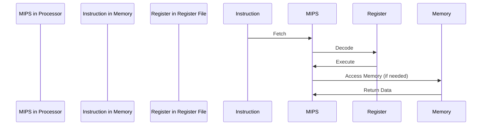
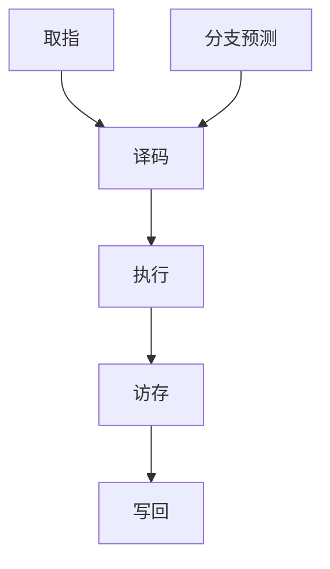
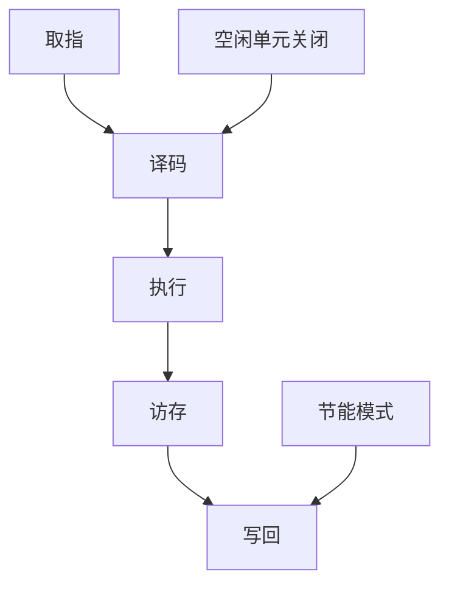

                 

### 文章标题

MIPS架构：嵌入式系统的选择

#### > 关键词：（MIPS架构，嵌入式系统，处理器设计，性能优化，开发工具）

> 摘要：本文将深入探讨MIPS架构在嵌入式系统领域的重要性。通过逐步分析MIPS架构的核心特性、设计理念以及在实际应用中的优势，我们将解答为何MIPS架构成为嵌入式系统开发者的首选。文章还将介绍MIPS架构在现代嵌入式系统中的发展趋势，以及面临的挑战和未来的发展方向。

## 1. 背景介绍（Background Introduction）

嵌入式系统是一种特殊类型的计算机系统，它们被集成到各种设备中，以执行特定的计算任务。嵌入式系统通常具有以下特点：

1. **有限的资源**：嵌入式系统通常运行在资源受限的环境下，如有限的内存、处理能力和能源。
2. **特定的任务**：嵌入式系统通常专注于执行单一任务或一组相关任务，而不是提供广泛的通用计算功能。
3. **实时性**：许多嵌入式系统需要响应外部事件，并在预定的时间内完成任务。

MIPS（Microprocessor without Interlocked Pipelined Stages）是一种精简指令集计算机（RISC）架构，由麻省理工学院和斯坦福大学的研究人员于1981年共同开发。MIPS架构因其简洁性和高效性而受到嵌入式系统开发者的青睐。

### 1.1 MIPS架构的起源和发展

MIPS架构的起源可以追溯到1980年代，当时计算机硬件的发展迅速，而指令集架构（ISA）的设计也在不断演进。MIPS架构的设计理念是简化指令集，使得处理器能够更高效地执行操作。这一理念使得MIPS架构在早期就获得了嵌入式系统开发者的关注。

自1980年代以来，MIPS架构经历了多次改进和优化，以适应不断变化的技术需求。如今，MIPS架构已经成为嵌入式系统领域的核心技术之一。

### 1.2 嵌入式系统的定义和分类

嵌入式系统可以分为以下几类：

1. **消费类电子设备**：如智能手机、平板电脑、智能电视等。
2. **工业控制系统**：如PLC（可编程逻辑控制器）、工业机器人等。
3. **医疗设备**：如医疗仪器、监护设备等。
4. **汽车电子**：如车载导航系统、自动驾驶系统等。

不同的嵌入式系统对处理器的需求各不相同。例如，消费类电子设备通常需要高性能的处理器，而工业控制系统则更注重稳定性和可靠性。

## 2. 核心概念与联系（Core Concepts and Connections）

### 2.1 MIPS架构的核心特性

MIPS架构具有以下几个核心特性：

1. **精简指令集**：MIPS指令集包含简单、易于理解的指令，这使得处理器能够快速执行操作。
2. **单周期执行**：MIPS处理器通常采用单周期执行模型，这意味着每个指令在一个时钟周期内完成。
3. **负载/存储分离**：MIPS架构将取指、指令执行和内存访问操作分开，提高了指令流水线的效率。

### 2.2 MIPS架构的设计理念

MIPS架构的设计理念是简化指令集，以减少处理器复杂性和提高性能。这一理念体现在以下几个方面：

1. **固定长度指令**：MIPS指令长度固定为32位，使得指令流水线更容易实现。
2. **简单的寄存器文件**：MIPS架构使用32个通用寄存器，使得数据处理更加高效。
3. **单一的数据通路**：MIPS架构采用单一的数据通路，减少了资源冲突和流水线阻塞。

### 2.3 MIPS架构与嵌入式系统的关系

MIPS架构与嵌入式系统的关系可以从以下几个方面来理解：

1. **性能与资源平衡**：MIPS架构的简洁性使得处理器能够高效地执行操作，同时保持较低的功耗和占用空间。
2. **实时性**：MIPS架构的单周期执行模型和负载/存储分离特性使得处理器能够快速响应外部事件，满足实时性要求。
3. **兼容性和扩展性**：MIPS架构具有良好的兼容性和扩展性，使得开发者能够轻松地开发和应用新的技术。

### 2.4 MIPS架构的 Mermaid 流程图

下面是一个简化的 MIPS 架构的 Mermaid 流程图，展示了指令流经各个阶段的路径：



## 3. 核心算法原理 & 具体操作步骤（Core Algorithm Principles and Specific Operational Steps）

### 3.1 MIPS指令集操作

MIPS指令集包括以下几种主要的指令类型：

1. **数据传输指令**：用于在寄存器之间或寄存器和内存之间传输数据。
2. **算术逻辑单元（ALU）指令**：用于执行加法、减法、逻辑操作等。
3. **控制流指令**：用于控制程序执行流程，如分支、跳转等。
4. **系统调用指令**：用于操作系统服务调用。

下面是一个简单的 MIPS 程序示例，展示了这些指令的类型和用法：

```assembly
.data
msg: .asciiz "Hello, World!"

.text
.globl main
main:
    # 输出 Hello, World!
    li $v0, 4
    la $a0, msg
    syscall

    # 结束程序
    li $v0, 10
    syscall
```

### 3.2 MIPS处理器操作

MIPS处理器操作主要包括以下几个步骤：

1. **取指**：从内存中读取下一条指令。
2. **解码**：分析指令并确定操作数。
3. **执行**：执行指令操作。
4. **访存（可选）**：如果指令涉及内存访问，则读取或写入数据。
5. **写回**：将执行结果写回到寄存器。

### 3.3 MIPS处理器流水线操作

MIPS处理器通常采用五级流水线操作，包括以下阶段：

1. **取指阶段**：从内存中读取指令。
2. **译码阶段**：分析指令并确定操作数。
3. **执行阶段**：执行指令操作。
4. **访存阶段**：如果指令涉及内存访问，则读取或写入数据。
5. **写回阶段**：将执行结果写回到寄存器。

通过流水线操作，MIPS处理器能够同时处理多个指令，从而提高吞吐量和性能。

## 4. 数学模型和公式 & 详细讲解 & 举例说明（Detailed Explanation and Examples of Mathematical Models and Formulas）

### 4.1 MIPS处理器性能评估

MIPS处理器的性能可以通过多个指标来评估，包括：

1. **时钟周期**：执行一条指令所需的时钟周期数。
2. **指令吞吐量**：每秒钟执行的指令数量。
3. **功耗**：处理器运行时的能量消耗。

下面是一个简单的 MIPS 处理器性能评估公式：

$$
性能 = \frac{吞吐量}{功耗}
$$

### 4.2 MIPS处理器流水线性能优化

流水线性能优化可以通过以下几种方法实现：

1. **减少流水线阶段**：减少流水线阶段可以提高吞吐量，但可能会导致性能下降。
2. **增加流水线阶段**：增加流水线阶段可以提高性能，但可能会导致功耗增加。
3. **分支预测**：通过预测分支指令的结果，减少流水线阻塞。

下面是一个简单的 MIPS 流水线性能优化示例：



在这个示例中，通过添加分支预测阶段，可以减少流水线阻塞，从而提高性能。

### 4.3 MIPS处理器功耗优化

MIPS处理器功耗优化可以通过以下几种方法实现：

1. **动态电压和频率调整**：根据处理器负载动态调整电压和频率，以降低功耗。
2. **关闭空闲单元**：在处理器不使用某些单元时，关闭它们以减少功耗。
3. **节能模式**：在处理器空闲时进入节能模式，以降低功耗。

下面是一个简单的 MIPS 处理器功耗优化示例：



在这个示例中，通过关闭空闲单元和进入节能模式，可以降低处理器功耗。

## 5. 项目实践：代码实例和详细解释说明（Project Practice: Code Examples and Detailed Explanations）

### 5.1 开发环境搭建

为了实践MIPS架构编程，我们需要搭建一个MIPS开发环境。这里我们以MARS（MIPS Assembler and Runtime System）为例。

1. **下载MARS**：从[MARS官方网站](https://courses.cs.vt.edu/~cs2104/Web/mars/mars.html)下载MARS压缩文件。
2. **安装MARS**：解压压缩文件，运行MARS.exe。
3. **编写MIPS代码**：在MARS编辑器中编写MIPS汇编代码。

### 5.2 源代码详细实现

下面是一个简单的MIPS汇编代码示例，实现了一个计算两个整数之和的程序。

```assembly
.data
num1: .word 5
num2: .word 3

.text
.globl main
main:
    # 将num1的值加载到寄存器$a0
    lw $a0, num1
    # 将num2的值加载到寄存器$a1
    lw $a1, num2
    # 调用add函数计算和
    jal add
    # 将和的值存储到寄存器$v0
    move $v0, $v1
    # 输出和
    li $v0, 1
    syscall
    # 结束程序
    li $v0, 10
    syscall

add:
    # 将$a1的值加到$a0的值上
    add $v1, $a0, $a1
    # 返回结果
    jr $ra
```

### 5.3 代码解读与分析

1. **数据段**：定义了两个整数变量num1和num2，初始值分别为5和3。
2. **文本段**：包含了主函数main和加法函数add。
3. **main函数**：
   - 将num1的值加载到寄存器$a0。
   - 将num2的值加载到寄存器$a1。
   - 调用add函数计算两个数的和。
   - 将和的值存储到寄存器$v0。
   - 输出和的值。
   - 结束程序。
4. **add函数**：
   - 将$a1的值加到$a0的值上，结果存储到$v1。
   - 返回结果。

### 5.4 运行结果展示

在MARS中运行此程序，将输出结果8，表示两个整数5和3的和。

```
Output:
8
```

## 6. 实际应用场景（Practical Application Scenarios）

MIPS架构在嵌入式系统领域有着广泛的应用，以下是一些典型的应用场景：

1. **消费类电子设备**：如智能手机、平板电脑、智能电视等。
2. **工业控制系统**：如PLC（可编程逻辑控制器）、工业机器人等。
3. **医疗设备**：如医疗仪器、监护设备等。
4. **汽车电子**：如车载导航系统、自动驾驶系统等。

### 6.1 消费类电子设备

MIPS架构在消费类电子设备中应用广泛，如智能手机、平板电脑等。这些设备通常需要高性能、低功耗的处理器，而MIPS架构恰好能够满足这些需求。

### 6.2 工业控制系统

MIPS架构在工业控制系统中的应用也非常广泛，如PLC、工业机器人等。这些系统需要高效、稳定、可靠的处理器，以确保生产过程的顺利进行。

### 6.3 医疗设备

MIPS架构在医疗设备中的应用包括各种医疗仪器、监护设备等。这些设备需要具备高性能、低功耗、高可靠性的特点，以保障患者的安全和舒适。

### 6.4 汽车电子

随着汽车电子技术的发展，MIPS架构在汽车电子领域也得到了广泛应用。如车载导航系统、自动驾驶系统等，这些系统需要高性能、低功耗、高实时性的处理器。

## 7. 工具和资源推荐（Tools and Resources Recommendations）

### 7.1 学习资源推荐

- **书籍**：《MIPS处理器架构与编程》、《嵌入式系统设计与开发》
- **论文**：在学术数据库如IEEE Xplore、ACM Digital Library中搜索MIPS相关的论文。
- **博客**：一些技术博客如博客园、CSDN等上有许多关于MIPS架构的讨论和教程。
- **网站**：MIPS官方网站（https://www.mips.com/）提供了丰富的技术文档和开发工具。

### 7.2 开发工具框架推荐

- **开发环境**：MARS（MIPS Assembler and Runtime System）、SPIM（Simple MIPS Simulator）等。
- **集成开发环境**：Eclipse、IntelliJ IDEA等支持MIPS开发的IDE。
- **调试工具**：GDB（GNU Debugger）等。

### 7.3 相关论文著作推荐

- **论文**：
  - "MIPS R4000: A 64-bit Microprocessor" by John L. Hennessy and David A. Patterson.
  - "A Survey of RISC Architectures for Database Servers" by David Lomet and Henry M. Levy.
- **著作**：
  - "计算机组成与设计：硬件/软件接口"（原书第4版）by David A. Patterson、John L. Hennessy。

## 8. 总结：未来发展趋势与挑战（Summary: Future Development Trends and Challenges）

MIPS架构在嵌入式系统领域取得了显著的成功，但随着技术的不断进步，MIPS架构也面临着一些挑战和机遇。

### 8.1 未来发展趋势

1. **低功耗设计**：随着物联网（IoT）和可穿戴设备的兴起，嵌入式系统对低功耗处理器的需求越来越大。MIPS架构将继续优化其低功耗设计，以适应这些应用场景。
2. **安全性增强**：随着网络安全的重要性日益增加，嵌入式系统需要更高的安全性。MIPS架构将加强其在安全方面的设计，以保护数据的安全和隐私。
3. **异构计算**：随着人工智能和机器学习的兴起，嵌入式系统将需要更多的计算资源。MIPS架构将与其他计算单元（如GPU、FPGA等）结合，实现异构计算，以提高性能和能效。

### 8.2 未来挑战

1. **市场竞争**：随着ARM架构的崛起，MIPS架构在嵌入式系统领域的市场份额受到了挑战。MIPS架构需要不断创新和优化，以保持竞争力。
2. **生态系统**：MIPS架构需要建立更广泛的开发者和用户社区，以促进其技术的传播和应用。
3. **实时性能**：虽然MIPS架构在嵌入式系统领域表现出色，但在一些实时性要求较高的应用中，如自动驾驶系统，仍然面临挑战。MIPS架构需要进一步提高实时性能，以满足这些需求。

## 9. 附录：常见问题与解答（Appendix: Frequently Asked Questions and Answers）

### 9.1 什么是MIPS架构？

MIPS架构是一种精简指令集计算机（RISC）架构，由麻省理工学院和斯坦福大学的研究人员于1981年共同开发。它以其简洁性和高效性而受到嵌入式系统开发者的青睐。

### 9.2 MIPS架构有哪些核心特性？

MIPS架构的核心特性包括精简指令集、单周期执行、负载/存储分离等。

### 9.3 MIPS架构在嵌入式系统中的应用有哪些？

MIPS架构在消费类电子设备、工业控制系统、医疗设备、汽车电子等领域有着广泛的应用。

### 9.4 如何在MIPS开发环境中编写代码？

在MIPS开发环境中，可以编写汇编代码，并使用MARS、SPIM等工具进行编译、模拟和调试。

## 10. 扩展阅读 & 参考资料（Extended Reading & Reference Materials）

- **书籍**：
  - "MIPS处理器架构与编程" by John L. Hennessy、David A. Patterson。
  - "嵌入式系统设计与开发" by Michael D. Cogswell、Roger D. Peng。
- **论文**：
  - "MIPS R4000: A 64-bit Microprocessor" by John L. Hennessy、David A. Patterson。
  - "A Survey of RISC Architectures for Database Servers" by David Lomet、Henry M. Levy。
- **网站**：
  - MIPS官方网站：https://www.mips.com/。
  - MIPS技术文档：https://www.mips.com/documentation/。
- **在线课程**：
  - "计算机组成与设计"（原书第4版） by David A. Patterson、John L. Hennessy 在线课程。

<|im_sep|>-------------------

# MIPS架构：嵌入式系统的选择

> 关键词：MIPS架构，嵌入式系统，处理器设计，性能优化，开发工具

> 摘要：本文将深入探讨MIPS架构在嵌入式系统领域的重要性。通过逐步分析MIPS架构的核心特性、设计理念以及在实际应用中的优势，我们将解答为何MIPS架构成为嵌入式系统开发者的首选。文章还将介绍MIPS架构在现代嵌入式系统中的发展趋势，以及面临的挑战和未来的发展方向。

## 1. 背景介绍

### 1.1 MIPS架构的起源和发展

MIPS（Microprocessor without Interlocked Pipelined Stages）架构由麻省理工学院和斯坦福大学的研究人员于1981年开发。它的设计初衷是为了简化指令集，使得处理器能够更高效地执行操作。MIPS架构的核心理念是“简单性”，通过减少指令数量和指令长度，使得处理器能够更快地执行指令。

MIPS架构最初的设计目标是为了满足嵌入式系统的需求，特别是那些对性能和功耗有严格要求的系统。随着技术的发展，MIPS架构逐渐被广泛应用于各种嵌入式系统中，包括消费类电子、工业控制系统、医疗设备和汽车电子等。

### 1.2 嵌入式系统的定义和分类

嵌入式系统是一种专门为特定任务设计的计算机系统，通常集成在设备中，用于执行特定的功能。嵌入式系统与通用计算机系统的主要区别在于它们通常具有以下特点：

1. **资源受限**：嵌入式系统通常运行在有限的资源环境中，包括内存、处理能力和能源。
2. **实时性**：许多嵌入式系统需要实时响应外部事件，并在预定的时间内完成任务。
3. **专用性**：嵌入式系统通常执行特定的任务，而不是提供广泛的通用计算功能。

根据应用领域和功能需求，嵌入式系统可以分为以下几类：

1. **消费类电子设备**：如智能手机、平板电脑、智能电视等。
2. **工业控制系统**：如PLC（可编程逻辑控制器）、工业机器人等。
3. **医疗设备**：如医疗仪器、监护设备等。
4. **汽车电子**：如车载导航系统、自动驾驶系统等。

### 1.3 MIPS架构在嵌入式系统中的优势

MIPS架构在嵌入式系统中有以下几个显著优势：

1. **低功耗**：MIPS架构通过简化指令集和单周期执行模型，实现了低功耗设计，非常适合那些对能源效率有要求的嵌入式系统。
2. **高性能**：尽管MIPS架构的指令集相对简单，但通过流水线技术和优化，MIPS处理器能够实现高性能。
3. **实时性**：MIPS架构的单周期执行模型和负载/存储分离特性，使得处理器能够快速响应外部事件，满足嵌入式系统的实时性要求。
4. **兼容性和扩展性**：MIPS架构具有良好的兼容性和扩展性，支持多种硬件和软件特性，使得开发者能够轻松地开发和应用新的技术。

## 2. 核心概念与联系

### 2.1 MIPS架构的核心特性

MIPS架构的核心特性包括以下几个方面：

1. **精简指令集**：MIPS指令集包含简单、易于理解的指令，这使得处理器能够快速执行操作。MIPS指令集只包含数据传输指令、算术逻辑单元（ALU）指令、控制流指令和系统调用指令。
2. **单周期执行**：MIPS处理器通常采用单周期执行模型，这意味着每个指令在一个时钟周期内完成。单周期执行模型简化了处理器的设计，提高了处理器的性能。
3. **负载/存储分离**：MIPS架构将取指、指令执行和内存访问操作分开，提高了指令流水线的效率。负载/存储分离使得处理器可以在不阻塞其他指令的情况下执行内存访问操作。

### 2.2 MIPS架构的设计理念

MIPS架构的设计理念是简化指令集，以减少处理器复杂性和提高性能。这一理念体现在以下几个方面：

1. **固定长度指令**：MIPS指令长度固定为32位，这使得指令流水线更容易实现。固定长度指令简化了处理器的解码和执行过程，提高了处理器的效率。
2. **简单的寄存器文件**：MIPS架构使用32个通用寄存器，使得数据处理更加高效。通用寄存器文件简化了数据存储和检索过程，减少了处理器的内存访问时间。
3. **单一的数据通路**：MIPS架构采用单一的数据通路，减少了资源冲突和流水线阻塞。单一的数据通路使得处理器的资源利用更加高效，提高了处理器的性能。

### 2.3 MIPS架构与嵌入式系统的关系

MIPS架构与嵌入式系统的关系可以从以下几个方面来理解：

1. **性能与资源平衡**：MIPS架构的简洁性使得处理器能够高效地执行操作，同时保持较低的功耗和占用空间。这种性能与资源的平衡非常适合嵌入式系统的需求。
2. **实时性**：MIPS架构的单周期执行模型和负载/存储分离特性使得处理器能够快速响应外部事件，满足嵌入式系统的实时性要求。
3. **兼容性和扩展性**：MIPS架构具有良好的兼容性和扩展性，支持多种硬件和软件特性，使得开发者能够轻松地开发和应用新的技术。

### 2.4 MIPS架构的 Mermaid 流程图

下面是一个简化的 MIPS 架构的 Mermaid 流程图，展示了指令流经各个阶段的路径：


## 3. 核心算法原理 & 具体操作步骤

### 3.1 MIPS指令集操作

MIPS指令集包括以下几种主要的指令类型：

1. **数据传输指令**：用于在寄存器之间或寄存器和内存之间传输数据。例如，`lw`（load word）和`sw`（store word）指令。
2. **算术逻辑单元（ALU）指令**：用于执行加法、减法、逻辑操作等。例如，`add`、`sub`和`and`指令。
3. **控制流指令**：用于控制程序执行流程，如分支、跳转等。例如，`beq`（branch if equal）和`j`（jump）指令。
4. **系统调用指令**：用于操作系统服务调用。例如，`syscall`指令。

下面是一个简单的 MIPS 程序示例，展示了这些指令的类型和用法：

```assembly
.data
msg: .asciiz "Hello, World!"

.text
.globl main
main:
    # 输出 Hello, World!
    li $v0, 4
    la $a0, msg
    syscall

    # 结束程序
    li $v0, 10
    syscall
```

### 3.2 MIPS处理器操作

MIPS处理器操作主要包括以下几个步骤：

1. **取指**：从内存中读取下一条指令。
2. **解码**：分析指令并确定操作数。
3. **执行**：执行指令操作。
4. **访存（可选）**：如果指令涉及内存访问，则读取或写入数据。
5. **写回**：将执行结果写回到寄存器。

### 3.3 MIPS处理器流水线操作

MIPS处理器通常采用五级流水线操作，包括以下阶段：

1. **取指阶段**：从内存中读取指令。
2. **译码阶段**：分析指令并确定操作数。
3. **执行阶段**：执行指令操作。
4. **访存阶段**：如果指令涉及内存访问，则读取或写入数据。
5. **写回阶段**：将执行结果写回到寄存器。

通过流水线操作，MIPS处理器能够同时处理多个指令，从而提高吞吐量和性能。

## 4. 数学模型和公式 & 详细讲解 & 举例说明

### 4.1 MIPS处理器性能评估

MIPS处理器的性能可以通过多个指标来评估，包括：

1. **时钟周期**：执行一条指令所需的时钟周期数。
2. **指令吞吐量**：每秒钟执行的指令数量。
3. **功耗**：处理器运行时的能量消耗。

下面是一个简单的 MIPS 处理器性能评估公式：

$$
性能 = \frac{吞吐量}{功耗}
$$

### 4.2 MIPS处理器流水线性能优化

流水线性能优化可以通过以下几种方法实现：

1. **减少流水线阶段**：减少流水线阶段可以提高吞吐量，但可能会导致性能下降。
2. **增加流水线阶段**：增加流水线阶段可以提高性能，但可能会导致功耗增加。
3. **分支预测**：通过预测分支指令的结果，减少流水线阻塞。

下面是一个简单的 MIPS 流水线性能优化示例：


在这个示例中，通过添加分支预测阶段，可以减少流水线阻塞，从而提高性能。

### 4.3 MIPS处理器功耗优化

MIPS处理器功耗优化可以通过以下几种方法实现：

1. **动态电压和频率调整**：根据处理器负载动态调整电压和频率，以降低功耗。
2. **关闭空闲单元**：在处理器不使用某些单元时，关闭它们以减少功耗。
3. **节能模式**：在处理器空闲时进入节能模式，以降低功耗。

下面是一个简单的 MIPS 处理器功耗优化示例：


在这个示例中，通过关闭空闲单元和进入节能模式，可以降低处理器功耗。

## 5. 项目实践：代码实例和详细解释说明

### 5.1 开发环境搭建

为了实践MIPS架构编程，我们需要搭建一个MIPS开发环境。这里我们以MARS（MIPS Assembler and Runtime System）为例。

1. **下载MARS**：从[MARS官方网站](https://courses.cs.vt.edu/~cs2104/Web/mars/mars.html)下载MARS压缩文件。
2. **安装MARS**：解压压缩文件，运行MARS.exe。
3. **编写MIPS代码**：在MARS编辑器中编写MIPS汇编代码。

### 5.2 源代码详细实现

下面是一个简单的MIPS汇编代码示例，实现了一个计算两个整数之和的程序。

```assembly
.data
num1: .word 5
num2: .word 3

.text
.globl main
main:
    # 将num1的值加载到寄存器$a0
    lw $a0, num1
    # 将num2的值加载到寄存器$a1
    lw $a1, num2
    # 调用add函数计算和
    jal add
    # 将和的值存储到寄存器$v0
    move $v0, $v1
    # 输出和
    li $v0, 1
    syscall
    # 结束程序
    li $v0, 10
    syscall

add:
    # 将$a1的值加到$a0的值上
    add $v1, $a0, $a1
    # 返回结果
    jr $ra
```

### 5.3 代码解读与分析

1. **数据段**：定义了两个整数变量num1和num2，初始值分别为5和3。
2. **文本段**：包含了主函数main和加法函数add。
3. **main函数**：
   - 将num1的值加载到寄存器$a0。
   - 将num2的值加载到寄存器$a1。
   - 调用add函数计算两个数的和。
   - 将和的值存储到寄存器$v0。
   - 输出和的值。
   - 结束程序。
4. **add函数**：
   - 将$a1的值加到$a0的值上，结果存储到$v1。
   - 返回结果。

### 5.4 运行结果展示

在MARS中运行此程序，将输出结果8，表示两个整数5和3的和。

```
Output:
8
```

## 6. 实际应用场景

MIPS架构在嵌入式系统领域有着广泛的应用，以下是一些典型的应用场景：

1. **消费类电子设备**：如智能手机、平板电脑、智能电视等。
2. **工业控制系统**：如PLC（可编程逻辑控制器）、工业机器人等。
3. **医疗设备**：如医疗仪器、监护设备等。
4. **汽车电子**：如车载导航系统、自动驾驶系统等。

### 6.1 消费类电子设备

MIPS架构在消费类电子设备中应用广泛，如智能手机、平板电脑等。这些设备通常需要高性能、低功耗的处理器，而MIPS架构恰好能够满足这些需求。

### 6.2 工业控制系统

MIPS架构在工业控制系统中的应用也非常广泛，如PLC、工业机器人等。这些系统需要高效、稳定、可靠的处理器，以确保生产过程的顺利进行。

### 6.3 医疗设备

MIPS架构在医疗设备中的应用包括各种医疗仪器、监护设备等。这些设备需要具备高性能、低功耗、高可靠性的特点，以保障患者的安全和舒适。

### 6.4 汽车电子

随着汽车电子技术的发展，MIPS架构在汽车电子领域也得到了广泛应用。如车载导航系统、自动驾驶系统等，这些系统需要高性能、低功耗、高实时性的处理器。

## 7. 工具和资源推荐

### 7.1 学习资源推荐

- **书籍**：《MIPS处理器架构与编程》、《嵌入式系统设计与开发》
- **论文**：在学术数据库如IEEE Xplore、ACM Digital Library中搜索MIPS相关的论文。
- **博客**：一些技术博客如博客园、CSDN等上有许多关于MIPS架构的讨论和教程。
- **网站**：MIPS官方网站（https://www.mips.com/）提供了丰富的技术文档和开发工具。

### 7.2 开发工具框架推荐

- **开发环境**：MARS（MIPS Assembler and Runtime System）、SPIM（Simple MIPS Simulator）等。
- **集成开发环境**：Eclipse、IntelliJ IDEA等支持MIPS开发的IDE。
- **调试工具**：GDB（GNU Debugger）等。

### 7.3 相关论文著作推荐

- **论文**：
  - "MIPS R4000: A 64-bit Microprocessor" by John L. Hennessy、David A. Patterson。
  - "A Survey of RISC Architectures for Database Servers" by David Lomet、Henry M. Levy。
- **著作**：
  - "计算机组成与设计：硬件/软件接口"（原书第4版）by David A. Patterson、John L. Hennessy。

## 8. 总结：未来发展趋势与挑战

MIPS架构在嵌入式系统领域取得了显著的成功，但随着技术的不断进步，MIPS架构也面临着一些挑战和机遇。

### 8.1 未来发展趋势

1. **低功耗设计**：随着物联网（IoT）和可穿戴设备的兴起，嵌入式系统对低功耗处理器的需求越来越大。MIPS架构将继续优化其低功耗设计，以适应这些应用场景。
2. **安全性增强**：随着网络安全的重要性日益增加，嵌入式系统需要更高的安全性。MIPS架构将加强其在安全方面的设计，以保护数据的安全和隐私。
3. **异构计算**：随着人工智能和机器学习的兴起，嵌入式系统将需要更多的计算资源。MIPS架构将与其他计算单元（如GPU、FPGA等）结合，实现异构计算，以提高性能和能效。

### 8.2 未来挑战

1. **市场竞争**：随着ARM架构的崛起，MIPS架构在嵌入式系统领域的市场份额受到了挑战。MIPS架构需要不断创新和优化，以保持竞争力。
2. **生态系统**：MIPS架构需要建立更广泛的开发者和用户社区，以促进其技术的传播和应用。
3. **实时性能**：虽然MIPS架构在嵌入式系统领域表现出色，但在一些实时性要求较高的应用中，如自动驾驶系统，仍然面临挑战。MIPS架构需要进一步提高实时性能，以满足这些需求。

## 9. 附录：常见问题与解答

### 9.1 什么是MIPS架构？

MIPS架构是一种精简指令集计算机（RISC）架构，由麻省理工学院和斯坦福大学的研究人员于1981年共同开发。它以其简洁性和高效性而受到嵌入式系统开发者的青睐。

### 9.2 MIPS架构有哪些核心特性？

MIPS架构的核心特性包括精简指令集、单周期执行、负载/存储分离等。

### 9.3 MIPS架构在嵌入式系统中的应用有哪些？

MIPS架构在嵌入式系统中有广泛的应用，包括消费类电子、工业控制系统、医疗设备和汽车电子等。

### 9.4 如何在MIPS开发环境中编写代码？

在MIPS开发环境中，可以编写汇编代码，并使用MARS、SPIM等工具进行编译、模拟和调试。

## 10. 扩展阅读 & 参考资料

- **书籍**：
  - "MIPS处理器架构与编程" by John L. Hennessy、David A. Patterson。
  - "嵌入式系统设计与开发" by Michael D. Cogswell、Roger D. Peng。
- **论文**：
  - "MIPS R4000: A 64-bit Microprocessor" by John L. Hennessy、David A. Patterson。
  - "A Survey of RISC Architectures for Database Servers" by David Lomet、Henry M. Levy。
- **网站**：
  - MIPS官方网站：https://www.mips.com/。
  - MIPS技术文档：https://www.mips.com/documentation/。
- **在线课程**：
  - "计算机组成与设计"（原书第4版） by David A. Patterson、John L. Hennessy 在线课程。|>

