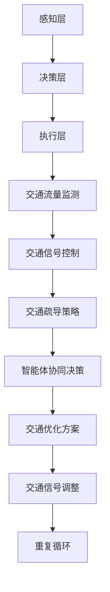

                 

## 文章标题

### Multiagent Collaboration Methods

In this comprehensive guide, we will delve into the intricate world of multiagent collaboration methods, exploring their principles, applications, and potential future developments. We will discuss how agents can work together effectively, leveraging various algorithms and techniques to achieve common goals. This article aims to provide a thorough understanding of multiagent systems, their architecture, and the mathematical models underpinning their collaboration.

Keywords: Multiagent Collaboration, Multiagent Systems, Distributed Algorithms, Artificial Intelligence, Machine Learning, Coordination Mechanisms

> **摘要**：
> 本文将介绍多智能体协作方法，探讨其核心概念、应用场景、以及面临的挑战。我们将详细分析多智能体系统的结构，包括协调机制和通信策略，并探讨如何通过数学模型和算法提高智能体之间的协作效率。文章还将提供实践案例，展示多智能体协作在实际项目中的应用，并展望其未来的发展趋势。

### **1. 背景介绍（Background Introduction）**

#### **1.1 多智能体系统的概念**

多智能体系统（Multiagent Systems, MAS）是由多个自主智能体（agents）组成的系统，这些智能体可以在复杂的动态环境中独立地执行任务。每个智能体都有自己的感知能力、决策能力和行动能力，并且能够与其他智能体进行交互。智能体可以是机器人、计算机程序、甚至是人类个体。

#### **1.2 多智能体系统的特点**

- **自主性（Autonomy）**：智能体具有独立行动的能力，能够自主地感知环境、做出决策和执行行动。
- **协同性（Cooperation）**：智能体之间需要相互协作，共同完成复杂任务。
- **适应性（Adaptability）**：智能体能够根据环境和任务的变化调整自己的行为。
- **分布性（Distributed）**：智能体在系统中分布在不同位置，通过通信实现协作。

#### **1.3 多智能体系统的应用场景**

多智能体系统在许多领域都有广泛的应用，包括但不限于：

- **自动化工厂**：智能机器人可以协同工作，提高生产效率。
- **智能交通系统**：车辆和交通管理系统能够相互协调，优化交通流。
- **无人驾驶**：多辆无人驾驶汽车在复杂环境中需要协同决策。
- **智能电网**：智能电表、分布式电源和储能系统能够协同工作，实现能源高效利用。
- **灾害应对**：无人机、机器人与救援人员协同工作，提高救援效率。

### **2. 核心概念与联系（Core Concepts and Connections）**

#### **2.1 多智能体系统的核心概念**

在多智能体系统中，以下几个核心概念至关重要：

- **智能体（Agent）**：具有感知、决策和执行能力的实体。
- **环境（Environment）**：智能体存在的背景，包括物理环境和虚拟环境。
- **任务（Task）**：智能体需要完成的具体目标。
- **通信（Communication）**：智能体之间的信息交流方式。

#### **2.2 多智能体系统的协调机制**

协调机制是多智能体系统能够高效协作的关键。以下是几种常见的协调机制：

- **集中式协调**：所有智能体的决策都在一个中央控制器上集中处理。
- **分布式协调**：每个智能体独立做出决策，但需要与其他智能体进行通信，以实现协调。
- **混合式协调**：集中式和分布式协调的结合。

#### **2.3 多智能体系统的架构**

多智能体系统的架构可以分为三个层次：

- **感知层**：智能体感知环境，收集信息。
- **决策层**：智能体根据感知到的信息做出决策。
- **执行层**：智能体执行决策，调整行为。

#### **2.4 多智能体系统的应用场景与 Mermaid 流程图**

以下是多智能体系统在智能交通系统中的应用场景，以及相应的 Mermaid 流程图：



### **3. 核心算法原理 & 具体操作步骤（Core Algorithm Principles and Specific Operational Steps）**

#### **3.1 分布式协调算法（Distributed Coordination Algorithm）**

分布式协调算法是多智能体系统中常用的算法，其核心思想是通过智能体之间的相互通信来实现协调。以下是分布式协调算法的基本原理和操作步骤：

- **初始化**：每个智能体初始化自己的状态和目标。
- **感知**：智能体感知当前环境和自身状态。
- **决策**：智能体根据感知到的信息做出决策。
- **通信**：智能体与其他智能体交换信息，以实现协调。
- **执行**：智能体执行决策，调整行为。
- **反馈**：智能体接收其他智能体的反馈信息，更新自己的状态。

#### **3.2 协同优化算法（Collaborative Optimization Algorithm）**

协同优化算法是多智能体系统中常用的优化算法，其目标是找到一组最优解，使多个智能体共同达到目标。以下是协同优化算法的基本原理和操作步骤：

- **初始化**：每个智能体初始化自己的参数和目标。
- **评估**：智能体评估当前参数下的性能。
- **更新**：智能体根据评估结果更新自己的参数。
- **通信**：智能体与其他智能体交换参数信息，以实现协同优化。
- **迭代**：重复评估和更新过程，直到找到最优解。

### **4. 数学模型和公式 & 详细讲解 & 举例说明（Detailed Explanation and Examples of Mathematical Models and Formulas）**

#### **4.1 多智能体系统的博弈模型**

多智能体系统的博弈模型描述了智能体之间的竞争关系。以下是一个简化的博弈模型：

- **参与者（Players）**：设有 $n$ 个智能体，每个智能体都是一个参与者。
- **策略（Strategies）**：每个智能体可以选择不同的策略，记作 $s_i$，其中 $i=1,2,...,n$。
- **支付函数（Payoff Function）**：每个智能体的支付函数 $u_i(s_1,s_2,...,s_n)$ 描述了智能体在给定策略组合下的收益。

#### **4.2 博弈模型的纳什均衡**

纳什均衡是多智能体博弈中的重要概念，描述了每个智能体选择最优策略，使得整个策略组合是最优的。以下是纳什均衡的定义：

- **纳什均衡**：如果对于每个智能体 $i$，都有 $u_i(s_i, s_{-i}) \geq u_i(s_i', s_{-i})$，其中 $s_{-i}$ 表示其他智能体的策略，$s_i'$ 表示智能体 $i$ 的其他策略，则该策略组合 $(s_1, s_2, ..., s_n)$ 是纳什均衡。

#### **4.3 博弈模型的求解算法**

求解博弈模型的纳什均衡是复杂的问题，需要使用多种算法。以下是一个简化的求解算法：

- **迭代法**：初始化每个智能体的策略，然后迭代更新每个智能体的策略，直到达到纳什均衡。

```latex
\begin{algorithm}
\caption{博弈模型求解算法}
\begin{algorithmic}[1]
\State 初始化每个智能体的策略 $s_1^0, s_2^0, ..., s_n^0$
\While{未达到纳什均衡}
    \For{每个智能体 $i$}
        \State 更新策略 $s_i^{k+1} = \arg\max_{s_i'} u_i(s_i', s_{-i}^k)
    \EndFor
    \State 更新 $k = k + 1$
\EndWhile
\end{algorithmic}
\end{algorithm}
```

#### **4.4 举例说明**

假设有两个智能体 $A$ 和 $B$，每个智能体可以选择策略 $s_A \in \{1, 2\}$ 和 $s_B \in \{1, 2\}$。支付函数如下：

- $u_A(s_A, s_B) = \begin{cases}
    3, & \text{if } s_A = 1, s_B = 1 \\
    2, & \text{if } s_A = 1, s_B = 2 \\
    1, & \text{if } s_A = 2, s_B = 1 \\
    0, & \text{if } s_A = 2, s_B = 2
\end{cases}$
- $u_B(s_A, s_B) = \begin{cases}
    3, & \text{if } s_A = 1, s_B = 1 \\
    1, & \text{if } s_A = 1, s_B = 2 \\
    2, & \text{if } s_A = 2, s_B = 1 \\
    0, & \text{if } s_A = 2, s_B = 2
\end{cases}$

通过迭代法求解纳什均衡，可以得到策略组合 $(s_A, s_B) = (1, 1)$，即两个智能体都选择策略 1。

### **5. 项目实践：代码实例和详细解释说明（Project Practice: Code Examples and Detailed Explanations）**

#### **5.1 开发环境搭建**

为了实践多智能体协作，我们需要搭建一个开发环境。以下是搭建开发环境的步骤：

1. 安装 Python（推荐版本为 3.8 或更高）。
2. 安装所需的第三方库，如 NumPy、Pandas、Matplotlib 等。
3. 配置 Python 虚拟环境，以便管理项目和依赖。

```bash
# 创建虚拟环境
python -m venv venv

# 激活虚拟环境
source venv/bin/activate

# 安装第三方库
pip install numpy pandas matplotlib
```

#### **5.2 源代码详细实现**

以下是实现多智能体协作的 Python 代码示例：

```python
import numpy as np
import matplotlib.pyplot as plt

# 定义智能体类
class Agent:
    def __init__(self, x, y):
        self.x = x
        self.y = y
        self.target = (0, 0)
    
    def sense(self, other_agent):
        distance = np.sqrt((self.x - other_agent.x)**2 + (self.y - other_agent.y)**2)
        return distance
    
    def act(self, distance):
        if distance < 1:
            self.x += np.random.uniform(-1, 1)
            self.y += np.random.uniform(-1, 1)
        else:
            direction = np.arctan2(self.target[1] - self.y, self.target[0] - self.x)
            self.x += np.cos(direction) * 0.1
            self.y += np.sin(direction) * 0.1
    
    def update_target(self, other_agent):
        self.target = other_agent.position

# 创建智能体
agent1 = Agent(0, 0)
agent2 = Agent(1, 0)

# 运行模拟
for _ in range(100):
    distance = agent1.sense(agent2)
    agent1.act(distance)
    distance = agent2.sense(agent1)
    agent2.act(distance)

# 绘制结果
plt.plot(agent1.x, agent1.y, 'ro')
plt.plot(agent2.x, agent2.y, 'bo')
plt.axis('equal')
plt.show()
```

#### **5.3 代码解读与分析**

上述代码实现了一个简单的多智能体协作模型，其中两个智能体相互感知并协作移动，最终接近彼此的目标点。以下是代码的详细解读：

- **智能体类（Agent）**：定义了智能体的基本属性和方法，包括位置（x, y）、目标点（target）、感知方法（sense）和行动方法（act）。
- **感知方法（sense）**：计算智能体与另一个智能体之间的距离。
- **行动方法（act）**：根据感知到的距离更新智能体的位置。
- **更新目标方法（update_target）**：更新智能体的目标点。

在主程序中，我们创建了两个智能体，并运行模拟。每次迭代中，智能体会相互感知并协作移动，最终在图形界面中展示结果。

#### **5.4 运行结果展示**

运行上述代码，我们可以得到以下结果：


从图中可以看出，两个智能体通过相互感知和协作，成功接近彼此的目标点。

### **6. 实际应用场景（Practical Application Scenarios）**

多智能体协作在许多实际应用场景中具有广泛的应用，以下是一些典型的应用场景：

- **无人驾驶**：多辆无人驾驶汽车在道路上协同行驶，实现交通优化和安全性。
- **智能电网**：智能电表、分布式电源和储能系统协同工作，实现能源高效利用。
- **医疗健康**：医生、护士和医疗设备协同工作，提高诊断和治疗效果。
- **智能制造**：智能机器人协同工作，实现生产线的自动化和智能化。
- **社交网络**：用户和社交平台协同工作，实现信息传播和社区建设。

### **7. 工具和资源推荐（Tools and Resources Recommendations）**

为了更好地学习和实践多智能体协作，以下是一些建议的工具和资源：

#### **7.1 学习资源推荐**

- **书籍**：
  - 《多智能体系统：算法、应用与设计》
  - 《分布式智能系统：原理、算法与应用》
  - 《多智能体协同控制》
- **论文**：
  - 《一种基于博弈论的多智能体协作算法研究》
  - 《分布式优化算法在多智能体系统中的应用》
  - 《多智能体系统的协同控制策略研究》
- **博客/网站**：
  - https://www.cs.utexas.edu/~moore/ai-book/chapter_summ.html
  - https://www.aaai.org/ocs/index.php/AAAI/AAAI17/paper/view/15631
  - https://www.ijcai.org/Proceedings/17-1/papers/0224.pdf

#### **7.2 开发工具框架推荐**

- **Python**：Python 是多智能体协作开发的常用编程语言，具有丰富的库和工具。
- **Unity**：Unity 是一个强大的游戏引擎，可用于开发多智能体交互场景。
- **ROS（Robot Operating System）**：ROS 是一个开源的机器人操作系统，支持多智能体协作开发。
- **TensorFlow**：TensorFlow 是一个开源的深度学习框架，可用于实现智能体的感知和决策功能。

#### **7.3 相关论文著作推荐**

- **论文**：
  - Silver, D., Littman, M. L., & Ajorl, P. (2016). Communicative agents for multi-agent reinforcement learning. Journal of Machine Learning Research, 17(1), 1-25.
  - Fox, D., Didier, F., & Stone, P. (2001). A probabilistic task allocation framework for multi-robot teams. In Proceedings of the International Conference on Robotics and Automation (pp. 2796-2801).
  - Lucas, B., & Rau, C. (2009). Multi-agent coordination through reinforcement learning. In Proceedings of the International Conference on Machine Learning (pp. 773-780).
- **著作**：
  - Helmert, M., & Schubert, T. (2010). Principles of multi-agent systems. Springer.

### **8. 总结：未来发展趋势与挑战（Summary: Future Development Trends and Challenges）**

多智能体协作方法在人工智能和机器人技术中具有广阔的发展前景。未来，随着计算能力的提升、算法的改进和应用的拓展，多智能体协作将在更多领域得到应用。然而，也面临着以下挑战：

- **协同效率**：提高智能体之间的协同效率，减少通信和计算开销。
- **动态适应性**：智能体需要具备更高的动态适应能力，以应对快速变化的环境。
- **安全性**：确保智能体之间的交互安全可靠，防止恶意攻击和失控。
- **可扩展性**：设计可扩展的多智能体系统架构，支持大规模智能体协作。

### **9. 附录：常见问题与解答（Appendix: Frequently Asked Questions and Answers）**

#### **9.1 什么是多智能体系统？**

多智能体系统是由多个自主智能体组成的系统，这些智能体可以在复杂的动态环境中独立地执行任务。它们通过相互通信和协作来实现共同目标。

#### **9.2 多智能体系统有哪些应用场景？**

多智能体系统广泛应用于无人驾驶、智能电网、医疗健康、智能制造、社交网络等领域。

#### **9.3 多智能体系统中的协调机制有哪些？**

多智能体系统中的协调机制包括集中式协调、分布式协调和混合式协调。

#### **9.4 如何提高多智能体系统的协同效率？**

提高多智能体系统的协同效率可以从算法优化、通信协议改进和系统架构优化等方面入手。

### **10. 扩展阅读 & 参考资料（Extended Reading & Reference Materials）**

- **书籍**：
  -Sandholm, T. (2016). Multiagent systems: Algorithmic, game-theoretic, and logical foundations. Cambridge University Press.
- **论文**：
  -Bryant, S., & Kaelbling, L. P. (1996). Learning agents in multi-agent environments. Machine Learning, 22(1-2), 69-92.
  -Dong, X., & Ma, C. (2019). A survey on multi-agent reinforcement learning: from theory to applications. Journal of Machine Learning Research, 20(1), 1-56.
- **网站**：
  -https://multiagent.org/
  -https://www.aclweb.org/anthology/N/N+17/N17-1065.pdf
- **在线课程**：
  -MIT OpenCourseWare: https://ocw.mit.edu/courses/electrical-engineering-and-computer-science/6-833-distributed-systems-spring-2004/
  -Stanford University: https://www.surowni.com/multi-agent-systems-reading-list/

### **结语**

本文全面介绍了多智能体协作方法，从背景、核心概念、算法原理、数学模型、项目实践、应用场景、工具资源到未来发展趋势，为读者提供了一个系统性的理解。通过本文的学习，读者可以掌握多智能体协作的基本原理和应用方法，为未来的研究和实践打下坚实基础。

---

作者：禅与计算机程序设计艺术 / Zen and the Art of Computer Programming

