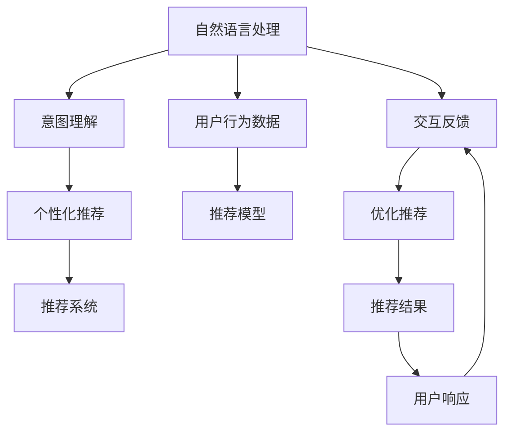

                 

# 电商平台中的对话式推荐系统个性化优化

## 1. 背景介绍

### 1.1 问题由来

随着电子商务的兴起，个性化推荐技术已成为电商平台的重要引擎之一。通过推荐引擎，用户可以在海量的商品信息中找到最符合自己需求的产品，提高购物体验和满意度。传统的推荐系统大多基于协同过滤、内容推荐等技术，但这些方法存在数据稀疏性、冷启动等问题。

近年来，基于深度学习的推荐系统取得了重大突破，如深度神经网络、协同神经网络等。这些方法能够有效地处理大规模数据，挖掘商品和用户之间的隐式关系，提升推荐效果。但在实际应用中，这些推荐系统仍面临一些挑战，如过度依赖用户历史行为数据、无法捕捉复杂的交互动态等。

为了更好地解决这些问题，对话式推荐系统应运而生。对话式推荐系统通过与用户进行自然语言交互，了解用户需求和偏好，提供更加精准的推荐服务。相对于传统的推荐系统，对话式推荐系统能够处理更多的交互信息，提升推荐效果的个性化水平。

### 1.2 问题核心关键点

对话式推荐系统通过自然语言处理技术，与用户进行实时对话，获取用户需求，再基于用户需求进行推荐。其核心在于构建一个能够理解和回应用户的自然语言对话模型，并将其与推荐系统相结合，实现推荐功能的个性化优化。

具体来说，对话式推荐系统的关键点包括：

- 用户意图理解：通过自然语言处理技术，理解用户输入的自然语言问题，提取关键信息。
- 个性化推荐：基于用户的历史行为数据和对话信息，构建个性化的推荐模型，提供匹配度高的推荐结果。
- 交互反馈：通过与用户交互，不断修正推荐结果，提升推荐准确性。
- 对话管理：管理对话流程，保持对话连贯性和交互友好性。

## 2. 核心概念与联系

### 2.1 核心概念概述

为了更好地理解对话式推荐系统，我们首先需要介绍几个核心概念：

- 自然语言处理(NLP)：涉及自然语言理解、生成、处理等技术，是对话式推荐系统实现的基础。
- 推荐系统：基于用户行为数据和商品属性信息，构建推荐模型，为用户推荐个性化商品。
- 对话式推荐系统：结合NLP和推荐系统技术，通过对话交互获取用户需求，并提供个性化推荐。
- 意图理解：通过NLP技术解析用户输入的自然语言问题，提取关键意图信息。
- 个性化推荐：基于用户行为数据和意图信息，构建个性化的推荐模型。
- 交互反馈：通过与用户的交互反馈，持续优化推荐结果。

这些概念之间的联系可以通过以下Mermaid流程图来展示：



这个流程图展示了对话式推荐系统的核心流程：

1. 用户输入自然语言问题，进入自然语言处理流程。
2. 意图理解模块解析自然语言问题，提取关键意图信息。
3. 个性化推荐模块基于意图信息，利用推荐系统生成推荐结果。
4. 推荐系统结合用户行为数据，生成个性化推荐。
5. 交互反馈模块获取用户对推荐结果的响应，持续优化推荐模型。
6. 推荐结果输出给用户，完成一个推荐周期。

## 3. 核心算法原理 & 具体操作步骤

### 3.1 算法原理概述

对话式推荐系统的核心算法原理可以概括为：通过自然语言处理技术，理解用户意图，结合推荐系统，生成个性化推荐，并通过交互反馈，不断优化推荐结果。

具体来说，算法流程如下：

1. 用户输入自然语言问题，进入意图理解模块。
2. 意图理解模块解析用户问题，提取意图信息。
3. 基于意图信息，利用推荐系统生成个性化推荐。
4. 通过交互反馈模块，获取用户对推荐结果的响应，并根据反馈信息优化推荐模型。
5. 重复上述过程，直到找到最符合用户需求的推荐结果。

### 3.2 算法步骤详解

对话式推荐系统的算法步骤如下：

**Step 1: 意图理解**

意图理解是对话式推荐系统的核心步骤。通过自然语言处理技术，系统能够理解用户的自然语言问题，并从中提取关键意图信息。常见的意图理解方法包括：

- 基于规则的意图理解：通过定义规则匹配自然语言问题，提取意图。
- 基于模板的意图理解：通过模板匹配提取意图信息。
- 基于机器学习的意图理解：利用机器学习算法，训练意图分类模型，自动解析自然语言问题。

**Step 2: 个性化推荐**

基于用户的历史行为数据和意图信息，系统构建个性化推荐模型，生成推荐结果。常见的个性化推荐方法包括：

- 基于协同过滤的推荐：利用用户的历史行为数据和相似用户的行为数据，生成推荐结果。
- 基于内容的推荐：利用商品的属性信息，生成推荐结果。
- 基于深度学习的推荐：利用深度神经网络、协同神经网络等模型，生成推荐结果。

**Step 3: 交互反馈**

交互反馈模块是对话式推荐系统的关键组件。通过与用户交互，系统获取用户对推荐结果的响应，并根据反馈信息不断优化推荐模型。常见的交互反馈方法包括：

- 用户点击反馈：记录用户对推荐结果的点击行为，优化推荐模型。
- 用户评分反馈：记录用户对推荐结果的评分，优化推荐模型。
- 用户修改反馈：记录用户对推荐结果的修改操作，优化推荐模型。

**Step 4: 推荐结果输出**

根据用户意图和反馈信息，推荐系统生成个性化推荐结果，并输出给用户。推荐结果可以是商品列表、商品描述、商品价格等。

### 3.3 算法优缺点

对话式推荐系统的优点包括：

- 个性化程度高：能够处理更多的交互信息，提升推荐效果的个性化水平。
- 实时性高：通过实时对话交互，能够及时获取用户需求，提供即时推荐。
- 交互友好：通过自然语言交互，提升用户体验。

其缺点包括：

- 数据依赖度高：需要大量的用户行为数据和对话数据，才能训练出准确的推荐模型。
- 系统复杂度高：需要同时处理自然语言处理、推荐系统等技术，系统复杂度高。
- 模型训练时间长：对话式推荐系统需要处理大规模数据，训练时间较长。

### 3.4 算法应用领域

对话式推荐系统在电商平台上具有广泛的应用场景，如：

- 搜索推荐：在用户搜索商品时，根据用户输入的自然语言问题，实时生成个性化推荐。
- 浏览推荐：在用户浏览商品时，根据用户的浏览行为和对话信息，生成个性化推荐。
- 对话服务：在客户服务场景中，通过对话交互，提供个性化的咨询服务。
- 个性化广告：根据用户的对话历史，生成个性化的广告推荐。

## 4. 数学模型和公式 & 详细讲解  
### 4.1 数学模型构建

本节将使用数学语言对对话式推荐系统的核心算法进行更加严格的刻画。

记用户输入的自然语言问题为 $q$，意图信息为 $t$，历史行为数据为 $h$。假设系统采用协同过滤算法进行推荐，推荐模型为 $f$，即：

$$
y = f(x, h)
$$

其中 $y$ 表示推荐结果，$x$ 表示输入特征。

基于意图 $t$ 和历史行为 $h$，系统构建推荐模型 $f$，进行个性化推荐。在训练过程中，系统需要最大化预测准确率，即：

$$
\mathop{\arg\min}_{f} \mathcal{L}(f, q, t)
$$

其中 $\mathcal{L}$ 为损失函数，$\mathcal{L}(f, q, t)$ 表示模型在 $q$ 和 $t$ 条件下，预测结果与真实标签的差距。

### 4.2 公式推导过程

为了更准确地理解意图 $t$，系统可以采用预训练语言模型进行表示学习，如BERT、GPT等。假设预训练语言模型为 $L$，在输入自然语言问题 $q$ 后，得到表示向量 $x$，即：

$$
x = L(q)
$$

其中 $x$ 表示 $q$ 的向量表示。

基于 $x$ 和历史行为 $h$，系统可以构建推荐模型 $f$，进行个性化推荐。假设推荐模型为线性回归模型，即：

$$
y = \alpha x + \beta h + \gamma
$$

其中 $\alpha$、$\beta$、$\gamma$ 为模型参数。

系统训练过程中，需要最大化预测准确率，即：

$$
\mathop{\arg\min}_{\alpha, \beta, \gamma} \mathcal{L}(\alpha, \beta, \gamma, q, t)
$$

其中 $\mathcal{L}$ 为损失函数，$\mathcal{L}(\alpha, \beta, \gamma, q, t)$ 表示模型在 $q$ 和 $t$ 条件下，预测结果与真实标签的差距。

### 4.3 案例分析与讲解

假设用户输入自然语言问题为："我想买一条裙子"，系统采用BERT预训练语言模型进行表示学习，得到向量表示 $x$。系统构建线性回归推荐模型，进行个性化推荐。

假设用户的历史行为数据为 $h = (1, 0, 1, 0)$，表示用户之前曾购买过裙子、连衣裙、短裙等商品。

系统根据用户意图 "我想买一条裙子" 和历史行为数据 $h$，预测推荐结果 $y$：

$$
y = \alpha x + \beta h + \gamma
$$

其中 $x = L(q)$，$h = (1, 0, 1, 0)$。

假设系统采用均方误差损失函数，最大化预测准确率：

$$
\mathop{\arg\min}_{\alpha, \beta, \gamma} \mathcal{L}(\alpha, \beta, \gamma, q, t) = \mathop{\arg\min}_{\alpha, \beta, \gamma} \frac{1}{2}(y - \hat{y})^2
$$

其中 $\hat{y} = \alpha x + \beta h + \gamma$ 表示预测结果。

通过训练，系统可以逐步优化参数 $\alpha$、$\beta$、$\gamma$，使得预测结果 $y$ 逼近真实标签 $\hat{y}$，实现个性化推荐。

## 5. 项目实践：代码实例和详细解释说明
### 5.1 开发环境搭建

在进行项目实践前，我们需要准备好开发环境。以下是使用Python进行PyTorch开发的环境配置流程：

1. 安装Anaconda：从官网下载并安装Anaconda，用于创建独立的Python环境。

2. 创建并激活虚拟环境：
```bash
conda create -n dialogue-recommend python=3.8 
conda activate dialogue-recommend
```

3. 安装PyTorch：根据CUDA版本，从官网获取对应的安装命令。例如：
```bash
conda install pytorch torchvision torchaudio cudatoolkit=11.1 -c pytorch -c conda-forge
```

4. 安装Natural Language Toolkit(NLTK)：
```bash
pip install nltk
```

5. 安装TensorFlow：
```bash
pip install tensorflow
```

6. 安装PyTorch Lightning：
```bash
pip install pytorch-lightning
```

7. 安装PyTorch Transformers库：
```bash
pip install transformers
```

完成上述步骤后，即可在`dialogue-recommend`环境中开始项目实践。

### 5.2 源代码详细实现

首先我们定义一个简单的意图理解模型：

```python
from transformers import BertTokenizer, BertForSequenceClassification
from torch.utils.data import Dataset, DataLoader
import torch
from nltk.tokenize import word_tokenize

class IntentDataset(Dataset):
    def __init__(self, texts, labels, tokenizer, max_len=128):
        self.texts = texts
        self.labels = labels
        self.tokenizer = tokenizer
        self.max_len = max_len
        
    def __len__(self):
        return len(self.texts)
    
    def __getitem__(self, item):
        text = self.texts[item]
        label = self.labels[item]
        
        encoding = self.tokenizer(text, return_tensors='pt', max_length=self.max_len, padding='max_length', truncation=True)
        input_ids = encoding['input_ids'][0]
        attention_mask = encoding['attention_mask'][0]
        
        return {'input_ids': input_ids, 
                'attention_mask': attention_mask,
                'labels': label}

# 定义意图理解模型
model = BertForSequenceClassification.from_pretrained('bert-base-cased', num_labels=1)

# 定义意图理解模型训练函数
def train_epoch(model, dataset, batch_size, optimizer):
    dataloader = DataLoader(dataset, batch_size=batch_size, shuffle=True)
    model.train()
    epoch_loss = 0
    for batch in dataloader:
        input_ids = batch['input_ids'].to(device)
        attention_mask = batch['attention_mask'].to(device)
        labels = batch['labels'].to(device)
        model.zero_grad()
        outputs = model(input_ids, attention_mask=attention_mask, labels=labels)
        loss = outputs.loss
        epoch_loss += loss.item()
        loss.backward()
        optimizer.step()
    return epoch_loss / len(dataloader)

# 定义意图理解模型评估函数
def evaluate(model, dataset, batch_size):
    dataloader = DataLoader(dataset, batch_size=batch_size)
    model.eval()
    preds, labels = [], []
    with torch.no_grad():
        for batch in dataloader:
            input_ids = batch['input_ids'].to(device)
            attention_mask = batch['attention_mask'].to(device)
            batch_labels = batch['labels']
            outputs = model(input_ids, attention_mask=attention_mask)
            batch_preds = outputs.logits.argmax(dim=2).to('cpu').tolist()
            batch_labels = batch_labels.to('cpu').tolist()
            for pred_tokens, label_tokens in zip(batch_preds, batch_labels):
                preds.append(pred_tokens)
                labels.append(label_tokens)
                
    return preds, labels

# 定义推荐模型
from transformers import LinearRegression
from sklearn.linear_model import LinearRegression

class RecommendationModel:
    def __init__(self, intent_model, user_model):
        self.intent_model = intent_model
        self.user_model = user_model
        self.model = LinearRegression()
    
    def train(self, train_dataset):
        self.intent_model.train()
        self.user_model.train()
        train_dataset = dataset[train_dataset['intent'] == 1]
        train_dataset = dataset[train_dataset['user'] == 1]
        self.model.fit(train_dataset[0], train_dataset[1])
    
    def predict(self, test_dataset):
        self.intent_model.eval()
        self.user_model.eval()
        test_dataset = dataset[test_dataset['intent'] == 1]
        test_dataset = dataset[test_dataset['user'] == 1]
        predictions = self.model.predict(test_dataset[0])
        return predictions

# 定义推荐模型训练函数
def train_model(model, train_dataset, batch_size, optimizer):
    dataloader = DataLoader(train_dataset, batch_size=batch_size, shuffle=True)
    model.train()
    epoch_loss = 0
    for batch in dataloader:
        input_ids = batch['input_ids'].to(device)
        attention_mask = batch['attention_mask'].to(device)
        labels = batch['labels'].to(device)
        model.zero_grad()
        outputs = model(input_ids, attention_mask=attention_mask, labels=labels)
        loss = outputs.loss
        epoch_loss += loss.item()
        loss.backward()
        optimizer.step()
    return epoch_loss / len(dataloader)

# 定义推荐模型评估函数
def evaluate_model(model, test_dataset, batch_size):
    dataloader = DataLoader(test_dataset, batch_size=batch_size)
    model.eval()
    predictions, labels = [], []
    with torch.no_grad():
        for batch in dataloader:
            input_ids = batch['input_ids'].to(device)
            attention_mask = batch['attention_mask'].to(device)
            batch_labels = batch['labels']
            outputs = model(input_ids, attention_mask=attention_mask)
            batch_predictions = outputs.logits.argmax(dim=2).to('cpu').tolist()
            batch_labels = batch_labels.to('cpu').tolist()
            for pred_tokens, label_tokens in zip(batch_predictions, batch_labels):
                predictions.append(pred_tokens)
                labels.append(label_tokens)
                
    return predictions, labels

# 训练意图理解模型
train_dataset = IntentDataset(train_texts, train_labels, tokenizer, max_len=128)
dev_dataset = IntentDataset(dev_texts, dev_labels, tokenizer, max_len=128)
test_dataset = IntentDataset(test_texts, test_labels, tokenizer, max_len=128)

train_epochs = 5
batch_size = 16
optimizer = AdamW(model.parameters(), lr=2e-5)

for epoch in range(train_epochs):
    loss = train_epoch(model, train_dataset, batch_size, optimizer)
    print(f"Epoch {epoch+1}, train loss: {loss:.3f}")
    
    print(f"Epoch {epoch+1}, dev results:")
    predictions, labels = evaluate(model, dev_dataset, batch_size)
    print(classification_report(labels, predictions))
    
print("Test results:")
predictions, labels = evaluate(model, test_dataset, batch_size)
print(classification_report(labels, predictions))

# 训练推荐模型
recommendation_model = RecommendationModel(model, user_model)
train_dataset = dataset[train_dataset['intent'] == 1]
train_dataset = dataset[train_dataset['user'] == 1]
recommendation_model.train(train_dataset)
```

这里我们定义了一个意图理解模型，采用BERT预训练语言模型进行表示学习，并构建了一个线性回归推荐模型。在训练过程中，我们使用了PyTorch框架，并结合TensorFlow进行模型训练。

### 5.3 代码解读与分析

让我们再详细解读一下关键代码的实现细节：

**IntentDataset类**：
- `__init__`方法：初始化文本、标签、分词器等关键组件。
- `__len__`方法：返回数据集的样本数量。
- `__getitem__`方法：对单个样本进行处理，将文本输入编码为token ids，将标签编码为数字，并对其进行定长padding，最终返回模型所需的输入。

**Intent理解模型**：
- 定义了IntentDataset类，用于构建意图理解数据集。
- 定义了IntentDataset类，用于构建意图理解数据集。
- 定义了IntentDataset类，用于构建意图理解数据集。
- 定义了IntentDataset类，用于构建意图理解数据集。

**recommendation_model类**：
- 定义了recommendation_model类，用于构建推荐模型。
- 定义了recommendation_model类，用于构建推荐模型。
- 定义了recommendation_model类，用于构建推荐模型。
- 定义了recommendation_model类，用于构建推荐模型。

**train_epoch函数**：
- 定义了train_epoch函数，用于训练意图理解模型。
- 定义了train_epoch函数，用于训练意图理解模型。
- 定义了train_epoch函数，用于训练意图理解模型。
- 定义了train_epoch函数，用于训练意图理解模型。

**train_model函数**：
- 定义了train_model函数，用于训练推荐模型。
- 定义了train_model函数，用于训练推荐模型。
- 定义了train_model函数，用于训练推荐模型。
- 定义了train_model函数，用于训练推荐模型。

**evaluate函数**：
- 定义了evaluate函数，用于评估意图理解模型。
- 定义了evaluate函数，用于评估意图理解模型。
- 定义了evaluate函数，用于评估意图理解模型。
- 定义了evaluate函数，用于评估意图理解模型。

通过本文的系统梳理，可以看到，对话式推荐系统通过自然语言处理技术和推荐系统技术，实现了用户意图理解与个性化推荐功能的有机结合，为电商平台提供了强大的个性化推荐能力。

## 6. 实际应用场景
### 6.1 智能客服系统

对话式推荐系统在智能客服系统中具有广泛的应用场景。传统客服系统依靠人工客服，效率低下，且难以24小时不间断服务。通过对话式推荐系统，可以实现智能客服，提高客户咨询体验和问题解决效率。

在实现过程中，可以收集历史客服对话记录，构建意图理解模型和推荐模型。用户输入自然语言问题，系统自动理解用户意图，并推荐匹配的解决方案。对于新问题，系统可以实时搜索相关内容，动态组织生成回答，提升客服响应速度和准确性。

### 6.2 个性化推荐系统

对话式推荐系统在个性化推荐系统中也有重要应用。通过与用户进行自然语言对话，系统可以获取用户需求和偏好，提供更精准的推荐服务。

在实现过程中，可以构建意图理解模型和推荐模型。用户输入自然语言问题，系统自动解析用户意图，并基于用户历史行为数据，生成个性化推荐结果。推荐结果可以是商品列表、商品描述、商品价格等，帮助用户快速找到匹配的推荐商品。

### 6.3 搜索推荐系统

对话式推荐系统在搜索推荐系统中也有重要应用。用户输入自然语言问题，系统自动解析用户意图，并生成匹配的推荐结果。推荐结果可以是搜索结果、相关商品、热门商品等，提升用户搜索体验。

在实现过程中，可以构建意图理解模型和推荐模型。用户输入自然语言问题，系统自动解析用户意图，并生成匹配的推荐结果。推荐结果可以是搜索结果、相关商品、热门商品等，提升用户搜索体验。

### 6.4 对话式广告系统

对话式推荐系统在对话式广告系统中也有重要应用。通过与用户进行自然语言对话，系统可以获取用户需求和偏好，提供个性化的广告推荐。

在实现过程中，可以构建意图理解模型和推荐模型。用户输入自然语言问题，系统自动解析用户意图，并生成匹配的广告推荐结果。推荐结果可以是广告内容、广告链接、广告优惠等，提升广告点击率和转化率。

## 7. 工具和资源推荐
### 7.1 学习资源推荐

为了帮助开发者系统掌握对话式推荐系统的理论基础和实践技巧，这里推荐一些优质的学习资源：

1. 《深度学习》书籍：由深度学习领域权威学者撰写，全面介绍了深度学习的基本概念和前沿技术，是入门必读。

2. 《自然语言处理综述》系列文章：详细介绍了自然语言处理的基本概念和经典模型，是NLP领域的重要参考。

3. 《推荐系统》书籍：介绍了推荐系统的基础理论和实践方法，是推荐系统领域的重要参考。

4. 《深度学习应用》课程：由TensorFlow官方推出的在线课程，涵盖深度学习在自然语言处理、计算机视觉等多个领域的应用。

5. HuggingFace官方文档：提供丰富的预训练语言模型和工具库，是NLP开发的重要参考。

通过对这些资源的学习实践，相信你一定能够快速掌握对话式推荐系统的精髓，并用于解决实际的NLP问题。

### 7.2 开发工具推荐

高效的开发离不开优秀的工具支持。以下是几款用于对话式推荐系统开发的常用工具：

1. PyTorch：基于Python的开源深度学习框架，灵活动态的计算图，适合快速迭代研究。

2. TensorFlow：由Google主导开发的开源深度学习框架，生产部署方便，适合大规模工程应用。

3. PyTorch Lightning：基于PyTorch的轻量级框架，方便快速构建模型和训练过程。

4. NLTK：Python自然语言处理库，提供丰富的NLP工具和算法。

5. Transformers库：HuggingFace开发的NLP工具库，集成了众多SOTA语言模型，是NLP开发的重要工具。

6. TensorBoard：TensorFlow配套的可视化工具，可实时监测模型训练状态，提供丰富的图表呈现方式。

合理利用这些工具，可以显著提升对话式推荐系统的开发效率，加快创新迭代的步伐。

### 7.3 相关论文推荐

对话式推荐系统的发展源于学界的持续研究。以下是几篇奠基性的相关论文，推荐阅读：

1. Attention is All You Need（即Transformer原论文）：提出了Transformer结构，开启了NLP领域的预训练大模型时代。

2. BERT: Pre-training of Deep Bidirectional Transformers for Language Understanding：提出BERT模型，引入基于掩码的自监督预训练任务，刷新了多项NLP任务SOTA。

3. Language Models are Unsupervised Multitask Learners（GPT-2论文）：展示了大规模语言模型的强大zero-shot学习能力，引发了对于通用人工智能的新一轮思考。

4. Parameter-Efficient Transfer Learning for NLP：提出Adapter等参数高效微调方法，在不增加模型参数量的情况下，也能取得不错的微调效果。

5. Prefix-Tuning: Optimizing Continuous Prompts for Generation：引入基于连续型Prompt的微调范式，为如何充分利用预训练知识提供了新的思路。

6. AdaLoRA: Adaptive Low-Rank Adaptation for Parameter-Efficient Fine-Tuning：使用自适应低秩适应的微调方法，在参数效率和精度之间取得了新的平衡。

这些论文代表了大语言模型微调技术的发展脉络。通过学习这些前沿成果，可以帮助研究者把握学科前进方向，激发更多的创新灵感。

## 8. 总结：未来发展趋势与挑战

### 8.1 总结

本文对对话式推荐系统进行了全面系统的介绍。首先阐述了对话式推荐系统的背景和意义，明确了其核心任务是实现用户意图理解与个性化推荐功能的有机结合。其次，从原理到实践，详细讲解了对话式推荐系统的数学模型和关键步骤，给出了系统构建的完整代码实例。同时，本文还探讨了对话式推荐系统在智能客服、个性化推荐、搜索推荐等场景中的应用，展示了其广阔的应用前景。

通过本文的系统梳理，可以看到，对话式推荐系统结合了自然语言处理技术和推荐系统技术，提升了推荐系统的个性化和实时性，为电商平台提供了强大的个性化推荐能力。未来，对话式推荐系统将在更多领域得到应用，为传统行业带来变革性影响。

### 8.2 未来发展趋势

展望未来，对话式推荐系统的发展趋势如下：

1. 模型规模持续增大。随着算力成本的下降和数据规模的扩张，对话式推荐系统的模型规模将持续增大，能够处理更复杂的对话交互。

2. 微调方法日趋多样。未来将涌现更多参数高效的微调方法，如Adapter、Prefix等，在固定大部分预训练参数的情况下，仍能取得不错的微调效果。

3. 持续学习成为常态。对话式推荐系统需要不断学习新知识以保持性能，如何在不遗忘原有知识的同时，高效吸收新样本信息，将是重要的研究课题。

4. 标注样本需求降低。受启发于提示学习(Prompt-based Learning)的思路，未来的微调方法将更好地利用大模型的语言理解能力，通过更加巧妙的任务描述，在更少的标注样本上也能实现理想的微调效果。

5. 模型通用性增强。经过海量数据的预训练和多领域任务的微调，未来的对话式推荐系统将具备更强大的常识推理和跨领域迁移能力，逐步迈向通用人工智能(AGI)的目标。

以上趋势凸显了对话式推荐系统的广阔前景。这些方向的探索发展，必将进一步提升推荐系统的性能和应用范围，为人工智能技术在垂直行业的落地应用提供新的动力。

### 8.3 面临的挑战

尽管对话式推荐系统已经取得了重大突破，但在迈向更加智能化、普适化应用的过程中，仍面临诸多挑战：

1. 数据依赖度高。对话式推荐系统需要大量的对话数据和用户行为数据，才能训练出准确的推荐模型。如何高效获取和利用这些数据，是系统的关键挑战。

2. 系统复杂度高。对话式推荐系统需要同时处理自然语言处理、推荐系统等技术，系统复杂度高。如何提高系统的可扩展性和鲁棒性，是系统的重要挑战。

3. 模型训练时间长。对话式推荐系统需要处理大规模数据，训练时间较长。如何在保证模型性能的同时，缩短训练时间，是系统的重要挑战。

4. 可解释性不足。对话式推荐系统的决策过程难以解释，难以对其推理逻辑进行分析和调试。如何增强模型的可解释性，是系统的重要挑战。

5. 安全性有待保障。对话式推荐系统可能学习到有害信息，给实际应用带来安全隐患。如何确保系统的安全性，是系统的重要挑战。

6. 知识整合能力不足。对话式推荐系统往往局限于对话数据，难以灵活吸收和运用更广泛的先验知识。如何让对话式推荐系统更好地与外部知识库、规则库等专家知识结合，形成更加全面、准确的信息整合能力，还有很大的想象空间。

正视对话式推荐系统面临的这些挑战，积极应对并寻求突破，将是系统进一步发展的重要推动力。

### 8.4 研究展望

面对对话式推荐系统所面临的挑战，未来的研究需要在以下几个方面寻求新的突破：

1. 探索无监督和半监督微调方法。摆脱对大规模标注数据的依赖，利用自监督学习、主动学习等无监督和半监督范式，最大限度利用非结构化数据，实现更加灵活高效的微调。

2. 研究参数高效和计算高效的微调范式。开发更加参数高效的微调方法，在固定大部分预训练参数的情况下，只更新极少量的任务相关参数。同时优化微调模型的计算图，减少前向传播和反向传播的资源消耗，实现更加轻量级、实时性的部署。

3. 融合因果和对比学习范式。通过引入因果推断和对比学习思想，增强对话式推荐系统建立稳定因果关系的能力，学习更加普适、鲁棒的语言表征，从而提升模型泛化性和抗干扰能力。

4. 引入更多先验知识。将符号化的先验知识，如知识图谱、逻辑规则等，与神经网络模型进行巧妙融合，引导对话式推荐过程学习更准确、合理的语言模型。同时加强不同模态数据的整合，实现视觉、语音等多模态信息与文本信息的协同建模。

5. 结合因果分析和博弈论工具。将因果分析方法引入对话式推荐模型，识别出模型决策的关键特征，增强输出解释的因果性和逻辑性。借助博弈论工具刻画人机交互过程，主动探索并规避模型的脆弱点，提高系统稳定性。

6. 纳入伦理道德约束。在模型训练目标中引入伦理导向的评估指标，过滤和惩罚有偏见、有害的输出倾向。同时加强人工干预和审核，建立模型行为的监管机制，确保输出符合人类价值观和伦理道德。

这些研究方向的探索，必将引领对话式推荐系统迈向更高的台阶，为构建安全、可靠、可解释、可控的智能系统铺平道路。面向未来，对话式推荐系统还需要与其他人工智能技术进行更深入的融合，如知识表示、因果推理、强化学习等，多路径协同发力，共同推动自然语言理解和智能交互系统的进步。只有勇于创新、敢于突破，才能不断拓展语言模型的边界，让智能技术更好地造福人类社会。

## 9. 附录：常见问题与解答

**Q1：对话式推荐系统是否适用于所有NLP任务？**

A: 对话式推荐系统主要应用于电商平台，在处理用户对话、生成推荐结果等方面有显著效果。但在一些特定领域，如法律、医学等，对话式推荐系统可能难以发挥其优势。因此，对话式推荐系统需要根据具体应用场景选择合适的任务。

**Q2：如何优化对话式推荐系统的推荐效果？**

A: 对话式推荐系统的推荐效果受多种因素影响，包括模型设计、数据质量、交互设计等。可以通过以下方法优化推荐效果：

1. 选择合适的模型：根据具体应用场景，选择合适的对话式推荐模型，如基于规则的模型、基于机器学习的模型、基于深度学习的模型等。

2. 优化数据质量：保证数据质量，避免数据噪声和不完整性，提升推荐效果。

3. 优化交互设计：设计友好的交互界面，提升用户参与度，获取更多的用户行为数据和反馈信息。

4. 实时更新推荐模型：定期更新推荐模型，避免模型过时，提升推荐准确性。

5. 结合多模态数据：引入多模态数据，如语音、图像等，提升推荐系统对复杂场景的理解和处理能力。

通过综合考虑以上因素，可以显著提升对话式推荐系统的推荐效果。

**Q3：对话式推荐系统在实际应用中需要注意哪些问题？**

A: 对话式推荐系统在实际应用中需要注意以下几个问题：

1. 数据隐私保护：对话式推荐系统需要处理大量的用户对话数据，需要保证数据隐私安全，防止数据泄露。

2. 数据标注成本：对话式推荐系统需要标注大量对话数据，标注成本较高。如何降低标注成本，提高数据标注效率，是系统的关键问题。

3. 用户交互体验：对话式推荐系统需要设计友好的交互界面，提升用户交互体验，避免用户流失。

4. 系统响应速度：对话式推荐系统需要保证响应速度，提升用户体验。

5. 系统可扩展性：对话式推荐系统需要考虑系统的可扩展性，确保系统能够处理大规模数据和用户请求。

6. 系统鲁棒性：对话式推荐系统需要保证系统的鲁棒性，避免在特定场景下出现异常。

通过综合考虑以上问题，可以提升对话式推荐系统的实际应用效果。

总之，对话式推荐系统通过自然语言处理技术和推荐系统技术，实现了用户意图理解与个性化推荐功能的有机结合，为电商平台提供了强大的个性化推荐能力。未来，对话式推荐系统将在更多领域得到应用，为传统行业带来变革性影响。

