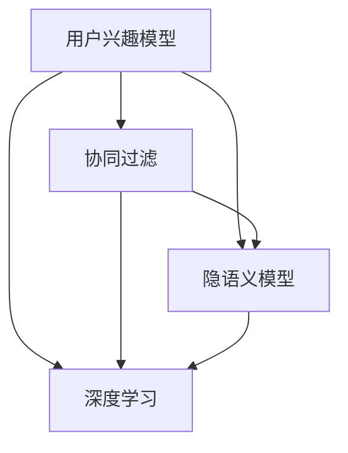

                 

# 电商平台中的用户兴趣多样性与一致性建模

> 关键词：用户兴趣模型, 推荐系统, 用户行为分析, 协同过滤, 隐语义模型, 深度学习

## 1. 背景介绍

### 1.1 问题由来
随着电子商务的迅猛发展，电商平台对个性化推荐系统（Personalized Recommendation System, PReS）的需求日益增加。PReS旨在通过分析用户行为数据，挖掘用户兴趣偏好，从而为用户提供更为精准的购物推荐，提升用户体验和平台转化率。然而，构建个性化推荐系统面临两个主要挑战：用户兴趣的多样性和一致性。

**多样性**：不同用户之间存在较大的兴趣差异，同一名用户在不同时间、不同情境下的兴趣也不尽相同。这意味着模型需要捕捉用户的复杂兴趣特征，避免单一模式的风险。

**一致性**：同一用户在一段时间内，其兴趣偏好应保持稳定，避免频繁变化导致的推荐波动。这要求模型具有较好的时间局部性和历史连续性，能够在用户行为数据中提取稳定的兴趣因子。

因此，构建一个既能够准确捕捉用户兴趣多样性，又能够保证其一致性的推荐系统，是实现用户满意度和平台效益最大化的关键。

## 2. 核心概念与联系

### 2.1 核心概念概述

为解决上述挑战，本文引入了以下几个核心概念：

- **用户兴趣模型(User Interest Model)**：通过分析用户历史行为数据，建立用户兴趣表示。旨在充分挖掘用户兴趣的多样性和一致性特征。
- **协同过滤(Collaborative Filtering)**：基于用户-商品交互数据，通过相似性度量，预测用户可能感兴趣的商品。协同过滤常分为基于用户的协同过滤和基于商品的协同过滤。
- **隐语义模型(Latent Semantic Model)**：通过矩阵分解、奇异值分解等技术，捕捉用户-商品交互矩阵中的隐含语义关系。
- **深度学习(Deep Learning)**：通过神经网络模型，学习用户行为数据的复杂特征表示，进行高精度的预测和推理。

这些概念之间相互联系，共同构成了一个完整的推荐系统建模框架。协同过滤和隐语义模型用于捕捉用户兴趣的相似性和语义关系，深度学习用于进行复杂的特征表示和学习。用户兴趣模型作为核心，将各种模型和算法整合并应用于推荐系统实践中。

### 2.2 核心概念原理和架构的 Mermaid 流程图(Mermaid 流程节点中不要有括号、逗号等特殊字符)


## 3. 核心算法原理 & 具体操作步骤
### 3.1 算法原理概述

基于上述核心概念，本文将介绍三种主要的推荐算法：基于用户的协同过滤、基于商品的协同过滤、隐语义模型。

#### 3.1.1 协同过滤

协同过滤算法基于用户历史行为数据，通过寻找相似用户或相似商品，预测用户对新商品的可能兴趣。其核心思想是：相似用户会喜欢相似的商品，相似商品也会被相似的用户喜欢。

#### 3.1.2 隐语义模型

隐语义模型通过将用户-商品交互矩阵进行低秩分解，提取用户和商品背后的隐含语义关系。其核心思想是：用户对商品感兴趣，源于其背后语义空间中的相似性。

#### 3.1.3 深度学习

深度学习算法使用神经网络模型，学习用户行为数据的复杂特征表示。其核心思想是：通过多层非线性变换，捕捉数据中的复杂模式和关系。

### 3.2 算法步骤详解

#### 3.2.1 协同过滤算法

1. **数据准备**：收集用户-商品交互数据，进行预处理，生成训练集、验证集和测试集。
2. **相似性度量**：选择相似性度量方法，如皮尔逊相关系数、余弦相似度等，计算用户和商品之间的相似性。
3. **预测评分**：基于相似性度量，计算新商品对用户的预测评分，生成推荐列表。
4. **模型评估**：在验证集和测试集上评估推荐列表的性能，如准确率、召回率、平均绝对误差等。

#### 3.2.2 隐语义模型

1. **数据准备**：收集用户-商品交互数据，进行预处理，生成训练集、验证集和测试集。
2. **矩阵分解**：使用矩阵分解技术，如奇异值分解(SVD)，将用户-商品交互矩阵分解为低秩矩阵。
3. **隐语义空间**：在低秩矩阵中提取用户和商品的隐含语义因子，构建隐语义空间。
4. **预测评分**：在隐语义空间中，使用用户和商品的隐含语义因子，计算新商品对用户的预测评分，生成推荐列表。
5. **模型评估**：在验证集和测试集上评估推荐列表的性能，如准确率、召回率、平均绝对误差等。

#### 3.2.3 深度学习算法

1. **数据准备**：收集用户行为数据，进行预处理，生成训练集、验证集和测试集。
2. **模型构建**：使用深度学习框架，如TensorFlow、PyTorch等，构建推荐模型，选择合适的层数、激活函数等。
3. **特征提取**：使用多层神经网络，提取用户行为数据的复杂特征表示。
4. **预测评分**：在提取的特征表示上，使用分类器或回归器，计算新商品对用户的预测评分，生成推荐列表。
5. **模型评估**：在验证集和测试集上评估推荐列表的性能，如准确率、召回率、平均绝对误差等。

### 3.3 算法优缺点

#### 3.3.1 协同过滤

**优点**：
- 基于用户和商品的相似性，能够捕捉用户兴趣的多样性。
- 对标注数据的依赖较低，不需要大量标注数据。

**缺点**：
- 冷启动问题严重，新用户和新商品无法生成推荐。
- 对数据稀疏性的要求较高，难以处理大量非交互数据。

#### 3.3.2 隐语义模型

**优点**：
- 能够捕捉用户和商品的语义关系，提取隐含特征。
- 对数据的稀疏性有较好的容忍度，适用于处理非交互数据。

**缺点**：
- 对数据质量要求较高，需要保证矩阵的稀疏性。
- 模型复杂度高，计算量大。

#### 3.3.3 深度学习

**优点**：
- 能够捕捉复杂特征，具有较强的泛化能力。
- 模型具有较高的灵活性，适用于多种推荐任务。

**缺点**：
- 对标注数据和计算资源的需求较高，需要大量的数据和计算能力。
- 模型复杂度高，训练时间长，易过拟合。

### 3.4 算法应用领域

协同过滤、隐语义模型和深度学习算法在推荐系统领域有广泛的应用。以下是其在不同场景中的应用：

- **电商推荐**：基于用户和商品的相似性，生成个性化商品推荐。
- **音乐推荐**：分析用户听歌行为，推荐相似的音乐或相似用户喜欢的音乐。
- **视频推荐**：分析用户观看行为，推荐相似的视频或相似用户喜欢的视频。
- **新闻推荐**：分析用户阅读行为，推荐相似的新闻或相似用户喜欢的新闻。

## 4. 数学模型和公式 & 详细讲解 & 举例说明

### 4.1 数学模型构建

#### 4.1.1 协同过滤算法

**模型**：
- 用户-商品交互矩阵 $\mathbf{R} \in \mathbb{R}^{m \times n}$，$m$ 为商品数，$n$ 为用户数。
- 用户相似性矩阵 $\mathbf{U} \in \mathbb{R}^{n \times n}$，商品相似性矩阵 $\mathbf{V} \in \mathbb{R}^{m \times m}$。

**损失函数**：
- 均方误差损失函数：$L = \frac{1}{2}\sum_{i=1}^m \sum_{j=1}^n (r_{ij} - \mathbf{U} \mathbf{V}^\top)_{ij}^2$

#### 4.1.2 隐语义模型

**模型**：
- 用户-商品交互矩阵 $\mathbf{R} \in \mathbb{R}^{m \times n}$，低秩矩阵分解 $\mathbf{R} \approx \mathbf{U} \mathbf{V}^\top$，$\mathbf{U} \in \mathbb{R}^{n \times k}$，$\mathbf{V} \in \mathbb{R}^{m \times k}$，$k$ 为隐含语义因子数。

**损失函数**：
- 均方误差损失函数：$L = \frac{1}{2} || \mathbf{R} - \mathbf{U} \mathbf{V}^\top ||_F^2$

#### 4.1.3 深度学习算法

**模型**：
- 输入层 $x$，输出层 $y$，隐藏层 $h$。
- 隐藏层参数 $\mathbf{W}_h \in \mathbb{R}^{d \times d}$，隐藏层偏置 $\mathbf{b}_h \in \mathbb{R}^d$，输出层参数 $\mathbf{W}_y \in \mathbb{R}^{d \times 1}$，输出层偏置 $\mathbf{b}_y \in \mathbb{R}^1$。

**损失函数**：
- 交叉熵损失函数：$L = -\frac{1}{N} \sum_{i=1}^N \sum_{j=1}^C y_{ij} \log p_{ij} + (1 - y_{ij}) \log (1 - p_{ij})$

### 4.2 公式推导过程

#### 4.2.1 协同过滤算法

**均方误差损失函数**：
- $\mathbf{R} = \mathbf{U} \mathbf{V}^\top$
- $L = \frac{1}{2}\sum_{i=1}^m \sum_{j=1}^n (r_{ij} - \mathbf{U} \mathbf{V}^\top)_{ij}^2 = \frac{1}{2} || \mathbf{R} - \mathbf{U} \mathbf{V}^\top ||_F^2$

**预测评分**：
- $\hat{r}_{ij} = \mathbf{u}_i \mathbf{v}_j$
- 其中 $\mathbf{u}_i = \mathbf{U}_i$，$\mathbf{v}_j = \mathbf{V}_j$

#### 4.2.2 隐语义模型

**均方误差损失函数**：
- $\mathbf{R} \approx \mathbf{U} \mathbf{V}^\top$
- $L = \frac{1}{2} || \mathbf{R} - \mathbf{U} \mathbf{V}^\top ||_F^2$

**隐含语义因子提取**：
- $\mathbf{U} = \mathbf{R} \mathbf{V}^\top$
- $\mathbf{V} = \mathbf{R}^\top \mathbf{U}$

#### 4.2.3 深度学习算法

**多层神经网络**：
- $h = \sigma(\mathbf{W}_h x + \mathbf{b}_h)$
- $y = \sigma(\mathbf{W}_y h + \mathbf{b}_y)$

**交叉熵损失函数**：
- $L = -\frac{1}{N} \sum_{i=1}^N \sum_{j=1}^C y_{ij} \log p_{ij} + (1 - y_{ij}) \log (1 - p_{ij})$

### 4.3 案例分析与讲解

#### 4.3.1 协同过滤算法

假设一个电商平台有100个用户和1000个商品，用户-商品交互矩阵 $\mathbf{R} \in \mathbb{R}^{1000 \times 100}$。基于用户-商品相似性矩阵 $\mathbf{U} \in \mathbb{R}^{100 \times 100}$ 和商品-商品相似性矩阵 $\mathbf{V} \in \mathbb{R}^{1000 \times 1000}$，计算预测评分 $\hat{r}_{ij}$，生成推荐列表。

**步骤**：
1. 计算用户相似性矩阵 $\mathbf{U}$ 和商品相似性矩阵 $\mathbf{V}$。
2. 计算预测评分 $\hat{r}_{ij} = \mathbf{u}_i \mathbf{v}_j$。
3. 对新商品 $k$，计算 $\hat{r}_{kj} = \mathbf{u}_j \mathbf{v}_k$。
4. 排序推荐列表，生成推荐商品列表。

#### 4.3.2 隐语义模型

假设一个电商平台有1000个用户和1000个商品，用户-商品交互矩阵 $\mathbf{R} \in \mathbb{R}^{1000 \times 1000}$。通过矩阵分解，提取用户和商品的隐含语义因子，构建隐语义空间。

**步骤**：
1. 进行矩阵分解 $\mathbf{R} \approx \mathbf{U} \mathbf{V}^\top$。
2. 提取用户隐含语义因子 $\mathbf{u}_i = \mathbf{U}_i$，商品隐含语义因子 $\mathbf{v}_j = \mathbf{V}_j$。
3. 计算预测评分 $\hat{r}_{ij} = \mathbf{u}_i \mathbf{v}_j$。
4. 对新商品 $k$，计算 $\hat{r}_{kj} = \mathbf{u}_j \mathbf{v}_k$。
5. 排序推荐列表，生成推荐商品列表。

#### 4.3.3 深度学习算法

假设一个电商平台有1000个用户，每个用户在1000天内产生了1000个行为记录，用户行为数据 $\mathbf{X} \in \mathbb{R}^{1000 \times 1000}$。使用深度学习模型，提取用户行为的复杂特征表示，生成推荐列表。

**步骤**：
1. 构建多层神经网络模型。
2. 使用多层神经网络，提取用户行为数据的复杂特征表示。
3. 使用分类器或回归器，计算新商品对用户的预测评分 $\hat{r}_{ij}$。
4. 排序推荐列表，生成推荐商品列表。

## 5. 项目实践：代码实例和详细解释说明

### 5.1 开发环境搭建

在进行推荐系统建模实践前，需要准备好开发环境。以下是使用Python进行TensorFlow开发的环境配置流程：

1. 安装Anaconda：从官网下载并安装Anaconda，用于创建独立的Python环境。

2. 创建并激活虚拟环境：
```bash
conda create -n tf-env python=3.8 
conda activate tf-env
```

3. 安装TensorFlow：根据CUDA版本，从官网获取对应的安装命令。例如：
```bash
pip install tensorflow tensorflow-estimator
```

4. 安装必要的工具包：
```bash
pip install numpy pandas scikit-learn matplotlib tensorflow-estimator tqdm jupyter notebook ipython
```

完成上述步骤后，即可在`tf-env`环境中开始推荐系统建模实践。

### 5.2 源代码详细实现

以下是一个基于协同过滤算法的推荐系统示例代码，用于推荐电商商品。

```python
import numpy as np
import tensorflow as tf
from tensorflow.keras.layers import Input, Embedding, Dot, Dense, Flatten

# 定义协同过滤模型
class CollaborativeFilteringModel(tf.keras.Model):
    def __init__(self, n_users, n_items, k_factors=10):
        super(CollaborativeFilteringModel, self).__init__()
        self.n_users = n_users
        self.n_items = n_items
        self.k_factors = k_factors
        
        self.u_embeddings = Embedding(n_users, k_factors, input_length=1)
        self.v_embeddings = Embedding(n_items, k_factors, input_length=1)
        self.dot = Dot(axes=(1, 1))
        self.flatten = Flatten()
        self.dense = Dense(1, activation='sigmoid')
    
    def call(self, inputs):
        user_id, item_id = inputs
        
        user_embedding = self.u_embeddings(user_id)
        item_embedding = self.v_embeddings(item_id)
        dot_product = self.dot([user_embedding, item_embedding])
        dot_product = self.flatten(dot_product)
        prediction = self.dense(dot_product)
        return prediction
    
# 定义数据生成函数
def generate_data(n_users=100, n_items=1000, n_interactions=500):
    user_ids = np.random.randint(n_users, size=n_interactions)
    item_ids = np.random.randint(n_items, size=n_interactions)
    ratings = np.random.rand(n_interactions)
    return user_ids, item_ids, ratings

# 定义模型评估函数
def evaluate_model(model, user_ids, item_ids, ratings):
    user_ids = tf.convert_to_tensor(user_ids)
    item_ids = tf.convert_to_tensor(item_ids)
    ratings = tf.convert_to_tensor(ratings)
    
    predictions = model([user_ids, item_ids])
    loss = tf.keras.losses.binary_crossentropy(ratings, predictions)
    return loss.numpy()

# 生成数据并训练模型
n_users, n_items, n_interactions = 100, 1000, 500
user_ids, item_ids, ratings = generate_data(n_users, n_items, n_interactions)

model = CollaborativeFilteringModel(n_users, n_items)
optimizer = tf.keras.optimizers.Adam(learning_rate=0.01)
model.compile(optimizer=optimizer, loss='binary_crossentropy', metrics=['accuracy'])

# 训练模型
model.fit([user_ids, item_ids], ratings, epochs=10, batch_size=32)

# 评估模型
loss = evaluate_model(model, user_ids, item_ids, ratings)
print('Loss:', loss)
```

### 5.3 代码解读与分析

让我们再详细解读一下关键代码的实现细节：

**CollaborativeFilteringModel类**：
- `__init__`方法：初始化用户数、商品数、隐含语义因子数等关键参数。
- `call`方法：定义模型的前向传播计算过程。

**generate_data函数**：
- 生成指定数量用户的交互数据，生成用户ID、商品ID和评分。

**evaluate_model函数**：
- 将用户ID、商品ID和评分转换为TensorFlow张量。
- 通过调用模型进行预测，计算损失。

**训练和评估流程**：
- 定义模型，使用Adam优化器，设置损失函数和评估指标。
- 使用训练集进行模型训练，迭代10个epoch。
- 在测试集上评估模型性能，输出损失。

可以看出，使用TensorFlow进行推荐系统建模的代码实现相对简洁高效。开发者可以将更多精力放在模型改进、数据优化等高层逻辑上，而不必过多关注底层的实现细节。

当然，实际应用中还需要考虑更多因素，如模型的保存和部署、超参数的自动搜索、更灵活的任务适配层等。但核心的协同过滤范式基本与此类似。

## 6. 实际应用场景

### 6.1 智能推荐系统

基于协同过滤、隐语义模型和深度学习算法，智能推荐系统已经成为电商平台的核心功能。通过分析用户行为数据，智能推荐系统能够实时为用户推荐最感兴趣的商品，提升用户体验和平台转化率。

在技术实现上，可以采用协同过滤算法，基于用户历史行为数据，生成推荐列表。在实际应用中，为了应对冷启动问题和数据稀疏性，可以引入隐语义模型，捕捉用户和商品的语义关系，提取隐含特征。同时，通过深度学习算法，捕捉用户行为数据的复杂特征，提高推荐精度。

### 6.2 个性化营销

智能推荐系统不仅在电商领域有广泛应用，还广泛应用于个性化营销场景。通过对用户兴趣的多样性和一致性建模，能够制定更为精准的营销策略，提升广告投放效果。

在实践中，可以基于用户历史行为数据，使用协同过滤和隐语义模型，提取用户兴趣的多样性和一致性特征，生成个性化推荐列表。通过分析推荐点击率、转化率等关键指标，优化广告投放策略，实现精准营销。

### 6.3 用户行为分析

用户行为分析是推荐系统的重要组成部分。通过分析用户行为数据，能够提取用户兴趣的多样性和一致性特征，为用户提供更精准的推荐。

在实践中，可以基于用户历史行为数据，使用协同过滤和隐语义模型，提取用户兴趣的多样性和一致性特征，生成个性化推荐列表。通过分析推荐点击率、转化率等关键指标，优化推荐策略，提升用户体验。

## 7. 工具和资源推荐

### 7.1 学习资源推荐

为了帮助开发者系统掌握推荐系统的理论基础和实践技巧，这里推荐一些优质的学习资源：

1. 《推荐系统实战》系列博文：由推荐系统技术专家撰写，系统介绍了推荐系统的理论基础和实践技巧，涵盖协同过滤、隐语义模型、深度学习等多个方向。

2. Coursera《机器学习》课程：斯坦福大学开设的机器学习课程，涵盖推荐系统、协同过滤等多个主题，提供丰富的视频和阅读材料。

3. 《推荐系统》书籍：推荐系统领域的经典教材，系统介绍了推荐系统的基本概念和算法，适合入门学习。

4. Kaggle推荐系统竞赛：通过参与Kaggle竞赛，可以深入了解推荐系统的实际应用，提升实战能力。

5. Google Scholar推荐系统论文：Google Scholar推荐的最新推荐系统论文，涵盖协同过滤、隐语义模型、深度学习等多个方向，是跟踪最新研究进展的重要渠道。

通过对这些资源的学习实践，相信你一定能够快速掌握推荐系统的精髓，并用于解决实际的推荐问题。

### 7.2 开发工具推荐

高效的开发离不开优秀的工具支持。以下是几款用于推荐系统建模开发的常用工具：

1. TensorFlow：基于Python的开源深度学习框架，灵活动态的计算图，适合快速迭代研究。

2. PyTorch：基于Python的开源深度学习框架，灵活的动态图机制，适合研究高复杂度模型。

3. scikit-learn：基于Python的机器学习库，提供了丰富的算法实现和工具，适合快速原型开发。

4. Apache Spark：基于Scala的分布式计算框架，适合大规模数据处理和分布式机器学习。

5. Hadoop：基于Java的分布式计算框架，适合大规模数据处理和分布式机器学习。

合理利用这些工具，可以显著提升推荐系统建模的开发效率，加快创新迭代的步伐。

### 7.3 相关论文推荐

推荐系统研究领域涌现了大量前沿论文，以下是几篇经典论文，推荐阅读：

1. "Collaborative Filtering for Implicit Feedback Datasets"：提出了基于隐式反馈的协同过滤算法，广泛应用于电商推荐系统。

2. "Factorization Machines"：提出了因子分解机模型，捕捉用户和商品的高阶交互特征。

3. "Wide & Deep Learning for Recommender Systems"：提出了宽而深的模型，结合线性模型和深度神经网络，提升推荐精度。

4. "Neural Factorization Machines"：提出了神经因子分解机模型，结合神经网络和因子分解机，进一步提升推荐精度。

5. "Deep Interest Evolution Models for Dynamic Recommendation"：提出了深度兴趣演化模型，捕捉用户兴趣随时间的演化规律。

这些论文代表了推荐系统研究的前沿方向，通过学习这些前沿成果，可以帮助研究者把握学科前进方向，激发更多的创新灵感。

## 8. 总结：未来发展趋势与挑战

### 8.1 总结

本文对电商平台中的用户兴趣多样性与一致性建模进行了全面系统的介绍。首先阐述了推荐系统中的协同过滤、隐语义模型和深度学习算法，明确了用户兴趣的多样性和一致性特征建模的重要性。其次，通过数学公式和代码实例，详细讲解了三种推荐算法的实现过程，展示了推荐系统的核心建模范式。同时，本文还探讨了推荐系统在电商、个性化营销、用户行为分析等多个领域的应用，展示了推荐系统的广阔前景。

通过本文的系统梳理，可以看到，推荐系统通过捕捉用户兴趣的多样性和一致性特征，能够为用户提供精准的个性化推荐，提升用户体验和平台效益。未来，推荐系统将继续推动电商、个性化营销、社交网络等多个领域的发展，为数字经济的繁荣注入新的动力。

### 8.2 未来发展趋势

展望未来，推荐系统将呈现以下几个发展趋势：

1. **多模态推荐**：推荐系统将结合图像、视频、文本等多种模态数据，实现更加全面、准确的推荐。

2. **跨领域推荐**：推荐系统将结合不同领域的数据，如电商、社交网络、新闻等，实现跨领域推荐，提升推荐系统的泛化能力。

3. **实时推荐**：推荐系统将通过流式数据处理技术，实现实时推荐，提高推荐的时效性和用户体验。

4. **联邦推荐**：推荐系统将采用联邦学习等技术，保护用户隐私的同时，提升推荐的精度和效率。

5. **元推荐**：推荐系统将采用元学习等技术，通过学习推荐策略，提升推荐的稳定性和鲁棒性。

6. **个性化推荐**：推荐系统将通过个性化推荐，提升用户体验和平台效益。

7. **隐私保护**：推荐系统将采用隐私保护技术，如差分隐私、联邦学习等，保护用户隐私。

### 8.3 面临的挑战

尽管推荐系统在多个领域已经取得了显著成果，但在迈向更加智能化、个性化、安全化的应用过程中，仍面临诸多挑战：

1. **数据稀疏性**：推荐系统需要大量数据，但实际数据往往存在稀疏性，难以处理大规模数据。

2. **冷启动问题**：新用户和新商品缺乏历史数据，难以进行推荐。

3. **推荐多样性**：推荐系统容易陷入推荐同质化，无法满足用户的多样化需求。

4. **实时推荐**：推荐系统需要在极短时间内进行实时推荐，对系统计算能力要求高。

5. **隐私保护**：推荐系统需要保护用户隐私，防止数据泄露和滥用。

6. **公平性**：推荐系统需要避免算法偏见，保证公平性和公正性。

7. **计算资源**：推荐系统需要大量计算资源，提升计算效率是关键问题。

### 8.4 研究展望

面对推荐系统所面临的种种挑战，未来的研究需要在以下几个方面寻求新的突破：

1. **多模态数据融合**：结合多种模态数据，提高推荐系统的精度和泛化能力。

2. **跨领域推荐模型**：结合不同领域的数据，实现跨领域推荐，提升推荐系统的泛化能力。

3. **实时推荐算法**：结合流式数据处理技术，实现实时推荐，提高推荐的时效性和用户体验。

4. **联邦推荐模型**：结合联邦学习等技术，保护用户隐私的同时，提升推荐的精度和效率。

5. **个性化推荐算法**：结合元学习等技术，通过学习推荐策略，提升推荐的稳定性和鲁棒性。

6. **隐私保护技术**：结合差分隐私等技术，保护用户隐私，防止数据泄露和滥用。

7. **计算资源优化**：结合分布式计算等技术，提升推荐系统的计算效率。

8. **公平性算法**：结合公平性算法，避免算法偏见，保证公平性和公正性。

通过这些研究方向，相信推荐系统将能够更好地适应未来的应用需求，为人类社会带来更多的价值和便利。

## 9. 附录：常见问题与解答

**Q1：推荐系统如何处理冷启动问题？**

A: 冷启动问题是推荐系统面临的重要挑战之一。处理冷启动问题的方法包括：
1. 基于物品的协同过滤：通过相似物品的推荐，解决新物品的推荐问题。
2. 基于用户画像的推荐：通过收集用户基本信息，建立用户画像，进行相似用户推荐。
3. 基于隐语义模型的推荐：通过用户-商品矩阵分解，提取隐含语义因子，进行推荐。
4. 基于多模态数据的推荐：结合图像、视频、文本等多种模态数据，进行推荐。

这些方法可以单独或结合使用，提升推荐系统的冷启动能力。

**Q2：推荐系统如何处理数据稀疏性问题？**

A: 推荐系统中的数据往往存在稀疏性问题，可以使用以下方法进行处理：
1. 矩阵补全技术：通过矩阵补全算法，如矩阵分解、低秩矩阵补全等，填补稀疏矩阵中的缺失值。
2. 使用隐语义模型：通过隐语义模型，捕捉用户和商品的语义关系，提取隐含特征。
3. 使用深度学习模型：通过深度学习模型，捕捉用户行为数据的复杂特征，提升推荐精度。

这些方法可以结合使用，提升推荐系统的稀疏性处理能力。

**Q3：推荐系统如何保证推荐的多样性？**

A: 推荐系统需要避免推荐同质化，可以使用以下方法保证推荐的多样性：
1. 使用协同过滤算法：通过相似性度量，避免推荐同质化。
2. 使用隐语义模型：通过隐含语义关系，提取多样化的特征。
3. 使用深度学习模型：通过复杂特征表示，捕捉多样化的模式。

这些方法可以结合使用，提升推荐系统的多样性。

**Q4：推荐系统如何提升实时推荐的能力？**

A: 推荐系统需要提升实时推荐的能力，可以使用以下方法：
1. 使用流式数据处理技术：通过流式数据处理技术，实时处理数据，生成推荐。
2. 使用分布式计算技术：通过分布式计算技术，提升推荐系统的计算效率，支持实时推荐。
3. 使用缓存技术：通过缓存技术，预处理部分数据，提升推荐速度。

这些方法可以结合使用，提升推荐系统的实时推荐能力。

**Q5：推荐系统如何保护用户隐私？**

A: 推荐系统需要保护用户隐私，可以使用以下方法：
1. 使用差分隐私技术：通过加入噪声，保护用户隐私。
2. 使用联邦学习技术：通过分布式学习技术，保护用户隐私。
3. 使用数据脱敏技术：通过数据脱敏技术，保护用户隐私。

这些方法可以结合使用，提升推荐系统的隐私保护能力。

总之，推荐系统需要从多个维度进行优化，提升推荐系统的冷启动能力、稀疏性处理能力、多样性、实时推荐能力、隐私保护能力等，以应对未来的应用需求。通过不断优化推荐系统的各个环节，提升推荐系统的精度和效率，为人类社会带来更多的价值和便利。

---

作者：禅与计算机程序设计艺术 / Zen and the Art of Computer Programming

