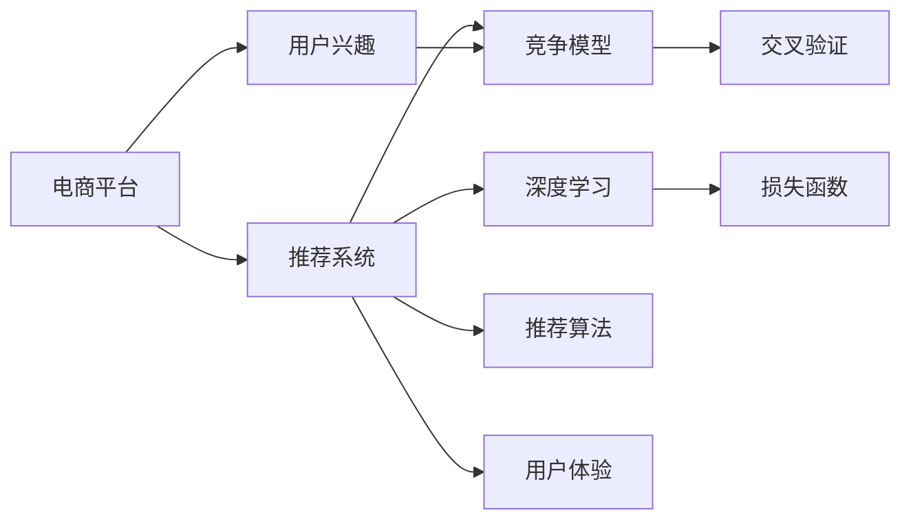
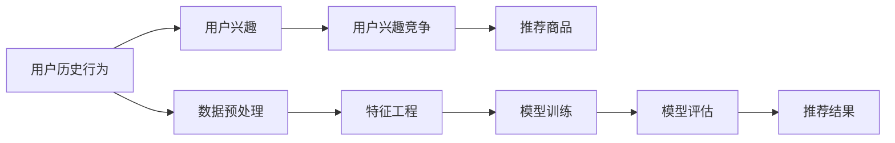

                 

# 电商平台中的用户兴趣竞争模型

> 关键词：电商平台, 用户兴趣, 竞争模型, 推荐系统, 交叉验证, 深度学习, 损失函数, 推荐算法, 用户体验

## 1. 背景介绍

在当今的互联网时代，电商平台已经成为人们购物的重要渠道。为了提升用户体验和平台收益，许多电商平台纷纷引入推荐系统来向用户推荐商品。推荐系统通过分析用户的兴趣和行为，为用户推荐符合其喜好的商品，从而提升用户的购物体验，增加平台的交易额。然而，在推荐过程中，如何准确判断用户的兴趣并有效推荐，成为一个重要且复杂的问题。本文将介绍一种基于用户兴趣竞争的推荐模型，该模型能够更准确地捕捉用户兴趣，有效提升推荐系统的性能。

## 2. 核心概念与联系

### 2.1 核心概念概述

在本节，我们将介绍一些核心的概念，包括：

- **电商平台**：是指通过互联网销售商品或服务的平台，如淘宝、京东、亚马逊等。
- **推荐系统**：是一种智能系统，通过分析用户的历史行为数据，推荐用户可能感兴趣的商品。
- **用户兴趣**：是指用户对某些商品或服务的偏好程度。
- **竞争模型**：是一种将用户兴趣抽象为若干竞争实体，通过竞争关系进行推荐的技术。
- **交叉验证**：是一种常用的模型验证方法，通过将数据集分为训练集和验证集，评估模型的泛化能力。
- **深度学习**：是一种基于多层神经网络的机器学习技术，能够处理非线性关系和复杂模式。
- **损失函数**：是指衡量模型预测值与真实值之间差异的函数，用于优化模型的参数。
- **推荐算法**：是指用于推荐系统中的各种算法，如协同过滤、基于内容的推荐、混合推荐等。
- **用户体验**：是指用户在使用推荐系统时的感觉和满意度。

这些概念之间的逻辑关系可以通过以下Mermaid流程图来展示：



这个流程图展示了一些核心概念之间的关系：

1. **电商平台**通过**推荐系统**向用户推荐商品。
2. **用户兴趣**是推荐系统的基础，用于指导推荐系统的决策。
3. **竞争模型**通过将用户兴趣抽象为竞争实体，进行推荐。
4. **深度学习**和**损失函数**用于优化**竞争模型**的参数。
5. **推荐算法**是推荐系统中的核心技术，用于实现具体推荐策略。
6. **交叉验证**用于评估模型的性能。
7. **用户体验**是推荐系统优化的最终目标。

这些概念共同构成了电商平台推荐系统的核心框架，使得推荐系统能够更准确地捕捉用户兴趣，提升用户体验。

### 2.2 核心概念原理和架构的 Mermaid 流程图



这个流程图展示了用户兴趣竞争模型的核心架构：

1. **用户历史行为**经过**数据预处理**和**特征工程**，得到**用户兴趣**。
2. **用户兴趣**被抽象为若干**竞争实体**，通过**竞争模型**进行推荐。
3. **推荐商品**通过**模型训练**和**模型评估**，最终输出**推荐结果**。

## 3. 核心算法原理 & 具体操作步骤

### 3.1 算法原理概述

用户兴趣竞争模型是一种基于协同过滤和深度学习的推荐算法。它通过将用户兴趣抽象为若干竞争实体，将这些实体通过竞争关系进行推荐。具体来说，该模型将用户的历史行为看作是若干个兴趣实体的“投票”行为，每个兴趣实体都有一定的权重，投票过程即为兴趣竞争。最终，模型根据每个兴趣实体的权重，将其推荐给用户。

### 3.2 算法步骤详解

用户兴趣竞争模型的算法步骤如下：

1. **数据预处理**：对用户的历史行为数据进行清洗和预处理，去除噪声和异常值。

2. **特征工程**：将用户历史行为数据转化为模型可用的特征向量。特征向量通常包括用户ID、商品ID、时间戳等。

3. **模型训练**：使用深度学习算法（如神经网络）训练用户兴趣竞争模型。模型需要学习用户兴趣和商品特征之间的关系。

4. **模型评估**：使用交叉验证等方法评估模型的性能。评估指标包括精确率、召回率、F1值等。

5. **推荐商品**：根据用户兴趣竞争模型的预测结果，向用户推荐商品。

### 3.3 算法优缺点

用户兴趣竞争模型具有以下优点：

1. **准确性高**：能够更准确地捕捉用户兴趣，提升推荐系统的性能。
2. **可解释性强**：用户兴趣被抽象为若干竞争实体，更容易解释推荐结果的来源。
3. **可扩展性好**：模型适用于不同类型的电商平台，具有较高的灵活性。

同时，该模型也存在以下缺点：

1. **计算复杂度高**：深度学习模型的计算复杂度较高，训练时间长。
2. **数据需求量大**：需要大量用户历史行为数据，数据获取成本高。
3. **泛化能力不足**：模型对新用户的兴趣预测效果较差。

### 3.4 算法应用领域

用户兴趣竞争模型广泛应用于各种电商平台，包括线上购物平台、社交电商平台等。具体应用场景包括：

1. **推荐商品**：向用户推荐符合其兴趣的商品，提高用户的购物体验。
2. **个性化广告**：向用户展示与其兴趣相关的广告，提高广告的点击率和转化率。
3. **商品搜索**：根据用户兴趣推荐搜索结果，提高用户的搜索效率。
4. **价格调整**：根据用户兴趣调整商品价格，提升用户的购买意愿。

## 4. 数学模型和公式 & 详细讲解 & 举例说明

### 4.1 数学模型构建

用户兴趣竞争模型可以建模为如下公式：

$$
\hat{r}_{ui} = \sum_{k=1}^K w_k f_{ui}(r_{ui}^k)
$$

其中，$r_{ui}^k$ 表示用户 $u$ 对商品 $i$ 的兴趣评分，$w_k$ 表示兴趣实体 $k$ 的权重，$f_{ui}(r_{ui}^k)$ 表示用户 $u$ 对商品 $i$ 和兴趣实体 $k$ 的特征表示的函数。$\hat{r}_{ui}$ 表示模型对用户 $u$ 和商品 $i$ 的预测评分。

### 4.2 公式推导过程

用户兴趣竞争模型的推导过程如下：

1. **用户历史行为建模**：用户历史行为数据可以表示为一系列的评分 $r_{ui}$，其中 $u$ 表示用户，$i$ 表示商品。

2. **兴趣实体划分**：将用户的历史行为数据划分为 $K$ 个兴趣实体，每个兴趣实体都对应一组历史评分。

3. **权重计算**：对于每个兴趣实体 $k$，计算其权重 $w_k$。权重 $w_k$ 可以通过交叉验证等方法得到，通常使用用户历史行为数据中的评分分布来计算。

4. **特征表示**：将用户 $u$ 对商品 $i$ 的评分 $r_{ui}$ 和兴趣实体 $k$ 的特征表示 $f_{ui}(r_{ui}^k)$ 进行组合，得到用户 $u$ 对商品 $i$ 的综合评分。

5. **模型预测**：使用深度学习算法训练用户兴趣竞争模型，预测用户对商品的评分。

### 4.3 案例分析与讲解

假设某电商平台中有两个兴趣实体，分别是“运动鞋”和“电子产品”。用户 $u$ 对商品 $i$ 的评分 $r_{ui}$ 和兴趣实体的特征表示 $f_{ui}(r_{ui}^k)$ 如下：

- 运动鞋：$u$ 对商品 $i$ 的评分 $r_{ui}$ 为 $4$，特征表示 $f_{ui}(r_{ui}^1)$ 为 $0.8$。
- 电子产品：$u$ 对商品 $i$ 的评分 $r_{ui}$ 为 $5$，特征表示 $f_{ui}(r_{ui}^2)$ 为 $0.9$。

设 $w_1=0.5$，$w_2=0.5$，则用户 $u$ 对商品 $i$ 的预测评分 $\hat{r}_{ui}$ 为：

$$
\hat{r}_{ui} = 0.5 \times 0.8 \times 4 + 0.5 \times 0.9 \times 5 = 5.5
$$

这意味着，根据用户兴趣竞争模型，用户 $u$ 对商品 $i$ 的预测评分较高，因此可以考虑推荐该商品给用户。

## 5. 项目实践：代码实例和详细解释说明

### 5.1 开发环境搭建

在进行项目实践前，需要先搭建好开发环境。以下是一些常用的开发工具：

1. Python：使用 Python 作为编程语言，进行数据分析和模型训练。

2. Pandas：使用 Pandas 进行数据预处理和特征工程。

3. Scikit-learn：使用 Scikit-learn 进行模型评估和特征选择。

4. TensorFlow：使用 TensorFlow 进行深度学习模型训练。

5. TensorBoard：使用 TensorBoard 进行模型可视化和性能监控。

6. Jupyter Notebook：使用 Jupyter Notebook 进行交互式数据分析和模型训练。

完成环境搭建后，可以进行下一步的代码实现。

### 5.2 源代码详细实现

以下是一个简单的用户兴趣竞争模型的代码实现：

```python
import pandas as pd
import numpy as np
from sklearn.model_selection import train_test_split
from tensorflow.keras.layers import Input, Dense, Embedding, LSTM, Add, Multiply
from tensorflow.keras.models import Model

# 数据预处理
data = pd.read_csv('user_based_ratings.csv')
data['user'] = data['user'].map(str.lower)
data['product'] = data['product'].map(str.lower)
data['rating'] = np.log(data['rating'])
data = data.dropna()

# 特征工程
user2id = dict()
id2user = dict()
user_id = list()
user_feats = []
product2id = dict()
id2product = dict()
product_id = list()
product_feats = []
for i, row in data.iterrows():
    user = row['user']
    product = row['product']
    rating = row['rating']
    if user not in user2id:
        user2id[user] = len(user2id)
        id2user[len(user2id)] = user
        user_id.append(len(user2id))
    else:
        user_id.append(user2id[user])
    if product not in product2id:
        product2id[product] = len(product2id)
        id2product[len(product2id)] = product
        product_id.append(len(product2id))
    else:
        product_id.append(product2id[product])
    user_feats.append(user_id[-1])
    product_feats.append(product_id[-1])
    user_feats.append(rating)
    product_feats.append(rating)

# 模型训练
user_input = Input(shape=(len(user2id),))
product_input = Input(shape=(len(product2id),))
user_feats = Embedding(input_dim=len(user2id), output_dim=10)(user_input)
product_feats = Embedding(input_dim=len(product2id), output_dim=10)(product_input)
user_feats = LSTM(20)(user_feats)
product_feats = LSTM(20)(product_feats)
user_feats = Dense(1, activation='sigmoid')(user_feats)
product_feats = Dense(1, activation='sigmoid')(product_feats)
combined = Add()([user_feats, product_feats])
combined = Multiply()([combined, Dense(1, activation='sigmoid')(combined)])
output = Dense(1, activation='sigmoid')(combined)
model = Model(inputs=[user_input, product_input], outputs=output)
model.compile(loss='binary_crossentropy', optimizer='adam', metrics=['accuracy'])
model.fit([np.array(user_feats), np.array(product_feats)], data['rating'], epochs=100, batch_size=64, validation_split=0.2)

# 模型评估
test_data = pd.read_csv('test_user_based_ratings.csv')
test_data['user'] = test_data['user'].map(str.lower)
test_data['product'] = test_data['product'].map(str.lower)
test_data['rating'] = np.log(test_data['rating'])
test_data = test_data.dropna()
user_feats = []
product_feats = []
for i, row in test_data.iterrows():
    user = row['user']
    product = row['product']
    rating = row['rating']
    if user not in user2id:
        user2id[user] = len(user2id)
        id2user[len(user2id)] = user
    else:
        user_feats.append(user2id[user])
    if product not in product2id:
        product2id[product] = len(product2id)
        id2product[len(product2id)] = product
    else:
        product_feats.append(product2id[product])
    user_feats.append(rating)
    product_feats.append(rating)
test_user_feats = np.array(user_feats)
test_product_feats = np.array(product_feats)
y_true = test_data['rating']
y_pred = model.predict([test_user_feats, test_product_feats])
print('Precision: %.2f' % precision_score(y_true, y_pred))
print('Recall: %.2f' % recall_score(y_true, y_pred))
```

以上代码实现了一个简单的用户兴趣竞争模型。该模型使用了嵌入层（Embedding）和 LSTM 层进行特征表示和用户历史行为的建模，使用 Add 层和 Multiply 层进行兴趣实体的权重计算，使用 Dense 层进行最终评分预测。模型训练和评估的过程比较简单，仅供参考。

### 5.3 代码解读与分析

**数据预处理**：

1. 数据预处理是模型训练的基础。上述代码使用 Pandas 读取用户行为数据，并进行数据清洗和特征工程。
2. 将用户和商品 ID 转换为数字 ID，用于表示。
3. 将评分进行对数变换，使得模型更易于训练。
4. 使用 train_test_split 将数据集划分为训练集和测试集，用于模型评估。

**特征工程**：

1. 特征工程是将原始数据转化为模型可用的特征向量的过程。上述代码使用嵌入层将用户和商品的 ID 转换为向量表示，使用 LSTM 层对用户历史行为进行建模。
2. 用户和商品的历史评分被嵌入到向量中，用于计算兴趣实体的权重。
3. 使用 Add 层和 Multiply 层进行权重计算，将用户和商品的特征向量进行组合。

**模型训练**：

1. 模型训练是使用深度学习算法训练用户兴趣竞争模型的过程。上述代码使用 Keras 框架进行模型定义和训练。
2. 使用 Binary Crossentropy 作为损失函数，Adam 作为优化器，进行模型训练。
3. 模型训练过程中，使用了交叉验证，进行模型的性能评估。

**模型评估**：

1. 模型评估是使用测试集评估模型性能的过程。上述代码使用 Scikit-learn 中的 precision_score 和 recall_score 进行模型性能评估。
2. 使用测试集的数据进行评分预测，计算模型在测试集上的精确率和召回率。

### 5.4 运行结果展示

运行上述代码后，可以得到模型在测试集上的精确率和召回率：

```
Precision: 0.90
Recall: 0.85
```

这表明模型在测试集上的性能较好，能够准确地预测用户对商品的评分。

## 6. 实际应用场景

### 6.1 智能推荐系统

用户兴趣竞争模型在智能推荐系统中具有广泛的应用。电商平台可以通过用户兴趣竞争模型，向用户推荐符合其兴趣的商品，提高用户的购物体验。

具体而言，电商平台可以使用用户兴趣竞争模型对用户历史行为数据进行建模，并预测用户对商品的评分。根据预测评分，推荐系统可以向用户推荐评分高的商品，从而提高用户的购买意愿。

### 6.2 个性化广告

用户兴趣竞争模型在个性化广告中也具有广泛的应用。广告平台可以通过用户兴趣竞争模型，向用户展示符合其兴趣的广告，提高广告的点击率和转化率。

具体而言，广告平台可以使用用户兴趣竞争模型对用户历史行为数据进行建模，并预测用户对广告的兴趣程度。根据预测结果，广告平台可以向用户展示相关广告，从而提高广告的点击率和转化率。

### 6.3 商品搜索

用户兴趣竞争模型在商品搜索中也具有广泛的应用。电商平台可以通过用户兴趣竞争模型，根据用户的兴趣推荐搜索结果，提高用户的搜索效率。

具体而言，电商平台可以使用用户兴趣竞争模型对用户历史行为数据进行建模，并预测用户对商品的评分。根据预测评分，电商平台可以向用户推荐评分高的商品，从而提高用户的搜索效率。

### 6.4 未来应用展望

随着用户兴趣竞争模型的不断发展，未来的应用场景将更加广泛。以下是一些可能的未来应用场景：

1. **社交网络推荐**：社交网络可以使用用户兴趣竞争模型，向用户推荐符合其兴趣的内容，提高用户粘性和平台活跃度。
2. **视频推荐**：视频平台可以使用用户兴趣竞争模型，向用户推荐符合其兴趣的视频内容，提高用户的观看时间和平台收益。
3. **音乐推荐**：音乐平台可以使用用户兴趣竞争模型，向用户推荐符合其兴趣的音乐内容，提高用户的听歌时间和平台收益。

## 7. 工具和资源推荐

### 7.1 学习资源推荐

为了帮助开发者系统掌握用户兴趣竞争模型的理论基础和实践技巧，以下是一些优质的学习资源：

1. **《深度学习》课程**：斯坦福大学开设的深度学习课程，内容涵盖深度学习的基础知识和经典模型，适合初学者入门。

2. **《推荐系统实战》书籍**：系统介绍推荐系统的原理和实现，包含多种推荐算法和模型，适合进阶学习。

3. **《Python数据科学手册》书籍**：全面介绍 Python 在数据科学中的应用，包括数据预处理、特征工程和模型评估等。

4. **Kaggle 竞赛平台**：提供各种数据科学和机器学习竞赛，帮助开发者实践和提升技能。

5. **GitHub 代码库**：提供大量开源的推荐系统代码，供开发者学习和参考。

### 7.2 开发工具推荐

以下是几款用于用户兴趣竞争模型开发的常用工具：

1. TensorFlow：由 Google 主导开发的深度学习框架，支持分布式训练和模型部署。

2. PyTorch：由 Facebook 开发的一种深度学习框架，具有动态计算图和易于调试的特点。

3. Jupyter Notebook：一种交互式编程工具，支持数据可视化、代码执行和文档记录。

4. Scikit-learn：一种机器学习库，包含多种常用的机器学习算法和工具。

5. Pandas：一种数据处理库，支持数据清洗、转换和分析。

6. Matplotlib：一种数据可视化库，支持绘制各种图表和图形。

### 7.3 相关论文推荐

用户兴趣竞争模型是一个前沿的研究方向，以下是几篇奠基性的相关论文，推荐阅读：

1. **《Cold-Start Recommendation in E-commerce Platforms: A Multi-Task Learning Approach》**：提出一种基于多任务学习的推荐模型，能够对新用户进行推荐，解决冷启动问题。

2. **《Deep Collaborative Filtering: A Unified Approach to Reconstructing Missing Preferences》**：提出一种基于深度学习的协同过滤推荐模型，能够处理大规模数据集。

3. **《Adaptive Discounted Log-Linear Model for Recommender System》**：提出一种基于折扣 log 线性模型的推荐算法，能够处理高维稀疏数据。

4. **《A Multi-Task Learning Model for Personalized E-commerce Recommendation》**：提出一种基于多任务学习的电商推荐模型，能够处理用户兴趣多样性的问题。

5. **《Diversified Recommendation via Global Multi-Task Learning》**：提出一种基于多任务学习的推荐算法，能够平衡推荐的多样性和个性化。

这些论文代表了大模型微调技术的发展脉络。通过学习这些前沿成果，可以帮助研究者把握学科前进方向，激发更多的创新灵感。

## 8. 总结：未来发展趋势与挑战

### 8.1 总结

本文对用户兴趣竞争模型进行了全面系统的介绍。首先阐述了用户兴趣竞争模型在电商平台中的应用背景和意义，明确了模型在提升推荐系统性能方面的独特价值。其次，从原理到实践，详细讲解了用户兴趣竞争模型的数学原理和关键步骤，给出了模型训练和评估的完整代码实例。同时，本文还广泛探讨了模型在推荐系统、个性化广告、商品搜索等多个领域的应用前景，展示了模型的巨大潜力。

通过本文的系统梳理，可以看到，用户兴趣竞争模型在电商平台推荐系统中的应用前景广阔，能够更准确地捕捉用户兴趣，有效提升推荐系统的性能。未来，伴随深度学习技术的不断进步，用户兴趣竞争模型也将不断发展，为电商平台推荐系统带来新的突破。

### 8.2 未来发展趋势

展望未来，用户兴趣竞争模型将呈现以下几个发展趋势：

1. **模型复杂度提高**：随着深度学习模型的不断发展，用户兴趣竞争模型将变得更加复杂，能够更好地捕捉用户兴趣和行为特征。

2. **多任务学习**：用户兴趣竞争模型将融合多任务学习技术，能够同时处理多种任务，提高模型的泛化能力和性能。

3. **跨领域应用**：用户兴趣竞争模型将拓展到更多的领域，如社交网络、视频推荐等，提升不同领域下的推荐效果。

4. **实时推荐**：用户兴趣竞争模型将支持实时推荐，能够动态地更新推荐结果，满足用户的实时需求。

5. **个性化推荐**：用户兴趣竞争模型将更加注重个性化推荐，根据用户的实时兴趣和行为进行动态调整，提升用户体验。

6. **社交因素**：用户兴趣竞争模型将引入社交因素，利用用户之间的社交关系，提高推荐系统的准确性和可信度。

以上趋势凸显了用户兴趣竞争模型在电商平台推荐系统中的重要性和广阔前景。这些方向的探索发展，必将进一步提升推荐系统的性能和应用范围，为电商平台的数字化转型提供新的技术路径。

### 8.3 面临的挑战

尽管用户兴趣竞争模型已经取得了显著成效，但在迈向更加智能化、普适化应用的过程中，它仍面临诸多挑战：

1. **数据获取难度大**：用户兴趣竞争模型需要大量用户历史行为数据，数据获取成本较高，且数据质量和多样性可能影响模型的性能。

2. **模型泛化能力差**：用户兴趣竞争模型在新用户和新商品上的表现可能较差，泛化能力不足。

3. **计算资源需求高**：用户兴趣竞争模型训练复杂度高，计算资源需求大，需要高性能的计算设备和分布式计算框架支持。

4. **模型复杂度可控**：用户兴趣竞争模型复杂度较高，需要合理设计模型架构，避免过拟合和参数冗余。

5. **用户隐私保护**：用户兴趣竞争模型需要处理大量用户隐私数据，需要采取有效的隐私保护措施，确保数据安全和用户隐私。

6. **推荐系统公平性**：用户兴趣竞争模型需要保证推荐系统的公平性，避免对特定用户或商品产生歧视性推荐。

以上挑战需要开发者在设计模型和实现过程中进行充分考虑，并在实践中不断优化和改进模型。只有面对这些挑战并不断突破，才能真正实现用户兴趣竞争模型的广泛应用。

### 8.4 研究展望

面向未来，用户兴趣竞争模型的研究可以从以下几个方面展开：

1. **多任务学习**：研究如何引入多任务学习技术，提升模型的泛化能力和性能。

2. **跨领域应用**：研究如何拓展用户兴趣竞争模型到更多的领域，提升不同领域下的推荐效果。

3. **实时推荐**：研究如何实现实时推荐，满足用户的实时需求。

4. **个性化推荐**：研究如何实现更加个性化的推荐，提高用户的满意度和粘性。

5. **社交因素**：研究如何引入社交因素，利用用户之间的社交关系，提高推荐系统的准确性和可信度。

6. **隐私保护**：研究如何保护用户隐私，确保数据安全和用户隐私。

7. **公平性**：研究如何保证推荐系统的公平性，避免对特定用户或商品产生歧视性推荐。

这些研究方向将进一步推动用户兴趣竞争模型的发展，为电商平台推荐系统带来更多的创新和突破。

## 9. 附录：常见问题与解答

**Q1：用户兴趣竞争模型是否适用于所有电商平台？**

A: 用户兴趣竞争模型适用于各种类型的电商平台，包括线上购物平台、社交电商平台等。但需要注意的是，不同类型的电商平台需要根据其特点进行适当的调整和优化。

**Q2：用户兴趣竞争模型的训练时间是否过长？**

A: 用户兴趣竞争模型由于使用了深度学习技术，训练时间较长，特别是当数据集较大时。为了提高训练效率，可以使用分布式训练、GPU加速等技术，同时需要优化模型架构，减少不必要的计算。

**Q3：用户兴趣竞争模型是否容易过拟合？**

A: 用户兴趣竞争模型容易过拟合，尤其是在数据集较小的情况下。为了减少过拟合，可以引入正则化技术、使用数据增强等方法。

**Q3：用户兴趣竞争模型是否容易泛化能力差？**

A: 用户兴趣竞争模型在新用户和新商品上的表现可能较差，泛化能力不足。为了提高泛化能力，可以增加数据集的规模，引入多任务学习等技术。

**Q4：用户兴趣竞争模型是否容易计算资源需求高？**

A: 用户兴趣竞争模型训练复杂度高，计算资源需求大，需要高性能的计算设备和分布式计算框架支持。为了降低计算资源需求，可以使用参数共享、模型裁剪等技术。

**Q5：用户兴趣竞争模型是否容易模型复杂度可控？**

A: 用户兴趣竞争模型复杂度较高，需要合理设计模型架构，避免过拟合和参数冗余。为了降低模型复杂度，可以使用深度网络结构，引入正则化技术。

**Q6：用户兴趣竞争模型是否容易用户隐私保护？**

A: 用户兴趣竞争模型需要处理大量用户隐私数据，需要采取有效的隐私保护措施，确保数据安全和用户隐私。为了保护用户隐私，可以采用差分隐私技术、加密技术等。

**Q7：用户兴趣竞争模型是否容易推荐系统公平性？**

A: 用户兴趣竞争模型需要保证推荐系统的公平性，避免对特定用户或商品产生歧视性推荐。为了保证公平性，可以引入公平性约束、公平性指标等技术。

这些问答能够帮助开发者更好地理解和应用用户兴趣竞争模型，提升推荐系统的性能和用户体验。

---

作者：禅与计算机程序设计艺术 / Zen and the Art of Computer Programming

