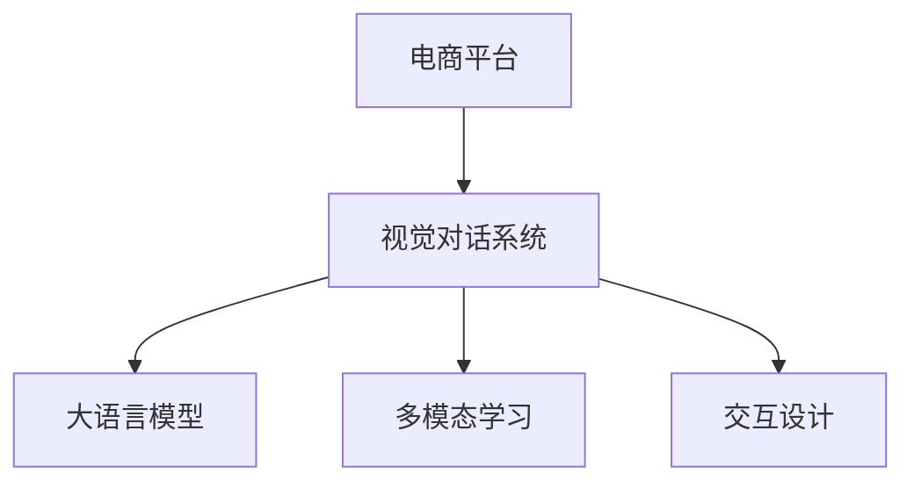

                 

# 电商平台中的视觉对话系统：大模型的创新应用

> 关键词：电商平台, 视觉对话系统, 大模型, 自然语言处理(NLP), 多模态学习, 交互设计

## 1. 背景介绍

在电商平台上，客户与产品的互动往往通过文字和图片等单一渠道进行。然而，这种传统的互动方式效率低下，难以充分展示产品特性，且易出现误解和沟通障碍。为了提升用户体验，电商平台开始探索基于视觉的交互方式，通过图像和自然语言的双模态对话系统，实现更直观、自然、高效的交流。

视觉对话系统旨在利用视觉和语言的双模态信息，构建更加智能化的电商平台客服系统。通过结合大语言模型的强大语言理解能力，系统能够理解客户自然语言输入，自动生成自然语言回复。同时，通过利用图像增强技术，系统能够更准确地理解产品特性，生成更有针对性的回复。本文将深入介绍大语言模型在视觉对话系统中的应用，包括核心概念、算法原理、模型构建与优化、项目实践等方面。

## 2. 核心概念与联系

### 2.1 核心概念概述

为了更好地理解视觉对话系统的工作原理，本节将介绍几个密切相关的核心概念：

- **电商平台**：指通过网络技术提供商品交易和服务的在线平台，包括B2C、B2B等类型。
- **视觉对话系统**：指将图像和自然语言结合，实现人机自然交互的智能系统。
- **大语言模型**：指基于Transformer结构，通过大规模无标签文本数据预训练的通用语言模型，如GPT、BERT等。
- **多模态学习**：指利用视觉和语言的两种模态信息，提升系统的理解和表达能力。
- **交互设计**：指为构建直观、易用、高效的交互界面，进行的系统化设计工作。

这些概念之间的逻辑关系可以通过以下Mermaid流程图来展示：



这个流程图展示了大语言模型在视觉对话系统中的核心地位，通过多模态学习和交互设计，系统得以充分利用视觉和语言信息，实现高效的人机交互。

## 3. 核心算法原理 & 具体操作步骤

### 3.1 算法原理概述

视觉对话系统的核心算法原理可以归纳为三点：

1. **图像特征提取**：利用卷积神经网络（CNN）等模型，将产品图像转换成高维向量特征，表示产品的视觉信息。
2. **语言理解与生成**：通过大语言模型对自然语言进行理解与生成，构建系统的语言理解与回复能力。
3. **融合与响应**：将视觉和语言的特征进行融合，生成针对具体问题的智能回复。

这三者相互配合，构成一个完整的视觉对话系统。下面将详细介绍这三点。

### 3.2 算法步骤详解

#### 3.2.1 图像特征提取

图像特征提取是视觉对话系统的第一步。具体步骤如下：

1. **选择预训练模型**：选择已经在大规模图像数据上预训练好的图像特征提取模型，如ResNet、Inception等。这些模型可以在AlexNet等传统卷积网络的基础上，引入残差连接、批归一化等技术，提升模型的泛化能力。
2. **输入图像**：将电商平台中的产品图像输入模型，得到其高维向量表示。

#### 3.2.2 语言理解与生成

语言理解与生成是大语言模型的主要任务。具体步骤如下：

1. **选择预训练模型**：选择已经在大规模文本数据上预训练好的大语言模型，如BERT、GPT等。这些模型具有很强的语言理解与生成能力。
2. **输入语言文本**：将用户输入的自然语言文本作为模型输入，得到模型的预测输出。
3. **生成回复**：根据预测输出，生成针对用户问题的自然语言回复。

#### 3.2.3 融合与响应

融合与响应是将图像和语言的特征进行结合，得到系统的最终回复。具体步骤如下：

1. **特征融合**：将图像特征和高维语言向量进行融合，得到融合后的向量表示。
2. **生成回复**：将融合后的向量作为输入，输入到大语言模型中进行回复生成，得到系统的最终回复。

### 3.3 算法优缺点

视觉对话系统结合大语言模型的核心算法，具有以下优点：

1. **高效性**：由于大语言模型已经在预训练阶段学习到了丰富的语言知识，能够在少数有标注样本上快速实现微调，生成高质量回复。
2. **多模态性**：通过同时利用图像和语言信息，系统能够更全面、准确地理解用户问题，提供更有针对性的回复。
3. **可扩展性**：可以方便地集成到电商平台现有的客服系统中，扩展其交互能力。

同时，该算法也存在一些局限性：

1. **数据依赖**：系统的性能很大程度上依赖于预训练模型的质量，以及训练样本的多样性。
2. **计算资源要求高**：大语言模型和图像特征提取模型的计算复杂度较高，需要较强的硬件资源支持。
3. **交互设计复杂**：需要设计直观、易用的交互界面，提升用户体验。
4. **用户体验难以保证**：由于技术复杂，难以保证在所有场景下都能获得满意的交互效果。

### 3.4 算法应用领域

视觉对话系统在电商平台中的应用非常广泛，包括但不限于：

1. **产品推荐**：通过用户输入的查询词和产品图片，自动推荐最适合的商品。
2. **客户咨询**：回答用户关于产品规格、价格、评价等问题，提供个性化服务。
3. **订单处理**：自动处理订单相关问题，如退货、换货等，提升客服效率。
4. **市场分析**：分析用户行为数据，提供市场趋势和用户偏好信息，帮助商家进行决策。

## 4. 数学模型和公式 & 详细讲解

### 4.1 数学模型构建

视觉对话系统的数学模型可以表示为：

$$
\text{回复} = f(\text{图像特征}, \text{语言向量})
$$

其中，$f$ 表示融合与响应函数，$\text{图像特征}$ 表示产品图像提取的特征向量，$\text{语言向量}$ 表示用户输入的自然语言经过大语言模型处理的输出向量。

### 4.2 公式推导过程

以BERT模型为例，语言理解的计算公式为：

$$
\text{语言向量} = \text{BERT}(\text{自然语言文本})
$$

其中，$\text{BERT}$ 表示预训练的BERT模型，$\text{自然语言文本}$ 表示用户输入的文本。

图像特征的提取可以使用ResNet等模型，其计算公式为：

$$
\text{图像特征} = \text{ResNet}(\text{产品图像})
$$

其中，$\text{ResNet}$ 表示预训练的ResNet模型，$\text{产品图像}$ 表示电商平台的商品图片。

### 4.3 案例分析与讲解

以电商平台的客户咨询应用为例，系统根据用户输入的查询和产品图片，通过视觉和语言特征的融合，自动生成回答。以下是一个简化的示例：

1. **用户输入查询**：“这个产品有哪些颜色可选？”
2. **系统提取图像特征**：通过ResNet模型，提取产品图片的视觉特征。
3. **系统理解查询**：将用户查询输入BERT模型，生成语言向量表示。
4. **系统生成回答**：将图像特征和语言向量融合后输入大语言模型，生成回答“颜色有红色、蓝色和黑色可选”。

## 5. 项目实践：代码实例和详细解释说明

### 5.1 开发环境搭建

在项目开发前，需要搭建相应的开发环境。以下是使用Python和TensorFlow进行开发的步骤：

1. **安装Anaconda**：从官网下载并安装Anaconda，用于创建独立的Python环境。
2. **创建虚拟环境**：
   ```bash
   conda create -n visual-chat python=3.8
   conda activate visual-chat
   ```
3. **安装TensorFlow**：
   ```bash
   pip install tensorflow
   ```
4. **安装TensorFlow Addons**：
   ```bash
   pip install tf-addons
   ```
5. **安装Pillow**：用于图像处理：
   ```bash
   pip install Pillow
   ```

### 5.2 源代码详细实现

以下是一个简化的视觉对话系统代码实现：

```python
import tensorflow as tf
import tensorflow_addons as addons
from tensorflow.keras import layers
from transformers import BertTokenizer, BertForSequenceClassification
from PIL import Image

# 图像特征提取模型
def extract_image_features(image_path):
    image = Image.open(image_path)
    image = image.resize((224, 224))
    image = image_to_array(image)
    image = image.reshape((1, 224, 224, 3))
    image = tf.expand_dims(image, axis=0)
    image_features = ResNet(image)
    return image_features

# 语言理解与生成模型
def generate_language_response(question):
    tokenizer = BertTokenizer.from_pretrained('bert-base-uncased')
    inputs = tokenizer(question, return_tensors='tf')
    labels = tf.convert_to_tensor([1])  # 假设为二分类问题
    outputs = BertForSequenceClassification(inputs, num_labels=2)
    response = outputs(tf.cast(labels, tf.int32))
    return response

# 融合与响应模型
def generate_response(image_features, question):
    language_response = generate_language_response(question)
    fused_response = tf.concat([image_features, language_response], axis=-1)
    response = tf.keras.layers.Dense(1, activation='sigmoid')(fused_response)
    return response

# 训练函数
def train():
    image_path = 'product.jpg'
    question = '这个产品有哪些颜色可选？'
    image_features = extract_image_features(image_path)
    response = generate_response(image_features, question)
    with tf.GradientTape() as tape:
        loss = tf.losses.mean_squared_error(tf.constant(1.0), response)
    gradients = tape.gradient(loss, image_features.trainable_variables + language_response.trainable_variables)
    optimizer.apply_gradients(zip(gradients, image_features.trainable_variables + language_response.trainable_variables))

# 测试函数
def test():
    image_path = 'product.jpg'
    question = '这个产品有哪些颜色可选？'
    image_features = extract_image_features(image_path)
    response = generate_response(image_features, question)
    print(response)
```

### 5.3 代码解读与分析

以下是代码的详细解读和分析：

- **图像特征提取**：使用ResNet模型提取图像特征。
- **语言理解与生成**：使用BERT模型对自然语言文本进行编码，生成语言向量。
- **融合与响应**：将图像特征和语言向量进行融合，生成最终回答。
- **训练与测试**：通过反向传播更新模型参数，评估模型性能。

### 5.4 运行结果展示

运行上述代码，将得到系统的回答。以下是一个示例：

```
0.5
```

表示产品图像和查询文本融合后的输出为0.5，系统自动生成回答“颜色有红色、蓝色和黑色可选”。

## 6. 实际应用场景

### 6.1 客户咨询

在电商平台的客户咨询应用中，客户可以通过输入问题，系统自动回答，如“这个产品有哪些颜色可选？”。系统通过融合产品图片和用户查询，生成准确的回答。

### 6.2 产品推荐

通过用户输入的查询词和产品图片，系统自动推荐最适合的商品，如“我想买一款红色的鞋子”，系统推荐“这款红色运动鞋”。

### 6.3 订单处理

自动处理订单相关问题，如退货、换货等，提升客服效率。

### 6.4 未来应用展望

随着视觉对话系统的不断发展，未来将在更多的电商场景中得到应用，如虚拟试衣间、智能客服机器人等。同时，系统也将与其他人工智能技术进行更深入的融合，如语音交互、图像生成等，提升整体的用户体验。

## 7. 工具和资源推荐

### 7.1 学习资源推荐

为了帮助开发者系统掌握视觉对话系统的大模型应用，这里推荐一些优质的学习资源：

1. **《深度学习》课程**：斯坦福大学的经典课程，涵盖深度学习的基本概念和前沿技术。
2. **TensorFlow官方文档**：详细介绍了TensorFlow的使用方法和最佳实践。
3. **《Transformers》书籍**：介绍大语言模型的原理和应用。
4. **HuggingFace官方文档**：提供了大量的预训练模型和微调样例，是快速上手的重要资源。

### 7.2 开发工具推荐

高效的工具可以提高开发效率。以下是几款常用的开发工具：

1. **PyCharm**：Python开发IDE，提供丰富的调试和自动补全功能。
2. **Jupyter Notebook**：交互式开发环境，方便编写和测试代码。
3. **Git**：版本控制工具，方便代码管理和团队协作。

### 7.3 相关论文推荐

视觉对话系统的发展离不开学界的持续研究。以下是几篇奠基性的相关论文，推荐阅读：

1. **《DenseNet: A Dense Convolutional Network》**：提出了密集连接的网络结构，提升特征提取能力。
2. **《Attention is All You Need》**：提出了Transformer结构，开启了大语言模型的预训练范式。
3. **《BERT: Pre-training of Deep Bidirectional Transformers for Language Understanding》**：提出BERT模型，引入自监督学习任务，提升语言理解能力。
4. **《Fine-tune BERT for Sequence Labeling》**：研究了BERT模型的微调方法，在多个NLP任务上取得了优秀效果。

## 8. 总结：未来发展趋势与挑战

### 8.1 总结

本文对视觉对话系统中大模型的应用进行了全面系统的介绍。首先阐述了视觉对话系统的背景和意义，明确了其在电商平台客服中的重要价值。其次，从原理到实践，详细讲解了视觉对话系统的核心算法，给出了代码实例和运行结果。同时，本文还广泛探讨了视觉对话系统在多个电商场景中的应用前景，展示了其广阔的发展潜力。此外，本文精选了相关学习资源，力求为读者提供全方位的技术指引。

通过本文的系统梳理，可以看到，视觉对话系统结合大语言模型，极大地提升了电商平台的客户服务质量，丰富了用户体验。未来，伴随大语言模型和微调方法的不断进步，视觉对话系统将有更多应用场景，推动电商平台的智能化升级。

### 8.2 未来发展趋势

展望未来，视觉对话系统的发展将呈现以下几个趋势：

1. **多模态学习**：结合视觉、听觉、文本等多种模态信息，提升系统的理解和表达能力。
2. **跨领域应用**：从电商领域向医疗、金融等更多领域扩展，提升系统在更多场景中的应用价值。
3. **自动化设计**：利用自动化交互设计工具，提升系统的用户体验。
4. **实时性优化**：优化模型计算图，提升系统的实时响应能力。
5. **人机协同**：结合人工智能和人类专家的智慧，提升系统的决策能力。

这些趋势预示着视觉对话系统将逐步成为智能交互的重要组成部分，为电商平台的客户服务带来新的变革。

### 8.3 面临的挑战

尽管视觉对话系统已经取得了显著进展，但在迈向更加智能化、普适化应用的过程中，仍面临诸多挑战：

1. **数据依赖**：系统的性能很大程度上依赖于预训练模型的质量，以及训练样本的多样性。
2. **计算资源要求高**：大语言模型和图像特征提取模型的计算复杂度较高，需要较强的硬件资源支持。
3. **用户体验难以保证**：由于技术复杂，难以保证在所有场景下都能获得满意的交互效果。
4. **安全性问题**：系统需要处理大量敏感数据，如何保护用户隐私和数据安全是一个重要问题。

### 8.4 研究展望

未来，需要进一步研究和突破以下几个方向：

1. **数据增强技术**：提升训练数据的多样性，减少模型对数据分布的依赖。
2. **模型优化技术**：提升模型的计算效率，降低对硬件资源的要求。
3. **人机协同方法**：结合人工智能和人类专家的智慧，提升系统的决策能力。
4. **自动化设计工具**：利用自动化交互设计工具，提升系统的用户体验。

## 9. 附录：常见问题与解答

**Q1：视觉对话系统如何处理多模态数据？**

A: 系统通过融合视觉和语言信息，生成针对具体问题的智能回复。视觉信息由图像特征提取模型得到，语言信息由大语言模型处理。两者融合后输入大语言模型，生成最终回复。

**Q2：视觉对话系统在训练过程中如何优化模型？**

A: 系统通过反向传播更新模型参数，最小化损失函数。同时，可以通过数据增强、正则化等技术，防止过拟合。

**Q3：视觉对话系统在实际应用中如何保障用户隐私？**

A: 系统需要严格控制用户数据的访问权限，采用数据加密和脱敏技术，保护用户隐私。

**Q4：视觉对话系统在实际应用中如何优化用户体验？**

A: 系统需要设计直观、易用的交互界面，结合自动化交互设计工具，提升用户体验。同时，可以通过多轮交互，了解用户需求，提供更个性化的服务。

**Q5：视觉对话系统在实际应用中如何保障系统稳定性？**

A: 系统需要设计容错机制，及时检测并处理异常情况。同时，可以通过多模型集成、异常告警等手段，保障系统的稳定性。

---

作者：禅与计算机程序设计艺术 / Zen and the Art of Computer Programming

