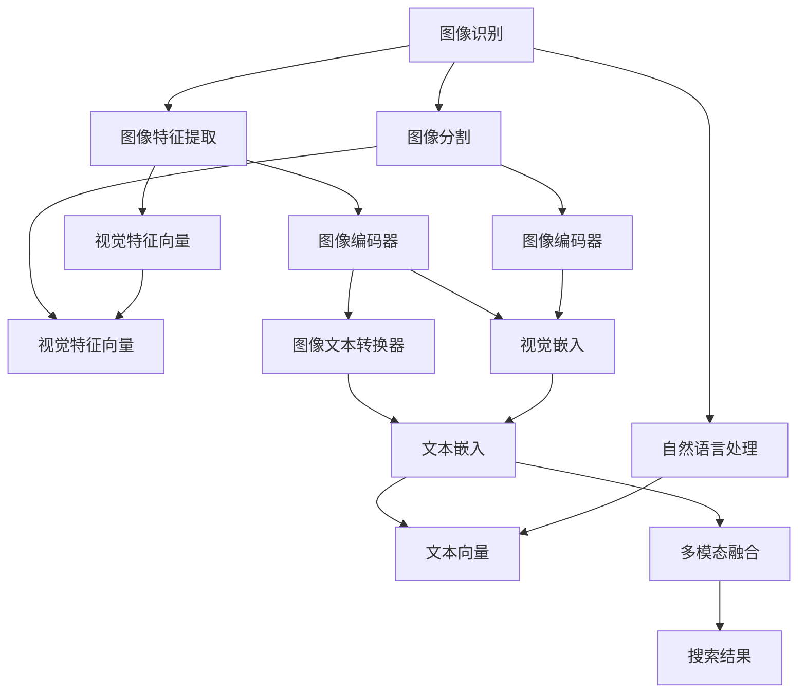

                 

# 电商平台中的视觉搜索：大模型的创新应用

> 关键词：视觉搜索,大模型,电商平台,深度学习,推荐系统,计算机视觉,自然语言处理,多模态融合

## 1. 背景介绍

在当今的电商平台上，用户日益依赖视觉信息进行购物决策。传统的文本搜索虽然能够有效匹配用户需求，但面临输入不准确、搜索结果单一等问题。相比之下，视觉搜索能够直观地展示商品信息，增强用户体验，成为电商发展的新趋势。

视觉搜索的核心任务是：在图像数据库中，根据用户上传的查询图像，快速匹配出与该图像最为相似的图像或商品，提供精准的搜索结果。这项任务不仅需要计算机视觉技术的支持，还需要对用户查询语义的理解和转化。

近年来，随着深度学习技术的发展，大模型在视觉搜索中得到了广泛应用。通过预训练的大模型，可以有效学习到图像和文本的通用表示，从而在少量标注数据上实现高效且准确的视觉搜索。本文将重点介绍大模型在视觉搜索中的应用，探讨其实现原理和具体操作步骤，分析其优缺点，展望未来发展方向。

## 2. 核心概念与联系

### 2.1 核心概念概述

在视觉搜索中，大模型主要应用在以下几个关键技术环节：

- **计算机视觉**：使用图像识别、分割、特征提取等技术，从用户上传的查询图像中提取出重要的视觉特征。
- **自然语言处理(NLP)**：理解用户查询图像的语义，转化成计算机可处理的形式，增强搜索的准确性和相关性。
- **多模态融合**：结合视觉和文本信息，进行更为精准的图像匹配和搜索结果推荐。

这些技术环节之间相互依存，共同构成了视觉搜索的基础。

### 2.2 核心概念原理和架构的 Mermaid 流程图



这个流程图示意了视觉搜索的核心步骤：

1. 对用户上传的查询图像进行识别和分割，提取视觉特征。
2. 使用图像编码器将视觉特征转化为高维视觉嵌入向量。
3. 通过自然语言处理技术，理解查询图像的语义，将其转换为文本嵌入向量。
4. 将视觉嵌入向量和文本嵌入向量进行融合，得到多模态嵌入向量。
5. 在图像数据库中搜索最相似的图像，生成搜索结果。

## 3. 核心算法原理 & 具体操作步骤

### 3.1 算法原理概述

大模型在视觉搜索中的应用，主要基于以下原理：

- **预训练模型**：使用大规模无标签图像数据进行预训练，学习通用的图像和语义表示。
- **多模态融合**：将视觉特征和文本信息结合，生成多模态表示，增强图像匹配的准确性。
- **微调技术**：通过少量标注数据对预训练模型进行微调，适应电商平台的特定需求。

在具体实现中，通常使用大模型学习视觉和语义的通用表示，然后通过微调，使其适应电商平台的搜索场景。微调过程中，需优化以下目标：

1. **视觉特征提取准确性**：学习更有效的图像特征提取方式。
2. **语义理解能力**：提升对用户查询图像语义的准确理解。
3. **图像匹配相关性**：增强搜索结果的相关性。

### 3.2 算法步骤详解

大模型在视觉搜索中的应用步骤包括：

1. **数据准备**：收集并标注电商平台的商品图像和用户查询图像，构建训练集和验证集。
2. **预训练模型加载**：加载预训练好的大模型，如CLIP、DALL-E等。
3. **微调模型训练**：使用电商平台的标注数据对模型进行微调，优化视觉特征提取和语义理解能力。
4. **搜索推理**：对用户上传的查询图像进行推理，生成搜索结果。

具体步骤如下：

- **图像预处理**：对图像进行归一化、裁剪等预处理，以便输入大模型。
- **特征提取**：使用大模型提取图像的视觉特征向量。
- **语义理解**：使用NLP模型理解查询图像的语义，转化成文本嵌入向量。
- **多模态融合**：将视觉特征向量和文本嵌入向量进行融合，生成多模态嵌入向量。
- **图像匹配**：在图像数据库中搜索与多模态嵌入向量最相似的图像，生成搜索结果。

### 3.3 算法优缺点

#### 优点

- **泛化能力强**：大模型通过大规模无标签数据预训练，学习到通用的图像和语义表示，在少量标注数据上仍能取得良好的效果。
- **适应性强**：通过微调，大模型可以适应电商平台的特定需求，提升搜索相关性。
- **灵活性高**：可以结合不同领域的预训练模型，实现多领域图像匹配。

#### 缺点

- **资源需求高**：大模型需要高性能计算资源进行预训练和微调，成本较高。
- **训练时间长**：大模型的微调训练时间较长，需要较高的计算资源。
- **模型复杂性高**：大模型参数量庞大，结构复杂，调试和部署难度较大。

### 3.4 算法应用领域

大模型在视觉搜索中的应用领域广泛，涵盖以下方面：

- **商品匹配**：通过视觉搜索，找到与用户查询图像最为相似的电商平台商品。
- **时尚推荐**：根据用户上传的时尚图片，推荐相关商品，提升用户体验。
- **家居设计**：通过家居图片，搜索搭配装饰物，提升家居设计效果。
- **旅行旅游**：根据用户上传的旅游图片，推荐旅游路线和景点。
- **艺术鉴赏**：对艺术品进行视觉搜索，发现相似作品，提升艺术鉴赏体验。

## 4. 数学模型和公式 & 详细讲解 & 举例说明

### 4.1 数学模型构建

在视觉搜索中，大模型通常使用以下数学模型：

- **视觉嵌入**：使用图像编码器将图像转化为高维视觉嵌入向量 $x$。
- **文本嵌入**：使用NLP模型将查询图像的语义转化成文本嵌入向量 $y$。
- **多模态嵌入**：将视觉嵌入向量和文本嵌入向量进行线性组合，得到多模态嵌入向量 $z$。

形式化地，设图像编码为 $f$，文本编码为 $g$，则多模态嵌入向量为：

$$
z = \alpha x + \beta y = (\alpha f + \beta g)(x,y)
$$

其中 $\alpha$ 和 $\beta$ 为权值，通常通过优化目标函数确定。

### 4.2 公式推导过程

以视觉嵌入和文本嵌入的线性组合为例，进行公式推导：

设 $x$ 和 $y$ 为输入图像和语义的嵌入向量，$z$ 为多模态嵌入向量，权重 $\alpha$ 和 $\beta$ 通过最小化损失函数 $L$ 确定：

$$
L = ||z - (z_{gt})||^2
$$

其中 $z_{gt}$ 为与输入图像和语义最相似的目标嵌入向量。

通过梯度下降等优化算法，求解权值 $\alpha$ 和 $\beta$，使得目标嵌入向量 $z_{gt}$ 与模型预测的多模态嵌入向量 $z$ 最为接近。

### 4.3 案例分析与讲解

以时尚推荐为例，分析大模型在视觉搜索中的应用：

1. **数据准备**：收集电商平台用户的时尚图片和商品图片，标注每张图片所属的类别。
2. **预训练模型加载**：加载预训练好的大模型，如CLIP。
3. **微调模型训练**：使用电商平台的标注数据对模型进行微调，优化时尚图片的视觉特征提取和语义理解能力。
4. **搜索推理**：对用户上传的时尚图片进行推理，生成推荐的时尚商品。

## 5. 项目实践：代码实例和详细解释说明

### 5.1 开发环境搭建

为了实现视觉搜索功能，我们需要搭建以下开发环境：

1. **Python环境**：使用Anaconda创建虚拟环境，安装必要的Python库和工具。
2. **深度学习框架**：安装TensorFlow或PyTorch，支持深度学习模型的训练和推理。
3. **大模型库**：安装HuggingFace的Transformers库，支持加载和使用预训练大模型。
4. **图像处理库**：安装OpenCV、Pillow等库，支持图像预处理和显示。
5. **NLP库**：安装NLTK、spaCy等库，支持自然语言处理任务。

### 5.2 源代码详细实现

以下是一个基于CLIP模型的视觉搜索代码实现：

```python
from transformers import CLIPModel, CLIPTokenizer
import torch
import numpy as np
import cv2

# 加载CLIP模型和分词器
model = CLIPModel.from_pretrained('openai/clip-vit-large-patch14')
tokenizer = CLIPTokenizer.from_pretrained('openai/clip-vit-large-patch14')

# 定义图像预处理函数
def preprocess_image(image_path):
    img = cv2.imread(image_path)
    img = cv2.resize(img, (224, 224))
    img = np.array(img) / 255.0
    img = np.expand_dims(img, axis=0)
    return img

# 定义查询语义预处理函数
def preprocess_query(query_text):
    query = tokenizer(query_text, return_tensors='pt')
    return query['input_ids']

# 定义视觉搜索函数
def visual_search(query_image_path, query_text, images, top_k=5):
    # 预处理查询图像和查询语义
    query_image = preprocess_image(query_image_path)
    query_ids = preprocess_query(query_text)

    # 预处理要搜索的图像
    images = [preprocess_image(image_path) for image_path in images]
    images = np.array(images)

    # 计算图像嵌入向量和语义嵌入向量
    with torch.no_grad():
        image_embeddings = model.encode_images(images)
        query_embedding = model.encode_text(query_ids)

    # 计算多模态嵌入向量
    embeddings = torch.cat([image_embeddings, query_embedding], dim=1)

    # 搜索最相似的图像
    cosine_similarities = torch.cosine_similarity(embeddings, image_embeddings)
    similarities, indices = torch.topk(cosine_similarities, top_k, dim=1)

    # 返回搜索结果
    results = [image_paths[indices[i, 1]] for i in range(len(indices))]
    return results

# 示例代码：使用视觉搜索功能
query_image_path = 'query_image.jpg'
query_text = 'fashion shoes'
images = ['image1.jpg', 'image2.jpg', 'image3.jpg']
results = visual_search(query_image_path, query_text, images)
print(results)
```

### 5.3 代码解读与分析

这段代码主要实现了以下功能：

- **图像预处理**：使用OpenCV库对查询图像和要搜索的图像进行预处理，包括缩放、归一化等操作。
- **语义预处理**：使用HuggingFace的Tokenizer将查询文本转化为模型可接受的格式。
- **视觉搜索**：使用CLIP模型计算查询图像和待搜索图像的多模态嵌入向量，并找到与查询图像最相似的图像。
- **搜索结果输出**：输出与查询图像最相似的图像列表，供用户查看。

### 5.4 运行结果展示

运行上述代码，可以得到与查询图像最相似的电商商品列表。例如，查询一张时尚鞋子图片，得到与该图片最相似的5张时尚鞋子商品图片。

## 6. 实际应用场景

### 6.1 电商平台中的应用

大模型在电商平台中的视觉搜索应用广泛，涵盖以下场景：

1. **商品推荐**：根据用户上传的查询图像，推荐相似商品，提升用户体验。
2. **价格对比**：对相似商品的价格进行比较，帮助用户做出购买决策。
3. **用户反馈**：收集用户对商品的评价和反馈，进行情感分析，改进推荐算法。
4. **营销活动**：根据营销活动的主题，生成相关图像，进行广告宣传。
5. **个性化设计**：根据用户的时尚需求，生成个性化设计方案，提升用户满意度。

### 6.2 时尚行业的应用

大模型在时尚行业中的应用也颇具潜力，例如：

1. **时尚趋势分析**：通过收集大量时尚图片，分析时尚趋势和流行元素，指导时尚设计。
2. **时尚图片生成**：生成符合用户需求的时尚图片，辅助时尚营销。
3. **时尚商品分类**：对时尚商品进行分类和标注，建立时尚商品数据库。
4. **时尚创意设计**：根据用户需求，生成创意设计方案，提升设计效率。
5. **时尚社交媒体分析**：分析时尚社交媒体数据，了解用户喜好，优化营销策略。

### 6.3 未来应用展望

未来，大模型在视觉搜索中的应用将进一步扩展，涵盖更多领域。例如：

- **医疗健康**：使用视觉搜索技术，辅助医学图像诊断，提供精准的医疗服务。
- **旅游旅游**：根据用户上传的旅游图片，推荐旅行路线和景点，提升旅游体验。
- **艺术鉴赏**：通过视觉搜索，发现相似的艺术品，提升艺术鉴赏体验。
- **智能家居**：根据用户上传的家居图片，推荐相关装饰物，提升家居设计效果。
- **金融理财**：使用视觉搜索技术，辅助理财投资，提供个性化的金融服务。

## 7. 工具和资源推荐

### 7.1 学习资源推荐

为了帮助开发者掌握大模型在视觉搜索中的应用，推荐以下学习资源：

1. **《深度学习》课程**：斯坦福大学和Coursera合作的深度学习课程，涵盖深度学习基础和应用。
2. **《计算机视觉：现代方法》书籍**：计算机视觉领域的经典教材，详细讲解计算机视觉算法和技术。
3. **《自然语言处理综论》书籍**：自然语言处理领域的经典教材，涵盖NLP基础和应用。
4. **HuggingFace官方文档**：Transformers库的官方文档，提供详细的预训练模型和使用指南。
5. **Kaggle竞赛**：参加Kaggle的图像识别和NLP竞赛，提升实践能力。

### 7.2 开发工具推荐

为了实现视觉搜索功能，推荐以下开发工具：

1. **Jupyter Notebook**：Python的交互式开发环境，支持代码编写和结果展示。
2. **TensorFlow**：支持深度学习模型的训练和推理，具有强大的计算图功能。
3. **PyTorch**：支持深度学习模型的训练和推理，具有灵活的动态计算图功能。
4. **OpenCV**：支持图像处理和计算机视觉任务，具有丰富的图像处理函数。
5. **Pillow**：Python的图像处理库，支持图像格式转换和显示。

### 7.3 相关论文推荐

以下几篇论文详细介绍了大模型在视觉搜索中的应用，推荐阅读：

1. **"Unsupervised Learning of Visual Representations by Transformer"**：提出使用大模型学习视觉表示的方法，提升视觉搜索的效果。
2. **"Learning Transferable Visual Models from Natural Language Supervision"**：提出使用大模型学习视觉和语义表示的方法，提升视觉搜索的多模态融合能力。
3. **"FashionGloVe: Unsupervised Fashion Image Representation Learning"**：提出使用大模型学习时尚图像表示的方法，提升时尚推荐的效果。

## 8. 总结：未来发展趋势与挑战

### 8.1 研究成果总结

本文系统介绍了大模型在视觉搜索中的应用，分析了其实现原理和具体操作步骤。通过详细讲解代码实例，展示了如何在电商平台上实现视觉搜索功能。

### 8.2 未来发展趋势

未来，大模型在视觉搜索中的应用将呈现以下几个发展趋势：

1. **跨模态融合**：大模型将进一步提升视觉、文本、音频等多模态信息的融合能力，提供更加丰富、全面的搜索结果。
2. **实时搜索**：大模型将实现实时搜索，大幅提升用户查询响应速度。
3. **个性化推荐**：大模型将进一步优化个性化推荐算法，提升用户购物体验。
4. **知识图谱结合**：大模型将与知识图谱结合，提供更准确、更丰富的搜索结果。
5. **联邦学习**：大模型将通过联邦学习技术，保护用户隐私，提升搜索结果的安全性。

### 8.3 面临的挑战

大模型在视觉搜索中的应用仍面临以下挑战：

1. **数据量不足**：电商平台的标注数据通常较少，难以覆盖所有商品类别。
2. **计算资源需求高**：大模型的预训练和微调需要大量的计算资源。
3. **模型复杂度高**：大模型的结构复杂，调试和优化难度较大。
4. **数据分布不均**：电商平台的商品类别分布不均，可能导致搜索结果偏差。
5. **隐私保护**：电商平台需要保护用户隐私，避免数据泄露。

### 8.4 研究展望

为了应对以上挑战，未来的研究需要关注以下几个方向：

1. **数据增强技术**：通过数据增强技术，提升模型泛化能力，缓解数据量不足的问题。
2. **模型压缩技术**：通过模型压缩技术，减少计算资源需求，降低微调成本。
3. **分布式训练**：通过分布式训练技术，提升计算效率，加速模型训练。
4. **联邦学习**：通过联邦学习技术，保护用户隐私，提升数据安全性。
5. **跨领域迁移学习**：通过跨领域迁移学习技术，提升模型在不同领域的应用效果。

总之，大模型在视觉搜索中的应用将带来革命性变革，但也需要解决诸多挑战。只有不断创新和优化，才能实现大模型的最大潜力，为用户提供更加精准、高效的视觉搜索体验。

## 9. 附录：常见问题与解答

**Q1：大模型在视觉搜索中的优势和劣势是什么？**

A: 大模型在视觉搜索中的优势包括：

- **泛化能力强**：大模型通过大规模无标签数据预训练，学习到通用的图像和语义表示，在少量标注数据上仍能取得良好的效果。
- **适应性强**：通过微调，大模型可以适应电商平台的特定需求，提升搜索相关性。

劣势包括：

- **资源需求高**：大模型需要高性能计算资源进行预训练和微调，成本较高。
- **训练时间长**：大模型的微调训练时间较长，需要较高的计算资源。
- **模型复杂性高**：大模型参数量庞大，结构复杂，调试和部署难度较大。

**Q2：大模型在视觉搜索中如何进行微调？**

A: 大模型在视觉搜索中的微调主要包括以下步骤：

1. **数据准备**：收集并标注电商平台的商品图像和用户查询图像，构建训练集和验证集。
2. **预训练模型加载**：加载预训练好的大模型，如CLIP。
3. **微调模型训练**：使用电商平台的标注数据对模型进行微调，优化视觉特征提取和语义理解能力。

**Q3：如何提高视觉搜索的准确性和相关性？**

A: 提高视觉搜索的准确性和相关性，可以从以下几个方面入手：

- **数据增强**：通过数据增强技术，扩充训练集多样性，提升模型的泛化能力。
- **模型融合**：结合多个预训练模型，提升多模态融合效果，提高搜索准确性。
- **超参数调优**：通过超参数调优，优化模型结构和学习率等参数，提升搜索性能。
- **负样本筛选**：通过负样本筛选技术，去除与查询图像不相关的图像，提升搜索结果的相关性。

**Q4：视觉搜索在电商平台的实际应用有哪些？**

A: 视觉搜索在电商平台的实际应用包括：

- **商品匹配**：通过视觉搜索，找到与用户查询图像最为相似的电商平台商品。
- **时尚推荐**：根据用户上传的时尚图片，推荐相关商品，提升用户体验。
- **家居设计**：通过家居图片，搜索搭配装饰物，提升家居设计效果。
- **旅行旅游**：根据用户上传的旅游图片，推荐旅行路线和景点。
- **艺术鉴赏**：对艺术品进行视觉搜索，发现相似作品，提升艺术鉴赏体验。

**Q5：如何处理视觉搜索中的噪声数据？**

A: 处理视觉搜索中的噪声数据，可以从以下几个方面入手：

- **数据清洗**：对输入的查询图像进行预处理，去除噪声和干扰信息。
- **负样本筛选**：通过负样本筛选技术，去除与查询图像不相关的图像，提升搜索结果的相关性。
- **多模型集成**：结合多个预训练模型，提升视觉搜索的鲁棒性和准确性。

**Q6：视觉搜索在大模型中的应用前景如何？**

A: 视觉搜索在大模型中的应用前景广阔，未来将进一步扩展到更多领域，如医疗健康、旅游旅游、艺术鉴赏等。

---

作者：禅与计算机程序设计艺术 / Zen and the Art of Computer Programming

