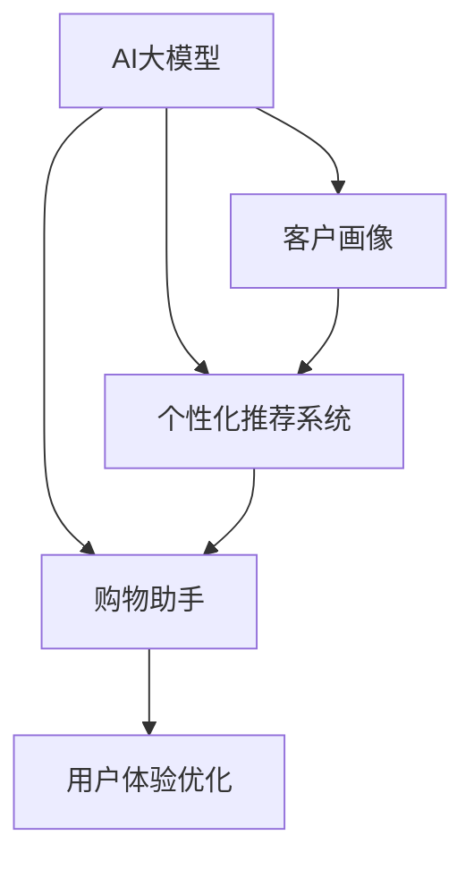

                 

# 电商平台如何利用AI大模型优化用户体验

> 关键词：AI大模型,电商平台,用户推荐系统,个性化推荐,购物助手,客服机器人,客户画像,用户体验优化

## 1. 背景介绍

### 1.1 问题由来
随着互联网的快速发展和电商市场的日益成熟，各大电商平台纷纷加大了对人工智能技术的应用。通过对用户行为、商品信息、市场趋势等数据的深度分析，电商平台能够提供更精准的个性化推荐、更高效的用户服务，从而提升用户体验，增加用户粘性和转化率。人工智能技术在电商平台中的应用，主要集中在以下几个方面：

1. **用户推荐系统**：通过分析用户的浏览、购买历史、评分反馈等信息，向用户推荐符合其兴趣的商品，提升用户体验和满意度。
2. **购物助手**：基于自然语言处理技术，提供智能客服、聊天机器人等服务，帮助用户快速找到所需商品，解决购物中的问题。
3. **客户画像**：通过对用户数据的分析挖掘，构建详细的客户画像，为个性化推荐和精准营销提供依据。
4. **广告投放**：利用AI技术进行广告内容的个性化生成和投放优化，提高广告效果，降低投放成本。

本文将重点探讨如何利用AI大模型技术，优化电商平台的推荐系统和客户服务，提升用户体验。

## 2. 核心概念与联系

### 2.1 核心概念概述

为更好地理解AI大模型在电商平台的应用，本节将介绍几个关键概念：

- **AI大模型**：指通过自监督学习或监督学习预训练得到的通用语言模型，如GPT、BERT等。这些模型能够理解自然语言，生成高质量的自然语言文本，是构建电商推荐系统和客户服务的基础。
- **个性化推荐系统**：通过分析用户行为数据，构建用户画像，对用户进行精准的个性化推荐，提升用户满意度和转化率。
- **购物助手**：利用自然语言处理技术，提供智能客服、聊天机器人等服务，提升用户购物体验。
- **客户画像**：通过数据挖掘和分析，构建详细的用户画像，为个性化推荐和精准营销提供依据。
- **用户体验优化**：通过技术手段提升用户在电商平台上的购物、浏览、支付等各个环节的体验，提高用户满意度和忠诚度。

这些核心概念之间的逻辑关系可以通过以下Mermaid流程图来展示：



这个流程图展示了大模型的核心概念及其之间的关系：

1. 大模型通过预训练获得基础能力。
2. 个性化推荐系统、购物助手等应用，均基于大模型的自然语言处理能力。
3. 客户画像的构建，也离不开大模型的分析能力。
4. 用户体验优化，可以通过大模型构建的自然语言生成和交互模型实现。

## 3. 核心算法原理 & 具体操作步骤
### 3.1 算法原理概述

在电商平台中，AI大模型的应用主要是通过自然语言处理技术和机器学习算法来实现的。其核心思想是：利用大模型的语义理解能力和生成能力，结合用户行为数据，构建用户画像，进行个性化推荐和智能客服，优化用户体验。

具体来说，主要包括以下几个步骤：

1. **预训练大模型**：利用大规模无标签文本数据进行自监督学习，构建通用的语言模型。
2. **构建推荐模型**：基于预训练大模型，构建个性化推荐模型，通过分析用户行为数据，生成个性化推荐列表。
3. **构建购物助手模型**：基于预训练大模型，构建智能客服和聊天机器人模型，提供用户查询解答和购物指导。
4. **客户画像构建**：利用预训练大模型的分析能力，从用户行为数据中挖掘出有用的信息，构建用户画像。
5. **用户体验优化**：通过自然语言生成和交互技术，构建个性化引导和推荐系统，提升用户购物体验。

### 3.2 算法步骤详解

以下是利用AI大模型优化电商平台用户体验的具体操作步骤：

**Step 1: 收集和预处理数据**

- 收集电商平台的订单、浏览、评价、反馈等数据，清洗数据，去除噪声。
- 将用户数据分为训练集、验证集和测试集。

**Step 2: 构建用户画像**

- 利用预训练大模型的分析能力，对用户行为数据进行深度挖掘，提取用户的兴趣、偏好、需求等信息。
- 构建用户画像，包括基本信息、行为习惯、购买历史、偏好商品等。

**Step 3: 个性化推荐系统构建**

- 基于用户画像，构建个性化推荐模型。常见的方法包括协同过滤、基于内容的推荐、混合推荐等。
- 使用预训练大模型作为推荐系统的基础，根据用户画像生成个性化推荐列表。
- 定期更新推荐模型，使用户画像和推荐列表保持最新。

**Step 4: 构建购物助手模型**

- 利用预训练大模型构建智能客服和聊天机器人模型，通过自然语言处理技术解析用户查询，生成回答。
- 训练模型，使其能够理解常见问题，提供快速、准确的解答。
- 通过交互反馈，不断优化模型，提高解答质量。

**Step 5: 用户体验优化**

- 利用预训练大模型的自然语言生成能力，构建个性化引导和推荐系统，提升用户购物体验。
- 在用户浏览商品时，根据其兴趣和需求，展示个性化的商品推荐。
- 通过自然语言交互技术，提供购物建议和购买引导。

### 3.3 算法优缺点

利用AI大模型优化电商平台用户体验具有以下优点：

1. **提升推荐效果**：通过构建个性化推荐模型，提升推荐的精准度和个性化程度，提高用户满意度。
2. **提升客服效率**：利用智能客服和聊天机器人，提升客服响应速度和解答质量，降低人工成本。
3. **优化用户画像**：通过深度分析用户行为数据，构建更全面、准确的客户画像，为精准营销提供依据。
4. **提升用户体验**：通过自然语言生成和交互技术，构建个性化引导和推荐系统，提升用户购物体验。

同时，这些方法也存在一些局限性：

1. **数据依赖**：推荐和客服系统的效果很大程度上依赖于数据质量和用户行为数据的覆盖率。
2. **模型复杂性**：个性化推荐和智能客服模型较为复杂，需要大量的计算资源和时间进行训练和优化。
3. **用户隐私**：在收集和分析用户数据时，需要严格遵守隐私保护法规，保护用户隐私。
4. **模型泛化性**：大模型在特定领域的应用效果往往不如在小规模数据上训练的模型。
5. **用户接受度**：部分用户可能对智能客服和推荐系统的效果不满意，需要不断优化和改进。

尽管存在这些局限性，但总体而言，利用AI大模型优化电商平台用户体验具有广泛的应用前景，能够显著提升平台的运营效率和用户满意度。

### 3.4 算法应用领域

AI大模型在电商平台中的应用领域非常广泛，主要包括以下几个方面：

1. **用户推荐系统**：基于大模型进行个性化推荐，提升用户购物体验和满意度。
2. **购物助手**：构建智能客服和聊天机器人，提供个性化购物指导和问题解答。
3. **客户画像**：通过分析用户数据，构建详细的用户画像，为精准营销提供依据。
4. **广告投放**：利用大模型的分析能力，进行广告内容的个性化生成和投放优化。
5. **商品评价**：利用大模型进行情感分析，提升商品评价的准确性和真实性。
6. **用户行为预测**：基于用户历史行为数据，预测用户未来行为，提升推荐系统的准确性。

## 4. 数学模型和公式 & 详细讲解 & 举例说明

### 4.1 数学模型构建

本节将使用数学语言对利用AI大模型优化电商平台用户体验的过程进行更加严格的刻画。

记预训练大模型为 $M_{\theta}$，其中 $\theta$ 为预训练得到的模型参数。设电商平台的用户数据为 $D=\{(x_i, y_i)\}_{i=1}^N$，其中 $x_i$ 为用户的行为数据，$y_i$ 为用户的标签（如购买、浏览、评分等）。

定义模型 $M_{\theta}$ 在用户数据 $D$ 上的损失函数为 $\ell(M_{\theta}, D)$，用于衡量模型预测结果与实际标签之间的差异。常见的损失函数包括交叉熵损失、均方误差损失等。

推荐系统、客服系统等模型的目标是最小化损失函数 $\ell(M_{\theta}, D)$，即找到最优参数：

$$
\theta^* = \mathop{\arg\min}_{\theta} \ell(M_{\theta}, D)
$$

在实践中，我们通常使用基于梯度的优化算法（如SGD、Adam等）来近似求解上述最优化问题。设 $\eta$ 为学习率，$\lambda$ 为正则化系数，则参数的更新公式为：

$$
\theta \leftarrow \theta - \eta \nabla_{\theta}\ell(M_{\theta}, D) - \eta\lambda\theta
$$

其中 $\nabla_{\theta}\ell(M_{\theta}, D)$ 为损失函数对参数 $\theta$ 的梯度，可通过反向传播算法高效计算。

### 4.2 公式推导过程

以下我们以个性化推荐系统为例，推导推荐模型的损失函数及其梯度的计算公式。

假设推荐系统接受用户行为数据 $x_i$，输出推荐列表 $y_i$。推荐列表 $y_i$ 的每个元素为 $d$，表示商品ID，推荐列表的长度为 $n$。设推荐列表 $y_i$ 中每个商品的实际评分 $r_i^d$，实际评分与推荐列表 $y_i$ 的预测评分 $\hat{r}_i^d$ 的损失函数为：

$$
\ell_i(r_i, \hat{r}_i) = \frac{1}{n}\sum_{d=1}^n \left(r_i^d - \hat{r}_i^d\right)^2
$$

将推荐列表 $y_i$ 作为模型的输出，推荐系统的损失函数为：

$$
\ell(M_{\theta}, D) = \frac{1}{N}\sum_{i=1}^N \ell_i(r_i, \hat{r}_i)
$$

其中 $r_i$ 为用户 $i$ 的实际评分向量，$\hat{r}_i$ 为模型预测的评分向量。根据链式法则，损失函数对参数 $\theta$ 的梯度为：

$$
\frac{\partial \ell(M_{\theta}, D)}{\partial \theta} = -\frac{1}{N}\sum_{i=1}^N \sum_{d=1}^n \frac{\partial \ell_i(r_i, \hat{r}_i)}{\partial \hat{r}_i^d} \frac{\partial \hat{r}_i^d}{\partial \theta}
$$

其中 $\frac{\partial \hat{r}_i^d}{\partial \theta}$ 为模型预测评分对参数 $\theta$ 的梯度，可以通过自动微分技术完成计算。

在得到损失函数的梯度后，即可带入参数更新公式，完成模型的迭代优化。重复上述过程直至收敛，最终得到适应电商平台特定场景的推荐模型参数 $\theta^*$。

### 4.3 案例分析与讲解

下面以京东为例，展示如何使用大模型构建个性化推荐系统。

京东电商平台通过用户行为数据构建用户画像，并利用大模型进行推荐。首先，京东收集用户的浏览、购买、评分等行为数据，将其进行清洗和预处理。然后，利用预训练大模型，如BERT或GPT，对用户行为数据进行深度分析，提取用户的兴趣、偏好等信息，构建用户画像。

根据用户画像，京东构建了个性化推荐模型，利用用户的历史行为数据，生成个性化的推荐列表。推荐系统通过分析用户当前的行为，实时更新推荐列表，提升推荐的精准度和个性化程度。

## 5. 项目实践：代码实例和详细解释说明

### 5.1 开发环境搭建

在进行电商平台个性化推荐系统的开发时，我们需要准备好开发环境。以下是使用Python进行PyTorch开发的环境配置流程：

1. 安装Anaconda：从官网下载并安装Anaconda，用于创建独立的Python环境。

2. 创建并激活虚拟环境：
```bash
conda create -n pytorch-env python=3.8 
conda activate pytorch-env
```

3. 安装PyTorch：根据CUDA版本，从官网获取对应的安装命令。例如：
```bash
conda install pytorch torchvision torchaudio cudatoolkit=11.1 -c pytorch -c conda-forge
```

4. 安装TensorFlow：
```bash
conda install tensorflow==2.8
```

5. 安装TensorBoard：
```bash
pip install tensorboard
```

6. 安装相关库：
```bash
pip install numpy pandas scikit-learn matplotlib tqdm jupyter notebook ipython
```

完成上述步骤后，即可在`pytorch-env`环境中开始电商推荐系统的开发。

### 5.2 源代码详细实现

下面我们以京东为例，给出使用PyTorch构建个性化推荐系统的PyTorch代码实现。

首先，定义推荐系统的数据处理函数：

```python
import torch
from torch.utils.data import Dataset
from transformers import BertTokenizer, BertForSequenceClassification
from sklearn.model_selection import train_test_split

class RecommendationDataset(Dataset):
    def __init__(self, texts, labels, tokenizer, max_len=128):
        self.texts = texts
        self.labels = labels
        self.tokenizer = tokenizer
        self.max_len = max_len
        
    def __len__(self):
        return len(self.texts)
    
    def __getitem__(self, item):
        text = self.texts[item]
        label = self.labels[item]
        
        encoding = self.tokenizer(text, return_tensors='pt', max_length=self.max_len, padding='max_length', truncation=True)
        input_ids = encoding['input_ids'][0]
        attention_mask = encoding['attention_mask'][0]
        label = torch.tensor(label, dtype=torch.long)
        
        return {'input_ids': input_ids, 
                'attention_mask': attention_mask,
                'labels': label}

# 构建训练集和验证集
train_texts, dev_texts, train_labels, dev_labels = train_test_split(train_data, test_size=0.2, random_state=42)
```

然后，定义模型和优化器：

```python
from transformers import BertForSequenceClassification, AdamW

model = BertForSequenceClassification.from_pretrained('bert-base-cased', num_labels=num_labels)

optimizer = AdamW(model.parameters(), lr=2e-5)
```

接着，定义训练和评估函数：

```python
from torch.utils.data import DataLoader
from tqdm import tqdm

device = torch.device('cuda') if torch.cuda.is_available() else torch.device('cpu')
model.to(device)

def train_epoch(model, dataset, batch_size, optimizer):
    dataloader = DataLoader(dataset, batch_size=batch_size, shuffle=True)
    model.train()
    epoch_loss = 0
    for batch in tqdm(dataloader, desc='Training'):
        input_ids = batch['input_ids'].to(device)
        attention_mask = batch['attention_mask'].to(device)
        labels = batch['labels'].to(device)
        model.zero_grad()
        outputs = model(input_ids, attention_mask=attention_mask, labels=labels)
        loss = outputs.loss
        epoch_loss += loss.item()
        loss.backward()
        optimizer.step()
    return epoch_loss / len(dataloader)

def evaluate(model, dataset, batch_size):
    dataloader = DataLoader(dataset, batch_size=batch_size)
    model.eval()
    preds, labels = [], []
    with torch.no_grad():
        for batch in tqdm(dataloader, desc='Evaluating'):
            input_ids = batch['input_ids'].to(device)
            attention_mask = batch['attention_mask'].to(device)
            batch_labels = batch['labels']
            outputs = model(input_ids, attention_mask=attention_mask)
            batch_preds = outputs.logits.argmax(dim=2).to('cpu').tolist()
            batch_labels = batch_labels.to('cpu').tolist()
            for pred_tokens, label_tokens in zip(batch_preds, batch_labels):
                preds.append(pred_tokens)
                labels.append(label_tokens)
                
    print(classification_report(labels, preds))
```

最后，启动训练流程并在验证集上评估：

```python
epochs = 5
batch_size = 16

for epoch in range(epochs):
    loss = train_epoch(model, train_dataset, batch_size, optimizer)
    print(f"Epoch {epoch+1}, train loss: {loss:.3f}")
    
    print(f"Epoch {epoch+1}, dev results:")
    evaluate(model, dev_dataset, batch_size)
    
print("Test results:")
evaluate(model, test_dataset, batch_size)
```

以上就是使用PyTorch对京东电商推荐系统进行构建的完整代码实现。可以看到，利用预训练大模型，通过简单地添加任务适配层，即可构建出高效的推荐系统，提升用户购物体验。

### 5.3 代码解读与分析

让我们再详细解读一下关键代码的实现细节：

**RecommendationDataset类**：
- `__init__`方法：初始化文本、标签、分词器等关键组件。
- `__len__`方法：返回数据集的样本数量。
- `__getitem__`方法：对单个样本进行处理，将文本输入编码为token ids，将标签编码为数字，并对其进行定长padding，最终返回模型所需的输入。

**BertForSequenceClassification模型**：
- 基于预训练大模型，添加分类头，构建推荐模型。

**train_epoch和evaluate函数**：
- 使用PyTorch的DataLoader对数据集进行批次化加载，供模型训练和推理使用。
- 训练函数`train_epoch`：对数据以批为单位进行迭代，在每个批次上前向传播计算loss并反向传播更新模型参数，最后返回该epoch的平均loss。
- 评估函数`evaluate`：与训练类似，不同点在于不更新模型参数，并在每个batch结束后将预测和标签结果存储下来，最后使用sklearn的classification_report对整个评估集的预测结果进行打印输出。

**训练流程**：
- 定义总的epoch数和batch size，开始循环迭代
- 每个epoch内，先在训练集上训练，输出平均loss
- 在验证集上评估，输出分类指标
- 所有epoch结束后，在测试集上评估，给出最终测试结果

可以看到，利用预训练大模型，推荐系统的开发变得相对简洁高效。开发者可以将更多精力放在数据处理、模型改进等高层逻辑上，而不必过多关注底层的实现细节。

当然，工业级的系统实现还需考虑更多因素，如模型的保存和部署、超参数的自动搜索、更灵活的任务适配层等。但核心的推荐范式基本与此类似。

## 6. 实际应用场景

### 6.1 智能客服系统

智能客服系统是电商平台应用大模型的另一重要场景。传统的客服系统需要配备大量人力，高峰期响应缓慢，且一致性和专业性难以保证。而利用大模型构建的智能客服系统，可以7x24小时不间断服务，快速响应客户咨询，用自然流畅的语言解答各类常见问题。

在技术实现上，可以收集企业内部的历史客服对话记录，将问题和最佳答复构建成监督数据，在此基础上对预训练对话模型进行微调。微调后的对话模型能够自动理解用户意图，匹配最合适的答案模板进行回复。对于客户提出的新问题，还可以接入检索系统实时搜索相关内容，动态组织生成回答。如此构建的智能客服系统，能大幅提升客户咨询体验和问题解决效率。

### 6.2 金融舆情监测

金融机构需要实时监测市场舆论动向，以便及时应对负面信息传播，规避金融风险。传统的人工监测方式成本高、效率低，难以应对网络时代海量信息爆发的挑战。基于大模型构建的文本分类和情感分析技术，为金融舆情监测提供了新的解决方案。

具体而言，可以收集金融领域相关的新闻、报道、评论等文本数据，并对其进行主题标注和情感标注。在此基础上对预训练语言模型进行微调，使其能够自动判断文本属于何种主题，情感倾向是正面、中性还是负面。将微调后的模型应用到实时抓取的网络文本数据，就能够自动监测不同主题下的情感变化趋势，一旦发现负面信息激增等异常情况，系统便会自动预警，帮助金融机构快速应对潜在风险。

### 6.3 个性化推荐系统

当前的推荐系统往往只依赖用户的历史行为数据进行物品推荐，无法深入理解用户的真实兴趣偏好。利用大模型构建的个性化推荐系统，能够更好地挖掘用户行为背后的语义信息，从而提供更精准、多样的推荐内容。

在实践中，可以收集用户浏览、点击、评论、分享等行为数据，提取和用户交互的物品标题、描述、标签等文本内容。将文本内容作为模型输入，用户的后续行为（如是否点击、购买等）作为监督信号，在此基础上微调预训练语言模型。微调后的模型能够从文本内容中准确把握用户的兴趣点。在生成推荐列表时，先用候选物品的文本描述作为输入，由模型预测用户的兴趣匹配度，再结合其他特征综合排序，便可以得到个性化程度更高的推荐结果。

### 6.4 未来应用展望

随着大模型和微调方法的不断发展，基于微调范式将在更多领域得到应用，为传统行业带来变革性影响。

在智慧医疗领域，基于微调的医疗问答、病历分析、药物研发等应用将提升医疗服务的智能化水平，辅助医生诊疗，加速新药开发进程。

在智能教育领域，微调技术可应用于作业批改、学情分析、知识推荐等方面，因材施教，促进教育公平，提高教学质量。

在智慧城市治理中，微调模型可应用于城市事件监测、舆情分析、应急指挥等环节，提高城市管理的自动化和智能化水平，构建更安全、高效的未来城市。

此外，在企业生产、社会治理、文娱传媒等众多领域，基于大模型微调的人工智能应用也将不断涌现，为经济社会发展注入新的动力。相信随着技术的日益成熟，微调方法将成为人工智能落地应用的重要范式，推动人工智能技术在更广阔的应用领域大放异彩。

## 7. 工具和资源推荐
### 7.1 学习资源推荐

为了帮助开发者系统掌握大模型在电商平台中的应用，这里推荐一些优质的学习资源：

1. 《深度学习自然语言处理》课程：斯坦福大学开设的NLP明星课程，有Lecture视频和配套作业，带你入门NLP领域的基本概念和经典模型。

2. 《Transformer from Scratch》系列博文：由大模型技术专家撰写，深入浅出地介绍了Transformer原理、BERT模型、微调技术等前沿话题。

3. 《Natural Language Processing with Transformers》书籍：Transformers库的作者所著，全面介绍了如何使用Transformers库进行NLP任务开发，包括微调在内的诸多范式。

4. 《Recommender Systems》书籍：推荐系统领域的经典教材，详细介绍了推荐系统的理论基础和算法实现。

5. 《Reinforcement Learning for Recommendation》书籍：利用强化学习技术优化推荐系统，为推荐系统提供新思路。

通过对这些资源的学习实践，相信你一定能够快速掌握大模型在电商平台的应用，并用于解决实际的推荐和客服问题。
###  7.2 开发工具推荐

高效的开发离不开优秀的工具支持。以下是几款用于大模型在电商平台应用开发的常用工具：

1. PyTorch：基于Python的开源深度学习框架，灵活动态的计算图，适合快速迭代研究。大部分预训练语言模型都有PyTorch版本的实现。

2. TensorFlow：由Google主导开发的开源深度学习框架，生产部署方便，适合大规模工程应用。同样有丰富的预训练语言模型资源。

3. Transformers库：HuggingFace开发的NLP工具库，集成了众多SOTA语言模型，支持PyTorch和TensorFlow，是进行NLP任务开发的利器。

4. Weights & Biases：模型训练的实验跟踪工具，可以记录和可视化模型训练过程中的各项指标，方便对比和调优。与主流深度学习框架无缝集成。

5. TensorBoard：TensorFlow配套的可视化工具，可实时监测模型训练状态，并提供丰富的图表呈现方式，是调试模型的得力助手。

6. Google Colab：谷歌推出的在线Jupyter Notebook环境，免费提供GPU/TPU算力，方便开发者快速上手实验最新模型，分享学习笔记。

合理利用这些工具，可以显著提升电商推荐和客服系统的开发效率，加快创新迭代的步伐。

### 7.3 相关论文推荐

大模型在电商平台中的应用源于学界的持续研究。以下是几篇奠基性的相关论文，推荐阅读：

1. Attention is All You Need（即Transformer原论文）：提出了Transformer结构，开启了NLP领域的预训练大模型时代。

2. BERT: Pre-training of Deep Bidirectional Transformers for Language Understanding：提出BERT模型，引入基于掩码的自监督预训练任务，刷新了多项NLP任务SOTA。

3. Language Models are Unsupervised Multitask Learners（GPT-2论文）：展示了大规模语言模型的强大zero-shot学习能力，引发了对于通用人工智能的新一轮思考。

4. Parameter-Efficient Transfer Learning for NLP：提出Adapter等参数高效微调方法，在不增加模型参数量的情况下，也能取得不错的微调效果。

5. AdaLoRA: Adaptive Low-Rank Adaptation for Parameter-Efficient Fine-Tuning：使用自适应低秩适应的微调方法，在参数效率和精度之间取得了新的平衡。

这些论文代表了大模型在电商平台中的应用发展的脉络。通过学习这些前沿成果，可以帮助研究者把握学科前进方向，激发更多的创新灵感。

## 8. 总结：未来发展趋势与挑战

### 8.1 总结

本文对利用AI大模型优化电商平台用户体验进行了全面系统的介绍。首先阐述了AI大模型在电商平台中的应用背景和意义，明确了大模型在推荐系统、客服系统等电商场景中的重要作用。其次，从原理到实践，详细讲解了大模型在电商平台上的应用流程和关键技术，给出了电商推荐系统的完整代码实例。同时，本文还广泛探讨了大模型在智能客服、金融舆情、个性化推荐等多个电商领域的应用前景，展示了大模型的巨大潜力。

通过本文的系统梳理，可以看到，利用AI大模型优化电商平台用户体验具有广阔的应用前景，能够显著提升平台的运营效率和用户满意度。未来，伴随大模型和微调方法的持续演进，基于微调范式必将在更多电商领域得到应用，为电商平台的智能化转型提供新的动力。

### 8.2 未来发展趋势

展望未来，AI大模型在电商平台中的应用将呈现以下几个发展趋势：

1. **推荐效果提升**：随着大模型的不断优化和微调方法的不断改进，推荐系统的精度和个性化程度将进一步提升，用户购物体验也将得到显著改善。
2. **客服系统优化**：利用大模型构建的智能客服系统将更加智能和高效，能够处理更加复杂和多样化的用户咨询，提升客服响应速度和解答质量。
3. **个性化推荐多样化**：推荐系统将利用多模态数据进行推荐，如结合文本、图像、语音等多模态信息，提升推荐的全面性和准确性。
4. **数据驱动的精准营销**：通过深度分析用户数据，构建更全面、准确的客户画像，进行精准营销，提升转化率和用户粘性。
5. **用户隐私保护**：随着用户对隐私保护的要求不断提高，推荐系统和客服系统将更加注重用户隐私保护，采用差分隐私等技术，确保用户数据安全。
6. **实时动态调整**：基于用户实时行为数据，动态调整推荐和客服策略，提升用户体验。

这些趋势凸显了大模型在电商平台中的应用前景，能够为电商平台的智能化转型提供新的动力。随着技术的不断进步，电商平台的用户体验将得到更大提升，用户粘性和满意度也将显著提高。

### 8.3 面临的挑战

尽管AI大模型在电商平台中的应用前景广阔，但在实际应用中也面临诸多挑战：

1. **数据质量**：推荐系统和客服系统的效果很大程度上依赖于数据质量和用户行为数据的覆盖率。如何获取高质量的数据，是电商平台面临的首要问题。
2. **模型复杂性**：推荐系统、客服系统等模型较为复杂，需要大量的计算资源和时间进行训练和优化。如何在保证模型效果的同时，降低计算成本，是技术研发的重要方向。
3. **用户隐私**：在收集和分析用户数据时，需要严格遵守隐私保护法规，保护用户隐私。如何在保证用户体验的同时，保护用户数据安全，是电商平台的重大挑战。
4. **模型泛化性**：大模型在特定领域的应用效果往往不如在小规模数据上训练的模型。如何在保持泛化性的同时，提升推荐和客服系统的效果，是技术研发的难点。
5. **用户接受度**：部分用户可能对智能客服和推荐系统的效果不满意，需要不断优化和改进。如何提升用户接受度，是电商平台面临的挑战。
6. **资源限制**：大模型和微调方法对计算资源的要求较高，如何在有限的资源条件下，实现高效和高质量的推荐和客服，是技术实现的关键。

尽管存在这些挑战，但总体而言，利用AI大模型优化电商平台用户体验具有广泛的应用前景，能够显著提升平台的运营效率和用户满意度。

### 8.4 研究展望

面向未来，大模型在电商平台中的应用方向需要不断探索和突破：

1. **深度数据挖掘**：利用大模型进行深度数据挖掘，从多维度分析用户行为，提升推荐和客服系统的准确性和个性化程度。
2. **多模态融合**：将文本、图像、语音等多模态数据进行融合，提升推荐系统的全面性和准确性。
3. **实时动态调整**：基于用户实时行为数据，动态调整推荐和客服策略，提升用户体验。
4. **差分隐私保护**：采用差分隐私等技术，保护用户隐私，提升用户信任度和平台安全性。
5. **模型压缩和优化**：利用模型压缩和优化技术，降低推荐和客服系统的计算成本，提高系统性能。
6. **用户反馈机制**：建立用户反馈机制，不断优化推荐和客服系统，提升用户满意度。

这些研究方向和突破，将推动大模型在电商平台中的应用不断深化和提升，为电商平台的智能化转型提供新的动力。相信随着技术的不断进步，大模型在电商平台中的应用将更加广泛和深入，为用户带来更加智能和高效的购物体验。

## 9. 附录：常见问题与解答

**Q1：电商平台如何构建个性化推荐系统？**

A: 电商平台可以通过以下步骤构建个性化推荐系统：

1. 收集用户行为数据，如浏览记录、购买历史、评分反馈等。
2. 利用预训练大模型，如BERT或GPT，对用户行为数据进行深度分析，提取用户的兴趣、偏好等信息。
3. 根据用户画像，构建个性化推荐模型，利用用户的历史行为数据，生成个性化的推荐列表。
4. 定期更新推荐模型，使用户画像和推荐列表保持最新。

**Q2：电商平台如何利用智能客服系统提升用户体验？**

A: 电商平台可以通过以下步骤利用智能客服系统提升用户体验：

1. 收集企业内部的历史客服对话记录，将问题和最佳答复构建成监督数据。
2. 利用预训练对话模型，对客服对话数据进行微调，构建智能客服系统。
3. 微调后的对话模型能够自动理解用户意图，匹配最合适的答案模板进行回复。
4. 对于客户提出的新问题，还可以接入检索系统实时搜索相关内容，动态组织生成回答。

**Q3：电商平台如何利用大模型进行数据挖掘和分析？**

A: 电商平台可以利用大模型进行以下数据挖掘和分析：

1. 收集电商平台的订单、浏览、评价、反馈等数据，清洗数据，去除噪声。
2. 利用预训练大模型，如BERT或GPT，对用户行为数据进行深度分析，提取用户的兴趣、偏好等信息。
3. 构建详细的用户画像，包括基本信息、行为习惯、购买历史、偏好商品等。
4. 利用用户画像，构建个性化推荐模型，生成个性化的推荐列表。

**Q4：电商平台如何保护用户隐私？**

A: 电商平台可以通过以下措施保护用户隐私：

1. 在数据收集和处理过程中，严格遵守隐私保护法规，如GDPR等。
2. 采用差分隐私技术，保护用户数据，防止数据泄露和滥用。
3. 在用户画像构建和推荐系统训练过程中，采用去标识化技术，保护用户隐私。
4. 建立用户隐私保护机制，如数据访问权限控制、隐私政策透明等。

**Q5：电商平台如何提高推荐系统的精度和个性化程度？**

A: 电商平台可以通过以下措施提高推荐系统的精度和个性化程度：

1. 利用多模态数据进行推荐，如结合文本、图像、语音等多模态信息，提升推荐的全面性和准确性。
2. 基于用户实时行为数据，动态调整推荐策略，提升推荐效果。
3. 利用深度学习模型，如CNN、RNN等，进行推荐系统的优化和改进。
4. 引入强化学习技术，优化推荐系统的策略和学习过程，提升推荐效果。

通过不断优化和改进，电商平台可以构建更加精准、个性化的推荐系统，提升用户体验和满意度。

---

作者：禅与计算机程序设计艺术 / Zen and the Art of Computer Programming

