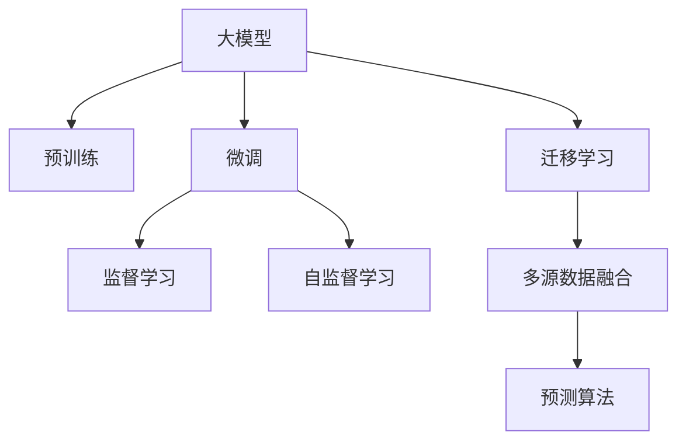

                 

# 电商平台如何利用AI大模型进行市场趋势预测

> 关键词：大模型,市场预测,电商,机器学习,深度学习,市场趋势,预测算法

## 1. 背景介绍

### 1.1 问题由来
近年来，电商平台如亚马逊、淘宝、京东等蓬勃发展，商品种类繁多，数据量庞大。电商平台需要预测市场趋势，以便在需求波动时进行库存管理、价格调整、推广策略优化，从而提高运营效率、提升客户满意度。但传统方法依赖于复杂统计模型，无法有效利用海量数据中隐藏的丰富信息，预测精度有限。

而随着人工智能（AI）和大模型的兴起，电商平台可以利用AI大模型进行市场趋势预测，大幅提升预测精度和实时性，实现智能化运营。AI大模型通过在大规模数据上进行预训练，学习到复杂的特征表示，可以更好地捕捉市场数据的复杂变化，进行精准预测。

### 1.2 问题核心关键点
预测电商市场的关键在于如何合理利用AI大模型进行高效、准确的预测。核心在于：

- 选择合适的预训练模型：当前市面上有许多预训练大模型可供选择，如BERT、GPT、T5等，如何根据电商数据特性选择合适的模型？
- 设计合理的任务适配层：如何将预训练大模型的表示进行合理适配，设计出适合电商数据的任务适配层？
- 优化预测算法：如何在微调过程中，优化模型的预测精度和速度，提升预测性能？
- 集成多源数据：如何综合利用电商平台内部的各种数据（如用户行为数据、销售数据、社交媒体数据等）进行多源数据融合，增强预测效果？
- 建立持续学习机制：如何构建模型持续学习机制，及时适应市场变化，避免模型过时？

## 2. 核心概念与联系

### 2.1 核心概念概述

为更好地理解如何利用AI大模型进行市场趋势预测，本节将介绍几个密切相关的核心概念：

- 大模型(Large Model)：指在大规模数据上预训练的深度学习模型，如BERT、GPT等，能够学习到丰富的特征表示。
- 预训练(Pre-training)：指在大规模无标签数据上，通过自监督学习任务训练大模型的过程。预训练使得模型学习到丰富的通用表示。
- 微调(Fine-tuning)：指在预训练模型的基础上，使用特定任务的数据，通过有监督学习优化模型在该任务上的性能。
- 迁移学习(Transfer Learning)：指将一个领域学习到的知识，迁移应用到另一个相关领域的学习范式。在电商市场预测中，可以利用迁移学习，先在大规模电商数据上预训练模型，然后在具体任务上微调。
- 自监督学习(Self-Supervised Learning)：指在无标签数据上，通过构建自监督任务进行模型训练，学习到有意义的表示。在电商数据中，可以利用自监督学习技术对用户行为数据等进行预处理和特征提取。
- 监督学习(Supervised Learning)：指在有标签数据上，通过构建监督学习任务进行模型训练，进行精准预测。在电商数据中，可以使用监督学习进行销售预测、用户行为预测等任务。
- 深度学习(Deep Learning)：指基于多层神经网络进行学习的模型，深度模型可以自动学习复杂的特征表示。电商数据中，利用深度学习可以捕捉到用户行为、商品特性、市场环境等复杂变化。
- 多源数据融合(Multi-Modal Data Fusion)：指综合利用不同来源的数据（如用户行为数据、销售数据、社交媒体数据等），进行融合，提升预测效果。

这些核心概念之间的逻辑关系可以通过以下Mermaid流程图来展示：



这个流程图展示了大模型在电商市场预测中的核心概念及其之间的关系：

1. 大模型通过预训练获得基础能力。
2. 微调是对预训练模型进行任务特定的优化，设计出适合电商数据的任务适配层。
3. 监督学习和自监督学习用于提升模型的预测精度。
4. 迁移学习使得模型能够在大规模电商数据上预训练，提高泛化能力。
5. 多源数据融合利用多种数据源，提升模型的预测效果。
6. 预测算法实现具体的预测功能。

这些概念共同构成了大模型在电商市场预测中的学习和应用框架，使其能够在电商数据中发挥强大的预测能力。通过理解这些核心概念，我们可以更好地把握电商市场预测的精髓和优化方向。

## 3. 核心算法原理 & 具体操作步骤
### 3.1 算法原理概述

利用AI大模型进行电商市场预测，本质上是将大模型视作一个强大的"预测器"，通过在大规模电商数据上进行预训练，学习到市场趋势的通用表示，然后利用特定的市场任务数据进行微调，使得模型能够适应具体电商市场的预测需求。

形式化地，假设预训练模型为 $M_{\theta}$，其中 $\theta$ 为预训练得到的模型参数。给定电商市场 $T$ 的历史数据集 $D=\{(x_i,y_i)\}_{i=1}^N$，市场预测任务 $P$ 的数据集 $D_P=\{(x'_j,y'_j)\}_{j=1}^{N_P}$，预测任务的目标是学习模型参数 $\hat{\theta}$，使得模型在 $P$ 任务上的预测准确度最大化：

$$
\hat{\theta}=\mathop{\arg\min}_{\theta} \mathcal{L}(M_{\theta},D_P)
$$

其中 $\mathcal{L}$ 为针对 $P$ 任务的损失函数，用于衡量模型预测与实际标签之间的差异。常见的损失函数包括均方误差损失、交叉熵损失等。

通过梯度下降等优化算法，微调过程不断更新模型参数 $\theta$，最小化损失函数 $\mathcal{L}$，使得模型预测逼近真实标签。由于 $\theta$ 已经通过预训练获得了较好的初始化，因此即便在规模较小的电商市场数据集 $D_P$ 上进行微调，也能较快收敛到理想的模型参数 $\hat{\theta}$。

### 3.2 算法步骤详解

利用AI大模型进行电商市场预测的一般包括以下几个关键步骤：

**Step 1: 准备预训练模型和数据集**
- 选择合适的预训练语言模型 $M_{\theta}$ 作为初始化参数，如 BERT、GPT等。
- 准备电商市场 $T$ 的历史数据集 $D$，划分为训练集、验证集和测试集。同时，收集电商市场 $P$ 的预测数据集 $D_P$。

**Step 2: 设计任务适配层**
- 根据电商市场 $P$ 的任务类型，在预训练模型顶层设计合适的输出层和损失函数。
- 对于分类任务，通常在顶层添加线性分类器和交叉熵损失函数。
- 对于回归任务，通常使用均方误差损失函数。

**Step 3: 设置微调超参数**
- 选择合适的优化算法及其参数，如 AdamW、SGD 等，设置学习率、批大小、迭代轮数等。
- 设置正则化技术及强度，包括权重衰减、Dropout、Early Stopping 等。
- 确定冻结预训练参数的策略，如仅微调顶层，或全部参数都参与微调。

**Step 4: 执行梯度训练**
- 将训练集数据分批次输入模型，前向传播计算损失函数。
- 反向传播计算参数梯度，根据设定的优化算法和学习率更新模型参数。
- 周期性在验证集上评估模型性能，根据性能指标决定是否触发 Early Stopping。
- 重复上述步骤直到满足预设的迭代轮数或 Early Stopping 条件。

**Step 5: 测试和部署**
- 在测试集上评估微调后模型 $M_{\hat{\theta}}$ 的性能，对比微调前后的精度提升。
- 使用微调后的模型对新样本进行预测，集成到实际的应用系统中。
- 持续收集新的数据，定期重新微调模型，以适应市场变化。

以上是利用AI大模型进行电商市场预测的一般流程。在实际应用中，还需要针对具体市场和任务的特点，对微调过程的各个环节进行优化设计，如改进训练目标函数，引入更多的正则化技术，搜索最优的超参数组合等，以进一步提升模型性能。

### 3.3 算法优缺点

利用AI大模型进行电商市场预测方法具有以下优点：

1. 预测精度高。利用大模型在电商市场数据上的预训练和微调，可以捕捉市场数据的复杂变化，提高预测精度。
2. 实时性高。基于大模型的预测算法可以高效地进行预测，快速响应市场变化。
3. 泛化能力强。通过迁移学习和大规模电商数据预训练，模型能够泛化到新的电商市场，适应不同的市场环境。
4. 可解释性强。大模型的预测过程具有较好的可解释性，有助于理解市场变化的内在机制。

同时，该方法也存在一些局限性：

1. 数据依赖性强。预测模型的效果很大程度上取决于电商市场数据的数量和质量，获取高质量数据成本较高。
2. 模型复杂度高。大模型参数量较大，计算和存储成本较高。
3. 模型风险大。电商市场数据存在噪声，大模型可能引入过拟合风险，需要额外的正则化技术控制。
4. 模型适应性差。不同电商市场的特征差异较大，单一模型难以适应所有市场。

尽管存在这些局限性，但就目前而言，利用AI大模型进行电商市场预测仍然是大模型应用的最主流范式。未来相关研究的重点在于如何进一步降低数据依赖，提高模型的泛化能力和参数效率，同时兼顾可解释性和实时性等因素。

### 3.4 算法应用领域

利用AI大模型进行电商市场预测，已经在电商领域得到了广泛的应用，覆盖了多个方面，例如：

- 销售预测：预测未来一段时间内的商品销量，进行库存管理和订单调度。
- 价格优化：根据市场需求预测，自动调整商品价格，提高销售量。
- 用户行为预测：预测用户对商品的兴趣和购买意愿，进行个性化推荐和营销。
- 竞争对手分析：预测竞争对手的市场份额和策略变化，进行市场布局和竞争应对。
- 供应链管理：预测商品供应量和需求量，优化物流和仓储资源。

除了上述这些经典应用外，大模型还被创新性地应用到更多场景中，如舆情监测、风险预警、客户服务、广告投放等，为电商技术带来了全新的突破。随着预训练模型和预测方法的不断进步，相信电商市场预测技术将在更广阔的应用领域大放异彩。

## 4. 数学模型和公式 & 详细讲解  
### 4.1 数学模型构建

本节将使用数学语言对利用AI大模型进行电商市场预测过程进行更加严格的刻画。

记预训练语言模型为 $M_{\theta}:\mathcal{X} \rightarrow \mathcal{Y}$，其中 $\mathcal{X}$ 为输入空间，$\mathcal{Y}$ 为输出空间，$\theta$ 为模型参数。假设电商市场 $P$ 的预测任务数据集为 $D_P=\{(x'_j,y'_j)\}_{j=1}^{N_P}$，预测任务的目标是学习模型参数 $\hat{\theta}$，使得模型预测与实际标签之间的损失最小化：

$$
\hat{\theta}=\mathop{\arg\min}_{\theta} \mathcal{L}(M_{\theta},D_P)
$$

其中 $\mathcal{L}$ 为针对 $P$ 任务的损失函数，可以是均方误差损失、交叉熵损失等。

在得到预测任务的目标函数后，进行微调训练，更新模型参数：

$$
\theta \leftarrow \theta - \eta \nabla_{\theta}\mathcal{L}(\theta)
$$

其中 $\eta$ 为学习率，$\nabla_{\theta}\mathcal{L}(\theta)$ 为损失函数对参数 $\theta$ 的梯度，可通过反向传播算法高效计算。

### 4.2 公式推导过程

以下我们以电商销售预测任务为例，推导均方误差损失函数及其梯度的计算公式。

假设模型 $M_{\theta}$ 在输入 $x'$ 上的输出为 $\hat{y'}=M_{\theta}(x')$，表示商品销量的预测值。真实标签 $y'$ 表示商品的实际销量。则均方误差损失函数定义为：

$$
\ell(M_{\theta}(x'),y') = \frac{1}{N_P}\sum_{j=1}^{N_P} (y'_j - \hat{y'}_j)^2
$$

将其代入经验风险公式，得：

$$
\mathcal{L}(\theta) = \frac{1}{N_P}\sum_{j=1}^{N_P} (y'_j - \hat{y'}_j)^2
$$

根据链式法则，损失函数对参数 $\theta_k$ 的梯度为：

$$
\frac{\partial \mathcal{L}(\theta)}{\partial \theta_k} = -\frac{2}{N_P}\sum_{j=1}^{N_P} (y'_j - \hat{y'}_j)\frac{\partial \hat{y'}_j}{\partial \theta_k}
$$

其中 $\frac{\partial \hat{y'}_j}{\partial \theta_k}$ 可通过链式法则递归展开，利用自动微分技术完成计算。

在得到损失函数的梯度后，即可带入参数更新公式，完成模型的迭代优化。重复上述过程直至收敛，最终得到适应电商市场预测的最优模型参数 $\hat{\theta}$。

## 5. 项目实践：代码实例和详细解释说明
### 5.1 开发环境搭建

在进行电商市场预测的微调实践前，我们需要准备好开发环境。以下是使用Python进行PyTorch开发的环境配置流程：

1. 安装Anaconda：从官网下载并安装Anaconda，用于创建独立的Python环境。

2. 创建并激活虚拟环境：
```bash
conda create -n pytorch-env python=3.8 
conda activate pytorch-env
```

3. 安装PyTorch：根据CUDA版本，从官网获取对应的安装命令。例如：
```bash
conda install pytorch torchvision torchaudio cudatoolkit=11.1 -c pytorch -c conda-forge
```

4. 安装Transformer库：
```bash
pip install transformers
```

5. 安装各类工具包：
```bash
pip install numpy pandas scikit-learn matplotlib tqdm jupyter notebook ipython
```

完成上述步骤后，即可在`pytorch-env`环境中开始微调实践。

### 5.2 源代码详细实现

这里我们以电商销售预测任务为例，给出使用Transformers库对BERT模型进行微调的PyTorch代码实现。

首先，定义销售预测任务的数据处理函数：

```python
from transformers import BertTokenizer
from torch.utils.data import Dataset
import torch

class SalesDataset(Dataset):
    def __init__(self, sales_data, sales_labels, tokenizer, max_len=128):
        self.sales_data = sales_data
        self.sales_labels = sales_labels
        self.tokenizer = tokenizer
        self.max_len = max_len
        
    def __len__(self):
        return len(self.sales_data)
    
    def __getitem__(self, item):
        sales_record = self.sales_data[item]
        sales_label = self.sales_labels[item]
        
        encoding = self.tokenizer(sales_record, return_tensors='pt', max_length=self.max_len, padding='max_length', truncation=True)
        input_ids = encoding['input_ids'][0]
        attention_mask = encoding['attention_mask'][0]
        
        # 对销售标签进行编码
        encoded_labels = [int(label) for label in sales_label] 
        encoded_labels.extend([0] * (self.max_len - len(encoded_labels)))
        labels = torch.tensor(encoded_labels, dtype=torch.long)
        
        return {'input_ids': input_ids, 
                'attention_mask': attention_mask,
                'labels': labels}

# 加载数据
tokenizer = BertTokenizer.from_pretrained('bert-base-cased')

train_dataset = SalesDataset(train_sales_data, train_sales_labels, tokenizer)
dev_dataset = SalesDataset(dev_sales_data, dev_sales_labels, tokenizer)
test_dataset = SalesDataset(test_sales_data, test_sales_labels, tokenizer)
```

然后，定义模型和优化器：

```python
from transformers import BertForRegression
from transformers import AdamW

model = BertForRegression.from_pretrained('bert-base-cased', num_labels=1)

optimizer = AdamW(model.parameters(), lr=2e-5)
```

接着，定义训练和评估函数：

```python
from torch.utils.data import DataLoader
from tqdm import tqdm
from sklearn.metrics import mean_squared_error

device = torch.device('cuda') if torch.cuda.is_available() else torch.device('cpu')
model.to(device)

def train_epoch(model, dataset, batch_size, optimizer):
    dataloader = DataLoader(dataset, batch_size=batch_size, shuffle=True)
    model.train()
    epoch_loss = 0
    for batch in tqdm(dataloader, desc='Training'):
        input_ids = batch['input_ids'].to(device)
        attention_mask = batch['attention_mask'].to(device)
        labels = batch['labels'].to(device)
        model.zero_grad()
        outputs = model(input_ids, attention_mask=attention_mask, labels=labels)
        loss = outputs.loss
        epoch_loss += loss.item()
        loss.backward()
        optimizer.step()
    return epoch_loss / len(dataloader)

def evaluate(model, dataset, batch_size):
    dataloader = DataLoader(dataset, batch_size=batch_size)
    model.eval()
    predictions, labels = [], []
    with torch.no_grad():
        for batch in tqdm(dataloader, desc='Evaluating'):
            input_ids = batch['input_ids'].to(device)
            attention_mask = batch['attention_mask'].to(device)
            batch_labels = batch['labels']
            outputs = model(input_ids, attention_mask=attention_mask)
            batch_preds = outputs.logits.item()
            batch_labels = batch_labels.to('cpu').tolist()
            for pred in batch_preds:
                predictions.append(pred)
                labels.append(batch_labels)
                
    print('Mean Squared Error:', mean_squared_error(labels, predictions))
```

最后，启动训练流程并在测试集上评估：

```python
epochs = 5
batch_size = 16

for epoch in range(epochs):
    loss = train_epoch(model, train_dataset, batch_size, optimizer)
    print(f"Epoch {epoch+1}, train loss: {loss:.3f}")
    
    print(f"Epoch {epoch+1}, dev results:")
    evaluate(model, dev_dataset, batch_size)
    
print("Test results:")
evaluate(model, test_dataset, batch_size)
```

以上就是使用PyTorch对BERT进行电商销售预测任务的微调代码实现。可以看到，得益于Transformers库的强大封装，我们可以用相对简洁的代码完成BERT模型的加载和微调。

### 5.3 代码解读与分析

让我们再详细解读一下关键代码的实现细节：

**SalesDataset类**：
- `__init__`方法：初始化销售数据、销售标签、分词器等关键组件。
- `__len__`方法：返回数据集的样本数量。
- `__getitem__`方法：对单个样本进行处理，将销售数据输入编码为token ids，将销售标签编码为数字，并对其进行定长padding，最终返回模型所需的输入。

** Mean Squared Error**：
- 定义了均方误差损失函数，用于衡量模型预测与实际标签之间的差异。

**训练和评估函数**：
- 使用PyTorch的DataLoader对数据集进行批次化加载，供模型训练和推理使用。
- 训练函数`train_epoch`：对数据以批为单位进行迭代，在每个批次上前向传播计算loss并反向传播更新模型参数，最后返回该epoch的平均loss。
- 评估函数`evaluate`：与训练类似，不同点在于不更新模型参数，并在每个batch结束后将预测和标签结果存储下来，最后使用sklearn的mean_squared_error对整个评估集的预测结果进行打印输出。

**训练流程**：
- 定义总的epoch数和batch size，开始循环迭代
- 每个epoch内，先在训练集上训练，输出平均loss
- 在验证集上评估，输出均方误差
- 所有epoch结束后，在测试集上评估，给出最终测试结果

可以看到，PyTorch配合Transformers库使得BERT微调的代码实现变得简洁高效。开发者可以将更多精力放在数据处理、模型改进等高层逻辑上，而不必过多关注底层的实现细节。

当然，工业级的系统实现还需考虑更多因素，如模型的保存和部署、超参数的自动搜索、更灵活的任务适配层等。但核心的微调范式基本与此类似。

## 6. 实际应用场景
### 6.1 智能库存管理

智能库存管理系统可以实时监控商品销售情况，自动调整库存水平，避免过剩或缺货情况。传统库存管理依赖人工统计，耗时耗力，且无法实时响应市场变化。利用大模型微调的电商市场预测方法，可以显著提升库存管理的智能化水平，减少人工干预。

具体而言，可以收集历史销售数据，提取商品属性、促销活动、季节性变化等信息，构建监督数据集。将销售数据输入大模型进行预训练和微调，得到一个预测模型。模型可以实时接收订单数据、促销活动等新信息，预测未来销售量，及时调整库存。系统还可以自动生成库存预警，避免缺货和积压情况。

### 6.2 个性化推荐系统

个性化推荐系统可以根据用户历史行为数据和市场趋势预测，为用户推荐相关商品，提升用户体验。传统推荐系统往往只依赖用户历史行为数据进行推荐，无法充分考虑市场变化的影响。利用大模型微调的电商市场预测方法，可以结合市场趋势预测，提升推荐效果。

具体而言，可以收集用户浏览、点击、购买等行为数据，提取商品标题、描述、标签等文本信息，构建监督数据集。将文本数据输入大模型进行预训练和微调，得到一个预测模型。模型可以预测用户对不同商品的兴趣和购买意愿，结合市场趋势预测，生成个性化推荐列表。系统还可以动态更新推荐模型，根据市场变化调整推荐策略。

### 6.3 价格优化策略

价格优化策略可以根据市场预测结果，动态调整商品价格，提高销售量和利润。传统价格策略依赖人工经验和市场调研，难以及时响应市场变化。利用大模型微调的电商市场预测方法，可以实时监控市场变化，自动调整价格策略。

具体而言，可以收集历史销售数据、市场环境、竞争情况等信息，构建监督数据集。将数据输入大模型进行预训练和微调，得到一个预测模型。模型可以实时接收市场变化信息，预测商品价格对销售量的影响，自动调整价格策略。系统还可以生成价格预警，及时应对市场波动。

### 6.4 未来应用展望

随着大模型和微调方法的不断发展，利用AI大模型进行电商市场预测将具有广阔的应用前景，为电商技术带来新的突破。

在智慧零售领域，基于市场预测的智能库存管理、个性化推荐系统、价格优化策略等应用，可以大幅提升零售运营效率，提升用户体验。

在供应链管理中，市场预测可以优化供应链资源配置，减少库存成本，提升供应链灵活性。

在金融风控领域，基于市场预测的风险预警系统，可以及时发现市场风险，规避投资损失。

此外，在市场营销、广告投放等诸多领域，基于市场预测的市场策略优化，可以提升广告投放效果，增加市场营销的精准性。

总之，利用AI大模型进行电商市场预测，必将在更多领域得到应用，为电商技术的发展带来新的动力。相信随着技术的不断进步，电商市场预测技术将变得更加智能、高效、精准。

## 7. 工具和资源推荐
### 7.1 学习资源推荐

为了帮助开发者系统掌握大模型微调的电商市场预测的理论基础和实践技巧，这里推荐一些优质的学习资源：

1. 《Transformer from Pre-training to Transfer Learning》系列博文：由大模型技术专家撰写，深入浅出地介绍了Transformer原理、BERT模型、电商市场预测等前沿话题。

2. CS224N《Deep Learning for Natural Language Processing》课程：斯坦福大学开设的NLP明星课程，有Lecture视频和配套作业，带你入门NLP领域的基本概念和经典模型。

3. 《Natural Language Processing with Transformers》书籍：Transformers库的作者所著，全面介绍了如何使用Transformers库进行NLP任务开发，包括电商市场预测在内的诸多范式。

4. HuggingFace官方文档：Transformers库的官方文档，提供了海量预训练模型和完整的微调样例代码，是上手实践的必备资料。

5. Kaggle电商数据集：Kaggle平台上丰富的电商数据集，涵盖多种电商市场和预测任务，可进行多轮模型调优和对比。

通过对这些资源的学习实践，相信你一定能够快速掌握大模型微调的电商市场预测的精髓，并用于解决实际的电商问题。
###  7.2 开发工具推荐

高效的开发离不开优秀的工具支持。以下是几款用于大模型微调开发的常用工具：

1. PyTorch：基于Python的开源深度学习框架，灵活动态的计算图，适合快速迭代研究。大部分预训练语言模型都有PyTorch版本的实现。

2. TensorFlow：由Google主导开发的开源深度学习框架，生产部署方便，适合大规模工程应用。同样有丰富的预训练语言模型资源。

3. Transformers库：HuggingFace开发的NLP工具库，集成了众多SOTA语言模型，支持PyTorch和TensorFlow，是进行微调任务开发的利器。

4. Weights & Biases：模型训练的实验跟踪工具，可以记录和可视化模型训练过程中的各项指标，方便对比和调优。与主流深度学习框架无缝集成。

5. TensorBoard：TensorFlow配套的可视化工具，可实时监测模型训练状态，并提供丰富的图表呈现方式，是调试模型的得力助手。

6. Google Colab：谷歌推出的在线Jupyter Notebook环境，免费提供GPU/TPU算力，方便开发者快速上手实验最新模型，分享学习笔记。

合理利用这些工具，可以显著提升大模型微调任务的开发效率，加快创新迭代的步伐。

### 7.3 相关论文推荐

大模型和微调技术的发展源于学界的持续研究。以下是几篇奠基性的相关论文，推荐阅读：

1. Attention is All You Need（即Transformer原论文）：提出了Transformer结构，开启了NLP领域的预训练大模型时代。

2. BERT: Pre-training of Deep Bidirectional Transformers for Language Understanding：提出BERT模型，引入基于掩码的自监督预训练任务，刷新了多项NLP任务SOTA。

3. Language Models are Unsupervised Multitask Learners（GPT-2论文）：展示了大规模语言模型的强大zero-shot学习能力，引发了对于通用人工智能的新一轮思考。

4. Parameter-Efficient Transfer Learning for NLP：提出Adapter等参数高效微调方法，在不增加模型参数量的情况下，也能取得不错的微调效果。

5. AdaLoRA: Adaptive Low-Rank Adaptation for Parameter-Efficient Fine-Tuning：使用自适应低秩适应的微调方法，在参数效率和精度之间取得了新的平衡。

这些论文代表了大模型和微调技术的发展脉络。通过学习这些前沿成果，可以帮助研究者把握学科前进方向，激发更多的创新灵感。

## 8. 总结：未来发展趋势与挑战
### 8.1 总结

本文对利用AI大模型进行电商市场预测的方法进行了全面系统的介绍。首先阐述了电商市场预测的背景和重要性，明确了利用大模型进行预测的核心思想和方法。其次，从原理到实践，详细讲解了电商市场预测的数学原理和关键步骤，给出了微调任务开发的完整代码实例。同时，本文还广泛探讨了市场预测在智能库存管理、个性化推荐系统、价格优化策略等多个电商领域的应用前景，展示了市场预测的巨大潜力。此外，本文精选了市场预测技术的各类学习资源，力求为读者提供全方位的技术指引。

通过本文的系统梳理，可以看到，利用AI大模型进行电商市场预测已经在大规模电商数据上取得了显著效果，大幅提升了电商运营的智能化水平。未来，伴随大模型和微调方法的持续演进，基于市场预测的技术将在更广阔的电商场景中大放异彩，为电商技术的发展带来新的动力。

### 8.2 未来发展趋势

展望未来，基于AI大模型的电商市场预测技术将呈现以下几个发展趋势：

1. 模型规模持续增大。随着算力成本的下降和数据规模的扩张，预训练大模型的参数量还将持续增长。超大规模大模型蕴含的丰富市场知识，有望进一步提升预测精度。

2. 微调方法日趋多样。除了传统的全参数微调外，未来会涌现更多参数高效的微调方法，如Adapter、LoRA等，在节省计算资源的同时也能保证微调精度。

3. 持续学习成为常态。随着市场数据的不断变化，微调模型也需要持续学习新知识以保持性能。如何在不遗忘原有知识的同时，高效吸收新样本信息，将成为重要的研究课题。

4. 标注样本需求降低。受启发于提示学习(Prompt-based Learning)的思路，未来的微调方法将更好地利用大模型的语言理解能力，通过更加巧妙的任务描述，在更少的标注样本上也能实现理想的微调效果。

5. 多源数据融合崛起。未来的市场预测系统将综合利用电商平台内部的各种数据（如用户行为数据、销售数据、社交媒体数据等）进行多源数据融合，提升预测效果。

6. 模型通用性增强。经过海量数据的预训练和多领域任务的微调，未来的语言模型将具备更强大的市场趋势预测能力，逐步迈向通用人工智能(AGI)的目标。

以上趋势凸显了基于AI大模型的电商市场预测技术的广阔前景。这些方向的探索发展，必将进一步提升市场预测的精度和实时性，为电商运营提供更强大的智能支撑。

### 8.3 面临的挑战

尽管利用AI大模型进行电商市场预测技术已经取得了瞩目成就，但在迈向更加智能化、普适化应用的过程中，它仍面临着诸多挑战：

1. 数据依赖性强。预测模型的效果很大程度上取决于电商市场数据的数量和质量，获取高质量数据成本较高。如何进一步降低微调对标注样本的依赖，将是一大难题。

2. 模型鲁棒性不足。电商市场数据存在噪声，大模型可能引入过拟合风险，需要额外的正则化技术控制。如何提高模型鲁棒性，避免过拟合，还需要更多理论和实践的积累。

3. 模型复杂度高。大模型参数量较大，计算和存储成本较高。如何降低模型复杂度，提升推理效率，优化资源占用，将是重要的优化方向。

4. 模型适应性差。不同电商市场的特征差异较大，单一模型难以适应所有市场。如何构建市场预测模型，适应不同电商市场，将是一大挑战。

5. 模型风险大。电商市场数据存在噪声，大模型可能引入过拟合风险，需要额外的正则化技术控制。如何提高模型鲁棒性，避免过拟合，还需要更多理论和实践的积累。

尽管存在这些挑战，但就目前而言，利用AI大模型进行电商市场预测仍然是大模型应用的最主流范式。未来相关研究的重点在于如何进一步降低数据依赖，提高模型的泛化能力和参数效率，同时兼顾可解释性和实时性等因素。

### 8.4 研究展望

面对电商市场预测所面临的种种挑战，未来的研究需要在以下几个方面寻求新的突破：

1. 探索无监督和半监督微调方法。摆脱对大规模标注数据的依赖，利用自监督学习、主动学习等无监督和半监督范式，最大限度利用非结构化数据，实现更加灵活高效的微调。

2. 研究参数高效和计算高效的微调范式。开发更加参数高效的微调方法，在固定大部分预训练参数的同时，只更新极少量的任务相关参数。同时优化微调模型的计算图，减少前向传播和反向传播的资源消耗，实现更加轻量级、实时性的部署。

3. 融合因果和对比学习范式。通过引入因果推断和对比学习思想，增强市场预测模型建立稳定因果关系的能力，学习更加普适、鲁棒的市场趋势预测。

4. 引入更多先验知识。将符号化的先验知识，如知识图谱、逻辑规则等，与神经网络模型进行巧妙融合，引导市场预测过程学习更准确、合理的市场趋势。

5. 结合因果分析和博弈论工具。将因果分析方法引入市场预测模型，识别出模型决策的关键特征，增强输出解释的因果性和逻辑性。借助博弈论工具刻画人机交互过程，主动探索并规避模型的脆弱点，提高系统稳定性。

6. 纳入伦理道德约束。在模型训练目标中引入伦理导向的评估指标，过滤和惩罚有偏见、有害的输出倾向。同时加强人工干预和审核，建立模型行为的监管机制，确保输出符合人类价值观和伦理道德。

这些研究方向的探索，必将引领基于AI大模型的电商市场预测技术迈向更高的台阶，为构建智能化的电商运营系统铺平道路。面向未来，基于市场预测的大模型技术还需要与其他人工智能技术进行更深入的融合，如知识表示、因果推理、强化学习等，多路径协同发力，共同推动电商市场预测系统的进步。只有勇于创新、敢于突破，才能不断拓展市场预测的边界，让智能技术更好地造福电商行业。

## 9. 附录：常见问题与解答

**Q1：大模型微调是否适用于所有电商市场？**

A: 大模型微调在大多数电商市场预测中都能取得不错的效果，特别是对于数据量较大的市场。但对于一些特定市场的预测，如极端小众市场，由于数据量过少，单一模型可能难以取得理想效果。此时需要在特定市场数据上进行微调，或者结合多模型集成等方法，提升预测效果。

**Q2：如何选择合适的大模型进行电商市场预测？**

A: 选择合适的预训练大模型是市场预测成功的关键。通常而言，可以选择与电商数据特性相匹配的大模型。例如，如果电商数据主要涉及文本描述和用户评论，可以选择BERT、GPT等文本处理模型；如果电商数据包含图像信息，可以选择VGG、ResNet等图像处理模型。此外，还可以在大模型基础上进行微调，根据具体任务特点进行调整。

**Q3：大模型微调过程中如何防止过拟合？**

A: 防止过拟合是市场预测微调过程中需要重点考虑的问题。以下是一些常见的方法：
1. 数据增强：通过回译、近义替换等方式扩充训练集
2. 正则化：使用L2正则、Dropout、Early Stopping等避免过拟合
3. 对抗训练：加入对抗样本，提高模型鲁棒性
4. 参数高效微调：只调整少量参数(如Adapter、Prefix等)，减小过拟合风险
5. 多模型集成：训练多个微调模型，取平均输出，抑制过拟合

这些策略往往需要根据具体任务和数据特点进行灵活组合。只有在数据、模型、训练、推理等各环节进行全面优化，才能最大限度地发挥大模型微调的威力。

**Q4：大模型微调与传统统计模型有何区别？**

A: 大模型微调与传统统计模型的区别主要在于数据处理和模型训练方式。传统统计模型依赖于复杂统计模型和手工特征工程，数据处理复杂，模型训练较慢。而大模型微调则利用深度学习自动提取数据特征，训练速度快，预测精度高。此外，大模型微调还能处理复杂的非结构化数据，如文本、图像等，具有更强的泛化能力。但大模型微调需要大规模数据和计算资源，对数据质量和标注成本要求较高。

**Q5：大模型微调在电商市场预测中的优势和劣势？**

A: 大模型微调在电商市场预测中的优势在于：
1. 预测精度高。利用大模型在电商市场数据上的预训练和微调，可以捕捉市场数据的复杂变化，提高预测精度。
2. 实时性高。基于大模型的预测算法可以高效地进行预测，快速响应市场变化。
3. 泛化能力强。通过迁移学习和大规模电商数据预训练，模型能够泛化到新的电商市场，适应不同的市场环境。

但大模型微调也存在一些局限性：
1. 数据依赖性强。预测模型的效果很大程度上取决于电商市场数据的数量和质量，获取高质量数据成本较高。
2. 模型复杂度高。大模型参数量较大，计算和存储成本较高。
3. 模型风险大。电商市场数据存在噪声，大模型可能引入过拟合风险，需要额外的正则化技术控制。

尽管存在这些局限性，但就目前而言，利用AI大模型进行电商市场预测仍然是大模型应用的最主流范式。未来相关研究的重点在于如何进一步降低数据依赖，提高模型的泛化能力和参数效率，同时兼顾可解释性和实时性等因素。

**Q6：大模型微调与传统机器学习模型的区别？**

A: 大模型微调与传统机器学习模型的区别主要在于模型规模和训练方式。传统机器学习模型参数量较小，训练时间较短，但数据处理能力有限，难以处理复杂的非结构化数据。而大模型微调则利用大规模预训练模型，自动学习数据特征，能够处理复杂的非结构化数据，具有更强的泛化能力。此外，大模型微调还能利用多源数据融合，提升预测效果。但大模型微调需要大规模数据和计算资源，对数据质量和标注成本要求较高。

---

作者：禅与计算机程序设计艺术 / Zen and the Art of Computer Programming

