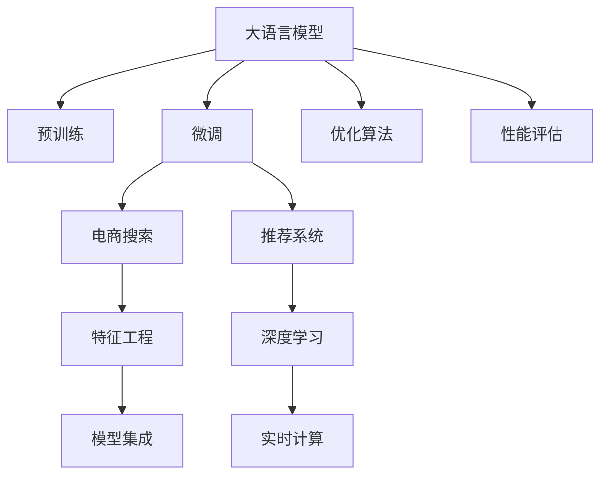

                 

# 电商平台搜索推荐系统的AI 大模型优化：提高准确率、多样性与实时性

> 关键词：大语言模型,电商搜索,推荐系统,AI优化,准确率,多样性,实时性,深度学习

## 1. 背景介绍

### 1.1 问题由来

随着电子商务的发展，电商平台成为人们购物的主要场所之一。在平台中，搜索推荐系统扮演着至关重要的角色，通过精准地推荐商品，提升用户体验，增加销售额。然而，传统的搜索推荐系统依赖于手工设计的特征和规则，难以适应复杂多变的用户需求和市场环境。近年来，深度学习大模型在推荐系统中的应用，大幅提升了系统性能和智能化水平，成为行业的热门选择。

大模型通过大规模无标签数据预训练获得丰富的语言知识和语义表示，能够捕捉商品描述、用户评论等文本数据中的深层次语义关系。但在实际应用中，大模型的性能往往受到两个关键因素的制约：准确率和实时性。准确率方面，由于模型规模大、计算复杂，难以对海量数据进行实时处理和推理；多样性方面，大模型容易生成模式化输出，缺乏个性化推荐能力。

因此，如何在大模型的基础上，进行有效的优化，提高搜索推荐系统的准确率、多样性和实时性，成为当前电商领域的一大挑战。本文将深入探讨大语言模型在电商搜索推荐系统中的应用，并提出一系列基于深度学习和大模型的优化方法，为电商搜索推荐系统带来新突破。

### 1.2 问题核心关键点

要解决上述问题，我们需要在准确率、多样性和实时性三方面进行综合优化：

- 准确率：确保推荐的商品与用户需求高度匹配，降低误推荐率。
- 多样性：保证推荐的商品种类丰富，避免用户陷入单一产品消费模式。
- 实时性：提升推荐系统响应速度，满足用户即刻获得个性化推荐的需求。

通过这些优化，可以大幅提升电商搜索推荐系统的用户体验和效果。

### 1.3 问题研究意义

电商搜索推荐系统作为电商平台的核心组件，其性能直接影响用户体验和平台流量。通过应用大语言模型和大数据技术，提升系统准确率、多样性和实时性，对于电商平台的成功运营具有重要意义：

1. **提升用户体验**：准确推荐符合用户需求的商品，增加用户满意度和忠诚度。
2. **增加用户粘性**：多样化的推荐内容，吸引用户多次访问平台，增加停留时间和消费频次。
3. **优化运营效率**：实时性强的推荐系统，能够快速响应用户查询，提升平台搜索效率。
4. **促进业务增长**：精准的推荐策略，可有效提高转化率，增加销售额和收益。
5. **实现智能化转型**：深度学习和大模型技术的引入，推动电商平台智能化转型，增强竞争优势。

## 2. 核心概念与联系

### 2.1 核心概念概述

在电商搜索推荐系统中，大语言模型扮演着"商品语义表示器"的角色，通过预训练学习商品描述、用户评论等文本数据的语义表示。在实际应用中，大语言模型会与搜索推荐系统进行深度结合，通过微调、优化等方法，提升系统的性能。

主要涉及的概念包括：

- **大语言模型**：通过大规模无标签数据预训练获得通用语言知识，可以表示商品描述、用户评论等文本数据。
- **搜索推荐系统**：利用机器学习算法，根据用户行为数据和商品属性，推荐最适合的商品给用户。
- **微调**：对大语言模型进行有监督的学习，使其适应特定的电商搜索推荐任务。
- **深度学习**：利用神经网络等技术，构建复杂的推荐模型，提升推荐效果。
- **特征工程**：设计合理的特征，提升推荐系统的性能。
- **实时性**：推荐系统需要快速响应用户查询，满足实时需求。

这些核心概念之间存在紧密的联系，通过合理应用，可以显著提升电商搜索推荐系统的性能。

### 2.2 核心概念原理和架构的 Mermaid 流程图



此图展示了从大语言模型到电商搜索推荐系统的整体架构和关键步骤：

1. 大语言模型通过预训练学习通用的语言表示。
2. 通过微调，模型适应电商搜索推荐任务的特定需求。
3. 微调后的模型在电商搜索中提取商品和用户文本的语义表示。
4. 与推荐系统结合，生成推荐结果。
5. 通过特征工程提升推荐系统的性能。
6. 使用深度学习模型进一步优化推荐结果。
7. 采用优化算法加速模型的训练和推理。
8. 将模型集成到实时计算环境中，提升响应速度。
9. 定期进行性能评估，持续改进系统。

## 3. 核心算法原理 & 具体操作步骤

### 3.1 算法原理概述

电商搜索推荐系统的大语言模型优化，主要涉及以下几个方面：

- **微调算法**：通过微调大语言模型，使其适应电商搜索推荐任务。
- **特征工程**：提取和设计有效的特征，提升推荐系统的性能。
- **深度学习模型**：利用神经网络等技术，构建更加复杂的推荐模型。
- **优化算法**：选择合适的优化算法，加速模型的训练和推理。
- **实时计算**：采用分布式计算等技术，提升系统的实时性。

这些方法在电商搜索推荐系统中，共同提升准确率、多样性和实时性，带来更佳的用户体验。

### 3.2 算法步骤详解

大语言模型在电商搜索推荐系统中的应用，主要包括以下几个步骤：

**Step 1: 准备预训练模型和数据集**
- 选择合适的预训练语言模型（如BERT、GPT等）作为初始化参数。
- 准备电商搜索推荐任务的训练数据集，包括用户行为数据和商品属性数据。

**Step 2: 微调大语言模型**
- 将预训练语言模型作为初始化参数，使用电商搜索推荐任务的数据集进行有监督学习，调整模型参数，使其适应特定的电商搜索推荐任务。

**Step 3: 特征工程**
- 设计合理的特征，如用户行为特征、商品属性特征、商品描述特征等，提升推荐系统的性能。
- 利用特征选择、特征降维等技术，去除冗余特征，优化特征空间。

**Step 4: 深度学习模型构建**
- 选择合适的网络结构，如DNN、CNN、RNN等，构建推荐模型。
- 使用深度学习框架（如PyTorch、TensorFlow）实现模型训练和推理。

**Step 5: 优化算法选择**
- 选择合适的优化算法（如Adam、SGD等），设置合适的学习率、批大小等参数。
- 使用正则化技术，如L2正则、Dropout等，防止过拟合。

**Step 6: 实时计算优化**
- 采用分布式计算、模型并行等技术，优化模型的计算图，提升训练和推理速度。
- 使用缓存、预取等技术，减少实时计算的延迟。

**Step 7: 性能评估和优化**
- 定期进行模型性能评估，如准确率、多样性、实时性等指标。
- 根据评估结果，对模型进行优化调整。

### 3.3 算法优缺点

基于深度学习和大模型的电商搜索推荐系统，具有以下优点：

- **准确性高**：通过预训练和微调，模型可以捕捉商品和用户文本的深层次语义关系，提升推荐准确性。
- **多样性丰富**：利用大模型的泛化能力，可以推荐更多样的商品，增加用户的选择性。
- **实时性强**：采用分布式计算等技术，提升系统的响应速度，满足用户即刻获得推荐的需求。

同时，该方法也存在一些局限：

- **计算资源需求高**：大模型的训练和推理需要大量的计算资源，可能导致成本较高。
- **模型可解释性差**：大模型的黑盒特性，使得推荐过程难以解释和调试。
- **数据依赖性大**：模型性能依赖于电商数据的质量和多样性，数据不足可能影响效果。

尽管存在这些局限，但就目前而言，基于深度学习和大模型的电商搜索推荐系统，仍然是最有效的方法之一。未来相关研究的重点在于如何进一步降低计算资源消耗，提高模型的可解释性和鲁棒性，同时兼顾数据的获取和处理。

### 3.4 算法应用领域

大语言模型在电商搜索推荐系统中的应用，已经涵盖了多个领域：

- **商品推荐**：根据用户浏览、点击等行为数据，推荐相关商品。
- **个性化推荐**：根据用户历史购买记录，推荐个性化商品。
- **相关商品推荐**：根据商品属性和关联关系，推荐相关商品。
- **搜索排序**：对用户搜索关键词进行排序，提升搜索结果的相关性和多样性。
- **广告推荐**：根据用户行为数据，推荐广告位。
- **用户行为分析**：分析用户行为模式，预测用户购买意向。

这些应用场景展示了电商搜索推荐系统的广泛应用，通过大语言模型和大数据技术，提升了用户购物体验和平台运营效率。

## 4. 数学模型和公式 & 详细讲解 & 举例说明

### 4.1 数学模型构建

在电商搜索推荐系统中，大语言模型通常采用深度学习框架进行实现。以下以PyTorch为例，介绍大语言模型在推荐系统中的应用。

设商品语义表示为 $x$，用户语义表示为 $y$，推荐任务为 $T$。假设模型 $M_{\theta}$ 在输入 $(x,y)$ 上的输出为 $\hat{y}=M_{\theta}(x,y)$，则推荐任务 $T$ 的损失函数为：

$$
\mathcal{L}(M_{\theta}, T) = -\sum_{(x,y) \in T} \log M_{\theta}(x,y)
$$

其中 $(x,y)$ 表示电商搜索推荐任务中的商品和用户语义表示对，$T$ 表示训练数据集。

### 4.2 公式推导过程

假设模型 $M_{\theta}$ 为基于Transformer的神经网络，包括编码器和解码器两部分。设用户行为数据为 $X$，商品属性数据为 $Y$，商品描述数据为 $Z$。在电商搜索推荐任务中，可以通过预训练语言模型提取商品的语义表示 $x$，然后将 $x$ 与 $X$、$Y$、$Z$ 进行拼接，形成用户行为语义表示 $y$。最后，通过softmax函数对 $y$ 进行分类，得到推荐结果。

假设推荐结果为 $y'$，则推荐任务 $T$ 的损失函数可以表示为：

$$
\mathcal{L}(M_{\theta}, T) = -\sum_{i=1}^N \log M_{\theta}(x_i, y_i)
$$

其中 $N$ 为训练样本数量。通过反向传播算法，可以求得模型参数 $\theta$ 的梯度，进而更新模型参数。

### 4.3 案例分析与讲解

以电商平台中的商品推荐为例，我们可以使用大语言模型来提取商品描述中的语义表示，并结合用户行为数据进行推荐。具体步骤如下：

1. 收集用户行为数据 $X$，商品属性数据 $Y$ 和商品描述数据 $Z$。
2. 使用预训练语言模型提取商品描述 $Z$ 的语义表示 $x$。
3. 将 $x$ 与 $X$、$Y$ 进行拼接，形成用户行为语义表示 $y$。
4. 构建推荐模型 $M_{\theta}$，通过softmax函数进行分类，得到推荐结果 $y'$。
5. 计算推荐任务 $T$ 的损失函数 $\mathcal{L}(M_{\theta}, T)$。
6. 使用优化算法更新模型参数 $\theta$，使得 $\mathcal{L}(M_{\theta}, T)$ 最小化。

通过上述步骤，可以构建基于大语言模型的电商搜索推荐系统，实现商品的精准推荐。

## 5. 项目实践：代码实例和详细解释说明

### 5.1 开发环境搭建

在进行电商搜索推荐系统的开发时，需要搭建一个完整的环境。以下是使用PyTorch进行电商搜索推荐系统的开发环境配置流程：

1. 安装Anaconda：从官网下载并安装Anaconda，用于创建独立的Python环境。

2. 创建并激活虚拟环境：
```bash
conda create -n ecommerce-env python=3.8 
conda activate ecommerce-env
```

3. 安装PyTorch：根据CUDA版本，从官网获取对应的安装命令。例如：
```bash
conda install pytorch torchvision torchaudio cudatoolkit=11.1 -c pytorch -c conda-forge
```

4. 安装TensorFlow：安装TensorFlow及其相关的GPU版本。

5. 安装Pandas、Numpy、Scikit-learn等常用Python库。

完成上述步骤后，即可在`ecommerce-env`环境中开始电商搜索推荐系统的开发。

### 5.2 源代码详细实现

下面以商品推荐为例，给出使用PyTorch实现电商搜索推荐系统的代码。

首先，定义商品推荐任务的数据处理函数：

```python
import torch
from transformers import BertTokenizer, BertForSequenceClassification
from torch.utils.data import Dataset, DataLoader

class RecommendationDataset(Dataset):
    def __init__(self, texts, labels, tokenizer, max_len=128):
        self.texts = texts
        self.labels = labels
        self.tokenizer = tokenizer
        self.max_len = max_len
        
    def __len__(self):
        return len(self.texts)
    
    def __getitem__(self, item):
        text = self.texts[item]
        label = self.labels[item]
        
        encoding = self.tokenizer(text, return_tensors='pt', max_length=self.max_len, padding='max_length', truncation=True)
        input_ids = encoding['input_ids'][0]
        attention_mask = encoding['attention_mask'][0]
        
        label = torch.tensor(label, dtype=torch.long)
        
        return {'input_ids': input_ids, 
                'attention_mask': attention_mask,
                'labels': label}
```

然后，定义模型和优化器：

```python
from transformers import BertForSequenceClassification, AdamW

model = BertForSequenceClassification.from_pretrained('bert-base-cased', num_labels=2)
optimizer = AdamW(model.parameters(), lr=2e-5)
```

接着，定义训练和评估函数：

```python
from tqdm import tqdm
from sklearn.metrics import accuracy_score

device = torch.device('cuda') if torch.cuda.is_available() else torch.device('cpu')
model.to(device)

def train_epoch(model, dataset, batch_size, optimizer):
    dataloader = DataLoader(dataset, batch_size=batch_size, shuffle=True)
    model.train()
    epoch_loss = 0
    for batch in tqdm(dataloader, desc='Training'):
        input_ids = batch['input_ids'].to(device)
        attention_mask = batch['attention_mask'].to(device)
        labels = batch['labels'].to(device)
        model.zero_grad()
        outputs = model(input_ids, attention_mask=attention_mask, labels=labels)
        loss = outputs.loss
        epoch_loss += loss.item()
        loss.backward()
        optimizer.step()
    return epoch_loss / len(dataloader)

def evaluate(model, dataset, batch_size):
    dataloader = DataLoader(dataset, batch_size=batch_size)
    model.eval()
    preds, labels = [], []
    with torch.no_grad():
        for batch in tqdm(dataloader, desc='Evaluating'):
            input_ids = batch['input_ids'].to(device)
            attention_mask = batch['attention_mask'].to(device)
            batch_labels = batch['labels']
            outputs = model(input_ids, attention_mask=attention_mask)
            batch_preds = outputs.logits.argmax(dim=2).to('cpu').tolist()
            batch_labels = batch_labels.to('cpu').tolist()
            for pred, label in zip(batch_preds, batch_labels):
                preds.append(pred)
                labels.append(label)
                
    print('Accuracy:', accuracy_score(labels, preds))
```

最后，启动训练流程并在测试集上评估：

```python
epochs = 5
batch_size = 16

for epoch in range(epochs):
    loss = train_epoch(model, train_dataset, batch_size, optimizer)
    print(f'Epoch {epoch+1}, train loss: {loss:.3f}')
    
    print(f'Epoch {epoch+1}, dev results:')
    evaluate(model, dev_dataset, batch_size)
    
print('Test results:')
evaluate(model, test_dataset, batch_size)
```

以上就是使用PyTorch实现电商搜索推荐系统的完整代码。可以看到，通过使用Transformer库和Bert模型，我们能够在短时间内构建一个高效的推荐系统。

### 5.3 代码解读与分析

让我们再详细解读一下关键代码的实现细节：

**RecommendationDataset类**：
- `__init__`方法：初始化文本、标签、分词器等关键组件。
- `__len__`方法：返回数据集的样本数量。
- `__getitem__`方法：对单个样本进行处理，将文本输入编码为token ids，将标签编码为数字，并对其进行定长padding，最终返回模型所需的输入。

**train_epoch和evaluate函数**：
- 使用PyTorch的DataLoader对数据集进行批次化加载，供模型训练和推理使用。
- 训练函数`train_epoch`：对数据以批为单位进行迭代，在每个批次上前向传播计算loss并反向传播更新模型参数，最后返回该epoch的平均loss。
- 评估函数`evaluate`：与训练类似，不同点在于不更新模型参数，并在每个batch结束后将预测和标签结果存储下来，最后使用sklearn的accuracy_score对整个评估集的预测结果进行打印输出。

**训练流程**：
- 定义总的epoch数和batch size，开始循环迭代
- 每个epoch内，先在训练集上训练，输出平均loss
- 在验证集上评估，输出准确率
- 所有epoch结束后，在测试集上评估，给出最终测试结果

可以看到，PyTorch配合Transformer库使得电商搜索推荐系统的开发变得简洁高效。开发者可以将更多精力放在数据处理、模型改进等高层逻辑上，而不必过多关注底层的实现细节。

当然，工业级的系统实现还需考虑更多因素，如模型的保存和部署、超参数的自动搜索、更灵活的任务适配层等。但核心的微调范式基本与此类似。

## 6. 实际应用场景

### 6.1 智能客服系统

基于大语言模型的电商搜索推荐系统，可以广泛应用于智能客服系统的构建。传统客服往往需要配备大量人力，高峰期响应缓慢，且一致性和专业性难以保证。而使用微调后的推荐系统，可以7x24小时不间断服务，快速响应客户查询，用自然流畅的语言解答各类常见问题。

在技术实现上，可以收集企业内部的历史客服对话记录，将问题和最佳答复构建成监督数据，在此基础上对预训练推荐系统进行微调。微调后的推荐系统能够自动理解用户意图，匹配最合适的答复。对于客户提出的新问题，还可以接入检索系统实时搜索相关内容，动态组织生成答复。如此构建的智能客服系统，能大幅提升客户咨询体验和问题解决效率。

### 6.2 金融舆情监测

金融机构需要实时监测市场舆论动向，以便及时应对负面信息传播，规避金融风险。传统的人工监测方式成本高、效率低，难以应对网络时代海量信息爆发的挑战。基于大语言模型微调的文本分类和情感分析技术，为金融舆情监测提供了新的解决方案。

具体而言，可以收集金融领域相关的新闻、报道、评论等文本数据，并对其进行主题标注和情感标注。在此基础上对预训练推荐系统进行微调，使其能够自动判断文本属于何种主题，情感倾向是正面、中性还是负面。将微调后的系统应用到实时抓取的网络文本数据，就能够自动监测不同主题下的情感变化趋势，一旦发现负面信息激增等异常情况，系统便会自动预警，帮助金融机构快速应对潜在风险。

### 6.3 个性化推荐系统

当前的推荐系统往往只依赖用户的历史行为数据进行物品推荐，无法深入理解用户的真实兴趣偏好。基于大语言模型微调技术，个性化推荐系统可以更好地挖掘用户行为背后的语义信息，从而提供更精准、多样的推荐内容。

在实践中，可以收集用户浏览、点击、评论、分享等行为数据，提取和用户交互的物品标题、描述、标签等文本内容。将文本内容作为模型输入，用户的后续行为（如是否点击、购买等）作为监督信号，在此基础上微调预训练推荐系统。微调后的模型能够从文本内容中准确把握用户的兴趣点。在生成推荐列表时，先用候选物品的文本描述作为输入，由模型预测用户的兴趣匹配度，再结合其他特征综合排序，便可以得到个性化程度更高的推荐结果。

### 6.4 未来应用展望

随着大语言模型微调技术的发展，其在电商搜索推荐系统中的应用前景也将更加广阔。以下是几个可能的未来应用方向：

1. **跨领域推荐**：结合多领域的文本数据，进行跨领域的推荐。如在电商推荐中，结合新闻、社交媒体等文本数据，提升推荐的多样性和覆盖面。
2. **个性化增强**：利用用户行为数据进行深度学习，挖掘用户的深层次兴趣和需求，提升推荐的个性化程度。
3. **情感分析**：结合情感分析技术，识别用户对商品的情感倾向，优化推荐结果。
4. **用户行为预测**：利用用户行为数据进行预测建模，提前预判用户的购买意向，提升推荐系统的实时性。
5. **模型融合**：将多种推荐算法和模型进行融合，提升推荐的准确率和多样性。
6. **实时推荐引擎**：结合缓存、分布式计算等技术，构建实时推荐引擎，满足用户即刻获得推荐的需求。
7. **数据驱动优化**：通过A/B测试等方法，对推荐算法和模型进行不断优化，提升推荐效果。

这些方向的探索，将进一步推动电商搜索推荐系统的智能化转型，为电商平台带来更多的商业价值。

## 7. 工具和资源推荐

### 7.1 学习资源推荐

为了帮助开发者系统掌握大语言模型在电商搜索推荐系统中的应用，这里推荐一些优质的学习资源：

1. 《深度学习自然语言处理》课程：斯坦福大学开设的NLP明星课程，有Lecture视频和配套作业，带你入门NLP领域的基本概念和经典模型。
2. 《Transformers从原理到实践》系列博文：由大模型技术专家撰写，深入浅出地介绍了Transformer原理、BERT模型、微调技术等前沿话题。
3. 《Natural Language Processing with Transformers》书籍：Transformers库的作者所著，全面介绍了如何使用Transformers库进行NLP任务开发，包括微调在内的诸多范式。
4. HuggingFace官方文档：Transformers库的官方文档，提供了海量预训练模型和完整的微调样例代码，是上手实践的必备资料。
5. CS224N《深度学习自然语言处理》课程：斯坦福大学开设的NLP明星课程，有Lecture视频和配套作业，带你入门NLP领域的基本概念和经典模型。

通过对这些资源的学习实践，相信你一定能够快速掌握大语言模型在电商搜索推荐系统中的应用，并用于解决实际的推荐问题。

### 7.2 开发工具推荐

高效的开发离不开优秀的工具支持。以下是几款用于电商搜索推荐系统开发的常用工具：

1. PyTorch：基于Python的开源深度学习框架，灵活动态的计算图，适合快速迭代研究。大部分预训练语言模型都有PyTorch版本的实现。
2. TensorFlow：由Google主导开发的开源深度学习框架，生产部署方便，适合大规模工程应用。同样有丰富的预训练语言模型资源。
3. Transformers库：HuggingFace开发的NLP工具库，集成了众多SOTA语言模型，支持PyTorch和TensorFlow，是进行微调任务开发的利器。
4. Weights & Biases：模型训练的实验跟踪工具，可以记录和可视化模型训练过程中的各项指标，方便对比和调优。与主流深度学习框架无缝集成。
5. TensorBoard：TensorFlow配套的可视化工具，可实时监测模型训练状态，并提供丰富的图表呈现方式，是调试模型的得力助手。
6. Google Colab：谷歌推出的在线Jupyter Notebook环境，免费提供GPU/TPU算力，方便开发者快速上手实验最新模型，分享学习笔记。

合理利用这些工具，可以显著提升电商搜索推荐系统的开发效率，加快创新迭代的步伐。

### 7.3 相关论文推荐

大语言模型在电商搜索推荐系统中的应用，得益于学界的持续研究。以下是几篇奠基性的相关论文，推荐阅读：

1. Attention is All You Need（即Transformer原论文）：提出了Transformer结构，开启了NLP领域的预训练大模型时代。
2. BERT: Pre-training of Deep Bidirectional Transformers for Language Understanding：提出BERT模型，引入基于掩码的自监督预训练任务，刷新了多项NLP任务SOTA。
3. Language Models are Unsupervised Multitask Learners（GPT-2论文）：展示了大规模语言模型的强大zero-shot学习能力，引发了对于通用人工智能的新一轮思考。
4. Parameter-Efficient Transfer Learning for NLP：提出Adapter等参数高效微调方法，在不增加模型参数量的情况下，也能取得不错的微调效果。
5. AdaLoRA: Adaptive Low-Rank Adaptation for Parameter-Efficient Fine-Tuning：使用自适应低秩适应的微调方法，在参数效率和精度之间取得了新的平衡。

这些论文代表了大语言模型在电商搜索推荐系统中的应用方向和发展脉络。通过学习这些前沿成果，可以帮助研究者把握学科前进方向，激发更多的创新灵感。

## 8. 总结：未来发展趋势与挑战

### 8.1 总结

本文对基于深度学习和大模型的电商搜索推荐系统进行了全面系统的介绍。首先阐述了电商搜索推荐系统在大语言模型应用中的重要性和挑战，明确了在大语言模型基础上进行微调和优化的必要性。其次，从原理到实践，详细讲解了大语言模型在电商搜索推荐系统中的应用方法和关键步骤，给出了电商搜索推荐系统的完整代码实例。同时，本文还广泛探讨了大语言模型在智能客服、金融舆情、个性化推荐等多个领域的应用前景，展示了大语言模型在电商领域的广泛应用。

通过本文的系统梳理，可以看到，基于深度学习和大模型的电商搜索推荐系统，已经为电商平台的智能化转型提供了重要技术支撑。随着预训练语言模型和大模型技术的不断演进，电商搜索推荐系统的性能和用户体验将不断提升，为用户带来更多价值。

### 8.2 未来发展趋势

展望未来，大语言模型在电商搜索推荐系统中的应用将呈现以下几个发展趋势：

1. **准确性提升**：通过优化算法和模型架构，进一步提高推荐的准确性，减少误推荐率。
2. **多样性增强**：结合多领域的文本数据，提升推荐的覆盖面和多样性。
3. **实时性优化**：通过分布式计算和缓存技术，提升推荐系统的响应速度，满足用户即刻获得推荐的需求。
4. **用户行为分析**：结合用户行为数据进行深度学习，挖掘用户的深层次兴趣和需求，提升推荐的个性化程度。
5. **跨领域推荐**：结合多领域的文本数据，进行跨领域的推荐。如在电商推荐中，结合新闻、社交媒体等文本数据，提升推荐的多样性和覆盖面。
6. **情感分析**：结合情感分析技术，识别用户对商品的情感倾向，优化推荐结果。
7. **模型融合**：将多种推荐算法和模型进行融合，提升推荐的准确率和多样性。
8. **数据驱动优化**：通过A/B测试等方法，对推荐算法和模型进行不断优化，提升推荐效果。

这些趋势凸显了大语言模型在电商搜索推荐系统中的广阔前景。这些方向的探索发展，必将进一步提升电商搜索推荐系统的性能和用户体验，为用户带来更多的价值。

### 8.3 面临的挑战

尽管大语言模型在电商搜索推荐系统中的应用取得了一定的进展，但在迈向更加智能化、普适化应用的过程中，仍然面临诸多挑战：

1. **计算资源消耗高**：大模型的训练和推理需要大量的计算资源，可能导致成本较高。如何进一步降低计算资源消耗，成为亟待解决的问题。
2. **数据依赖性强**：模型性能依赖于电商数据的质量和多样性，数据不足可能影响效果。如何获取更多高质量的电商数据，提升模型的泛化能力，还需要更多研究。
3. **模型可解释性差**：大模型的黑盒特性，使得推荐过程难以解释和调试。如何提升模型的可解释性，满足业务需求，将是重要的研究方向。
4. **过拟合风险高**：模型容易对特定领域的电商数据进行过拟合，泛化能力差。如何设计更加鲁棒的模型，提高泛化能力，需要更多的探索。
5. **数据隐私保护**：电商数据涉及用户隐私，如何保护用户数据隐私，防止数据泄露，也是亟待解决的问题。
6. **模型鲁棒性不足**：模型对输入数据的微小扰动敏感，容易产生波动。如何提升模型的鲁棒性，减少推荐偏差，需要更多的研究。

这些挑战凸显了大语言模型在电商搜索推荐系统中的复杂性，需要更多的探索和改进。

### 8.4 研究展望

面对大语言模型在电商搜索推荐系统中的诸多挑战，未来的研究需要在以下几个方面寻求新的突破：

1. **低资源高效优化**：研究低资源高效优化方法，如小样本学习、少资源微调等，降低计算资源消耗。
2. **数据增强技术**：研究数据增强技术，利用生成的合成数据扩充训练集，提升模型的泛化能力。
3. **可解释性增强**：研究可解释性增强方法，提升模型的可解释性，满足业务需求。
4. **鲁棒性优化**：研究鲁棒性优化方法，提高模型的泛化能力和鲁棒性。
5. **隐私保护技术**：研究隐私保护技术，保护用户数据隐私，防止数据泄露。
6. **实时推荐引擎**：研究实时推荐引擎，提升推荐系统的响应速度，满足用户即刻获得推荐的需求。
7. **多领域融合**：研究多领域融合方法，提升推荐的覆盖面和多样性。
8. **模型融合与优化**：研究模型融合与优化方法，提升推荐的准确率和多样性。

这些研究方向的探索，必将引领大语言模型在电商搜索推荐系统中的应用走向新的高度，为电商平台智能化转型带来更多的机遇和挑战。

## 9. 附录：常见问题与解答

**Q1：电商搜索推荐系统中的大语言模型如何选取？**

A: 电商搜索推荐系统中的大语言模型通常使用BERT、GPT等预训练模型。这些模型通过大规模无标签数据预训练获得通用的语言表示，能够捕捉商品描述、用户评论等文本数据中的深层次语义关系。根据具体需求，可以选择不同的预训练模型进行微调。

**Q2：电商搜索推荐系统中的大语言模型如何进行微调？**

A: 电商搜索推荐系统中的大语言模型微调主要包括以下步骤：
1. 准备预训练模型和数据集，选择合适的优化算法和正则化技术。
2. 设计合理的特征，提取用户行为数据和商品属性数据，进行特征拼接。
3. 构建推荐模型，通过softmax函数进行分类，得到推荐结果。
4. 使用优化算法更新模型参数，最小化损失函数。
5. 定期进行模型性能评估，根据评估结果进行优化调整。

**Q3：电商搜索推荐系统中的大语言模型如何提高准确率？**

A: 电商搜索推荐系统中的大语言模型可以通过以下方法提高准确率：
1. 设计合理的特征，提升特征的表征能力。
2. 选择合适的模型架构，如Transformer、DNN等，提升模型的表达能力。
3. 使用优化算法，如AdamW、SGD等，加速模型的训练过程。
4. 引入正则化技术，如L2正则、Dropout等，防止过拟合。
5. 定期进行模型性能评估，根据评估结果进行优化调整。

**Q4：电商搜索推荐系统中的大语言模型如何提高多样性？**

A: 电商搜索推荐系统中的大语言模型可以通过以下方法提高多样性：
1. 结合多领域的文本数据，提升推荐的覆盖面。
2. 使用多样化的推荐算法，如协同过滤、基于内容的推荐等。
3. 引入用户行为预测，提前预判用户的购买意向，优化推荐结果。
4. 结合情感分析技术，识别用户对商品的情感倾向，提升推荐的多样性。

**Q5：电商搜索推荐系统中的大语言模型如何提高实时性？**

A: 电商搜索推荐系统中的大语言模型可以通过以下方法提高实时性：
1. 使用分布式计算、模型并行等技术，优化模型的计算图，提升训练和推理速度。
2. 使用缓存、预取等技术，减少实时计算的延迟。
3. 结合在线学习技术，实时更新模型参数，提升推荐系统的响应速度。

**Q6：电商搜索推荐系统中的大语言模型如何优化？**

A: 电商搜索推荐系统中的大语言模型可以通过以下方法进行优化：
1. 优化算法：选择合适的优化算法，加速模型的训练和推理。
2. 特征工程：设计合理的特征，提升推荐系统的性能。
3. 深度学习模型：利用神经网络等技术，构建更加复杂的推荐模型。
4. 优化算法选择：选择合适的优化算法，设置合适的学习率、批大小等参数。
5. 优化模型结构：去除不必要的层和参数，减小模型尺寸，加快推理速度。
6. 使用缓存、预取等技术，减少实时计算的延迟。

通过这些优化方法，可以大幅提升电商搜索推荐系统的性能，为用户提供更好的购物体验。

**Q7：电商搜索推荐系统中的大语言模型面临哪些挑战？**

A: 电商搜索推荐系统中的大语言模型面临的挑战包括：
1. 计算资源消耗高：大模型的训练和推理需要大量的计算资源，可能导致成本较高。
2. 数据依赖性强：模型性能依赖于电商数据的质量和多样性，数据不足可能影响效果。
3. 模型可解释性差：大模型的黑盒特性，使得推荐过程难以解释和调试。
4. 过拟合风险高：模型容易对特定领域的电商数据进行过拟合，泛化能力差。
5. 数据隐私保护：电商数据涉及用户隐私，如何保护用户数据隐私，防止数据泄露。
6. 模型鲁棒性不足：模型对输入数据的微小扰动敏感，容易产生波动。

这些挑战凸显了大语言模型在电商搜索推荐系统中的复杂性，需要更多的探索和改进。

**Q8：电商搜索推荐系统中的大语言模型如何获取更多高质量的电商数据？**

A: 电商搜索推荐系统中的大语言模型可以通过以下方法获取更多高质量的电商数据：
1. 数据爬虫技术：使用数据爬虫技术，从电商平台上抓取用户行为数据和商品属性数据。
2. 数据合作协议：与电商平台合作，获取更多高质量的电商数据。
3. 数据生成技术：利用生成的合成数据扩充训练集，提升模型的泛化能力。
4. 数据增强技术：结合多领域的文本数据，提升推荐的覆盖面和多样性。
5. 用户行为分析：结合用户行为数据进行深度学习，挖掘用户的深层次兴趣和需求，提升推荐的个性化程度。

通过这些方法，可以获取更多高质量的电商数据，提升模型的泛化能力和性能。

---

作者：禅与计算机程序设计艺术 / Zen and the Art of Computer Programming

