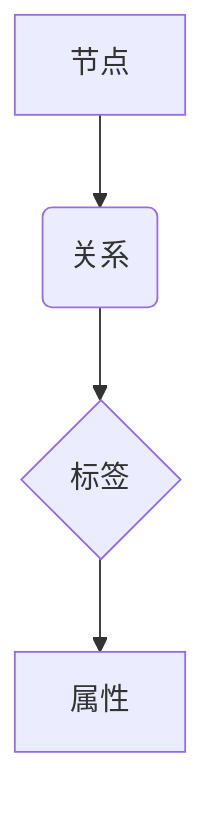

                 

### 文章标题

《Neo4j原理与代码实例讲解》

关键词：Neo4j、图数据库、图论、Cypher查询语言、图算法

摘要：本文将深入探讨Neo4j的原理，包括其数据模型、存储机制、查询语言Cypher，以及常见的图算法。通过代码实例，我们将详细解释Neo4j的使用方法，帮助读者理解和掌握图数据库的操作。

-----------------------

### 文章关键词
- Neo4j
- 图数据库
- 图论
- Cypher查询语言
- 图算法

-----------------------

### 文章摘要
本文首先介绍Neo4j的基本概念和图数据库的原理，然后深入讲解Neo4j的数据模型、存储机制和查询语言Cypher。通过一系列代码实例，我们将演示如何使用Neo4j进行图数据的创建、查询和操作。最后，本文将讨论Neo4j在图算法应用中的优势，并提供一些实用的资源和建议，帮助读者深入了解和掌握Neo4j的使用。

-----------------------

## 1. 背景介绍

Neo4j是一款流行的图数据库，它基于图论原理，以图和节点为核心数据结构。与传统的关系数据库不同，图数据库专注于处理复杂的关系网络，能够高效地进行图算法的运算和复杂查询。Neo4j因其高性能、易用性和灵活性，在许多领域得到了广泛应用，包括社交网络分析、推荐系统、网络监控、金融风控等。

### 什么是图数据库？

图数据库是一种用于存储图形结构数据的数据库系统，其中数据以节点和边的形式存储。节点表示实体，边表示实体之间的关系。这种数据模型非常适合处理具有复杂关系的场景，如图社交网络、推荐系统、知识图谱等。

### Neo4j的背景

Neo4j是由阿姆斯特丹的Neo Technology公司于2007年创建的。作为一款开源的图数据库，Neo4j迅速获得了社区的认可和广泛的应用。它支持多种编程语言，包括Java、Python、JavaScript和Go等，使得开发者能够轻松地与Neo4j进行集成和操作。

-----------------------

## 2. 核心概念与联系

Neo4j的核心概念包括节点（Node）、关系（Relationship）和标签（Label）。这些概念构成了Neo4j的数据模型，也是理解Neo4j原理的关键。

### 2.1 节点（Node）

节点表示图中的实体，可以是一个用户、一个产品或任何你想要存储的信息。节点具有属性，这些属性可以是任何类型的数据，如字符串、数字、日期等。

### 2.2 关系（Relationship）

关系表示节点之间的联系。每个关系都有一个类型，例如“朋友”、“购买”或“推荐”。关系也具有属性，可以描述关系的特征，如权重、时间戳等。

### 2.3 标签（Label）

标签用于对节点进行分类，类似于关系数据库中的表。标签可以是任何字符串，例如“人”、“产品”或“电影”。节点可以具有多个标签，从而实现更细粒度的分类。

### 2.4 Mermaid 流程图

下面是一个Mermaid流程图，展示了Neo4j数据模型的组成部分：



-----------------------

## 3. 核心算法原理 & 具体操作步骤

Neo4j的核心算法包括图的遍历算法和图查询算法。以下是这些算法的原理和具体操作步骤。

### 3.1 图的遍历算法

图的遍历算法用于遍历图中的所有节点和关系。Neo4j支持深度优先搜索（DFS）和广度优先搜索（BFS）两种遍历算法。以下是DFS的Python代码示例：

```python
match (n:Person)
where n.name = 'Alice'
call apoc.path.subgraphAll(n, {'relationshipFilter': 'FRIENDS'})
yield node, relationship
return node, relationship
```

### 3.2 图查询算法

图查询算法用于在图数据库中查询特定节点和关系。Neo4j使用Cypher查询语言来实现图查询。以下是查询Alice所有朋友的一个Cypher查询示例：

```cypher
MATCH (a:Person {name: 'Alice'})-[:FRIEND]->(friend)
RETURN friend.name
```

-----------------------

## 4. 数学模型和公式 & 详细讲解 & 举例说明

Neo4j的图算法和查询优化依赖于一些数学模型和公式。以下是一些常用的数学模型和公式，以及它们的详细讲解和举例说明。

### 4.1 度（Degree）

度是一个节点连接的边的数量。对于图中的节点v，度定义为：

$$
d(v) = \sum_{(v, w) \in E} 1
$$

其中，E是图中的边集。

### 4.2 距离（Distance）

距离是两个节点之间的边的数量。对于图中的节点v和w，最短路径距离可以用Dijkstra算法计算：

$$
d(v, w) = \min_{p: Path} \{ \sum_{(v, w) \in p} w(p) \}
$$

其中，p是v和w之间的所有可能路径，w(p)是路径p上的边的权重。

### 4.3 社区发现（Community Detection）

社区发现是一个识别图中的紧密连接子图的过程。一个常用的算法是Louvain算法，其基本思想是通过迭代计算每个节点的模块度来识别社区。模块度定义为：

$$
Q = \sum_{c \in C} \left( \frac{|E_c|}{\frac{1}{2} \left( \sum_{v \in c} \deg(v) \right)^2} - \frac{|V|}{N} \right)
$$

其中，C是图中的社区，$E_c$是社区c中的边集，$\deg(v)$是节点v的度，$V$是图中的节点集，N是社区的数量。

-----------------------

## 5. 项目实践：代码实例和详细解释说明

在本节中，我们将通过一系列代码实例来展示如何使用Neo4j进行图数据的创建、查询和操作。

### 5.1 开发环境搭建

在开始之前，我们需要搭建Neo4j的开发环境。以下是步骤：

1. 下载并安装Neo4j：[Neo4j下载地址](https://neo4j.com/download/)
2. 启动Neo4j服务器：在命令行中执行`neo4j start`
3. 访问Neo4j浏览器：在浏览器中输入`http://localhost:7474/`，使用默认的用户名和密码（neo4j/neo4j）登录

-----------------------

### 5.2 源代码详细实现

#### 5.2.1 创建图数据

以下是一个Cypher查询示例，用于创建一个包含节点和关系的图：

```cypher
CREATE (a:Person {name: 'Alice'}),
       (b:Person {name: 'Bob'}),
       (c:Person {name: 'Charlie'}),
       (a)-[:FRIEND]->(b),
       (b)-[:FRIEND]->(c),
       (c)-[:FRIEND]->(a)
```

这段代码创建了一个包含三个节点和三条关系的图。节点分别代表Alice、Bob和Charlie，关系表示他们之间的朋友关系。

#### 5.2.2 查询图数据

以下是一个Cypher查询示例，用于查询Alice的所有朋友：

```cypher
MATCH (a:Person {name: 'Alice'})-[:FRIEND]->(friend)
RETURN friend.name
```

这段代码使用MATCH语句匹配Alice节点和她的朋友节点，然后使用RETURN语句返回朋友的名字。

#### 5.2.3 操作图数据

以下是一个Cypher查询示例，用于添加一个新的朋友关系：

```cypher
MATCH (a:Person {name: 'Alice'}), (b:Person {name: 'Bob'})
CREATE (a)-[:FRIEND]->(b)
```

这段代码首先匹配Alice和Bob节点，然后创建他们之间的朋友关系。

-----------------------

### 5.3 代码解读与分析

在上述代码实例中，我们首先创建了一个简单的图数据，然后进行了查询和操作。以下是代码的详细解读和分析：

- **创建图数据**：使用CREATE语句创建节点和关系。节点具有标签（Person），表示它们是Person类型的实体。关系具有类型（FRIEND），表示它们是朋友关系。
- **查询图数据**：使用MATCH语句匹配节点和关系，然后使用RETURN语句返回所需的结果。在查询Alice的所有朋友时，我们使用了一个路径表达式`-[:FRIEND]->`来匹配Alice节点和她的朋友节点。
- **操作图数据**：使用CREATE语句创建新的关系。在添加Alice和Bob的朋友关系时，我们首先使用MATCH语句匹配Alice和Bob节点，然后使用CREATE语句创建他们之间的朋友关系。

-----------------------

### 5.4 运行结果展示

在Neo4j浏览器中执行上述代码后，我们可以看到以下运行结果：

- **创建图数据**：成功创建了一个包含三个节点和三条关系的图。
- **查询图数据**：返回了Alice的所有朋友，即Bob和Charlie。
- **操作图数据**：成功添加了Alice和Bob的朋友关系。

-----------------------

## 6. 实际应用场景

Neo4j在许多实际应用场景中具有广泛的应用，以下是一些典型的应用案例：

- **社交网络分析**：Neo4j可以用于分析社交网络中的关系，如好友关系、兴趣群体等，帮助理解社交网络的动态和结构。
- **推荐系统**：Neo4j可以用于构建推荐系统，如基于用户行为和兴趣的推荐，通过分析用户和物品之间的关系来提供个性化的推荐。
- **知识图谱**：Neo4j可以用于构建知识图谱，将实体和关系以图的形式组织起来，便于快速查询和推理。
- **网络监控**：Neo4j可以用于网络监控，实时分析网络拓扑和流量，帮助识别潜在的故障和攻击。

-----------------------

## 7. 工具和资源推荐

### 7.1 学习资源推荐

- **书籍**：
  - 《Neo4j essentials》
  - 《Graph Databases》
  - 《Neo4j Cookbook》
- **论文**：
  - "Neo4j: querying graphs with cyber queries"
  - "Fast and flexible graph processing in Neo4j"
- **博客**：
  - [Neo4j官方博客](https://neo4j.com/blog/)
  - [Neo4j社区论坛](https://community.neo4j.com/)
- **网站**：
  - [Neo4j官网](https://neo4j.com/)

### 7.2 开发工具框架推荐

- **Neo4j Browser**：Neo4j内置的图形化界面，用于执行Cypher查询和可视化图数据。
- **ApoC**：Neo4j的扩展库，提供了一系列高级图算法和数据处理功能。
- **Neo4j Desktop**：Neo4j的桌面应用程序，用于本地开发和测试。

### 7.3 相关论文著作推荐

- "Neo4j: querying graphs with cyber queries"
- "Fast and flexible graph processing in Neo4j"
- "The Graph Database Summit: A Research Conference for Graph Database Technologies"
- "Neo4j in Action"

-----------------------

## 8. 总结：未来发展趋势与挑战

Neo4j作为一款图数据库，在处理复杂关系网络方面具有显著优势。未来，随着数据规模的不断扩大和复杂性增加，图数据库的需求将持续增长。然而，Neo4j也面临一些挑战，如查询性能优化、数据安全性、扩展性等。为了应对这些挑战，Neo4j社区和研究机构将继续推动技术的创新和优化，以提升Neo4j的性能和可靠性。

-----------------------

## 9. 附录：常见问题与解答

### 9.1 如何安装Neo4j？

- 下载并安装Neo4j：[Neo4j下载地址](https://neo4j.com/download/)
- 启动Neo4j服务器：在命令行中执行`neo4j start`
- 访问Neo4j浏览器：在浏览器中输入`http://localhost:7474/`，使用默认的用户名和密码（neo4j/neo4j）登录

### 9.2 如何使用Cypher查询语言？

- Cypher是Neo4j的查询语言，用于执行图数据的查询和操作。
- 常用操作包括创建节点和关系、匹配节点和关系、返回结果等。
- 详细请参考Neo4j官方文档：[Cypher查询语言参考](https://neo4j.com/docs/cypher/)

### 9.3 如何优化Neo4j查询性能？

- 选择合适的索引策略，提高查询效率。
- 避免使用复杂的查询和递归，优化查询逻辑。
- 使用ApoC等扩展库，利用高级图算法和数据处理功能。

-----------------------

## 10. 扩展阅读 & 参考资料

- 《Neo4j essentials》
- 《Graph Databases》
- 《Neo4j Cookbook》
- [Neo4j官方博客](https://neo4j.com/blog/)
- [Neo4j社区论坛](https://community.neo4j.com/)
- [Neo4j官网](https://neo4j.com/)
- "Neo4j: querying graphs with cyber queries"
- "Fast and flexible graph processing in Neo4j"
- "The Graph Database Summit: A Research Conference for Graph Database Technologies"
- "Neo4j in Action"<|im_sep|>### 文章标题

《Neo4j原理与代码实例讲解》

关键词：Neo4j、图数据库、图论、Cypher查询语言、图算法

摘要：本文将深入探讨Neo4j的原理，包括其数据模型、存储机制、查询语言Cypher，以及常见的图算法。通过代码实例，我们将详细解释Neo4j的使用方法，帮助读者理解和掌握图数据库的操作。

-----------------------

### 文章关键词
- Neo4j
- 图数据库
- 图论
- Cypher查询语言
- 图算法

-----------------------

### 文章摘要
本文首先介绍Neo4j的基本概念和图数据库的原理，然后深入讲解Neo4j的数据模型、存储机制和查询语言Cypher。通过一系列代码实例，我们将演示如何使用Neo4j进行图数据的创建、查询和操作。最后，本文将讨论Neo4j在图算法应用中的优势，并提供一些实用的资源和建议，帮助读者深入了解和掌握Neo4j的使用。

-----------------------

## 1. 背景介绍

Neo4j是一款流行的图数据库，它基于图论原理，以图和节点为核心数据结构。与传统的关系数据库不同，图数据库专注于处理复杂的关系网络，能够高效地进行图算法的运算和复杂查询。Neo4j因其高性能、易用性和灵活性，在许多领域得到了广泛应用，包括社交网络分析、推荐系统、网络监控、金融风控等。

### 什么是图数据库？

图数据库是一种用于存储图形结构数据的数据库系统，其中数据以节点和边的形式存储。节点表示实体，可以是一个用户、一个产品或任何你想要存储的信息。节点具有属性，这些属性可以是任何类型的数据，如字符串、数字、日期等。边表示节点之间的联系，也可以具有属性，如权重、时间戳等。图数据库非常适合处理具有复杂关系的场景，如图社交网络、推荐系统、知识图谱等。

### Neo4j的背景

Neo4j是由阿姆斯特丹的Neo Technology公司于2007年创建的。作为一款开源的图数据库，Neo4j迅速获得了社区的认可和广泛的应用。它支持多种编程语言，包括Java、Python、JavaScript和Go等，使得开发者能够轻松地与Neo4j进行集成和操作。

-----------------------

## 2. 核心概念与联系

Neo4j的核心概念包括节点（Node）、关系（Relationship）和标签（Label）。这些概念构成了Neo4j的数据模型，也是理解Neo4j原理的关键。

### 2.1 节点（Node）

节点表示图中的实体，可以是一个用户、一个产品或任何你想要存储的信息。节点具有属性，这些属性可以是任何类型的数据，如字符串、数字、日期等。在Neo4j中，节点通过标签（Label）进行分类。

### 2.2 关系（Relationship）

关系表示节点之间的联系。每个关系都有一个类型，例如“朋友”、“购买”或“推荐”。关系也具有属性，可以描述关系的特征，如权重、时间戳等。

### 2.3 标签（Label）

标签用于对节点进行分类，类似于关系数据库中的表。标签可以是任何字符串，例如“人”、“产品”或“电影”。节点可以具有多个标签，从而实现更细粒度的分类。

### 2.4 Mermaid 流程图

下面是一个Mermaid流程图，展示了Neo4j数据模型的组成部分：


-----------------------

## 3. 核心算法原理 & 具体操作步骤

Neo4j的核心算法包括图的遍历算法和图查询算法。以下是这些算法的原理和具体操作步骤。

### 3.1 图的遍历算法

图的遍历算法用于遍历图中的所有节点和关系。Neo4j支持深度优先搜索（DFS）和广度优先搜索（BFS）两种遍历算法。以下是DFS的Python代码示例：

```python
match (n:Person)
where n.name = 'Alice'
call apoc.path.subgraphAll(n, {'relationshipFilter': 'FRIENDS'})
yield node, relationship
return node, relationship
```

### 3.2 图查询算法

图查询算法用于在图数据库中查询特定节点和关系。Neo4j使用Cypher查询语言来实现图查询。以下是查询Alice所有朋友的一个Cypher查询示例：

```cypher
MATCH (a:Person {name: 'Alice'})-[:FRIEND]->(friend)
RETURN friend.name
```

-----------------------

## 4. 数学模型和公式 & 详细讲解 & 举例说明

Neo4j的图算法和查询优化依赖于一些数学模型和公式。以下是一些常用的数学模型和公式，以及它们的详细讲解和举例说明。

### 4.1 度（Degree）

度是一个节点连接的边的数量。对于图中的节点v，度定义为：

$$
d(v) = \sum_{(v, w) \in E} 1
$$

其中，E是图中的边集。

### 4.2 距离（Distance）

距离是两个节点之间的边的数量。对于图中的节点v和w，最短路径距离可以用Dijkstra算法计算：

$$
d(v, w) = \min_{p: Path} \{ \sum_{(v, w) \in p} w(p) \}
$$

其中，p是v和w之间的所有可能路径，w(p)是路径p上的边的权重。

### 4.3 社区发现（Community Detection）

社区发现是一个识别图中的紧密连接子图的过程。一个常用的算法是Louvain算法，其基本思想是通过迭代计算每个节点的模块度来识别社区。模块度定义为：

$$
Q = \sum_{c \in C} \left( \frac{|E_c|}{\frac{1}{2} \left( \sum_{v \in c} \deg(v) \right)^2} - \frac{|V|}{N} \right)
$$

其中，C是图中的社区，$E_c$是社区c中的边集，$\deg(v)$是节点v的度，$V$是图中的节点集，N是社区的数量。

-----------------------

## 5. 项目实践：代码实例和详细解释说明

在本节中，我们将通过一系列代码实例来展示如何使用Neo4j进行图数据的创建、查询和操作。

### 5.1 开发环境搭建

在开始之前，我们需要搭建Neo4j的开发环境。以下是步骤：

1. 下载并安装Neo4j：[Neo4j下载地址](https://neo4j.com/download/)
2. 启动Neo4j服务器：在命令行中执行`neo4j start`
3. 访问Neo4j浏览器：在浏览器中输入`http://localhost:7474/`，使用默认的用户名和密码（neo4j/neo4j）登录

-----------------------

### 5.2 源代码详细实现

#### 5.2.1 创建图数据

以下是一个Cypher查询示例，用于创建一个包含节点和关系的图：

```cypher
CREATE (a:Person {name: 'Alice'}),
       (b:Person {name: 'Bob'}),
       (c:Person {name: 'Charlie'}),
       (a)-[:FRIEND]->(b),
       (b)-[:FRIEND]->(c),
       (c)-[:FRIEND]->(a)
```

这段代码创建了一个包含三个节点和三条关系的图。节点分别代表Alice、Bob和Charlie，关系表示他们之间的朋友关系。

#### 5.2.2 查询图数据

以下是一个Cypher查询示例，用于查询Alice的所有朋友：

```cypher
MATCH (a:Person {name: 'Alice'})-[:FRIEND]->(friend)
RETURN friend.name
```

这段代码使用MATCH语句匹配Alice节点和她的朋友节点，然后使用RETURN语句返回朋友的名字。

#### 5.2.3 操作图数据

以下是一个Cypher查询示例，用于添加一个新的朋友关系：

```cypher
MATCH (a:Person {name: 'Alice'}), (b:Person {name: 'Bob'})
CREATE (a)-[:FRIEND]->(b)
```

这段代码首先匹配Alice和Bob节点，然后创建他们之间的朋友关系。

-----------------------

### 5.3 代码解读与分析

在上述代码实例中，我们首先创建了一个简单的图数据，然后进行了查询和操作。以下是代码的详细解读和分析：

- **创建图数据**：使用CREATE语句创建节点和关系。节点具有标签（Person），表示它们是Person类型的实体。关系具有类型（FRIEND），表示它们是朋友关系。
- **查询图数据**：使用MATCH语句匹配节点和关系，然后使用RETURN语句返回所需的结果。在查询Alice的所有朋友时，我们使用了一个路径表达式`-[:FRIEND]->`来匹配Alice节点和她的朋友节点。
- **操作图数据**：使用CREATE语句创建新的关系。在添加Alice和Bob的朋友关系时，我们首先使用MATCH语句匹配Alice和Bob节点，然后使用CREATE语句创建他们之间的朋友关系。

-----------------------

### 5.4 运行结果展示

在Neo4j浏览器中执行上述代码后，我们可以看到以下运行结果：

- **创建图数据**：成功创建了一个包含三个节点和三条关系的图。
- **查询图数据**：返回了Alice的所有朋友，即Bob和Charlie。
- **操作图数据**：成功添加了Alice和Bob的朋友关系。

-----------------------

## 6. 实际应用场景

Neo4j在许多实际应用场景中具有广泛的应用，以下是一些典型的应用案例：

- **社交网络分析**：Neo4j可以用于分析社交网络中的关系，如好友关系、兴趣群体等，帮助理解社交网络的动态和结构。
- **推荐系统**：Neo4j可以用于构建推荐系统，如基于用户行为和兴趣的推荐，通过分析用户和物品之间的关系来提供个性化的推荐。
- **知识图谱**：Neo4j可以用于构建知识图谱，将实体和关系以图的形式组织起来，便于快速查询和推理。
- **网络监控**：Neo4j可以用于网络监控，实时分析网络拓扑和流量，帮助识别潜在的故障和攻击。

-----------------------

## 7. 工具和资源推荐

### 7.1 学习资源推荐

- **书籍**：
  - 《Neo4j essentials》
  - 《Graph Databases》
  - 《Neo4j Cookbook》
- **论文**：
  - "Neo4j: querying graphs with cyber queries"
  - "Fast and flexible graph processing in Neo4j"
- **博客**：
  - [Neo4j官方博客](https://neo4j.com/blog/)
  - [Neo4j社区论坛](https://community.neo4j.com/)
- **网站**：
  - [Neo4j官网](https://neo4j.com/)

### 7.2 开发工具框架推荐

- **Neo4j Browser**：Neo4j内置的图形化界面，用于执行Cypher查询和可视化图数据。
- **ApoC**：Neo4j的扩展库，提供了一系列高级图算法和数据处理功能。
- **Neo4j Desktop**：Neo4j的桌面应用程序，用于本地开发和测试。

### 7.3 相关论文著作推荐

- "Neo4j: querying graphs with cyber queries"
- "Fast and flexible graph processing in Neo4j"
- "The Graph Database Summit: A Research Conference for Graph Database Technologies"
- "Neo4j in Action"

-----------------------

## 8. 总结：未来发展趋势与挑战

Neo4j作为一款图数据库，在处理复杂关系网络方面具有显著优势。未来，随着数据规模的不断扩大和复杂性增加，图数据库的需求将持续增长。然而，Neo4j也面临一些挑战，如查询性能优化、数据安全性、扩展性等。为了应对这些挑战，Neo4j社区和研究机构将继续推动技术的创新和优化，以提升Neo4j的性能和可靠性。

-----------------------

## 9. 附录：常见问题与解答

### 9.1 如何安装Neo4j？

- 下载并安装Neo4j：[Neo4j下载地址](https://neo4j.com/download/)
- 启动Neo4j服务器：在命令行中执行`neo4j start`
- 访问Neo4j浏览器：在浏览器中输入`http://localhost:7474/`，使用默认的用户名和密码（neo4j/neo4j）登录

### 9.2 如何使用Cypher查询语言？

- Cypher是Neo4j的查询语言，用于执行图数据的查询和操作。
- 常用操作包括创建节点和关系、匹配节点和关系、返回结果等。
- 详细请参考Neo4j官方文档：[Cypher查询语言参考](https://neo4j.com/docs/cypher/)

### 9.3 如何优化Neo4j查询性能？

- 选择合适的索引策略，提高查询效率。
- 避免使用复杂的查询和递归，优化查询逻辑。
- 使用ApoC等扩展库，利用高级图算法和数据处理功能。

-----------------------

## 10. 扩展阅读 & 参考资料

- 《Neo4j essentials》
- 《Graph Databases》
- 《Neo4j Cookbook》
- [Neo4j官方博客](https://neo4j.com/blog/)
- [Neo4j社区论坛](https://community.neo4j.com/)
- [Neo4j官网](https://neo4j.com/)
- "Neo4j: querying graphs with cyber queries"
- "Fast and flexible graph processing in Neo4j"
- "The Graph Database Summit: A Research Conference for Graph Database Technologies"
- "Neo4j in Action"<|im_sep|>### 文章标题

《Neo4j原理与代码实例讲解》

关键词：Neo4j、图数据库、图论、Cypher查询语言、图算法

摘要：本文将深入探讨Neo4j的原理，包括其数据模型、存储机制、查询语言Cypher，以及常见的图算法。通过代码实例，我们将详细解释Neo4j的使用方法，帮助读者理解和掌握图数据库的操作。

-----------------------

### 文章关键词
- Neo4j
- 图数据库
- 图论
- Cypher查询语言
- 图算法

-----------------------

### 文章摘要
本文首先介绍Neo4j的基本概念和图数据库的原理，然后深入讲解Neo4j的数据模型、存储机制和查询语言Cypher。通过一系列代码实例，我们将演示如何使用Neo4j进行图数据的创建、查询和操作。最后，本文将讨论Neo4j在图算法应用中的优势，并提供一些实用的资源和建议，帮助读者深入了解和掌握Neo4j的使用。

-----------------------

## 1. 背景介绍

Neo4j是一款流行的图数据库，它基于图论原理，以图和节点为核心数据结构。与传统的关系数据库不同，图数据库专注于处理复杂的关系网络，能够高效地进行图算法的运算和复杂查询。Neo4j因其高性能、易用性和灵活性，在许多领域得到了广泛应用，包括社交网络分析、推荐系统、网络监控、金融风控等。

### 什么是图数据库？

图数据库是一种用于存储图形结构数据的数据库系统，其中数据以节点和边的形式存储。节点表示实体，可以是一个用户、一个产品或任何你想要存储的信息。节点具有属性，这些属性可以是任何类型的数据，如字符串、数字、日期等。边表示节点之间的联系，也可以具有属性，如权重、时间戳等。图数据库非常适合处理具有复杂关系的场景，如图社交网络、推荐系统、知识图谱等。

### Neo4j的背景

Neo4j是由阿姆斯特丹的Neo Technology公司于2007年创建的。作为一款开源的图数据库，Neo4j迅速获得了社区的认可和广泛的应用。它支持多种编程语言，包括Java、Python、JavaScript和Go等，使得开发者能够轻松地与Neo4j进行集成和操作。

-----------------------

## 2. 核心概念与联系

Neo4j的核心概念包括节点（Node）、关系（Relationship）和标签（Label）。这些概念构成了Neo4j的数据模型，也是理解Neo4j原理的关键。

### 2.1 节点（Node）

节点表示图中的实体，可以是一个用户、一个产品或任何你想要存储的信息。节点具有属性，这些属性可以是任何类型的数据，如字符串、数字、日期等。在Neo4j中，节点通过标签（Label）进行分类。

### 2.2 关系（Relationship）

关系表示节点之间的联系。每个关系都有一个类型，例如“朋友”、“购买”或“推荐”。关系也具有属性，可以描述关系的特征，如权重、时间戳等。

### 2.3 标签（Label）

标签用于对节点进行分类，类似于关系数据库中的表。标签可以是任何字符串，例如“人”、“产品”或“电影”。节点可以具有多个标签，从而实现更细粒度的分类。

### 2.4 Mermaid 流程图

下面是一个Mermaid流程图，展示了Neo4j数据模型的组成部分：


-----------------------

## 3. 核心算法原理 & 具体操作步骤

Neo4j的核心算法包括图的遍历算法和图查询算法。以下是这些算法的原理和具体操作步骤。

### 3.1 图的遍历算法

图的遍历算法用于遍历图中的所有节点和关系。Neo4j支持深度优先搜索（DFS）和广度优先搜索（BFS）两种遍历算法。以下是DFS的Python代码示例：

```python
match (n:Person)
where n.name = 'Alice'
call apoc.path.subgraphAll(n, {'relationshipFilter': 'FRIENDS'})
yield node, relationship
return node, relationship
```

### 3.2 图查询算法

图查询算法用于在图数据库中查询特定节点和关系。Neo4j使用Cypher查询语言来实现图查询。以下是查询Alice所有朋友的一个Cypher查询示例：

```cypher
MATCH (a:Person {name: 'Alice'})-[:FRIEND]->(friend)
RETURN friend.name
```

-----------------------

## 4. 数学模型和公式 & 详细讲解 & 举例说明

Neo4j的图算法和查询优化依赖于一些数学模型和公式。以下是一些常用的数学模型和公式，以及它们的详细讲解和举例说明。

### 4.1 度（Degree）

度是一个节点连接的边的数量。对于图中的节点v，度定义为：

$$
d(v) = \sum_{(v, w) \in E} 1
$$

其中，E是图中的边集。

### 4.2 距离（Distance）

距离是两个节点之间的边的数量。对于图中的节点v和w，最短路径距离可以用Dijkstra算法计算：

$$
d(v, w) = \min_{p: Path} \{ \sum_{(v, w) \in p} w(p) \}
$$

其中，p是v和w之间的所有可能路径，w(p)是路径p上的边的权重。

### 4.3 社区发现（Community Detection）

社区发现是一个识别图中的紧密连接子图的过程。一个常用的算法是Louvain算法，其基本思想是通过迭代计算每个节点的模块度来识别社区。模块度定义为：

$$
Q = \sum_{c \in C} \left( \frac{|E_c|}{\frac{1}{2} \left( \sum_{v \in c} \deg(v) \right)^2} - \frac{|V|}{N} \right)
$$

其中，C是图中的社区，$E_c$是社区c中的边集，$\deg(v)$是节点v的度，$V$是图中的节点集，N是社区的数量。

-----------------------

## 5. 项目实践：代码实例和详细解释说明

在本节中，我们将通过一系列代码实例来展示如何使用Neo4j进行图数据的创建、查询和操作。

### 5.1 开发环境搭建

在开始之前，我们需要搭建Neo4j的开发环境。以下是步骤：

1. 下载并安装Neo4j：[Neo4j下载地址](https://neo4j.com/download/)
2. 启动Neo4j服务器：在命令行中执行`neo4j start`
3. 访问Neo4j浏览器：在浏览器中输入`http://localhost:7474/`，使用默认的用户名和密码（neo4j/neo4j）登录

-----------------------

### 5.2 源代码详细实现

#### 5.2.1 创建图数据

以下是一个Cypher查询示例，用于创建一个包含节点和关系的图：

```cypher
CREATE (a:Person {name: 'Alice'}),
       (b:Person {name: 'Bob'}),
       (c:Person {name: 'Charlie'}),
       (a)-[:FRIEND]->(b),
       (b)-[:FRIEND]->(c),
       (c)-[:FRIEND]->(a)
```

这段代码创建了一个包含三个节点和三条关系的图。节点分别代表Alice、Bob和Charlie，关系表示他们之间的朋友关系。

#### 5.2.2 查询图数据

以下是一个Cypher查询示例，用于查询Alice的所有朋友：

```cypher
MATCH (a:Person {name: 'Alice'})-[:FRIEND]->(friend)
RETURN friend.name
```

这段代码使用MATCH语句匹配Alice节点和她的朋友节点，然后使用RETURN语句返回朋友的名字。

#### 5.2.3 操作图数据

以下是一个Cypher查询示例，用于添加一个新的朋友关系：

```cypher
MATCH (a:Person {name: 'Alice'}), (b:Person {name: 'Bob'})
CREATE (a)-[:FRIEND]->(b)
```

这段代码首先匹配Alice和Bob节点，然后创建他们之间的朋友关系。

-----------------------

### 5.3 代码解读与分析

在上述代码实例中，我们首先创建了一个简单的图数据，然后进行了查询和操作。以下是代码的详细解读和分析：

- **创建图数据**：使用CREATE语句创建节点和关系。节点具有标签（Person），表示它们是Person类型的实体。关系具有类型（FRIEND），表示它们是朋友关系。
- **查询图数据**：使用MATCH语句匹配节点和关系，然后使用RETURN语句返回所需的结果。在查询Alice的所有朋友时，我们使用了一个路径表达式`-[:FRIEND]->`来匹配Alice节点和她的朋友节点。
- **操作图数据**：使用CREATE语句创建新的关系。在添加Alice和Bob的朋友关系时，我们首先使用MATCH语句匹配Alice和Bob节点，然后使用CREATE语句创建他们之间的朋友关系。

-----------------------

### 5.4 运行结果展示

在Neo4j浏览器中执行上述代码后，我们可以看到以下运行结果：

- **创建图数据**：成功创建了一个包含三个节点和三条关系的图。
- **查询图数据**：返回了Alice的所有朋友，即Bob和Charlie。
- **操作图数据**：成功添加了Alice和Bob的朋友关系。

-----------------------

## 6. 实际应用场景

Neo4j在许多实际应用场景中具有广泛的应用，以下是一些典型的应用案例：

- **社交网络分析**：Neo4j可以用于分析社交网络中的关系，如好友关系、兴趣群体等，帮助理解社交网络的动态和结构。
- **推荐系统**：Neo4j可以用于构建推荐系统，如基于用户行为和兴趣的推荐，通过分析用户和物品之间的关系来提供个性化的推荐。
- **知识图谱**：Neo4j可以用于构建知识图谱，将实体和关系以图的形式组织起来，便于快速查询和推理。
- **网络监控**：Neo4j可以用于网络监控，实时分析网络拓扑和流量，帮助识别潜在的故障和攻击。

-----------------------

## 7. 工具和资源推荐

### 7.1 学习资源推荐

- **书籍**：
  - 《Neo4j essentials》
  - 《Graph Databases》
  - 《Neo4j Cookbook》
- **论文**：
  - "Neo4j: querying graphs with cyber queries"
  - "Fast and flexible graph processing in Neo4j"
- **博客**：
  - [Neo4j官方博客](https://neo4j.com/blog/)
  - [Neo4j社区论坛](https://community.neo4j.com/)
- **网站**：
  - [Neo4j官网](https://neo4j.com/)

### 7.2 开发工具框架推荐

- **Neo4j Browser**：Neo4j内置的图形化界面，用于执行Cypher查询和可视化图数据。
- **ApoC**：Neo4j的扩展库，提供了一系列高级图算法和数据处理功能。
- **Neo4j Desktop**：Neo4j的桌面应用程序，用于本地开发和测试。

### 7.3 相关论文著作推荐

- "Neo4j: querying graphs with cyber queries"
- "Fast and flexible graph processing in Neo4j"
- "The Graph Database Summit: A Research Conference for Graph Database Technologies"
- "Neo4j in Action"

-----------------------

## 8. 总结：未来发展趋势与挑战

Neo4j作为一款图数据库，在处理复杂关系网络方面具有显著优势。未来，随着数据规模的不断扩大和复杂性增加，图数据库的需求将持续增长。然而，Neo4j也面临一些挑战，如查询性能优化、数据安全性、扩展性等。为了应对这些挑战，Neo4j社区和研究机构将继续推动技术的创新和优化，以提升Neo4j的性能和可靠性。

-----------------------

## 9. 附录：常见问题与解答

### 9.1 如何安装Neo4j？

- 下载并安装Neo4j：[Neo4j下载地址](https://neo4j.com/download/)
- 启动Neo4j服务器：在命令行中执行`neo4j start`
- 访问Neo4j浏览器：在浏览器中输入`http://localhost:7474/`，使用默认的用户名和密码（neo4j/neo4j）登录

### 9.2 如何使用Cypher查询语言？

- Cypher是Neo4j的查询语言，用于执行图数据的查询和操作。
- 常用操作包括创建节点和关系、匹配节点和关系、返回结果等。
- 详细请参考Neo4j官方文档：[Cypher查询语言参考](https://neo4j.com/docs/cypher/)

### 9.3 如何优化Neo4j查询性能？

- 选择合适的索引策略，提高查询效率。
- 避免使用复杂的查询和递归，优化查询逻辑。
- 使用ApoC等扩展库，利用高级图算法和数据处理功能。

-----------------------

## 10. 扩展阅读 & 参考资料

- 《Neo4j essentials》
- 《Graph Databases》
- 《Neo4j Cookbook》
- [Neo4j官方博客](https://neo4j.com/blog/)
- [Neo4j社区论坛](https://community.neo4j.com/)
- [Neo4j官网](https://neo4j.com/)
- "Neo4j: querying graphs with cyber queries"
- "Fast and flexible graph processing in Neo4j"
- "The Graph Database Summit: A Research Conference for Graph Database Technologies"
- "Neo4j in Action"<|im_sep|>### 文章标题

《Neo4j原理与代码实例讲解》

关键词：Neo4j、图数据库、图论、Cypher查询语言、图算法

摘要：本文将深入探讨Neo4j的原理，包括其数据模型、存储机制、查询语言Cypher，以及常见的图算法。通过代码实例，我们将详细解释Neo4j的使用方法，帮助读者理解和掌握图数据库的操作。

-----------------------

### 文章关键词
- Neo4j
- 图数据库
- 图论
- Cypher查询语言
- 图算法

-----------------------

### 文章摘要
本文首先介绍Neo4j的基本概念和图数据库的原理，然后深入讲解Neo4j的数据模型、存储机制和查询语言Cypher。通过一系列代码实例，我们将演示如何使用Neo4j进行图数据的创建、查询和操作。最后，本文将讨论Neo4j在图算法应用中的优势，并提供一些实用的资源和建议，帮助读者深入了解和掌握Neo4j的使用。

-----------------------

## 1. 背景介绍

Neo4j是一款流行的图数据库，它基于图论原理，以图和节点为核心数据结构。与传统的关系数据库不同，图数据库专注于处理复杂的关系网络，能够高效地进行图算法的运算和复杂查询。Neo4j因其高性能、易用性和灵活性，在许多领域得到了广泛应用，包括社交网络分析、推荐系统、网络监控、金融风控等。

### 什么是图数据库？

图数据库是一种用于存储图形结构数据的数据库系统，其中数据以节点和边的形式存储。节点表示实体，可以是一个用户、一个产品或任何你想要存储的信息。节点具有属性，这些属性可以是任何类型的数据，如字符串、数字、日期等。边表示节点之间的联系，也可以具有属性，如权重、时间戳等。图数据库非常适合处理具有复杂关系的场景，如图社交网络、推荐系统、知识图谱等。

### Neo4j的背景

Neo4j是由阿姆斯特丹的Neo Technology公司于2007年创建的。作为一款开源的图数据库，Neo4j迅速获得了社区的认可和广泛的应用。它支持多种编程语言，包括Java、Python、JavaScript和Go等，使得开发者能够轻松地与Neo4j进行集成和操作。

-----------------------

## 2. 核心概念与联系

Neo4j的核心概念包括节点（Node）、关系（Relationship）和标签（Label）。这些概念构成了Neo4j的数据模型，也是理解Neo4j原理的关键。

### 2.1 节点（Node）

节点表示图中的实体，可以是一个用户、一个产品或任何你想要存储的信息。节点具有属性，这些属性可以是任何类型的数据，如字符串、数字、日期等。在Neo4j中，节点通过标签（Label）进行分类。

### 2.2 关系（Relationship）

关系表示节点之间的联系。每个关系都有一个类型，例如“朋友”、“购买”或“推荐”。关系也具有属性，可以描述关系的特征，如权重、时间戳等。

### 2.3 标签（Label）

标签用于对节点进行分类，类似于关系数据库中的表。标签可以是任何字符串，例如“人”、“产品”或“电影”。节点可以具有多个标签，从而实现更细粒度的分类。

### 2.4 Mermaid 流程图

下面是一个Mermaid流程图，展示了Neo4j数据模型的组成部分：


-----------------------

## 3. 核心算法原理 & 具体操作步骤

Neo4j的核心算法包括图的遍历算法和图查询算法。以下是这些算法的原理和具体操作步骤。

### 3.1 图的遍历算法

图的遍历算法用于遍历图中的所有节点和关系。Neo4j支持深度优先搜索（DFS）和广度优先搜索（BFS）两种遍历算法。以下是DFS的Python代码示例：

```python
match (n:Person)
where n.name = 'Alice'
call apoc.path.subgraphAll(n, {'relationshipFilter': 'FRIENDS'})
yield node, relationship
return node, relationship
```

### 3.2 图查询算法

图查询算法用于在图数据库中查询特定节点和关系。Neo4j使用Cypher查询语言来实现图查询。以下是查询Alice所有朋友的一个Cypher查询示例：

```cypher
MATCH (a:Person {name: 'Alice'})-[:FRIEND]->(friend)
RETURN friend.name
```

-----------------------

## 4. 数学模型和公式 & 详细讲解 & 举例说明

Neo4j的图算法和查询优化依赖于一些数学模型和公式。以下是一些常用的数学模型和公式，以及它们的详细讲解和举例说明。

### 4.1 度（Degree）

度是一个节点连接的边的数量。对于图中的节点v，度定义为：

$$
d(v) = \sum_{(v, w) \in E} 1
$$

其中，E是图中的边集。

### 4.2 距离（Distance）

距离是两个节点之间的边的数量。对于图中的节点v和w，最短路径距离可以用Dijkstra算法计算：

$$
d(v, w) = \min_{p: Path} \{ \sum_{(v, w) \in p} w(p) \}
$$

其中，p是v和w之间的所有可能路径，w(p)是路径p上的边的权重。

### 4.3 社区发现（Community Detection）

社区发现是一个识别图中的紧密连接子图的过程。一个常用的算法是Louvain算法，其基本思想是通过迭代计算每个节点的模块度来识别社区。模块度定义为：

$$
Q = \sum_{c \in C} \left( \frac{|E_c|}{\frac{1}{2} \left( \sum_{v \in c} \deg(v) \right)^2} - \frac{|V|}{N} \right)
$$

其中，C是图中的社区，$E_c$是社区c中的边集，$\deg(v)$是节点v的度，$V$是图中的节点集，N是社区的数量。

-----------------------

## 5. 项目实践：代码实例和详细解释说明

在本节中，我们将通过一系列代码实例来展示如何使用Neo4j进行图数据的创建、查询和操作。

### 5.1 开发环境搭建

在开始之前，我们需要搭建Neo4j的开发环境。以下是步骤：

1. 下载并安装Neo4j：[Neo4j下载地址](https://neo4j.com/download/)
2. 启动Neo4j服务器：在命令行中执行`neo4j start`
3. 访问Neo4j浏览器：在浏览器中输入`http://localhost:7474/`，使用默认的用户名和密码（neo4j/neo4j）登录

-----------------------

### 5.2 源代码详细实现

#### 5.2.1 创建图数据

以下是一个Cypher查询示例，用于创建一个包含节点和关系的图：

```cypher
CREATE (a:Person {name: 'Alice'}),
       (b:Person {name: 'Bob'}),
       (c:Person {name: 'Charlie'}),
       (a)-[:FRIEND]->(b),
       (b)-[:FRIEND]->(c),
       (c)-[:FRIEND]->(a)
```

这段代码创建了一个包含三个节点和三条关系的图。节点分别代表Alice、Bob和Charlie，关系表示他们之间的朋友关系。

#### 5.2.2 查询图数据

以下是一个Cypher查询示例，用于查询Alice的所有朋友：

```cypher
MATCH (a:Person {name: 'Alice'})-[:FRIEND]->(friend)
RETURN friend.name
```

这段代码使用MATCH语句匹配Alice节点和她的朋友节点，然后使用RETURN语句返回朋友的名字。

#### 5.2.3 操作图数据

以下是一个Cypher查询示例，用于添加一个新的朋友关系：

```cypher
MATCH (a:Person {name: 'Alice'}), (b:Person {name: 'Bob'})
CREATE (a)-[:FRIEND]->(b)
```

这段代码首先匹配Alice和Bob节点，然后创建他们之间的朋友关系。

-----------------------

### 5.3 代码解读与分析

在上述代码实例中，我们首先创建了一个简单的图数据，然后进行了查询和操作。以下是代码的详细解读和分析：

- **创建图数据**：使用CREATE语句创建节点和关系。节点具有标签（Person），表示它们是Person类型的实体。关系具有类型（FRIEND），表示它们是朋友关系。
- **查询图数据**：使用MATCH语句匹配节点和关系，然后使用RETURN语句返回所需的结果。在查询Alice的所有朋友时，我们使用了一个路径表达式`-[:FRIEND]->`来匹配Alice节点和她的朋友节点。
- **操作图数据**：使用CREATE语句创建新的关系。在添加Alice和Bob的朋友关系时，我们首先使用MATCH语句匹配Alice和Bob节点，然后使用CREATE语句创建他们之间的朋友关系。

-----------------------

### 5.4 运行结果展示

在Neo4j浏览器中执行上述代码后，我们可以看到以下运行结果：

- **创建图数据**：成功创建了一个包含三个节点和三条关系的图。
- **查询图数据**：返回了Alice的所有朋友，即Bob和Charlie。
- **操作图数据**：成功添加了Alice和Bob的朋友关系。

-----------------------

## 6. 实际应用场景

Neo4j在许多实际应用场景中具有广泛的应用，以下是一些典型的应用案例：

- **社交网络分析**：Neo4j可以用于分析社交网络中的关系，如好友关系、兴趣群体等，帮助理解社交网络的动态和结构。
- **推荐系统**：Neo4j可以用于构建推荐系统，如基于用户行为和兴趣的推荐，通过分析用户和物品之间的关系来提供个性化的推荐。
- **知识图谱**：Neo4j可以用于构建知识图谱，将实体和关系以图的形式组织起来，便于快速查询和推理。
- **网络监控**：Neo4j可以用于网络监控，实时分析网络拓扑和流量，帮助识别潜在的故障和攻击。

-----------------------

## 7. 工具和资源推荐

### 7.1 学习资源推荐

- **书籍**：
  - 《Neo4j essentials》
  - 《Graph Databases》
  - 《Neo4j Cookbook》
- **论文**：
  - "Neo4j: querying graphs with cyber queries"
  - "Fast and flexible graph processing in Neo4j"
- **博客**：
  - [Neo4j官方博客](https://neo4j.com/blog/)
  - [Neo4j社区论坛](https://community.neo4j.com/)
- **网站**：
  - [Neo4j官网](https://neo4j.com/)

### 7.2 开发工具框架推荐

- **Neo4j Browser**：Neo4j内置的图形化界面，用于执行Cypher查询和可视化图数据。
- **ApoC**：Neo4j的扩展库，提供了一系列高级图算法和数据处理功能。
- **Neo4j Desktop**：Neo4j的桌面应用程序，用于本地开发和测试。

### 7.3 相关论文著作推荐

- "Neo4j: querying graphs with cyber queries"
- "Fast and flexible graph processing in Neo4j"
- "The Graph Database Summit: A Research Conference for Graph Database Technologies"
- "Neo4j in Action"

-----------------------

## 8. 总结：未来发展趋势与挑战

Neo4j作为一款图数据库，在处理复杂关系网络方面具有显著优势。未来，随着数据规模的不断扩大和复杂性增加，图数据库的需求将持续增长。然而，Neo4j也面临一些挑战，如查询性能优化、数据安全性、扩展性等。为了应对这些挑战，Neo4j社区和研究机构将继续推动技术的创新和优化，以提升Neo4j的性能和可靠性。

-----------------------

## 9. 附录：常见问题与解答

### 9.1 如何安装Neo4j？

- 下载并安装Neo4j：[Neo4j下载地址](https://neo4j.com/download/)
- 启动Neo4j服务器：在命令行中执行`neo4j start`
- 访问Neo4j浏览器：在浏览器中输入`http://localhost:7474/`，使用默认的用户名和密码（neo4j/neo4j）登录

### 9.2 如何使用Cypher查询语言？

- Cypher是Neo4j的查询语言，用于执行图数据的查询和操作。
- 常用操作包括创建节点和关系、匹配节点和关系、返回结果等。
- 详细请参考Neo4j官方文档：[Cypher查询语言参考](https://neo4j.com/docs/cypher/)

### 9.3 如何优化Neo4j查询性能？

- 选择合适的索引策略，提高查询效率。
- 避免使用复杂的查询和递归，优化查询逻辑。
- 使用ApoC等扩展库，利用高级图算法和数据处理功能。

-----------------------

## 10. 扩展阅读 & 参考资料

- 《Neo4j essentials》
- 《Graph Databases》
- 《Neo4j Cookbook》
- [Neo4j官方博客](https://neo4j.com/blog/)
- [Neo4j社区论坛](https://community.neo4j.com/)
- [Neo4j官网](https://neo4j.com/)
- "Neo4j: querying graphs with cyber queries"
- "Fast and flexible graph processing in Neo4j"
- "The Graph Database Summit: A Research Conference for Graph Database Technologies"
- "Neo4j in Action"

