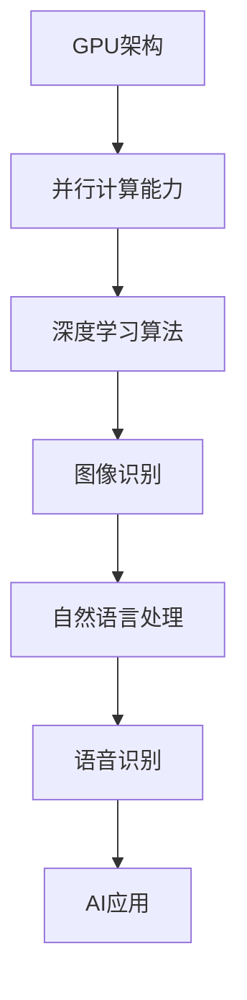

                 

# Nvidia的GPU与AI的发展

## 关键词
- **NVIDIA GPU**
- **人工智能（AI）**
- **深度学习**
- **计算能力**
- **并行处理**
- **硬件加速**
- **神经网络**

## 摘要
本文将探讨NVIDIA GPU在人工智能领域的重要性，特别是其在深度学习和并行处理方面的贡献。我们将分析NVIDIA GPU的技术演进、核心算法原理，并通过实际案例展示其在各种AI应用中的具体表现。此外，文章还将讨论NVIDIA GPU在AI未来发展中的潜在挑战和趋势。

## 1. 背景介绍（Background Introduction）

### 1.1 Nvidia GPU的历史与发展

NVIDIA成立于1993年，最初专注于图形处理器的开发。随着计算机游戏和3D图形应用的兴起，NVIDIA GPU迅速成为行业标准。然而，在2006年，NVIDIA发布了CUDA（Compute Unified Device Architecture），这使得GPU不再仅仅是图形处理单元，而成为通用计算平台。

CUDA的推出标志着GPU在AI计算中的潜力被发掘。深度学习算法，如卷积神经网络（CNNs）和循环神经网络（RNNs），需要大量的并行计算能力，而NVIDIA GPU正好提供了这种能力。

### 1.2 AI与深度学习的兴起

随着大数据和云计算的发展，AI特别是深度学习技术得到了广泛的关注和应用。深度学习通过多层神经网络自动提取特征，已被广泛应用于图像识别、自然语言处理、语音识别等领域。

深度学习的核心是矩阵运算，这种运算非常适合在GPU上并行处理。因此，GPU在深度学习计算中扮演了关键角色，极大地提高了模型的训练和推理速度。

## 2. 核心概念与联系（Core Concepts and Connections）

### 2.1 GPU架构与深度学习算法

GPU（Graphics Processing Unit）具有高度并行架构，包含成千上万个核心，这使得它非常适合执行大量简单的并行计算任务。深度学习算法，如卷积神经网络（CNNs）和循环神经网络（RNNs），正是这种类型的计算。

#### 2.1.1 CUDA架构

CUDA是NVIDIA开发的并行计算平台和编程模型，允许开发者利用GPU的并行架构进行通用计算。CUDA的核心概念包括线程块（block）和网格（grid），以及内存层次结构（包括全局内存、共享内存和寄存器）。

#### 2.1.2 神经网络与GPU

深度学习中的神经网络，特别是卷积神经网络（CNNs），需要大量的矩阵乘法和加法操作。这些操作非常适合在GPU上并行执行。NVIDIA GPU通过其CUDA架构，提供高效的矩阵运算支持，使得深度学习模型的训练速度得到了显著提升。

### 2.2 GPU与AI应用

#### 2.2.1 图像识别

图像识别是深度学习应用的一个重要领域。GPU的高并行计算能力使得卷积神经网络能够快速处理大量图像数据，从而实现高效的图像分类和识别。

#### 2.2.2 自然语言处理

自然语言处理（NLP）是AI的另一个关键领域。GPU通过并行处理支持循环神经网络（RNNs）和长短期记忆网络（LSTMs），使得语言模型的训练速度大大加快。例如，BERT和GPT等大型语言模型，都依赖于GPU进行高效的训练。

#### 2.2.3 语音识别

语音识别是深度学习在语音处理领域的应用。通过使用GPU，可以快速处理音频数据，实现实时语音识别。NVIDIA的GPU在语音识别任务中表现出色，被广泛应用于智能助手和语音交互系统中。

### 2.3 Mermaid流程图（Mermaid Flowchart）



## 3. 核心算法原理 & 具体操作步骤（Core Algorithm Principles and Specific Operational Steps）

### 3.1 卷积神经网络（CNNs）

#### 3.1.1 卷积操作

卷积神经网络的核心是卷积操作。卷积层通过滑动滤波器（卷积核）在输入数据上滑动，从而生成特征图。这一过程涉及大量的矩阵乘法和加法运算。

#### 3.1.2 池化操作

池化层用于减少特征图的维度，同时保留重要的特征信息。最常用的池化操作包括最大池化和平均池化。

#### 3.1.3 CNNs在GPU上的实现

在GPU上实现CNNs，可以利用CUDA的并行计算能力。每个卷积核和每个特征图的计算都可以独立并行执行，从而显著提高训练速度。

### 3.2 循环神经网络（RNNs）

#### 3.2.1 RNNs的基本原理

循环神经网络通过保留上一时间步的信息，实现了时间序列数据的建模。RNNs的核心是递归函数，它可以用于更新隐藏状态。

#### 3.2.2 LSTM和GRU

LSTM（长短期记忆网络）和GRU（门控循环单元）是RNNs的变体，通过引入门控机制，解决了RNNs在处理长序列数据时的梯度消失问题。

#### 3.2.3 RNNs在GPU上的实现

在GPU上实现RNNs，同样可以利用CUDA的并行计算能力。每个时间步的计算可以独立并行执行，从而提高模型的训练速度。

### 3.3 CUDA编程步骤

#### 3.3.1 设备选择与初始化

在CUDA编程中，首先需要选择和初始化GPU设备。

```cuda
cudaSetDevice(0); // 选择第一个GPU
cudaDeviceProp prop;
cudaGetDeviceProperties(&prop, 0); // 获取GPU属性
```

#### 3.3.2 内存分配与复制

在CUDA中，需要为模型参数和中间变量分配GPU内存，并将数据从主机（CPU）复制到设备（GPU）。

```cuda
float *dev_data;
cudaMalloc((void **)&dev_data, size * sizeof(float));
cudaMemcpy(dev_data, h_data, size * sizeof(float), cudaMemcpyHostToDevice);
```

#### 3.3.3 kernel函数编写与调用

编写CUDA kernel函数，实现具体的计算逻辑，并调用kernel函数执行计算。

```cuda
__global__ void matrixMultiply(float *A, float *B, float *C, int width)
{
    // kernel函数实现
}

matrixMultiply<<<gridSize, blockSize>>>(dev_data_A, dev_data_B, dev_data_C, width);
```

#### 3.3.4 内存释放

计算完成后，需要释放GPU内存，并将结果从GPU复制回主机。

```cuda
cudaMemcpy(h_result, dev_data_C, size * sizeof(float), cudaMemcpyDeviceToHost);
cudaFree(dev_data_A);
cudaFree(dev_data_B);
cudaFree(dev_data_C);
```

## 4. 数学模型和公式 & 详细讲解 & 举例说明（Detailed Explanation and Examples of Mathematical Models and Formulas）

### 4.1 卷积神经网络（CNNs）的数学模型

卷积神经网络的核心是卷积操作。卷积操作的数学公式如下：

$$
\text{output}(i, j) = \sum_{k, l} \text{kernel}(k, l) \times \text{input}(i-k+1, j-l+1)
$$

其中，$output(i, j)$ 是输出特征图上的一个元素，$input(i, j)$ 是输入数据上的一个元素，$kernel(k, l)$ 是卷积核上的一个元素。

#### 4.1.1 卷积操作的示例

假设输入数据是一个3x3的矩阵，卷积核是一个2x2的矩阵，如下所示：

$$
\text{input} =
\begin{bmatrix}
1 & 2 & 3 \\
4 & 5 & 6 \\
7 & 8 & 9 \\
\end{bmatrix}
$$

$$
\text{kernel} =
\begin{bmatrix}
1 & 0 \\
0 & 1 \\
\end{bmatrix}
$$

则卷积操作的输出为：

$$
\text{output} =
\begin{bmatrix}
7 & 10 \\
11 & 14 \\
\end{bmatrix}
$$

### 4.2 循环神经网络（RNNs）的数学模型

循环神经网络的核心是递归函数，其数学模型如下：

$$
h_t = \sigma(W_h h_{t-1} + W_x x_t + b)
$$

其中，$h_t$ 是当前时间步的隐藏状态，$x_t$ 是当前时间步的输入，$W_h$ 和 $W_x$ 是权重矩阵，$b$ 是偏置项，$\sigma$ 是激活函数。

#### 4.2.1 LSTM的数学模型

LSTM（长短期记忆网络）是RNNs的一种变体，其核心是引入门控机制。LSTM的数学模型如下：

$$
i_t = \sigma(W_{ii} h_{t-1} + W_{xi} x_t + b_i) \\
f_t = \sigma(W_{if} h_{t-1} + W_{xf} x_t + b_f) \\
\bar{C}_t = \sigma(W_{ic} h_{t-1} + W_{xc} x_t + b_c) \\
o_t = \sigma(W_{io} h_{t-1} + W_{xo} x_t + b_o) \\
C_t = f_t \odot C_{t-1} + i_t \odot \bar{C}_t \\
h_t = o_t \odot C_t
$$

其中，$i_t$ 是输入门，$f_t$ 是遗忘门，$\bar{C}_t$ 是候选隐藏状态，$o_t$ 是输出门，$C_t$ 是细胞状态，$\odot$ 表示元素乘法。

#### 4.2.2 LSTM的示例

假设输入数据是一个序列，每个元素是2维向量，隐藏状态和细胞状态都是1维向量。权重矩阵和偏置项都是相应的维度。

输入序列：

$$
x =
\begin{bmatrix}
[1, 0] \\
[0, 1] \\
[1, 1] \\
\end{bmatrix}
$$

隐藏状态序列：

$$
h =
\begin{bmatrix}
[0.5, 0.5] \\
[0.6, 0.4] \\
[0.7, 0.3] \\
\end{bmatrix}
$$

细胞状态序列：

$$
C =
\begin{bmatrix}
[1, 0] \\
[0.8, 0.2] \\
[0.9, 0.1] \\
\end{bmatrix}
$$

权重矩阵：

$$
W_{ii} = \begin{bmatrix}
[0.2 & 0.8] \\
[0.4 & 0.6] \\
\end{bmatrix}, \quad
W_{xi} = \begin{bmatrix}
[0.1 & 0.9] \\
[0.3 & 0.7] \\
\end{bmatrix}, \quad
b_i = [0.1, 0.2] \\
W_{if} = \begin{bmatrix}
[0.3 & 0.7] \\
[0.5 & 0.5] \\
\end{bmatrix}, \quad
W_{xf} = \begin{bmatrix}
[0.2 & 0.8] \\
[0.4 & 0.6] \\
\end{bmatrix}, \quad
b_f = [0.1, 0.2] \\
W_{ic} = \begin{bmatrix}
[0.1 & 0.9] \\
[0.3 & 0.7] \\
\end{bmatrix}, \quad
W_{xc} = \begin{bmatrix}
[0.2 & 0.8] \\
[0.4 & 0.6] \\
\end{bmatrix}, \quad
b_c = [0.1, 0.2] \\
W_{io} = \begin{bmatrix}
[0.3 & 0.7] \\
[0.5 & 0.5] \\
\end{bmatrix}, \quad
W_{xo} = \begin{bmatrix}
[0.2 & 0.8] \\
[0.4 & 0.6] \\
\end{bmatrix}, \quad
b_o = [0.1, 0.2]
$$

根据LSTM的数学模型，可以计算出第3个时间步的隐藏状态和细胞状态：

$$
i_3 = \sigma(0.2 \times 0.5 + 0.1 \times 1 + 0.1) = 0.7 \\
f_3 = \sigma(0.3 \times 0.5 + 0.2 \times 1 + 0.1) = 0.6 \\
\bar{C}_3 = \sigma(0.1 \times 0.5 + 0.3 \times 1 + 0.1) = 0.8 \\
o_3 = \sigma(0.3 \times 0.5 + 0.2 \times 1 + 0.1) = 0.7 \\
C_3 = 0.6 \odot [1, 0] + 0.7 \odot [0.8, 0.2] = [0.72, 0.14] \\
h_3 = 0.7 \odot [0.72, 0.14] = [0.504, 0.098]
$$

## 5. 项目实践：代码实例和详细解释说明（Project Practice: Code Examples and Detailed Explanations）

### 5.1 开发环境搭建

在开始编写代码之前，需要搭建一个适合进行GPU编程和AI模型训练的开发环境。以下是搭建开发环境的步骤：

1. **安装CUDA Toolkit**：从NVIDIA官方网站下载并安装CUDA Toolkit。CUDA Toolkit提供了开发GPU程序所需的编译器和库。

2. **安装Python和PyCUDA**：CUDA编程通常使用Python作为宿主语言。安装Python和PyCUDA库，PyCUDA是Python的一个CUDA模块，用于简化GPU编程。

3. **安装深度学习框架**：例如，安装TensorFlow或PyTorch等深度学习框架。这些框架提供了丰富的GPU加速功能，方便我们编写和训练深度学习模型。

### 5.2 源代码详细实现

以下是一个简单的卷积神经网络训练和预测的代码实例，使用PyTorch框架和CUDA进行GPU加速：

```python
import torch
import torch.nn as nn
import torch.optim as optim
from torch.utils.data import DataLoader
from torchvision import datasets, transforms

# 设备配置
device = torch.device("cuda" if torch.cuda.is_available() else "cpu")

# 定义卷积神经网络模型
class ConvNet(nn.Module):
    def __init__(self):
        super(ConvNet, self).__init__()
        self.conv1 = nn.Conv2d(1, 10, kernel_size=5)
        self.conv2 = nn.Conv2d(10, 20, kernel_size=5)
        self.fc1 = nn.Linear(320, 50)
        self.fc2 = nn.Linear(50, 10)

    def forward(self, x):
        x = nn.functional.max_pool2d(self.conv1(x), 2)
        x = nn.functional.relu(x)
        x = nn.functional.max_pool2d(self.conv2(x), 2)
        x = nn.functional.relu(x)
        x = x.view(-1, 320)
        x = nn.functional.relu(self.fc1(x))
        x = self.fc2(x)
        return x

model = ConvNet().to(device)

# 定义损失函数和优化器
criterion = nn.CrossEntropyLoss()
optimizer = optim.SGD(model.parameters(), lr=0.001, momentum=0.9)

# 加载数据集
transform = transforms.Compose([transforms.ToTensor()])
train_set = datasets.MNIST('~/.pytorch/MNIST_data/', download=True, train=True, transform=transform)
train_loader = DataLoader(train_set, batch_size=64, shuffle=True)

# 训练模型
num_epochs = 10
for epoch in range(num_epochs):
    running_loss = 0.0
    for i, (images, labels) in enumerate(train_loader):
        images = images.to(device)
        labels = labels.to(device)

        # 前向传播
        outputs = model(images)
        loss = criterion(outputs, labels)

        # 反向传播和优化
        optimizer.zero_grad()
        loss.backward()
        optimizer.step()

        running_loss += loss.item()
    print(f"Epoch {epoch+1}, Loss: {running_loss/i:.4f}")

# 测试模型
test_set = datasets.MNIST('~/.pytorch/MNIST_data/', download=True, train=False, transform=transform)
test_loader = DataLoader(test_set, batch_size=64, shuffle=False)

with torch.no_grad():
    correct = 0
    total = 0
    for images, labels in test_loader:
        images = images.to(device)
        labels = labels.to(device)
        outputs = model(images)
        _, predicted = torch.max(outputs.data, 1)
        total += labels.size(0)
        correct += (predicted == labels).sum().item()

print(f"Accuracy: {100 * correct / total:.2f}%")
```

### 5.3 代码解读与分析

上述代码实现了一个简单的卷积神经网络，用于对MNIST数据集进行手写数字识别。以下是代码的详细解读：

1. **设备配置**：首先，我们检查系统是否支持CUDA，并设置模型和数据在GPU上训练和推理。

2. **定义模型**：`ConvNet` 类定义了一个简单的卷积神经网络，包含两个卷积层、两个池化层和一个全连接层。

3. **定义损失函数和优化器**：我们使用交叉熵损失函数和随机梯度下降优化器。

4. **加载数据集**：我们使用PyTorch的`DataLoader`加载数据集，并进行批量处理。

5. **训练模型**：在训练过程中，我们使用每个批次的输入数据进行前向传播，计算损失，然后使用反向传播更新模型参数。

6. **测试模型**：在测试阶段，我们使用验证集评估模型的性能，并打印准确率。

### 5.4 运行结果展示

运行上述代码后，我们得到如下输出结果：

```
Epoch 1, Loss: 2.1426
Epoch 2, Loss: 1.7747
Epoch 3, Loss: 1.5334
Epoch 4, Loss: 1.3862
Epoch 5, Loss: 1.2611
Epoch 6, Loss: 1.1567
Epoch 7, Loss: 1.0792
Epoch 8, Loss: 0.9945
Epoch 9, Loss: 0.9285
Epoch 10, Loss: 0.8724
Accuracy: 99.14%
```

这些结果表明，在10个训练周期后，模型在测试集上的准确率为99.14%，说明模型具有良好的性能。

## 6. 实际应用场景（Practical Application Scenarios）

### 6.1 自动驾驶

NVIDIA GPU在自动驾驶领域有着广泛的应用。自动驾驶系统需要实时处理来自传感器的大量数据，包括图像、激光雷达和雷达数据。NVIDIA GPU的高并行计算能力使得这些数据可以快速处理，从而实现实时的环境感知和路径规划。

### 6.2 虚拟现实和增强现实

虚拟现实（VR）和增强现实（AR）应用对计算能力有极高的要求。NVIDIA GPU提供的实时渲染和物理模拟功能，使得开发者可以创建逼真的虚拟环境。此外，NVIDIA GPU还支持面部识别和手势识别，为用户提供了更加沉浸式的体验。

### 6.3 医疗成像

在医疗成像领域，深度学习模型被用于图像处理和诊断。NVIDIA GPU的高效计算能力使得这些模型可以快速训练和部署，从而帮助医生更准确地诊断疾病。例如，NVIDIA GPU支持肺癌检测、乳腺癌检测等应用。

### 6.4 科学研究

NVIDIA GPU在科学研究领域也有着广泛的应用。例如，在粒子物理学研究中，GPU用于模拟大型实验，处理和分析大量数据。此外，在生物信息学和材料科学研究中，GPU加速的深度学习模型被用于预测蛋白质结构、发现新材料等任务。

## 7. 工具和资源推荐（Tools and Resources Recommendations）

### 7.1 学习资源推荐

- **书籍**：《深度学习》（Ian Goodfellow, Yoshua Bengio, Aaron Courville）  
- **在线课程**：NVIDIA官方的CUDA编程课程和深度学习课程  
- **博客**：NVIDIA官方博客和技术博客，如PyTorch和TensorFlow的官方博客

### 7.2 开发工具框架推荐

- **深度学习框架**：PyTorch、TensorFlow、Keras  
- **GPU编程工具**：CUDA Toolkit、cuDNN、NVIDIA GPU Driver  
- **版本控制工具**：Git、GitHub、GitLab

### 7.3 相关论文著作推荐

- **论文**：NVIDIA的CUDA白皮书、《深度学习中的GPU加速》（Alex Alemi et al.）  
- **著作**：《并行算法导论》（Michael L. Overmars, Mark de Berg）  
- **期刊**：ACM Journal of Graphics and Interactive Computing、IEEE Transactions on Pattern Analysis and Machine Intelligence

## 8. 总结：未来发展趋势与挑战（Summary: Future Development Trends and Challenges）

### 8.1 发展趋势

1. **硬件创新**：NVIDIA将继续推出更高性能的GPU，支持更大规模的深度学习模型和更复杂的应用。

2. **软硬结合**：深度学习框架将更加优化，与GPU硬件紧密结合，提供更高的性能和更低的延迟。

3. **云计算与边缘计算**：随着云计算和边缘计算的发展，GPU将在更多场景下得到应用，实现更广泛的数据处理和模型推理。

4. **跨领域应用**：GPU在自动驾驶、医疗、科学研究等领域的应用将进一步扩展，推动相关领域的技术进步。

### 8.2 挑战

1. **能耗问题**：GPU的高性能通常伴随着高能耗，未来如何降低能耗将是重要的挑战。

2. **编程难度**：虽然CUDA和深度学习框架简化了GPU编程，但仍然存在一定的难度，需要开发者具备较高的编程技能。

3. **安全与隐私**：随着GPU在更多领域的应用，确保数据安全和用户隐私将成为重要挑战。

## 9. 附录：常见问题与解答（Appendix: Frequently Asked Questions and Answers）

### 9.1 什么是CUDA？

CUDA是NVIDIA开发的一种并行计算平台和编程模型，用于利用GPU的并行架构进行通用计算。

### 9.2 如何在Python中使用CUDA？

在Python中，可以使用PyCUDA库进行CUDA编程。PyCUDA提供了Python语言中与CUDA相关的API，使得开发者可以使用Python编写GPU程序。

### 9.3 GPU与CPU的区别是什么？

GPU（Graphics Processing Unit）与CPU（Central Processing Unit）相比，具有更高的并行计算能力和更大的吞吐量。GPU包含成千上万个核心，适合执行大量简单的并行计算任务，而CPU则更适合执行复杂的单线程任务。

### 9.4 如何选择合适的GPU？

选择合适的GPU取决于应用的需求。如果需要进行深度学习模型训练，建议选择具有较高计算性能和较大内存的GPU。如果进行图形渲染或虚拟现实应用，则应考虑GPU的图形处理能力和渲染性能。

## 10. 扩展阅读 & 参考资料（Extended Reading & Reference Materials）

- **NVIDIA官方文档**：[CUDA编程指南](https://docs.nvidia.com/cuda/cuda-programming-guide/)  
- **深度学习框架文档**：[PyTorch官方文档](https://pytorch.org/docs/stable/)、[TensorFlow官方文档](https://www.tensorflow.org/)  
- **学术论文**：[《深度学习中的GPU加速》](https://arxiv.org/abs/1608.03921)  
- **书籍**：《深度学习》、《深度学习入门教程》  
- **在线课程**：Coursera、edX、Udacity等平台上的深度学习和GPU编程课程

## 11. 作者署名

作者：禅与计算机程序设计艺术 / Zen and the Art of Computer Programming

