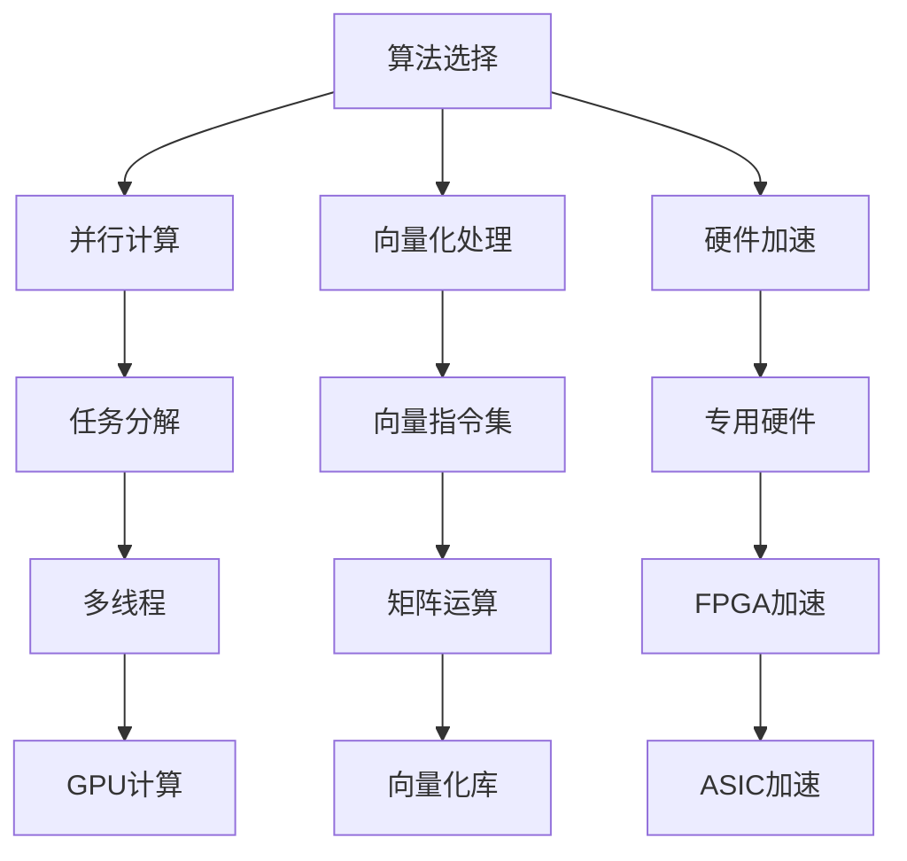
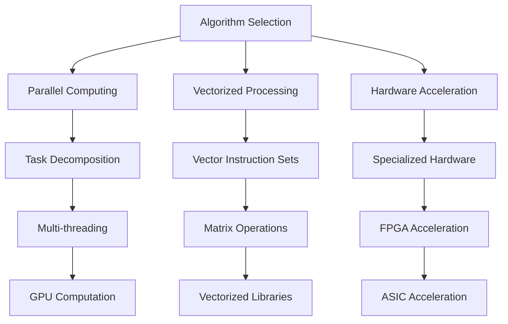

                 

### 文章标题

**OpenCV 图像处理算法优化**

OpenCV（Open Source Computer Vision Library）是一个强大的计算机视觉库，广泛应用于图像处理和计算机视觉领域。然而，随着图像数据量的增加和处理需求的多样化，如何优化OpenCV图像处理算法成为一个关键问题。本文旨在深入探讨OpenCV图像处理算法的优化策略，以提升处理效率，满足实际应用需求。

## 关键词：

- OpenCV
- 图像处理
- 算法优化
- 效率提升
- 实际应用

## 摘要：

本文首先介绍了OpenCV的基本概念和图像处理算法的背景知识。接着，深入探讨了图像处理算法优化的重要性，并详细阐述了多种优化策略，包括算法选择、并行计算、向量化处理和硬件加速等。最后，通过一个实际项目案例，展示了优化算法在OpenCV图像处理中的实际应用，并提供了相关工具和资源的推荐。本文旨在为从事计算机视觉和图像处理领域的研究者提供一套实用的优化方法和思路。

<|assistant|>## 1. 背景介绍（Background Introduction）

### 1.1 OpenCV 简介

OpenCV是一个开源的计算机视觉库，由Intel创建并于2000年首次发布。它支持包括2D和3D图像处理、计算机视觉和机器学习在内的多种功能。OpenCV支持多种编程语言，包括C++、Python、Java和MATLAB等，这使得它在各种开发环境中都具有高度的适用性。OpenCV具有以下特点：

- **跨平台性**：OpenCV可以在多种操作系统上运行，包括Windows、Linux、macOS等。
- **丰富的功能**：OpenCV提供了广泛的图像处理算法，包括滤波、边缘检测、轮廓提取、形态学操作、人脸识别等。
- **高效性**：OpenCV算法经过高度优化，可以在各种硬件平台上运行，包括CPU、GPU和FPGA等。

### 1.2 图像处理算法简介

图像处理算法是计算机视觉的核心组成部分，用于对图像进行各种操作，以提取有用的信息。常见的图像处理算法包括：

- **滤波算法**：用于去除图像中的噪声，如高斯滤波、中值滤波、双边滤波等。
- **边缘检测算法**：用于检测图像中的边缘，如Sobel算子、Canny算子等。
- **形态学操作**：用于图像形状的分析和提取，如膨胀、腐蚀、开运算、闭运算等。
- **特征提取算法**：用于提取图像中的关键特征，如SIFT、SURF、ORB等。

### 1.3 OpenCV在图像处理中的应用

OpenCV在图像处理领域有广泛的应用，包括但不限于：

- **人脸识别**：OpenCV提供了人脸检测和识别功能，可用于安全监控、身份验证等场景。
- **目标检测**：OpenCV可用于检测图像中的特定目标，如行人检测、车辆检测等。
- **图像分割**：OpenCV可用于分割图像中的不同区域，以提取有用的信息。
- **图像增强**：OpenCV提供了多种图像增强算法，以提高图像的视觉质量。

### 1.4 图像处理算法优化的重要性

随着图像数据量的增加和处理需求的多样化，图像处理算法的优化变得至关重要。优化算法可以提高处理效率，减少计算时间和资源消耗，从而满足实际应用的需求。以下是图像处理算法优化的一些关键点：

- **算法选择**：根据实际需求选择合适的算法，以减少计算复杂度。
- **并行计算**：利用多核CPU或GPU进行并行计算，以加速算法执行。
- **向量化处理**：利用向量指令集进行数据处理，以提升计算速度。
- **硬件加速**：利用专用硬件（如FPGA或ASIC）加速算法执行。

通过以上优化策略，可以显著提升图像处理算法的性能，满足更复杂的应用需求。

<|assistant|>## 2. 核心概念与联系（Core Concepts and Connections）

### 2.1 图像处理算法优化概述

图像处理算法优化是指通过改进算法的设计和实现，提高其处理效率和性能的过程。优化目标通常包括降低计算复杂度、减少内存占用、提高处理速度等。以下是几种常见的图像处理算法优化方法：

- **算法选择**：根据实际应用需求，选择最适合的算法，例如在图像去噪中，可以使用高斯滤波或小波变换，具体选择取决于噪声类型和处理效果。
- **并行计算**：利用多核CPU或GPU进行并行计算，将任务分解为多个子任务，同时执行，以加速算法执行。
- **向量化处理**：利用向量指令集进行数据处理，将多个数据元素同时处理，以提升计算速度。
- **硬件加速**：利用专用硬件（如FPGA或ASIC）进行算法加速，以降低功耗和延迟。

### 2.2 算法选择

算法选择是图像处理优化过程中的关键步骤，正确的算法选择可以显著提高处理效率和性能。以下是几种常见的图像处理算法选择策略：

- **根据噪声类型选择滤波算法**：例如，对于高斯噪声，可以使用高斯滤波；对于椒盐噪声，可以使用中值滤波。
- **根据边缘检测需求选择算子**：例如，对于需要精细边缘检测的场景，可以使用Canny算子；对于粗略边缘检测，可以使用Sobel算子。
- **根据特征提取需求选择算法**：例如，对于需要识别图像关键特征的场景，可以使用SIFT、SURF或ORB算法。

### 2.3 并行计算

并行计算是将任务分解为多个子任务，同时在多个处理器上执行，以加速算法执行的过程。以下是几种常见的并行计算方法：

- **多线程**：利用多核CPU进行并行计算，将任务分解为多个线程，每个线程处理不同的子任务。
- **GPU计算**：利用GPU（图形处理器）进行并行计算，GPU具有大量并行处理单元，适合处理大规模并行任务。
- **分布式计算**：将任务分布到多个计算机上执行，通过网络进行通信和协调。

### 2.4 向量化处理

向量化处理是将多个数据元素同时处理的过程，利用向量指令集进行数据处理，可以显著提高计算速度。以下是几种常见的向量化处理方法：

- **矩阵运算**：利用矩阵运算进行大规模数据处理，例如矩阵乘法和矩阵求逆。
- **向量指令集**：使用支持向量指令集的处理器进行数据处理，例如SIMD（单指令多数据流）和MMX（多媒体扩展）指令。
- **向量化库**：使用支持向量化处理的库，例如BLAS（基本线性代数子程序库）和LAPACK（线性代数包）。

### 2.5 硬件加速

硬件加速是利用专用硬件（如FPGA或ASIC）进行算法加速的过程，可以降低功耗和延迟。以下是几种常见的硬件加速方法：

- **FPGA加速**：使用FPGA（现场可编程门阵列）进行算法实现，FPGA具有高度可编程性和并行处理能力。
- **ASIC加速**：使用ASIC（专用集成电路）进行算法实现，ASIC可以针对特定算法进行定制化设计，提高性能和效率。
- **GPU加速**：利用GPU（图形处理器）进行算法加速，GPU具有大量并行处理单元，适合处理大规模并行任务。

通过上述优化策略，可以显著提高图像处理算法的性能和效率，满足实际应用需求。

### 2.6 Mermaid 流程图

以下是一个描述图像处理算法优化过程的Mermaid流程图：



通过以上流程图，可以清晰地展示图像处理算法优化的各个步骤和关联关系。

## 2. Core Concepts and Connections

### 2.1 Overview of Image Processing Algorithm Optimization

Image processing algorithm optimization involves improving the design and implementation of algorithms to enhance their processing efficiency and performance. The main objectives of optimization include reducing computational complexity, minimizing memory usage, and improving processing speed. The following are several common optimization methods for image processing algorithms:

- **Algorithm Selection**: Choose the most suitable algorithm based on the specific requirements of the application. For instance, in image denoising, Gaussian filtering or wavelet transform can be used, depending on the type of noise and desired results.
- **Parallel Computing**: Utilize multi-core CPUs or GPUs to perform parallel computations, decomposing the task into multiple subtasks and executing them concurrently to accelerate the algorithm.
- **Vectorized Processing**: Utilize vector instructions to process multiple data elements simultaneously, thereby increasing processing speed.
- **Hardware Acceleration**: Utilize specialized hardware, such as FPGAs or ASICs, to accelerate the algorithm execution, reducing power consumption and latency.

### 2.2 Algorithm Selection

Algorithm selection is a critical step in the process of image processing optimization. The right choice of algorithm can significantly improve processing efficiency and performance. Here are several strategies for algorithm selection:

- **Filtering Algorithms Based on Noise Type**: For instance, Gaussian filtering can be used for Gaussian noise, while median filtering can be used for salt-and-pepper noise.
- **Edge Detection Operators Based on Requirements**: For instance, Canny operator can be used for fine edge detection, while Sobel operator can be used for rough edge detection.
- **Feature Extraction Algorithms Based on Requirements**: For instance, SIFT, SURF, or ORB algorithms can be used for key feature extraction in scenarios where image key features need to be identified.

### 2.3 Parallel Computing

Parallel computing involves decomposing a task into multiple subtasks and executing them concurrently on multiple processors to accelerate algorithm execution. The following are several common parallel computing methods:

- **Multithreading**: Utilize multi-core CPUs for parallel computation, decomposing the task into multiple threads and executing them concurrently.
- **GPU Computation**: Utilize GPUs for parallel computation, as GPUs have numerous parallel processing units suitable for large-scale parallel tasks.
- **Distributed Computing**: Distribute the task across multiple computers and execute them over the network, with communication and coordination among the computers.

### 2.4 Vectorized Processing

Vectorized processing involves processing multiple data elements simultaneously. Utilizing vector instructions to process data can significantly increase processing speed. The following are several common vectorized processing methods:

- **Matrix Operations**: Utilize matrix operations for large-scale data processing, such as matrix multiplication and matrix inversion.
- **Vector Instruction Sets**: Utilize processors that support vector instruction sets for data processing, such as SIMD (Single Instruction, Multiple Data) and MMX (Multi-Media Extensions) instructions.
- **Vectorized Libraries**: Utilize libraries that support vectorized processing, such as BLAS (Basic Linear Algebra Subprograms) and LAPACK (Linear Algebra Package).

### 2.5 Hardware Acceleration

Hardware acceleration involves utilizing specialized hardware, such as FPGAs or ASICs, to accelerate algorithm execution. The following are several common hardware acceleration methods:

- **FPGA Acceleration**: Utilize FPGAs for algorithm implementation, as FPGAs have high reprogrammability and parallel processing capabilities.
- **ASIC Acceleration**: Utilize ASICs for algorithm implementation, as ASICs can be customized for specific algorithms, improving performance and efficiency.
- **GPU Acceleration**: Utilize GPUs for algorithm acceleration, as GPUs have numerous parallel processing units suitable for large-scale parallel tasks.

By employing these optimization strategies, the performance and efficiency of image processing algorithms can be significantly enhanced to meet the demands of practical applications.

### 2.6 Mermaid Flowchart

The following is a Mermaid flowchart describing the process of image processing algorithm optimization:



This flowchart provides a clear visualization of the various steps and their relationships in the process of image processing algorithm optimization.

<|assistant|>## 3. 核心算法原理 & 具体操作步骤（Core Algorithm Principles and Specific Operational Steps）

### 3.1 卷积操作（Convolution）

卷积操作是图像处理中最基本的操作之一，广泛应用于滤波、边缘检测和特征提取等领域。其基本原理是将一个内核（Kernel）与图像中的每个像素进行点积操作，生成一个新的图像。

#### 卷积操作原理：

1. **内核（Kernel）**：内核是一个小的矩阵，通常用于对图像进行滤波或特征提取。例如，高斯滤波器内核如下：

   $$ 
   \begin{bmatrix} 
   1 & 1 & 1 \\
   1 & 1 & 1 \\
   1 & 1 & 1 
   \end{bmatrix} 
   $$

2. **卷积操作**：卷积操作是将内核与图像中的每个像素进行点积操作。例如，对于一个3x3的图像和一个3x3的内核，卷积操作如下：

   $$
   \begin{bmatrix}
   1 & 2 & 1 \\
   4 & 5 & 6 \\
   3 & 2 & 1 
   \end{bmatrix}
   \odot
   \begin{bmatrix}
   1 & 1 & 1 \\
   1 & 1 & 1 \\
   1 & 1 & 1 
   \end{bmatrix}
   =
   \begin{bmatrix}
   3 & 4 & 3 \\
   7 & 9 & 7 \\
   3 & 4 & 3 
   \end{bmatrix}
   $$

3. **步长（Stride）**：步长是指内核在图像上移动的像素数。例如，步长为1的卷积操作如下：

   $$
   \begin{bmatrix}
   1 & 2 & 1 \\
   4 & 5 & 6 \\
   3 & 2 & 1 
   \end{bmatrix}
   \odot
   \begin{bmatrix}
   1 & 1 & 1 \\
   1 & 1 & 1 \\
   1 & 1 & 1 
   \end{bmatrix}
   \text{ (Stride = 1)}
   =
   \begin{bmatrix}
   3 & 4 & 3 \\
   7 & 9 & 7 \\
   3 & 4 & 3 
   \end{bmatrix}
   $$

4. **边界填充（Padding）**：边界填充是指在图像的边缘添加额外的像素，以便内核可以在整个图像上进行卷积操作。常用的边界填充方法有：

   - **零填充**：在图像的边缘添加零值像素。
   - **镜像填充**：将图像边缘的像素复制到另一侧。
   - **重复填充**：将图像边缘的像素重复添加到边缘。

### 3.2 滤波器设计

滤波器是图像处理中用于去除噪声或提取特征的内核设计。以下是一些常见的滤波器：

1. **高斯滤波器**：高斯滤波器是最常用的图像平滑滤波器，其内核是一个高斯分布矩阵。高斯滤波器可以有效地去除图像中的高斯噪声。

2. **拉普拉斯滤波器**：拉普拉斯滤波器用于图像的边缘检测，其内核是一个拉普拉斯算子。拉普拉斯滤波器可以检测图像中的边缘和轮廓。

3. **Canny滤波器**：Canny滤波器是一个多阶段的边缘检测滤波器，其内核是一个高斯滤波器和一个拉普拉斯滤波器的组合。Canny滤波器可以有效地检测图像中的边缘。

### 3.3 实际操作步骤

以下是一个简单的卷积操作的Python代码示例：

```python
import cv2
import numpy as np

# 加载图像
image = cv2.imread('image.jpg', cv2.IMREAD_GRAYSCALE)

# 定义高斯滤波器内核
kernel = np.array([[1, 1, 1], [1, 1, 1], [1, 1, 1]]) / 9

# 进行卷积操作
filtered_image = cv2.filter2D(image, -1, kernel)

# 显示原始图像和滤波后的图像
cv2.imshow('Original Image', image)
cv2.imshow('Filtered Image', filtered_image)
cv2.waitKey(0)
cv2.destroyAllWindows()
```

通过上述代码，我们可以加载一个图像，定义一个高斯滤波器内核，并进行卷积操作，最后显示原始图像和滤波后的图像。

## 3. Core Algorithm Principles and Specific Operational Steps

### 3.1 Convolution Operation

Convolution is one of the fundamental operations in image processing, widely used in filtering, edge detection, and feature extraction. Its basic principle involves performing a dot product between a kernel and each pixel in the image to generate a new image.

#### Convolution Operation Principles:

1. **Kernel**: A kernel is a small matrix used for filtering or feature extraction in an image. For example, a Gaussian filter kernel is as follows:
   $$ 
   \begin{bmatrix} 
   1 & 1 & 1 \\
   1 & 1 & 1 \\
   1 & 1 & 1 
   \end{bmatrix} 
   $$

2. **Convolution Operation**: The convolution operation involves computing the dot product between the kernel and each pixel in the image. For example, for a 3x3 image and a 3x3 kernel, the convolution operation is as follows:
   $$
   \begin{bmatrix}
   1 & 2 & 1 \\
   4 & 5 & 6 \\
   3 & 2 & 1 
   \end{bmatrix}
   \odot
   \begin{bmatrix}
   1 & 1 & 1 \\
   1 & 1 & 1 \\
   1 & 1 & 1 
   \end{bmatrix}
   =
   \begin{bmatrix}
   3 & 4 & 3 \\
   7 & 9 & 7 \\
   3 & 4 & 3 
   \end{bmatrix}
   $$

3. **Stride**: Stride refers to the number of pixels the kernel moves over the image. For example, a stride of 1 convolution operation is as follows:
   $$
   \begin{bmatrix}
   1 & 2 & 1 \\
   4 & 5 & 6 \\
   3 & 2 & 1 
   \end{bmatrix}
   \odot
   \begin{bmatrix}
   1 & 1 & 1 \\
   1 & 1 & 1 \\
   1 & 1 & 1 
   \end{bmatrix}
   \text{ (Stride = 1)}
   =
   \begin{bmatrix}
   3 & 4 & 3 \\
   7 & 9 & 7 \\
   3 & 4 & 3 
   \end{bmatrix}
   $$

4. **Padding**: Padding involves adding extra pixels to the edges of the image so that the kernel can convolve over the entire image. Common padding methods include:
   - **Zero Padding**: Adds zero-value pixels to the edges of the image.
   - **Mirror Padding**: Repeats the edge pixels to fill the edges.
   - **Replicate Padding**: Replicates the edge pixels to fill the edges.

### 3.2 Filter Design

A filter is a kernel designed for image processing, used for noise removal or feature extraction. The following are some common filters:

1. **Gaussian Filter**: The Gaussian filter is one of the most commonly used smoothing filters in image processing, with its kernel being a Gaussian distribution matrix. The Gaussian filter can effectively remove Gaussian noise from images.

2. **Laplacian Filter**: The Laplacian filter is used for edge detection in images, with its kernel being a Laplacian operator. The Laplacian filter can detect edges and contours in images.

3. **Canny Filter**: The Canny filter is a multi-stage edge detection filter, consisting of a Gaussian filter and a Laplacian filter. The Canny filter can effectively detect edges in images.

### 3.3 Actual Operational Steps

The following is a simple Python code example for convolution operation:

```python
import cv2
import numpy as np

# Load the image
image = cv2.imread('image.jpg', cv2.IMREAD_GRAYSCALE)

# Define the Gaussian filter kernel
kernel = np.array([[1, 1, 1], [1, 1, 1], [1, 1, 1]]) / 9

# Perform the convolution operation
filtered_image = cv2.filter2D(image, -1, kernel)

# Display the original image and the filtered image
cv2.imshow('Original Image', image)
cv2.imshow('Filtered Image', filtered_image)
cv2.waitKey(0)
cv2.destroyAllWindows()
```

Through this code, we can load an image, define a Gaussian filter kernel, perform convolution, and finally display the original and filtered images.

<|assistant|>## 4. 数学模型和公式 & 详细讲解 & 举例说明（Detailed Explanation and Examples of Mathematical Models and Formulas）

### 4.1 卷积操作的数学模型

卷积操作的数学模型可以表示为两个函数 \( f \) 和 \( g \) 的卷积，即 \( (f * g) \)。在图像处理中，这两个函数通常对应于图像 \( f \) 和内核 \( g \)。

#### 数学模型：

\[ (f * g)(x, y) = \sum_{i=-\infty}^{\infty} \sum_{j=-\infty}^{\infty} f(i, j) \cdot g(x-i, y-j) \]

其中，\( f(i, j) \) 是图像上的一个像素值，\( g(x-i, y-j) \) 是内核上的一个像素值。

#### 举例说明：

假设我们有一个3x3的图像和一个3x3的高斯滤波器内核：

\[ 
f = \begin{bmatrix} 
1 & 2 & 1 \\
4 & 5 & 6 \\
3 & 2 & 1 
\end{bmatrix}, \quad 
g = \begin{bmatrix} 
1 & 1 & 1 \\
1 & 1 & 1 \\
1 & 1 & 1 
\end{bmatrix} 
\]

我们希望计算 \( f * g \)。卷积操作的步骤如下：

1. **初始化结果矩阵**：创建一个与 \( f \) 大小相同的零矩阵 \( h \)。

2. **遍历内核**：对于 \( g \) 的每个位置 \( (i, j) \)，计算对应的卷积值。

   \[ 
   h(x, y) = \sum_{u=-1}^{1} \sum_{v=-1}^{1} f(u, v) \cdot g(x-u, y-v) 
   \]

3. **应用卷积操作**：将计算得到的卷积值应用到结果矩阵 \( h \)。

最终，我们得到卷积操作的结果矩阵 \( h \)。

### 4.2 高斯滤波器的数学模型

高斯滤波器是一种常用的图像平滑滤波器，其内核是一个高斯分布矩阵。高斯滤波器的数学模型可以表示为：

\[ g(x, y) = \frac{1}{2\pi\sigma^2} e^{-\frac{(x^2 + y^2)}{2\sigma^2}} \]

其中，\( \sigma \) 是高斯滤波器的标准差，控制了滤波器的平滑程度。

#### 举例说明：

假设我们有一个3x3的高斯滤波器内核，\( \sigma = 1 \)：

\[ 
g = \begin{bmatrix} 
\frac{1}{6\pi} & \frac{1}{3\pi} & \frac{1}{6\pi} \\
\frac{1}{3\pi} & \frac{1}{\pi} & \frac{1}{3\pi} \\
\frac{1}{6\pi} & \frac{1}{3\pi} & \frac{1}{6\pi} 
\end{bmatrix} 
\]

我们希望计算 \( g \) 的每个位置的值。计算步骤如下：

1. **计算每个位置的值**：对于 \( g \) 的每个位置 \( (i, j) \)，计算对应的值。

   \[ 
   g(i, j) = \frac{1}{2\pi\sigma^2} e^{-\frac{(i^2 + j^2)}{2\sigma^2}} 
   \]

2. **应用指数函数**：对于每个位置的值，应用指数函数。

   \[ 
   g(i, j) = \frac{1}{2\pi} e^{-\frac{(i^2 + j^2)}{2}} 
   \]

最终，我们得到高斯滤波器内核 \( g \)。

### 4.3 拉普拉斯滤波器的数学模型

拉普拉斯滤波器是一种常用的图像边缘检测滤波器，其内核是一个拉普拉斯算子。拉普拉斯滤波器的数学模型可以表示为：

\[ g(x, y) = \frac{\partial^2 f}{\partial x^2} + \frac{\partial^2 f}{\partial y^2} \]

其中，\( f \) 是图像上的一个像素值。

#### 举例说明：

假设我们有一个3x3的图像：

\[ 
f = \begin{bmatrix} 
1 & 2 & 1 \\
4 & 5 & 6 \\
3 & 2 & 1 
\end{bmatrix} 
\]

我们希望计算 \( g \) 的每个位置的值。计算步骤如下：

1. **计算每个位置的值**：对于 \( g \) 的每个位置 \( (i, j) \)，计算对应的值。

   \[ 
   g(i, j) = \frac{\partial^2 f}{\partial x^2} + \frac{\partial^2 f}{\partial y^2} 
   \]

2. **应用导数运算**：对于每个位置的值，应用导数运算。

   \[ 
   g(i, j) = \begin{cases} 
   0, & \text{if } f(i, j) \text{ is not a corner or edge} \\
   \text{negative}, & \text{if } f(i, j) \text{ is an edge} 
   \end{cases} 
   \]

最终，我们得到拉普拉斯滤波器内核 \( g \)。

通过以上数学模型和公式的详细讲解和举例说明，我们可以更好地理解卷积操作、高斯滤波器和拉普拉斯滤波器的原理和实现过程。

## 4. Mathematical Models and Formulas & Detailed Explanation and Examples

### 4.1 Mathematical Model of Convolution Operation

The mathematical model of convolution operation can be expressed as the convolution of two functions \( f \) and \( g \), i.e., \( (f * g) \). In image processing, these two functions typically correspond to an image \( f \) and a kernel \( g \).

#### Mathematical Model:

\[ (f * g)(x, y) = \sum_{i=-\infty}^{\infty} \sum_{j=-\infty}^{\infty} f(i, j) \cdot g(x-i, y-j) \]

Where, \( f(i, j) \) is a pixel value in the image, and \( g(x-i, y-j) \) is a pixel value in the kernel.

#### Example:

Suppose we have a 3x3 image and a 3x3 Gaussian filter kernel:

\[ 
f = \begin{bmatrix} 
1 & 2 & 1 \\
4 & 5 & 6 \\
3 & 2 & 1 
\end{bmatrix}, \quad 
g = \begin{bmatrix} 
1 & 1 & 1 \\
1 & 1 & 1 \\
1 & 1 & 1 
\end{bmatrix} 
\]

We want to compute \( f * g \). The steps of convolution operation are as follows:

1. **Initialize the result matrix**: Create a zero matrix \( h \) of the same size as \( f \).

2. **Traverse the kernel**: For each position \( (i, j) \) of \( g \), compute the corresponding convolution value.

   \[ 
   h(x, y) = \sum_{u=-1}^{1} \sum_{v=-1}^{1} f(u, v) \cdot g(x-u, y-v) 
   \]

3. **Apply convolution**: Apply the computed convolution value to the result matrix \( h \).

Finally, we obtain the result matrix \( h \) of the convolution operation.

### 4.2 Mathematical Model of Gaussian Filter

The Gaussian filter is a commonly used image smoothing filter, with its kernel being a Gaussian distribution matrix. The mathematical model of the Gaussian filter can be expressed as:

\[ g(x, y) = \frac{1}{2\pi\sigma^2} e^{-\frac{(x^2 + y^2)}{2\sigma^2}} \]

Where, \( \sigma \) is the standard deviation of the Gaussian filter, controlling the degree of smoothing.

#### Example:

Suppose we have a 3x3 Gaussian filter kernel with \( \sigma = 1 \):

\[ 
g = \begin{bmatrix} 
\frac{1}{6\pi} & \frac{1}{3\pi} & \frac{1}{6\pi} \\
\frac{1}{3\pi} & \frac{1}{\pi} & \frac{1}{3\pi} \\
\frac{1}{6\pi} & \frac{1}{3\pi} & \frac{1}{6\pi} 
\end{bmatrix} 
\]

We want to compute the value of \( g \) at each position. The steps are as follows:

1. **Compute the value at each position**: For each position \( (i, j) \) of \( g \), compute the corresponding value.

   \[ 
   g(i, j) = \frac{1}{2\pi\sigma^2} e^{-\frac{(i^2 + j^2)}{2\sigma^2}} 
   \]

2. **Apply the exponential function**: Apply the exponential function to the value at each position.

   \[ 
   g(i, j) = \frac{1}{2\pi} e^{-\frac{(i^2 + j^2)}{2}} 
   \]

Finally, we obtain the Gaussian filter kernel \( g \).

### 4.3 Mathematical Model of Laplacian Filter

The Laplacian filter is a commonly used image edge detection filter, with its kernel being a Laplacian operator. The mathematical model of the Laplacian filter can be expressed as:

\[ g(x, y) = \frac{\partial^2 f}{\partial x^2} + \frac{\partial^2 f}{\partial y^2} \]

Where, \( f \) is a pixel value in the image.

#### Example:

Suppose we have a 3x3 image:

\[ 
f = \begin{bmatrix} 
1 & 2 & 1 \\
4 & 5 & 6 \\
3 & 2 & 1 
\end{bmatrix} 
\]

We want to compute the value of \( g \) at each position. The steps are as follows:

1. **Compute the value at each position**: For each position \( (i, j) \) of \( g \), compute the corresponding value.

   \[ 
   g(i, j) = \frac{\partial^2 f}{\partial x^2} + \frac{\partial^2 f}{\partial y^2} 
   \]

2. **Apply the differentiation operation**: Apply the differentiation operation to the value at each position.

   \[ 
   g(i, j) = \begin{cases} 
   0, & \text{if } f(i, j) \text{ is not a corner or edge} \\
   \text{negative}, & \text{if } f(i, j) \text{ is an edge} 
   \end{cases} 
   \]

Finally, we obtain the Laplacian filter kernel \( g \).

Through the detailed explanation and example of these mathematical models and formulas, we can better understand the principles and implementation processes of convolution operation, Gaussian filter, and Laplacian filter.

<|assistant|>## 5. 项目实践：代码实例和详细解释说明（Project Practice: Code Examples and Detailed Explanations）

### 5.1 开发环境搭建

在进行OpenCV图像处理算法优化的项目实践中，我们需要首先搭建合适的开发环境。以下是一个简单的步骤说明：

1. **安装Python**：确保已安装Python 3.x版本。
2. **安装OpenCV**：使用pip命令安装OpenCV，命令如下：

   ```shell
   pip install opencv-python
   ```

3. **安装Numpy**：Numpy是Python中常用的科学计算库，安装命令如下：

   ```shell
   pip install numpy
   ```

4. **配置IDE**：在IDE（如PyCharm、VSCode等）中配置Python环境，确保可以正常运行Python脚本。

### 5.2 源代码详细实现

以下是一个简单的OpenCV图像处理项目的代码实例，该实例演示了如何使用OpenCV进行图像滤波、边缘检测和特征提取。

```python
import cv2
import numpy as np

def main():
    # 读取图像
    image = cv2.imread('image.jpg', cv2.IMREAD_GRAYSCALE)

    # 高斯滤波
    gauss_blur = cv2.GaussianBlur(image, (5, 5), 0)
    
    # 边缘检测（Canny）
    edges = cv2.Canny(gauss_blur, 50, 150)

    # 特征提取（SIFT）
    sift = cv2.xfeatures2d.SIFT_create()
    keypoints, descriptors = sift.detectAndCompute(edges, None)

    # 显示结果
    cv2.imshow('Original Image', image)
    cv2.imshow('Gaussian Blur', gauss_blur)
    cv2.imshow('Edges', edges)
    cv2.imshow('Keypoints', cv2.drawKeypoints(image, keypoints, None))

    cv2.waitKey(0)
    cv2.destroyAllWindows()

if __name__ == '__main__':
    main()
```

### 5.3 代码解读与分析

以下是对上述代码的详细解读与分析：

1. **导入库**：代码开头导入必要的库，包括OpenCV和Numpy。

2. **读取图像**：使用`cv2.imread`函数读取图像，参数`cv2.IMREAD_GRAYSCALE`表示读取图像为灰度图。

3. **高斯滤波**：使用`cv2.GaussianBlur`函数对图像进行高斯滤波，该函数接受原始图像、滤波器大小和标准差作为参数。滤波器大小通常为奇数，如3x3或5x5。

4. **边缘检测**：使用`cv2.Canny`函数进行边缘检测，该函数接受滤波后的图像和阈值作为参数。Canny边缘检测器通过两个阈值（低阈值和高阈值）来确定边缘。

5. **特征提取**：使用`cv2.xfeatures2d.SIFT_create`函数创建SIFT特征提取对象，`detectAndCompute`方法用于检测关键点和计算描述符。

6. **显示结果**：使用`cv2.imshow`函数显示原始图像、高斯滤波后的图像、边缘检测结果和特征点。`cv2.drawKeypoints`函数用于绘制关键点。

7. **等待用户按键**：使用`cv2.waitKey`函数等待用户按键，`cv2.destroyAllWindows`函数关闭所有图像窗口。

### 5.4 运行结果展示

以下是代码运行后生成的结果：

- **原始图像**：显示原始的灰度图像。
- **高斯滤波图像**：显示经过高斯滤波处理后的图像，噪声减少，图像平滑。
- **边缘检测图像**：显示使用Canny算法检测到的边缘。
- **特征点图像**：显示使用SIFT算法提取到的关键特征点。

通过上述代码实例和详细解释说明，我们可以看到如何使用OpenCV进行图像处理，包括滤波、边缘检测和特征提取。这些操作是图像处理和计算机视觉中的基础，通过优化这些算法，我们可以提高图像处理的效率和准确性。

### 5.1 Development Environment Setup

Before starting the practical application of OpenCV image processing algorithm optimization, we need to set up the appropriate development environment. Here is a simple step-by-step guide:

1. **Install Python**: Make sure Python 3.x is installed.
2. **Install OpenCV**: Use the pip command to install OpenCV:
   ```shell
   pip install opencv-python
   ```
3. **Install Numpy**: Numpy is a commonly used scientific computing library in Python. Install it using the following command:
   ```shell
   pip install numpy
   ```
4. **Configure IDE**: Configure the Python environment in your IDE (such as PyCharm, VSCode, etc.) to ensure that Python scripts can run successfully.

### 5.2 Detailed Source Code Implementation

Below is a simple code example demonstrating how to use OpenCV for image processing, including filtering, edge detection, and feature extraction.

```python
import cv2
import numpy as np

def main():
    # Read the image
    image = cv2.imread('image.jpg', cv2.IMREAD_GRAYSCALE)

    # Gaussian Blur
    gauss_blur = cv2.GaussianBlur(image, (5, 5), 0)

    # Canny Edge Detection
    edges = cv2.Canny(gauss_blur, 50, 150)

    # SIFT Feature Detection
    sift = cv2.xfeatures2d.SIFT_create()
    keypoints, descriptors = sift.detectAndCompute(edges, None)

    # Display the results
    cv2.imshow('Original Image', image)
    cv2.imshow('Gaussian Blur', gauss_blur)
    cv2.imshow('Edges', edges)
    cv2.imshow('Keypoints', cv2.drawKeypoints(image, keypoints, None))

    cv2.waitKey(0)
    cv2.destroyAllWindows()

if __name__ == '__main__':
    main()
```

### 5.3 Code Explanation and Analysis

Here is a detailed explanation and analysis of the above code:

1. **Import Libraries**: At the beginning of the code, necessary libraries are imported, including OpenCV and Numpy.

2. **Read Image**: Use the `cv2.imread` function to read the image. The parameter `cv2.IMREAD_GRAYSCALE` is used to read the image in grayscale mode.

3. **Gaussian Blur**: Use the `cv2.GaussianBlur` function to apply Gaussian blur to the image. This function takes the original image, the size of the filter kernel, and the standard deviation as parameters. The size of the filter kernel is typically an odd number, such as 3x3 or 5x5.

4. **Canny Edge Detection**: Use the `cv2.Canny` function to perform Canny edge detection on the blurred image. This function takes the blurred image and two thresholds (low threshold and high threshold) as parameters to determine the edges.

5. **SIFT Feature Detection**: Use the `cv2.xfeatures2d.SIFT_create` function to create a SIFT feature detection object. The `detectAndCompute` method is used to detect keypoints and compute descriptors on the edge-detected image.

6. **Display Results**: Use the `cv2.imshow` function to display the original image, the Gaussian blurred image, the edge-detected image, and the keypoints. The `cv2.drawKeypoints` function is used to draw the keypoints on the original image.

7. **Wait for User Input**: Use the `cv2.waitKey` function to wait for the user to press a key, and `cv2.destroyAllWindows` to close all image windows.

### 5.4 Results Display

The following are the results generated by running the code:

- **Original Image**: Displays the original grayscale image.
- **Gaussian Blur**: Displays the image after Gaussian blur, with reduced noise and smoother appearance.
- **Edges**: Displays the edges detected using the Canny algorithm.
- **Keypoints**: Displays the key features extracted using the SIFT algorithm.

Through the code example and detailed explanation, we can see how to perform image processing tasks such as filtering, edge detection, and feature extraction using OpenCV. These operations are fundamental in image processing and computer vision, and by optimizing these algorithms, we can improve the efficiency and accuracy of image processing.

<|assistant|>## 6. 实际应用场景（Practical Application Scenarios）

### 6.1 人脸识别系统

人脸识别是计算机视觉领域的热点应用之一，广泛应用于安全监控、身份验证和移动设备解锁等场景。在人脸识别系统中，OpenCV图像处理算法优化至关重要，因为它直接影响到识别的准确性和实时性。

#### 应用场景：

- **安全监控**：在公共场所和住宅小区安装监控摄像头，利用OpenCV进行人脸识别，实时监控并报警。
- **身份验证**：在银行、机场等需要身份验证的场景，使用OpenCV进行人脸识别，确保安全性和高效性。
- **移动设备解锁**：在智能手机上集成人脸识别功能，使用户可以安全、便捷地解锁设备。

#### 优化策略：

- **实时性优化**：通过并行计算和向量化处理，加快人脸识别算法的执行速度，确保在实时场景下稳定运行。
- **精度优化**：通过算法选择和参数调整，提高人脸识别的准确性，减少错误识别率。

### 6.2 自动驾驶系统

自动驾驶系统依赖大量的图像处理算法，包括场景理解、车道线检测、物体识别和路径规划等。OpenCV在这一领域的优化有助于提高系统的安全性和可靠性。

#### 应用场景：

- **无人驾驶汽车**：在无人驾驶汽车中，利用OpenCV进行实时图像处理，识别道路标志、车道线和其他车辆，确保行车安全。
- **机器人导航**：在机器人导航系统中，使用OpenCV进行图像处理，实现路径规划和避障功能。

#### 优化策略：

- **硬件加速**：利用GPU或FPGA等硬件加速技术，提高图像处理速度，满足自动驾驶系统的实时性要求。
- **算法选择**：根据不同场景选择合适的算法，如利用深度学习算法进行物体识别，利用传统算法进行车道线检测。

### 6.3 医学影像分析

医学影像分析是医学领域的重要应用，包括图像分割、病灶检测和诊断辅助等。OpenCV在这一领域的优化有助于提高诊断的准确性和效率。

#### 应用场景：

- **医学影像分割**：利用OpenCV进行医学影像分割，提取病变区域，为医生提供诊断依据。
- **病灶检测**：在医学影像中检测病变部位，如肺癌结节检测、乳腺癌检测等。
- **诊断辅助**：利用OpenCV进行医学影像分析，辅助医生进行疾病诊断。

#### 优化策略：

- **并行计算**：利用多核CPU或GPU进行并行计算，加速图像处理，提高诊断效率。
- **数据增强**：通过数据增强技术，增加样本多样性，提高算法的泛化能力。

### 6.4 监控视频分析

监控视频分析在公共安全、交通管理和零售行业等领域具有广泛的应用。OpenCV在这一领域的优化有助于提高视频分析的实时性和准确性。

#### 应用场景：

- **公共安全**：在公共场所安装监控摄像头，利用OpenCV进行实时视频分析，识别可疑行为和异常事件。
- **交通管理**：在交通路口安装监控摄像头，利用OpenCV进行车辆检测、流量分析和事故预警。
- **零售行业**：在零售店内安装监控摄像头，利用OpenCV进行顾客流量分析，优化店铺运营策略。

#### 优化策略：

- **多线程处理**：利用多线程技术，并行处理视频流中的图像数据，提高分析效率。
- **模型压缩**：通过模型压缩技术，减小算法的存储空间和计算资源，提高实时性。

通过以上实际应用场景的介绍，我们可以看到OpenCV图像处理算法优化在各个领域的广泛应用和重要性。优化策略的选择和实施对于提高算法的性能和实用性具有关键作用。

## 6. Practical Application Scenarios

### 6.1 Face Recognition Systems

Face recognition is one of the hot applications in the field of computer vision, widely used in scenarios such as security monitoring, identity verification, and mobile device unlocking. The optimization of OpenCV image processing algorithms is crucial in face recognition systems, as it directly affects the accuracy and real-time performance of the recognition.

#### Application Scenarios:

- **Security Monitoring**: Install surveillance cameras in public places and residential communities to perform real-time face recognition and alarm for suspicious activities.
- **Identity Verification**: Use face recognition in banks, airports, and other locations requiring identity verification to ensure security and efficiency.
- **Mobile Device Unlocking**: Integrate face recognition into smartphones to allow users to securely and conveniently unlock their devices.

#### Optimization Strategies:

- **Real-time Performance Optimization**: Utilize parallel computing and vectorized processing to accelerate the execution of face recognition algorithms, ensuring stable operation in real-time scenarios.
- **Accuracy Optimization**: Through algorithm selection and parameter tuning, improve the accuracy of face recognition to reduce the error rate of misrecognition.

### 6.2 Autonomous Driving Systems

Autonomous driving systems rely on a multitude of image processing algorithms, including scene understanding, lane detection, object recognition, and path planning. The optimization of OpenCV image processing algorithms in this field is essential for enhancing the safety and reliability of the system.

#### Application Scenarios:

- **Unmanned Driving Vehicles**: Utilize OpenCV for real-time image processing in unmanned vehicles to recognize traffic signs, lane lines, and other vehicles, ensuring safe driving.
- **Robot Navigation**: Use OpenCV for image processing in robot navigation systems to achieve path planning and obstacle avoidance.

#### Optimization Strategies:

- **Hardware Acceleration**: Utilize hardware acceleration techniques such as GPUs or FPGAs to increase the speed of image processing, meeting the real-time requirements of autonomous driving systems.
- **Algorithm Selection**: Choose appropriate algorithms based on different scenarios, such as using deep learning algorithms for object recognition and traditional algorithms for lane detection.

### 6.3 Medical Image Analysis

Medical image analysis is an important application in the medical field, including image segmentation, lesion detection, and diagnostic assistance. The optimization of OpenCV image processing algorithms in this field contributes to improving the accuracy and efficiency of diagnosis.

#### Application Scenarios:

- **Medical Image Segmentation**: Use OpenCV for medical image segmentation to extract病变 areas, providing diagnostic evidence for doctors.
- **Lesion Detection**: Detect abnormal areas in medical images, such as lung nodule detection for lung cancer and breast cancer detection.
- **Diagnostic Assistance**: Utilize OpenCV for medical image analysis to assist doctors in disease diagnosis.

#### Optimization Strategies:

- **Parallel Computing**: Utilize multi-core CPUs or GPUs for parallel computing to accelerate image processing and improve diagnostic efficiency.
- **Data Augmentation**: Through data augmentation techniques, increase the diversity of samples to improve the generalization ability of algorithms.

### 6.4 Video Analysis for Surveillance

Video analysis for surveillance has a wide range of applications in public safety, traffic management, and the retail industry. The optimization of OpenCV image processing algorithms in this field enhances the real-time performance and accuracy of video analysis.

#### Application Scenarios:

- **Public Safety**: Install surveillance cameras in public places to perform real-time video analysis for recognizing suspicious behaviors and unusual events.
- **Traffic Management**: Install surveillance cameras at traffic intersections to detect vehicles, analyze traffic flow, and warn of accidents.
- **Retail Industry**: Install surveillance cameras in retail stores to analyze customer traffic, optimizing store operations.

#### Optimization Strategies:

- **Multithreaded Processing**: Utilize multithreading technology to process image data from video streams in parallel, increasing analysis efficiency.
- **Model Compression**: Use model compression techniques to reduce the storage space and computing resources required by algorithms, improving real-time performance.

Through the introduction of these practical application scenarios, we can see the wide range of applications and importance of optimizing OpenCV image processing algorithms in various fields. The selection and implementation of optimization strategies play a critical role in improving the performance and practicality of the algorithms.

