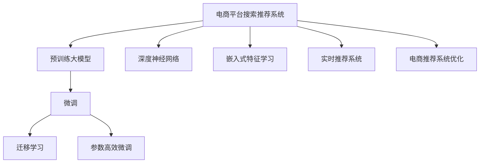

                 

# 电商平台搜索推荐系统的AI 大模型优化：提高系统性能、准确率与实时性

> 关键词：电商平台、搜索推荐系统、大模型优化、系统性能、准确率、实时性

## 1. 背景介绍

### 1.1 问题由来
随着电商平台销售额的爆炸式增长，用户体验成为平台竞争的核心要素之一。搜索推荐系统作为电商平台的重要组成部分，直接影响着用户的购物体验和平台的转化率。然而，传统基于手工特征工程的推荐算法存在诸多局限性，难以适应日益复杂多变的用户需求和海量商品数据的挑战。

近年来，预训练大模型在自然语言处理(NLP)领域取得了巨大突破，以BERT、GPT等模型为代表的预训练语言模型已经证明在各种NLP任务上具备超强的通用性和泛化能力。将这些大模型应用到电商搜索推荐系统中，可以大幅提升系统的智能化水平，实现更精准、高效的推荐。

但大模型通常具有参数量庞大、推理计算开销大等缺点，难以在实时性要求高的电商平台上大规模部署应用。因此，本文聚焦于大模型的优化技术，探讨如何在大模型保持高性能的同时，显著提高电商平台的搜索推荐系统效果和实时性，以实现业务价值的最大化。

## 2. 核心概念与联系

### 2.1 核心概念概述

为更好地理解如何对电商平台搜索推荐系统进行AI 大模型优化，本节将介绍几个密切相关的核心概念：

- 电商平台搜索推荐系统：电商平台提供给用户查询商品信息的系统，根据用户的查询结果推荐相关商品，以提升用户体验和销售转化率。
- 预训练大模型：通过在大规模无标签文本数据上自监督学习获得通用语言表示的模型，如BERT、GPT等。
- 微调与迁移学习：在预训练模型的基础上，使用任务特定的标注数据，通过有监督学习进一步优化模型性能，称为微调。若任务数据与预训练数据分布相近，可以通过迁移学习将预训练模型适配到下游任务。
- 参数高效微调：通过只更新预训练模型的小部分参数，实现模型更新和知识传递，提高微调效率。
- 深度神经网络(DNN)：由多个神经网络层组成的复杂模型，常用多层感知器(MLP)、卷积神经网络(CNN)、循环神经网络(RNN)等，是电商推荐模型的主要构成。
- 嵌入式特征学习(Embedding Learning)：通过嵌入向量将商品描述、用户历史行为等信息映射到低维空间，实现特征的自动提取和表示学习。
- 实时推荐系统：在用户搜索行为发生后，实时计算并返回推荐结果的系统，要求高效率和高实时性。
- 电商推荐系统优化：利用AI技术改进推荐算法的精准度、速度和覆盖率，以提升用户体验和平台收益。

这些核心概念之间的逻辑关系可以通过以下Mermaid流程图来展示：



这个流程图展示了大模型在电商平台搜索推荐系统中的关键组件及其关系：

1. 电商平台搜索推荐系统通过预训练大模型进行智能推荐。
2. 微调或迁移学习将通用语言模型适配到特定电商任务。
3. 参数高效微调以提升优化效率。
4. DNN、Embedding Learning等技术用于提取和表示用户和商品特征。
5. 实时推荐系统要求高效率和高实时性。
6. 电商推荐系统优化改进推荐效果和用户体验。

这些概念共同构成了电商平台搜索推荐系统的大模型优化框架，使得系统能够更好地理解和推荐商品，提升用户满意度。

## 3. 核心算法原理 & 具体操作步骤
### 3.1 算法原理概述

电商平台搜索推荐系统中的AI 大模型优化，核心在于利用预训练大模型提供的语言知识，通过微调或迁移学习，将模型适配到电商推荐任务，从而提升模型的推荐效果。此外，还需要在保证优化效率的前提下，提高模型的实时性，以支持实时推荐系统的需求。

具体而言，包括以下几个关键步骤：

- 数据准备：收集电商平台的商品数据和用户行为数据，标注生成任务特定数据集。
- 模型适配：选择合适的预训练大模型，通过微调或迁移学习进行任务适配。
- 特征提取：利用DNN、Embedding Learning等技术，自动提取和表示商品和用户特征。
- 推荐算法优化：结合任务特征和优化目标，改进推荐算法，提升推荐效果和速度。
- 部署与监控：将优化后的模型部署到生产环境中，并实时监控系统性能，确保稳定运行。

### 3.2 算法步骤详解

**Step 1: 数据准备**

- 收集电商平台的商品数据，如商品名称、描述、图片等，并标注生成电商语料库。
- 收集用户行为数据，如搜索历史、浏览记录、购买行为等，并标注生成用户行为数据集。
- 标注生成任务数据集，如物品推荐、搜索相关性排序、上下文查询匹配等，用于微调模型。

**Step 2: 模型适配**

- 选择合适的预训练大模型，如BERT、GPT等，作为初始化参数。
- 使用微调或迁移学习技术，将预训练模型适配到电商推荐任务，通过标注数据进行有监督学习。
- 选择合适的网络结构，如MLP、RNN、Transformer等，构建电商推荐模型。
- 定义损失函数，如均方误差、交叉熵等，用于衡量模型输出与真实标签的差异。

**Step 3: 特征提取**

- 设计嵌入式特征学习模块，自动提取商品和用户的特征向量。
- 利用预训练大模型对特征向量进行编码，提取高层次的语义表示。
- 结合用户和商品特征，构建电商推荐模型的输入。

**Step 4: 推荐算法优化**

- 引入深度学习技术，如MLP、CNN、RNN等，设计电商推荐模型。
- 使用监督学习技术，如回归、分类等，训练电商推荐模型，优化推荐效果。
- 结合任务特征，设计个性化推荐算法，如协同过滤、基于内容的推荐、深度学习推荐等。
- 优化模型结构和参数设置，提高模型的实时性，减少推理时间。

**Step 5: 部署与监控**

- 将训练好的电商推荐模型部署到线上环境中，确保与业务系统无缝集成。
- 实时监控模型性能，如推荐精度、响应时间等，确保系统稳定运行。
- 根据监控结果进行模型更新，优化模型参数，提升推荐效果和系统性能。

### 3.3 算法优缺点

大模型优化在电商平台搜索推荐系统中具有以下优点：

- 提升推荐效果：大模型具备强大的语言理解和表示能力，能够从商品描述、用户行为等文本信息中提取更丰富的特征。
- 自动化特征提取：自动学习特征向量，减少手工工程特征工程的工作量。
- 提升实时性：通过优化模型结构和参数设置，可以显著提高模型的推理速度，支持实时推荐系统。

然而，大模型优化也存在一些缺点：

- 计算资源需求高：大模型通常参数量巨大，计算开销大，难以在低计算资源环境中应用。
- 训练数据依赖高：模型优化效果高度依赖于标注数据的数量和质量，标注成本高。
- 模型可解释性不足：大模型通常是一个黑盒，难以解释其内部决策过程，难以进行有效的调试和优化。

尽管存在这些局限性，但就目前而言，基于大模型的优化方法仍是电商平台推荐系统的重要优化手段，能够显著提升推荐效果和实时性，为电商平台的智能化转型提供有力支持。

### 3.4 算法应用领域

大模型优化技术在电商平台搜索推荐系统中有着广泛的应用，主要包括以下几个方面：

- 商品推荐：根据用户的浏览和搜索历史，推荐可能感兴趣的商品。
- 个性化推荐：根据用户的个人资料和行为数据，推荐个性化的商品或优惠。
- 实时推荐：在用户搜索时，实时返回推荐结果，提升用户体验。
- 上下文查询匹配：根据用户的搜索查询和上下文信息，推荐相关商品或内容。
- 预测推荐：基于历史数据和当前行为，预测用户可能感兴趣的商品或行为。

除了以上应用，大模型优化技术还广泛用于电商平台的用户画像分析、广告投放优化、内容推荐系统等多个领域，显著提升了电商平台的智能化水平。

## 4. 数学模型和公式 & 详细讲解 & 举例说明
### 4.1 数学模型构建

本文将详细描述电商平台搜索推荐系统的数学模型构建过程，以BERT大模型为例。

假设电商平台推荐系统的任务为商品推荐，输入为商品描述，输出为推荐商品的点击率。设预训练BERT大模型的嵌入层为 $E$，表示商品描述 $x$ 的嵌入向量为 $e_x$。任务特定标注数据集为 $D=\{(x_i, y_i)\}_{i=1}^N, x_i \in \mathcal{X}, y_i \in \{0,1\}$。

定义模型 $M_{\theta}$ 在输入 $x$ 上的输出为 $M_{\theta}(x) \in \mathcal{Y}$，其中 $\mathcal{Y}=\{0,1\}$。模型输出为商品推荐点击率，则任务损失函数定义为：

$$
\mathcal{L}(\theta) = -\frac{1}{N}\sum_{i=1}^N y_i \log(M_{\theta}(x_i)) + (1-y_i) \log(1-M_{\theta}(x_i))
$$

其中，$y_i$ 为商品点击率标签，$M_{\theta}(x_i)$ 为模型对商品描述 $x_i$ 的预测点击率。

### 4.2 公式推导过程

接下来，我们推导最小化损失函数 $\mathcal{L}(\theta)$ 的优化目标。

设模型 $M_{\theta}$ 的嵌入层参数为 $\theta_E$，分类器层参数为 $\theta_C$，则模型输出的点击率预测公式为：

$$
M_{\theta}(x) = \sigma(\theta_C W_C \cdot \sigma(\theta_E W_E x + b_E) + b_C)
$$

其中 $W_E, b_E, W_C, b_C$ 为模型可训练参数，$\sigma$ 为sigmoid函数。

将输出公式代入损失函数，得：

$$
\mathcal{L}(\theta) = -\frac{1}{N}\sum_{i=1}^N y_i \log \sigma(\theta_C W_C \cdot \sigma(\theta_E W_E x_i + b_E) + b_C) + (1-y_i) \log(1-\sigma(\theta_C W_C \cdot \sigma(\theta_E W_E x_i + b_E) + b_C))
$$

取对数，并化简，得：

$$
\mathcal{L}(\theta) = -\frac{1}{N}\sum_{i=1}^N [y_i \log \sigma(\theta_C W_C \cdot \sigma(\theta_E W_E x_i + b_E) + b_C) + (1-y_i) \log(1-\sigma(\theta_C W_C \cdot \sigma(\theta_E W_E x_i + b_E) + b_C))]
$$

求导，得：

$$
\frac{\partial \mathcal{L}(\theta)}{\partial \theta} = \frac{1}{N}\sum_{i=1}^N \nabla_{\theta} \log \sigma(\theta_C W_C \cdot \sigma(\theta_E W_E x_i + b_E) + b_C)
$$

其中 $\nabla_{\theta}$ 为梯度运算符。

通过梯度下降等优化算法，不断更新模型参数 $\theta$，最小化损失函数 $\mathcal{L}(\theta)$，最终得到适应电商推荐任务的最优模型参数 $\theta^*$。

### 4.3 案例分析与讲解

以电商商品推荐为例，我们分析模型优化过程中的关键点：

- **特征提取**：商品描述 $x$ 通过BERT嵌入层转化为嵌入向量 $e_x$，在低维空间中保留丰富的语义信息。
- **损失函数设计**：采用交叉熵损失函数，衡量模型输出与真实标签的差异，适用于二分类任务。
- **梯度计算**：利用自动微分技术，高效计算损失函数对模型参数的梯度，支持模型参数的动态更新。

在实际应用中，商品描述 $x$ 可能包含大量无关信息，需要进行预处理。此外，为了提高模型泛化能力，可能还需要在训练集上进行数据增强，如近义替换、删除等，增加样本多样性。

## 5. 项目实践：代码实例和详细解释说明
### 5.1 开发环境搭建

在进行电商搜索推荐系统优化时，我们需要准备好开发环境。以下是使用Python进行PyTorch开发的环境配置流程：

1. 安装Anaconda：从官网下载并安装Anaconda，用于创建独立的Python环境。

2. 创建并激活虚拟环境：
```bash
conda create -n pytorch-env python=3.8 
conda activate pytorch-env
```

3. 安装PyTorch：根据CUDA版本，从官网获取对应的安装命令。例如：
```bash
conda install pytorch torchvision torchaudio cudatoolkit=11.1 -c pytorch -c conda-forge
```

4. 安装Transformers库：
```bash
pip install transformers
```

5. 安装各类工具包：
```bash
pip install numpy pandas scikit-learn matplotlib tqdm jupyter notebook ipython
```

完成上述步骤后，即可在`pytorch-env`环境中开始微调实践。

### 5.2 源代码详细实现

下面我们以电商商品推荐为例，给出使用Transformers库对BERT模型进行微调的PyTorch代码实现。

首先，定义任务相关的数据处理函数：

```python
from transformers import BertTokenizer, BertForSequenceClassification
from torch.utils.data import Dataset
import torch

class GoodsDataset(Dataset):
    def __init__(self, texts, labels, tokenizer, max_len=128):
        self.texts = texts
        self.labels = labels
        self.tokenizer = tokenizer
        self.max_len = max_len
        
    def __len__(self):
        return len(self.texts)
    
    def __getitem__(self, item):
        text = self.texts[item]
        label = self.labels[item]
        
        encoding = self.tokenizer(text, return_tensors='pt', max_length=self.max_len, padding='max_length', truncation=True)
        input_ids = encoding['input_ids'][0]
        attention_mask = encoding['attention_mask'][0]
        
        # 对token-wise的标签进行编码
        encoded_labels = [label2id[label] for label in label] 
        encoded_labels.extend([label2id['O']] * (self.max_len - len(encoded_labels)))
        labels = torch.tensor(encoded_labels, dtype=torch.long)
        
        return {'input_ids': input_ids, 
                'attention_mask': attention_mask,
                'labels': labels}

# 标签与id的映射
label2id = {'0': 0, '1': 1}
id2label = {v: k for k, v in label2id.items()}

# 创建dataset
tokenizer = BertTokenizer.from_pretrained('bert-base-uncased')

train_dataset = GoodsDataset(train_texts, train_labels, tokenizer)
dev_dataset = GoodsDataset(dev_texts, dev_labels, tokenizer)
test_dataset = GoodsDataset(test_texts, test_labels, tokenizer)
```

然后，定义模型和优化器：

```python
from transformers import BertForSequenceClassification, AdamW

model = BertForSequenceClassification.from_pretrained('bert-base-uncased', num_labels=2)

optimizer = AdamW(model.parameters(), lr=2e-5)
```

接着，定义训练和评估函数：

```python
from torch.utils.data import DataLoader
from tqdm import tqdm
from sklearn.metrics import accuracy_score, precision_recall_fscore_support

device = torch.device('cuda') if torch.cuda.is_available() else torch.device('cpu')
model.to(device)

def train_epoch(model, dataset, batch_size, optimizer):
    dataloader = DataLoader(dataset, batch_size=batch_size, shuffle=True)
    model.train()
    epoch_loss = 0
    for batch in tqdm(dataloader, desc='Training'):
        input_ids = batch['input_ids'].to(device)
        attention_mask = batch['attention_mask'].to(device)
        labels = batch['labels'].to(device)
        model.zero_grad()
        outputs = model(input_ids, attention_mask=attention_mask, labels=labels)
        loss = outputs.loss
        epoch_loss += loss.item()
        loss.backward()
        optimizer.step()
    return epoch_loss / len(dataloader)

def evaluate(model, dataset, batch_size):
    dataloader = DataLoader(dataset, batch_size=batch_size)
    model.eval()
    preds, labels = [], []
    with torch.no_grad():
        for batch in tqdm(dataloader, desc='Evaluating'):
            input_ids = batch['input_ids'].to(device)
            attention_mask = batch['attention_mask'].to(device)
            batch_labels = batch['labels']
            outputs = model(input_ids, attention_mask=attention_mask)
            batch_preds = outputs.logits.argmax(dim=2).to('cpu').tolist()
            batch_labels = batch_labels.to('cpu').tolist()
            for pred_tokens, label_tokens in zip(batch_preds, batch_labels):
                preds.append(pred_tokens[:len(label_tokens)])
                labels.append(label_tokens)
                
    print('Accuracy: {:.4f}'.format(accuracy_score(labels, preds)))
    print('Precision, Recall, F1-score, Support: {}'.format(precision_recall_fscore_support(labels, preds, average='weighted')))
```

最后，启动训练流程并在测试集上评估：

```python
epochs = 5
batch_size = 16

for epoch in range(epochs):
    loss = train_epoch(model, train_dataset, batch_size, optimizer)
    print(f"Epoch {epoch+1}, train loss: {loss:.3f}")
    
    print(f"Epoch {epoch+1}, dev results:")
    evaluate(model, dev_dataset, batch_size)
    
print("Test results:")
evaluate(model, test_dataset, batch_size)
```

以上就是使用PyTorch对BERT进行电商商品推荐任务微调的完整代码实现。可以看到，得益于Transformers库的强大封装，我们可以用相对简洁的代码完成BERT模型的加载和微调。

### 5.3 代码解读与分析

让我们再详细解读一下关键代码的实现细节：

**GoodsDataset类**：
- `__init__`方法：初始化文本、标签、分词器等关键组件。
- `__len__`方法：返回数据集的样本数量。
- `__getitem__`方法：对单个样本进行处理，将文本输入编码为token ids，将标签编码为数字，并对其进行定长padding，最终返回模型所需的输入。

**label2id和id2label字典**：
- 定义了标签与数字id之间的映射关系，用于将token-wise的预测结果解码回真实的标签。

**训练和评估函数**：
- 使用PyTorch的DataLoader对数据集进行批次化加载，供模型训练和推理使用。
- 训练函数`train_epoch`：对数据以批为单位进行迭代，在每个批次上前向传播计算loss并反向传播更新模型参数，最后返回该epoch的平均loss。
- 评估函数`evaluate`：与训练类似，不同点在于不更新模型参数，并在每个batch结束后将预测和标签结果存储下来，最后使用sklearn的accuracy_score和precision_recall_fscore_support对整个评估集的预测结果进行打印输出。

**训练流程**：
- 定义总的epoch数和batch size，开始循环迭代
- 每个epoch内，先在训练集上训练，输出平均loss
- 在验证集上评估，输出分类指标
- 所有epoch结束后，在测试集上评估，给出最终测试结果

可以看到，PyTorch配合Transformers库使得BERT微调的代码实现变得简洁高效。开发者可以将更多精力放在数据处理、模型改进等高层逻辑上，而不必过多关注底层的实现细节。

当然，工业级的系统实现还需考虑更多因素，如模型的保存和部署、超参数的自动搜索、更灵活的任务适配层等。但核心的微调范式基本与此类似。

## 6. 实际应用场景
### 6.1 智能客服系统

基于大模型优化技术的智能客服系统，可以在用户查询时实时返回精准的解决方案，提升用户满意度。传统的客服系统依赖于规则和人工处理，响应速度慢，效果有限。而基于大模型的智能客服，能够理解自然语言，自动回答常见问题，节省了大量人力和时间成本。

具体实现中，可以收集企业内部的客服对话记录，标注生成对话样本。在此基础上对预训练对话模型进行微调，使其能够自动理解用户意图，匹配最合适的答案模板进行回复。对于用户提出的新问题，还可以接入检索系统实时搜索相关内容，动态组织生成回答。如此构建的智能客服系统，能够显著提升用户咨询体验和问题解决效率。

### 6.2 金融舆情监测

金融领域需要实时监测市场舆论动向，以便及时应对负面信息传播，规避金融风险。传统的人工监测方式成本高、效率低，难以应对网络时代海量信息爆发的挑战。基于大语言模型优化技术的文本分类和情感分析技术，为金融舆情监测提供了新的解决方案。

具体而言，可以收集金融领域相关的新闻、报道、评论等文本数据，并对其进行主题标注和情感标注。在此基础上对预训练语言模型进行微调，使其能够自动判断文本属于何种主题，情感倾向是正面、中性还是负面。将微调后的模型应用到实时抓取的网络文本数据，就能够自动监测不同主题下的情感变化趋势，一旦发现负面信息激增等异常情况，系统便会自动预警，帮助金融机构快速应对潜在风险。

### 6.3 个性化推荐系统

当前的推荐系统往往只依赖用户的历史行为数据进行物品推荐，无法深入理解用户的真实兴趣偏好。基于大模型优化技术的个性化推荐系统，可以更好地挖掘用户行为背后的语义信息，从而提供更精准、多样的推荐内容。

在实践中，可以收集用户浏览、点击、评论、分享等行为数据，提取和用户交互的物品标题、描述、标签等文本内容。将文本内容作为模型输入，用户的后续行为（如是否点击、购买等）作为监督信号，在此基础上微调预训练语言模型。微调后的模型能够从文本内容中准确把握用户的兴趣点。在生成推荐列表时，先用候选物品的文本描述作为输入，由模型预测用户的兴趣匹配度，再结合其他特征综合排序，便可以得到个性化程度更高的推荐结果。

### 6.4 未来应用展望

随着大模型优化技术的不断发展，基于微调范式将在更多领域得到应用，为传统行业带来变革性影响。

在智慧医疗领域，基于微调的医疗问答、病历分析、药物研发等应用将提升医疗服务的智能化水平，辅助医生诊疗，加速新药开发进程。

在智能教育领域，微调技术可应用于作业批改、学情分析、知识推荐等方面，因材施教，促进教育公平，提高教学质量。

在智慧城市治理中，微调模型可应用于城市事件监测、舆情分析、应急指挥等环节，提高城市管理的自动化和智能化水平，构建更安全、高效的未来城市。

此外，在企业生产、社会治理、文娱传媒等众多领域，基于大模型优化技术的人工智能应用也将不断涌现，为经济社会发展注入新的动力。相信随着技术的日益成熟，微调方法将成为人工智能落地应用的重要范式，推动人工智能技术向更广阔的领域加速渗透。

## 7. 工具和资源推荐
### 7.1 学习资源推荐

为了帮助开发者系统掌握大语言模型优化技术的基础和实践，这里推荐一些优质的学习资源：

1. 《深度学习与自然语言处理》系列博文：由深度学习领域专家撰写，深入浅出地介绍了深度学习模型在NLP任务中的应用，涵盖微调、迁移学习等多个前沿技术。

2. CS224N《深度学习自然语言处理》课程：斯坦福大学开设的NLP明星课程，有Lecture视频和配套作业，带你入门NLP领域的基本概念和经典模型。

3. 《Transformers与深度学习在NLP中的应用》书籍：Transformers库的作者所著，全面介绍了如何使用Transformers库进行NLP任务开发，包括微调在内的诸多范式。

4. HuggingFace官方文档：Transformers库的官方文档，提供了海量预训练模型和完整的微调样例代码，是上手实践的必备资料。

5. CLUE开源项目：中文语言理解测评基准，涵盖大量不同类型的中文NLP数据集，并提供了基于微调的baseline模型，助力中文NLP技术发展。

通过对这些资源的学习实践，相信你一定能够快速掌握大模型优化技术的精髓，并用于解决实际的NLP问题。
###  7.2 开发工具推荐

高效的开发离不开优秀的工具支持。以下是几款用于大模型优化开发的常用工具：

1. PyTorch：基于Python的开源深度学习框架，灵活动态的计算图，适合快速迭代研究。大部分预训练语言模型都有PyTorch版本的实现。

2. TensorFlow：由Google主导开发的开源深度学习框架，生产部署方便，适合大规模工程应用。同样有丰富的预训练语言模型资源。

3. Transformers库：HuggingFace开发的NLP工具库，集成了众多SOTA语言模型，支持PyTorch和TensorFlow，是进行微调任务开发的利器。

4. Weights & Biases：模型训练的实验跟踪工具，可以记录和可视化模型训练过程中的各项指标，方便对比和调优。与主流深度学习框架无缝集成。

5. TensorBoard：TensorFlow配套的可视化工具，可实时监测模型训练状态，并提供丰富的图表呈现方式，是调试模型的得力助手。

6. Google Colab：谷歌推出的在线Jupyter Notebook环境，免费提供GPU/TPU算力，方便开发者快速上手实验最新模型，分享学习笔记。

合理利用这些工具，可以显著提升大模型优化任务的开发效率，加快创新迭代的步伐。

### 7.3 相关论文推荐

大语言模型优化技术的发展源于学界的持续研究。以下是几篇奠基性的相关论文，推荐阅读：

1. Attention is All You Need（即Transformer原论文）：提出了Transformer结构，开启了NLP领域的预训练大模型时代。

2. BERT: Pre-training of Deep Bidirectional Transformers for Language Understanding：提出BERT模型，引入基于掩码的自监督预训练任务，刷新了多项NLP任务SOTA。

3. Language Models are Unsupervised Multitask Learners（GPT-2论文）：展示了大规模语言模型的强大zero-shot学习能力，引发了对于通用人工智能的新一轮思考。

4. Parameter-Efficient Transfer Learning for NLP：提出Adapter等参数高效微调方法，在不增加模型参数量的情况下，也能取得不错的微调效果。

5. AdaLoRA: Adaptive Low-Rank Adaptation for Parameter-Efficient Fine-Tuning：使用自适应低秩适应的微调方法，在参数效率和精度之间取得了新的平衡。

6. Do We Need Huge Datasets to Learn Helpful Features?: Few-shot Transfer Learning from Big Data with Adaptive Feature Learning：探讨了在大规模数据上学习小样本迁移学习的效果。

这些论文代表了大模型优化技术的发展脉络。通过学习这些前沿成果，可以帮助研究者把握学科前进方向，激发更多的创新灵感。

## 8. 总结：未来发展趋势与挑战
### 8.1 总结

本文对电商平台搜索推荐系统的AI 大模型优化方法进行了全面系统的介绍。首先阐述了电商平台搜索推荐系统和大模型优化技术的研究背景和意义，明确了优化技术在提升推荐效果和实时性方面的独特价值。其次，从原理到实践，详细讲解了大模型优化任务的数学模型构建和算法步骤，给出了电商推荐任务的完整代码实现。同时，本文还广泛探讨了大模型优化方法在智能客服、金融舆情、个性化推荐等多个行业领域的应用前景，展示了优化技术的巨大潜力。此外，本文精选了优化技术的各类学习资源，力求为读者提供全方位的技术指引。

通过本文的系统梳理，可以看到，基于大模型的优化方法正在成为电商平台推荐系统的重要优化手段，能够显著提升推荐效果和实时性，为电商平台的智能化转型提供有力支持。未来，伴随大模型和优化方法的不断演进，基于微调范式将进一步拓展到更多领域，为传统行业带来变革性影响。

### 8.2 未来发展趋势

展望未来，大模型优化技术将呈现以下几个发展趋势：

1. 模型规模持续增大。随着算力成本的下降和数据规模的扩张，预训练语言模型的参数量还将持续增长。超大规模语言模型蕴含的丰富语言知识，有望支撑更加复杂多变的电商推荐任务。

2. 优化方法日趋多样。除了传统的全参数微调外，未来会涌现更多参数高效的微调方法，如Adapter、LoRA等，在节省计算资源的同时也能保证微调精度。

3. 实时性得到提升。通过优化模型结构和参数设置，可以显著提高模型的推理速度，支持实时推荐系统。

4. 知识库与深度学习结合。利用知识图谱、逻辑规则等外部知识，提升模型的泛化能力和推理逻辑，进一步提高推荐效果。

5. 面向特定领域的优化。针对不同领域的电商推荐任务，引入领域特定的特征提取和模型优化方法，提升模型针对性。

以上趋势凸显了大模型优化技术的广阔前景。这些方向的探索发展，必将进一步提升电商平台推荐系统的智能化水平，为电商平台的智能化转型提供有力支持。

### 8.3 面临的挑战

尽管大模型优化技术已经取得了瞩目成就，但在迈向更加智能化、普适化应用的过程中，它仍面临着诸多挑战：

1. 标注成本瓶颈。虽然优化效果高度依赖于标注数据的数量和质量，但标注成本高、标注数据获取困难，难以满足电商推荐系统的需求。如何进一步降低优化对标注样本的依赖，将是一大难题。

2. 模型鲁棒性不足。当前优化模型面对域外数据时，泛化性能往往大打折扣。对于测试样本的微小扰动，优化模型的预测也容易发生波动。如何提高优化模型的鲁棒性，避免灾难性遗忘，还需要更多理论和实践的积累。

3. 推理效率有待提高。尽管优化模型在推理速度上有明显提升，但在高并发、高实时性场景下，仍面临计算资源不足的问题。如何在保证性能的同时，简化模型结构，提升推理速度，优化资源占用，将是重要的优化方向。

4. 可解释性亟需加强。当前优化模型更像是"黑盒"系统，难以解释其内部决策过程，难以进行有效的调试和优化。如何赋予优化模型更强的可解释性，将是亟待攻克的难题。

5. 安全性有待保障。优化模型可能学习到有偏见、有害的信息，通过优化传递到电商推荐系统，产生误导性、歧视性的输出，给实际应用带来安全隐患。如何从数据和算法层面消除模型偏见，避免恶意用途，确保输出的安全性，也将是重要的研究课题。

6. 系统稳定性不足。优化模型在大规模高并发场景下可能出现性能不稳定的问题。如何设计稳健的系统架构，确保模型在高并发环境下的稳定性，将是重要的研究方向。

正视优化面临的这些挑战，积极应对并寻求突破，将是大模型优化技术走向成熟的必由之路。相信随着学界和产业界的共同努力，这些挑战终将一一被克服，大模型优化技术必将在构建智能电商推荐系统方面发挥更大的作用。

### 8.4 研究展望

面对大模型优化所面临的种种挑战，未来的研究需要在以下几个方面寻求新的突破：

1. 探索无监督和半监督优化方法。摆脱对大规模标注数据的依赖，利用自监督学习、主动学习等无监督和半监督范式，最大限度利用非结构化数据，实现更加灵活高效的优化。

2. 研究参数高效和计算高效的优化范式。开发更加参数高效的优化方法，在固定大部分预训练参数的同时，只更新极少量的任务相关参数。同时优化优化模型的计算图，减少前向传播和反向传播的资源消耗，实现更加轻量级、实时性的部署。

3. 引入因果和对比学习范式。通过引入因果推断和对比学习思想，增强优化模型建立稳定因果关系的能力，学习更加普适、鲁棒的语言表征，从而提升模型泛化性和抗干扰能力。

4. 引入更多先验知识。将符号化的先验知识，如知识图谱、逻辑规则等，与深度学习模型进行巧妙融合，引导优化过程学习更准确、合理的语言模型。同时加强不同模态数据的整合，实现视觉、语音等多模态信息与文本信息的协同建模。

5. 结合因果分析和博弈论工具。将因果分析方法引入优化模型，识别出模型决策的关键特征，增强输出解释的因果性和逻辑性。借助博弈论工具刻画人机交互过程，主动探索并规避模型的脆弱点，提高系统稳定性。

6. 纳入伦理道德约束。在优化目标中引入伦理导向的评估指标，过滤和惩罚有偏见、有害的输出倾向。同时加强人工干预和审核，建立模型行为的监管机制，确保输出符合人类价值观和伦理道德。

这些研究方向的探索，必将引领大模型优化技术迈向更高的台阶，为构建安全、可靠、可解释、可控的智能系统铺平道路。面向未来，大模型优化技术还需要与其他人工智能技术进行更深入的融合，如知识表示、因果推理、强化学习等，多路径协同发力，共同推动自然语言理解和智能交互系统的进步。只有勇于创新、敢于突破，才能不断拓展语言模型的边界，让智能技术更好地造福人类社会。

## 9. 附录：常见问题与解答

**Q1：电商推荐系统中的优化模型和传统模型有何区别？**

A: 电商推荐系统中的优化模型相比传统模型，具备以下几个主要区别：
1. 自动化特征提取：优化模型通过深度学习技术自动提取商品和用户特征，减少了手工特征工程的复杂性。
2. 参数高效优化：优化模型通过参数高效优化方法，减少了优化过程中需要更新的参数量，提高了优化效率。
3. 实时性更高：优化模型通过优化模型结构和参数设置，实现了更高的推理速度和实时性，能够支持实时推荐系统。
4. 融合多源信息：优化模型能够融合多模态信息，如商品图片、视频等，提升推荐效果。

**Q2：如何选择合适的预训练大模型进行电商推荐系统优化？**

A: 选择合适的预训练大模型进行电商推荐系统优化，需要考虑以下几个因素：
1. 任务适配性：选择与电商推荐任务最相关的预训练大模型，如BERT、GPT等，能够更好地适应电商推荐任务。
2. 参数量大小：选择参数量适中的预训练大模型，避免参数过多导致的计算开销过大，或参数过少导致的泛化能力不足。
3. 训练数据规模：选择训练数据规模较大的预训练大模型，保证模型在电商推荐任务上的泛化能力。
4. 实时性要求：选择推理速度较快的预训练大模型，满足实时推荐系统的需求。

**Q3：电商推荐系统中的优化模型如何避免过拟合？**

A: 电商推荐系统中的优化模型避免过拟合的方法主要有：
1. 数据增强：通过近义替换、删除等数据增强手段，增加训练数据的多样性，防止模型过拟合。
2. 正则化技术：使用L2正则、Dropout等正则化技术，防止模型过拟合。
3. 早停策略：在验证集上监控模型性能，一旦性能不再提升，立即停止训练，防止过拟合。
4. 参数高效优化：通过参数高效优化方法，只更新预训练模型的小部分参数，减少优化过程中需要更新的参数量，防止过拟合。

**Q4：电商推荐系统中的优化模型在生产环境中如何进行优化？**

A: 电商推荐系统中的优化模型在生产环境中进行优化的主要步骤包括：
1. 模型裁剪：去除不必要的层和参数，减小模型尺寸，加快推理速度。
2. 量化加速：将浮点模型转为定点模型，压缩存储空间，提高计算效率。
3. 服务化封装：将优化模型封装为标准化服务接口，便于集成调用。
4. 弹性伸缩：根据请求流量动态调整资源配置，平衡服务质量和成本。
5. 监控告警：实时采集系统指标，设置异常告警阈值，确保系统稳定运行。

优化模型在生产环境中的优化主要围绕模型结构、推理效率和服务质量展开，通过合理的模型裁剪和优化，确保模型在实际应用中的高效性和稳定性。

