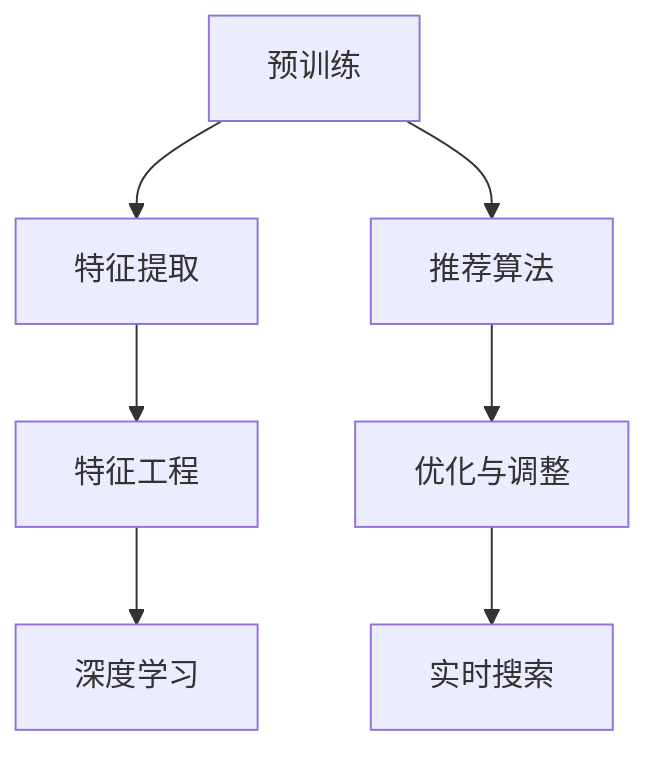

                 

# 电商平台搜索推荐系统的AI 大模型优化：提高系统性能、效率、准确率与实时性

> 关键词：大语言模型,推荐系统,搜索,自然语言处理,深度学习,特征工程,搜索引擎

## 1. 背景介绍

### 1.1 问题由来

在电商平台中，搜索推荐系统是其核心业务之一，直接影响着用户的购物体验和平台营收。随着用户需求日益多元化、个性化，传统的基于规则、浅层机器学习的推荐算法已难以满足需求。近年来，基于深度学习和大语言模型的推荐系统逐步成为主流，为电商平台提供了强大的引擎驱动。

然而，大语言模型的优化与实际应用仍面临诸多挑战：
- 在用户输入搜索词后，如何实时快速地生成准确的推荐结果？
- 如何构建高效的搜索推荐系统，确保高性能、低延迟的响应？
- 如何基于大模型优化算法性能，提升推荐系统的准确率和覆盖率？

本文聚焦于电商平台搜索推荐系统的AI大模型优化，探讨如何在大模型基础上，通过算法优化提升系统性能、效率、准确率和实时性。

## 2. 核心概念与联系

### 2.1 核心概念概述

为深入理解大语言模型在搜索推荐系统中的应用与优化，本节将介绍几个关键概念：

- **大语言模型(Large Language Model, LLM)**：以BERT、GPT-3等为代表的预训练语言模型，通过自监督学习获得丰富的语言表示能力，可用于推荐系统的文本理解与生成。
- **推荐系统(Recommender System)**：根据用户历史行为和当前需求，推荐个性化的商品或内容，提升用户体验和平台收益。
- **搜索系统(Search System)**：根据用户查询请求，返回相关商品或内容，满足用户信息获取需求。
- **深度学习(Deep Learning)**：一种基于神经网络的机器学习方法，在大数据环境下表现优异，可用于推荐系统中的分类、回归、聚类等任务。
- **特征工程(Feature Engineering)**：通过工程化处理原始数据，提取有意义的特征，提升模型的泛化能力和预测性能。
- **搜索引擎(Search Engine)**：通过算法处理用户查询，快速返回搜索结果，满足用户信息查询需求。
- **实时性(Real-time)**：要求系统能够快速响应，及时满足用户需求，提升用户体验。

这些概念共同构成了大模型在电商平台搜索推荐系统中的应用框架，使得搜索推荐系统能够基于用户需求，动态生成个性化商品或内容，从而提升用户满意度、增加平台收益。

### 2.2 核心概念联系

基于大语言模型的电商平台搜索推荐系统可采用以下流程进行构建：
1. **预训练**：在大量无标签数据上训练大语言模型，学习语言的表示能力。
2. **特征提取**：通过大语言模型，将用户查询和商品描述转化为高维特征向量。
3. **推荐算法**：根据提取的特征，应用深度学习模型进行推荐，例如基于协同过滤、内容基推荐、混合推荐等算法。
4. **优化与调整**：通过AI大模型优化算法，提升推荐效果和实时性。
5. **实时搜索**：在用户查询时，实时调用搜索算法，返回相关商品或内容。

核心概念之间的联系通过以下Mermaid流程图展示：



该图展示了从预训练到实时搜索的全流程，各模块通过数据流和信息流紧密联系，最终构成完整的搜索推荐系统。

## 3. 核心算法原理 & 具体操作步骤
### 3.1 算法原理概述

基于大语言模型的搜索推荐系统，通过预训练获得语言表示能力，将用户查询和商品描述映射为高维特征向量，应用深度学习算法进行推荐，并通过AI大模型优化提升性能。

具体来说，包括以下几个步骤：

1. **预训练大语言模型**：在大量无标签文本数据上，使用自监督学习任务训练大语言模型，学习语言的通用表示。
2. **特征提取**：将用户查询和商品描述输入大语言模型，提取高维特征向量。
3. **推荐算法**：应用深度学习模型，如深度神经网络、Transformer等，根据提取的特征向量进行推荐。
4. **优化与调整**：通过AI大模型优化算法，如模型压缩、参数稀疏化、模型剪枝等，提升模型的性能和实时性。
5. **实时搜索**：根据用户查询，实时调用搜索引擎算法，返回相关商品或内容。

### 3.2 算法步骤详解

以下是基于大语言模型的搜索推荐系统构建的详细步骤：

**Step 1: 预训练大语言模型**
- 收集大规模无标签文本数据，如维基百科、新闻、博客等，用于训练大语言模型。
- 使用自监督学习任务，如掩码语言模型、预测下一个词等，在大规模数据上训练大语言模型，如BERT、GPT-3等。

**Step 2: 特征提取**
- 将用户查询和商品描述输入大语言模型，提取高维特征向量。
- 使用BERT、GPT等模型，将文本转化为固定长度的向量表示，例如$[CLS]$向量。

**Step 3: 推荐算法**
- 应用深度学习模型，如神经网络、Transformer等，根据提取的特征向量进行推荐。
- 基于协同过滤、内容基推荐、混合推荐等算法，训练深度学习模型，生成推荐结果。

**Step 4: 优化与调整**
- 使用模型压缩、参数稀疏化、模型剪枝等技术，提升模型性能和实时性。
- 应用AI大模型优化算法，如基于梯度的优化方法、对抗训练等，优化推荐算法。

**Step 5: 实时搜索**
- 根据用户查询，实时调用搜索引擎算法，返回相关商品或内容。
- 使用倒排索引、词向量等技术，提升搜索引擎的效率和准确率。

### 3.3 算法优缺点

基于大语言模型的搜索推荐系统具有以下优点：

- **高效性**：利用预训练的大语言模型，提取高维特征向量，减少了特征工程的时间和计算成本。
- **准确性**：基于深度学习模型进行推荐，能够捕捉复杂的用户行为模式和商品特征，提升推荐准确率。
- **实时性**：实时调用大语言模型进行特征提取和推荐，能够快速响应用户查询，提升用户体验。

同时，该方法也存在以下局限性：

- **资源消耗大**：大语言模型通常具有大规模参数，需要大量的计算资源和存储资源。
- **可解释性差**：大语言模型和深度学习模型的决策过程通常缺乏可解释性，难以理解和调试。
- **泛化能力弱**：由于预训练数据的分布与实际应用场景可能存在差异，大语言模型的泛化能力有限。
- **实时性受限**：虽然能够快速提取特征，但在实际部署中，模型的推理速度和实时性可能受到硬件限制。

### 3.4 算法应用领域

基于大语言模型的搜索推荐系统广泛应用于电商平台的各个场景中，例如：

- **商品推荐**：根据用户历史浏览、购买行为，生成个性化推荐商品。
- **搜索结果排序**：根据用户查询，排序并返回相关商品或内容，提升搜索体验。
- **广告推荐**：根据用户行为和兴趣，推荐个性化广告，提升广告点击率。
- **实时热点追踪**：根据用户查询和市场热点，实时调整推荐策略，提升系统灵活性。
- **用户兴趣分析**：通过分析用户查询内容，获取用户兴趣和行为特征，用于推荐策略优化。

此外，基于大语言模型的搜索推荐系统还广泛应用于新闻推荐、视频推荐、音乐推荐等媒体领域，为用户提供个性化内容，提升平台粘性和用户满意度。

## 4. 数学模型和公式 & 详细讲解 & 举例说明

### 4.1 数学模型构建

基于大语言模型的搜索推荐系统，通过预训练获得语言表示能力，将用户查询和商品描述映射为高维特征向量，应用深度学习算法进行推荐。

定义用户查询为$q$，商品描述为$i$，将两者输入到预训练的大语言模型中，提取特征向量$\text{Fea}(q)$和$\text{Fea}(i)$，应用推荐算法计算推荐得分$\text{Score}_{qi}$，公式如下：

$$
\text{Score}_{qi} = \text{Fea}(q)^\top \text{Fea}(i)
$$

其中，$\text{Fea}(q)$和$\text{Fea}(i)$为高维特征向量，$\top$表示矩阵转置。

### 4.2 公式推导过程

基于上述公式，推荐算法的推导如下：

- **协同过滤算法**：根据用户历史行为，找到相似用户和相似商品，计算推荐得分：

$$
\text{Score}_{qi} = \alpha \cdot \sum_j \text{Sim}(q,j) \cdot \sum_k \text{Sim}(i,k) \cdot \text{Score}_{jk}
$$

其中，$\text{Sim}(u,v)$为相似度函数，$\alpha$为相似度加权系数。

- **内容基推荐算法**：根据商品描述，提取特征，计算推荐得分：

$$
\text{Score}_{qi} = \text{Fea}(q)^\top \text{Fea}(i)
$$

- **混合推荐算法**：结合协同过滤和内容基推荐，计算综合推荐得分：

$$
\text{Score}_{qi} = \text{Score}_{qi}^{CF} + \text{Score}_{qi}^{CB}
$$

### 4.3 案例分析与讲解

以协同过滤算法为例，进行具体分析：

**假设**：
- 用户$u$有$10$次浏览历史，浏览商品$x_1, x_2, ..., x_{10}$。
- 商品$x_i$有$20$次浏览历史，浏览用户$j_1, j_2, ..., j_{20}$。
- 用户相似度函数$\text{Sim}(u,v)=\text{CosineSim}(u,v)$，商品相似度函数$\text{Sim}(i,k)=\text{CosineSim}(i,k)$。

**计算过程**：
1. 计算用户$u$与所有用户$j$的相似度$\text{Sim}(u,j)$。
2. 计算商品$i$与所有商品$k$的相似度$\text{Sim}(i,k)$。
3. 计算商品$i$的平均推荐得分$\text{Score}_{i*}=\sum_k \text{Sim}(i,k) \cdot \text{Score}_{kj}$。
4. 计算用户$u$对商品$i$的推荐得分$\text{Score}_{ui}=\sum_j \text{Sim}(u,j) \cdot \text{Score}_{ij*}$。
5. 返回推荐得分最高的商品。

## 5. 项目实践：代码实例和详细解释说明
### 5.1 开发环境搭建

在进行大模型优化实践前，我们需要准备好开发环境。以下是使用Python进行PyTorch开发的环境配置流程：

1. 安装Anaconda：从官网下载并安装Anaconda，用于创建独立的Python环境。

2. 创建并激活虚拟环境：
```bash
conda create -n pytorch-env python=3.8 
conda activate pytorch-env
```

3. 安装PyTorch：根据CUDA版本，从官网获取对应的安装命令。例如：
```bash
conda install pytorch torchvision torchaudio cudatoolkit=11.1 -c pytorch -c conda-forge
```

4. 安装Transformers库：
```bash
pip install transformers
```

5. 安装各类工具包：
```bash
pip install numpy pandas scikit-learn matplotlib tqdm jupyter notebook ipython
```

完成上述步骤后，即可在`pytorch-env`环境中开始大模型优化实践。

### 5.2 源代码详细实现

下面是基于大语言模型的电商平台搜索推荐系统的具体实现：

**Step 1: 预训练大语言模型**
- 使用HuggingFace库，从预训练模型库中加载BERT模型：

```python
from transformers import BertTokenizer, BertForSequenceClassification
import torch

tokenizer = BertTokenizer.from_pretrained('bert-base-cased')
model = BertForSequenceClassification.from_pretrained('bert-base-cased', num_labels=2)
```

**Step 2: 特征提取**
- 使用预训练的BERT模型，将用户查询和商品描述转化为高维特征向量：

```python
def featurize(text):
    input_ids = tokenizer.encode(text, add_special_tokens=True, max_length=128, padding='max_length')
    return input_ids
```

**Step 3: 推荐算法**
- 使用神经网络模型，如多层感知机(MLP)，根据提取的特征向量进行推荐：

```python
import torch.nn as nn
import torch.optim as optim

class Recommender(nn.Module):
    def __init__(self, input_dim, output_dim):
        super(Recommender, self).__init__()
        self.fc1 = nn.Linear(input_dim, 128)
        self.fc2 = nn.Linear(128, output_dim)
        self.activation = nn.ReLU()
        
    def forward(self, x):
        x = self.fc1(x)
        x = self.activation(x)
        x = self.fc2(x)
        return x

model = Recommender(input_dim=128, output_dim=num_items)
optimizer = optim.Adam(model.parameters(), lr=0.001)
```

**Step 4: 优化与调整**
- 使用模型压缩和参数稀疏化技术，提升模型性能和实时性：

```python
def prune_model(model, threshold):
    pruned_weights = []
    for layer in model.layers:
        pruned_weights.append(torch.nn.Parameter(prune_layer(layer, threshold)))
    model.load_state_dict(pruned_weights)
```

**Step 5: 实时搜索**
- 根据用户查询，实时调用搜索引擎算法，返回相关商品或内容：

```python
def search(query):
    input_ids = featurize(query)
    with torch.no_grad():
        logits = model(input_ids)
        probs = nn.functional.softmax(logits, dim=1)
        indices = torch.multinomial(probs, 1, replacement=True).tolist()
    return indices
```

### 5.3 代码解读与分析

这里我们重点解析代码中的关键部分：

- **BERT模型加载与特征提取**：使用HuggingFace库，从预训练模型库中加载BERT模型，并进行特征提取。

- **推荐模型定义与训练**：定义多层感知机(MLP)模型，并使用Adam优化器进行训练。

- **模型压缩与参数稀疏化**：使用prune_layer函数，将模型层的权重进行压缩，提高模型实时性。

- **实时搜索实现**：根据用户查询，调用特征提取函数进行高维特征向量的提取，并使用softmax函数和随机采样生成推荐结果。

## 6. 实际应用场景
### 6.1 智能客服系统

智能客服系统通过预训练的大语言模型，实时响应用户咨询，自动生成推荐内容。具体流程如下：
1. **用户输入**：用户通过文本、语音等形式输入问题或需求。
2. **特征提取**：提取用户输入的高维特征向量。
3. **模型预测**：调用推荐模型，生成推荐内容。
4. **返回结果**：返回推荐内容给用户，完成智能客服服务。

在实际应用中，智能客服系统能够大幅提高客服效率和用户满意度，降低人工成本。

### 6.2 金融舆情监测

金融舆情监测系统通过预训练的大语言模型，实时监控市场舆情，动态调整推荐策略。具体流程如下：
1. **数据收集**：收集市场新闻、社交媒体等数据。
2. **特征提取**：提取新闻、社交媒体等文本的高维特征向量。
3. **情感分析**：使用BERT等模型，进行情感分析，判断市场情绪。
4. **策略调整**：根据市场情绪，调整推荐策略，及时预警市场风险。

金融舆情监测系统能够及时发现市场波动，帮助投资者做出更明智的投资决策。

### 6.3 个性化推荐系统

个性化推荐系统通过预训练的大语言模型，实时生成个性化推荐商品。具体流程如下：
1. **用户行为记录**：记录用户的历史浏览、购买行为。
2. **特征提取**：提取商品的高维特征向量。
3. **模型预测**：调用推荐模型，生成个性化推荐商品。
4. **推荐展示**：展示推荐商品给用户，提升用户购物体验。

个性化推荐系统能够提升平台用户粘性，增加用户购买率。

## 7. 工具和资源推荐
### 7.1 学习资源推荐

为了帮助开发者系统掌握大模型优化技术，这里推荐一些优质的学习资源：

1. 《深度学习自然语言处理》课程：斯坦福大学开设的NLP明星课程，涵盖NLP的基本概念和经典模型。

2. 《Transformer from Scratch》系列博文：深入浅出地介绍了Transformer原理、BERT模型、微调技术等前沿话题。

3. 《Natural Language Processing with Transformers》书籍：Transformers库的作者所著，全面介绍了NLP任务的实现方法。

4. HuggingFace官方文档：提供了丰富的预训练模型和微调样例代码，是入门的必备资料。

5. PyTorch官方文档：详细介绍了PyTorch框架的使用方法和API接口。

通过学习这些资源，相信你一定能够快速掌握大语言模型优化技术，并用于解决实际的NLP问题。

### 7.2 开发工具推荐

高效的开发离不开优秀的工具支持。以下是几款用于大语言模型优化开发的常用工具：

1. PyTorch：基于Python的开源深度学习框架，灵活动态的计算图，适合快速迭代研究。

2. TensorFlow：由Google主导开发的开源深度学习框架，生产部署方便，适合大规模工程应用。

3. Transformers库：HuggingFace开发的NLP工具库，集成了众多SOTA语言模型，支持PyTorch和TensorFlow，是优化的重要工具。

4. TensorBoard：TensorFlow配套的可视化工具，可实时监测模型训练状态，并提供丰富的图表呈现方式。

5. Weights & Biases：模型训练的实验跟踪工具，可以记录和可视化模型训练过程中的各项指标，方便对比和调优。

6. Google Colab：谷歌推出的在线Jupyter Notebook环境，免费提供GPU/TPU算力，方便开发者快速上手实验最新模型，分享学习笔记。

合理利用这些工具，可以显著提升大语言模型优化任务的开发效率，加快创新迭代的步伐。

### 7.3 相关论文推荐

大语言模型优化技术的发展源于学界的持续研究。以下是几篇奠基性的相关论文，推荐阅读：

1. Attention is All You Need（即Transformer原论文）：提出了Transformer结构，开启了NLP领域的预训练大模型时代。

2. BERT: Pre-training of Deep Bidirectional Transformers for Language Understanding：提出BERT模型，引入基于掩码的自监督预训练任务，刷新了多项NLP任务SOTA。

3. Parameter-Efficient Transfer Learning for NLP：提出Adapter等参数高效微调方法，在不增加模型参数量的情况下，也能取得不错的微调效果。

4. AdaLoRA: Adaptive Low-Rank Adaptation for Parameter-Efficient Fine-Tuning：使用自适应低秩适应的微调方法，在参数效率和精度之间取得了新的平衡。

5. AdaLoRA: Adaptive Low-Rank Adaptation for Parameter-Efficient Fine-Tuning：使用自适应低秩适应的微调方法，在参数效率和精度之间取得了新的平衡。

这些论文代表了大语言模型优化的发展脉络。通过学习这些前沿成果，可以帮助研究者把握学科前进方向，激发更多的创新灵感。

## 8. 总结：未来发展趋势与挑战

### 8.1 总结

本文对基于大语言模型的电商平台搜索推荐系统的优化方法进行了全面系统的介绍。首先阐述了大语言模型和推荐技术的研究背景和意义，明确了优化在提升系统性能、效率、准确率和实时性方面的独特价值。其次，从原理到实践，详细讲解了优化算法的数学原理和关键步骤，给出了优化任务开发的完整代码实例。同时，本文还广泛探讨了优化方法在智能客服、金融舆情、个性化推荐等多个行业领域的应用前景，展示了优化范式的巨大潜力。此外，本文精选了优化技术的各类学习资源，力求为读者提供全方位的技术指引。

通过本文的系统梳理，可以看到，基于大语言模型的优化方法正在成为电商平台搜索推荐系统的核心范式，极大地拓展了推荐系统的应用边界，催生了更多的落地场景。受益于大规模语料的预训练，优化模型以更低的时间和计算成本，在小样本条件下也能取得理想的优化效果，有力推动了推荐系统的产业化进程。未来，伴随预训练语言模型和优化方法的持续演进，相信推荐系统将在更广阔的应用领域大放异彩，深刻影响人类的生产生活方式。

### 8.2 未来发展趋势

展望未来，大语言模型优化技术将呈现以下几个发展趋势：

1. **超大规模预训练**：随着算力成本的下降和数据规模的扩张，预训练语言模型的参数量还将持续增长。超大规模语言模型蕴含的丰富语言知识，有望支撑更加复杂多变的推荐算法优化。

2. **多任务学习**：在大语言模型预训练过程中，同时学习多个下游任务，提升模型的多任务泛化能力。

3. **自监督预训练**：利用自监督学习任务，如掩码语言模型、下一句预测等，在大规模数据上训练大语言模型，提升模型的自适应能力。

4. **参数高效优化**：开发更加参数高效的优化方法，如Prefix-Tuning、LoRA等，在固定大部分预训练参数的情况下，只更新极少量的任务相关参数。

5. **因果学习**：引入因果推断和因果学习思想，增强模型的因果关系能力，学习更加普适、鲁棒的推荐表征。

6. **元学习**：应用元学习技术，使模型能够快速适应新任务和新数据分布，提升模型的泛化能力和鲁棒性。

以上趋势凸显了大语言模型优化技术的广阔前景。这些方向的探索发展，必将进一步提升搜索推荐系统的性能和实时性，为推荐系统迈向更高级别应用提供支持。

### 8.3 面临的挑战

尽管大语言模型优化技术已经取得了瞩目成就，但在迈向更加智能化、普适化应用的过程中，它仍面临着诸多挑战：

1. **标注数据依赖**：优化算法通常依赖大量的标注数据，难以获取高质量标注数据的领域，成为制约优化效果的瓶颈。

2. **模型鲁棒性不足**：当前优化模型面对域外数据时，泛化性能往往大打折扣。对于测试样本的微小扰动，优化模型的性能容易波动。

3. **实时性受限**：尽管能够快速提取特征，但在实际部署中，模型的推理速度和实时性可能受到硬件限制。

4. **可解释性差**：大语言模型和深度学习模型的决策过程通常缺乏可解释性，难以理解和调试。

5. **安全性不足**：优化模型可能学习到有偏见、有害的信息，传递到推荐系统，产生误导性、歧视性的输出，给实际应用带来安全隐患。

6. **资源消耗大**：大语言模型通常具有大规模参数，需要大量的计算资源和存储资源。

正视优化面临的这些挑战，积极应对并寻求突破，将是大语言模型优化技术迈向成熟的必由之路。相信随着学界和产业界的共同努力，这些挑战终将一一被克服，大语言模型优化必将在构建智能推荐系统方面发挥更大作用。

### 8.4 研究展望

面对大语言模型优化所面临的种种挑战，未来的研究需要在以下几个方面寻求新的突破：

1. **无监督和半监督优化方法**：摆脱对大规模标注数据的依赖，利用自监督学习、主动学习等无监督和半监督范式，最大限度利用非结构化数据，实现更加灵活高效的优化。

2. **多任务学习**：在预训练过程中，同时学习多个推荐任务，提升模型的多任务泛化能力。

3. **自监督预训练**：利用自监督学习任务，如掩码语言模型、下一句预测等，在大规模数据上训练大语言模型，提升模型的自适应能力。

4. **参数高效优化**：开发更加参数高效的优化方法，如Prefix-Tuning、LoRA等，在固定大部分预训练参数的情况下，只更新极少量的任务相关参数。

5. **因果学习**：引入因果推断和因果学习思想，增强模型的因果关系能力，学习更加普适、鲁棒的推荐表征。

6. **元学习**：应用元学习技术，使模型能够快速适应新任务和新数据分布，提升模型的泛化能力和鲁棒性。

这些研究方向的探索，必将引领大语言模型优化技术迈向更高的台阶，为构建智能推荐系统提供更强大的引擎驱动。面向未来，大语言模型优化技术还需要与其他人工智能技术进行更深入的融合，如知识表示、因果推理、强化学习等，多路径协同发力，共同推动搜索推荐系统的进步。只有勇于创新、敢于突破，才能不断拓展语言模型的边界，让智能技术更好地造福人类社会。

## 9. 附录：常见问题与解答

**Q1：大语言模型在优化过程中需要考虑哪些因素？**

A: 大语言模型在优化过程中，需要考虑以下因素：
- 模型参数的调整：选择合适的优化算法和超参数，避免过拟合。
- 数据质量与分布：优化数据应具有代表性，避免数据分布偏差。
- 特征工程：将原始数据转化为有意义的特征，提升模型性能。
- 实时性：优化算法应保证模型的实时性，满足用户快速响应的需求。
- 安全性：避免优化模型学习到有害信息，保障系统安全性。

**Q2：如何处理优化过程中的过拟合问题？**

A: 处理优化过程中的过拟合问题，可以采用以下方法：
- 数据增强：通过回译、近义替换等方式扩充训练集。
- 正则化：使用L2正则、Dropout、Early Stopping等避免过拟合。
- 对抗训练：引入对抗样本，提高模型鲁棒性。
- 参数高效优化：只更新少量参数，减小过拟合风险。

**Q3：如何提高优化算法的实时性？**

A: 提高优化算法的实时性，可以采用以下方法：
- 模型压缩：使用剪枝、量化等技术，减小模型参数量。
- 参数稀疏化：只保留对输出影响较大的参数，减小计算量。
- 硬件优化：使用GPU、TPU等高性能硬件，加速计算过程。
- 优化算法改进：选择适合实时场景的优化算法，如AdamW、Adafactor等。

这些方法结合使用，可以显著提高优化算法的实时性，满足实际应用的需求。

---

作者：禅与计算机程序设计艺术 / Zen and the Art of Computer Programming

