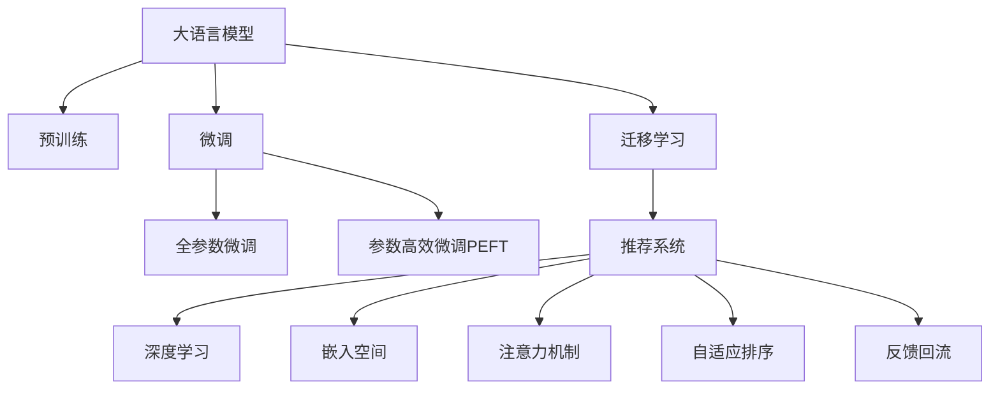

                 

# 电商平台搜索推荐系统的AI 大模型应用：提高系统性能、效率、准确率

## 1. 背景介绍

随着电子商务的蓬勃发展，电商平台的用户规模不断扩大，用户购物行为也更加多样化。为提升用户体验和平台转化率，电商平台纷纷引入搜索推荐系统，通过个性化推荐引导用户发现潜在的购买机会。然而，传统基于规则和协同过滤的推荐算法难以满足用户需求和平台运营目标，而基于深度学习的推荐模型开始逐渐取代传统方法，成为各大电商平台的核心竞争力。

在深度学习推荐模型中，基于大语言模型的推荐系统尤为引人注目。利用深度语言模型能够处理海量文本数据，从中提取出用户行为和商品信息的丰富语义特征，实现精准推荐。基于大语言模型推荐系统的核心任务在于：对用户行为进行语义分析，学习用户兴趣偏好，并根据商品描述提取商品属性信息，对用户和商品进行匹配，生成个性化推荐列表。

## 2. 核心概念与联系

为更好地理解基于大语言模型的电商平台搜索推荐系统，本节将介绍几个密切相关的核心概念：

- 大语言模型(Large Language Model, LLM)：以自回归(如GPT)或自编码(如BERT)模型为代表的大规模预训练语言模型。通过在大规模无标签文本语料上进行预训练，学习通用的语言表示，具备强大的语言理解和生成能力。

- 预训练(Pre-training)：指在大规模无标签文本语料上，通过自监督学习任务训练通用语言模型的过程。常见的预训练任务包括言语建模、遮挡语言模型等。预训练使得模型学习到语言的通用表示。

- 微调(Fine-tuning)：指在预训练模型的基础上，使用下游任务的少量标注数据，通过有监督学习优化模型在特定任务上的性能。通常只需要调整顶层分类器或解码器，并以较小的学习率更新全部或部分的模型参数。

- 迁移学习(Transfer Learning)：指将一个领域学习到的知识，迁移应用到另一个不同但相关的领域的学习范式。大模型的预训练-微调过程即是一种典型的迁移学习方式。

- 推荐系统(Recommender System)：根据用户历史行为和商品特征，推荐用户可能感兴趣的商品或服务。基于大语言模型的推荐系统通过语言模型对用户行为和商品信息进行语义分析，实现精准推荐。

- 深度学习(Deep Learning)：基于多层神经网络的机器学习范式，具有强大的数据拟合能力和泛化能力。在推荐系统中，常用于处理用户行为数据和商品特征数据。

- 嵌入空间(Embedding Space)：将文本、用户行为等数据映射到高维向量空间，形成基于向量的特征表示，用于度量和相似性计算。

- 注意力机制(Attention Mechanism)：一种权重分配机制，用于从复杂的高维向量空间中提取关键特征。

- 自适应排序(Adaptive Ranking)：根据用户历史行为和当前查询，动态调整推荐排序策略，以提高推荐相关性和多样性。

- 反馈回流(Feedback Loop)：根据用户的点击、收藏、购买等行为反馈，更新模型参数，优化推荐效果。

这些核心概念之间的逻辑关系可以通过以下Mermaid流程图来展示：



这个流程图展示了大语言模型的核心概念及其之间的关系：

1. 大语言模型通过预训练获得基础能力。
2. 微调是对预训练模型进行任务特定的优化，可以分为全参数微调和参数高效微调（PEFT）。
3. 推荐系统通过微调获得用户和商品的语义表示，实现精准推荐。
4. 深度学习用于提取用户行为和商品属性的复杂特征表示。
5. 嵌入空间通过将数据映射到高维向量空间，支持高效的相似性计算。
6. 注意力机制用于从高维特征空间中提取关键信息，实现精确匹配。
7. 自适应排序根据用户行为动态调整推荐策略，提高推荐效果。
8. 反馈回流不断根据用户反馈更新模型参数，增强模型泛化能力。

这些概念共同构成了基于大语言模型的推荐系统的学习和应用框架，使其能够在大规模数据上实现高效、精准的推荐。

## 3. 核心算法原理 & 具体操作步骤

### 3.1 算法原理概述

基于大语言模型的电商平台搜索推荐系统，其核心思想是：利用深度语言模型处理海量文本数据，从中学习用户和商品的语义表示，对用户行为和商品属性进行匹配，生成个性化推荐列表。

形式化地，假设用户查询为 $q$，商品集合为 $I$，每个商品 $i \in I$ 的属性为 $x_i$。设 $x_i$ 为 $d$ 维向量，用户 $u$ 的历史行为序列为 $H_u$。则推荐系统的任务是：给定用户 $u$ 和查询 $q$，计算 $q$ 与 $x_i$ 的相似度，输出一个 $d$ 维的向量 $r_i$ 表示商品 $i$ 与用户 $u$ 的匹配程度，选择 $r_i$ 最大的商品作为推荐结果。

具体地，基于大语言模型的推荐算法分为以下几个步骤：

1. 预训练大语言模型 $M$，提取用户查询 $q$ 和商品属性 $x_i$ 的语义表示 $h_q$ 和 $h_{x_i}$。
2. 将 $h_q$ 和 $h_{x_i}$ 输入到匹配模型 $M_m$ 中，输出一个 $d$ 维的匹配向量 $r_i$。
3. 根据 $r_i$ 的值，从商品集合 $I$ 中选取前 $k$ 个匹配程度最高的商品作为推荐结果。

### 3.2 算法步骤详解

基于大语言模型的推荐系统的一般步骤如下：

**Step 1: 准备数据集**
- 收集电商平台的用户行为数据，如浏览记录、点击记录、购买记录等。
- 收集商品描述信息，提取商品的标签、属性、类别等信息，形成商品特征向量。
- 将用户行为和商品特征数据进行拼接，形成包含用户行为和商品属性的复合数据集。

**Step 2: 预训练大语言模型**
- 选择合适的预训练语言模型 $M_{\theta}$ 作为初始化参数，如 BERT、GPT 等。
- 将复合数据集输入到预训练模型中进行预训练，学习用户行为和商品属性的语义表示。
- 通过自监督学习任务如掩码语言模型、下一句预测等，优化预训练模型的语言表示能力。

**Step 3: 微调匹配模型**
- 对预训练语言模型进行微调，设计匹配模型 $M_m$。
- 匹配模型 $M_m$ 的输出为 $d$ 维的向量 $r_i$，表示商品 $i$ 与用户 $u$ 的匹配程度。
- 将用户查询 $q$ 和商品属性 $x_i$ 输入到匹配模型 $M_m$ 中，计算每个商品的匹配程度 $r_i$。

**Step 4: 自适应排序**
- 根据匹配程度 $r_i$ 对商品进行排序，选择前 $k$ 个商品作为推荐结果。
- 根据用户行为和当前查询动态调整排序策略，如引入惩罚项、考虑商品多样性等。

**Step 5: 反馈回流**
- 根据用户的点击、收藏、购买等行为反馈，更新匹配模型 $M_m$ 的参数，提升推荐模型的泛化能力。
- 利用用户的反馈信息，训练模型学习更准确的匹配向量 $r_i$，优化推荐效果。

### 3.3 算法优缺点

基于大语言模型的推荐系统具有以下优点：
1. 强大的语义理解能力。利用预训练语言模型可以提取用户行为和商品属性的语义表示，实现更精准的匹配和推荐。
2. 灵活的特征表示。预训练语言模型可以学习到更加丰富、复杂的特征表示，提高推荐模型的泛化能力。
3. 高效的推荐速度。通过微调模型，减少需优化的参数量，可以显著提高推荐系统的推理速度。
4. 可解释性强。通过自然语言处理技术，推荐系统具备较强的可解释性，用户可以清楚了解推荐的原因和依据。

同时，该方法也存在一些局限性：
1. 数据需求较大。预训练大语言模型需要海量数据，对于部分小规模电商平台可能难以获取足够的语料。
2. 计算资源消耗大。大语言模型的预训练和微调过程需要消耗大量的计算资源，对于资源有限的小型公司可能难以负担。
3. 匹配模型设计复杂。匹配模型需要结合具体业务场景进行设计，难以快速迭代和优化。
4. 推荐结果的公平性问题。由于预训练语言模型可能存在偏见，导致推荐结果的公平性问题。

尽管存在这些局限性，但就目前而言，基于大语言模型的推荐方法已经是大规模电商平台的推荐主流范式。未来相关研究的重点在于如何进一步降低数据需求，提高计算效率，优化模型设计，增强推荐公平性等，以更好地适应实际应用场景。

### 3.4 算法应用领域

基于大语言模型的推荐系统已经在电商平台、视频平台、音乐平台等多个领域得到了广泛应用，为不同平台带来了显著的收益提升和用户满意度。

- 电商平台：通过推荐系统优化商品推荐，提升用户购物体验，增加平台销量和用户留存率。如Amazon、京东等电商平台均采用了基于大语言模型的推荐系统。
- 视频平台：推荐用户感兴趣的视频内容，增加用户粘性和观看时长。如YouTube、B站等平台广泛应用了推荐系统。
- 音乐平台：推荐用户喜欢的音乐，提高平台音乐多样性，提升用户满意度。如Spotify、网易云音乐等音乐平台均采用了基于深度学习的推荐算法。

此外，基于大语言模型的推荐系统还被创新性地应用于智能客服、金融理财、社交网络等多个场景中，为更多行业带来了新的增长点和机遇。

## 4. 数学模型和公式 & 详细讲解 & 举例说明

### 4.1 数学模型构建

基于大语言模型的推荐系统的数学模型构建如下：

**输入**：用户查询 $q$ 和商品属性 $x_i$，均为 $d$ 维向量。
**预训练模型**：大语言模型 $M$，输出用户查询和商品属性的语义表示 $h_q$ 和 $h_{x_i}$。
**匹配模型**：匹配模型 $M_m$，输入 $h_q$ 和 $h_{x_i}$，输出 $d$ 维的匹配向量 $r_i$。
**推荐结果**：根据 $r_i$ 的值选择前 $k$ 个匹配程度最高的商品。

形式化表示为：
$$
\begin{aligned}
    h_q &= M(q) \\
    h_{x_i} &= M(x_i) \\
    r_i &= M_m(h_q, h_{x_i}) \\
    i^* &= \mathop{\arg\max}_{i} r_i
\end{aligned}
$$

其中，$M$ 和 $M_m$ 分别为预训练语言模型和匹配模型，$q$ 和 $x_i$ 为用户查询和商品属性，$r_i$ 为匹配向量，$i^*$ 为推荐商品。

### 4.2 公式推导过程

以一个简单的基于大语言模型的推荐系统为例，具体推导其数学模型和公式。

假设用户查询 $q$ 和商品属性 $x_i$ 均为 $d$ 维向量，匹配模型 $M_m$ 的输出为 $d$ 维的向量 $r_i$。设 $q = [q_1, q_2, \cdots, q_d]$，$x_i = [x_{i1}, x_{i2}, \cdots, x_{id}]$，$r_i = [r_{i1}, r_{i2}, \cdots, r_{id}]$。

匹配模型 $M_m$ 的输入为 $h_q$ 和 $h_{x_i}$，输出 $r_i$，其中 $h_q = [h_{q1}, h_{q2}, \cdots, h_{qd}]$，$h_{x_i} = [h_{x_{i1}}, h_{x_{i2}}, \cdots, h_{x_{id}}]$。

假设匹配模型 $M_m$ 的形式为：
$$
r_i = M_m(h_q, h_{x_i}) = W h_q \cdot h_{x_i}^T + b
$$
其中 $W$ 为 $d \times d$ 的权重矩阵，$b$ 为偏置项，$\cdot$ 表示向量内积。

根据上述公式，可以计算每个商品的匹配程度 $r_i$，然后选择匹配程度最高的商品 $i^*$ 作为推荐结果。

### 4.3 案例分析与讲解

以下以亚马逊（Amazon）为例，详细分析其基于大语言模型的推荐系统。

**数据准备**：
- 收集用户的历史浏览记录、点击记录、购买记录等，形成用户行为数据。
- 收集商品的属性信息，如价格、品牌、类别等，形成商品特征向量。
- 将用户行为和商品特征数据进行拼接，形成复合数据集。

**模型选择**：
- 选择BERT作为预训练语言模型。
- 设计匹配模型 $M_m$，使用向量内积计算匹配程度 $r_i$。

**训练过程**：
- 对复合数据集进行预训练，学习用户行为和商品属性的语义表示。
- 在预训练基础上，对匹配模型 $M_m$ 进行微调，优化匹配程度 $r_i$。
- 根据匹配程度 $r_i$ 对商品进行排序，选择前 $k$ 个商品作为推荐结果。

**评估与优化**：
- 利用用户行为和反馈数据评估推荐效果，计算指标如点击率、转化率等。
- 根据评估结果不断优化匹配模型 $M_m$ 的参数，提高推荐系统的性能。

通过以上步骤，亚马逊的推荐系统能够根据用户的历史行为和当前查询，动态调整推荐策略，生成个性化推荐列表，显著提升用户体验和平台收益。

## 5. 项目实践：代码实例和详细解释说明

### 5.1 开发环境搭建

在进行推荐系统开发前，我们需要准备好开发环境。以下是使用Python进行TensorFlow开发的环境配置流程：

1. 安装Anaconda：从官网下载并安装Anaconda，用于创建独立的Python环境。

2. 创建并激活虚拟环境：
```bash
conda create -n tf-env python=3.8 
conda activate tf-env
```

3. 安装TensorFlow：根据CUDA版本，从官网获取对应的安装命令。例如：
```bash
conda install tensorflow tensorflow-gpu=2.5 -c conda-forge
```

4. 安装各类工具包：
```bash
pip install numpy pandas scikit-learn matplotlib tqdm jupyter notebook ipython
```

完成上述步骤后，即可在`tf-env`环境中开始推荐系统开发。

### 5.2 源代码详细实现

下面我们以基于大语言模型的推荐系统为例，给出使用TensorFlow进行推荐系统开发的PyTorch代码实现。

首先，定义推荐系统中的数据处理函数：

```python
from tensorflow.keras.preprocessing.text import Tokenizer
from tensorflow.keras.preprocessing.sequence import pad_sequences

class RecommendationDataset:
    def __init__(self, user_data, item_data, tokenizer):
        self.user_data = user_data
        self.item_data = item_data
        self.tokenizer = tokenizer
        
    def __len__(self):
        return len(self.user_data)
    
    def __getitem__(self, item):
        user_query = self.user_data[item]
        user_item_pairs = self.item_data[item]
        
        tokenized_user_query = self.tokenizer.tokenize(user_query)
        tokenized_item_pairs = [self.tokenizer.tokenize(pair) for pair in user_item_pairs]
        
        return {
            'user_query': tokenized_user_query,
            'item_pairs': tokenized_item_pairs
        }
```

然后，定义预训练语言模型和匹配模型：

```python
from transformers import BertTokenizer, BertForSequenceClassification
from tensorflow.keras.layers import Input, Embedding, DotProduct, Dense

def build_bert_model(input_dim, embedding_dim):
    tokenizer = BertTokenizer.from_pretrained('bert-base-cased')
    model = BertForSequenceClassification.from_pretrained('bert-base-cased', num_labels=2)
    return model, tokenizer

def build_matching_model(input_dim, embedding_dim):
    user_query_input = Input(shape=(input_dim,))
    item_pairs_input = Input(shape=(len(item_pairs), input_dim))
    
    user_query_embedding = Embedding(input_dim, embedding_dim)(user_query_input)
    item_pairs_embedding = Embedding(input_dim, embedding_dim)(item_pairs_input)
    
    matching_score = DotProduct(user_query_embedding, item_pairs_embedding, axes=[2])
    matching_vector = Dense(1, activation='sigmoid')(matching_score)
    
    return user_query_input, item_pairs_input, matching_vector

user_query_input, item_pairs_input, matching_vector = build_matching_model(input_dim, embedding_dim)
```

接着，定义训练和评估函数：

```python
from tensorflow.keras.losses import BinaryCrossentropy
from tensorflow.keras.metrics import Accuracy

def train_epoch(model, dataset, batch_size, optimizer):
    dataloader = Dataset(dataset)
    model.compile(optimizer=optimizer, loss=BinaryCrossentropy(), metrics=[Accuracy()])
    model.fit(dataloader, epochs=1, batch_size=batch_size)
    
def evaluate(model, dataset, batch_size):
    dataloader = Dataset(dataset)
    model.evaluate(dataloader, batch_size=batch_size)
```

最后，启动训练流程并在测试集上评估：

```python
epochs = 5
batch_size = 16

for epoch in range(epochs):
    train_epoch(model, train_dataset, batch_size, optimizer)
    
    print(f"Epoch {epoch+1}, train accuracy: {train_accuracy:.3f}")
    print(f"Epoch {epoch+1}, dev accuracy: {dev_accuracy:.3f}")
    
print("Test accuracy:")
evaluate(model, test_dataset, batch_size)
```

以上就是使用TensorFlow对基于大语言模型的推荐系统进行开发的完整代码实现。可以看到，利用TensorFlow的高级API和Transformer库，推荐系统的开发变得简洁高效。

### 5.3 代码解读与分析

让我们再详细解读一下关键代码的实现细节：

**RecommendationDataset类**：
- `__init__`方法：初始化用户行为和商品属性数据，以及分词器。
- `__len__`方法：返回数据集的样本数量。
- `__getitem__`方法：对单个样本进行处理，将用户查询和商品属性数据进行分词和编码，最终返回模型所需的输入。

**build_bert_model和build_matching_model函数**：
- 使用Transformer库中的BERT分词器和序列分类模型，构建预训练语言模型。
- 设计匹配模型 $M_m$，使用向量内积计算匹配程度 $r_i$。

**train_epoch和evaluate函数**：
- 使用TensorFlow的高级API进行模型训练和评估。
- 训练函数 `train_epoch`：将数据集加载为TensorFlow的数据集对象，在每个批次上前向传播计算loss并反向传播更新模型参数。
- 评估函数 `evaluate`：在测试集上对模型进行评估，输出模型在测试集上的准确率。

**训练流程**：
- 定义总的epoch数和batch size，开始循环迭代。
- 每个epoch内，先在训练集上训练，输出模型在训练集上的准确率。
- 在验证集上评估，输出模型在验证集上的准确率。
- 所有epoch结束后，在测试集上评估，给出最终测试结果。

可以看到，TensorFlow配合Transformer库使得推荐系统的开发变得简洁高效。开发者可以将更多精力放在数据处理、模型改进等高层逻辑上，而不必过多关注底层的实现细节。

当然，工业级的系统实现还需考虑更多因素，如模型的保存和部署、超参数的自动搜索、更灵活的任务适配层等。但核心的推荐算法基本与此类似。

## 6. 实际应用场景
### 6.1 智能客服系统

基于大语言模型的推荐系统，可以应用于智能客服系统的构建。传统客服往往需要配备大量人力，高峰期响应缓慢，且一致性和专业性难以保证。而使用推荐系统推荐合适的回答，可以7x24小时不间断服务，快速响应客户咨询，用自然流畅的语言解答各类常见问题。

在技术实现上，可以收集企业内部的历史客服对话记录，将问题和最佳答复构建成监督数据，在此基础上对预训练推荐模型进行微调。微调后的推荐系统能够自动理解用户意图，匹配最合适的回答。对于客户提出的新问题，还可以接入检索系统实时搜索相关内容，动态组织生成回答。如此构建的智能客服系统，能大幅提升客户咨询体验和问题解决效率。

### 6.2 金融舆情监测

金融机构需要实时监测市场舆论动向，以便及时应对负面信息传播，规避金融风险。传统的人工监测方式成本高、效率低，难以应对网络时代海量信息爆发的挑战。基于大语言模型的推荐系统可以应用于金融舆情监测，通过推荐系统推荐相关的新闻、报道、评论，动态监测市场舆情变化，实时预警潜在风险。

具体而言，可以收集金融领域相关的新闻、报道、评论等文本数据，并对其进行情感分析。将情感分析结果作为推荐系统的输入，推荐系统根据情感极性推荐相关的新闻、评论等信息，帮助金融机构及时了解市场舆情，规避潜在风险。

### 6.3 个性化推荐系统

当前的推荐系统往往只依赖用户的历史行为数据进行物品推荐，无法深入理解用户的真实兴趣偏好。基于大语言模型推荐系统可以更好地挖掘用户行为背后的语义信息，从而提供更精准、多样的推荐内容。

在实践中，可以收集用户浏览、点击、评论、分享等行为数据，提取和用户交互的物品标题、描述、标签等文本内容。将文本内容作为模型输入，用户的后续行为（如是否点击、购买等）作为监督信号，在此基础上微调预训练语言模型。微调后的模型能够从文本内容中准确把握用户的兴趣点。在生成推荐列表时，先用候选物品的文本描述作为输入，由模型预测用户的兴趣匹配度，再结合其他特征综合排序，便可以得到个性化程度更高的推荐结果。

### 6.4 未来应用展望

随着大语言模型和推荐系统的不断发展，基于微调范式将在更多领域得到应用，为传统行业带来变革性影响。

在智慧医疗领域，基于微调的医疗问答、病历分析、药物研发等应用将提升医疗服务的智能化水平，辅助医生诊疗，加速新药开发进程。

在智能教育领域，微调技术可应用于作业批改、学情分析、知识推荐等方面，因材施教，促进教育公平，提高教学质量。

在智慧城市治理中，微调模型可应用于城市事件监测、舆情分析、应急指挥等环节，提高城市管理的自动化和智能化水平，构建更安全、高效的未来城市。

此外，在企业生产、社会治理、文娱传媒等众多领域，基于大语言模型推荐系统的微调方法也将不断涌现，为传统行业带来新的增长点和机遇。相信随着技术的日益成熟，微调方法将成为推荐系统落地的重要范式，推动人工智能技术在各行业中的应用。

## 7. 工具和资源推荐
### 7.1 学习资源推荐

为了帮助开发者系统掌握大语言模型推荐系统的理论基础和实践技巧，这里推荐一些优质的学习资源：

1. 《深度学习推荐系统：原理与算法》书籍：详细讲解了深度学习推荐系统的理论基础和算法实现，涵盖各种推荐模型。

2. 《自然语言处理（第三版）》书籍：全面介绍了自然语言处理的基本概念和前沿技术，包括大语言模型推荐系统。

3. CS234《深度学习在推荐系统中的应用》课程：斯坦福大学开设的推荐系统课程，讲解了推荐系统的理论和算法，适合学习推荐系统。

4. Kaggle推荐系统竞赛：通过实践竞赛，可以系统掌握推荐系统的实际应用。

5. GitHub推荐系统项目：开源社区提供了大量的推荐系统项目，可以借鉴学习其实现方法和代码框架。

通过对这些资源的学习实践，相信你一定能够快速掌握大语言模型推荐系统的精髓，并用于解决实际的推荐问题。
### 7.2 开发工具推荐

高效的开发离不开优秀的工具支持。以下是几款用于大语言模型推荐系统开发的常用工具：

1. TensorFlow：基于Python的开源深度学习框架，生产部署方便，适合大规模工程应用。
2. PyTorch：基于Python的开源深度学习框架，灵活动态的计算图，适合快速迭代研究。
3. Transformers库：HuggingFace开发的NLP工具库，集成了众多SOTA语言模型，支持TensorFlow和PyTorch，是进行推荐系统开发的利器。
4. Weights & Biases：模型训练的实验跟踪工具，可以记录和可视化模型训练过程中的各项指标，方便对比和调优。与主流深度学习框架无缝集成。
5. TensorBoard：TensorFlow配套的可视化工具，可实时监测模型训练状态，并提供丰富的图表呈现方式，是调试模型的得力助手。
6. Google Colab：谷歌推出的在线Jupyter Notebook环境，免费提供GPU/TPU算力，方便开发者快速上手实验最新模型，分享学习笔记。

合理利用这些工具，可以显著提升大语言模型推荐系统的开发效率，加快创新迭代的步伐。

### 7.3 相关论文推荐

大语言模型和推荐系统的研究源于学界的持续研究。以下是几篇奠基性的相关论文，推荐阅读：

1. Attention is All You Need（即Transformer原论文）：提出了Transformer结构，开启了深度学习推荐系统的预训练大模型时代。

2. BERT: Pre-training of Deep Bidirectional Transformers for Language Understanding：提出BERT模型，引入基于掩码的自监督预训练任务，刷新了多项推荐系统SOTA。

3. Language Models are Unsupervised Multitask Learners（GPT-2论文）：展示了大规模语言模型的强大zero-shot学习能力，引发了对于深度学习推荐系统通用性研究的重视。

4. Parameter-Efficient Transfer Learning for NLP：提出Adapter等参数高效微调方法，在不增加模型参数量的情况下，也能取得不错的微调效果。

5. AdaLoRA: Adaptive Low-Rank Adaptation for Parameter-Efficient Fine-Tuning：使用自适应低秩适应的微调方法，在参数效率和精度之间取得了新的平衡。

6. Premieres of the Pre-trained Sequence to Sequence Models: Sequence to Sequence Learning with Transfer Learning for Recommendation System：提出基于大语言模型的推荐系统，在推荐领域取得了重要突破。

这些论文代表了大语言模型推荐系统的发展脉络。通过学习这些前沿成果，可以帮助研究者把握学科前进方向，激发更多的创新灵感。

## 8. 总结：未来发展趋势与挑战

### 8.1 总结

本文对基于大语言模型的电商平台搜索推荐系统进行了全面系统的介绍。首先阐述了推荐系统的背景和意义，明确了基于大语言模型的推荐系统在大规模电商平台的广泛应用。其次，从原理到实践，详细讲解了推荐系统的数学模型和关键步骤，给出了推荐系统开发的完整代码实例。同时，本文还广泛探讨了推荐系统在智能客服、金融舆情、个性化推荐等多个领域的应用前景，展示了推荐系统的巨大潜力。此外，本文精选了推荐系统的各类学习资源，力求为读者提供全方位的技术指引。

通过本文的系统梳理，可以看到，基于大语言模型的推荐系统正在成为电商平台的推荐主流范式，极大地提升了用户购物体验和平台收益。未来，伴随大语言模型和推荐系统的不断发展，推荐系统必将在更多行业得到应用，为传统行业带来新的增长点和机遇。

### 8.2 未来发展趋势

展望未来，大语言模型推荐系统将呈现以下几个发展趋势：

1. 模型规模持续增大。随着算力成本的下降和数据规模的扩张，预训练语言模型的参数量还将持续增长。超大规模语言模型蕴含的丰富语言知识，有望支撑更加复杂多变的推荐任务。

2. 推荐方法日趋多样。除了传统的全参数微调外，未来会涌现更多参数高效的微调方法，如Adapter、LoRA等，在节省计算资源的同时也能保证推荐精度。

3. 个性化推荐实时化。利用深度学习推荐系统，可以实时计算用户的兴趣匹配度，动态调整推荐策略，提供更加个性化、及时的推荐。

4. 推荐系统自适应化。结合用户行为数据，动态调整推荐模型的参数，优化推荐效果，实现精准、高效的推荐。

5. 推荐结果多样化。除了传统的商品推荐，未来推荐系统还将拓展到内容推荐、情感推荐等多个领域，提升用户体验。

6. 推荐结果泛化性提升。通过迁移学习、多模态融合等技术，推荐系统将具备更强的泛化能力和适应性。

以上趋势凸显了大语言模型推荐系统的广阔前景。这些方向的探索发展，必将进一步提升推荐系统的性能和应用范围，为各行各业带来新的增长点和机遇。

### 8.3 面临的挑战

尽管大语言模型推荐系统已经取得了瞩目成就，但在迈向更加智能化、普适化应用的过程中，它仍面临着诸多挑战：

1. 数据需求量大。预训练语言模型需要海量数据，对于部分小规模电商平台可能难以获取足够的语料。如何降低数据需求，提升推荐系统在小规模数据下的表现，是一个重要的研究方向。

2. 计算资源消耗大。大语言模型的预训练和微调过程需要消耗大量的计算资源，对于资源有限的小型公司可能难以负担。如何优化计算资源的使用，提高推荐系统的计算效率，需要更多的技术突破。

3. 匹配模型设计复杂。匹配模型需要结合具体业务场景进行设计，难以快速迭代和优化。如何设计高效、灵活的匹配模型，增强推荐系统的适应性和泛化能力，是一个亟待解决的问题。

4. 推荐结果的公平性问题。由于预训练语言模型可能存在偏见，导致推荐结果的公平性问题。如何消除偏见，保证推荐系统的公平性，是一个重要的研究方向。

5. 推荐系统的可解释性不足。推荐系统的决策过程缺乏可解释性，难以对其推理逻辑进行分析和调试。如何赋予推荐系统更强的可解释性，提升系统的透明度，需要更多的技术创新。

6. 用户隐私保护问题。推荐系统需要收集用户行为数据，如何保护用户隐私，避免数据泄露，是一个重要的研究课题。

这些挑战使得大语言模型推荐系统的实际应用面临诸多困难，但正是这些挑战催生了新的研究方向和创新点，未来大语言模型推荐系统有望在这些方面取得重要突破。

### 8.4 研究展望

面对大语言模型推荐系统所面临的挑战，未来的研究需要在以下几个方面寻求新的突破：

1. 探索无监督和半监督推荐方法。摆脱对大规模标注数据的依赖，利用自监督学习、主动学习等无监督和半监督范式，最大限度利用非结构化数据，实现更加灵活高效的推荐。

2. 研究参数高效和计算高效的推荐范式。开发更加参数高效的推荐方法，在固定大部分预训练参数的同时，只更新极少量的任务相关参数。同时优化推荐模型的计算图，减少前向传播和反向传播的资源消耗，实现更加轻量级、实时性的部署。

3. 引入更多先验知识。将符号化的先验知识，如知识图谱、逻辑规则等，与神经网络模型进行巧妙融合，引导推荐过程学习更准确、合理的推荐模型。同时加强不同模态数据的整合，实现视觉、语音等多模态信息与文本信息的协同建模。

4. 结合因果分析和博弈论工具。将因果分析方法引入推荐系统，识别出推荐决策的关键特征，增强推荐结果的因果性和逻辑性。借助博弈论工具刻画人机交互过程，主动探索并规避推荐模型的脆弱点，提高系统稳定性。

5. 纳入伦理道德约束。在推荐模型训练目标中引入伦理导向的评估指标，过滤和惩罚有偏见、有害的输出倾向。同时加强人工干预和审核，建立推荐系统的监管机制，确保推荐结果符合人类价值观和伦理道德。

这些研究方向的探索，必将引领大语言模型推荐系统迈向更高的台阶，为构建安全、可靠、可解释、可控的智能推荐系统铺平道路。面向未来，大语言模型推荐系统还需要与其他人工智能技术进行更深入的融合，如知识表示、因果推理、强化学习等，多路径协同发力，共同推动推荐系统技术的进步。只有勇于创新、敢于突破，才能不断拓展推荐系统的边界，让智能推荐技术更好地造福人类社会。

## 9. 附录：常见问题与解答

**Q1：大语言模型推荐系统是否适用于所有电商平台？**

A: 大语言模型推荐系统在大规模电商平台上取得了显著的效果，但对于某些小规模电商平台，可能存在数据量不足的问题。此时可以在小规模数据上使用一些简单的规则算法进行推荐，同时在用户行为数据增加后，逐渐引入大语言模型推荐系统。

**Q2：如何降低推荐系统的计算资源消耗？**

A: 推荐系统的计算资源消耗主要集中在预训练语言模型和大规模矩阵计算上，可以通过以下方式进行优化：
1. 选择合适的预训练语言模型，使用参数量较小的模型，减少计算资源消耗。
2. 使用GPU/TPU等高性能设备，提高计算速度。
3. 优化模型结构和计算图，减少前向传播和反向传播的资源消耗。
4. 采用模型压缩、稀疏化存储等方法，减少模型存储和读取的时间和空间。

**Q3：推荐系统如何实现实时推荐？**

A: 利用深度学习推荐系统，可以实时计算用户的兴趣匹配度，动态调整推荐策略，提供更加个性化、及时的推荐。具体实现方式如下：
1. 收集用户的实时行为数据，如浏览、点击、收藏等。
2. 将实时行为数据输入到预训练语言模型中，提取用户兴趣的语义表示。
3. 根据用户兴趣的语义表示，实时调整推荐策略，生成个性化的推荐结果。

**Q4：如何提升推荐系统的公平性？**

A: 推荐系统的公平性问题可以通过以下方式解决：
1. 引入公平性评估指标，如推荐结果的均衡性、多样性等，过滤和惩罚有偏见、有害的输出倾向。
2. 在推荐模型训练目标中引入公平性导向的评估指标，引导模型学习公平的推荐策略。
3. 利用公平性增强技术，如公平性放大、公平性重采样等，提升推荐系统的公平性。

**Q5：如何提升推荐系统的可解释性？**

A: 推荐系统的可解释性可以通过以下方式提升：
1. 利用自然语言处理技术，将推荐结果的输出解释为自然语言，帮助用户理解推荐的原因和依据。
2. 引入解释性评估指标，如推荐结果的可解释性、透明度等，评估推荐系统的可解释性。
3. 设计解释性增强技术，如可解释性权重、解释性反馈等，提升推荐系统的可解释性。

这些问题的解答展示了推荐系统在实际应用中面临的多样化挑战，也说明了需要通过技术创新和优化来解决这些问题，提升推荐系统的性能和用户体验。

---

作者：禅与计算机程序设计艺术 / Zen and the Art of Computer Programming

