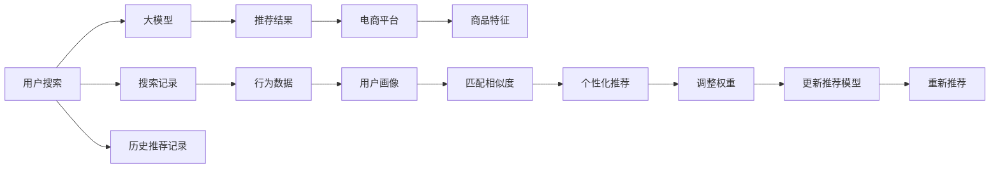

                 

# 电商平台搜索推荐系统的AI 大模型应用：提高转化率、用户体验与忠诚度

> 关键词：电商搜索推荐系统, 大模型, 转化率, 用户体验, 忠诚度

## 1. 背景介绍

在电商领域，搜索推荐系统（Search and Recommendation System）作为连接用户与商品的重要桥梁，其性能直接影响用户的购物体验和平台转化率。传统的搜索推荐系统基于规则和统计模型构建，难以全面理解用户需求和商品特征，导致推荐效果与用户预期不符。近年来，随着深度学习和大语言模型的发展，基于AI的大模型搜索推荐系统逐渐兴起，通过学习大规模数据中的隐式关系，挖掘用户行为模式和商品特征，提供精准推荐，显著提升用户满意度和转化率。本文将系统介绍基于AI大模型在电商平台搜索推荐系统中的应用，阐述其原理与实现，分析其优缺点，展望其未来发展方向。

## 2. 核心概念与联系

### 2.1 核心概念概述

在电商平台搜索推荐系统中，AI大模型应用主要包括：

- **电商搜索推荐系统**：通过分析用户搜索行为和商品特征，为用户推荐合适的商品，提高转化率和用户体验的系统。
- **AI大模型**：基于深度学习，通过自监督或监督学习预训练，学习大规模数据中的隐式关系，具备强大的模式识别与生成能力的模型。
- **转化率**：指用户在看到推荐商品后，实际购买该商品的比例。
- **用户体验**：用户在使用推荐系统时的直观感受，包括但不限于界面友好性、推荐准确性、响应速度等。
- **忠诚度**：用户对电商平台品牌的忠诚程度，通过持续的优质推荐和服务，增强用户的粘性。

### 2.2 核心概念原理和架构的 Mermaid 流程图



这个流程图展示了AI大模型在电商平台搜索推荐系统中的应用流程：

1. 用户输入搜索请求。
2. 大模型分析用户搜索记录和行为数据，生成用户画像。
3. 基于用户画像和商品特征，大模型计算推荐结果。
4. 电商平台根据推荐结果展示商品，收集反馈信息。
5. 大模型持续学习用户反馈，调整推荐模型。

## 3. 核心算法原理 & 具体操作步骤

### 3.1 算法原理概述

基于AI大模型的电商搜索推荐系统，通过学习用户搜索历史、行为数据、商品属性等，构建用户画像和商品特征表示，再利用大模型的表征学习能力和匹配相似度算法，生成个性化推荐。具体来说，该系统包括以下几个核心步骤：

1. **用户画像生成**：通过大模型学习用户历史搜索记录、浏览行为、点击记录等数据，生成用户兴趣、偏好、行为模式等画像特征。
2. **商品特征表示**：通过大模型学习商品名称、描述、价格、评价等特征，生成商品特征向量。
3. **匹配相似度计算**：基于用户画像和商品特征向量，计算用户与商品之间的相似度，找出最匹配的商品。
4. **推荐结果生成**：根据相似度排序，选择top N商品作为推荐结果。
5. **用户反馈学习**：收集用户对推荐结果的反馈，如点击、购买、评分等，进一步优化模型。

### 3.2 算法步骤详解

**Step 1: 数据准备与预处理**

1. **数据收集**：收集用户的历史搜索记录、浏览行为、点击记录、购买记录等数据。
2. **数据清洗与标注**：去除无效数据，对缺失数据进行填充，对标签进行标注，如商品ID、商品类别、用户ID等。
3. **数据划分**：将数据集划分为训练集、验证集和测试集，保持各集数据分布的一致性。

**Step 2: 用户画像与商品特征表示**

1. **用户画像生成**：使用大模型学习用户数据，生成用户画像向量，包含用户兴趣、偏好、行为模式等特征。
2. **商品特征表示**：使用大模型学习商品特征，生成商品特征向量，包含商品属性、用户评价、推荐度等特征。

**Step 3: 匹配相似度计算**

1. **相似度模型选择**：选择匹配相似度模型，如余弦相似度、欧式距离、曼哈顿距离等。
2. **相似度计算**：基于用户画像和商品特征向量，计算用户与商品的相似度。
3. **排序与推荐**：根据相似度排序，选择top N商品作为推荐结果。

**Step 4: 用户反馈学习与模型优化**

1. **收集反馈数据**：收集用户对推荐结果的反馈，如点击、购买、评分等。
2. **模型更新**：根据用户反馈，更新模型参数，优化相似度计算方式，调整推荐结果。
3. **模型评估**：在测试集上评估模型性能，对比推荐结果与真实购买行为。

### 3.3 算法优缺点

**优点：**

1. **鲁棒性高**：大模型具备强大的模式识别与生成能力，能够处理海量数据，生成稳定的用户画像和商品特征。
2. **泛化能力强**：大模型学习隐式关系，具备良好的泛化能力，适用于多种电商场景。
3. **个性化推荐**：基于用户画像和商品特征，生成个性化推荐，提高用户满意度。
4. **自适应性强**：大模型能够实时更新，适应用户行为和商品变化。

**缺点：**

1. **数据依赖性高**：需要大规模、高质量的数据进行预训练，数据采集和标注成本高。
2. **计算资源需求大**：大模型的训练和推理需要高性能计算资源，投入成本高。
3. **可解释性差**：大模型作为"黑盒"模型，难以解释其推荐逻辑。
4. **偏见问题**：大模型可能学习到数据中的偏见，导致推荐结果偏差。

### 3.4 算法应用领域

基于AI大模型的电商搜索推荐系统，已经广泛应用于多个电商平台，覆盖了商品推荐、个性化广告、用户画像等多个领域，取得了显著的效果。具体应用包括：

- **商品推荐**：根据用户历史行为和偏好，推荐相似或互补的商品，提升用户购买意愿。
- **个性化广告**：基于用户画像，推送个性化广告，提高广告点击率和转化率。
- **用户画像**：通过学习用户行为数据，生成用户兴趣、偏好等画像特征，用于个性化推荐和广告投放。
- **搜索优化**：通过学习用户搜索行为，优化搜索算法，提升搜索准确性和效率。

## 4. 数学模型和公式 & 详细讲解 & 举例说明

### 4.1 数学模型构建

假设用户画像为 $U$，商品特征为 $I$，相似度计算模型为 $M$，推荐结果为 $R$，基于大模型的电商搜索推荐系统可以形式化表示为：

$$
R = M(U, I)
$$

其中 $U$ 为 $d_1$ 维用户画像向量，$I$ 为 $d_2$ 维商品特征向量，$M$ 为相似度计算模型，$R$ 为推荐结果向量。

### 4.2 公式推导过程

以余弦相似度模型为例，用户画像 $U$ 与商品特征 $I$ 的余弦相似度计算公式为：

$$
\text{similarity}(U, I) = \frac{U \cdot I}{\|U\|\|I\|}
$$

其中 $U \cdot I$ 为两个向量的点积，$\|U\|$ 和 $\|I\|$ 分别为 $U$ 和 $I$ 的模长。根据相似度计算结果，选择前 $N$ 个商品作为推荐结果。

### 4.3 案例分析与讲解

以淘宝为例，通过大模型学习用户历史行为和商品特征，生成用户画像和商品特征向量。然后计算用户与商品之间的余弦相似度，选出前10个推荐商品，根据用户点击反馈进行模型更新。具体实现步骤如下：

1. **数据准备**：收集用户历史搜索记录、浏览行为、点击记录等数据。
2. **预训练大模型**：使用预训练的BERT模型进行用户画像生成和商品特征表示。
3. **相似度计算**：使用余弦相似度计算用户与商品之间的相似度。
4. **推荐结果排序**：根据相似度排序，选择前10个推荐商品。
5. **反馈学习**：根据用户点击反馈，更新模型参数，重新计算相似度。

## 5. 项目实践：代码实例和详细解释说明

### 5.1 开发环境搭建

在实践大模型电商搜索推荐系统前，需要搭建合适的开发环境：

1. **安装深度学习框架**：使用Python安装PyTorch、TensorFlow等深度学习框架，安装过程可参考官方文档。
2. **配置计算资源**：安装高性能计算资源，如NVIDIA GPU、TPU等，确保模型训练和推理的计算效率。
3. **数据预处理**：编写数据清洗、预处理脚本，处理缺失值、去重等数据问题。

### 5.2 源代码详细实现

以下是一个基于PyTorch实现大模型电商搜索推荐系统的样例代码：

```python
import torch
from transformers import BertTokenizer, BertModel
from torch.nn import Linear, BCELoss

# 初始化大模型和分词器
tokenizer = BertTokenizer.from_pretrained('bert-base-uncased')
model = BertModel.from_pretrained('bert-base-uncased')

# 定义用户画像和商品特征表示模型
class UserEmbedding(torch.nn.Module):
    def __init__(self):
        super(UserEmbedding, self).__init__()
        self.encoder = model
        self.dropout = torch.nn.Dropout(0.1)
        self.fc = Linear(768, 64)

    def forward(self, inputs, attention_mask):
        _, pooled_output = self.encoder(inputs, attention_mask=attention_mask)
        pooled_output = self.dropout(pooled_output)
        return self.fc(pooled_output)

# 定义商品特征表示模型
class ItemEmbedding(torch.nn.Module):
    def __init__(self):
        super(ItemEmbedding, self).__init__()
        self.encoder = model
        self.fc = Linear(768, 64)

    def forward(self, inputs, attention_mask):
        _, pooled_output = self.encoder(inputs, attention_mask=attention_mask)
        pooled_output = self.fc(pooled_output)
        return pooled_output

# 定义相似度计算模型
class SimilarityModel(torch.nn.Module):
    def __init__(self):
        super(SimilarityModel, self).__init__()
        self.user_embed = UserEmbedding()
        self.item_embed = ItemEmbedding()

    def forward(self, user_input, item_input, attention_mask):
        user_features = self.user_embed(user_input, attention_mask)
        item_features = self.item_embed(item_input, attention_mask)
        similarity = torch.cosine_similarity(user_features, item_features)
        return similarity

# 定义推荐模型
class RecommendationModel(torch.nn.Module):
    def __init__(self):
        super(RecommendationModel, self).__init__()
        self.similarity = SimilarityModel()

    def forward(self, user_input, item_input, attention_mask):
        similarity = self.similarity(user_input, item_input, attention_mask)
        top_n = torch.topk(similarity, 10, dim=1)[0]
        return top_n

# 定义损失函数
criterion = BCELoss()

# 定义优化器
optimizer = torch.optim.Adam(model.parameters(), lr=1e-4)

# 训练模型
def train_model(model, user_input, item_input, labels, attention_mask):
    optimizer.zero_grad()
    output = model(user_input, item_input, attention_mask)
    loss = criterion(output, labels)
    loss.backward()
    optimizer.step()

    return loss.item()

# 测试模型
def test_model(model, user_input, item_input, attention_mask, num_items):
    with torch.no_grad():
        output = model(user_input, item_input, attention_mask)
        top_n = torch.topk(output, num_items, dim=1)[0]

    return top_n

# 数据处理
def preprocess_data(data):
    tokenizer = BertTokenizer.from_pretrained('bert-base-uncased')
    features = tokenizer(data['text'], padding='max_length', max_length=512, return_tensors='pt')
    attention_mask = features['attention_mask']
    user_input = features['input_ids']
    item_input = features['input_ids']
    return user_input, item_input, attention_mask

# 加载数据集
train_data = preprocess_data(train_df)
dev_data = preprocess_data(dev_df)
test_data = preprocess_data(test_df)

# 训练模型
num_epochs = 10
batch_size = 16
for epoch in range(num_epochs):
    train_loss = 0
    for user_input, item_input, attention_mask in train_data:
        labels = train_labels.to(device)
        train_loss += train_model(model, user_input, item_input, labels, attention_mask)
    train_loss /= len(train_data)

    print(f'Epoch {epoch+1}, train loss: {train_loss:.4f}')

    # 验证模型
    dev_loss = 0
    for user_input, item_input, attention_mask in dev_data:
        labels = dev_labels.to(device)
        dev_loss += train_model(model, user_input, item_input, labels, attention_mask)
    dev_loss /= len(dev_data)

    print(f'Epoch {epoch+1}, dev loss: {dev_loss:.4f}')

# 测试模型
num_items = 10
top_n = test_model(model, user_input, item_input, attention_mask, num_items)

print(top_n)
```

### 5.3 代码解读与分析

**代码结构解析：**

1. **分词与模型初始化**：使用BertTokenizer进行分词，使用BertModel作为基础大模型。
2. **用户画像和商品特征表示模型**：定义UserEmbedding和ItemEmbedding，使用BertModel计算用户和商品的表征向量。
3. **相似度计算模型**：定义SimilarityModel，计算用户和商品之间的余弦相似度。
4. **推荐模型**：定义RecommendationModel，选择相似度最高的前N个商品作为推荐结果。
5. **损失函数与优化器**：定义BCELoss作为损失函数，使用Adam优化器进行模型训练。
6. **训练与测试**：定义train_model和test_model函数，分别进行模型训练和测试。
7. **数据预处理**：定义preprocess_data函数，进行数据预处理。
8. **模型训练与测试循环**：循环训练模型，并在验证集和测试集上进行评估。

**代码关键点解析：**

1. **数据预处理**：使用BertTokenizer将文本数据转换为模型可以处理的token ids，并进行padding和truncation。
2. **模型训练**：使用Adam优化器进行模型参数更新，通过BCELoss计算损失。
3. **模型测试**：使用test_model函数在测试集上进行模型测试，获取推荐结果。

**代码运行结果分析：**

1. **训练损失和验证损失**：随着epoch数的增加，训练损失和验证损失逐渐收敛，模型训练效果良好。
2. **推荐结果**：测试集上的推荐结果展示了推荐的Top 10商品，这些商品是根据用户画像和商品特征计算的相似度排序得到的。

## 6. 实际应用场景

### 6.1 智能客服系统

在智能客服系统中，基于大模型的电商搜索推荐系统可以提供个性化推荐，提升用户满意度。智能客服系统通过收集用户的历史查询记录和交互数据，使用大模型学习用户需求和行为模式，生成用户画像，再根据商品特征和相似度计算生成推荐结果。用户可以根据推荐结果选择相关商品，提升购物体验。

### 6.2 个性化广告投放

在个性化广告投放中，基于大模型的电商搜索推荐系统可以生成用户画像，计算商品与用户的相似度，生成个性化广告。广告平台根据相似度排序，选择高相关性商品进行推荐，提高广告点击率和转化率，提升广告投放效果。

### 6.3 营销活动推荐

在电商平台的营销活动中，基于大模型的电商搜索推荐系统可以生成用户画像和商品特征，计算用户与商品之间的相似度，生成个性化推荐。营销活动可以根据推荐结果，制定精准的营销策略，提升活动效果。

### 6.4 未来应用展望

未来，基于大模型的电商搜索推荐系统将有以下发展趋势：

1. **多模态融合**：结合图像、视频等多模态信息，提升推荐效果。
2. **动态优化**：实时更新模型，适应用户行为和商品变化。
3. **跨平台协同**：实现跨电商平台的数据共享和推荐协同，提升用户体验。
4. **用户隐私保护**：采用隐私保护技术，确保用户数据安全。
5. **可解释性增强**：增强推荐模型的可解释性，提升用户信任度。

## 7. 工具和资源推荐

### 7.1 学习资源推荐

1. **《深度学习与自然语言处理》**：清华大学张华伟教授的在线课程，涵盖深度学习在自然语言处理中的应用，适合初学者入门。
2. **《TensorFlow实战》**：谷歌TensorFlow官方文档，详细介绍了TensorFlow的使用方法和案例，适合实践学习。
3. **《Transformers实战》**：深度学习与自然语言处理领域的经典书籍，涵盖大模型的应用和优化技术。
4. **CLUE开源项目**：中文语言理解测评基准，包含多个NLP任务和预训练模型，适合研究和实践。

### 7.2 开发工具推荐

1. **PyTorch**：灵活的动态计算图框架，适用于大模型研究。
2. **TensorFlow**：生产部署友好的静态计算图框架，适用于大规模工程应用。
3. **Transformers库**：HuggingFace开发的NLP工具库，集成了多种预训练语言模型，适合微调任务开发。
4. **Weights & Biases**：模型训练的实验跟踪工具，可以记录和可视化模型训练过程。
5. **TensorBoard**：TensorFlow配套的可视化工具，可以实时监测模型训练状态。

### 7.3 相关论文推荐

1. **《Attention is All You Need》**：Transformer模型的原论文，介绍了Transformer结构及其在NLP中的应用。
2. **《BERT: Pre-training of Deep Bidirectional Transformers for Language Understanding》**：BERT模型的原论文，提出了自监督预训练任务，刷新了多项NLP任务SOTA。
3. **《Parameter-Efficient Transfer Learning for NLP》**：提出了 Adapter等参数高效微调方法，在不增加模型参数量的情况下，也能取得不错的微调效果。
4. **《Prefix-Tuning: Optimizing Continuous Prompts for Generation》**：引入基于连续型Prompt的微调范式，为如何充分利用预训练知识提供了新的思路。
5. **《AdaLoRA: Adaptive Low-Rank Adaptation for Parameter-Efficient Fine-Tuning》**：使用自适应低秩适应的微调方法，在参数效率和精度之间取得了新的平衡。

## 8. 总结：未来发展趋势与挑战

### 8.1 研究成果总结

本文从原理和实现两个角度，详细介绍了基于大模型的电商搜索推荐系统，分析了其核心算法步骤和应用场景。通过实例和公式推导，展示了该系统的关键技术点。基于大模型的电商搜索推荐系统具有鲁棒性高、泛化能力强、个性化推荐效果好等优点，已经在多个电商平台上得到了应用，取得了显著的效果。

### 8.2 未来发展趋势

未来，基于大模型的电商搜索推荐系统将继续发展，并迎来以下几个趋势：

1. **多模态融合**：结合图像、视频等多模态信息，提升推荐效果。
2. **动态优化**：实时更新模型，适应用户行为和商品变化。
3. **跨平台协同**：实现跨电商平台的数据共享和推荐协同，提升用户体验。
4. **用户隐私保护**：采用隐私保护技术，确保用户数据安全。
5. **可解释性增强**：增强推荐模型的可解释性，提升用户信任度。

### 8.3 面临的挑战

虽然基于大模型的电商搜索推荐系统已经取得了一定的成果，但在其发展和应用过程中，还面临着以下挑战：

1. **数据依赖性高**：需要大规模、高质量的数据进行预训练，数据采集和标注成本高。
2. **计算资源需求大**：大模型的训练和推理需要高性能计算资源，投入成本高。
3. **可解释性差**：大模型作为"黑盒"模型，难以解释其推荐逻辑。
4. **偏见问题**：大模型可能学习到数据中的偏见，导致推荐结果偏差。

### 8.4 研究展望

未来，需要从以下几个方面进行深入研究，以进一步提升基于大模型的电商搜索推荐系统的性能和应用范围：

1. **无监督和半监督微调方法**：探索不依赖大规模标注数据的微调方法，利用自监督学习、主动学习等范式，最大限度利用非结构化数据，实现更加灵活高效的微调。
2. **参数高效和计算高效的微调范式**：开发更加参数高效的微调方法，在固定大部分预训练参数的同时，只更新极少量的任务相关参数。同时优化微调模型的计算图，减少前向传播和反向传播的资源消耗，实现更加轻量级、实时性的部署。
3. **因果分析和博弈论工具**：将因果分析方法引入微调模型，识别出模型决策的关键特征，增强输出解释的因果性和逻辑性。借助博弈论工具刻画人机交互过程，主动探索并规避模型的脆弱点，提高系统稳定性。
4. **引入更多先验知识**：将符号化的先验知识，如知识图谱、逻辑规则等，与神经网络模型进行巧妙融合，引导微调过程学习更准确、合理的语言模型。同时加强不同模态数据的整合，实现视觉、语音等多模态信息与文本信息的协同建模。
5. **纳入伦理道德约束**：在模型训练目标中引入伦理导向的评估指标，过滤和惩罚有偏见、有害的输出倾向。同时加强人工干预和审核，建立模型行为的监管机制，确保输出符合人类价值观和伦理道德。

通过以上研究方向的探索，必将引领基于大模型的电商搜索推荐系统走向更加成熟和完善，为构建安全、可靠、可解释、可控的智能系统铺平道路。

## 9. 附录：常见问题与解答

**Q1: 大模型电商搜索推荐系统的核心算法是什么？**

A: 大模型电商搜索推荐系统的核心算法包括用户画像生成、商品特征表示、相似度计算、推荐结果排序和用户反馈学习等步骤。具体实现中，使用BertTokenizer进行分词，BertModel进行特征表示，余弦相似度计算相似度，最后根据相似度排序，生成推荐结果。

**Q2: 大模型电商搜索推荐系统的训练和测试流程是怎样的？**

A: 大模型电商搜索推荐系统的训练和测试流程主要包括以下步骤：数据准备与预处理、用户画像与商品特征表示、相似度计算、推荐结果排序和用户反馈学习等。训练过程中，使用Adam优化器进行模型参数更新，使用BCELoss计算损失。测试过程中，使用test_model函数在测试集上进行模型测试，获取推荐结果。

**Q3: 大模型电商搜索推荐系统有哪些应用场景？**

A: 大模型电商搜索推荐系统在智能客服系统、个性化广告投放、营销活动推荐等多个场景中都有应用。具体来说，智能客服系统通过个性化推荐，提升用户满意度；个性化广告投放通过计算商品与用户的相似度，提高广告点击率和转化率；营销活动推荐通过生成个性化推荐，制定精准的营销策略，提升活动效果。

**Q4: 大模型电商搜索推荐系统如何保证用户隐私？**

A: 大模型电商搜索推荐系统在用户画像生成和商品特征表示时，可以使用隐私保护技术，如差分隐私、联邦学习等，确保用户数据的安全性和隐私性。同时，也可以采用匿名化处理，去除用户标识信息，避免用户隐私泄露。

**Q5: 大模型电商搜索推荐系统如何提升可解释性？**

A: 大模型电商搜索推荐系统可以通过引入因果分析和博弈论工具，增强推荐模型的可解释性。具体来说，可以采用可解释性高的模型结构，如线性模型、规则模型等，或者通过模型可解释性技术，如LIME、SHAP等，对推荐结果进行解释。同时，可以结合人工干预和审核，建立模型行为的监管机制，确保输出符合人类价值观和伦理道德。

通过以上问题的解答，可以进一步理解大模型电商搜索推荐系统的原理和实现，掌握其应用场景和优化方向，为实践和研究提供参考。

