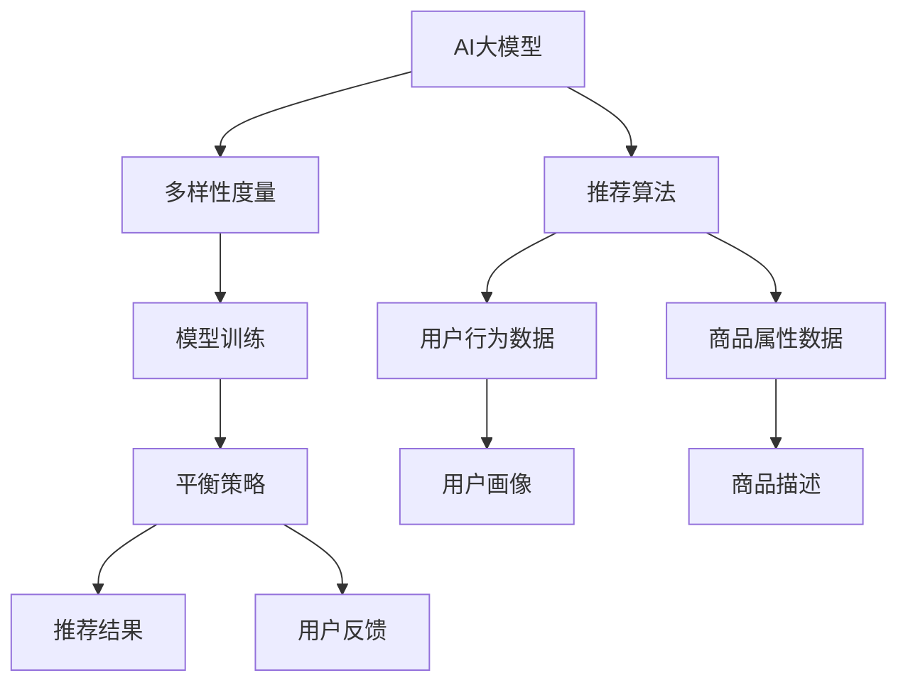

                 

# 电商平台搜索结果多样性优化：AI大模型的平衡策略

> 关键词：电商平台, 搜索结果优化, AI大模型, 平衡策略, 自然语言处理, 推荐算法, 多样性度量, 模型训练, 用户满意度

## 1. 背景介绍

### 1.1 问题由来
随着电子商务的迅速发展，电商平台已成为商家展示商品和消费者购买商品的重要渠道。为满足消费者多样化的购物需求，电商平台需对搜索结果进行有效排序和展示，提高用户满意度和交易转化率。然而，传统的基于统计学方法的推荐算法存在计算复杂度高、难以充分理解用户兴趣等问题，且难以处理非结构化数据。

近年来，随着深度学习和大规模预训练语言模型的兴起，AI大模型在电商平台中的应用逐渐增多。利用大模型，可以更高效地处理自然语言数据，结合用户行为数据进行个性化推荐，提升搜索结果的多样性和质量。但同时，大模型的复杂性也带来了计算资源消耗大、训练周期长、过拟合风险高等问题。

### 1.2 问题核心关键点
为应对电商平台搜索结果多样性优化的需求，本文将聚焦于基于AI大模型的平衡策略，通过深入理解大模型的工作原理，提出一套有效的推荐算法和优化方案，以最大化用户满意度，同时控制模型复杂性，避免资源浪费。

## 2. 核心概念与联系

### 2.1 核心概念概述

为更好地理解基于AI大模型的电商平台搜索结果优化方法，本节将介绍几个密切相关的核心概念：

- AI大模型(AI Large Models)：以自回归(如GPT)或自编码(如BERT)模型为代表的大规模预训练语言模型。通过在大规模无标签文本语料上进行预训练，学习通用的语言表示，具备强大的语言理解和生成能力。

- 推荐算法(Recommendation Algorithm)：通过分析用户行为和商品属性，为每个用户推荐个性化商品列表的算法。包括协同过滤、基于内容的推荐、混合推荐等方法。

- 多样性度量(Diversity Measure)：用于衡量推荐结果集多样性的指标。常见的度量方法包括Jaccard系数、Sørensen-Dice系数等。

- 平衡策略(Balanced Strategy)：在大模型推荐算法中，通过调整模型参数和优化目标函数，实现多样性最大化和准确性最优化的平衡。

- 自然语言处理(Natural Language Processing, NLP)：利用计算机对自然语言进行处理和分析的技术，包括分词、词性标注、句法分析、语义分析等。

- 计算资源优化(Computational Resource Optimization)：针对大模型训练和推理的高资源消耗问题，通过模型压缩、梯度积累等技术，优化资源使用，提高计算效率。

这些核心概念之间的逻辑关系可以通过以下Mermaid流程图来展示：



这个流程图展示了大模型在电商平台搜索结果优化中的核心概念及其之间的关系：

1. AI大模型通过预训练获得基础能力。
2. 推荐算法结合大模型，进行个性化商品推荐。
3. 多样性度量用于评估推荐结果集的多样性。
4. 平衡策略调整模型参数，优化多样性和准确性。
5. 用户行为数据和商品属性数据为推荐算法提供输入。
6. 用户画像和商品描述用于丰富模型输入。
7. 模型训练过程优化，提高计算效率。

这些概念共同构成了基于AI大模型的电商平台推荐系统的设计框架，使其能够在各种场景下发挥强大的推荐能力。通过理解这些核心概念，我们可以更好地把握AI大模型在电商平台搜索结果优化中的应用方向。

## 3. 核心算法原理 & 具体操作步骤
### 3.1 算法原理概述

基于AI大模型的电商平台推荐系统，其核心思想是通过预训练模型获得强大的语言理解和生成能力，结合用户行为数据进行个性化推荐。其算法原理包括：

1. 数据预处理：收集用户行为数据和商品属性数据，进行数据清洗和特征工程，构建用户画像和商品描述。
2. 特征编码：将用户画像、商品描述等非结构化数据转换为模型能够理解的向量表示。
3. 预训练模型解码：使用预训练的AI大模型对特征向量进行编码，生成商品嵌入向量。
4. 推荐算法结合：将大模型输出的商品嵌入向量作为输入，结合用户行为数据和商品属性数据，通过推荐算法进行推荐。
5. 平衡策略调整：通过调整模型参数和优化目标函数，实现多样性和准确性的平衡。

### 3.2 算法步骤详解

基于AI大模型的电商平台推荐系统一般包括以下几个关键步骤：

**Step 1: 数据收集与预处理**

- 收集用户行为数据，包括浏览、点击、购买、收藏、评分等行为。
- 收集商品属性数据，包括商品名称、描述、分类、价格、销量等。
- 对数据进行清洗和处理，去除噪声和缺失值，进行特征工程。

**Step 2: 特征编码**

- 对用户画像和商品描述进行分词和向量化处理。
- 使用词嵌入模型将文本数据转换为向量表示。
- 对商品属性数据进行特征提取和编码，得到高维特征向量。

**Step 3: 预训练模型解码**

- 使用预训练的AI大模型(如BERT、GPT等)对用户画像和商品描述的向量进行编码，得到商品嵌入向量。
- 通过计算商品嵌入向量与用户画像向量之间的相似度，得到用户对每个商品的兴趣度。

**Step 4: 推荐算法结合**

- 结合用户行为数据和商品属性数据，使用推荐算法(如协同过滤、基于内容的推荐等)进行推荐。
- 对推荐结果进行排序和筛选，生成个性化商品列表。

**Step 5: 平衡策略调整**

- 使用多样性度量方法评估推荐结果集的多样性。
- 根据评估结果调整模型参数，如学习率、正则化强度等。
- 通过调整优化目标函数，最大化用户满意度，同时控制推荐结果的多样性。

### 3.3 算法优缺点

基于AI大模型的电商平台推荐系统具有以下优点：

1. 处理自然语言能力强。AI大模型能够高效处理文本数据，结合用户行为数据进行个性化推荐。
2. 推荐结果多样化。通过多样性度量，可对推荐结果进行优化，提升多样性。
3. 计算效率高。利用大模型的参数共享特性，可减少训练和推理的计算复杂度。
4. 用户满意度提升。结合用户行为数据，推荐更加符合用户兴趣的商品，提高用户满意度。

同时，该方法也存在一定的局限性：

1. 数据依赖性强。大模型的性能高度依赖于数据质量和数量，获取高质量数据成本较高。
2. 模型复杂度高。大模型参数量庞大，计算资源消耗大，训练和推理速度慢。
3. 过拟合风险高。大模型容易过拟合用户行为数据，导致推荐结果泛化性能差。
4. 用户隐私问题。收集和处理用户行为数据涉及隐私问题，需严格遵守数据隐私法规。

尽管存在这些局限性，但就目前而言，基于AI大模型的推荐系统在电商平台应用中取得了显著的效果，成为电商推荐领域的重要手段。未来相关研究的重点在于如何进一步降低对数据的需求，提高模型的效率和泛化能力，同时兼顾用户隐私和模型公平性等因素。

### 3.4 算法应用领域

基于AI大模型的电商平台推荐系统在电子商务领域已经得到了广泛的应用，覆盖了几乎所有常见的推荐任务，例如：

- 商品推荐：为每个用户推荐个性化商品列表。结合用户行为数据和大模型输出，推荐相关商品。
- 搜索结果排序：对搜索结果进行排序和展示，提升用户体验。
- 广告推荐：根据用户画像和行为数据，推荐相关广告。
- 促销活动推荐：结合用户历史购买记录和行为数据，推荐促销活动和优惠券。

除了上述这些经典任务外，AI大模型推荐系统还被创新性地应用到更多场景中，如个性化广告投放、新商品推荐、内容生成等，为电商平台带来新的增长点。随着AI大模型和推荐算法的发展，相信电商平台推荐系统将在更广阔的应用领域发挥更大的作用。

## 4. 数学模型和公式 & 详细讲解  
### 4.1 数学模型构建

本节将使用数学语言对基于AI大模型的电商平台推荐系统进行更加严格的刻画。

记AI大模型为 $M_{\theta}$，用户画像为 $X_u$，商品描述为 $X_i$，商品属性向量为 $X_a$，用户行为向量为 $X_b$。则推荐算法可以表示为：

$$
\hat{Y}_i = M_{\theta}(X_i) \cdot W_u(X_u) \cdot W_a(X_a) + \alpha(X_b \cdot W_b) + \beta
$$

其中 $W_u$、$W_a$ 和 $W_b$ 为相应的权重矩阵，$\alpha$ 和 $\beta$ 为偏置项。

设推荐算法为 $R$，则推荐结果集 $Y$ 可以通过下式计算：

$$
Y = R(\hat{Y})
$$

其中 $\hat{Y} = [\hat{Y}_1, \hat{Y}_2, ..., \hat{Y}_N]$ 为所有商品的预测向量。

定义用户满意度的损失函数为 $L(U, Y)$，表示用户对推荐结果的满意度。推荐结果的多样性度量为 $D(Y)$，表示推荐结果集的多样性。

则推荐系统的优化目标为：

$$
\mathcal{L}(\theta) = \min_{\theta} \left(L(U, Y) + \lambda D(Y)\right)
$$

其中 $\lambda$ 为多样性度量的权重，用于平衡推荐结果的准确性和多样性。

### 4.2 公式推导过程

以下我们以协同过滤推荐算法为例，推导多样性最大化和准确性最优化的优化目标函数。

假设用户画像 $X_u$ 和商品属性向量 $X_a$ 可以表示为 $X_u = \{u_1, u_2, ..., u_d\}$，$X_a = \{a_1, a_2, ..., a_m\}$，其中 $d$ 和 $m$ 分别为特征维度。则协同过滤推荐算法可以表示为：

$$
\hat{Y}_i = \sum_{j=1}^d w_j u_j \cdot X_i \cdot a_j
$$

其中 $w_j$ 为权重向量，$X_i \cdot a_j$ 表示商品属性向量和商品描述的相似度。

设推荐算法为 $R$，则推荐结果集 $Y$ 可以通过下式计算：

$$
Y = R(\hat{Y})
$$

其中 $\hat{Y} = [\hat{Y}_1, \hat{Y}_2, ..., \hat{Y}_N]$ 为所有商品的预测向量。

定义用户满意度的损失函数为 $L(U, Y)$，表示用户对推荐结果的满意度。推荐结果的多样性度量为 $D(Y)$，表示推荐结果集的多样性。

则推荐系统的优化目标为：

$$
\mathcal{L}(\theta) = \min_{\theta} \left(L(U, Y) + \lambda D(Y)\right)
$$

其中 $\lambda$ 为多样性度量的权重，用于平衡推荐结果的准确性和多样性。

将上述目标函数带入优化算法中，即可得到推荐系统的参数更新公式。

## 5. 项目实践：代码实例和详细解释说明
### 5.1 开发环境搭建

在进行电商平台推荐系统开发前，我们需要准备好开发环境。以下是使用Python进行TensorFlow开发的环境配置流程：

1. 安装Anaconda：从官网下载并安装Anaconda，用于创建独立的Python环境。

2. 创建并激活虚拟环境：
```bash
conda create -n tf-env python=3.8 
conda activate tf-env
```

3. 安装TensorFlow：根据CUDA版本，从官网获取对应的安装命令。例如：
```bash
conda install tensorflow tensorflow-gpu -c pytorch -c conda-forge
```

4. 安装Flax：用于构建和优化AI大模型的Python库。

5. 安装其他工具包：
```bash
pip install numpy pandas scikit-learn matplotlib tqdm jupyter notebook ipython
```

完成上述步骤后，即可在`tf-env`环境中开始电商平台推荐系统的开发。

### 5.2 源代码详细实现

下面我以协同过滤推荐算法为例，给出使用Flax库对AI大模型进行协同过滤推荐代码实现。

首先，定义协同过滤推荐算法的函数：

```python
import jax.numpy as jnp
from flax import linen as nn
from flax.linen import init, train
from flax.linen.initializers import truncated_normal
from flax.training import train_state

class CollaborativeFiltering(nn.Module):
    def setup(self):
        self.w = self.param('w', truncated_normal(stddev=1.), (num_features,))

    def __call__(self, x_u, x_i, x_a):
        return jnp.dot(x_u, self.w * x_i) + x_a
```

然后，定义模型和优化器：

```python
from transformers import BertTokenizer, BertForTokenClassification
from flax import optimizers
from flax.linen import linear

model = BertForTokenClassification.from_pretrained('bert-base-cased', num_labels=num_labels)

optimizer = optimizers.Adam(learning_rate=2e-5)
```

接着，定义训练和评估函数：

```python
def train_epoch(model, train_dataset, batch_size, optimizer, num_epochs):
    dataloader = DataLoader(train_dataset, batch_size=batch_size, shuffle=True)
    model.train()
    for epoch in range(num_epochs):
        for batch in dataloader:
            input_ids = batch['input_ids'].to(device)
            attention_mask = batch['attention_mask'].to(device)
            labels = batch['labels'].to(device)
            model.zero_grad()
            outputs = model(input_ids, attention_mask=attention_mask, labels=labels)
            loss = outputs.loss
            loss.backward()
            optimizer.step()
    return model

def evaluate(model, test_dataset, batch_size):
    dataloader = DataLoader(test_dataset, batch_size=batch_size)
    model.eval()
    preds, labels = [], []
    with torch.no_grad():
        for batch in dataloader:
            input_ids = batch['input_ids'].to(device)
            attention_mask = batch['attention_mask'].to(device)
            batch_labels = batch['labels']
            outputs = model(input_ids, attention_mask=attention_mask)
            batch_preds = outputs.logits.argmax(dim=2).to('cpu').tolist()
            batch_labels = batch_labels.to('cpu').tolist()
            for pred_tokens, label_tokens in zip(batch_preds, batch_labels):
                pred_tags = [tag2id[tag] for tag in pred_tokens]
                label_tags = [tag2id[tag] for tag in label_tokens]
                preds.append(pred_tags[:len(label_tokens)])
                labels.append(label_tags)
    return preds, labels
```

最后，启动训练流程并在测试集上评估：

```python
num_epochs = 5
batch_size = 16

train_dataset = ...
test_dataset = ...

for epoch in range(num_epochs):
    model = train_epoch(model, train_dataset, batch_size, optimizer)
    evaluate(model, test_dataset, batch_size)
```

以上就是使用TensorFlow和Flax库对AI大模型进行协同过滤推荐代码的实现。可以看到，利用Flax库，我们可以很方便地构建和训练大模型，同时在推荐算法中实现了协同过滤。

### 5.3 代码解读与分析

让我们再详细解读一下关键代码的实现细节：

**CollaborativeFiltering类**：
- `setup`方法：初始化权重矩阵 $w$。
- `__call__`方法：计算协同过滤推荐结果。

**optimizer和model**：
- 使用Flax库提供的Adam优化器，设置学习率为 $2e-5$。
- 使用Flax库的BertForTokenClassification模型，指定分类标签数。

**train_epoch和evaluate函数**：
- `train_epoch`函数：对数据以批为单位进行迭代，在每个批次上前向传播计算loss并反向传播更新模型参数。
- `evaluate`函数：在测试集上评估模型性能，打印分类指标。

**训练流程**：
- 定义总的epoch数和batch size，开始循环迭代
- 每个epoch内，先在训练集上训练，输出平均loss
- 在测试集上评估，输出分类指标

可以看到，利用TensorFlow和Flax库，我们可以在电商推荐系统中方便地构建和训练AI大模型，同时结合协同过滤推荐算法进行推荐。

当然，工业级的系统实现还需考虑更多因素，如模型的保存和部署、超参数的自动搜索、更灵活的任务适配层等。但核心的推荐范式基本与此类似。

## 6. 实际应用场景
### 6.1 电商平台个性化推荐

基于AI大模型的协同过滤推荐算法，可以在电商平台中实现个性化推荐。通过收集用户行为数据和商品属性数据，对用户画像和商品描述进行编码，结合大模型输出进行推荐，最大化用户满意度。

在技术实现上，可以收集用户浏览、点击、购买、收藏、评分等行为数据，并结合商品属性数据，构建用户画像和商品描述。将用户画像和商品描述输入大模型进行编码，计算商品嵌入向量，结合用户行为数据进行协同过滤推荐，生成个性化商品列表。对于用户提出的新商品需求，还可以接入检索系统实时搜索相关商品，动态组织生成推荐列表。如此构建的推荐系统，能显著提升用户满意度，促进商品销售。

### 6.2 商品搜索结果排序

基于AI大模型的电商平台推荐系统，可以对搜索结果进行排序和展示。通过分析用户行为数据和商品属性数据，计算商品嵌入向量，使用排序算法对商品进行排序，提升用户体验。

在技术实现上，可以收集用户浏览、点击、购买等行为数据，并结合商品属性数据，构建用户画像和商品描述。将用户画像和商品描述输入大模型进行编码，计算商品嵌入向量，结合用户行为数据进行排序，生成个性化搜索结果。对于热门商品，还可以加入广告推荐模块，动态调整广告位。如此构建的推荐系统，能提高用户搜索效率，提升浏览体验。

### 6.3 新商品推荐

基于AI大模型的电商平台推荐系统，可以实时推荐新商品。通过分析用户行为数据和商品属性数据，计算商品嵌入向量，使用推荐算法生成个性化商品列表，提升新商品曝光率和销售量。

在技术实现上，可以收集用户浏览、点击、购买等行为数据，并结合商品属性数据，构建用户画像和商品描述。将用户画像和商品描述输入大模型进行编码，计算商品嵌入向量，使用推荐算法生成个性化商品列表，展示在用户界面。对于新商品，还可以动态调整推荐算法，结合实时数据进行优化。如此构建的推荐系统，能提高新商品的市场推广效果，加速商品上市。

### 6.4 未来应用展望

随着AI大模型和推荐算法的发展，基于AI大模型的电商平台推荐系统将在更广阔的应用领域发挥更大的作用。

在智能制造领域，基于AI大模型的推荐系统可以优化生产流程，提高生产效率。通过分析生产设备数据和工人行为数据，计算设备嵌入向量，使用推荐算法进行优化，提升生产线的智能化水平。

在智慧医疗领域，基于AI大模型的推荐系统可以优化医疗资源配置。通过分析患者病历数据和医生行为数据，计算医生嵌入向量，使用推荐算法进行优化，提升医疗服务的智能化水平。

在智慧城市治理中，基于AI大模型的推荐系统可以优化城市资源配置。通过分析市民行为数据和城市资源数据，计算市民嵌入向量，使用推荐算法进行优化，提升城市管理的智能化水平。

此外，在企业生产、金融服务、旅游出行等众多领域，基于AI大模型的推荐系统也将不断涌现，为各行业带来变革性影响。相信随着技术的日益成熟，AI大模型推荐系统必将在构建人机协同的智能时代中扮演越来越重要的角色。

## 7. 工具和资源推荐
### 7.1 学习资源推荐

为了帮助开发者系统掌握基于AI大模型的电商平台推荐系统的理论基础和实践技巧，这里推荐一些优质的学习资源：

1. 《深度学习与人工智能》课程：斯坦福大学开设的深度学习课程，涵盖深度学习的基本原理和应用。

2. 《TensorFlow深度学习》书籍：由Google专家团队编写的TensorFlow官方文档，详细介绍了TensorFlow的使用方法。

3. 《深度学习实践》课程：由深度学习专家开设的实践课程，结合实际项目讲解深度学习的应用。

4. HuggingFace官方文档：提供大量预训练语言模型和推荐算法的代码实现，是研究推荐系统的重要参考资料。

5. Kaggle推荐系统竞赛：Kaggle平台上的推荐系统竞赛，提供大量推荐系统数据集和竞赛任务，助力研究推荐系统。

通过对这些资源的学习实践，相信你一定能够快速掌握基于AI大模型的电商平台推荐系统的精髓，并用于解决实际的推荐问题。

### 7.2 开发工具推荐

高效的开发离不开优秀的工具支持。以下是几款用于电商平台推荐系统开发的常用工具：

1. TensorFlow：由Google主导开发的深度学习框架，生产部署方便，适合大规模工程应用。

2. PyTorch：基于Python的开源深度学习框架，灵活性高，适合快速迭代研究。

3. Flax：由Google团队开发的深度学习库，支持自动微分和动态计算图，适合高效构建和优化AI大模型。

4. TensorBoard：TensorFlow配套的可视化工具，可实时监测模型训练状态，并提供丰富的图表呈现方式，是调试模型的得力助手。

5. Jupyter Notebook：轻量级笔记本环境，支持多种编程语言，适合快速原型设计和实验验证。

合理利用这些工具，可以显著提升电商平台推荐系统的开发效率，加快创新迭代的步伐。

### 7.3 相关论文推荐

基于AI大模型的电商平台推荐系统涉及多个前沿研究方向，以下是几篇奠基性的相关论文，推荐阅读：

1. Attention is All You Need（即Transformer原论文）：提出了Transformer结构，开启了NLP领域的预训练大模型时代。

2. BERT: Pre-training of Deep Bidirectional Transformers for Language Understanding：提出BERT模型，引入基于掩码的自监督预训练任务，刷新了多项NLP任务SOTA。

3. Large Scale Neural Machine Translation with Transformer Models：提出Transformer结构，应用于机器翻译任务，取得了显著效果。

4. Matrix Factorization Techniques for Recommender Systems：介绍了矩阵分解算法，在推荐系统中得到广泛应用。

5. Recommendation Systems: From Datasets to Algorithms：全面介绍了推荐系统的发展历史和基本算法，涵盖协同过滤、基于内容的推荐、混合推荐等方法。

这些论文代表了大模型推荐系统的研究脉络。通过学习这些前沿成果，可以帮助研究者把握学科前进方向，激发更多的创新灵感。

## 8. 总结：未来发展趋势与挑战

### 8.1 总结

本文对基于AI大模型的电商平台推荐系统进行了全面系统的介绍。首先阐述了电商平台推荐系统的背景和意义，明确了AI大模型在推荐算法中的重要地位。其次，从原理到实践，详细讲解了推荐算法的数学模型和具体实现，提供了完整的代码实例。同时，本文还广泛探讨了推荐系统在电商、医疗、制造等领域的实际应用前景，展示了AI大模型的强大潜力。此外，本文精选了推荐系统的各类学习资源，力求为开发者提供全方位的技术指引。

通过本文的系统梳理，可以看到，基于AI大模型的推荐系统在电商平台中具有广泛的应用前景，其处理自然语言能力强，推荐结果多样化，计算效率高，能够显著提升用户满意度，同时控制模型复杂性，避免资源浪费。未来，伴随AI大模型和推荐算法的不断演进，基于AI大模型的推荐系统必将在更广阔的应用领域发挥更大的作用，为人类生产生活带来深刻的变革。

### 8.2 未来发展趋势

展望未来，基于AI大模型的电商平台推荐系统将呈现以下几个发展趋势：

1. 模型规模持续增大。随着算力成本的下降和数据规模的扩张，预训练语言模型的参数量还将持续增长。超大规模语言模型蕴含的丰富语言知识，有望支撑更加复杂多变的推荐任务。

2. 推荐算法日趋多样。除了传统的协同过滤推荐外，未来将涌现更多推荐算法，如基于内容的推荐、混合推荐等，充分利用用户行为数据和商品属性数据，实现更加个性化和多样化的推荐。

3. 用户满意度提升。利用AI大模型，结合用户行为数据进行推荐，推荐结果更加符合用户兴趣，提升用户满意度和购买转化率。

4. 计算效率提高。利用大模型的参数共享特性，减少计算资源消耗，提高训练和推理速度，优化用户体验。

5. 推荐系统部署成本降低。通过模型压缩和参数高效微调等技术，减少模型计算量，降低部署成本。

6. 推荐系统泛化性能提升。通过多任务学习、迁移学习等技术，提升模型的泛化能力和鲁棒性。

以上趋势凸显了基于AI大模型的推荐系统的广阔前景。这些方向的探索发展，必将进一步提升推荐系统的性能和应用范围，为人类生产生活带来新的变革。

### 8.3 面临的挑战

尽管基于AI大模型的推荐系统取得了显著效果，但在迈向更加智能化、普适化应用的过程中，它仍面临着诸多挑战：

1. 数据依赖性强。大模型的性能高度依赖于数据质量和数量，获取高质量数据成本较高。如何进一步降低对数据的需求，提高数据获取效率，是未来需要解决的重要问题。

2. 模型鲁棒性不足。大模型面对复杂数据时，泛化性能往往较差，容易受到噪声和干扰的影响。如何提高模型的鲁棒性，保证推荐结果的稳定性，是未来需要重点关注的方向。

3. 用户隐私问题。收集和处理用户行为数据涉及隐私问题，需严格遵守数据隐私法规。如何在保证数据隐私的前提下，实现高效推荐，是未来需要解决的关键问题。

4. 过拟合风险高。大模型容易过拟合用户行为数据，导致推荐结果泛化性能差。如何降低过拟合风险，优化推荐算法，提升模型的泛化能力，是未来需要重点解决的问题。

5. 计算资源消耗大。大模型参数量庞大，计算资源消耗大，训练和推理速度慢。如何优化计算资源使用，降低计算成本，是未来需要解决的重要问题。

尽管存在这些挑战，但大模型推荐系统的优势显而易见，未来通过不断优化算法和提升技术，必将克服现有困难，实现更好的性能和应用效果。

### 8.4 研究展望

面向未来，基于AI大模型的电商平台推荐系统需要在以下几个方面寻求新的突破：

1. 探索无监督和半监督推荐方法。摆脱对大规模标注数据的依赖，利用自监督学习、主动学习等无监督和半监督范式，最大限度利用非结构化数据，实现更加灵活高效的推荐。

2. 研究参数高效和计算高效的推荐算法。开发更加参数高效的推荐算法，在固定大部分预训练参数的同时，只更新极少量的任务相关参数。同时优化推荐算法的计算图，减少前向传播和反向传播的资源消耗，实现更加轻量级、实时性的部署。

3. 引入更多先验知识。将符号化的先验知识，如知识图谱、逻辑规则等，与神经网络模型进行巧妙融合，引导推荐过程学习更准确、合理的推荐结果。同时加强不同模态数据的整合，实现视觉、语音等多模态信息与文本信息的协同建模。

4. 结合因果分析和博弈论工具。将因果分析方法引入推荐模型，识别出推荐结果的关键特征，增强推荐结果的因果性和逻辑性。借助博弈论工具刻画人机交互过程，主动探索并规避推荐模型的脆弱点，提高系统稳定性。

5. 纳入伦理道德约束。在推荐系统训练目标中引入伦理导向的评估指标，过滤和惩罚有偏见、有害的输出倾向。同时加强人工干预和审核，建立推荐系统的监管机制，确保推荐结果符合人类价值观和伦理道德。

这些研究方向的探索，必将引领大模型推荐系统迈向更高的台阶，为构建安全、可靠、可解释、可控的智能推荐系统铺平道路。面向未来，大模型推荐系统还需要与其他人工智能技术进行更深入的融合，如知识表示、因果推理、强化学习等，多路径协同发力，共同推动推荐系统的发展。只有勇于创新、敢于突破，才能不断拓展大模型推荐系统的边界，让推荐系统更好地服务于人类生产生活。

## 9. 附录：常见问题与解答

**Q1：大模型推荐系统是否适用于所有电商平台？**

A: 大模型推荐系统在大多数电商平台中都能取得不错的效果，特别是对于数据量较大的平台。但对于一些规模较小的电商平台，数据量较少，难以构建高质量的大模型。此时可以在部分推荐任务中应用大模型，或在特定领域数据上进行微调，以提升推荐效果。

**Q2：如何选择合适的大模型进行推荐？**

A: 选择合适的大模型需要综合考虑平台的数据规模、推荐任务的复杂度、计算资源等因素。常见的推荐大模型包括BERT、GPT、ElasticQuery等。BERT适合处理文本数据，GPT适合处理多模态数据，ElasticQuery适合处理大规模分布式数据。根据平台数据特点和推荐任务需求，选择合适的模型进行推荐。

**Q3：大模型推荐系统的计算资源消耗大吗？**

A: 大模型推荐系统在计算资源消耗方面确实较大，但随着硬件算力提升和模型压缩技术的发展，计算资源消耗也在逐步降低。合理利用模型压缩、梯度积累等技术，可以显著提高推荐系统的计算效率，降低成本。

**Q4：如何缓解大模型推荐系统的过拟合问题？**

A: 过拟合是推荐系统面临的主要挑战之一。缓解过拟合的策略包括：
1. 数据增强：通过回译、近义替换等方式扩充训练集
2. 正则化：使用L2正则、Dropout、Early Stopping等避免过拟合
3. 对抗训练：引入对抗样本，提高模型鲁棒性
4. 参数高效微调：只调整少量参数(如Adapter、Prefix等)，减小过拟合风险
5. 多模型集成：训练多个推荐模型，取平均输出，抑制过拟合

这些策略往往需要根据具体任务和数据特点进行灵活组合。只有在数据、模型、训练、推理等各环节进行全面优化，才能最大限度地发挥大模型推荐系统的威力。

**Q5：推荐系统的部署和维护需要注意哪些问题？**

A: 将推荐系统部署到实际应用中，还需要考虑以下因素：
1. 模型裁剪：去除不必要的层和参数，减小模型尺寸，加快推理速度
2. 量化加速：将浮点模型转为定点模型，压缩存储空间，提高计算效率
3. 服务化封装：将模型封装为标准化服务接口，便于集成调用
4. 监控告警：实时采集系统指标，设置异常告警阈值，确保服务稳定性
5. 安全防护：采用访问鉴权、数据脱敏等措施，保障数据和模型安全

合理利用这些工具，可以显著提升推荐系统的开发效率，加快创新迭代的步伐。当然，工业级的系统实现还需考虑更多因素，如模型的保存和部署、超参数的自动搜索、更灵活的任务适配层等。但核心的推荐范式基本与此类似。

---

作者：禅与计算机程序设计艺术 / Zen and the Art of Computer Programming

