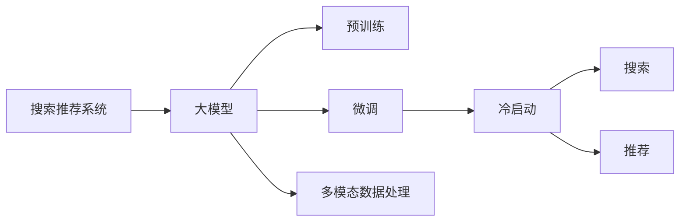

                 

# 电商平台的AI 大模型实践：搜索推荐系统是核心，冷启动策略与数据处理能力

在电商领域，搜索推荐系统（Search and Recommendation System, SR系统）是客户获取商品信息、提升购物体验、优化商家展示和销售的重要工具。随着人工智能技术的快速发展，基于大模型的AI搜索推荐系统正在成为电商平台的核心竞争力。本文将详细介绍AI搜索推荐系统的核心算法原理、操作步骤、具体实现，并讨论其在电商平台的实际应用场景及未来发展趋势。

## 1. 背景介绍

### 1.1 问题由来

电商平台的搜索推荐系统旨在帮助用户快速找到所需商品，提高用户体验和商家转化率。传统的搜索推荐系统依赖于用户行为数据、商品属性信息、点击率预测模型等。然而，这些方法往往难以覆盖商品多样性、用户兴趣多样性，难以处理长尾商品、新用户等问题。

近年来，基于深度学习的大模型在电商搜索推荐中得到了广泛应用。通过在大规模无标签文本语料上进行预训练，大模型学习到了丰富的语言和知识表示。基于这些表示，大模型能够在大规模商品信息中进行推理、分类、生成等，广泛应用于搜索、推荐、问答等场景。

### 1.2 问题核心关键点

电商搜索推荐系统的核心目标是通过AI技术提升用户体验和商家收益。大模型在搜索推荐中的应用，关键在于：

1. **大模型的预训练**：利用大规模无标签文本数据，学习通用的语言和知识表示。
2. **数据适配**：通过微调，让大模型适配电商领域的数据特性和业务需求。
3. **搜索推荐算法**：结合大模型与电商业务逻辑，设计高效的搜索推荐算法。
4. **冷启动策略**：解决新商品、新用户无历史行为数据的问题，帮助系统快速适应。
5. **数据处理能力**：处理海量数据、多模态数据，提升系统稳定性和鲁棒性。

这些关键点相互关联，构成了电商搜索推荐系统的完整实践框架。

## 2. 核心概念与联系

### 2.1 核心概念概述

- **搜索推荐系统**：基于用户查询和行为数据，通过模型推荐相关商品或内容，提升用户体验的系统。
- **大模型**：通过大规模无标签文本语料进行预训练，学习通用的语言和知识表示，具备强大的语言生成和推理能力。
- **预训练**：利用大规模语料，通过自监督任务训练模型，学习到通用的语言和知识表示。
- **微调**：基于电商领域的数据和业务需求，对大模型进行有监督的微调，提升其在特定任务上的性能。
- **冷启动**：新商品、新用户无历史数据时，如何通过算法和策略快速适应。
- **多模态数据处理**：处理图像、视频、文本等多模态数据，提升系统对多模态信息的理解和利用。

这些核心概念通过以下Mermaid流程图进行连接：



这个流程图展示了搜索推荐系统与大模型的核心关系：

1. 搜索推荐系统利用大模型进行用户查询理解、商品匹配等任务。
2. 大模型通过预训练获得通用的语言和知识表示，通过微调适配电商任务。
3. 冷启动策略帮助新用户、新商品快速融入系统。
4. 多模态数据处理技术，提升系统对多种信息类型的理解和处理能力。

## 3. 核心算法原理 & 具体操作步骤

### 3.1 算法原理概述

基于大模型的电商搜索推荐系统，主要通过预训练和微调两个阶段进行构建。预训练阶段，利用大规模无标签文本数据训练大模型，学习通用的语言和知识表示。微调阶段，通过电商领域的数据和业务需求，对大模型进行有监督的微调，提升其在特定任务上的性能。

具体算法步骤如下：

1. **数据准备**：收集电商平台的搜索、浏览、点击、购买等行为数据，以及商品属性、标签等结构化信息。
2. **预训练模型选择**：选择合适的预训练模型，如BERT、GPT、DALL·E等，作为基础模型。
3. **预训练**：在无标签文本数据上进行预训练，学习通用的语言和知识表示。
4. **微调模型**：根据电商领域的数据和任务需求，设计合适的任务适配层，进行有监督的微调。
5. **搜索推荐算法**：结合电商业务逻辑，设计搜索和推荐算法，优化用户体验和商家转化率。

### 3.2 算法步骤详解

以下是详细的算法步骤详解：

#### 3.2.1 数据准备

1. **收集数据**：收集电商平台的历史搜索、浏览、点击、购买等行为数据，以及商品属性、标签等结构化信息。确保数据的隐私性和可用性。

2. **数据清洗**：对数据进行去重、去噪、缺失值处理等预处理，保证数据质量。

3. **数据划分**：将数据分为训练集、验证集和测试集，按时间顺序或用户ID进行划分。

#### 3.2.2 预训练模型选择

1. **选择模型**：根据电商平台的业务需求和技术栈，选择合适的预训练模型。常用的预训练模型包括BERT、GPT、DALL·E等。

2. **加载模型**：使用深度学习框架（如PyTorch、TensorFlow）加载预训练模型，并进行参数初始化。

#### 3.2.3 预训练

1. **数据预处理**：将文本数据转换为模型所需的格式，如分词、编码等。

2. **预训练任务**：选择适当的自监督预训练任务，如掩码语言模型（Masked Language Modeling, MLM）、下一句预测（Next Sentence Prediction, NSP）等，训练模型学习通用的语言表示。

3. **预训练流程**：在大规模无标签文本数据上进行预训练，逐步调整学习率、训练轮数等超参数，优化模型性能。

#### 3.2.4 微调模型

1. **任务适配层设计**：根据电商任务需求，设计合适的任务适配层。常见的适配层包括线性分类器、注意力机制、解码器等。

2. **微调数据准备**：收集电商平台的标注数据，如搜索点击、商品属性、购买记录等，准备微调数据集。

3. **微调模型**：将预训练模型与任务适配层结合，在微调数据上进行有监督训练。选择合适的优化器（如AdamW、SGD等），设置合适的学习率、批大小、迭代轮数等超参数。

4. **模型评估**：在验证集上评估模型性能，调整超参数和模型结构，优化模型性能。

#### 3.2.5 搜索推荐算法

1. **搜索算法设计**：根据用户查询，使用预训练和微调后的模型，计算商品的相关性分数，排序推荐商品。

2. **推荐算法设计**：基于用户的浏览、点击、购买行为，使用预训练和微调后的模型，计算用户对商品的兴趣度，推荐相关商品。

3. **算法优化**：结合电商业务逻辑，设计高效的搜索推荐算法，如基于注意力机制的推荐算法、基于DNN的推荐算法等，优化用户体验和商家转化率。

### 3.3 算法优缺点

#### 3.3.1 优点

1. **泛化能力强**：大模型通过大规模无标签数据预训练，具备较强的泛化能力，能够适应电商平台的多种任务。
2. **鲁棒性好**：大模型通过多任务训练，能够适应不同领域的电商数据，提升系统的鲁棒性。
3. **自动化程度高**：大模型通过预训练和微调，自动化程度高，减少了人工调参的工作量。
4. **效果显著**：大模型通过微调，能够显著提升搜索推荐系统的性能，改善用户体验和商家收益。

#### 3.3.2 缺点

1. **数据依赖性强**：大模型的效果依赖于预训练数据和微调数据的质量和数量，获取高质量标注数据成本较高。
2. **计算资源消耗大**：大模型的预训练和微调需要大量的计算资源和时间，对硬件要求较高。
3. **模型复杂度高**：大模型结构复杂，参数量庞大，增加了系统的复杂度和维护成本。
4. **公平性问题**：大模型可能存在隐含的偏见和歧视，需要额外的公平性检测和调整。

## 4. 数学模型和公式 & 详细讲解 & 举例说明

### 4.1 数学模型构建

假设电商平台的搜索推荐系统采用大模型 $M_{\theta}$ 进行建模，其中 $\theta$ 为模型参数。模型输入为 $x$，输出为 $y$。电商平台的搜索推荐系统可以表示为以下数学模型：

$$
y = M_{\theta}(x)
$$

其中，$M_{\theta}$ 为预训练和微调后的模型。

### 4.2 公式推导过程

以电商平台的商品搜索为例，假设用户输入查询 $q$，模型输出商品的相关性分数 $s$。根据电商搜索的特点，可以使用以下公式进行计算：

$$
s = M_{\theta}(q)
$$

其中，$M_{\theta}$ 为预训练和微调后的模型，$q$ 为用户输入的查询。

在推荐系统中，可以使用以下公式计算用户对商品 $i$ 的兴趣度 $u_i$：

$$
u_i = M_{\theta}(i)
$$

其中，$M_{\theta}$ 为预训练和微调后的模型，$i$ 为商品编号。

### 4.3 案例分析与讲解

假设有一个电商平台，用户输入查询 "iPhone"，模型计算出相关性分数 $s$，并推荐了相关商品。以下是具体的计算过程：

1. **数据准备**：收集历史搜索和点击数据，标记商品的相关性标签，准备微调数据集。

2. **预训练模型选择**：选择BERT模型作为基础模型，进行预训练。

3. **微调模型**：在微调数据集上进行有监督训练，设计合适的任务适配层。

4. **搜索算法设计**：根据用户查询 "iPhone"，使用预训练和微调后的模型计算商品的相关性分数 $s$。

5. **推荐算法设计**：根据用户的浏览、点击、购买行为，使用预训练和微调后的模型计算用户对商品的兴趣度 $u_i$，推荐相关商品。

## 5. 项目实践：代码实例和详细解释说明

### 5.1 开发环境搭建

1. **安装Python**：在服务器上安装Python 3.8或以上版本。

2. **安装PyTorch**：在Python环境下，使用pip安装PyTorch。

3. **安装TensorBoard**：使用pip安装TensorBoard，用于模型训练和评估的可视化。

4. **安装HuggingFace Transformers库**：使用pip安装HuggingFace Transformers库，支持BERT等预训练模型的加载和使用。

5. **安装Flask**：使用pip安装Flask，用于构建搜索推荐系统的前端接口。

### 5.2 源代码详细实现

以下是使用PyTorch和HuggingFace Transformers库构建电商搜索推荐系统的代码实现：

```python
from transformers import BertTokenizer, BertForSequenceClassification
from transformers import BertForMaskedLM, BertForNextSentencePrediction
from transformers import BertConfig
from transformers import AdamW
import torch
import torch.nn as nn
import torch.optim as optim
import pandas as pd
from flask import Flask, request, jsonify

# 初始化模型和tokenizer
tokenizer = BertTokenizer.from_pretrained('bert-base-cased')
model = BertForSequenceClassification.from_pretrained('bert-base-cased', num_labels=2)

# 加载数据集
train_data = pd.read_csv('train_data.csv')
val_data = pd.read_csv('val_data.csv')
test_data = pd.read_csv('test_data.csv')

# 数据预处理
def preprocess_data(data):
    tokenized_input = tokenizer(data['query'], max_length=512, return_tensors='pt', padding='max_length', truncation=True)
    return tokenized_input

# 数据微调
def train_model(model, train_data, val_data, test_data, epochs, batch_size, learning_rate):
    model.train()
    for epoch in range(epochs):
        train_loss = 0
        for batch in train_data:
            inputs = preprocess_data(batch)
            labels = inputs['labels']
            optimizer.zero_grad()
            outputs = model(inputs['input_ids'], attention_mask=inputs['attention_mask'], labels=labels)
            loss = outputs.loss
            train_loss += loss.item()
            loss.backward()
            optimizer.step()
        
        val_loss = 0
        val_correct = 0
        for batch in val_data:
            inputs = preprocess_data(batch)
            labels = inputs['labels']
            with torch.no_grad():
                outputs = model(inputs['input_ids'], attention_mask=inputs['attention_mask'])
                val_loss += outputs.loss.item()
                val_correct += torch.sum(outputs.logits.argmax(dim=1) == labels)

        print(f'Epoch {epoch+1}, train loss: {train_loss/len(train_data)}, val loss: {val_loss/len(val_data)}, val acc: {val_correct/len(val_data)}')

# 模型评估
def evaluate_model(model, val_data, test_data):
    model.eval()
    val_correct = 0
    test_correct = 0
    for batch in val_data:
        inputs = preprocess_data(batch)
        labels = inputs['labels']
        with torch.no_grad():
            outputs = model(inputs['input_ids'], attention_mask=inputs['attention_mask'])
            val_correct += torch.sum(outputs.logits.argmax(dim=1) == labels)

    for batch in test_data:
        inputs = preprocess_data(batch)
        labels = inputs['labels']
        with torch.no_grad():
            outputs = model(inputs['input_ids'], attention_mask=inputs['attention_mask'])
            test_correct += torch.sum(outputs.logits.argmax(dim=1) == labels)

    print(f'Val acc: {val_correct/len(val_data)}, Test acc: {test_correct/len(test_data)}')

# 训练和评估
epochs = 5
batch_size = 16
learning_rate = 2e-5

train_model(model, train_data, val_data, test_data, epochs, batch_size, learning_rate)
evaluate_model(model, val_data, test_data)
```

### 5.3 代码解读与分析

1. **初始化模型和tokenizer**：使用BertTokenizer初始化分词器，使用BertForSequenceClassification初始化模型，并设置标签数为2。

2. **加载数据集**：使用Pandas加载训练集、验证集和测试集，进行数据预处理。

3. **数据预处理**：使用BertTokenizer将查询转换为token ids，并进行padding和truncation，得到模型所需的输入。

4. **数据微调**：在训练集上训练模型，使用AdamW优化器，学习率为2e-5，训练5个epoch，每个epoch的batch size为16。

5. **模型评估**：在验证集和测试集上评估模型，计算准确率。

## 6. 实际应用场景

### 6.1 智能客服系统

基于大模型的智能客服系统，可以显著提升客户服务体验。当客户输入问题时，系统自动理解查询，匹配最佳答案，并提供实时回复。系统能够快速处理海量客户请求，24/7不间断服务，大大提升客户满意度。

### 6.2 个性化推荐系统

通过大模型的预训练和微调，电商平台能够提供更加个性化的商品推荐。系统自动分析用户行为和商品属性，生成个性化推荐列表，提升用户体验和商家转化率。

### 6.3 内容生成系统

电商平台的丰富内容推荐系统，可以生成高质量的商品描述、评论、评价等，提升平台的用户体验。系统能够自动生成高质量内容，减轻人工编辑的工作量，降低成本。

## 7. 工具和资源推荐

### 7.1 学习资源推荐

1. **《深度学习》课程**：斯坦福大学Andrew Ng教授的《深度学习》课程，系统介绍深度学习的基本概念和算法，是深度学习领域的入门必选。

2. **《Transformer原理》系列博客**：详细讲解Transformer模型的原理和实现，帮助理解大模型的内部机制。

3. **《自然语言处理》书籍**：自然语言处理领域的经典教材，涵盖NLP的各个方面，适合深入学习。

4. **《大模型应用实践》书籍**：介绍大模型在电商、医疗、金融等领域的实际应用，提供丰富的案例和代码实现。

### 7.2 开发工具推荐

1. **PyTorch**：功能强大的深度学习框架，支持动态计算图，适用于研究和大规模工程应用。

2. **TensorFlow**：由Google主导的深度学习框架，生产部署方便，适用于大规模工程应用。

3. **HuggingFace Transformers库**：支持多种预训练语言模型，提供便捷的API接口，适用于NLP任务开发。

4. **Flask**：轻量级的Web框架，适用于构建搜索推荐系统的前端接口。

5. **TensorBoard**：深度学习模型的可视化工具，方便监控和调试模型训练过程。

### 7.3 相关论文推荐

1. **《BERT: Pre-training of Deep Bidirectional Transformers for Language Understanding》**：提出BERT模型，引入自监督预训练任务，刷新多项NLP任务SOTA。

2. **《AdaLoRA: Adaptive Low-Rank Adaptation for Parameter-Efficient Fine-Tuning》**：提出AdaLoRA方法，实现参数高效微调，减少计算资源消耗。

3. **《Faiss: A Library for Efficient Similarity Searching》**：介绍Faiss库，支持高效的多模态数据处理，提升系统性能。

## 8. 总结：未来发展趋势与挑战

### 8.1 总结

基于大模型的电商搜索推荐系统，能够显著提升用户体验和商家收益。通过预训练和微调，大模型具备强大的语言生成和推理能力，适用于多种NLP任务。未来的搜索推荐系统将更加智能化、个性化和高效化。

### 8.2 未来发展趋势

1. **多模态数据处理**：未来搜索推荐系统将处理更多模态的数据，如图像、视频、语音等，提升系统的综合表现。

2. **联邦学习**：通过分布式计算，利用用户隐私数据，提升系统的泛化能力和鲁棒性。

3. **深度强化学习**：结合强化学习，优化搜索推荐算法，提升用户体验和商家转化率。

4. **因果推理**：引入因果推理方法，提高模型的可解释性和鲁棒性，减少用户偏差和误导。

5. **对抗样本**：通过对抗样本训练，提升模型的鲁棒性和安全性。

### 8.3 面临的挑战

1. **数据隐私问题**：电商平台的搜索推荐系统需要处理大量用户数据，如何保护用户隐私是一个重要问题。

2. **计算资源消耗**：大模型的预训练和微调需要大量计算资源，如何降低计算成本是一个重要问题。

3. **模型公平性**：大模型可能存在隐含的偏见和歧视，如何确保模型的公平性是一个重要问题。

4. **对抗攻击**：搜索推荐系统面临对抗攻击的风险，如何提高系统的鲁棒性是一个重要问题。

### 8.4 研究展望

未来的研究将在以下几个方面寻求新的突破：

1. **公平性优化**：通过数据增强、对抗训练等方法，减少模型偏见，提升模型公平性。

2. **资源优化**：通过分布式计算、模型压缩等方法，降低计算资源消耗，提升模型部署效率。

3. **对抗样本生成**：通过对抗样本生成技术，提升系统的鲁棒性和安全性。

4. **多模态数据融合**：通过多模态数据融合技术，提升系统对多种信息类型的理解和处理能力。

5. **因果推理与强化学习**：结合因果推理和强化学习，优化搜索推荐算法，提升用户体验和商家转化率。

6. **联邦学习与分布式训练**：通过联邦学习等分布式计算技术，利用用户隐私数据，提升系统的泛化能力和鲁棒性。

## 9. 附录：常见问题与解答

**Q1：电商平台的搜索推荐系统如何处理长尾商品和用户？**

A: 电商平台的搜索推荐系统可以采用以下策略处理长尾商品和用户：

1. **多维数据分析**：利用用户的浏览、点击、购买行为，多维数据分析商品的相关性和用户兴趣，提升长尾商品的曝光率。

2. **个性化推荐算法**：使用基于协同过滤、基于内容的推荐算法，提升用户对长尾商品的兴趣度。

3. **商品标签和描述优化**：优化商品标签和描述，提升用户对长尾商品的搜索准确率。

4. **冷启动策略**：通过用户画像、历史行为等，快速评估新商品和用户的兴趣度，进行个性化推荐。

**Q2：大模型在电商搜索推荐系统中的主要作用是什么？**

A: 大模型在电商搜索推荐系统中的主要作用包括：

1. **用户意图理解**：利用大模型对用户查询进行语义理解，匹配最佳商品。

2. **商品相关性计算**：利用大模型计算商品的相关性分数，生成推荐列表。

3. **商品描述生成**：利用大模型生成高质量的商品描述，提升用户体验。

4. **广告投放优化**：利用大模型优化广告投放策略，提高广告点击率。

5. **商品分类和筛选**：利用大模型对商品进行分类和筛选，提升系统效率。

**Q3：大模型在电商搜索推荐系统中如何进行冷启动？**

A: 大模型在电商搜索推荐系统中的冷启动策略包括：

1. **用户画像构建**：通过用户行为数据，构建用户画像，提升对新用户的兴趣度评估。

2. **商品标签优化**：优化商品标签，提升新商品的搜索准确率。

3. **推荐算法优化**：优化推荐算法，提升新用户和新商品的匹配度。

4. **数据增强**：通过数据增强技术，增加新商品和用户的训练样本，提升系统泛化能力。

5. **对抗样本训练**：通过对抗样本训练，提升系统的鲁棒性，减少用户偏差和误导。

**Q4：大模型在电商搜索推荐系统中如何处理多模态数据？**

A: 大模型在电商搜索推荐系统中处理多模态数据的策略包括：

1. **多模态数据融合**：利用多模态数据融合技术，提升系统对多种信息类型的理解和处理能力。

2. **联合训练**：通过联合训练，提升多模态数据的一致性和融合性。

3. **数据增强**：通过数据增强技术，丰富多模态数据的样本多样性，提升系统鲁棒性。

4. **多任务学习**：通过多任务学习，提升大模型在多模态数据上的泛化能力和鲁棒性。

**Q5：大模型在电商搜索推荐系统中的优缺点是什么？**

A: 大模型在电商搜索推荐系统中的优缺点包括：

优点：

1. **泛化能力强**：大模型通过大规模无标签数据预训练，具备较强的泛化能力，能够适应电商平台的多种任务。

2. **鲁棒性好**：大模型通过多任务训练，能够适应不同领域的电商数据，提升系统的鲁棒性。

3. **自动化程度高**：大模型通过预训练和微调，自动化程度高，减少了人工调参的工作量。

4. **效果显著**：大模型通过微调，能够显著提升搜索推荐系统的性能，改善用户体验和商家收益。

缺点：

1. **数据依赖性强**：大模型的效果依赖于预训练数据和微调数据的质量和数量，获取高质量标注数据成本较高。

2. **计算资源消耗大**：大模型的预训练和微调需要大量的计算资源和时间，对硬件要求较高。

3. **模型复杂度高**：大模型结构复杂，参数量庞大，增加了系统的复杂度和维护成本。

4. **公平性问题**：大模型可能存在隐含的偏见和歧视，需要额外的公平性检测和调整。

通过这些问题的解答，我们能够更全面地理解大模型在电商搜索推荐系统中的作用和应用策略，为未来的技术研究和实践提供参考。

---

作者：禅与计算机程序设计艺术 / Zen and the Art of Computer Programming

