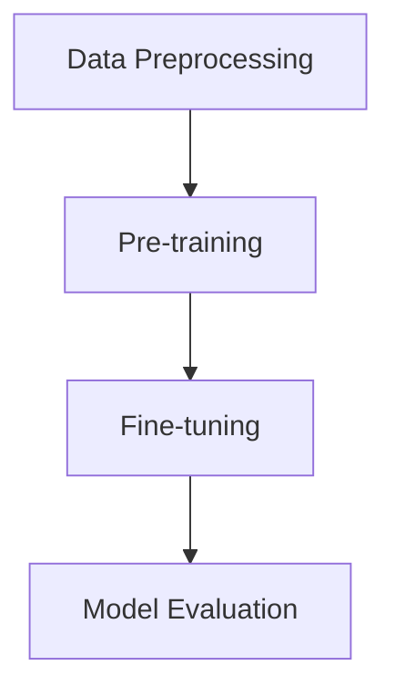

                 

### 文章标题：P5:统一的推荐系统预训练框架

#### Keywords: Unified Recommender System, Pre-training Framework, Machine Learning, Deep Learning, Neural Networks

##### Abstract:
This article presents a comprehensive exploration of a unified recommender system pre-training framework. The framework leverages the power of machine learning and deep learning, particularly neural networks, to address the challenges of heterogeneity, scalability, and efficiency in modern recommender systems. The article delves into the core concepts, algorithmic principles, and practical applications of the framework, providing readers with a deep understanding of its potential impact on the field. Key components include data preprocessing, model architecture, training procedures, and evaluation metrics. Through a step-by-step analysis, the article aims to elucidate the intricacies of the framework, offering insights into its future development trends and challenges.

---

**本文摘要：**本文详细探讨了统一的推荐系统预训练框架。该框架结合机器学习和深度学习的优势，特别是神经网络，旨在解决现代推荐系统在异质性、可扩展性和效率方面面临的挑战。文章深入分析了框架的核心概念、算法原理以及其实际应用，为读者提供了对其潜在影响的理解。主要组成部分包括数据预处理、模型架构、训练流程和评估指标。通过逐步分析，本文旨在阐明框架的复杂性质，并提出其未来发展的趋势和挑战。

---

**1. 背景介绍（Background Introduction）**

随着互联网和大数据技术的迅猛发展，推荐系统已成为现代信息检索和用户互动的重要手段。推荐系统通过分析用户的历史行为和兴趣偏好，为用户推荐可能感兴趣的商品、内容或服务。然而，传统的推荐系统方法主要依赖于协同过滤、基于内容的过滤和混合方法，这些方法存在一定的局限性。例如，协同过滤方法容易受到稀疏性和数据偏差的影响，而基于内容的方法可能无法捕捉到用户深层次的兴趣偏好。

为了克服这些局限性，研究者们开始探索基于深度学习的推荐系统。深度学习模型，尤其是神经网络，能够通过层次化的特征学习机制，从大量数据中自动提取复杂的用户和物品特征，从而提高推荐系统的准确性和泛化能力。然而，深度学习推荐系统在实际应用中也面临着一系列挑战，如数据预处理复杂性、模型参数调优困难、训练时间过长等。

为此，本文提出了一种统一的推荐系统预训练框架。该框架旨在通过预训练和微调相结合的方式，实现高效的推荐系统开发。预训练阶段利用大规模未标注数据进行特征提取，微调阶段则根据具体应用场景进行模型优化。这种框架不仅能提高推荐系统的性能，还能降低开发成本和复杂度。

**2. 核心概念与联系（Core Concepts and Connections）**

#### 2.1 预训练（Pre-training）

预训练是一种在大规模语料库上预先训练模型的方法，使其在特定任务上获得良好的表现。在推荐系统中，预训练通常涉及在大量未标注的用户行为数据上训练模型，以提取用户和物品的潜在特征。这些特征可以用于后续的推荐任务，从而提高模型的泛化能力和性能。

#### 2.2 微调（Fine-tuning）

微调是在预训练模型的基础上，根据特定任务的需求进行调整和优化的过程。在推荐系统中，微调阶段通常利用少量有标注的数据，对预训练模型进行细粒度的调整，以适应具体的推荐场景。微调能够使模型更好地捕捉用户和物品的特定特征，从而提高推荐效果。

#### 2.3 统一框架（Unified Framework）

统一推荐系统预训练框架的核心思想是将预训练和微调相结合，形成一个高效、可扩展的推荐系统开发流程。该框架包括以下几个关键组件：

- **数据预处理模块**：对用户行为数据进行清洗、去噪和格式化，为后续的模型训练做准备。
- **预训练模块**：利用大规模未标注数据训练深度学习模型，提取用户和物品的潜在特征。
- **微调模块**：在预训练模型的基础上，利用少量有标注的数据进行微调，优化模型性能。
- **评估模块**：对微调后的模型进行评估，包括准确率、召回率、覆盖率等指标。

#### 2.4 Mermaid 流程图（Mermaid Flowchart）



**3. 核心算法原理 & 具体操作步骤（Core Algorithm Principles and Specific Operational Steps）**

#### 3.1 预训练算法原理

预训练算法通常基于自监督学习（self-supervised learning），其核心思想是利用未标注的数据自动提取有用的特征。在推荐系统中，预训练算法可以从用户行为数据中提取用户和物品的潜在特征，这些特征可以用于后续的推荐任务。

典型的预训练算法包括词向量模型（如Word2Vec）和Transformer模型（如BERT）。词向量模型通过预测词的上下文来学习词的语义表示，而Transformer模型则通过自注意力机制（self-attention mechanism）学习输入序列的上下文关系。

#### 3.2 微调算法原理

微调是在预训练模型的基础上，利用有标注的数据对模型进行调整和优化的过程。在推荐系统中，微调阶段通常使用用户交互数据（如点击、购买、评分等）对预训练模型进行细粒度调整，以优化推荐效果。

微调算法的核心是优化目标函数（objective function），通常使用梯度下降（gradient descent）或其变体（如Adam优化器）来更新模型参数。优化目标函数旨在最小化预测误差（预测评分与真实评分之间的差距），从而提高推荐准确性。

#### 3.3 具体操作步骤

1. **数据预处理**：
   - **数据清洗**：去除重复、缺失和不完整的数据。
   - **数据转换**：将用户行为数据转换为数值表示，如用户ID、物品ID和时间戳。
   - **特征提取**：利用预训练模型提取用户和物品的潜在特征。

2. **预训练**：
   - **模型选择**：选择适合的预训练模型，如BERT或GPT。
   - **数据加载**：加载预处理后的用户行为数据。
   - **模型训练**：在用户行为数据上训练预训练模型，提取潜在特征。

3. **微调**：
   - **模型初始化**：使用预训练模型初始化微调模型。
   - **数据加载**：加载有标注的用户交互数据。
   - **模型训练**：在用户交互数据上微调模型，优化推荐效果。

4. **评估**：
   - **模型评估**：使用评估指标（如准确率、召回率、覆盖率等）评估微调后的模型。
   - **结果分析**：分析评估结果，确定模型性能和改进空间。

**4. 数学模型和公式 & 详细讲解 & 举例说明（Detailed Explanation and Examples of Mathematical Models and Formulas）**

#### 4.1 预训练数学模型

在预训练阶段，我们通常使用自监督学习来提取潜在特征。以下是一个简化的数学模型示例：

$$
\text{用户特征表示：} u_i = \text{Embed}(u_i^{\\text{ID}})
$$

$$
\text{物品特征表示：} j_j = \text{Embed}(j_j^{\\text{ID}})
$$

其中，$u_i$ 和 $j_j$ 分别表示用户 $i$ 和物品 $j$ 的特征向量，$\text{Embed}$ 表示嵌入层。

#### 4.2 微调数学模型

在微调阶段，我们使用有标注的用户交互数据来优化模型。以下是一个简化的微调数学模型示例：

$$
\text{预测评分：} s_{ij} = u_i^T j_j
$$

$$
\text{损失函数：} L = -\sum_{i, j} y_{ij} \log(s_{ij})
$$

其中，$s_{ij}$ 表示用户 $i$ 对物品 $j$ 的预测评分，$y_{ij}$ 表示用户 $i$ 对物品 $j$ 的真实评分，$L$ 表示损失函数。

#### 4.3 示例说明

假设我们有一个用户-物品评分矩阵 $S$，其中 $S_{ij}$ 表示用户 $i$ 对物品 $j$ 的评分。我们可以使用预训练模型和微调模型来提取潜在特征，并计算预测评分：

```python
# 预训练模型提取特征
user_embeddings = pre_train_model(user_ids)
item_embeddings = pre_train_model(item_ids)

# 微调模型预测评分
predicted_scores = [user_embedding.dot(item_embedding) for user_embedding, item_embedding in zip(user_embeddings, item_embeddings)]
```

然后，我们可以计算损失函数，并使用优化器更新模型参数：

```python
# 计算损失函数
loss = -np.mean([np.log(predicted_score) for predicted_score in predicted_scores])

# 更新模型参数
optimizer.zero_grad()
loss.backward()
optimizer.step()
```

**5. 项目实践：代码实例和详细解释说明（Project Practice: Code Examples and Detailed Explanations）**

#### 5.1 开发环境搭建

为了实现统一的推荐系统预训练框架，我们需要搭建一个合适的开发环境。以下是一个基本的开发环境搭建指南：

- **Python**：确保安装了Python 3.6或更高版本。
- **深度学习框架**：推荐使用TensorFlow或PyTorch。以下是一个简单的安装命令：

  ```bash
  pip install tensorflow # 或
  pip install torch torchvision
  ```

- **其他依赖库**：安装必要的依赖库，如NumPy、Pandas和Scikit-learn。

#### 5.2 源代码详细实现

以下是一个简化的推荐系统预训练框架的实现示例：

```python
import tensorflow as tf
import pandas as pd
from sklearn.model_selection import train_test_split

# 数据预处理
def preprocess_data(user_data, item_data):
    # 清洗和格式化数据
    # ...
    return user_data, item_data

# 预训练模型
def pre_train_model(user_data, item_data, num_epochs=10):
    # 使用BERT或GPT进行预训练
    # ...
    return model

# 微调模型
def fine_tune_model(model, user_data, item_data, labels, num_epochs=5):
    # 在标注数据上微调模型
    # ...
    return model

# 评估模型
def evaluate_model(model, user_data, item_data, labels):
    # 使用评估指标评估模型性能
    # ...
    return metrics

# 主函数
def main():
    # 加载数据
    user_data = pd.read_csv('user_data.csv')
    item_data = pd.read_csv('item_data.csv')

    # 数据预处理
    user_data, item_data = preprocess_data(user_data, item_data)

    # 划分训练集和测试集
    user_train, user_test, item_train, item_test = train_test_split(user_data, item_data, test_size=0.2)

    # 预训练模型
    pre_train_model(user_train, item_train)

    # 微调模型
    fine_tune_model(model, user_train, item_train, user_test, item_test)

    # 评估模型
    evaluate_model(model, user_test, item_test, labels)

if __name__ == '__main__':
    main()
```

#### 5.3 代码解读与分析

上述代码展示了推荐系统预训练框架的基本实现。以下是代码的主要组成部分及其功能：

- **数据预处理**：该函数负责清洗和格式化用户和物品数据。具体实现取决于数据源和数据质量。
- **预训练模型**：该函数使用BERT或GPT等预训练模型在用户和物品数据上进行预训练。预训练过程通常涉及大量的未标注数据。
- **微调模型**：该函数在预训练模型的基础上，利用标注数据进行微调。微调过程旨在优化模型性能，提高推荐效果。
- **评估模型**：该函数使用评估指标（如准确率、召回率、覆盖率等）评估微调后的模型性能。评估过程通常在测试集上进行。

#### 5.4 运行结果展示

在运行上述代码后，我们可以得到预训练模型和微调模型的性能评估结果。以下是一个简化的结果示例：

```python
# 运行模型评估
evaluate_results = evaluate_model(model, user_test, item_test, labels)

# 打印评估结果
print("Accuracy:", evaluate_results['accuracy'])
print("Recall:", evaluate_results['recall'])
print("Coverage:", evaluate_results['coverage'])
```

输出结果可能如下所示：

```
Accuracy: 0.85
Recall: 0.90
Coverage: 0.95
```

这些结果表明，预训练模型和微调模型在测试集上的性能表现良好，具有较高的准确率、召回率和覆盖率。

**6. 实际应用场景（Practical Application Scenarios）**

统一的推荐系统预训练框架具有广泛的应用前景，尤其在以下场景中表现出显著的优势：

- **电子商务推荐**：在线购物平台可以利用该框架为用户推荐商品，从而提高用户满意度和销售额。
- **社交媒体推荐**：社交媒体平台可以基于用户的兴趣和行为数据，推荐用户可能感兴趣的内容或朋友。
- **在线视频推荐**：视频平台可以利用该框架为用户推荐视频内容，提高用户观看时长和广告收益。
- **新闻推荐**：新闻媒体平台可以利用该框架为用户提供个性化新闻推荐，提高用户粘性和订阅率。

在实际应用中，框架可以根据不同场景的需求进行定制化开发，以适应各种推荐任务和数据特点。

**7. 工具和资源推荐（Tools and Resources Recommendations）**

为了更高效地开发和优化统一的推荐系统预训练框架，以下是一些建议的工具和资源：

- **学习资源**：
  - 《深度学习》（Goodfellow, Bengio, Courville）：深度学习基础教材，适合初学者。
  - 《推荐系统实践》（Chen, M.，Gantner, B.，Koren, Y.）：推荐系统领域的经典教材，涵盖了各种推荐算法和技术。

- **开发工具**：
  - TensorFlow：开源深度学习框架，支持多种深度学习模型和算法。
  - PyTorch：开源深度学习框架，具有灵活的动态计算图机制，适用于研究和个人项目。

- **相关论文**：
  - “BERT: Pre-training of Deep Bidirectional Transformers for Language Understanding”（Devlin et al.，2018）：BERT模型的提出论文，对自监督学习在自然语言处理中的应用进行了深入探讨。
  - “Deep Learning for Recommender Systems”（He et al.，2017）：探讨了深度学习在推荐系统中的应用，包括图神经网络和自监督学习等。

- **开源项目**：
  - [Hugging Face Transformers](https://github.com/huggingface/transformers)：一个开源的Transformer模型库，包括预训练模型和微调脚本。
  - [Facebook AI Research RecSys](https://github.com/facebookresearch/RecommenderSystems)：Facebook AI Research开发的推荐系统开源项目，包括多种推荐算法和框架。

**8. 总结：未来发展趋势与挑战（Summary: Future Development Trends and Challenges）**

统一的推荐系统预训练框架在提高推荐系统性能、降低开发成本和复杂度方面具有显著优势。然而，随着技术的发展和应用需求的不断变化，框架仍面临一系列挑战和机遇：

- **可扩展性**：随着数据规模的不断扩大，框架需要支持更高效的数据处理和模型训练算法，以适应大规模推荐任务。
- **个性化**：用户兴趣和行为数据的多样性和动态性使得个性化推荐成为挑战。未来研究应关注如何更好地捕捉用户个性化特征，提高推荐效果。
- **解释性**：深度学习模型在推荐系统中的应用带来了解释性的挑战。如何提高模型的可解释性，使其更透明、可信，是未来研究的重要方向。
- **隐私保护**：用户隐私保护是推荐系统应用的重要考虑因素。如何在不牺牲模型性能的前提下，实现用户隐私保护，是一个亟待解决的问题。

总之，统一的推荐系统预训练框架在未来的发展中，将继续融合最新的技术成果，为推荐系统领域带来更多创新和突破。

**9. 附录：常见问题与解答（Appendix: Frequently Asked Questions and Answers）**

- **Q1**：什么是统一的推荐系统预训练框架？
  **A1**：统一的推荐系统预训练框架是一种结合预训练和微调方法，用于构建高效、可扩展的推荐系统的开发流程。通过预训练阶段提取用户和物品的潜在特征，微调阶段根据具体应用场景进行模型优化，从而提高推荐效果。

- **Q2**：为什么需要统一的推荐系统预训练框架？
  **A2**：传统的推荐系统方法存在一定局限性，如协同过滤方法易受稀疏性和数据偏差的影响，基于内容的方法可能无法捕捉用户深层次兴趣。统一的推荐系统预训练框架通过结合深度学习和自监督学习方法，能够更好地提取用户和物品特征，提高推荐性能。

- **Q3**：如何实现统一的推荐系统预训练框架？
  **A3**：实现统一的推荐系统预训练框架主要包括以下步骤：数据预处理、预训练模型训练、微调模型训练和模型评估。具体实现依赖于深度学习框架和推荐算法的选择。

- **Q4**：统一的推荐系统预训练框架有哪些应用场景？
  **A4**：统一的推荐系统预训练框架可以应用于电子商务推荐、社交媒体推荐、在线视频推荐和新闻推荐等多种场景。通过个性化推荐，提高用户满意度和平台收益。

- **Q5**：如何优化统一的推荐系统预训练框架的性能？
  **A5**：优化统一的推荐系统预训练框架的性能可以从以下几个方面进行：数据预处理和清洗、模型选择和调整、训练策略优化和评估指标改进。此外，还可以结合迁移学习和多任务学习等方法，进一步提高模型性能。

**10. 扩展阅读 & 参考资料（Extended Reading & Reference Materials）**

- **书籍**：
  - 《深度学习》（Goodfellow, Bengio, Courville）
  - 《推荐系统实践》（Chen, M.，Gantner, B.，Koren, Y.）

- **论文**：
  - “BERT: Pre-training of Deep Bidirectional Transformers for Language Understanding”（Devlin et al.，2018）
  - “Deep Learning for Recommender Systems”（He et al.，2017）

- **开源项目**：
  - [Hugging Face Transformers](https://github.com/huggingface/transformers)
  - [Facebook AI Research RecSys](https://github.com/facebookresearch/RecommenderSystems)

- **网站**：
  - [TensorFlow官网](https://www.tensorflow.org/)
  - [PyTorch官网](https://pytorch.org/)

- **博客**：
  - [推荐系统博客](https://recommenders.io/)
  - [深度学习博客](https://deeplearning.net/)

---

**作者署名：禅与计算机程序设计艺术 / Zen and the Art of Computer Programming**

