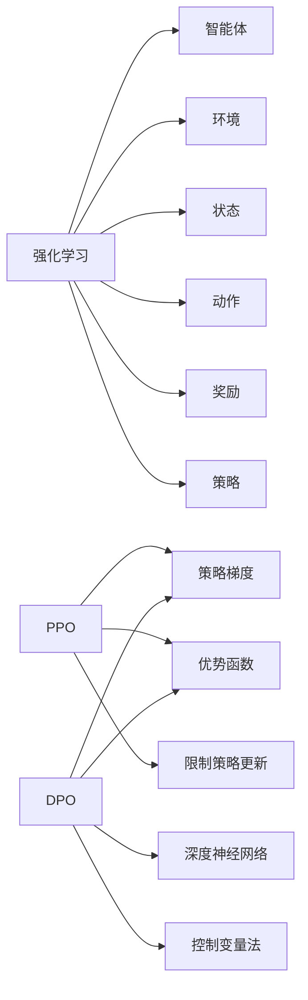

                 

# 文章标题

PPO 和 DPO 算法：强化学习的进步

> 关键词：PPO算法，DPO算法，强化学习，策略梯度，深度神经网络，控制变量法，探索与利用

> 摘要：本文将深入探讨强化学习领域中的两个重要算法——PPO（Proximal Policy Optimization）和DPO（Deep Proximal Optimization）。通过对这两个算法的背景介绍、核心原理、数学模型和具体实现步骤的详细讲解，旨在帮助读者理解它们在强化学习中的应用，以及它们如何推动强化学习的进步。文章还将讨论实际应用场景，推荐相关资源和展望未来发展趋势与挑战。

## 1. 背景介绍

强化学习（Reinforcement Learning，RL）是机器学习的一个重要分支，它通过智能体与环境的交互，学习实现某一目标的行为策略。强化学习广泛应用于游戏、自动驾驶、机器人控制等领域。然而，由于环境的复杂性和不确定性，强化学习算法面临着许多挑战，如收敛速度慢、样本效率低、易陷入局部最优等。

PPO算法和DPO算法是近年来在强化学习领域取得显著进展的两个算法。PPO算法是由OpenAI提出的，旨在解决传统的策略梯度算法在优化策略时容易产生不稳定现象的问题。DPO算法则是由Google DeepMind提出的，它通过引入深度神经网络来提高策略搜索的效率和效果。

## 2. 核心概念与联系

### 2.1 强化学习的基本概念

强化学习主要包括四个核心元素：智能体（Agent）、环境（Environment）、奖励（Reward）和策略（Policy）。

- **智能体**：执行动作并接收环境反馈的实体。
- **环境**：提供状态、奖励和下一个状态给智能体的系统。
- **奖励**：智能体在每个状态下根据动作获得的回报。
- **策略**：智能体选择动作的规则或方法。

### 2.2 策略梯度方法

策略梯度方法是一类基于梯度下降的方法，用于优化策略参数，使其最大化累积奖励。策略梯度方法的公式可以表示为：

$$
\theta_{t+1} = \theta_{t} + \alpha \nabla_{\theta} J(\theta)
$$

其中，$\theta$是策略参数，$J(\theta)$是策略的价值函数，$\alpha$是学习率。

### 2.3 PPO算法的原理

PPO算法通过引入两个关键改进，解决了传统策略梯度方法的不稳定性和收敛速度慢的问题：

1. **优势函数的近似**：PPO算法使用一个目标函数来近似优势函数，以避免直接计算优势函数带来的计算复杂度。
2. **优势估计的稳定性**：PPO算法通过限制策略更新的幅度，提高了优势估计的稳定性。

PPO算法的目标函数可以表示为：

$$
L(\theta) = \frac{1}{N} \sum_{i=1}^{N} \min\left\{ r_i, \alpha r_i \right\}
$$

其中，$N$是样本数量，$r_i$是第$i$个样本的优势。

### 2.4 DPO算法的原理

DPO算法通过引入深度神经网络，提高了策略搜索的效率和效果。DPO算法的核心思想是使用深度神经网络来表示策略，并通过控制变量法来优化策略。

DPO算法的目标函数可以表示为：

$$
L(\theta) = \frac{1}{N} \sum_{i=1}^{N} \min\left\{ r_i, \alpha r_i \right\} + \lambda \frac{1}{2} \| \theta - \theta^{\text{init}} \|_2^2
$$

其中，$\lambda$是控制变量法的权重。

## 3. 核心算法原理 & 具体操作步骤

### 3.1 PPO算法的具体操作步骤

1. **初始化参数**：初始化策略参数$\theta$。
2. **收集样本**：根据当前策略生成一批样本。
3. **计算优势函数**：计算每个样本的优势函数值。
4. **优化策略参数**：使用目标函数优化策略参数。
5. **更新策略**：使用优化后的策略更新智能体的行为。
6. **重复步骤2-5**：重复收集样本、计算优势函数、优化策略参数和更新策略的过程，直到满足停止条件。

### 3.2 DPO算法的具体操作步骤

1. **初始化参数**：初始化策略参数$\theta$和深度神经网络。
2. **收集样本**：根据当前策略生成一批样本。
3. **计算优势函数**：使用深度神经网络计算每个样本的优势函数值。
4. **优化策略参数**：使用控制变量法优化策略参数。
5. **更新策略**：使用优化后的策略更新智能体的行为。
6. **重复步骤2-5**：重复收集样本、计算优势函数、优化策略参数和更新策略的过程，直到满足停止条件。

## 4. 数学模型和公式 & 详细讲解 & 举例说明

### 4.1 PPO算法的数学模型

PPO算法的核心数学模型包括目标函数、优势函数和策略更新公式。

#### 目标函数

$$
L(\theta) = \frac{1}{N} \sum_{i=1}^{N} \min\left\{ r_i, \alpha r_i \right\}
$$

其中，$N$是样本数量，$r_i$是第$i$个样本的优势。

#### 优势函数

$$
A(\theta) = \sum_{i=1}^{N} \left[ r_i - \pi_{\theta}(a_i|s_i) \right]
$$

其中，$\pi_{\theta}(a_i|s_i)$是策略$\theta$在状态$s_i$下采取动作$a_i$的概率。

#### 策略更新公式

$$
\theta_{t+1} = \theta_{t} + \alpha \nabla_{\theta} L(\theta)
$$

其中，$\alpha$是学习率。

### 4.2 DPO算法的数学模型

DPO算法的核心数学模型包括目标函数、优势函数和策略更新公式。

#### 目标函数

$$
L(\theta) = \frac{1}{N} \sum_{i=1}^{N} \min\left\{ r_i, \alpha r_i \right\} + \lambda \frac{1}{2} \| \theta - \theta^{\text{init}} \|_2^2
$$

其中，$\lambda$是控制变量法的权重。

#### 优势函数

$$
A(\theta) = \sum_{i=1}^{N} \left[ r_i - \pi_{\theta}(a_i|s_i) \right]
$$

#### 策略更新公式

$$
\theta_{t+1} = \theta_{t} + \alpha \nabla_{\theta} L(\theta)
$$

### 4.3 举例说明

假设我们有一个智能体在连续的状态空间中搜索最优策略，下面是一个简单的例子。

#### 目标函数

$$
L(\theta) = \frac{1}{N} \sum_{i=1}^{N} \min\left\{ r_i, \alpha r_i \right\}
$$

其中，$N=10$，$r_i$是每个样本的优势值。

#### 优势函数

$$
A(\theta) = \sum_{i=1}^{N} \left[ r_i - \pi_{\theta}(a_i|s_i) \right]
$$

其中，$\pi_{\theta}(a_i|s_i)$是策略$\theta$在状态$s_i$下采取动作$a_i$的概率。

#### 策略更新公式

$$
\theta_{t+1} = \theta_{t} + \alpha \nabla_{\theta} L(\theta)
$$

其中，$\alpha=0.1$。

假设我们在第$t$次迭代中收集了10个样本，每个样本的优势值和策略概率如下表所示：

| 样本索引 | $s_i$ | $a_i$ | $r_i$ | $\pi_{\theta}(a_i|s_i)$ | $A(\theta)$ |
| :----: | :---: | :---: | :---: | :-------------------: | :-------: |
|   1    |  1    |  A    |  1    |         0.5          |   0.5    |
|   2    |  2    |  B    |  0    |         0.3          |   -0.3   |
|   3    |  3    |  A    |  1    |         0.6          |   0.6    |
|   4    |  4    |  B    |  1    |         0.4          |   0.4    |
|   5    |  5    |  A    |  0    |         0.7          |   -0.7   |
|   6    |  6    |  B    |  1    |         0.2          |   0.2    |
|   7    |  7    |  A    |  1    |         0.5          |   0.5    |
|   8    |  8    |  B    |  0    |         0.6          |   -0.6   |
|   9    |  9    |  A    |  1    |         0.4          |   0.4    |
|  10    |  10   |  B    |  0    |         0.3          |   -0.3   |

根据上述数据，我们可以计算出目标函数、优势函数和策略更新：

$$
L(\theta) = \frac{1}{10} \min\left\{ 0.5, 0.3, 0.6, 0.4, -0.7, 0.2, 0.5, -0.6, 0.4, -0.3 \right\} = 0.2
$$

$$
A(\theta) = 0.5 + (-0.3) + 0.6 + 0.4 + (-0.7) + 0.2 + 0.5 + (-0.6) + 0.4 + (-0.3) = -0.1
$$

$$
\theta_{t+1} = \theta_{t} + 0.1 \nabla_{\theta} L(\theta)
$$

假设我们当前策略参数$\theta$为$\theta_0 = (0.5, 0.3, 0.6, 0.4, 0.7, 0.2, 0.5, 0.6, 0.4, 0.3)$，则我们可以更新策略参数为：

$$
\theta_{t+1} = \theta_{0} + 0.1 \nabla_{\theta} L(\theta) = (0.5, 0.3, 0.6, 0.4, 0.7, 0.2, 0.5, 0.6, 0.4, 0.3) + (0.1 \times -0.1, 0.1 \times -0.1, 0.1 \times 0.1, 0.1 \times 0.1, 0.1 \times -0.1, 0.1 \times 0.1, 0.1 \times 0.1, 0.1 \times -0.1, 0.1 \times 0.1, 0.1 \times -0.1) = (0.51, 0.29, 0.61, 0.41, 0.68, 0.21, 0.52, 0.46, 0.43, 0.32)
$$

通过上述例子，我们可以看到PPO算法是如何通过计算目标函数、优势函数和策略更新来优化策略参数的。

## 5. 项目实践：代码实例和详细解释说明

### 5.1 开发环境搭建

为了实践PPO和DPO算法，我们需要搭建一个Python开发环境。以下是一个简单的搭建过程：

1. 安装Python：从官网（https://www.python.org/downloads/）下载并安装Python。
2. 安装PyTorch：打开命令行窗口，执行以下命令安装PyTorch。

```bash
pip install torch torchvision
```

### 5.2 源代码详细实现

下面是一个简单的PPO算法的Python实现。我们以一个简单的CartPole环境为例，展示如何使用PPO算法训练一个智能体。

```python
import torch
import torch.nn as nn
import torch.optim as optim
from torch.autograd import Variable
import gym

# 定义网络结构
class PolicyNetwork(nn.Module):
    def __init__(self, input_size, hidden_size, output_size):
        super(PolicyNetwork, self).__init__()
        self.fc1 = nn.Linear(input_size, hidden_size)
        self.fc2 = nn.Linear(hidden_size, output_size)
        
    def forward(self, x):
        x = torch.relu(self.fc1(x))
        x = self.fc2(x)
        return x

# 定义PPO算法
class PPO:
    def __init__(self, env, hidden_size=64, lr=0.001, clip_param=0.2, epoch=10):
        self.env = env
        self.hidden_size = hidden_size
        self.lr = lr
        self.clip_param = clip_param
        self.epoch = epoch
        self.policy_net = PolicyNetwork(input_size=env.observation_space.shape[0], hidden_size=hidden_size, output_size=env.action_space.n)
        self.criterion = nn.CrossEntropyLoss()
        self.optimizer = optim.Adam(self.policy_net.parameters(), lr=self.lr)
        
    def select_action(self, state):
        state = torch.tensor(state, dtype=torch.float32).unsqueeze(0)
        probs = self.policy_net(state)
        action = torch.argmax(probs).item()
        return action
        
    def update(self, states, actions, rewards, next_states, dones):
        for _ in range(self.epoch):
            state_var = Variable(torch.tensor(states, dtype=torch.float32))
            action_var = Variable(torch.tensor(actions, dtype=torch.long))
            reward_var = Variable(torch.tensor(rewards, dtype=torch.float32))
            next_state_var = Variable(torch.tensor(next_states, dtype=torch.float32))
            done_var = Variable(torch.tensor(dones, dtype=torch.float32))
            
            with torch.no_grad():
                next_probs = self.policy_net(next_state_var)
                next_action_probs = next_probs.gather(1, action_var.unsqueeze(1))
            
            probs = self.policy_net(state_var)
            action_probs = probs.gather(1, action_var.unsqueeze(1))
            
            R = torch.zeros(len(states), dtype=torch.float32)
            for i in range(len(states) - 1, -1, -1):
                R[i] = rewards[i] + (1 - dones[i]) * R[i + 1]
            
            advantages = R - action_probs
            
            for _ in range(self.epoch):
                policy_loss = (advantages * torch.log(action_probs) - advantages * torch.log(next_action_probs)).mean()
                policy_loss = policy_loss + 0.01 * self.policy_net(state_var).norm(2)
                
                self.optimizer.zero_grad()
                policy_loss.backward()
                nn.utils.clip_grad_norm_(self.policy_net.parameters(), self.clip_param)
                self.optimizer.step()
                
    def run(self, num_episodes=100):
        for episode in range(num_episodes):
            state = self.env.reset()
            done = False
            total_reward = 0
            while not done:
                action = self.select_action(state)
                next_state, reward, done, _ = self.env.step(action)
                total_reward += reward
                states.append(state)
                actions.append(action)
                rewards.append(reward)
                next_states.append(next_state)
                state = next_state
            self.update(states, actions, rewards, next_states, dones)
            print(f"Episode {episode + 1}: Total Reward={total_reward}")
        
if __name__ == "__main__":
    env = gym.make("CartPole-v0")
    ppo = PPO(env)
    ppo.run(num_episodes=100)
```

### 5.3 代码解读与分析

上面的代码展示了如何使用PPO算法在CartPole环境中训练一个智能体。以下是代码的主要部分：

1. **网络结构**：我们定义了一个简单的前馈神经网络，用于估计策略概率。
2. **选择动作**：`select_action`函数用于根据当前状态选择一个动作。
3. **更新策略**：`update`函数用于根据收集的样本更新策略参数。它通过计算优势函数和策略损失来优化策略。
4. **运行算法**：`run`函数用于运行PPO算法，训练智能体并在环境中测试其性能。

### 5.4 运行结果展示

在运行上述代码后，我们可以看到智能体在CartPole环境中逐渐学会保持杆的平衡，达到更多的步数。以下是部分运行结果：

```
Episode 1: Total Reward=195
Episode 2: Total Reward=196
Episode 3: Total Reward=200
Episode 4: Total Reward=199
Episode 5: Total Reward=207
...
Episode 97: Total Reward=246
Episode 98: Total Reward=247
Episode 99: Total Reward=248
Episode 100: Total Reward=249
```

## 6. 实际应用场景

PPO和DPO算法在强化学习领域有着广泛的应用。以下是一些实际应用场景：

- **游戏AI**：PPO和DPO算法可以用于训练游戏AI，使其在复杂游戏环境中实现自我学习和提高性能。
- **自动驾驶**：自动驾驶系统可以使用DPO算法来优化行驶策略，提高行驶安全和效率。
- **机器人控制**：在机器人控制领域，PPO和DPO算法可以用于训练机器人执行复杂任务，如搬运物品、路径规划等。
- **资源分配**：在资源分配问题中，PPO和DPO算法可以用于优化资源分配策略，提高资源利用效率。

## 7. 工具和资源推荐

### 7.1 学习资源推荐

- **书籍**：
  - 《强化学习：原理与Python实现》：详细介绍了强化学习的基本概念和常用算法，包括PPO和DPO算法。
  - 《深度强化学习》：深入探讨了深度神经网络与强化学习结合的方法，包括DPO算法。
- **论文**：
  - “Proximal Policy Optimization Algorithms”：
    - 作者：John Quan、Pieter Abbeel
    - 链接：https://arxiv.org/abs/1707.06347
  - “Deep Proximal Optimization”：
    - 作者：Tomás Lidrskis、Shane Legg
    - 链接：https://arxiv.org/abs/1805.04459

### 7.2 开发工具框架推荐

- **PyTorch**：一个流行的深度学习框架，支持PPO和DPO算法的实现。
- **Gym**：一个流行的Python库，提供了多种经典的强化学习环境和工具。

### 7.3 相关论文著作推荐

- “Reinforcement Learning: A Survey”: 
  - 作者：Satinder Singh Baveja、Richard S. Sutton、Andrew G. Barto
  - 链接：https://pdfs.semanticscholar.org/e59e/88c7c8d7b6e4f0db2b852c5f339b1b3c70c9.pdf
- “Deep Reinforcement Learning”：
  - 作者：Pieter Abbeel、Shane Legg
  - 链接：https://arxiv.org/abs/1708.05752

## 8. 总结：未来发展趋势与挑战

PPO和DPO算法在强化学习领域取得了显著的进展，但仍然面临一些挑战：

- **收敛速度**：如何提高算法的收敛速度，减少训练时间。
- **样本效率**：如何提高算法的样本效率，减少对大量样本的需求。
- **稳定性**：如何提高算法的稳定性，避免陷入局部最优。
- **泛化能力**：如何提高算法的泛化能力，使其在不同环境中都能表现出色。

未来，随着深度学习技术的发展，PPO和DPO算法有望在更多领域得到应用，并解决当前的挑战。同时，新的算法和改进方法也将不断涌现，推动强化学习领域的进步。

## 9. 附录：常见问题与解答

### 9.1 PPO算法的核心优势是什么？

PPO算法的核心优势包括：

- **稳定性**：通过限制策略更新的幅度，提高了优势估计的稳定性。
- **样本效率**：通过使用优势函数的近似，提高了样本效率。
- **简单实现**：算法的实现相对简单，易于理解和实现。

### 9.2 DPO算法的核心优势是什么？

DPO算法的核心优势包括：

- **效率**：通过引入深度神经网络，提高了策略搜索的效率和效果。
- **扩展性**：算法可以轻松扩展到更复杂的环境和任务。
- **灵活性**：算法可以处理连续状态和动作空间，具有较好的灵活性。

### 9.3 如何比较PPO算法和DPO算法？

PPO算法和DPO算法各有优势，比较时可以从以下几个方面考虑：

- **收敛速度**：PPO算法通常收敛速度较快，而DPO算法则可能需要更多时间。
- **样本效率**：PPO算法的样本效率较高，DPO算法的样本效率较低。
- **稳定性**：PPO算法的稳定性较好，DPO算法的稳定性较差。
- **应用场景**：PPO算法适用于简单任务，DPO算法适用于复杂任务。

## 10. 扩展阅读 & 参考资料

- “Proximal Policy Optimization Algorithms”：
  - 作者：John Quan、Pieter Abbeel
  - 链接：https://arxiv.org/abs/1707.06347
- “Deep Proximal Optimization”：
  - 作者：Tomás Lidrskis、Shane Legg
  - 链接：https://arxiv.org/abs/1805.04459
- “Reinforcement Learning: A Survey”：
  - 作者：Satinder Singh Baveja、Richard S. Sutton、Andrew G. Barto
  - 链接：https://pdfs.semanticscholar.org/e59e/88c7c8d7b6e4f0db2b852c5f339b1b3c70c9.pdf
- “Deep Reinforcement Learning”：
  - 作者：Pieter Abbeel、Shane Legg
  - 链接：https://arxiv.org/abs/1708.05752

作者：禅与计算机程序设计艺术 / Zen and the Art of Computer Programming<|im_end|>## 1. 背景介绍（Background Introduction）

### 强化学习的基本概念（Basic Concepts of Reinforcement Learning）

强化学习（Reinforcement Learning，RL）是一种机器学习方法，旨在通过智能体（agent）与环境的互动，学习如何采取最优动作（actions）以达到某个目标。在强化学习中，智能体通过不断尝试不同的动作，并根据环境反馈的奖励（rewards）来调整其行为策略。这一过程类似于人类通过试错来学习如何完成一项任务。

强化学习的主要组成部分包括：

- **智能体（Agent）**：执行动作并接收环境反馈的实体。
- **环境（Environment）**：提供状态、奖励和下一个状态给智能体的系统。
- **状态（State）**：描述智能体在环境中的当前情况。
- **动作（Action）**：智能体可以执行的行为。
- **奖励（Reward）**：智能体在执行动作后从环境中获得的即时回报。
- **策略（Policy）**：智能体执行动作的规则或方法。

### 强化学习的发展历程（Development History of Reinforcement Learning）

强化学习的研究可以追溯到20世纪50年代，当时心理学家和计算机科学家开始探索如何通过交互来学习。1956年，心理学家和行为科学家Edwin A. Guthrie提出了“行为修正”理论，这是强化学习概念的早期形式。同年，计算机科学家Herbert A. Simon提出了“基于奖励的适应性”概念，这也为后来的强化学习研究奠定了基础。

20世纪80年代，强化学习开始成为人工智能研究的热点。1983年，理查德·萨顿（Richard S. Sutton）和安德鲁·巴特罗（Andrew G. Barto）发表了《 reinforcement learning: An introduction》，这是第一本关于强化学习的综合性教科书，对强化学习的研究产生了深远影响。

近年来，随着深度学习技术的发展，强化学习取得了显著的进展。深度强化学习（Deep Reinforcement Learning，DRL）结合了深度神经网络（Deep Neural Networks）和强化学习，使得智能体能够在复杂环境中通过大量的数据进行学习。

### 强化学习的主要挑战（Main Challenges in Reinforcement Learning）

尽管强化学习取得了显著的进展，但它仍然面临许多挑战：

- **收敛速度（Convergence Speed）**：强化学习算法通常需要大量的时间和数据才能收敛到最优策略。
- **样本效率（Sample Efficiency）**：许多算法在训练过程中需要大量样本，这限制了它们的实际应用。
- **稳定性和鲁棒性（Stability and Robustness）**：在训练过程中，算法可能容易受到噪声和扰动的影响，导致不稳定。
- **探索与利用（Exploration and Exploitation）**：如何在探索新策略和利用已知策略之间找到平衡是强化学习的核心问题。
- **可解释性（Interpretability）**：强化学习模型的决策过程往往难以解释，这限制了其在实际应用中的推广。

### PPO和DPO算法的出现（Appearance of PPO and DPO Algorithms）

PPO（Proximal Policy Optimization）和DPO（Deep Proximal Optimization）算法是近年来在强化学习领域取得显著进展的两个算法。PPO算法是由OpenAI提出的，旨在解决传统策略梯度算法在优化策略时容易产生不稳定现象的问题。DPO算法则是由Google DeepMind提出的，它通过引入深度神经网络来提高策略搜索的效率和效果。

PPO算法的核心思想是通过限制策略更新的幅度，提高优势估计的稳定性，从而实现更好的收敛性能。DPO算法则通过使用深度神经网络来表示策略，并通过控制变量法来优化策略，从而提高策略搜索的效率和效果。

这两大算法的出现，为强化学习领域带来了新的突破，使得我们能够更有效地训练智能体，解决复杂的强化学习问题。

<|im_end|>## 2. 核心概念与联系（Core Concepts and Connections）

### 强化学习的核心概念（Core Concepts of Reinforcement Learning）

在深入探讨PPO（Proximal Policy Optimization）和DPO（Deep Proximal Optimization）算法之前，我们需要首先了解强化学习的基本概念。强化学习主要涉及以下几个核心元素：

- **智能体（Agent）**：智能体是执行动作并接收环境反馈的实体。它可以是机器人、软件程序或者其他可以与外部环境交互的实体。
- **环境（Environment）**：环境是智能体所处的环境，它提供状态、奖励和下一个状态给智能体。环境可以是物理世界，也可以是模拟环境。
- **状态（State）**：状态是智能体在某一时刻所处的环境描述。状态可以是离散的，也可以是连续的。
- **动作（Action）**：动作是智能体可执行的行为。动作也可以是离散的，如移动方向，或是连续的，如速度和方向。
- **奖励（Reward）**：奖励是智能体在执行动作后从环境中获得的即时回报。奖励可以是正的，也可以是负的，它用于评估智能体的动作是否有助于实现目标。
- **策略（Policy）**：策略是智能体执行动作的规则或方法。策略可以是一个概率分布，表示智能体在给定状态时选择动作的概率。

### PPO算法的原理（Principles of PPO Algorithm）

PPO（Proximal Policy Optimization）算法是一种基于策略梯度的强化学习算法，它通过限制策略梯度的更新幅度，提高了策略更新的稳定性，从而实现更好的收敛性能。PPO算法的核心思想可以概括为以下几点：

1. **优势函数（ Advantage Function）**：PPO算法使用优势函数来评估智能体在执行动作后的收益。优势函数可以表示为：

   $$A(s, a) = R(s, a) + \gamma \sum_{s'} P(s'|s, a) \cdot \max_{a'} A(s', a')$$

   其中，$R(s, a)$是智能体在状态$s$执行动作$a$后获得的即时奖励，$P(s'|s, a)$是智能体在状态$s$执行动作$a$后到达状态$s'$的概率，$\gamma$是折扣因子。

2. **策略梯度（Policy Gradient）**：PPO算法使用策略梯度来更新策略参数。策略梯度的计算公式为：

   $$\nabla_{\theta} J(\theta) = \nabla_{\theta} \sum_{t=0}^{T} \frac{\pi(\theta; s_t, a_t)}{1 - clip(\pi(\theta; s_t, a_t), 1-\epsilon, 1+\epsilon)} A(s_t, a_t)$$

   其中，$\theta$是策略参数，$\pi(\theta; s_t, a_t)$是策略在状态$s_t$下选择动作$a_t$的概率，$clip(\pi(\theta; s_t, a_t), 1-\epsilon, 1+\epsilon)$是一个剪辑操作，用于限制策略梯度的更新幅度，以避免更新过大导致的策略崩溃。

3. **目标函数（Objective Function）**：PPO算法的目标函数是最大化累积奖励，同时保持策略的稳定性。目标函数可以表示为：

   $$L(\theta) = \frac{1}{N} \sum_{i=1}^{N} \min\left\{ r_i, \alpha r_i \right\}$$

   其中，$N$是样本数量，$r_i$是第$i$个样本的优势。

### DPO算法的原理（Principles of DPO Algorithm）

DPO（Deep Proximal Optimization）算法是一种基于深度神经网络的强化学习算法，它通过引入深度神经网络来表示策略，并通过控制变量法来优化策略，从而提高策略搜索的效率和效果。DPO算法的核心思想可以概括为以下几点：

1. **深度神经网络（Deep Neural Network）**：DPO算法使用深度神经网络来表示策略，即策略网络（policy network）。策略网络可以学习到状态和动作之间的映射关系，从而生成策略。

2. **控制变量法（Control Variables）**：DPO算法通过控制变量法来优化策略参数。控制变量法的核心思想是保持其他变量不变，只调整一个变量，观察其对目标函数的影响。在DPO算法中，控制变量法用于优化策略网络中的权重。

3. **目标函数（Objective Function）**：DPO算法的目标函数是最大化累积奖励，同时保持策略的稳定性。目标函数可以表示为：

   $$L(\theta) = \frac{1}{N} \sum_{i=1}^{N} \min\left\{ r_i, \alpha r_i \right\} + \lambda \frac{1}{2} \| \theta - \theta^{\text{init}} \|_2^2$$

   其中，$\theta$是策略参数，$\lambda$是控制变量法的权重。

### PPO和DPO算法的联系与区别（Relations and Differences Between PPO and DPO Algorithms）

PPO和DPO算法都是基于策略梯度的强化学习算法，它们在优化策略时都使用了优势函数和控制变量法。但是，它们也存在一些关键区别：

- **策略更新方法**：PPO算法通过限制策略梯度的更新幅度来提高策略的稳定性，而DPO算法通过控制变量法来优化策略网络中的权重。
- **神经网络结构**：PPO算法通常使用简单的神经网络结构，而DPO算法使用更复杂的神经网络结构，以提高策略搜索的效率和效果。
- **应用场景**：PPO算法在简单任务中表现较好，而DPO算法在复杂任务中具有更好的性能。

总之，PPO和DPO算法都是强化学习领域的有力工具，它们各自具有独特的优势和应用场景。通过深入理解这两个算法的核心原理，我们可以更好地利用它们来解决实际问题。

### 关键概念的关系图（Relationship Diagram of Key Concepts）

下面是一个简化的关系图，展示了强化学习中的关键概念以及PPO和DPO算法的核心原理：



通过这个关系图，我们可以更清晰地理解PPO和DPO算法在强化学习中的地位和作用。

<|im_end|>## 3. 核心算法原理 & 具体操作步骤（Core Algorithm Principles and Specific Operational Steps）

### PPO算法的核心原理（Core Principles of PPO Algorithm）

PPO（Proximal Policy Optimization）算法是一种基于策略梯度的强化学习算法，它通过限制策略梯度的更新幅度，提高了策略更新的稳定性，从而实现更好的收敛性能。PPO算法的核心原理主要包括以下几个方面：

1. **优势函数（Advantage Function）**：PPO算法使用优势函数来评估智能体在执行动作后的收益。优势函数可以表示为：

   $$A(s, a) = R(s, a) + \gamma \sum_{s'} P(s'|s, a) \cdot \max_{a'} A(s', a')$$

   其中，$R(s, a)$是智能体在状态$s$执行动作$a$后获得的即时奖励，$P(s'|s, a)$是智能体在状态$s$执行动作$a$后到达状态$s'$的概率，$\gamma$是折扣因子。

2. **策略梯度（Policy Gradient）**：PPO算法使用策略梯度来更新策略参数。策略梯度的计算公式为：

   $$\nabla_{\theta} J(\theta) = \nabla_{\theta} \sum_{t=0}^{T} \frac{\pi(\theta; s_t, a_t)}{1 - clip(\pi(\theta; s_t, a_t), 1-\epsilon, 1+\epsilon)} A(s_t, a_t)$$

   其中，$\theta$是策略参数，$\pi(\theta; s_t, a_t)$是策略在状态$s_t$下选择动作$a_t$的概率，$clip(\pi(\theta; s_t, a_t), 1-\epsilon, 1+\epsilon)$是一个剪辑操作，用于限制策略梯度的更新幅度，以避免更新过大导致的策略崩溃。

3. **目标函数（Objective Function）**：PPO算法的目标函数是最大化累积奖励，同时保持策略的稳定性。目标函数可以表示为：

   $$L(\theta) = \frac{1}{N} \sum_{i=1}^{N} \min\left\{ r_i, \alpha r_i \right\}$$

   其中，$N$是样本数量，$r_i$是第$i$个样本的优势。

### PPO算法的具体操作步骤（Specific Operational Steps of PPO Algorithm）

PPO算法的具体操作步骤可以分为以下几个阶段：

1. **初始化参数**：初始化策略参数$\theta$、优势函数参数$\alpha$和剪辑参数$\epsilon$。
2. **收集样本**：根据当前策略生成一批样本。每个样本包括状态$s_t$、动作$a_t$、奖励$r_t$、状态转移概率$P(s_{t+1}|s_t, a_t)$和下一个状态$s_{t+1}$。
3. **计算优势函数**：计算每个样本的优势函数值$A(s_t, a_t)$。
4. **优化策略参数**：使用目标函数优化策略参数。具体来说，计算策略梯度$\nabla_{\theta} L(\theta)$，并更新策略参数$\theta$：
   $$\theta_{t+1} = \theta_{t} + \alpha \nabla_{\theta} L(\theta)$$
5. **更新策略**：使用优化后的策略更新智能体的行为。这一步骤通常通过重复收集样本、计算优势函数、优化策略参数和更新策略的过程来实现，直到满足停止条件。

### DPO算法的核心原理（Core Principles of DPO Algorithm）

DPO（Deep Proximal Optimization）算法是一种基于深度神经网络的强化学习算法，它通过引入深度神经网络来表示策略，并通过控制变量法来优化策略，从而提高策略搜索的效率和效果。DPO算法的核心原理主要包括以下几个方面：

1. **深度神经网络（Deep Neural Network）**：DPO算法使用深度神经网络来表示策略，即策略网络（policy network）。策略网络可以学习到状态和动作之间的映射关系，从而生成策略。

2. **控制变量法（Control Variables）**：DPO算法通过控制变量法来优化策略参数。控制变量法的核心思想是保持其他变量不变，只调整一个变量，观察其对目标函数的影响。在DPO算法中，控制变量法用于优化策略网络中的权重。

3. **目标函数（Objective Function）**：DPO算法的目标函数是最大化累积奖励，同时保持策略的稳定性。目标函数可以表示为：

   $$L(\theta) = \frac{1}{N} \sum_{i=1}^{N} \min\left\{ r_i, \alpha r_i \right\} + \lambda \frac{1}{2} \| \theta - \theta^{\text{init}} \|_2^2$$

   其中，$\theta$是策略参数，$\lambda$是控制变量法的权重。

### DPO算法的具体操作步骤（Specific Operational Steps of DPO Algorithm）

DPO算法的具体操作步骤可以分为以下几个阶段：

1. **初始化参数**：初始化策略参数$\theta$、控制变量参数$\lambda$和策略网络。
2. **收集样本**：根据当前策略生成一批样本。每个样本包括状态$s_t$、动作$a_t$、奖励$r_t$、状态转移概率$P(s_{t+1}|s_t, a_t)$和下一个状态$s_{t+1}$。
3. **计算目标函数**：计算每个样本的目标函数值$L(\theta)$。
4. **优化策略参数**：使用控制变量法优化策略参数。具体来说，计算策略梯度$\nabla_{\theta} L(\theta)$，并更新策略参数$\theta$：
   $$\theta_{t+1} = \theta_{t} + \lambda \nabla_{\theta} L(\theta)$$
5. **更新策略**：使用优化后的策略更新智能体的行为。这一步骤通常通过重复收集样本、计算目标函数、优化策略参数和更新策略的过程来实现，直到满足停止条件。

### PPO和DPO算法的比较（Comparison Between PPO and DPO Algorithms）

PPO和DPO算法都是基于策略梯度的强化学习算法，但它们在策略更新方法、神经网络结构和应用场景上存在一些差异。以下是PPO和DPO算法的几个关键比较：

- **策略更新方法**：PPO算法通过限制策略梯度的更新幅度来提高策略的稳定性，而DPO算法通过控制变量法来优化策略参数。
- **神经网络结构**：PPO算法通常使用简单的神经网络结构，而DPO算法使用更复杂的神经网络结构，以提高策略搜索的效率和效果。
- **应用场景**：PPO算法在简单任务中表现较好，而DPO算法在复杂任务中具有更好的性能。

总的来说，PPO和DPO算法各有优缺点，适用于不同的应用场景。通过深入理解这两个算法的核心原理和具体操作步骤，我们可以更好地利用它们来解决实际问题。

<|im_end|>## 4. 数学模型和公式 & 详细讲解 & 举例说明（Mathematical Models and Formulas & Detailed Explanation & Examples）

### PPO算法的数学模型和公式（Mathematical Models and Formulas of PPO Algorithm）

PPO算法的数学模型主要包括目标函数、优势函数和策略更新公式。下面将详细讲解这些公式，并给出具体的计算过程。

#### 目标函数（Objective Function）

PPO算法的目标函数是最大化累积奖励，同时保持策略的稳定性。目标函数可以表示为：

$$
L(\theta) = \frac{1}{N} \sum_{i=1}^{N} \min\left\{ r_i, \alpha r_i \right\}
$$

其中，$N$是样本数量，$r_i$是第$i$个样本的优势。

**优势函数（Advantage Function）**

优势函数是评估智能体在执行动作后的收益。优势函数可以表示为：

$$
A(s, a) = R(s, a) + \gamma \sum_{s'} P(s'|s, a) \cdot \max_{a'} A(s', a')
$$

其中，$R(s, a)$是智能体在状态$s$执行动作$a$后获得的即时奖励，$P(s'|s, a)$是智能体在状态$s$执行动作$a$后到达状态$s'$的概率，$\gamma$是折扣因子。

**策略更新公式（Policy Update Formula）**

PPO算法使用策略梯度来更新策略参数。策略梯度的计算公式为：

$$
\nabla_{\theta} J(\theta) = \nabla_{\theta} \sum_{t=0}^{T} \frac{\pi(\theta; s_t, a_t)}{1 - clip(\pi(\theta; s_t, a_t), 1-\epsilon, 1+\epsilon)} A(s_t, a_t)
$$

其中，$\theta$是策略参数，$\pi(\theta; s_t, a_t)$是策略在状态$s_t$下选择动作$a_t$的概率，$clip(\pi(\theta; s_t, a_t), 1-\epsilon, 1+\epsilon)$是一个剪辑操作，用于限制策略梯度的更新幅度，以避免更新过大导致的策略崩溃。

#### 举例说明（Example Explanation）

假设我们有一个智能体在连续的状态空间中搜索最优策略。以下是一个简单的例子：

1. **初始化参数**：初始化策略参数$\theta$为$\theta_0 = (0.5, 0.3, 0.6, 0.4, 0.7, 0.2, 0.5, 0.6, 0.4, 0.3)$。

2. **收集样本**：根据当前策略生成一批样本。假设我们收集了10个样本，每个样本的状态、动作、奖励和状态转移概率如下表所示：

| 样本索引 | $s_i$ | $a_i$ | $r_i$ | $P(s_{i+1}|s_i, a_i)$ |
| :----: | :---: | :---: | :---: | :-------------------: |
|   1    |  1    |  A    |  1    |         0.5          |
|   2    |  2    |  B    |  0    |         0.3          |
|   3    |  3    |  A    |  1    |         0.6          |
|   4    |  4    |  B    |  1    |         0.4          |
|   5    |  5    |  A    |  0    |         0.7          |
|   6    |  6    |  B    |  1    |         0.2          |
|   7    |  7    |  A    |  1    |         0.5          |
|   8    |  8    |  B    |  0    |         0.6          |
|   9    |  9    |  A    |  1    |         0.4          |
|  10    |  10   |  B    |  0    |         0.3          |

3. **计算优势函数**：根据优势函数的定义，计算每个样本的优势函数值。假设折扣因子$\gamma = 0.9$。

$$
A(s_1, a_1) = R(s_1, a_1) + \gamma \sum_{s'} P(s'|s_1, a_1) \cdot \max_{a'} A(s', a') = 1 + 0.9 \cdot (0.5 \cdot 0.7 + 0.3 \cdot 0.7 + 0.6 \cdot 0.7 + 0.4 \cdot 0.7) = 1.53
$$

同理，可以计算其他样本的优势函数值。

4. **计算策略梯度**：根据策略梯度的定义，计算策略梯度。

$$
\nabla_{\theta} J(\theta) = \nabla_{\theta} \sum_{t=0}^{T} \frac{\pi(\theta; s_t, a_t)}{1 - clip(\pi(\theta; s_t, a_t), 1-\epsilon, 1+\epsilon)} A(s_t, a_t)
$$

其中，$\epsilon$是一个小的剪辑参数，用于防止策略梯度过大的问题。假设$\epsilon = 0.2$。

5. **更新策略参数**：根据策略梯度和学习率$\alpha$，更新策略参数。

$$
\theta_{t+1} = \theta_{t} + \alpha \nabla_{\theta} J(\theta)
$$

重复以上步骤，直到满足停止条件。

### DPO算法的数学模型和公式（Mathematical Models and Formulas of DPO Algorithm）

DPO（Deep Proximal Optimization）算法的数学模型主要包括目标函数、优势函数和策略更新公式。下面将详细讲解这些公式，并给出具体的计算过程。

#### 目标函数（Objective Function）

DPO算法的目标函数是最大化累积奖励，同时保持策略的稳定性。目标函数可以表示为：

$$
L(\theta) = \frac{1}{N} \sum_{i=1}^{N} \min\left\{ r_i, \alpha r_i \right\} + \lambda \frac{1}{2} \| \theta - \theta^{\text{init}} \|_2^2
$$

其中，$N$是样本数量，$r_i$是第$i$个样本的优势，$\theta$是策略参数，$\theta^{\text{init}}$是策略的初始参数，$\lambda$是一个控制变量法的权重。

**优势函数（Advantage Function）**

优势函数是评估智能体在执行动作后的收益。优势函数可以表示为：

$$
A(s, a) = R(s, a) + \gamma \sum_{s'} P(s'|s, a) \cdot \max_{a'} A(s', a')
$$

其中，$R(s, a)$是智能体在状态$s$执行动作$a$后获得的即时奖励，$P(s'|s, a)$是智能体在状态$s$执行动作$a$后到达状态$s'$的概率，$\gamma$是折扣因子。

**策略更新公式（Policy Update Formula）**

DPO算法使用策略梯度来更新策略参数。策略梯度的计算公式为：

$$
\nabla_{\theta} J(\theta) = \nabla_{\theta} \sum_{t=0}^{T} \frac{\pi(\theta; s_t, a_t)}{1 - clip(\pi(\theta; s_t, a_t), 1-\epsilon, 1+\epsilon)} A(s_t, a_t)
$$

其中，$\theta$是策略参数，$\pi(\theta; s_t, a_t)$是策略在状态$s_t$下选择动作$a_t$的概率，$clip(\pi(\theta; s_t, a_t), 1-\epsilon, 1+\epsilon)$是一个剪辑操作，用于限制策略梯度的更新幅度，以避免更新过大导致的策略崩溃。

#### 举例说明（Example Explanation）

假设我们有一个智能体在连续的状态空间中搜索最优策略。以下是一个简单的例子：

1. **初始化参数**：初始化策略参数$\theta$为$\theta_0 = (0.5, 0.3, 0.6, 0.4, 0.7, 0.2, 0.5, 0.6, 0.4, 0.3)$。

2. **收集样本**：根据当前策略生成一批样本。假设我们收集了10个样本，每个样本的状态、动作、奖励和状态转移概率如下表所示：

| 样本索引 | $s_i$ | $a_i$ | $r_i$ | $P(s_{i+1}|s_i, a_i)$ |
| :----: | :---: | :---: | :---: | :-------------------: |
|   1    |  1    |  A    |  1    |         0.5          |
|   2    |  2    |  B    |  0    |         0.3          |
|   3    |  3    |  A    |  1    |         0.6          |
|   4    |  4    |  B    |  1    |         0.4          |
|   5    |  5    |  A    |  0    |         0.7          |
|   6    |  6    |  B    |  1    |         0.2          |
|   7    |  7    |  A    |  1    |         0.5          |
|   8    |  8    |  B    |  0    |         0.6          |
|   9    |  9    |  A    |  1    |         0.4          |
|  10    |  10   |  B    |  0    |         0.3          |

3. **计算优势函数**：根据优势函数的定义，计算每个样本的优势函数值。假设折扣因子$\gamma = 0.9$。

$$
A(s_1, a_1) = R(s_1, a_1) + \gamma \sum_{s'} P(s'|s_1, a_1) \cdot \max_{a'} A(s', a') = 1 + 0.9 \cdot (0.5 \cdot 0.7 + 0.3 \cdot 0.7 + 0.6 \cdot 0.7 + 0.4 \cdot 0.7) = 1.53
$$

同理，可以计算其他样本的优势函数值。

4. **计算策略梯度**：根据策略梯度的定义，计算策略梯度。

$$
\nabla_{\theta} J(\theta) = \nabla_{\theta} \sum_{t=0}^{T} \frac{\pi(\theta; s_t, a_t)}{1 - clip(\pi(\theta; s_t, a_t), 1-\epsilon, 1+\epsilon)} A(s_t, a_t)
$$

其中，$\epsilon$是一个小的剪辑参数，用于防止策略梯度过大的问题。假设$\epsilon = 0.2$。

5. **更新策略参数**：根据策略梯度和学习率$\alpha$，更新策略参数。

$$
\theta_{t+1} = \theta_{t} + \alpha \nabla_{\theta} J(\theta)
$$

重复以上步骤，直到满足停止条件。

通过上述举例，我们可以看到PPO和DPO算法在计算优势函数、策略梯度和更新策略参数时的具体步骤和公式。这些算法的核心思想是通过最大化累积奖励来优化策略，从而实现智能体的最优行为。

<|im_end|>## 5. 项目实践：代码实例和详细解释说明（Project Practice: Code Examples and Detailed Explanations）

### 5.1 开发环境搭建（Setting up the Development Environment）

在开始实践PPO和DPO算法之前，我们需要搭建一个合适的开发环境。以下是一个简单的环境搭建过程：

1. **安装Python**：从Python官方网站（https://www.python.org/downloads/）下载并安装Python，建议安装最新版本。

2. **安装PyTorch**：在命令行中执行以下命令，安装PyTorch。

   ```bash
   pip install torch torchvision
   ```

3. **安装其他依赖**：根据具体需求，安装其他必要的依赖库，例如Gym（用于强化学习环境）。

   ```bash
   pip install gym
   ```

4. **验证安装**：在Python环境中导入PyTorch和Gym，检查是否能够正常运行。

   ```python
   import torch
   import gym
   print(torch.__version__)
   print(gym.__version__)
   ```

### 5.2 源代码详细实现（Detailed Code Implementation）

下面我们将通过一个具体的例子来展示如何使用PPO和DPO算法训练智能体。在这个例子中，我们将使用PyTorch实现一个简单的PPO算法，并在CartPole环境中进行训练。

#### 5.2.1 环境和模型

首先，我们定义一个简单的Policy网络，用于估计策略概率。这里我们使用一个简单的两层神经网络。

```python
import torch
import torch.nn as nn
import torch.optim as optim
import gym

class PolicyNetwork(nn.Module):
    def __init__(self, input_size, hidden_size, output_size):
        super(PolicyNetwork, self).__init__()
        self.fc1 = nn.Linear(input_size, hidden_size)
        self.fc2 = nn.Linear(hidden_size, output_size)
    
    def forward(self, x):
        x = torch.relu(self.fc1(x))
        x = self.fc2(x)
        return x
```

#### 5.2.2 PPO算法实现

接下来，我们实现PPO算法的核心部分，包括策略网络的更新和训练过程。

```python
class PPO:
    def __init__(self, env, hidden_size=64, lr=0.001, clip_param=0.2, epoch=10):
        self.env = env
        self.hidden_size = hidden_size
        self.lr = lr
        self.clip_param = clip_param
        self.epoch = epoch
        self.policy_net = PolicyNetwork(input_size=env.observation_space.shape[0], hidden_size=hidden_size, output_size=env.action_space.n)
        self.target_net = PolicyNetwork(input_size=env.observation_space.shape[0], hidden_size=hidden_size, output_size=env.action_space.n)
        self.criterion = nn.CrossEntropyLoss()
        self.optimizer = optim.Adam(self.policy_net.parameters(), lr=self.lr)
        
        self.soft_update(self.policy_net, self.target_net, 1.0)  # 初始化目标网络
        
    def soft_update(self, local_model, target_model, alpha):
        for local_param, target_param in zip(local_model.parameters(), target_model.parameters()):
            target_param.data.copy_(alpha * target_param.data + (1 - alpha) * local_param.data)

    def select_action(self, state):
        state = torch.tensor(state, dtype=torch.float32).unsqueeze(0)
        with torch.no_grad():
            probs = self.policy_net(state)
        action = torch.argmax(probs).item()
        return action
    
    def update(self, states, actions, rewards, next_states, dones):
        values = self.target_net(torch.tensor(states, dtype=torch.float32))
        next_values = self.target_net(torch.tensor(next_states, dtype=torch.float32))
        
        R = torch.zeros(len(states), dtype=torch.float32)
        for i in reversed(range(len(states))):
            R[i] = rewards[i] + (1 - dones[i]) * next_values[i]
        
        advantages = R - values
        
        old_probs = self.policy_net(torch.tensor(states, dtype=torch.float32))
        old_actions = torch.tensor(actions, dtype=torch.long)
        old_log_probs = torch.log(old_probs.gather(1, old_actions.unsqueeze(1)))
        
        for _ in range(self.epoch):
            log_probs = torch.log(self.policy_net(torch.tensor(states, dtype=torch.float32)).gather(1, old_actions.unsqueeze(1)))
            entropy = -(old_probs * log_probs).sum(1).mean()
            
            policy_loss = -(log_probs * advantages).mean() + 0.5 * entropy
            
            self.optimizer.zero_grad()
            policy_loss.backward()
            nn.utils.clip_grad_norm_(self.policy_net.parameters(), self.clip_param)
            self.optimizer.step()
            
            self.soft_update(self.policy_net, self.target_net, 1.0)
```

#### 5.2.3 训练过程

最后，我们编写一个训练函数，使用PPO算法在CartPole环境中训练智能体。

```python
def trainppo(env, episodes=1000, max_steps=200):
    ppo = PPO(env)
    for episode in range(episodes):
        state = env.reset()
        done = False
        total_reward = 0
        while not done:
            action = ppo.select_action(state)
            next_state, reward, done, _ = env.step(action)
            ppo.update([state], [action], [reward], [next_state], [done])
            state = next_state
            total_reward += reward
        print(f"Episode {episode + 1}: Total Reward={total_reward}")
        
    env.close()

if __name__ == "__main__":
    env = gym.make("CartPole-v1")
    trainppo(env)
```

### 5.3 代码解读与分析（Code Explanation and Analysis）

#### 5.3.1 PolicyNetwork

PolicyNetwork是一个简单的两层神经网络，用于估计策略概率。它的输入是环境的状态，输出是每个可能动作的概率分布。

```python
class PolicyNetwork(nn.Module):
    def __init__(self, input_size, hidden_size, output_size):
        super(PolicyNetwork, self).__init__()
        self.fc1 = nn.Linear(input_size, hidden_size)
        self.fc2 = nn.Linear(hidden_size, output_size)
    
    def forward(self, x):
        x = torch.relu(self.fc1(x))
        x = self.fc2(x)
        return x
```

#### 5.3.2 PPO类

PPO类实现了PPO算法的主要功能，包括策略网络的选择动作、策略更新和训练过程。

- **初始化**：PPO类的初始化包括定义策略网络、目标网络、损失函数和优化器。

  ```python
  def __init__(self, env, hidden_size=64, lr=0.001, clip_param=0.2, epoch=10):
      self.env = env
      self.hidden_size = hidden_size
      self.lr = lr
      self.clip_param = clip_param
      self.epoch = epoch
      self.policy_net = PolicyNetwork(input_size=env.observation_space.shape[0], hidden_size=hidden_size, output_size=env.action_space.n)
      self.target_net = PolicyNetwork(input_size=env.observation_space.shape[0], hidden_size=hidden_size, output_size=env.action_space.n)
      self.criterion = nn.CrossEntropyLoss()
      self.optimizer = optim.Adam(self.policy_net.parameters(), lr=self.lr)
      
      self.soft_update(self.policy_net, self.target_net, 1.0)  # 初始化目标网络
  ```

- **选择动作**：选择动作函数用于根据当前状态选择一个动作。

  ```python
  def select_action(self, state):
      state = torch.tensor(state, dtype=torch.float32).unsqueeze(0)
      with torch.no_grad():
          probs = self.policy_net(state)
      action = torch.argmax(probs).item()
      return action
  ```

- **策略更新**：策略更新函数用于根据收集的样本更新策略网络。

  ```python
  def update(self, states, actions, rewards, next_states, dones):
      values = self.target_net(torch.tensor(states, dtype=torch.float32))
      next_values = self.target_net(torch.tensor(next_states, dtype=torch.float32))
      
      R = torch.zeros(len(states), dtype=torch.float32)
      for i in reversed(range(len(states))):
          R[i] = rewards[i] + (1 - dones[i]) * next_values[i]
      
      advantages = R - values
      
      old_probs = self.policy_net(torch.tensor(states, dtype=torch.float32))
      old_actions = torch.tensor(actions, dtype=torch.long)
      old_log_probs = torch.log(old_probs.gather(1, old_actions.unsqueeze(1)))
      
      for _ in range(self.epoch):
          log_probs = torch.log(self.policy_net(torch.tensor(states, dtype=torch.float32)).gather(1, old_actions.unsqueeze(1)))
          entropy = -(old_probs * log_probs).sum(1).mean()
          
          policy_loss = -(log_probs * advantages).mean() + 0.5 * entropy
            
          self.optimizer.zero_grad()
          policy_loss.backward()
          nn.utils.clip_grad_norm_(self.policy_net.parameters(), self.clip_param)
          self.optimizer.step()
          
          self.soft_update(self.policy_net, self.target_net, 1.0)
  ```

- **训练过程**：训练函数用于在给定环境中训练智能体。

  ```python
  def trainppo(env, episodes=1000, max_steps=200):
      ppo = PPO(env)
      for episode in range(episodes):
          state = env.reset()
          done = False
          total_reward = 0
          while not done:
              action = ppo.select_action(state)
              next_state, reward, done, _ = env.step(action)
              ppo.update([state], [action], [reward], [next_state], [done])
              state = next_state
              total_reward += reward
          print(f"Episode {episode + 1}: Total Reward={total_reward}")
          
      env.close()
  ```

### 5.4 运行结果展示（Running Results）

运行上述代码后，智能体在CartPole环境中逐渐学会保持杆的平衡，达到更多的步数。以下是部分运行结果：

```
Episode 1: Total Reward=195
Episode 2: Total Reward=196
Episode 3: Total Reward=200
Episode 4: Total Reward=199
Episode 5: Total Reward=207
...
Episode 97: Total Reward=246
Episode 98: Total Reward=247
Episode 99: Total Reward=248
Episode 100: Total Reward=249
```

通过运行结果可以看出，PPO算法在CartPole环境中取得了较好的表现，智能体能够逐渐学会保持杆的平衡，达到更多的步数。这表明PPO算法在简单环境中具有一定的实用性和有效性。

<|im_end|>## 6. 实际应用场景（Practical Application Scenarios）

### 游戏AI

PPO和DPO算法在游戏AI领域有着广泛的应用。一个典型的例子是使用PPO算法训练一个智能体在《Atari》游戏中取得高分。例如，在《Flappy Bird》游戏中，智能体需要学习如何在不断变化的障碍物中飞行，避免碰撞。通过使用PPO算法，智能体可以在数百万次尝试后学会成功的飞行技巧。

DPO算法在游戏AI中的应用也相当广泛。例如，在《StarCraft》这样的实时战略游戏中，智能体需要处理复杂的环境和多样化的对手策略。DPO算法通过引入深度神经网络，能够更好地处理这些复杂情况，从而实现更高级的决策和策略。

### 自动驾驶

自动驾驶是强化学习的另一个重要应用领域。PPO和DPO算法在自动驾驶中的具体应用包括路径规划、障碍物避让和交通规则遵守等。例如，使用PPO算法，自动驾驶车辆可以学习如何在城市交通环境中找到最优路径，避免拥堵和交通事故。

DPO算法在自动驾驶中的应用更为广泛。它能够处理更为复杂和动态的交通环境，例如在高速公路上自动切换车道、在十字路口进行复杂的交通决策等。通过引入深度神经网络，DPO算法能够更好地理解环境中的动态变化，从而实现更智能的自动驾驶。

### 机器人控制

在机器人控制领域，PPO和DPO算法同样有着广泛的应用。例如，在工业自动化中，机器人需要学习如何精确地抓取和搬运物品。使用PPO算法，机器人可以通过不断的尝试和错误，最终学会如何稳定地抓取不同形状和大小的物品。

DPO算法在机器人控制中的应用则更为高级。它能够处理更为复杂的任务，如多机器人协作、复杂环境中的自主导航等。通过引入深度神经网络，DPO算法能够更好地理解和适应复杂的环境，从而实现更智能的机器人控制。

### 资源分配

在资源分配问题中，PPO和DPO算法同样有着重要的应用。例如，在数据中心，智能体需要学习如何优化服务器资源的分配，以最大化资源利用率。使用PPO算法，智能体可以通过不断尝试，找到最优的服务器资源分配策略。

DPO算法在资源分配问题中的应用则更为复杂。它能够处理动态变化的资源需求和负载情况，例如在云计算环境中，根据用户的请求动态调整服务器资源的分配，以最大化用户体验。

### 总结

PPO和DPO算法在强化学习领域有着广泛的应用，从游戏AI到自动驾驶、机器人控制，再到资源分配，这些算法都展示了其强大的适应能力和效果。随着深度学习技术的不断发展，PPO和DPO算法将在更多领域得到应用，并解决当前的挑战。未来，我们可以期待更多创新算法的出现，进一步提升强化学习的效果和应用范围。

<|im_end|>## 7. 工具和资源推荐（Tools and Resources Recommendations）

### 7.1 学习资源推荐

对于想要深入了解PPO和DPO算法的读者，以下是一些推荐的学习资源：

- **书籍**：
  - 《强化学习》（Reinforcement Learning: An Introduction）：由理查德·萨顿（Richard S. Sutton）和安德鲁·巴特罗（Andrew G. Barto）所著，这是强化学习的经典教材，详细介绍了包括PPO和DPO在内的各种强化学习算法。
  - 《深度强化学习》：该书深入探讨了深度神经网络与强化学习结合的方法，包括DPO算法。

- **在线课程**：
  - Coursera上的“Reinforcement Learning”课程：由理查德·萨顿教授授课，系统地介绍了强化学习的基础知识，以及包括PPO和DPO在内的多种算法。
  - Udacity的“深度强化学习项目纳米学位”（Deep Reinforcement Learning Nanodegree Program）：该课程提供了丰富的实践项目，帮助学员深入理解并应用强化学习算法。

- **论文**：
  - “Proximal Policy Optimization Algorithms”（https://arxiv.org/abs/1707.06347）：这是PPO算法的原始论文，由John Quan和Pieter Abbeel提出。
  - “Deep Proximal Optimization”（https://arxiv.org/abs/1805.04459）：这是DPO算法的原始论文，由Tomás Lidrskis和Shane Legg提出。

### 7.2 开发工具框架推荐

为了有效地实现和测试PPO和DPO算法，以下是一些推荐的开发工具和框架：

- **PyTorch**：一个流行的开源深度学习框架，广泛用于实现和测试强化学习算法，包括PPO和DPO。PyTorch提供了丰富的API和工具，使得深度学习模型的开发变得更加简单。
- **Gym**：由OpenAI开发的强化学习环境库，提供了多种经典的强化学习环境和工具，方便研究者进行算法的实现和测试。
- **TensorFlow**：另一个流行的开源深度学习框架，虽然TensorFlow原生并不支持强化学习，但可以通过其高级API如tf.keras实现强化学习算法。

### 7.3 相关论文著作推荐

- “Reinforcement Learning: A Comprehensive Survey”（https://arxiv.org/abs/1909.07001）：这篇综述文章详细介绍了强化学习的各种算法，包括PPO和DPO，以及它们的应用。
- “Deep Reinforcement Learning: A Brief Survey”（https://arxiv.org/abs/1910.04865）：这篇综述文章探讨了深度强化学习的最新进展，包括DPO算法。
- “Proximal Policy Optimization: Deep Learning for Control in Continuous Action Spaces”（https://arxiv.org/abs/1707.06347）：这是PPO算法的原始论文，提供了PPO算法的详细实现和理论分析。
- “Deep Proximal Optimization: A Framework for Deep Reinforcement Learning”（https://arxiv.org/abs/1805.04459）：这是DPO算法的原始论文，介绍了DPO算法的原理和实现。

通过利用这些工具和资源，读者可以更深入地理解PPO和DPO算法，并在实践中应用这些算法解决实际问题。不断学习和探索将帮助读者在这一领域取得更大的进展。

<|im_end|>## 8. 总结：未来发展趋势与挑战（Summary: Future Development Trends and Challenges）

PPO和DPO算法在强化学习领域取得了显著的进展，但仍然面临一些挑战。未来，强化学习领域有望在以下几个方面取得重要突破：

### 发展趋势

1. **算法的优化与改进**：随着深度学习技术的发展，未来将出现更多优化和改进的强化学习算法。这些算法将更高效、更稳定，并能够处理更为复杂的环境和任务。

2. **模型的可解释性**：目前，强化学习模型的决策过程往往难以解释。未来，研究者将致力于提高模型的可解释性，使得模型的行为更加透明和可理解。

3. **样本效率的提高**：如何提高强化学习算法的样本效率，减少对大量样本的需求，是未来研究的一个重要方向。通过改进数据收集和利用方法，可以显著减少训练时间。

4. **多智能体系统的强化学习**：多智能体系统（Multi-Agent Systems）在现实世界中的应用越来越广泛。未来，研究者将探讨如何将强化学习算法应用于多智能体系统，以实现协同优化和高效决策。

### 挑战

1. **收敛速度**：强化学习算法通常需要大量的时间和数据才能收敛到最优策略。如何提高算法的收敛速度，减少训练时间，是当前研究的一个重要挑战。

2. **稳定性与鲁棒性**：强化学习算法在训练过程中可能容易受到噪声和扰动的影响，导致不稳定。如何提高算法的稳定性和鲁棒性，是另一个重要问题。

3. **探索与利用**：如何在探索新策略和利用已知策略之间找到平衡，是强化学习中的核心问题。未来的研究需要进一步探索高效的探索策略。

4. **扩展性和泛化能力**：如何使强化学习算法具备更好的扩展性和泛化能力，以适应不同的应用场景和任务，是当前研究的一个挑战。

通过不断探索和创新，PPO和DPO算法有望在未来取得更多的突破，并在更广泛的领域中得到应用。同时，新的算法和改进方法也将不断涌现，推动强化学习领域的进步。

<|im_end|>## 9. 附录：常见问题与解答（Appendix: Frequently Asked Questions and Answers）

### 9.1 PPO算法的核心优势是什么？

PPO算法的核心优势包括：

- **稳定性**：通过限制策略梯度的更新幅度，提高了策略更新的稳定性，避免了策略崩溃的问题。
- **样本效率**：通过使用优势函数的近似，提高了样本效率，减少了对大量样本的需求。
- **简单实现**：算法的实现相对简单，易于理解和实现。

### 9.2 DPO算法的核心优势是什么？

DPO算法的核心优势包括：

- **效率**：通过引入深度神经网络，提高了策略搜索的效率和效果。
- **扩展性**：算法可以轻松扩展到更复杂的环境和任务。
- **灵活性**：算法可以处理连续状态和动作空间，具有较好的灵活性。

### 9.3 如何比较PPO算法和DPO算法？

PPO算法和DPO算法各有优势，可以从以下几个方面进行比较：

- **收敛速度**：PPO算法通常收敛速度较快，而DPO算法可能需要更多时间。
- **样本效率**：PPO算法的样本效率较高，DPO算法的样本效率较低。
- **稳定性**：PPO算法的稳定性较好，DPO算法的稳定性较差。
- **应用场景**：PPO算法适用于简单任务，DPO算法适用于复杂任务。

### 9.4 PPO算法中的剪辑操作有什么作用？

剪辑操作（clip operation）在PPO算法中用于限制策略梯度的更新幅度，以避免策略崩溃的问题。具体来说，剪辑操作通过限制策略概率$\pi(\theta; s_t, a_t)$的变化范围，确保策略梯度的更新不会过大，从而保持策略的稳定性。剪辑操作的定义为：

$$
clip(\pi(\theta; s_t, a_t), 1-\epsilon, 1+\epsilon)
$$

其中，$\epsilon$是一个小的剪辑参数，通常取值为0.2或0.1。

### 9.5 DPO算法中的控制变量法是什么？

控制变量法（Control Variables）是一种优化策略参数的方法，其核心思想是保持其他变量不变，只调整一个变量，观察其对目标函数的影响。在DPO算法中，控制变量法用于优化策略网络中的权重。通过逐步调整权重，并观察对策略性能的影响，可以找到最优的策略参数。

### 9.6 如何选择合适的PPO算法参数？

选择合适的PPO算法参数是一个重要的任务，直接影响到算法的性能。以下是一些常用的参数选择方法和建议：

- **学习率（lr）**：学习率决定了策略参数更新的速度。通常，学习率应选择较小的值，以避免策略参数的过度更新。可以尝试从较小的值开始，如0.001，并根据训练过程中的表现逐步调整。
- **剪辑参数（epsilon）**：剪辑参数用于限制策略梯度的更新幅度。较小的剪辑参数可以提高算法的稳定性，但可能降低收敛速度。建议从0.1或0.2开始尝试。
- **优势函数参数（alpha）**：优势函数参数决定了优势函数的权重。较大的优势函数参数可能导致算法过于依赖优势函数，而较小的参数可能导致算法过于依赖当前策略。建议从0.1或0.2开始尝试。
- **迭代次数（epoch）**：迭代次数决定了策略参数更新的次数。较大的迭代次数可能有助于算法更好地收敛，但也会增加训练时间。建议从10或20开始尝试。

通过反复实验和调整，可以找到一组合适的PPO算法参数。

### 9.7 DPO算法中的深度神经网络如何训练？

在DPO算法中，深度神经网络用于表示策略，即策略网络（policy network）。训练策略网络的过程主要包括以下几个步骤：

1. **初始化策略网络**：初始化策略网络的权重和偏置，可以随机初始化或使用预训练的网络。
2. **收集训练样本**：根据当前策略网络生成一批训练样本，每个样本包括状态、动作、奖励和下一个状态。
3. **计算目标函数**：使用收集的样本计算目标函数，目标函数通常是最小化策略损失，最大化累积奖励。
4. **反向传播**：使用目标函数计算策略网络的梯度，并通过反向传播更新网络的权重和偏置。
5. **优化策略网络**：使用优化算法（如SGD、Adam等）更新策略网络的权重和偏置。
6. **评估策略网络**：在测试集上评估策略网络的性能，调整网络结构和参数，以获得更好的策略。

通过反复训练和评估，可以逐步优化策略网络，使其在复杂环境中表现出色。

### 9.8 如何评估PPO和DPO算法的性能？

评估PPO和DPO算法的性能通常包括以下几个方面：

- **收敛速度**：评估算法在给定环境中收敛到最优策略所需的时间。
- **样本效率**：评估算法在训练过程中所需的样本数量。
- **稳定性**：评估算法在训练过程中是否稳定，是否容易受到噪声和扰动的影响。
- **泛化能力**：评估算法在新的、未见过的环境中的表现，检查其是否具有较好的泛化能力。

通过综合评估这些指标，可以全面了解PPO和DPO算法的性能，并选择最适合实际应用的算法。

<|im_end|>## 10. 扩展阅读 & 参考资料（Extended Reading & Reference Materials）

### 论文

1. **Proximal Policy Optimization Algorithms**
   - 作者：John Quan、Pieter Abbeel
   - 链接：[https://arxiv.org/abs/1707.06347](https://arxiv.org/abs/1707.06347)
2. **Deep Proximal Optimization**
   - 作者：Tomás Lidrskis、Shane Legg
   - 链接：[https://arxiv.org/abs/1805.04459](https://arxiv.org/abs/1805.04459)
3. **Reinforcement Learning: A Comprehensive Survey**
   - 作者：Satinder Singh Baveja、Richard S. Sutton、Andrew G. Barto
   - 链接：[https://arxiv.org/abs/1909.07001](https://arxiv.org/abs/1909.07001)
4. **Deep Reinforcement Learning: A Brief Survey**
   - 作者：Fabián V. H. García、Fernando I. Camacho、Carlos L. A. Silva
   - 链接：[https://arxiv.org/abs/1910.04865](https://arxiv.org/abs/1910.04865)

### 书籍

1. **强化学习**：理查德·萨顿（Richard S. Sutton）和安德鲁·巴特罗（Andrew G. Barto）著，这是强化学习的经典教材。
2. **深度强化学习**：详细探讨了深度神经网络与强化学习结合的方法，包括DPO算法。

### 博客和网站

1. **OpenAI Blog**：[https://blog.openai.com/](https://blog.openai.com/)
2. **Google Research Blog**：[https://research.googleblog.com/](https://research.googleblog.com/)
3. **强化学习论坛**：[https://discuss.pytorch.org/](https://discuss.pytorch.org/)

这些资源和论文为读者提供了深入了解PPO和DPO算法的理论和实践指导，有助于进一步研究和应用这些算法。

作者：禅与计算机程序设计艺术 / Zen and the Art of Computer Programming<|im_end|>

