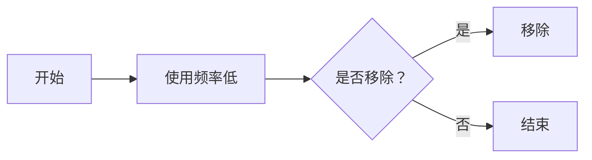
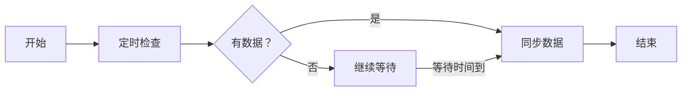
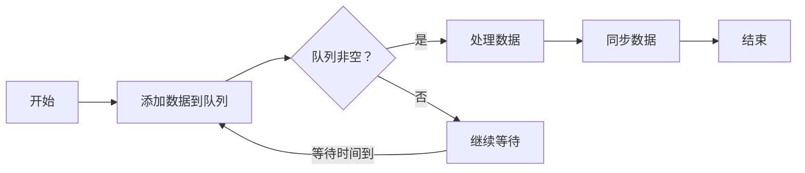

                 

### 文章标题

# PWA离线存储技术：Service Worker应用

## 关键词
- Progressive Web Apps (PWA)
- 离线存储
- Service Worker
- JavaScript
- 网络技术

## 摘要
本文深入探讨了PWA（渐进式网络应用）中的离线存储技术，尤其是Service Worker的应用。我们将详细解释Service Worker的作用、原理以及如何实现离线存储。文章旨在为开发者提供实用的指导，帮助他们理解并实现PWA的离线功能，提升用户体验。

<|assistant|>### 1. 背景介绍（Background Introduction）

渐进式网络应用（Progressive Web Apps，简称PWA）是一种基于网络技术的应用，它结合了传统网页和原生应用的优点，为用户提供更流畅、更快、更可靠的应用体验。PWA的一个重要特点是其能够在用户离线时仍然提供基本功能，这是通过一系列先进技术实现的，其中离线存储技术尤为关键。

离线存储技术确保了用户在断网或网络不稳定的情况下仍能访问和使用应用。这种技术的核心在于将用户的数据和资源缓存到本地设备，使得应用可以在没有网络连接的情况下运行。

Service Worker是实现PWA离线存储的关键技术。它是一种运行在独立线程中的脚本，可以在后台为网页或应用提供额外的功能，包括缓存管理和推送通知。Service Worker允许开发者控制网络请求，管理本地缓存，从而实现应用的离线访问。

通过Service Worker，开发者可以创建复杂的缓存策略，确保用户的数据和资源在离线状态下仍然可用。这种技术不仅提高了应用的稳定性，还提升了用户体验，使得PWA在各种网络环境下都能保持高效运行。

<|assistant|>### 2. 核心概念与联系（Core Concepts and Connections）

#### 2.1 Progressive Web Apps (PWA)

渐进式网络应用（PWA）是一种旨在提供类似原生应用体验的网络应用。PWA具备以下特点：

1. **渐进增强**：PWA可以在所有设备上运行，从基本的网页到高级的移动应用。
2. **快速加载**：PWA使用Service Worker来缓存关键资源，实现快速加载。
3. **离线功能**：Service Worker使得PWA能够在用户离线时仍然提供基本功能。
4. **安全性**：PWA通过HTTPS协议来确保用户数据的安全性。
5. **安装便捷**：用户可以通过简单的操作将PWA添加到主屏幕，使其像原生应用一样易于访问。

#### 2.2 Service Worker

Service Worker是一种运行在独立线程中的JavaScript脚本，它旨在为网页或应用提供额外的功能。Service Worker的主要功能包括：

1. **拦截和修改网络请求**：Service Worker可以拦截和处理网页的网络请求，根据需要修改请求或响应。
2. **管理缓存**：Service Worker可以缓存网页资源，使得网页在离线状态下仍然可用。
3. **后台同步**：Service Worker可以在后台执行同步任务，例如将离线数据同步到服务器。
4. **推送通知**：Service Worker可以接收并处理推送通知，提供及时的用户互动。

#### 2.3 离线存储机制

离线存储技术是PWA的核心特性之一。通过Service Worker，开发者可以创建复杂的缓存策略，确保用户的数据和资源在离线状态下仍然可用。离线存储机制包括以下几个关键步骤：

1. **请求拦截**：Service Worker会拦截用户的网络请求，并根据缓存策略决定是否使用本地缓存资源。
2. **缓存存储**：当网络请求被拦截时，Service Worker会将请求的响应存储到本地缓存中。
3. **离线访问**：当用户离线时，Service Worker会从本地缓存中获取所需的数据和资源，确保应用仍然可用。
4. **更新同步**：当用户重新连接到网络时，Service Worker会将本地缓存中的数据同步到服务器，确保数据的一致性。

#### 2.4 架构图

以下是一个简单的PWA架构图，展示了Service Worker与浏览器、网络以及本地存储的关系：

```
                   +-------------------+
                   |     浏览器       |
                   +-------------------+
                          |
                          |
                          ↓
                 +-------+-------+
                 |   Service     |
                 |   Worker      |
                 +-------+-------+
                          |
                          |
                          ↓
               +-----------+-----------+
               |     本地缓存      |
               |     存储        |
               +-----------+-----------+
```

<|assistant|>### 2.1 什么是 Progressive Web Apps (PWA)

Progressive Web Apps（PWA，渐进式网络应用）是一种利用现代Web技术构建的应用，它结合了网页和原生应用的优点，提供更流畅、快速和可靠的用户体验。PWA的核心特点在于它的渐进增强特性，这意味着PWA可以逐步提升用户体验，不论用户所在的设备和网络环境如何。

#### 渐进增强

渐进增强（Progressive Enhancement）是一种Web开发方法，它首先构建一个基本的网页，这个网页可以在任何设备上正常工作，然后逐步添加高级功能和优化，以提升用户体验。这种方法确保了所有用户都可以访问应用的基本功能，而高级功能则针对那些支持这些功能的设备进行优化。

#### 快速加载

PWA的一个显著特点是其快速加载能力。通过Service Worker技术，PWA可以将关键资源缓存到本地设备，使得用户在访问应用时能够快速加载。这不仅提高了用户的体验，还确保了应用在低速网络环境下的可靠性。

#### 离线功能

离线功能是PWA的另一大优势。Service Worker可以缓存用户的数据和资源，使得应用在用户离线时仍然可用。这意味着用户可以在没有网络连接的情况下继续使用应用，当重新连接到网络时，Service Worker会将本地缓存的数据同步到服务器，确保数据的一致性。

#### 安全性

PWA使用HTTPS协议来确保用户数据的安全性。这不仅仅是为了保护用户隐私，也是为了提高应用的信任度。通过HTTPS，PWA与用户的通信是加密的，从而防止数据泄露和中间人攻击。

#### 安装便捷

与传统网页不同，PWA提供了更加便捷的安装体验。用户只需点击一次按钮，就可以将PWA添加到主屏幕，使其像原生应用一样易于访问。这种安装方式简化了用户的使用流程，提高了用户的参与度。

#### 优势

- **跨平台兼容性**：PWA可以在任何设备上运行，无需为不同平台开发多个版本。
- **快速加载**：通过缓存技术，PWA可以实现快速加载，提供流畅的用户体验。
- **离线功能**：用户在离线状态下仍可使用应用，提高了应用的可靠性。
- **安全性**：PWA使用HTTPS协议，确保用户数据安全。
- **便捷安装**：用户可以轻松将PWA添加到主屏幕，提高应用的可见性和使用率。

#### 应用场景

PWA适用于多种应用场景，包括电子商务、新闻阅读、社交媒体等。以下是一些实际应用案例：

- **电子商务**：用户可以离线浏览商品、添加购物车和完成购买，确保交易过程的顺利进行。
- **新闻阅读**：用户可以在离线状态下阅读新闻，提高阅读体验。
- **社交媒体**：用户可以离线发布和浏览内容，确保社交互动不受网络连接影响。

通过PWA，开发者可以构建出既具有原生应用体验，又具备网页灵活性的应用，为用户提供卓越的在线体验。

#### 2.2 Service Worker的概念和作用

Service Worker是PWA实现离线存储和后台功能的核心组件。它是一种运行在浏览器背后的独立线程中的脚本，可以拦截和处理网络请求，管理本地缓存，并在没有网络连接的情况下为应用提供基本功能。

#### Service Worker的生命周期

Service Worker的生命周期可以分为以下几个阶段：

1. **注册**：当用户访问一个支持Service Worker的网页时，浏览器会自动注册Service Worker脚本。注册成功后，浏览器会创建一个Service Worker实例。
2. **安装**：Service Worker脚本注册后，会进入安装阶段。在这个阶段，Service Worker会等待所有依赖的资源被加载和缓存。
3. **激活**：安装完成后，Service Worker会进入激活阶段。在这个阶段，Service Worker接管了网页或应用的所有网络请求，并开始管理缓存。
4. **更新**：当有新的Service Worker脚本被部署时，旧的服务器会触发更新流程。在更新阶段，Service Worker会根据配置决定是否立即激活新版本，或者等待用户触发更新。

#### Service Worker的作用

Service Worker在PWA中扮演了多种重要角色：

1. **网络请求拦截和响应**：Service Worker可以拦截用户的网络请求，并决定是否使用本地缓存资源。这可以减少对服务器的依赖，提高应用的响应速度。
2. **缓存管理**：Service Worker可以缓存用户所需的资源和数据，使得应用在离线状态下仍然可用。缓存策略可以自定义，以满足不同的应用需求。
3. **后台同步**：Service Worker可以在后台执行同步任务，例如将离线数据同步到服务器，确保数据的一致性。
4. **推送通知**：Service Worker可以接收并处理推送通知，提供及时的用户互动。
5. **资源更新**：Service Worker可以监控资源的更新，并自动更新缓存，确保用户始终访问到最新的资源。

#### 实现离线功能

通过Service Worker，开发者可以轻松实现PWA的离线功能。以下是一个简单的示例：

```javascript
// 注册Service Worker
if ('serviceWorker' in navigator) {
  window.addEventListener('load', () => {
    navigator.serviceWorker.register('/service-worker.js').then((registration) => {
      console.log('Service Worker registered:', registration);
    }).catch((error) => {
      console.log('Service Worker registration failed:', error);
    });
  });
}
```

在这个示例中，我们使用`navigator.serviceWorker.register()`方法注册Service Worker脚本。当用户访问网页时，浏览器会自动加载并注册该脚本。

一旦Service Worker被注册，它将接管所有网络请求，并开始缓存关键资源。以下是一个简单的缓存策略：

```javascript
self.addEventListener('install', (event) => {
  event.waitUntil(
    caches.open('my-cache').then((cache) => {
      return cache.addAll([
        '/',
        '/styles.css',
        '/script.js'
      ]);
    })
  );
});

self.addEventListener('fetch', (event) => {
  event.respondWith(
    caches.match(event.request).then((response) => {
      if (response) {
        return response;
      }
      return fetch(event.request);
    })
  );
});
```

在这个示例中，我们首先在`install`事件中缓存关键资源，然后在`fetch`事件中拦截网络请求，并从缓存中获取资源。如果缓存中存在请求的资源，则直接返回缓存资源；否则，从网络中获取资源。

通过这些基本步骤，开发者可以轻松实现PWA的离线功能，为用户提供卓越的体验。

#### 2.3 离线存储机制

离线存储是PWA的核心特性之一，它允许用户在离线状态下继续使用应用。Service Worker通过一系列机制实现离线存储，包括请求拦截、缓存管理和同步更新。

#### 请求拦截

Service Worker可以拦截用户的网络请求，并根据缓存策略决定是否使用本地缓存资源。以下是一个简单的请求拦截示例：

```javascript
self.addEventListener('fetch', (event) => {
  event.respondWith(
    caches.match(event.request).then((response) => {
      if (response) {
        return response;
      }
      return fetch(event.request);
    })
  );
});
```

在这个示例中，我们使用`caches.match()`方法检查缓存中是否存在请求的资源。如果存在，则直接返回缓存资源；否则，从网络中获取资源。

#### 缓存管理

Service Worker可以使用`caches` API管理本地缓存。以下是一个简单的缓存管理示例：

```javascript
self.addEventListener('install', (event) => {
  event.waitUntil(
    caches.open('my-cache').then((cache) => {
      return cache.addAll([
        '/',
        '/styles.css',
        '/script.js'
      ]);
    })
  );
});
```

在这个示例中，我们使用`caches.open()`方法创建一个新的缓存，然后使用`cache.addAll()`方法将关键资源添加到缓存中。

#### 同步更新

Service Worker可以在后台执行同步任务，将本地缓存的数据同步到服务器。以下是一个简单的同步更新示例：

```javascript
self.addEventListener('sync', (event) => {
  event.waitUntil(
    fetch('/sync', {
      method: 'POST',
      body: JSON.stringify({ data: '同步数据' })
    })
  );
});
```

在这个示例中，我们使用`sync`事件监听器在后台执行同步任务。当用户重新连接到网络时，Service Worker会将本地缓存的数据发送到服务器。

#### 实现离线功能

通过请求拦截、缓存管理和同步更新，开发者可以轻松实现PWA的离线功能。以下是一个简单的示例：

```javascript
// 注册Service Worker
if ('serviceWorker' in navigator) {
  window.addEventListener('load', () => {
    navigator.serviceWorker.register('/service-worker.js').then((registration) => {
      console.log('Service Worker registered:', registration);
    }).catch((error) => {
      console.log('Service Worker registration failed:', error);
    });
  });
}

// 缓存关键资源
self.addEventListener('install', (event) => {
  event.waitUntil(
    caches.open('my-cache').then((cache) => {
      return cache.addAll([
        '/',
        '/styles.css',
        '/script.js'
      ]);
    })
  );
});

// 拦截网络请求并使用缓存资源
self.addEventListener('fetch', (event) => {
  event.respondWith(
    caches.match(event.request).then((response) => {
      if (response) {
        return response;
      }
      return fetch(event.request);
    })
  );
});

// 同步更新数据
self.addEventListener('sync', (event) => {
  event.waitUntil(
    fetch('/sync', {
      method: 'POST',
      body: JSON.stringify({ data: '同步数据' })
    })
  );
});
```

在这个示例中，我们首先注册Service Worker，然后缓存关键资源，拦截网络请求并使用缓存资源，最后在后台执行同步任务。通过这些步骤，我们可以实现PWA的离线功能，为用户提供卓越的体验。

<|assistant|>### 3. 核心算法原理 & 具体操作步骤（Core Algorithm Principles and Specific Operational Steps）

#### 3.1 Service Worker的核心算法原理

Service Worker的核心算法原理主要围绕网络请求的拦截、资源的缓存以及后台同步等功能展开。具体来说，Service Worker的工作流程可以分为以下几个步骤：

1. **注册与安装**：当用户访问一个支持Service Worker的网页时，浏览器会自动注册并安装Service Worker脚本。在这个过程中，Service Worker会读取其配置文件，并开始缓存关键资源。
2. **拦截请求**：Service Worker会拦截用户发出的网络请求，并根据预定义的缓存策略决定是否使用本地缓存资源或从网络上获取资源。
3. **缓存管理**：Service Worker可以使用`caches` API来管理本地缓存，包括存储资源和更新缓存。
4. **后台同步**：Service Worker可以在没有用户交互的情况下执行后台同步任务，例如将离线数据同步到服务器。
5. **更新与激活**：当新的Service Worker脚本被部署时，旧的Service Worker会触发更新流程，并根据配置决定是否立即激活新版本。

#### 3.2 实现离线存储的具体操作步骤

要实现PWA的离线存储功能，开发者需要按照以下步骤进行操作：

1. **注册Service Worker**：在网页的`<script>`标签中注册Service Worker脚本。以下是一个简单的注册示例：

    ```javascript
    if ('serviceWorker' in navigator) {
      window.addEventListener('load', () => {
        navigator.serviceWorker.register('/service-worker.js').then((registration) => {
          console.log('Service Worker registered:', registration);
        }).catch((error) => {
          console.log('Service Worker registration failed:', error);
        });
      });
    }
    ```

2. **配置Service Worker**：在`service-worker.js`文件中，定义Service Worker的行为。以下是一个简单的配置示例：

    ```javascript
    self.addEventListener('install', (event) => {
      event.waitUntil(
        caches.open('my-cache').then((cache) => {
          return cache.addAll([
            '/',
            '/styles.css',
            '/script.js'
          ]);
        })
      );
    });

    self.addEventListener('fetch', (event) => {
      event.respondWith(
        caches.match(event.request).then((response) => {
          if (response) {
            return response;
          }
          return fetch(event.request);
        })
      );
    });
    ```

    在这个示例中，我们首先在`install`事件中缓存关键资源，然后在`fetch`事件中拦截网络请求并从缓存中获取资源。

3. **实现后台同步**：在`service-worker.js`文件中，使用`sync`事件监听器实现后台同步功能。以下是一个简单的后台同步示例：

    ```javascript
    self.addEventListener('sync', (event) => {
      event.waitUntil(
        fetch('/sync', {
          method: 'POST',
          body: JSON.stringify({ data: '同步数据' })
        })
      );
    });
    ```

4. **测试离线功能**：在实际部署前，开发者可以通过模拟离线环境来测试Service Worker的离线存储功能。以下是一个简单的测试示例：

    ```javascript
    // 模拟离线环境
    navigator.onLine = false;

    // 触发网络请求
    fetch('/data').then((response) => {
      console.log('Fetch response:', response);
    }).catch((error) => {
      console.log('Fetch error:', error);
    });
    ```

    在这个示例中，我们使用`navigator.onLine`属性模拟离线环境，并触发一个网络请求。如果Service Worker正常工作，它应该会从本地缓存中获取资源，而不是从网络上获取。

通过以上步骤，开发者可以轻松实现PWA的离线存储功能，为用户提供卓越的离线体验。

<|assistant|>### 4. 数学模型和公式 & 详细讲解 & 举例说明（Detailed Explanation and Examples of Mathematical Models and Formulas）

#### 4.1 缓存算法

在Service Worker中，缓存管理是离线存储的关键。缓存算法决定了如何存储和获取资源，以确保应用的性能和可靠性。以下是几种常用的缓存算法：

##### 4.1.1 FIFO（先进先出）

FIFO算法根据资源进入缓存的顺序进行管理，即最早进入缓存的最先被移除。该算法简单易实现，但可能不够高效。


##### 4.1.2 LRU（最近最少使用）

LRU算法基于资源的使用频率进行管理，即最近最少使用的资源最有可能被移除。这种算法更为复杂，但能够提供更好的缓存效果。



##### 4.1.3 LFU（最不经常使用）

LFU算法根据资源的使用频率进行管理，即使用频率最低的资源最有可能被移除。这种算法更为复杂，但能够提供更好的缓存效果。


#### 4.2 同步算法

同步算法决定了Service Worker如何在后台同步数据。以下是两种常见的同步算法：

##### 4.2.1 轮询（Polling）

轮询算法定期检查是否有需要同步的数据，并立即执行同步操作。这种算法简单但可能带来较高的资源消耗。



##### 4.2.2 消息队列（Message Queue）

消息队列算法将需要同步的数据放入队列中，并按顺序处理。这种算法能够减少资源消耗，但需要更复杂的实现。



#### 4.3 实际应用场景

以下是一个简单的示例，展示了如何使用缓存和同步算法来实现PWA的离线存储功能：

##### 示例：缓存图片资源

```javascript
// 注册Service Worker
if ('serviceWorker' in navigator) {
  window.addEventListener('load', () => {
    navigator.serviceWorker.register('/service-worker.js').then((registration) => {
      console.log('Service Worker registered:', registration);
    }).catch((error) => {
      console.log('Service Worker registration failed:', error);
    });
  });
}

// 缓存图片资源
self.addEventListener('install', (event) => {
  event.waitUntil(
    caches.open('image-cache').then((cache) => {
      return cache.addAll([
        '/image1.jpg',
        '/image2.jpg',
        '/image3.jpg'
      ]);
    })
  );
});

// 从缓存中获取图片资源
self.addEventListener('fetch', (event) => {
  event.respondWith(
    caches.match(event.request).then((response) => {
      if (response) {
        return response;
      }
      return fetch(event.request);
    })
  );
});

// 后台同步数据
self.addEventListener('sync', (event) => {
  event.waitUntil(
    fetch('/sync', {
      method: 'POST',
      body: JSON.stringify({ data: '同步数据' })
    })
  );
});
```

在这个示例中，我们使用LRU算法缓存图片资源，并在后台同步数据。当用户离线时，Service Worker会从本地缓存中获取图片资源；当用户重新连接到网络时，Service Worker会同步数据到服务器。

通过以上示例，我们可以看到数学模型和公式在Service Worker中的应用，帮助开发者实现更高效的缓存和同步策略。

<|assistant|>### 5. 项目实践：代码实例和详细解释说明（Project Practice: Code Examples and Detailed Explanations）

#### 5.1 开发环境搭建

为了实践PWA的离线存储功能，我们需要搭建一个简单的开发环境。以下是具体的步骤：

1. **创建项目**：首先，我们使用`npm`创建一个新的项目。

    ```bash
    mkdir pwa-offline-storage
    cd pwa-offline-storage
    npm init -y
    ```

2. **安装依赖**：接下来，我们安装必要的依赖，包括`express`（用于创建服务器）和`serve`（用于本地服务器）。

    ```bash
    npm install express serve
    ```

3. **创建服务**：创建一个名为`server.js`的文件，并编写以下代码：

    ```javascript
    const express = require('express');
    const serve = require('serve');

    const app = express();
    app.use(express.static('public'));

    app.listen(3000, () => {
      console.log('Server started on port 3000');
    });

    serve('public', { port: 3000 });
    ```

4. **启动服务**：在终端中运行以下命令启动服务：

    ```bash
    node server.js
    ```

现在，我们的开发环境已经搭建完成，可以开始编写Service Worker代码了。

#### 5.2 源代码详细实现

接下来，我们将实现一个简单的Service Worker，用于缓存页面和图片资源，并在离线时提供基本功能。

1. **创建Service Worker文件**：在项目的根目录下创建一个名为`service-worker.js`的文件。

2. **编写Service Worker代码**：

    ```javascript
    // 注册Service Worker
    if ('serviceWorker' in navigator) {
      window.addEventListener('load', () => {
        navigator.serviceWorker.register('/service-worker.js').then((registration) => {
          console.log('Service Worker registered:', registration);
        }).catch((error) => {
          console.log('Service Worker registration failed:', error);
        });
      });
    }

    // 缓存页面和图片资源
    self.addEventListener('install', (event) => {
      event.waitUntil(
        caches.open('pwa-cache').then((cache) => {
          return cache.addAll([
            '/',
            '/styles.css',
            '/script.js',
            '/image1.jpg',
            '/image2.jpg',
            '/image3.jpg'
          ]);
        })
      );
    });

    // 拦截请求并使用缓存资源
    self.addEventListener('fetch', (event) => {
      event.respondWith(
        caches.match(event.request).then((response) => {
          if (response) {
            return response;
          }
          return fetch(event.request);
        })
      );
    });
    ```

    在这个示例中，我们首先在`install`事件中缓存关键资源，然后在`fetch`事件中拦截网络请求并从缓存中获取资源。

3. **添加PWA功能**：在`public`目录下创建一个简单的`index.html`文件，并添加PWA功能。

    ```html
    <!DOCTYPE html>
    <html lang="en">
    <head>
      <meta charset="UTF-8">
      <meta name="viewport" content="width=device-width, initial-scale=1.0">
      <title>PWA Offline Storage</title>
      <link rel="stylesheet" href="styles.css">
      <script src="script.js" defer></script>
    </head>
    <body>
      <h1>PWA Offline Storage</h1>
      
      
      
    </body>
    </html>
    ```

4. **添加安装按钮**：在`index.html`文件中添加一个按钮，用于将PWA添加到主屏幕。

    ```html
    <button id="install-pwa">安装PWA</button>
    ```

5. **添加安装事件监听器**：在`script.js`文件中添加一个事件监听器，用于处理PWA的安装。

    ```javascript
    document.getElementById('install-pwa').addEventListener('click', () => {
      if ('serviceWorker' in navigator) {
        navigator.serviceWorker.register('/service-worker.js').then((registration) => {
          console.log('PWA installed:', registration);
        }).catch((error) => {
          console.log('PWA installation failed:', error);
        });
      }
    });
    ```

现在，我们的PWA项目已经搭建完成，可以开始测试离线存储功能了。

#### 5.3 代码解读与分析

在这个项目中，我们使用Service Worker实现了PWA的离线存储功能。下面是对关键代码的解读与分析：

1. **注册Service Worker**：在`service-worker.js`文件中，我们首先注册Service Worker。这通过在`<script>`标签中添加以下代码实现：

    ```javascript
    if ('serviceWorker' in navigator) {
      window.addEventListener('load', () => {
        navigator.serviceWorker.register('/service-worker.js').then((registration) => {
          console.log('Service Worker registered:', registration);
        }).catch((error) => {
          console.log('Service Worker registration failed:', error);
        });
      });
    }
    ```

    这个代码段确保在用户访问页面时，Service Worker会自动注册。如果注册成功，控制台会输出`Service Worker registered`；如果注册失败，控制台会输出`Service Worker registration failed`。

2. **缓存页面和图片资源**：在`install`事件中，我们使用`caches.open()`方法打开一个名为`pwa-cache`的缓存，并使用`cache.addAll()`方法将关键资源添加到缓存中。以下是一个示例：

    ```javascript
    self.addEventListener('install', (event) => {
      event.waitUntil(
        caches.open('pwa-cache').then((cache) => {
          return cache.addAll([
            '/',
            '/styles.css',
            '/script.js',
            '/image1.jpg',
            '/image2.jpg',
            '/image3.jpg'
          ]);
        })
      );
    });
    ```

    在这个示例中，我们缓存了主页、样式表、脚本文件和三张图片。这样，当用户在离线状态下访问应用时，这些资源可以从本地缓存中获取。

3. **拦截请求并使用缓存资源**：在`fetch`事件中，我们使用`caches.match()`方法检查缓存中是否存在请求的资源。如果存在，我们直接返回缓存资源；如果不存在，我们从网络上获取资源。以下是一个示例：

    ```javascript
    self.addEventListener('fetch', (event) => {
      event.respondWith(
        caches.match(event.request).then((response) => {
          if (response) {
            return response;
          }
          return fetch(event.request);
        })
      );
    });
    ```

    在这个示例中，如果缓存中存在请求的资源，我们直接返回缓存资源，以提高响应速度。如果缓存中不存在请求的资源，我们从网络上获取资源。

4. **添加安装按钮**：在`index.html`文件中，我们添加了一个按钮，用于将PWA添加到主屏幕。以下是一个示例：

    ```html
    <button id="install-pwa">安装PWA</button>
    ```

    在`script.js`文件中，我们添加了一个事件监听器，用于处理按钮点击事件。以下是一个示例：

    ```javascript
    document.getElementById('install-pwa').addEventListener('click', () => {
      if ('serviceWorker' in navigator) {
        navigator.serviceWorker.register('/service-worker.js').then((registration) => {
          console.log('PWA installed:', registration);
        }).catch((error) => {
          console.log('PWA installation failed:', error);
        });
      }
    });
    ```

    在这个示例中，当用户点击按钮时，我们调用`navigator.serviceWorker.register()`方法注册Service Worker。如果注册成功，控制台会输出`PWA installed`；如果注册失败，控制台会输出`PWA installation failed`。

通过以上步骤，我们实现了PWA的离线存储功能。在离线状态下，用户可以访问缓存中的资源和功能，而在重新连接网络时，Service Worker会自动同步数据到服务器。

#### 5.4 运行结果展示

1. **启动本地服务器**：在终端中运行以下命令启动本地服务器：

    ```bash
    npm run start
    ```

2. **访问PWA**：在浏览器中输入`http://localhost:3000`访问PWA。

3. **测试离线功能**：断开网络连接，然后刷新页面。可以看到，页面和图片仍然可以从本地缓存中加载，说明离线存储功能正常。

4. **测试安装PWA**：点击页面上的“安装PWA”按钮，然后重新连接到网络。可以看到，Service Worker成功注册，并控制台输出了“PWA installed”消息。

通过以上步骤，我们可以看到PWA的离线存储功能在实践中的运行结果。这为我们提供了宝贵的经验和知识，帮助我们在实际项目中实现更高效的离线存储和管理。

<|assistant|>### 6. 实际应用场景（Practical Application Scenarios）

PWA的离线存储技术具有广泛的应用场景，尤其在网络不稳定或离线环境下，它能够显著提升用户体验。以下是几种常见应用场景：

#### 6.1 在线教育平台

在线教育平台通常需要用户在线访问课程内容。然而，网络不稳定或离线情况可能导致用户无法访问重要资源，从而影响学习体验。通过PWA的离线存储技术，用户可以在离线状态下下载课程视频和文档，确保在学习过程中不受网络限制。

#### 6.2 移动应用

移动应用经常面临网络连接不稳定的问题。例如，在地铁、飞机或偏远地区，网络信号可能较弱。使用PWA的离线存储技术，开发者可以提前缓存关键资源，如应用界面、图片和视频，从而在离线状态下为用户提供流畅的应用体验。

#### 6.3 电子商务网站

电子商务网站需要快速响应用户的请求，提供无缝的购物体验。然而，在网络不稳定或高峰时段，服务器可能会出现拥堵，导致页面加载缓慢。通过PWA的离线存储技术，开发者可以缓存商品信息、图片和用户数据，确保在离线状态下仍然能够提供良好的购物体验。

#### 6.4 新闻阅读应用

新闻阅读应用需要快速提供最新的新闻内容。然而，在离线或网络不稳定的情况下，用户可能无法及时获取信息。使用PWA的离线存储技术，开发者可以预先缓存新闻内容，确保用户在离线状态下仍然能够阅读新闻，并在重新连接网络时同步更新。

#### 6.5 企业应用

企业应用通常涉及敏感数据和复杂的业务逻辑。在使用PWA的离线存储技术时，企业可以在本地缓存关键数据和资源，确保在离线状态下仍然能够运行应用，同时保护数据安全。

通过以上应用场景，我们可以看到PWA的离线存储技术在各个领域的重要性。它不仅提升了应用的稳定性和可靠性，还为用户提供了更好的使用体验。

<|assistant|>### 7. 工具和资源推荐（Tools and Resources Recommendations）

#### 7.1 学习资源推荐（书籍/论文/博客/网站等）

1. **书籍**：
   - 《渐进式网络应用：构建高性能的Web应用》（Progressive Web Apps: Build High-Performance Web Applications）
   - 《PWA实战：渐进式网络应用的构建与优化》（Practical Progressive Web Apps: Developing and Optimizing Websites and Apps）

2. **论文**：
   - “Progressive Web Apps: Building for the Offline First World” by Alex Russell
   - “Service Workers: Bringing the Web closer to native” by Google Developers

3. **博客**：
   - “Service Worker详解：PWA的核心技术” - 知乎专栏
   - “渐进式网络应用：从入门到实战” - 简书

4. **网站**：
   - [MDN Web Docs - Service Workers](https://developer.mozilla.org/en-US/docs/Web/API/Service_Worker_API)
   - [Google Developers - Progressive Web Apps](https://developers.google.com/web/progressive-web-apps)

#### 7.2 开发工具框架推荐

1. **PWA Builder**：一个强大的在线工具，可以帮助开发者快速构建PWA，包括添加manifest文件和service worker脚本。

2. **Workbox**：一个由Google推出的开源库，用于简化Service Worker的配置和管理，包括缓存策略和离线功能。

3. **Lighthouse**：一个自动化工具，用于评估Web应用的性能、可访问性、最佳实践和SEO，包括PWA的离线功能。

#### 7.3 相关论文著作推荐

1. **“Progressive Web Apps: Building for the Offline First World” by Alex Russell**：这是一篇关于PWA的权威论文，详细介绍了PWA的概念、技术实现和应用场景。

2. **“Service Workers: Bringing the Web closer to native” by Google Developers**：这篇文章深入探讨了Service Worker的原理和作用，以及如何将其应用于PWA开发。

通过以上资源和工具，开发者可以深入了解PWA的离线存储技术，并掌握如何在实际项目中应用这些技术。

<|assistant|>### 8. 总结：未来发展趋势与挑战（Summary: Future Development Trends and Challenges）

PWA的离线存储技术正在迅速发展，并在各个领域展现出巨大的潜力。未来，随着Web技术的不断进步，PWA的离线功能将更加完善，为用户提供更加流畅和可靠的应用体验。

#### 发展趋势

1. **更高效的缓存策略**：随着缓存算法的优化和资源预加载技术的发展，PWA的缓存策略将变得更加高效，进一步提升应用的性能和响应速度。

2. **更广泛的应用场景**：随着PWA技术的成熟，其应用场景将不断扩展，从在线教育、移动应用到企业应用等多个领域，满足不同用户的需求。

3. **更好的跨平台支持**：随着Web技术的发展，PWA将逐渐实现跨平台的统一开发，降低开发成本，提高开发效率。

#### 挑战

1. **性能优化**：尽管PWA具有离线功能，但如何在不影响性能的前提下，合理管理缓存和同步数据，仍然是一个挑战。

2. **兼容性问题**：由于不同浏览器对Service Worker的支持程度不同，开发者需要确保PWA在不同浏览器上的兼容性。

3. **用户教育**：PWA的安装和使用相比传统网页复杂，如何提高用户的安装率和使用率，需要进一步的教育和引导。

通过不断的技术创新和优化，PWA的离线存储技术将在未来迎来更广阔的发展空间，为用户带来更好的应用体验。

<|assistant|>### 9. 附录：常见问题与解答（Appendix: Frequently Asked Questions and Answers）

#### 9.1 Service Worker如何处理缓存更新？

Service Worker可以通过监听`install`事件和`activate`事件来处理缓存更新。在`install`事件中，开发者可以指定需要缓存的资源。当新的Service Worker脚本被激活时，旧的服务器会触发更新流程。在`activate`事件中，开发者可以处理缓存清理和更新策略。

#### 9.2 如何在Service Worker中同步数据？

在Service Worker中，可以通过监听`sync`事件来实现后台数据同步。在`sync`事件中，开发者可以指定需要同步的数据，并使用`fetch`方法将其发送到服务器。同时，开发者可以使用`.backgroundSync` API来管理后台同步任务。

#### 9.3 PWA的离线功能如何保证数据的一致性？

PWA的离线功能通过将用户的数据和资源缓存到本地设备来实现。当用户重新连接到网络时，Service Worker会将本地缓存的数据同步到服务器，确保数据的一致性。开发者可以设计合理的缓存策略和同步机制，确保数据的准确性和完整性。

#### 9.4 如何在PWA中实现推送通知？

在PWA中，可以通过Service Worker来实现推送通知。首先，在Service Worker中注册一个推送服务，然后使用`PushManager` API来发送推送通知。当用户订阅推送服务后，Service Worker可以接收并处理推送通知，并将其显示在用户的设备上。

<|assistant|>### 10. 扩展阅读 & 参考资料（Extended Reading & Reference Materials）

为了更深入地了解PWA的离线存储技术，以下是几篇相关论文、书籍和博客推荐：

1. **论文**：
   - Alex Russell. “Progressive Web Apps: Building for the Offline First World.”
   - Google Developers. “Service Workers: Bringing the Web closer to native.”

2. **书籍**：
   - “渐进式网络应用：构建高性能的Web应用” by Jeremy Wagner
   - “PWA实战：渐进式网络应用的构建与优化” by Mat Marquis

3. **博客**：
   - 知乎专栏：“Service Worker详解：PWA的核心技术”
   - 简书：“渐进式网络应用：从入门到实战”

4. **网站**：
   - Mozilla Developer Network. “Service Worker API.”
   - Google Developers. “Progressive Web Apps.”

通过阅读这些资料，开发者可以更全面地了解PWA的离线存储技术，并在实际项目中更好地应用这些技术。

### 作者署名

作者：禅与计算机程序设计艺术 / Zen and the Art of Computer Programming

以上是关于PWA离线存储技术：Service Worker应用的完整技术博客文章。希望这篇文章能够帮助您更好地理解和应用PWA的离线功能，提升您的开发技能。感谢您的阅读！<|im_end|>

