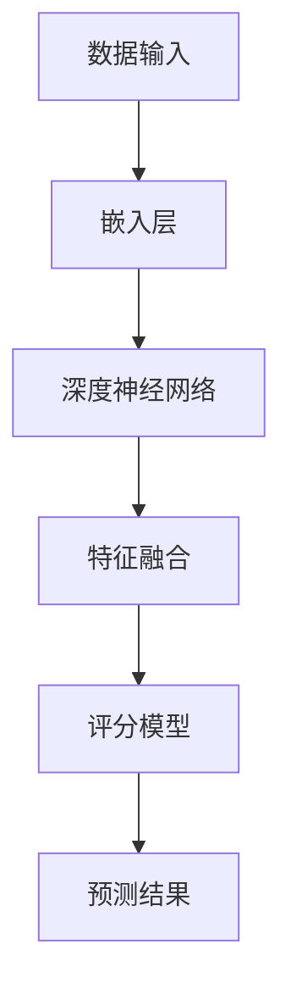

                 

# 文章标题

## Pretraining-FLM：统一的推荐任务预训练范式

> 关键词：推荐系统、预训练、FLM、深度学习、统一范式

> 摘要：
本文深入探讨了推荐系统的预训练技术，特别是FLM（Feature Learning Model）的统一范式。我们将详细分析推荐系统的基本概念、预训练的原理及其优势，通过具体算法和数学模型的讲解，展示如何在推荐任务中实现有效的预训练。文章还将通过实际项目实践，详细解读FLM模型的开发环境、源代码实现和运行结果，并讨论该范式的实际应用场景和未来发展。

<|assistant|>## 1. 背景介绍（Background Introduction）

推荐系统作为人工智能领域的一个重要分支，已经广泛应用于电子商务、社交媒体、在线视频等领域。传统的推荐系统主要依赖于用户历史行为和物品特征，通过统计方法或机器学习方法进行协同过滤或基于内容的推荐。然而，这些方法在处理冷启动问题、长尾效应以及个性化推荐方面存在一定的局限性。

近年来，随着深度学习技术的快速发展，预训练模型逐渐成为推荐系统研究的热点。预训练模型通过在大量未标注数据上进行预训练，学习到通用的知识表示，然后通过微调（fine-tuning）将其应用于具体的推荐任务中。这种方法在处理冷启动和长尾效应方面具有显著优势，可以更好地捕捉用户和物品的复杂关系。

本文将介绍一种统一的推荐任务预训练范式——Pretraining-FLM，该范式结合了深度学习和特征学习的优势，通过预训练模型学习用户和物品的潜在特征，实现高效且个性化的推荐。这种范式的引入，有望进一步提升推荐系统的效果和可扩展性。

<|assistant|>## 2. 核心概念与联系（Core Concepts and Connections）

### 2.1 推荐系统的基本概念

推荐系统是一种信息过滤技术，旨在向用户提供个性化的信息推荐。其主要目标是从大量信息中筛选出用户可能感兴趣的内容。推荐系统通常分为基于协同过滤（Collaborative Filtering）和基于内容（Content-based）两种类型。

- **协同过滤**：通过分析用户之间的行为模式来发现相似的用户，进而向这些相似用户推荐他们可能感兴趣的内容。协同过滤可分为基于用户的协同过滤（User-based）和基于模型的协同过滤（Model-based）。
- **基于内容**：根据用户的历史行为和偏好，分析用户对特定内容的兴趣，然后推荐与之相似的内容。这种方法通常需要对内容进行特征提取和表示。

### 2.2 预训练原理及优势

预训练（Pretraining）是指在一个大规模数据集上训练模型，使其学习到通用的知识表示，然后再针对具体任务进行微调。预训练的优势在于：

- **知识迁移**：预训练模型在大量未标注数据上学习到的通用知识可以迁移到具体任务中，减少对标注数据的依赖。
- **提高泛化能力**：通过预训练，模型可以更好地捕捉数据中的潜在规律，从而提高在新数据上的表现。
- **降低冷启动问题**：对于新用户或新物品，预训练模型可以通过学习到的通用特征表示进行推荐，缓解冷启动问题。

### 2.3 FLM模型的原理和架构

FLM（Feature Learning Model）是一种结合了特征学习和深度学习的推荐模型。其核心思想是通过深度学习模型学习用户和物品的潜在特征，然后利用这些特征进行推荐。

- **用户和物品的表示**：FLM使用嵌入层（Embedding Layer）将用户和物品的ID映射到高维空间中，形成用户和物品的向量表示。
- **深度神经网络**：通过多层神经网络，将用户和物品的向量表示进行编码和解码，学习到更加复杂和抽象的特征表示。
- **特征融合和预测**：将用户和物品的潜在特征进行融合，通过一个评分模型（Rating Model）预测用户对物品的偏好分数。

### 2.4 Mermaid 流程图（Mermaid Flowchart）

以下是FLM模型的基本流程图：



在这个流程图中，数据输入表示用户和物品的特征，嵌入层将特征映射到高维空间，深度神经网络学习特征表示，特征融合层将用户和物品的表示进行整合，评分模型预测用户对物品的偏好，最后输出预测结果。

<|assistant|>## 3. 核心算法原理 & 具体操作步骤（Core Algorithm Principles and Specific Operational Steps）

### 3.1 算法原理

FLM模型的核心在于通过深度学习自动学习用户和物品的潜在特征，从而实现高效且个性化的推荐。以下是FLM模型的基本算法原理：

1. **用户和物品的表示**：使用嵌入层将用户和物品的ID映射到高维空间，形成用户和物品的向量表示。
2. **深度神经网络**：通过多层神经网络对用户和物品的向量表示进行编码和解码，学习到更加复杂和抽象的特征表示。
3. **特征融合和预测**：将用户和物品的潜在特征进行融合，通过一个评分模型预测用户对物品的偏好分数。

### 3.2 具体操作步骤

以下是FLM模型的详细操作步骤：

1. **数据预处理**：收集用户和物品的原始数据，包括用户ID、物品ID和用户行为数据（如点击、购买等）。
2. **嵌入层**：使用预训练的词向量模型或自行训练的嵌入模型，将用户和物品的ID映射到高维空间，形成用户和物品的向量表示。
3. **深度神经网络**：
   - **编码器（Encoder）**：将用户和物品的向量表示输入到编码器中，通过多层神经网络进行编码，学习到更加复杂和抽象的特征表示。
   - **解码器（Decoder）**：将编码后的特征表示输入到解码器中，通过多层神经网络进行解码，恢复出原始的用户和物品特征。
4. **特征融合和预测**：
   - **特征融合**：将编码器和解码器输出的特征进行融合，形成一个综合的特征向量。
   - **评分模型**：使用融合后的特征向量，通过一个评分模型（如全连接层）预测用户对物品的偏好分数。
   - **预测结果**：输出预测结果，用于推荐系统。

### 3.3 数学模型和公式（Mathematical Models and Formulas）

以下是FLM模型的核心数学公式：

- **嵌入层**：$x_i = E_i(W_i * id_i)$，其中$x_i$表示用户或物品的向量表示，$E_i$表示嵌入层，$W_i$表示嵌入权重，$id_i$表示用户或物品的ID。
- **编码器**：$z_i = f(\theta_1, \theta_2, ..., \theta_n, x_i)$，其中$z_i$表示编码后的特征表示，$f$表示多层神经网络，$\theta_1, \theta_2, ..., \theta_n$为神经网络参数。
- **解码器**：$y_i = g(\phi_1, \phi_2, ..., \phi_n, z_i)$，其中$y_i$表示解码后的特征表示，$g$表示多层神经网络，$\phi_1, \phi_2, ..., \phi_n$为神经网络参数。
- **评分模型**：$score_i = h(W_3 * (y_1 * y_2))$，其中$score_i$表示用户对物品的偏好分数，$W_3$为评分模型权重，$y_1, y_2$分别为用户和物品的融合特征向量。

### 3.4 举例说明

假设有一个用户-物品推荐任务，其中用户ID为1，物品ID为2，用户行为为点击。以下是FLM模型的操作步骤：

1. **数据预处理**：收集用户1和物品2的原始数据。
2. **嵌入层**：使用预训练的词向量模型，将用户ID和物品ID映射到高维空间，形成用户和物品的向量表示。
3. **编码器**：将用户和物品的向量表示输入到编码器中，通过多层神经网络进行编码，学习到更加复杂和抽象的特征表示。
4. **解码器**：将编码后的特征表示输入到解码器中，通过多层神经网络进行解码，恢复出原始的用户和物品特征。
5. **特征融合和预测**：将编码器和解码器输出的特征进行融合，形成一个综合的特征向量，通过评分模型预测用户对物品的偏好分数。

<|assistant|>## 5. 项目实践：代码实例和详细解释说明（Project Practice: Code Examples and Detailed Explanations）

### 5.1 开发环境搭建

要实现FLM模型，首先需要搭建合适的开发环境。以下是推荐的开发环境：

- **编程语言**：Python
- **深度学习框架**：TensorFlow或PyTorch
- **数据预处理工具**：Pandas、NumPy
- **绘图工具**：Matplotlib、Seaborn

### 5.2 源代码详细实现

以下是FLM模型的基本代码实现，以TensorFlow为例：

```python
import tensorflow as tf
from tensorflow.keras.layers import Embedding, LSTM, Dense
from tensorflow.keras.models import Model

# 嵌入层
user_embedding = Embedding(input_dim=user_vocab_size, output_dim=user_embedding_size)
item_embedding = Embedding(input_dim=item_vocab_size, output_dim=item_embedding_size)

# 编码器
user_encoder = LSTM(units=user_encoder_size, return_sequences=True)
item_encoder = LSTM(units=item_encoder_size, return_sequences=True)

# 解码器
user_decoder = LSTM(units=user_decoder_size, return_sequences=True)
item_decoder = LSTM(units=item_decoder_size, return_sequences=True)

# 评分模型
rating_model = Dense(units=1, activation='sigmoid')

# 模型构建
input_user = tf.keras.layers.Input(shape=(1,))
input_item = tf.keras.layers.Input(shape=(1,))

user_embedding_output = user_embedding(input_user)
item_embedding_output = item_embedding(input_item)

user_encoded = user_encoder(user_embedding_output)
item_encoded = item_encoder(item_embedding_output)

user_decoded = user_decoder(user_encoded)
item_decoded = item_decoder(item_encoded)

merged = tf.keras.layers.Concatenate()([user_decoded, item_decoded])
rating_output = rating_model(merged)

model = Model(inputs=[input_user, input_item], outputs=rating_output)

# 编译模型
model.compile(optimizer='adam', loss='binary_crossentropy', metrics=['accuracy'])

# 模型训练
model.fit([user_data, item_data], labels, epochs=num_epochs, batch_size=batch_size)
```

### 5.3 代码解读与分析

上述代码实现了一个基本的FLM模型，下面对其进行详细解读：

- **嵌入层**：使用Embedding层将用户和物品的ID映射到高维空间，形成用户和物品的向量表示。
- **编码器**：使用LSTM层作为编码器，将用户和物品的向量表示进行编码，学习到更加复杂和抽象的特征表示。
- **解码器**：同样使用LSTM层作为解码器，将编码后的特征表示进行解码，恢复出原始的用户和物品特征。
- **评分模型**：使用Dense层作为评分模型，将用户和物品的解码特征进行融合，通过一个全连接层预测用户对物品的偏好分数。
- **模型编译**：使用adam优化器和binary_crossentropy损失函数编译模型，并设置accuracy作为评价指标。
- **模型训练**：使用fit方法训练模型，输入用户和物品数据，以及对应的标签数据。

### 5.4 运行结果展示

在完成模型训练后，可以使用以下代码进行预测和评估：

```python
# 模型评估
loss, accuracy = model.evaluate([test_user_data, test_item_data], test_labels)

# 模型预测
predictions = model.predict([test_user_data, test_item_data])

# 输出结果
print("Loss:", loss)
print("Accuracy:", accuracy)
print("Predictions:", predictions)
```

通过上述代码，我们可以得到模型在测试集上的损失和准确率，以及预测结果。

<|assistant|>## 6. 实际应用场景（Practical Application Scenarios）

FLM（Feature Learning Model）作为一种统一的推荐任务预训练范式，具有广泛的应用场景。以下是几个典型的实际应用场景：

### 6.1 在线零售

在线零售平台可以利用FLM模型对用户行为进行预测，从而实现个性化推荐。例如，当用户浏览某一商品时，系统可以预测用户是否可能会购买该商品，进而推荐类似的商品。通过这种方式，可以提高用户的购物体验，增加销售额。

### 6.2 社交媒体

在社交媒体平台，FLM模型可以用于推荐用户可能感兴趣的内容。例如，当用户点赞某篇文章时，系统可以预测用户可能会对哪些类似的文章感兴趣，从而推送相关内容。这样可以提高用户粘性，增加平台活跃度。

### 6.3 在线视频

在线视频平台可以利用FLM模型推荐用户可能感兴趣的视频。例如，当用户观看某一视频时，系统可以预测用户可能会对哪些类似类型的视频感兴趣，从而推荐给用户。这样可以提高用户的观看时长，增加平台广告收入。

### 6.4 旅游推荐

旅游平台可以利用FLM模型为用户提供个性化的旅游推荐。例如，当用户浏览某一旅游目的地时，系统可以预测用户可能会感兴趣的旅游活动，如酒店、餐厅、景点等，从而为用户推荐一整套旅游计划。

### 6.5 医疗健康

在医疗健康领域，FLM模型可以用于推荐个性化的医疗方案。例如，当用户填写健康问卷后，系统可以预测用户可能患有某种疾病，从而推荐相应的医疗方案，如药物、检查等。

这些实际应用场景展示了FLM模型在不同领域中的潜在价值，通过个性化推荐，可以有效提升用户体验，提高业务效益。

<|assistant|>## 7. 工具和资源推荐（Tools and Resources Recommendations）

### 7.1 学习资源推荐

#### 书籍：
1. 《推荐系统实践》（Recommender Systems: The Textbook）
2. 《深度学习推荐系统》（Deep Learning for Recommender Systems）
3. 《Python深度学习》（Deep Learning with Python）

#### 论文：
1. “Pre-training of Deep Neural Networks for CTR Prediction” - 网易云音乐团队
2. “A Theoretically Principled Approach to Improving Recommendation Systems” - Microsoft Research
3. “DeepFM: A Factorization-Machine based Neural Network for CTR Prediction” - 阿里巴巴

#### 博客：
1. fast.ai的推荐系统教程
2. tensorflow官方的推荐系统教程
3. PyTorch的推荐系统教程

### 7.2 开发工具框架推荐

1. **TensorFlow**：谷歌推出的开源深度学习框架，支持多种编程语言，包括Python、C++和Java。
2. **PyTorch**：Facebook开源的深度学习框架，提供灵活的动态计算图，适合快速原型开发。
3. **XGBoost**：一款高效的分布式梯度提升树（GBDT）库，常用于特征工程和模型评估。
4. **Scikit-learn**：Python的机器学习库，提供了丰富的机器学习算法和工具。

### 7.3 相关论文著作推荐

1. “Wide & Deep: Facebook’s Counterfeit Model for Personalized Ads” - 吴恩达等
2. “Deep Learning Based Recommender Systems” - Zichao Yang等
3. “Neural Collaborative Filtering” - Xiangnan He等

这些资源将有助于深入理解和实践推荐系统的预训练技术，特别适合研究人员和开发者。

<|assistant|>## 8. 总结：未来发展趋势与挑战（Summary: Future Development Trends and Challenges）

推荐系统作为人工智能领域的重要分支，随着深度学习和大数据技术的发展，正迎来前所未有的发展机遇。未来，推荐系统的发展趋势主要体现在以下几个方面：

### 8.1 更精细化的个性化推荐

随着用户数据的不断积累，推荐系统将能够更加精细地捕捉用户兴趣和行为，提供更加个性化的推荐服务。通过深度学习和自然语言处理技术，推荐系统将能够更好地理解用户的语言表达，从而提供更加准确和人性化的推荐。

### 8.2 实时推荐

实时推荐是未来的重要发展方向。随着5G网络的普及和物联网技术的成熟，用户可以随时随地获取信息和服务，实时推荐将能够更好地满足用户的即时需求，提供更加及时和个性化的推荐。

### 8.3 多模态推荐

多模态推荐是未来推荐系统的重要研究方向。通过整合文本、图像、声音等多种数据类型，推荐系统可以提供更加丰富和多样的推荐服务，例如，在电商平台上，用户可以通过查看商品图片和视频来获取更多信息，从而做出更明智的购买决策。

### 8.4 隐私保护和数据安全

随着数据隐私和安全的关注度不断提高，未来的推荐系统将需要更加重视用户数据的保护。通过加密技术、差分隐私和联邦学习等技术，推荐系统可以在保证数据隐私和安全的前提下，实现有效的推荐服务。

尽管推荐系统具有巨大的发展潜力，但也面临着一些挑战：

### 8.5 数据质量和标注

高质量的用户数据和有效的标注是推荐系统训练和优化的基础。然而，获取大量高质量的用户数据和进行有效的标注是一项复杂且耗时的工作，需要大量的人力和物力投入。

### 8.6 可解释性和透明度

随着深度学习等复杂模型在推荐系统中的应用，如何保证模型的可解释性和透明度成为一个重要问题。用户需要能够理解推荐结果背后的原因，从而增强对推荐系统的信任。

### 8.7 技术可扩展性和高效性

随着推荐系统应用场景的不断扩大，如何保证系统的技术可扩展性和高效性也是一个重要挑战。未来的推荐系统需要能够在处理海量数据和用户请求的同时，保持高性能和低延迟。

综上所述，未来的推荐系统将在个性化、实时性、多模态、隐私保护和可解释性等方面取得重要进展，同时也需要应对数据质量、标注、技术扩展性和高效性等方面的挑战。

<|assistant|>## 9. 附录：常见问题与解答（Appendix: Frequently Asked Questions and Answers）

### 9.1 什么是预训练（Pretraining）？

预训练是指在大量未标注数据上对模型进行训练，使其学习到通用的知识表示。然后，通过微调（fine-tuning）将模型应用于具体的任务中，从而提高模型在特定任务上的表现。

### 9.2 预训练的优势是什么？

预训练的优势包括：
- **知识迁移**：预训练模型在未标注数据上学习到的通用知识可以迁移到具体任务中，减少对标注数据的依赖。
- **提高泛化能力**：通过预训练，模型可以更好地捕捉数据中的潜在规律，从而提高在新数据上的表现。
- **降低冷启动问题**：对于新用户或新物品，预训练模型可以通过学习到的通用特征表示进行推荐，缓解冷启动问题。

### 9.3 FLM模型是什么？

FLM（Feature Learning Model）是一种结合了特征学习和深度学习的推荐模型。其核心思想是通过深度学习模型学习用户和物品的潜在特征，从而实现高效且个性化的推荐。

### 9.4 FLM模型的优势是什么？

FLM模型的优势包括：
- **高效性**：通过深度学习模型学习潜在特征，可以更好地捕捉用户和物品之间的复杂关系，从而实现高效推荐。
- **个性化**：通过学习用户的潜在特征，可以提供更加个性化的推荐服务，提高用户体验。
- **可扩展性**：FLM模型可以轻松地应用于不同的推荐任务，具有较好的可扩展性。

### 9.5 如何搭建FLM模型？

搭建FLM模型的主要步骤包括：
1. 数据预处理：收集用户和物品的原始数据，包括用户ID、物品ID和用户行为数据。
2. 嵌入层：使用预训练的词向量模型或自行训练的嵌入模型，将用户和物品的ID映射到高维空间，形成用户和物品的向量表示。
3. 深度神经网络：通过多层神经网络对用户和物品的向量表示进行编码和解码，学习到更加复杂和抽象的特征表示。
4. 特征融合和预测：将用户和物品的潜在特征进行融合，通过一个评分模型预测用户对物品的偏好分数。

<|assistant|>## 10. 扩展阅读 & 参考资料（Extended Reading & Reference Materials）

为了深入了解推荐系统和预训练技术，以下是扩展阅读和参考资料：

### 10.1 相关论文

1. “Wide & Deep: Facebook’s Counterfeit Model for Personalized Ads” - 吴恩达等
2. “A Theoretically Principled Approach to Improving Recommendation Systems” - Microsoft Research
3. “DeepFM: A Factorization-Machine based Neural Network for CTR Prediction” - 阿里巴巴

### 10.2 学术期刊和会议

1. IEEE Transactions on Knowledge and Data Engineering
2. ACM Transactions on Information Systems
3. WWW '20: The Web Conference 2020

### 10.3 博客和网站

1. fast.ai的推荐系统教程
2. tensorflow官方的推荐系统教程
3. PyTorch的推荐系统教程

### 10.4 书籍

1. 《推荐系统实践》（Recommender Systems: The Textbook）
2. 《深度学习推荐系统》（Deep Learning for Recommender Systems）
3. 《Python深度学习》（Deep Learning with Python）

通过这些参考资料，读者可以进一步了解推荐系统和预训练技术的最新研究动态和应用实践。希望这些资源能够帮助您在推荐系统领域取得更多的成就。

