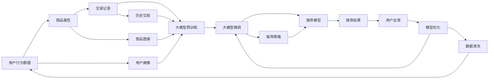

                 

# 电商平台的AI 大模型转型：搜索推荐系统是核心，数据质量是关键

## 1. 背景介绍

近年来，随着人工智能技术的迅猛发展，各大电商平台纷纷加速AI转型，以期在激烈的市场竞争中抢占先机。AI技术的应用，不仅提升了电商平台的运营效率，也大大改善了用户的购物体验。在这一过程中，大模型作为一项颠覆性技术，以其强大的计算能力和卓越的性能，迅速成为各大平台重点关注的焦点。

### 1.1 大模型崛起的原因
大模型之所以在电商领域受到青睐，主要有以下几个原因：

1. **计算能力强**：大模型拥有海量参数和巨量训练数据，能够处理更复杂的数据结构和任务，如图像、语音、自然语言处理等。
2. **泛化能力强**：经过大规模预训练，大模型能够在不同场景下进行微调，适用于多种业务场景。
3. **学习能力强大**：能够通过自我调整参数，逐步提升自身性能，适应电商平台的业务变化。
4. **应用广泛**：除了搜索推荐系统，大模型还在广告投放、个性化营销、客服机器人等领域发挥着重要作用。

### 1.2 大模型的挑战
尽管大模型具有诸多优势，但在实际应用中也面临一些挑战：

1. **计算资源需求高**：训练和推理大模型需要强大的计算资源，对硬件设施要求较高。
2. **数据质量依赖大**：大模型的性能高度依赖于输入数据的丰富性和质量，数据噪声和不完整性会影响模型效果。
3. **可解释性问题**：大模型的决策过程较为复杂，缺乏可解释性，对模型调试和维护带来挑战。

## 2. 核心概念与联系

### 2.1 核心概念概述

为了更好地理解大模型在电商平台的搜索推荐系统中的应用，本节将介绍几个关键概念：

1. **大模型(Large Model)**：指参数量达数十亿、甚至数百亿的深度学习模型，如BERT、GPT-3等。通过大规模预训练，大模型学习到丰富的语义表示和知识图谱，具备强大的语言理解和生成能力。
2. **搜索推荐系统(Recommender System)**：利用用户行为数据、商品属性和历史数据，为用户提供个性化的商品推荐。大模型通过微调可以适应不同电商平台的特定推荐策略。
3. **数据质量**：数据的质量和完整性直接影响大模型的训练效果。电商平台的搜索推荐系统需要大量高质量的数据，包括用户行为数据、商品属性、交易记录等。
4. **可解释性**：指模型的决策过程是否透明、易理解，在电商平台的业务场景中尤为重要。对推荐结果的解释能够增强用户信任，提高满意度。
5. **模型适配**：针对电商平台的特定业务需求，对大模型进行微调，以适应不同电商平台的推荐策略和用户行为。

### 2.2 核心概念原理和架构的 Mermaid 流程图



这个流程图展示了从用户行为数据到推荐结果的整个流程：

1. 用户行为数据、商品属性和交易记录作为原始数据输入到模型预训练。
2. 通过微调，将大模型适配到推荐系统。
3. 推荐模型结合用户画像、商品图谱和历史交易，生成推荐结果。
4. 用户反馈用于模型优化，不断提升推荐效果。
5. 数据清洗环节确保输入数据的高质量，影响着推荐系统的性能。

## 3. 核心算法原理 & 具体操作步骤

### 3.1 算法原理概述

大模型在电商平台的搜索推荐系统中的核心应用在于其强大的计算能力和泛化能力。基于大模型的微调方法，能够将预训练得到的知识进行特定化，适应电商平台的推荐需求。

假设用户的行为数据为 $U=\{(u_i,v_i)\}_{i=1}^N$，其中 $u_i$ 为用户的ID，$v_i$ 为商品ID。预训练的大模型为 $M_\theta$，经过微调后能够输出用户对每个商品的评分 $p_{u_i,v_i}$。微调的目标是找到最优参数 $\hat{\theta}$，使得：

$$
\hat{\theta} = \mathop{\arg\min}_{\theta} \sum_{i=1}^N (p_{u_i,v_i} - y_i)^2
$$

其中 $y_i$ 为用户对商品 $v_i$ 的评分。

通过梯度下降等优化算法，微调过程不断更新模型参数 $\theta$，最小化损失函数，使得模型输出逼近真实标签。由于 $\theta$ 已经通过预训练获得了较好的初始化，因此即便在小规模数据集上进行微调，也能较快收敛到理想的模型参数 $\hat{\theta}$。

### 3.2 算法步骤详解

大模型在电商平台的搜索推荐系统中的微调步骤一般包括以下几个关键步骤：

**Step 1: 准备数据集和模型**
- 收集电商平台的用户行为数据、商品属性和历史交易记录，构建标注数据集 $D=\{(x_i,y_i)\}_{i=1}^N$。
- 选择合适的预训练语言模型 $M_{\theta}$，如BERT、GPT-3等。

**Step 2: 设计任务适配层**
- 根据电商平台的推荐需求，设计适合的任务适配层。例如，对于基于CTR的推荐，可以使用线性分类器；对于基于序列的推荐，可以使用RNN或Transformer。
- 定义损失函数。对于二分类任务，可以使用二元交叉熵损失；对于回归任务，可以使用均方误差损失。

**Step 3: 设置微调超参数**
- 选择合适的优化算法及其参数，如Adam、SGD等，设置学习率、批大小、迭代轮数等。
- 设置正则化技术及强度，包括L2正则、Dropout、Early Stopping等。
- 确定冻结预训练参数的策略，如仅微调顶层，或全部参数都参与微调。

**Step 4: 执行梯度训练**
- 将训练集数据分批次输入模型，前向传播计算损失函数。
- 反向传播计算参数梯度，根据设定的优化算法和学习率更新模型参数。
- 周期性在验证集上评估模型性能，根据性能指标决定是否触发Early Stopping。
- 重复上述步骤直到满足预设的迭代轮数或Early Stopping条件。

**Step 5: 测试和部署**
- 在测试集上评估微调后模型 $M_{\hat{\theta}}$ 的性能，对比微调前后的精度提升。
- 使用微调后的模型对新商品进行评分预测，集成到实际的应用系统中。
- 持续收集新的用户行为数据，定期重新微调模型，以适应数据分布的变化。

### 3.3 算法优缺点

大模型在电商平台的搜索推荐系统中的微调方法具有以下优点：

1. **计算效率高**：大模型具有强大的计算能力，能够处理大规模数据，快速生成推荐结果。
2. **泛化能力强**：经过预训练的大模型具备丰富的语言知识，能够在不同电商平台上快速适应，提高推荐精度。
3. **适应性强**：通过微调，可以灵活适配电商平台的特定推荐策略，满足个性化需求。

同时，该方法也存在一些局限性：

1. **数据依赖性强**：微调效果高度依赖于标注数据的质量和数量，数据噪声和不完整性会影响模型效果。
2. **可解释性不足**：大模型的决策过程较为复杂，缺乏可解释性，难以对其推理逻辑进行分析和调试。
3. **计算资源需求高**：训练和推理大模型需要强大的计算资源，对硬件设施要求较高。

### 3.4 算法应用领域

大模型在电商平台的搜索推荐系统中的应用非常广泛，涵盖从广告投放、个性化推荐到用户行为分析等多个方面：

- **广告投放**：利用大模型预测用户对不同广告的响应概率，优化广告投放策略，提高广告效果。
- **个性化推荐**：通过用户行为数据和商品属性，生成个性化推荐列表，提升用户满意度。
- **用户行为分析**：分析用户点击、浏览、购买等行为数据，预测用户偏好，优化商品排序。
- **客服机器人**：利用大模型生成自然语言对话，提升用户交互体验。
- **舆情分析**：分析用户评论和反馈，评估商品质量和用户满意度，优化商品和客服策略。

除了上述这些经典应用外，大模型还将在电商平台的更多场景中得到应用，如智能客服、智能搜索、智能广告等，为电商平台的智能化转型提供新的技术路径。

## 4. 数学模型和公式 & 详细讲解  
### 4.1 数学模型构建

本节将使用数学语言对大模型在电商平台的搜索推荐系统中的应用进行更加严格的刻画。

假设电商平台的商品为 $V$，用户为 $U$。用户行为数据 $U=\{(u_i,v_i)\}_{i=1}^N$，其中 $u_i$ 为用户的ID，$v_i$ 为商品ID。用户对商品 $v_i$ 的评分 $y_i$ 为0或1，表示是否购买。预训练的大模型为 $M_{\theta}$，经过微调后能够输出用户对每个商品的评分 $p_{u_i,v_i}$。

微调的目标是最小化预测评分与实际评分之间的差异，即：

$$
\hat{\theta} = \mathop{\arg\min}_{\theta} \sum_{i=1}^N (p_{u_i,v_i} - y_i)^2
$$

其中，$p_{u_i,v_i}=M_{\theta}(x_i)$，$x_i$ 为用户的ID和商品ID的序列表示。

### 4.2 公式推导过程

以下是利用二分类交叉熵损失函数进行微调的目标函数推导：

设用户 $u_i$ 对商品 $v_i$ 的评分 $p_{u_i,v_i}$ 为：

$$
p_{u_i,v_i} = \sigma(W^\top M_{\theta}(u_i,v_i)) = \frac{1}{1+e^{-W^\top M_{\theta}(u_i,v_i)}}
$$

其中，$W$ 为输出层的权重矩阵，$\sigma$ 为sigmoid函数。

微调的目标函数为：

$$
\mathcal{L}(\theta) = -\frac{1}{N}\sum_{i=1}^N y_i\log p_{u_i,v_i} + (1-y_i)\log (1-p_{u_i,v_i})
$$

使用随机梯度下降等优化算法更新参数 $\theta$，最小化损失函数 $\mathcal{L}(\theta)$，使得模型输出逼近真实评分 $y_i$。

### 4.3 案例分析与讲解

假设电商平台的推荐系统使用点击率预测模型。对于每个用户 $u_i$ 和商品 $v_i$，模型的预测评分 $p_{u_i,v_i}$ 为：

$$
p_{u_i,v_i} = M_{\theta}(u_i,v_i) = [W_1; W_2]M_{\theta}(u_i)M_{\theta}(v_i)^\top [W_3; W_4]^\top
$$

其中，$M_{\theta}(u_i)$ 和 $M_{\theta}(v_i)$ 分别为用户和商品的嵌入表示，$W_1, W_2, W_3, W_4$ 为可训练的权重矩阵。

微调的目标函数为：

$$
\mathcal{L}(\theta) = -\frac{1}{N}\sum_{i=1}^N y_i\log p_{u_i,v_i} + (1-y_i)\log (1-p_{u_i,v_i})
$$

利用随机梯度下降等优化算法更新参数 $\theta$，最小化损失函数 $\mathcal{L}(\theta)$，使得模型输出逼近真实评分 $y_i$。

## 5. 项目实践：代码实例和详细解释说明

### 5.1 开发环境搭建

在进行大模型微调实践前，我们需要准备好开发环境。以下是使用Python进行PyTorch开发的环境配置流程：

1. 安装Anaconda：从官网下载并安装Anaconda，用于创建独立的Python环境。

2. 创建并激活虚拟环境：
```bash
conda create -n pytorch-env python=3.8 
conda activate pytorch-env
```

3. 安装PyTorch：根据CUDA版本，从官网获取对应的安装命令。例如：
```bash
conda install pytorch torchvision torchaudio cudatoolkit=11.1 -c pytorch -c conda-forge
```

4. 安装Transformers库：
```bash
pip install transformers
```

5. 安装各类工具包：
```bash
pip install numpy pandas scikit-learn matplotlib tqdm jupyter notebook ipython
```

完成上述步骤后，即可在`pytorch-env`环境中开始微调实践。

### 5.2 源代码详细实现

下面我们以点击率预测为例，给出使用Transformers库对BERT模型进行微调的PyTorch代码实现。

首先，定义模型和优化器：

```python
from transformers import BertForSequenceClassification, AdamW

model = BertForSequenceClassification.from_pretrained('bert-base-cased', num_labels=2)

optimizer = AdamW(model.parameters(), lr=2e-5)
```

接着，定义训练和评估函数：

```python
from torch.utils.data import DataLoader
from tqdm import tqdm
from sklearn.metrics import roc_auc_score

device = torch.device('cuda') if torch.cuda.is_available() else torch.device('cpu')
model.to(device)

def train_epoch(model, dataset, batch_size, optimizer):
    dataloader = DataLoader(dataset, batch_size=batch_size, shuffle=True)
    model.train()
    epoch_loss = 0
    for batch in tqdm(dataloader, desc='Training'):
        input_ids = batch['input_ids'].to(device)
        attention_mask = batch['attention_mask'].to(device)
        labels = batch['labels'].to(device)
        model.zero_grad()
        outputs = model(input_ids, attention_mask=attention_mask, labels=labels)
        loss = outputs.loss
        epoch_loss += loss.item()
        loss.backward()
        optimizer.step()
    return epoch_loss / len(dataloader)

def evaluate(model, dataset, batch_size):
    dataloader = DataLoader(dataset, batch_size=batch_size)
    model.eval()
    preds, labels = [], []
    with torch.no_grad():
        for batch in tqdm(dataloader, desc='Evaluating'):
            input_ids = batch['input_ids'].to(device)
            attention_mask = batch['attention_mask'].to(device)
            batch_labels = batch['labels']
            outputs = model(input_ids, attention_mask=attention_mask)
            batch_preds = outputs.logits.argmax(dim=1).to('cpu').tolist()
            batch_labels = batch_labels.to('cpu').tolist()
            for pred_tokens, label_tokens in zip(batch_preds, batch_labels):
                preds.append(pred_tokens)
                labels.append(label_tokens)
                
    print(f'ROC-AUC score: {roc_auc_score(labels, preds)}')
```

最后，启动训练流程并在测试集上评估：

```python
epochs = 5
batch_size = 16

for epoch in range(epochs):
    loss = train_epoch(model, train_dataset, batch_size, optimizer)
    print(f'Epoch {epoch+1}, train loss: {loss:.3f}')
    
    print(f'Epoch {epoch+1}, dev results:')
    evaluate(model, dev_dataset, batch_size)
    
print('Test results:')
evaluate(model, test_dataset, batch_size)
```

以上就是使用PyTorch对BERT进行点击率预测任务的微调完整代码实现。可以看到，借助Transformers库，开发者能够快速迭代并验证不同模型的效果。

### 5.3 代码解读与分析

让我们再详细解读一下关键代码的实现细节：

**BertForSequenceClassification类**：
- `from_pretrained`方法：从HuggingFace的预训练模型库中加载预训练的BERT模型。
- `num_labels`参数：指定二分类任务，即点击率预测。

**train_epoch函数**：
- `dataloader`对象：通过DataLoader对数据集进行批次化加载。
- `model.train()`：将模型置于训练模式。
- `epoch_loss`变量：记录每个epoch的平均损失。
- `model.zero_grad()`：清空梯度缓存。
- `loss.backward()`：反向传播计算梯度。
- `optimizer.step()`：更新模型参数。

**evaluate函数**：
- `dataloader`对象：加载数据集，用于评估。
- `model.eval()`：将模型置于评估模式。
- `preds`和`labels`变量：记录预测结果和真实标签。
- `roc_auc_score`函数：计算ROC-AUC分数，评估模型性能。

**训练流程**：
- `epochs`变量：设置总的epoch数。
- `batch_size`变量：设置每个batch的样本数。
- 每个epoch内，先在训练集上训练，输出平均loss。
- 在验证集上评估，输出ROC-AUC分数。
- 所有epoch结束后，在测试集上评估，给出最终测试结果。

可以看到，借助Transformers库，大模型的微调变得简单高效。开发者可以在短时期内实现从模型加载到评估的完整流程，快速迭代优化模型效果。

当然，工业级的系统实现还需考虑更多因素，如模型保存和部署、超参数的自动搜索、更灵活的任务适配层等。但核心的微调范式基本与此类似。

## 6. 实际应用场景

### 6.1 智能广告投放

基于大模型微调的搜索推荐系统，可以广泛应用于智能广告投放中。通过分析用户的历史点击行为，智能广告系统能够推荐用户可能感兴趣的广告，提升广告点击率和转化率。

在技术实现上，可以收集用户的历史点击记录、搜索关键词和浏览记录等数据，构建标注数据集。在此基础上对预训练模型进行微调，使其能够根据用户的行为预测其对不同广告的反应。微调后的模型能够实时推荐广告，提高广告投放的精准度。

### 6.2 个性化推荐系统

个性化推荐系统是电商平台的核心竞争力之一。通过分析用户的历史购买记录和浏览行为，电商平台可以为用户推荐个性化商品。

在技术实现上，可以收集用户的行为数据和商品属性，构建标注数据集。在此基础上对预训练模型进行微调，使其能够根据用户的行为预测其对不同商品的兴趣。微调后的模型能够生成个性化推荐列表，提升用户的购物体验和满意度。

### 6.3 智能客服系统

智能客服系统是提升电商平台用户体验的重要手段。通过分析用户的查询记录和历史对话记录，智能客服系统能够自动回复用户的问题，减少人工客服的负担。

在技术实现上，可以收集用户的查询记录和历史对话记录等数据，构建标注数据集。在此基础上对预训练模型进行微调，使其能够根据用户的问题生成合适的回答。微调后的模型能够自动进行用户交互，提升客服效率和用户体验。

### 6.4 未来应用展望

随着大模型微调技术的不断进步，未来的电商推荐系统将更加智能化、个性化和高效化。

1. **动态调整**：未来的推荐系统能够根据用户的实时行为动态调整推荐策略，实现更精准的个性化推荐。
2. **多模态融合**：未来的推荐系统将融合视觉、语音、文本等多种数据，实现更全面的用户画像。
3. **实时推荐**：未来的推荐系统能够实时分析用户行为，实现秒级推荐，提升用户体验。
4. **跨平台协同**：未来的推荐系统能够跨多个电商平台进行协同推荐，实现无缝切换的用户体验。
5. **对抗训练**：未来的推荐系统能够引入对抗训练，提升模型的鲁棒性和安全性。

此外，在智能广告、智能客服、智能搜索等电商平台的更多场景中，基于大模型的微调技术也将不断应用，为电商平台的智能化转型提供新的技术路径。相信随着预训练语言模型和微调方法的持续演进，未来的推荐系统将变得更加智能、高效和可解释，进一步推动电商平台的数字化转型。

## 7. 工具和资源推荐

### 7.1 学习资源推荐

为了帮助开发者系统掌握大模型在电商平台的搜索推荐系统中的应用，这里推荐一些优质的学习资源：

1. 《Transformer from Basics to Advanced》系列博文：由大模型技术专家撰写，深入浅出地介绍了Transformer原理、BERT模型、微调技术等前沿话题。
2. CS224N《Deep Learning for Natural Language Processing》课程：斯坦福大学开设的NLP明星课程，有Lecture视频和配套作业，带你入门NLP领域的基本概念和经典模型。
3. 《Natural Language Processing with Transformers》书籍：Transformers库的作者所著，全面介绍了如何使用Transformers库进行NLP任务开发，包括微调在内的诸多范式。
4. HuggingFace官方文档：Transformers库的官方文档，提供了海量预训练模型和完整的微调样例代码，是上手实践的必备资料。
5. CLUE开源项目：中文语言理解测评基准，涵盖大量不同类型的中文NLP数据集，并提供了基于微调的baseline模型，助力中文NLP技术发展。

通过对这些资源的学习实践，相信你一定能够快速掌握大模型在电商平台的搜索推荐系统中的应用，并用于解决实际的NLP问题。

### 7.2 开发工具推荐

高效的开发离不开优秀的工具支持。以下是几款用于大模型微调开发的常用工具：

1. PyTorch：基于Python的开源深度学习框架，灵活动态的计算图，适合快速迭代研究。大部分预训练语言模型都有PyTorch版本的实现。
2. TensorFlow：由Google主导开发的开源深度学习框架，生产部署方便，适合大规模工程应用。同样有丰富的预训练语言模型资源。
3. Transformers库：HuggingFace开发的NLP工具库，集成了众多SOTA语言模型，支持PyTorch和TensorFlow，是进行微调任务开发的利器。
4. Weights & Biases：模型训练的实验跟踪工具，可以记录和可视化模型训练过程中的各项指标，方便对比和调优。与主流深度学习框架无缝集成。
5. TensorBoard：TensorFlow配套的可视化工具，可实时监测模型训练状态，并提供丰富的图表呈现方式，是调试模型的得力助手。
6. Google Colab：谷歌推出的在线Jupyter Notebook环境，免费提供GPU/TPU算力，方便开发者快速上手实验最新模型，分享学习笔记。

合理利用这些工具，可以显著提升大模型微调任务的开发效率，加快创新迭代的步伐。

### 7.3 相关论文推荐

大模型在电商平台的搜索推荐系统中的应用源于学界的持续研究。以下是几篇奠基性的相关论文，推荐阅读：

1. Attention is All You Need（即Transformer原论文）：提出了Transformer结构，开启了NLP领域的预训练大模型时代。
2. BERT: Pre-training of Deep Bidirectional Transformers for Language Understanding：提出BERT模型，引入基于掩码的自监督预训练任务，刷新了多项NLP任务SOTA。
3. Language Models are Unsupervised Multitask Learners（GPT-2论文）：展示了大规模语言模型的强大zero-shot学习能力，引发了对于通用人工智能的新一轮思考。
4. Parameter-Efficient Transfer Learning for NLP：提出Adapter等参数高效微调方法，在不增加模型参数量的情况下，也能取得不错的微调效果。
5. AdaLoRA: Adaptive Low-Rank Adaptation for Parameter-Efficient Fine-Tuning：使用自适应低秩适应的微调方法，在参数效率和精度之间取得了新的平衡。
6. Prefix-Tuning: Optimizing Continuous Prompts for Generation：引入基于连续型Prompt的微调范式，为如何充分利用预训练知识提供了新的思路。

这些论文代表了大模型微调技术的发展脉络。通过学习这些前沿成果，可以帮助研究者把握学科前进方向，激发更多的创新灵感。

## 8. 总结：未来发展趋势与挑战

### 8.1 总结

本文对大模型在电商平台的搜索推荐系统中的应用进行了全面系统的介绍。首先阐述了大模型在电商领域的崛起背景和应用意义，明确了搜索推荐系统作为核心应用的独特价值。其次，从原理到实践，详细讲解了大模型微调的理论基础和操作步骤，给出了微调任务开发的完整代码实例。同时，本文还广泛探讨了微调方法在智能广告、个性化推荐、智能客服等多个电商平台的推荐场景中的应用前景，展示了微调范式的巨大潜力。此外，本文精选了微调技术的各类学习资源，力求为开发者提供全方位的技术指引。

通过本文的系统梳理，可以看到，基于大模型的微调方法正在成为电商推荐系统的核心技术，极大地拓展了预训练语言模型的应用边界，催生了更多的落地场景。得益于大规模语料的预训练，微调模型以更低的时间和标注成本，在小样本条件下也能取得不俗的效果，有力推动了电商平台的智能化转型。未来，伴随预训练语言模型和微调方法的持续演进，相信推荐系统将变得更加智能、高效和可解释，进一步推动电商平台的数字化转型。

### 8.2 未来发展趋势

展望未来，大模型在电商平台的搜索推荐系统中的微调技术将呈现以下几个发展趋势：

1. **计算效率提升**：随着硬件设备的不断升级和算法优化，大模型的计算效率将进一步提升，支持更复杂和实时化的推荐应用。
2. **数据质量改善**：随着数据收集和清洗技术的进步，电商平台的推荐系统将依赖更高质量的数据，提升模型效果。
3. **多模态融合**：未来的推荐系统将融合视觉、语音、文本等多种数据，实现更全面的用户画像。
4. **动态调整优化**：未来的推荐系统能够根据用户的实时行为动态调整推荐策略，实现更精准的个性化推荐。
5. **跨平台协同**：未来的推荐系统能够跨多个电商平台进行协同推荐，实现无缝切换的用户体验。
6. **对抗训练与鲁棒性**：未来的推荐系统将引入对抗训练，提升模型的鲁棒性和安全性。

以上趋势凸显了大模型微调技术的广阔前景。这些方向的探索发展，必将进一步提升推荐系统的性能和应用范围，为电商平台的智能化转型提供新的技术路径。

### 8.3 面临的挑战

尽管大模型在电商平台的搜索推荐系统中的应用取得了显著成果，但在迈向更加智能化、普适化应用的过程中，仍面临诸多挑战：

1. **计算资源瓶颈**：训练和推理大模型需要强大的计算资源，对硬件设施要求较高。如何降低计算成本，优化资源配置，是一个重要的研究方向。
2. **数据质量依赖**：电商平台的推荐系统高度依赖标注数据的质量和数量，数据噪声和不完整性会影响模型效果。如何提高数据质量，降低标注成本，是一个重要的研究方向。
3. **可解释性问题**：大模型的决策过程较为复杂，缺乏可解释性，难以对其推理逻辑进行分析和调试。如何赋予模型更强的可解释性，增强用户信任，是一个重要的研究方向。
4. **模型鲁棒性问题**：当前模型面对域外数据时，泛化性能往往大打折扣。如何提高模型的鲁棒性，避免灾难性遗忘，还需要更多理论和实践的积累。
5. **动态优化问题**：随着用户行为的变化，推荐系统需要实时调整模型参数，以适应新的数据分布。如何在保证性能的同时，提高模型的动态优化能力，是一个重要的研究方向。

### 8.4 研究展望

面对大模型在电商平台的搜索推荐系统中的挑战，未来的研究需要在以下几个方面寻求新的突破：

1. **参数高效微调方法**：开发更加参数高效的微调方法，在固定大部分预训练参数的同时，只更新极少量的任务相关参数，提高模型效率。
2. **多模态融合技术**：融合视觉、语音、文本等多种数据，实现更全面的用户画像，提升推荐精度。
3. **动态优化算法**：设计实时动态优化算法，根据用户行为实时调整模型参数，提升推荐效果。
4. **对抗训练技术**：引入对抗训练，提升模型的鲁棒性和安全性，降低恶意攻击的风险。
5. **可解释性增强**：通过引入可解释性技术，如因果推理、逻辑回归等，增强模型的可解释性，提升用户信任。
6. **数据质量提升**：改进数据收集和清洗技术，提高标注数据的质量和数量，降低模型偏差。

这些研究方向的探索，必将引领大模型微调技术迈向更高的台阶，为构建更加智能、高效、安全的推荐系统提供新的技术路径。

## 9. 附录：常见问题与解答

**Q1：大模型微调对电商平台有什么优势？**

A: 大模型微调在电商平台中的应用具有以下优势：

1. **计算效率高**：大模型具有强大的计算能力，能够处理大规模数据，快速生成推荐结果。
2. **泛化能力强**：经过预训练的大模型具备丰富的语言知识，能够在不同电商平台上快速适应，提高推荐精度。
3. **适应性强**：通过微调，可以灵活适配电商平台的特定推荐策略，满足个性化需求。
4. **可解释性强**：大模型的决策过程较为复杂，但可以通过微调引入可解释性技术，增强模型的透明度和可信度。

**Q2：大模型微调需要哪些关键数据？**

A: 大模型微调需要以下关键数据：

1. **用户行为数据**：包括用户的点击、浏览、搜索、购买等行为记录。
2. **商品属性数据**：包括商品的价格、分类、描述等信息。
3. **历史交易数据**：包括用户的购买记录和商品的交易信息。
4. **用户画像数据**：包括用户的年龄、性别、兴趣偏好等信息。
5. **广告投放数据**：包括广告的展示次数、点击次数、转化率等信息。

这些数据将作为标注数据集，用于训练和微调大模型。

**Q3：大模型微调在电商推荐中的常见问题有哪些？**

A: 大模型微调在电商推荐中可能面临以下常见问题：

1. **数据不平衡**：电商平台的推荐系统可能会面临数据不平衡的问题，即某些商品或用户的行为数据较少，导致模型对这类商品或用户的行为预测不准确。
2. **模型过拟合**：电商平台的推荐系统可能会面临模型过拟合的问题，即模型对训练数据过度学习，导致在测试数据上的表现不佳。
3. **计算资源不足**：训练和推理大模型需要强大的计算资源，对硬件设施要求较高。
4. **可解释性不足**：大模型的决策过程较为复杂，缺乏可解释性，难以对其推理逻辑进行分析和调试。
5. **动态优化问题**：随着用户行为的变化，推荐系统需要实时调整模型参数，以适应新的数据分布。

**Q4：如何提高大模型微调的性能？**

A: 提高大模型微调的性能可以从以下几个方面入手：

1. **数据清洗与增强**：提高数据的质量和多样性，减少数据噪声和偏差。
2. **参数高效微调**：采用参数高效微调方法，如Adapter、Prefix等，只更新极少量的任务相关参数。
3. **动态优化算法**：设计实时动态优化算法，根据用户行为实时调整模型参数。
4. **对抗训练**：引入对抗训练，提升模型的鲁棒性和安全性，降低恶意攻击的风险。
5. **可解释性增强**：通过引入可解释性技术，如因果推理、逻辑回归等，增强模型的可解释性。
6. **多模态融合**：融合视觉、语音、文本等多种数据，实现更全面的用户画像。

通过以上方法，可以显著提升大模型微调的性能和应用效果。

**Q5：大模型微调在电商推荐中的应用前景如何？**

A: 大模型微调在电商推荐中的应用前景非常广阔，能够显著提升推荐系统的性能和用户体验。具体表现如下：

1. **个性化推荐**：通过分析用户的历史行为和偏好，生成个性化推荐列表，提升用户满意度。
2. **实时推荐**：通过实时分析用户行为，实现秒级推荐，提升用户体验。
3. **多模态融合**：融合视觉、语音、文本等多种数据，实现更全面的用户画像，提升推荐精度。
4. **动态优化**：根据用户行为实时调整推荐策略，实现更精准的个性化推荐。
5. **跨平台协同**：跨多个电商平台进行协同推荐，实现无缝切换的用户体验。
6. **对抗训练**：提升模型的鲁棒性和安全性，降低恶意攻击的风险。

总之，大模型微调在电商推荐中的应用将为电商平台带来更大的竞争优势，推动电商平台的智能化转型。

---

作者：禅与计算机程序设计艺术 / Zen and the Art of Computer Programming

