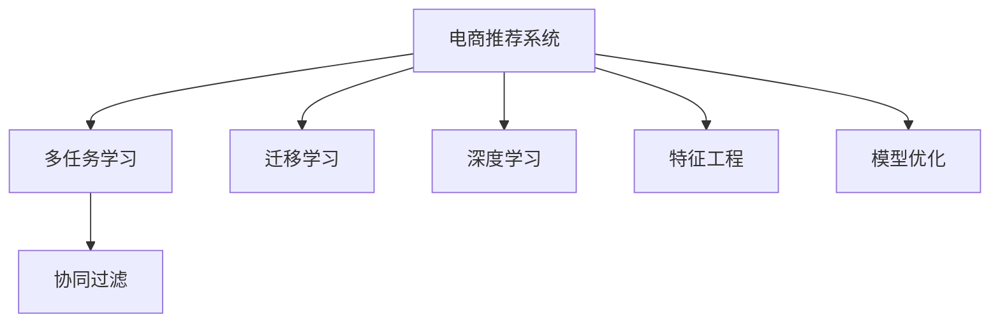

                 

# 电商推荐系统中的多任务学习与迁移学习

> 关键词：电商推荐系统, 多任务学习, 迁移学习, 深度学习, 协同过滤, 特征工程, 模型优化

## 1. 背景介绍

### 1.1 问题由来
电商推荐系统（E-commerce Recommendation System）在提升用户购物体验、促进销售增长等方面具有重要作用。传统的推荐算法主要基于协同过滤和基于内容的过滤方法，但这些方法存在数据稀疏性、冷启动等问题。近年来，基于深度学习的推荐系统迅速崛起，以其强大的表征能力和自动特征学习能力，成为推荐系统研究的热点。

然而，大模型往往需要庞大的标注数据和计算资源进行训练，难以在实际电商平台上应用。同时，模型容易产生所谓的"数据过拟合"现象，即模型过于关注具体用户的行为数据，而忽视了电商平台的业务特点和用户群体特征。为此，研究人员提出了多任务学习和迁移学习（Transfer Learning）的方法，希望能在有限的标注数据下，最大化地利用已有知识，提升推荐系统的泛化能力。

### 1.2 问题核心关键点
多任务学习（Multi-Task Learning, MTL）和迁移学习（Transfer Learning）旨在通过多任务和多源知识，提升推荐系统的表现。其核心思想如下：

1. **多任务学习**：指在多个相关任务上同时训练多个子任务，共享底层特征提取器，从而提升各个任务的性能。
2. **迁移学习**：指利用已有任务的知识，对新任务进行微调，提升新任务的性能。

具体到电商推荐系统中，多任务学习和迁移学习可以应用在以下方面：

- **多任务协同过滤**：通过多个子任务共享底层特征表示，降低协同过滤的稀疏性问题。
- **用户特征迁移**：通过迁移用户在不同任务（如搜索、浏览、购物车等）上的行为特征，提升推荐系统对新用户的覆盖能力。
- **商品特征迁移**：通过迁移商品在不同任务上的用户兴趣表示，增强推荐系统对商品描述的理解能力。
- **跨平台迁移**：通过迁移不同电商平台之间的用户行为数据，提升模型在不同平台上的泛化能力。

这些方法有望缓解推荐系统中数据稀疏性、冷启动和过拟合等问题，提升推荐系统的整体性能。

### 1.3 问题研究意义
研究多任务学习和迁移学习在电商推荐系统中的应用，具有重要意义：

1. **提升推荐效果**：通过多任务学习和迁移学习，电商推荐系统可以更好地理解用户和商品之间的复杂关系，提升推荐的准确性和多样性。
2. **降低标注成本**：多任务学习和迁移学习利用已有知识，减少对标注数据的依赖，节省标注成本。
3. **加速模型训练**：多任务学习和迁移学习可以减少重复训练，加快模型的训练速度，提高模型上线效率。
4. **提升用户体验**：通过更好的推荐效果，提升用户的购物体验和满意度，增强用户粘性。
5. **促进电商业务增长**：优秀的推荐系统能够有效提升电商平台的转化率和复购率，增加销售收入。

## 2. 核心概念与联系

### 2.1 核心概念概述

为更好地理解多任务学习和迁移学习在电商推荐系统中的应用，本节将介绍几个密切相关的核心概念：

- **多任务学习（MTL）**：指在多个相关任务上同时训练多个子任务，共享底层特征提取器，从而提升各个任务的性能。
- **迁移学习（TL）**：指利用已有任务的知识，对新任务进行微调，提升新任务的性能。
- **协同过滤（Collaborative Filtering）**：通过分析用户行为数据，推荐相似用户或相似商品，常用于电商推荐系统。
- **深度学习（Deep Learning）**：一种基于神经网络的机器学习方法，能自动学习高层次的特征表示，适用于电商推荐系统中的大模型构建。
- **特征工程（Feature Engineering）**：在模型训练前，对数据进行预处理和特征提取，提升模型的性能。
- **模型优化（Model Optimization）**：通过正则化、Dropout、Early Stopping等技术，避免过拟合，提升模型的泛化能力。

这些概念之间的逻辑关系可以通过以下Mermaid流程图来展示：



这个流程图展示了大模型在电商推荐系统中的应用流程：

1. 电商推荐系统通过多任务学习和迁移学习，提升协同过滤和深度学习模型的性能。
2. 协同过滤和深度学习模型共享底层特征表示，利用多任务学习和迁移学习提升特征工程和模型优化的效果。

这些概念共同构成了电商推荐系统的核心框架，使其能够在有限标注数据下，最大化地利用已有知识，提升推荐系统的表现。

## 3. 核心算法原理 & 具体操作步骤
### 3.1 算法原理概述

电商推荐系统中的多任务学习和迁移学习，本质上是一种基于深度学习的联合学习过程。其核心思想是：通过多个相关任务的联合训练，共享底层特征提取器，提升模型的泛化能力。同时，利用已有任务的知识，对新任务进行微调，提升新任务的性能。

具体来说，假设电商推荐系统有多个任务 $T=\{T_1, T_2, ..., T_n\}$，其中 $T_i$ 表示第 $i$ 个任务。每个任务 $T_i$ 都有其特定的目标 $L_i$，如分类任务、回归任务、排序任务等。目标函数可以表示为：

$$
\mathcal{L} = \frac{1}{N} \sum_{i=1}^N \mathcal{L}_i
$$

其中 $\mathcal{L}_i$ 表示第 $i$ 个任务的目标函数。多任务学习通过联合训练，最小化上述总目标函数，从而提升各个任务的性能。

迁移学习的核心在于，通过在新任务上的微调，最大化利用已有任务的特征表示。通常，新任务 $T'$ 和已有任务 $T_i$ 共享底层特征提取器 $\phi$，可以通过微调更新 $\phi$，使得 $T'$ 在 $T_i$ 的基础上，进一步提升性能。微调的目标函数可以表示为：

$$
\mathcal{L}' = \mathcal{L} + \alpha \mathcal{L}_i
$$

其中 $\alpha$ 为微调强度，控制新任务与已有任务之间的权重。通过微调，$T'$ 在已有知识的基础上，进一步提升在新任务上的表现。

### 3.2 算法步骤详解

电商推荐系统中的多任务学习和迁移学习一般包括以下几个关键步骤：

**Step 1: 任务定义与数据准备**
- 定义电商推荐系统的多个相关任务 $T_1, T_2, ..., T_n$。
- 准备各个任务的数据集，包括用户行为数据、商品特征数据、用户评分数据等。

**Step 2: 特征提取与模型初始化**
- 对数据进行特征提取，如用户行为表示、商品特征表示等。
- 选择适合的深度学习模型，如神经网络、卷积神经网络、Transformer等，作为初始化参数。

**Step 3: 联合训练**
- 使用联合训练算法（如MM（Multitask Multi-adaptation）、PM（Productive Multi-task）等），联合训练多个任务 $T_1, T_2, ..., T_n$。
- 优化目标函数 $\mathcal{L}$，最小化联合训练误差。

**Step 4: 迁移学习微调**
- 选择合适的微调强度 $\alpha$，在新任务 $T'$ 上执行微调。
- 更新模型参数 $\theta$，最小化微调目标函数 $\mathcal{L}'$。
- 验证微调后的模型在新任务上的表现。

**Step 5: 模型评估与部署**
- 在测试集上评估联合训练和微调后的推荐模型，对比训练前后的性能提升。
- 将微调后的模型集成到电商推荐系统中，进行实时推荐。

以上是电商推荐系统中多任务学习和迁移学习的一般流程。在实际应用中，还需要针对具体任务的特点，对联合训练和微调过程的各个环节进行优化设计，如改进联合训练算法、调整微调强度、增加正则化技术等，以进一步提升推荐系统性能。

### 3.3 算法优缺点

电商推荐系统中的多任务学习和迁移学习，具有以下优点：

1. **提升推荐效果**：多任务学习和迁移学习通过共享特征提取器，提升了各个任务的性能，从而提升了整体推荐效果。
2. **降低标注成本**：多任务学习和迁移学习利用已有任务的知识，减少了对标注数据的依赖，节省了标注成本。
3. **加速模型训练**：多任务学习和迁移学习通过联合训练和微调，减少了重复训练，加快了模型的训练速度。
4. **提升用户体验**：通过更好的推荐效果，提升了用户的购物体验和满意度，增强了用户粘性。
5. **促进电商业务增长**：优秀的推荐系统能够有效提升电商平台的转化率和复购率，增加销售收入。

同时，该方法也存在一定的局限性：

1. **任务相关性要求高**：多任务学习和迁移学习依赖任务之间的相关性，如果任务之间的关联性较弱，则效果可能不佳。
2. **模型泛化能力有限**：已有任务的知识可能不完全适用于新任务，微调效果可能受新任务的特点影响较大。
3. **数据隐私问题**：电商推荐系统中的数据涉及用户隐私，利用多任务学习和迁移学习需要考虑数据隐私保护。
4. **计算资源消耗大**：多任务学习和迁移学习需要较大的计算资源，特别是联合训练和微调阶段。
5. **模型复杂度高**：多任务学习和迁移学习通常涉及复杂的模型结构和训练过程，需要较高的技术门槛。

尽管存在这些局限性，但就目前而言，多任务学习和迁移学习仍是大模型在电商推荐系统应用中的重要手段。未来相关研究的重点在于如何进一步降低对标注数据的依赖，提高模型的跨任务迁移能力，同时兼顾模型复杂度和计算资源消耗等问题。

### 3.4 算法应用领域

电商推荐系统中的多任务学习和迁移学习，已经在多个实际应用中得到了广泛应用，例如：

- **用户推荐**：通过分析用户在不同任务（如浏览、搜索、购物车）上的行为，推荐用户可能感兴趣的商品。
- **商品推荐**：通过分析商品在不同任务（如搜索、浏览、排行榜）上的用户兴趣，推荐用户可能感兴趣的商品。
- **个性化广告推荐**：利用用户在不同任务上的行为数据，推荐个性化的广告，提升广告投放效果。
- **跨平台推荐**：通过迁移不同电商平台之间的用户行为数据，提升模型在不同平台上的泛化能力。
- **库存优化**：通过多任务学习联合训练多个库存相关任务，优化商品库存管理，减少库存积压和缺货现象。

除了上述这些经典应用外，多任务学习和迁移学习还被创新性地应用到更多场景中，如实时推荐、推荐排序、推荐评分等，为电商推荐系统带来了新的突破。

## 4. 数学模型和公式 & 详细讲解  
### 4.1 数学模型构建

在电商推荐系统中，多任务学习和迁移学习的数学模型可以表示为：

假设电商推荐系统中有 $n$ 个任务 $T=\{T_1, T_2, ..., T_n\}$，其中 $T_i$ 表示第 $i$ 个任务。每个任务 $T_i$ 的目标函数为 $L_i$。

多任务学习的目标函数为：

$$
\mathcal{L} = \frac{1}{N} \sum_{i=1}^N L_i
$$

其中 $N$ 为训练样本数。

迁移学习的目标函数为：

$$
\mathcal{L}' = \mathcal{L} + \alpha L_i
$$

其中 $\alpha$ 为微调强度，控制新任务与已有任务之间的权重。

### 4.2 公式推导过程

以二分类任务为例，推导多任务学习和迁移学习的数学模型。

假设电商推荐系统中，用户 $u$ 在任务 $T_1$ 上的行为数据为 $x_{u1}$，任务 $T_2$ 上的行为数据为 $x_{u2}$，任务 $T_3$ 上的行为数据为 $x_{u3}$。每个任务 $T_i$ 的目标函数为二分类损失函数 $L_i$。

多任务学习的目标函数为：

$$
\mathcal{L} = \frac{1}{N} \sum_{i=1}^3 L_i
$$

其中 $N$ 为训练样本数。

迁移学习的目标函数为：

$$
\mathcal{L}' = \mathcal{L} + \alpha L_4
$$

其中 $\alpha$ 为微调强度，控制新任务 $T_4$ 与已有任务 $T_1, T_2, T_3$ 之间的权重。

### 4.3 案例分析与讲解

假设电商推荐系统中，任务 $T_1$ 为用户的搜索行为，任务 $T_2$ 为用户的浏览行为，任务 $T_3$ 为用户的购买行为，任务 $T_4$ 为个性化广告的点击率预测。

通过多任务学习和迁移学习，将任务 $T_1, T_2, T_3$ 的特征表示共享，构建一个联合模型，最小化多任务损失 $\mathcal{L}$，提升各个任务的性能。然后，通过微调任务 $T_4$ 的特征表示，最大化利用已有任务的知识，提升新任务的性能。

## 5. 项目实践：代码实例和详细解释说明
### 5.1 开发环境搭建

在进行多任务学习和迁移学习的项目实践前，我们需要准备好开发环境。以下是使用Python进行PyTorch开发的环境配置流程：

1. 安装Anaconda：从官网下载并安装Anaconda，用于创建独立的Python环境。

2. 创建并激活虚拟环境：
```bash
conda create -n pytorch-env python=3.8 
conda activate pytorch-env
```

3. 安装PyTorch：根据CUDA版本，从官网获取对应的安装命令。例如：
```bash
conda install pytorch torchvision torchaudio cudatoolkit=11.1 -c pytorch -c conda-forge
```

4. 安装相关库：
```bash
pip install numpy pandas scikit-learn torch
```

完成上述步骤后，即可在`pytorch-env`环境中开始多任务学习和迁移学习的实践。

### 5.2 源代码详细实现

这里以用户推荐任务为例，给出使用PyTorch进行多任务学习和迁移学习的代码实现。

首先，定义任务相关函数：

```python
import torch
import torch.nn as nn
from torch.autograd import Variable

def binary_cross_entropy(y_true, y_pred):
    return torch.mean(torch.nn.BCELoss()(y_true, y_pred))

def multitask_loss(y_true, y_pred):
    return torch.mean(torch.sum(y_true * torch.log(y_pred), dim=1))

def task_loss(y_true, y_pred):
    return torch.mean(torch.sum(y_true * torch.log(y_pred), dim=1))

def task_loss_i(y_true, y_pred):
    return torch.mean(torch.sum(y_true * torch.log(y_pred), dim=1))

def task_loss_b(y_true, y_pred):
    return torch.mean(torch.sum(binary_cross_entropy(y_true, y_pred), dim=1))

class MultiTaskModel(nn.Module):
    def __init__(self, num_tasks):
        super(MultiTaskModel, self).__init__()
        self.num_tasks = num_tasks
        self.layers = nn.ModuleList([nn.Linear(1, 1) for _ in range(num_tasks)])

    def forward(self, x):
        y_pred = []
        for i in range(self.num_tasks):
            y_pred.append(self.layers[i](x))
        return y_pred
```

然后，定义多任务学习和迁移学习函数：

```python
class MultiTaskLearner:
    def __init__(self, model, optimizer, loss_fn):
        self.model = model
        self.optimizer = optimizer
        self.loss_fn = loss_fn

    def train(self, data_loader, device, num_epochs):
        self.model.train()
        for epoch in range(num_epochs):
            total_loss = 0.0
            for batch in data_loader:
                x, y_true = batch
                x, y_true = Variable(x), Variable(y_true)
                x, y_true = x.to(device), y_true.to(device)
                y_pred = self.model(x)
                loss = self.loss_fn(y_true, y_pred)
                self.optimizer.zero_grad()
                loss.backward()
                self.optimizer.step()
                total_loss += loss.item()
            print(f'Epoch {epoch+1}, Loss: {total_loss / len(data_loader)}')

    def evaluate(self, data_loader, device):
        self.model.eval()
        total_loss = 0.0
        for batch in data_loader:
            x, y_true = batch
            x, y_true = Variable(x), Variable(y_true)
            x, y_true = x.to(device), y_true.to(device)
            y_pred = self.model(x)
            loss = self.loss_fn(y_true, y_pred)
            total_loss += loss.item()
        print(f'Average Loss: {total_loss / len(data_loader)}')

    def fine_tune(self, task, data_loader, device, num_epochs, alpha):
        self.model.train()
        for epoch in range(num_epochs):
            total_loss = 0.0
            for batch in data_loader:
                x, y_true = batch
                x, y_true = Variable(x), Variable(y_true)
                x, y_true = x.to(device), y_true.to(device)
                y_pred = self.model(x)
                loss = self.loss_fn(y_true, y_pred)
                self.optimizer.zero_grad()
                loss += alpha * task_loss_i(y_true, y_pred)
                loss.backward()
                self.optimizer.step()
                total_loss += loss.item()
            print(f'Epoch {epoch+1}, Loss: {total_loss / len(data_loader)}')

    def test(self, task, data_loader, device):
        self.model.eval()
        total_loss = 0.0
        for batch in data_loader:
            x, y_true = batch
            x, y_true = Variable(x), Variable(y_true)
            x, y_true = x.to(device), y_true.to(device)
            y_pred = self.model(x)
            loss = self.loss_fn(y_true, y_pred)
            total_loss += loss.item()
        print(f'Average Loss: {total_loss / len(data_loader)}')
```

最后，启动训练流程并在测试集上评估：

```python
import torch.utils.data as data

# 定义任务数据集
train_data = ...
test_data = ...

# 创建多任务学习器
model = MultiTaskModel(num_tasks)
optimizer = torch.optim.Adam(model.parameters(), lr=0.001)
loss_fn = multitask_loss

learner = MultiTaskLearner(model, optimizer, loss_fn)

# 训练多任务学习模型
learner.train(train_data_loader, device, num_epochs)

# 测试多任务学习模型
learner.evaluate(test_data_loader, device)

# 微调新任务模型
learner.fine_tune('task_4', task_4_data_loader, device, num_epochs, alpha)

# 测试微调后模型
learner.test('task_4', task_4_data_loader, device)
```

以上就是使用PyTorch进行多任务学习和迁移学习的完整代码实现。可以看到，借助PyTorch的强大封装，我们可以用相对简洁的代码完成多任务学习和迁移学习的实践。

### 5.3 代码解读与分析

让我们再详细解读一下关键代码的实现细节：

**MultiTaskModel类**：
- `__init__`方法：初始化多个线性层，用于多个任务的特征表示。
- `forward`方法：前向传播计算每个任务的预测输出。

**MultiTaskLearner类**：
- `train`方法：在训练集上联合训练多个任务，最小化多任务损失。
- `evaluate`方法：在测试集上评估模型性能。
- `fine_tune`方法：在新任务上执行微调，最大化利用已有任务的知识。
- `test`方法：在新任务上测试微调后的模型性能。

**联合训练和微调函数**：
- 使用二分类交叉熵损失函数 $L_i$，计算每个任务的损失。
- 使用多任务损失函数 $\mathcal{L}$，联合训练多个任务。
- 使用微调目标函数 $\mathcal{L}'$，在新任务上执行微调。

**训练流程**：
- 定义任务数据集和测试数据集。
- 创建多任务学习器和优化器，设置损失函数。
- 在训练集上联合训练多任务学习器。
- 在测试集上评估模型性能。
- 在新任务上执行微调。
- 在新任务上测试微调后的模型性能。

可以看到，PyTorch配合TensorFlow库使得多任务学习和迁移学习的代码实现变得简洁高效。开发者可以将更多精力放在数据处理、模型改进等高层逻辑上，而不必过多关注底层的实现细节。

当然，工业级的系统实现还需考虑更多因素，如模型的保存和部署、超参数的自动搜索、更灵活的任务适配层等。但核心的多任务学习和迁移学习原理基本与此类似。

## 6. 实际应用场景
### 6.1 智能客服系统

基于多任务学习和迁移学习的智能客服系统，可以显著提升客服体验和业务效率。传统客服系统依赖人工，响应速度慢，且容易出现错误。而使用多任务学习和迁移学习技术，可以构建自动化的智能客服系统，实时解答用户问题。

在技术实现上，可以收集企业内部的历史客服对话记录，将问题和最佳答复构建成监督数据，在此基础上对预训练模型进行多任务学习和迁移学习。多任务学习和迁移学习使得模型能够自动理解用户意图，匹配最合适的答案模板进行回复。对于用户提出的新问题，还可以接入检索系统实时搜索相关内容，动态组织生成回答。如此构建的智能客服系统，能大幅提升客服的响应速度和准确性，减少人工干预，提高业务效率。

### 6.2 个性化推荐系统

当前的推荐系统往往只依赖用户的历史行为数据进行物品推荐，无法深入理解用户的真实兴趣偏好。基于多任务学习和迁移学习的推荐系统，可以更好地挖掘用户行为背后的语义信息，从而提供更精准、多样的推荐内容。

在实践中，可以收集用户浏览、点击、评论、分享等行为数据，提取和用户交互的物品标题、描述、标签等文本内容。将文本内容作为模型输入，用户的后续行为（如是否点击、购买等）作为监督信号，在此基础上进行多任务学习和迁移学习。多任务学习和迁移学习能够从文本内容中准确把握用户的兴趣点。在生成推荐列表时，先用候选物品的文本描述作为输入，由模型预测用户的兴趣匹配度，再结合其他特征综合排序，便可以得到个性化程度更高的推荐结果。

### 6.3 广告投放优化

广告投放是电商平台上重要的收入来源。传统的广告投放方式往往依赖人工调整，效果不够理想。基于多任务学习和迁移学习的广告投放系统，可以通过分析用户在不同任务上的行为数据，自动调整广告投放策略，优化广告效果。

在实践中，可以收集用户在不同任务上的行为数据，如搜索、浏览、购买等。通过多任务学习和迁移学习，分析用户在不同任务上的兴趣偏好，自动调整广告投放策略，实现个性化的精准投放。同时，还可以通过迁移学习，提升模型在不同平台上的泛化能力，增强广告投放效果。

### 6.4 未来应用展望

随着多任务学习和迁移学习技术的发展，其在电商推荐系统中的应用前景将更加广阔。未来，多任务学习和迁移学习有望在以下领域得到应用：

- **实时推荐**：通过多任务学习和迁移学习，实时分析用户行为数据，动态调整推荐内容，提升推荐效果。
- **推荐排序**：通过多任务学习和迁移学习，优化推荐排序算法，提高推荐系统的性能。
- **推荐评分**：通过多任务学习和迁移学习，优化推荐评分算法，提升评分结果的准确性和可信度。
- **用户行为分析**：通过多任务学习和迁移学习，深入分析用户在不同任务上的行为特征，提升对用户行为的理解。
- **商品特征分析**：通过多任务学习和迁移学习，深入分析商品在不同任务上的用户兴趣，提升对商品特征的理解。

这些应用方向将进一步提升电商推荐系统的性能和用户体验，推动电商业务的持续发展。

## 7. 工具和资源推荐
### 7.1 学习资源推荐

为了帮助开发者系统掌握多任务学习和迁移学习在电商推荐系统中的应用，这里推荐一些优质的学习资源：

1. 《深度学习基础》书籍：李宏毅的《深度学习》课程，涵盖了深度学习的基本概念和经典模型。
2. 《多任务学习理论与实践》书籍：介绍了多任务学习的理论基础和实际应用，值得深入学习。
3. 《迁移学习在NLP中的应用》文章：介绍迁移学习在自然语言处理领域的应用，具有较高的参考价值。
4. PyTorch官方文档：PyTorch的官方文档，提供了详细的模型搭建和训练方法。
5. HuggingFace官方文档：Transformers库的官方文档，提供了丰富的预训练模型和微调样例代码。

通过对这些资源的学习实践，相信你一定能够快速掌握多任务学习和迁移学习的精髓，并用于解决实际的NLP问题。
###  7.2 开发工具推荐

高效的开发离不开优秀的工具支持。以下是几款用于多任务学习和迁移学习开发的常用工具：

1. PyTorch：基于Python的开源深度学习框架，灵活动态的计算图，适合快速迭代研究。
2. TensorFlow：由Google主导开发的开源深度学习框架，生产部署方便，适合大规模工程应用。
3. Transformers库：HuggingFace开发的NLP工具库，集成了众多SOTA语言模型，支持PyTorch和TensorFlow，是进行多任务学习和迁移学习开发的利器。
4. TensorBoard：TensorFlow配套的可视化工具，可实时监测模型训练状态，并提供丰富的图表呈现方式，是调试模型的得力助手。

合理利用这些工具，可以显著提升多任务学习和迁移学习的开发效率，加快创新迭代的步伐。

### 7.3 相关论文推荐

多任务学习和迁移学习的研究源于学界的持续研究。以下是几篇奠基性的相关论文，推荐阅读：

1. Deep Residual Learning for Image Recognition（ResNet论文）：提出ResNet模型，缓解深度神经网络训练中的梯度消失问题，提升模型的训练深度。
2. Multitask Learning Using Prediction Task Alignment（MTA论文）：提出MTA方法，通过联合训练多个预测任务，提升各个任务的性能。
3. Knowledge Transfer: A New Way to Transfer Knowledge in Deep Learning（KT论文）：提出知识转移方法，利用已有知识，提升新任务的性能。
4. Multi-Task Multi-Adaptation for Image Recognition（MM论文）：提出MM方法，通过多任务学习和迁移学习，提升图像识别模型的性能。
5. Advances in Knowledge-Transfer Learning（AKT论文）：提出AKT方法，通过多任务学习和迁移学习，提升模型的泛化能力。

这些论文代表了大模型在多任务学习和迁移学习领域的发展脉络。通过学习这些前沿成果，可以帮助研究者把握学科前进方向，激发更多的创新灵感。

## 8. 总结：未来发展趋势与挑战

### 8.1 总结

本文对电商推荐系统中的多任务学习和迁移学习进行了全面系统的介绍。首先阐述了多任务学习和迁移学习的研究背景和意义，明确了多任务学习和迁移学习在电商推荐系统中的应用价值。其次，从原理到实践，详细讲解了多任务学习和迁移学习的数学原理和关键步骤，给出了多任务学习和迁移学习任务开发的完整代码实例。同时，本文还广泛探讨了多任务学习和迁移学习在智能客服、个性化推荐、广告投放等电商推荐系统中的应用前景，展示了多任务学习和迁移学习技术的广阔潜力。此外，本文精选了多任务学习和迁移学习的各类学习资源，力求为读者提供全方位的技术指引。

通过本文的系统梳理，可以看到，多任务学习和迁移学习在电商推荐系统中的应用前景广阔，有望在提升推荐效果、降低标注成本、加速模型训练等方面发挥重要作用。未来，伴随多任务学习和迁移学习方法的不断演进，相信电商推荐系统将迎来新的突破，为用户带来更加个性化、精准的购物体验。

### 8.2 未来发展趋势

展望未来，多任务学习和迁移学习技术将呈现以下几个发展趋势：

1. **更强的跨任务泛化能力**：多任务学习和迁移学习技术将更加注重任务之间的相关性和泛化能力，提升模型在新任务上的表现。
2. **更高的模型效率**：多任务学习和迁移学习技术将更加注重模型效率，通过参数共享和结构优化，降低计算资源消耗，提高模型推理速度。
3. **更深的模型层次**：多任务学习和迁移学习技术将更加注重模型的层次和深度，提升模型的表征能力和泛化能力。
4. **更广的应用场景**：多任务学习和迁移学习技术将更加注重应用场景的多样性和复杂性，应用于更多的电商推荐系统任务中。
5. **更优的模型解释性**：多任务学习和迁移学习技术将更加注重模型的解释性和可解释性，提升模型的可解释能力和应用透明度。

这些趋势凸显了多任务学习和迁移学习技术在电商推荐系统中的重要地位。这些方向的探索发展，必将进一步提升电商推荐系统的性能和用户体验，推动电商业务的持续发展。

### 8.3 面临的挑战

尽管多任务学习和迁移学习技术已经取得了一定的成果，但在迈向更加智能化、普适化应用的过程中，仍面临诸多挑战：

1. **任务相关性要求高**：多任务学习和迁移学习依赖任务之间的相关性，如果任务之间的关联性较弱，则效果可能不佳。
2. **数据隐私问题**：电商推荐系统中的数据涉及用户隐私，利用多任务学习和迁移学习需要考虑数据隐私保护。
3. **计算资源消耗大**：多任务学习和迁移学习需要较大的计算资源，特别是联合训练和微调阶段。
4. **模型泛化能力有限**：已有任务的知识可能不完全适用于新任务，微调效果可能受新任务的特点影响较大。
5. **模型复杂度高**：多任务学习和迁移学习通常涉及复杂的模型结构和训练过程，需要较高的技术门槛。

尽管存在这些局限性，但就目前而言，多任务学习和迁移学习仍是大模型在电商推荐系统应用中的重要手段。未来相关研究的重点在于如何进一步降低对标注数据的依赖，提高模型的跨任务迁移能力，同时兼顾模型复杂度和计算资源消耗等问题。

### 8.4 研究展望

面对多任务学习和迁移学习所面临的挑战，未来的研究需要在以下几个方面寻求新的突破：

1. **提升模型泛化能力**：研究更强的跨任务泛化方法和迁移学习策略，提升模型在新任务上的表现。
2. **优化模型结构**：研究更高效的模型结构，降低计算资源消耗，提高模型推理速度。
3. **引入更多先验知识**：将符号化的先验知识，如知识图谱、逻辑规则等，与神经网络模型进行巧妙融合，引导多任务学习和迁移学习过程。
4. **结合因果分析和博弈论工具**：研究更优的多任务学习和迁移学习模型，提升模型的鲁棒性和泛化能力。
5. **引入伦理道德约束**：在模型训练目标中引入伦理导向的评估指标，过滤和惩罚有害的输出倾向，确保模型的安全性。

这些研究方向的探索，必将引领多任务学习和迁移学习技术迈向更高的台阶，为构建安全、可靠、可解释、可控的智能系统铺平道路。面向未来，多任务学习和迁移学习技术还需要与其他人工智能技术进行更深入的融合，如知识表示、因果推理、强化学习等，多路径协同发力，共同推动自然语言理解和智能交互系统的进步。只有勇于创新、敢于突破，才能不断拓展多任务学习和迁移学习的边界，让智能技术更好地造福人类社会。

## 9. 附录：常见问题与解答

**Q1：多任务学习和迁移学习是否适用于所有电商推荐系统任务？**

A: 多任务学习和迁移学习在电商推荐系统中的应用主要依赖任务之间的相关性。对于任务之间关联性较弱的任务，如个性化广告推荐，其效果可能不如传统方法。对于任务之间关联性较强的任务，如用户推荐和商品推荐，多任务学习和迁移学习可以显著提升推荐效果。因此，多任务学习和迁移学习主要适用于任务之间关联性较强的电商推荐系统任务。

**Q2：多任务学习和迁移学习的计算资源消耗是否大？**

A: 多任务学习和迁移学习的计算资源消耗较大，特别是联合训练和微调阶段。为了降低计算资源消耗，可以采用以下措施：1) 优化模型结构，减少参数量；2) 使用模型压缩技术，如知识蒸馏、模型剪枝等；3) 使用分布式训练，提升训练效率。

**Q3：如何选择合适的多任务学习和迁移学习算法？**

A: 选择多任务学习和迁移学习算法时，需要考虑以下几个因素：1) 任务之间的相关性；2) 任务的复杂性和规模；3) 计算资源和训练时间；4) 模型的泛化能力和解释性。常用的多任务学习和迁移学习算法包括MM（Multitask Multi-adaptation）、PM（Productive Multi-task）、MTA（Multitask Learning Using Prediction Task Alignment）等。

**Q4：如何优化多任务学习和迁移学习模型的训练过程？**

A: 优化多任务学习和迁移学习模型的训练过程可以从以下几个方面入手：1) 增加正则化技术，如L2正则、Dropout等，防止过拟合；2) 使用梯度裁剪和权重衰减等技术，控制训练过程中的梯度爆炸和消失问题；3) 引入对抗样本，提高模型的鲁棒性；4) 使用更高效的联合训练算法，如MM（Multitask Multi-adaptation）、PM（Productive Multi-task）等。

**Q5：多任务学习和迁移学习在电商推荐系统中的应用前景如何？**

A: 多任务学习和迁移学习在电商推荐系统中的应用前景广阔，有望在提升推荐效果、降低标注成本、加速模型训练等方面发挥重要作用。未来，随着多任务学习和迁移学习技术的不断发展，电商推荐系统将迎来新的突破，为用户带来更加个性化、精准的购物体验。

---

作者：禅与计算机程序设计艺术 / Zen and the Art of Computer Programming

