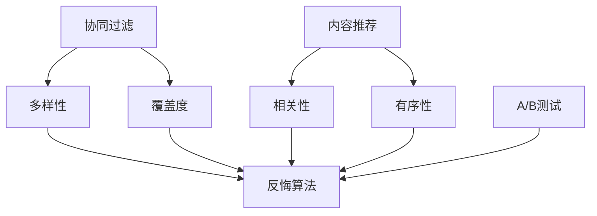

                 

# 电商推荐系统中的多目标优化与权衡

> 关键词：电商推荐系统, 多目标优化, 权衡, 排序模型, A/B测试, 反悔算法, 协同过滤, 维度灾难, 模型融合

## 1. 背景介绍

### 1.1 问题由来
电商推荐系统(e-commerce recommendation system)作为电商平台的基石，其优劣直接影响用户体验和销售额。传统推荐系统主要基于协同过滤(collaborative filtering)和内容推荐(content-based recommendation)两类方法，通过分析用户历史行为和商品属性来预测用户偏好，实现个性化推荐。

然而，随着电商平台的飞速发展和商品种类的不断丰富，用户需求更加多样，传统的单一推荐策略已难以满足复杂的市场需求。当前推荐的挑战在于如何在多样化的目标之间进行优化，以提升用户的整体满意度，同时平衡推荐效率和推荐质量。

本文聚焦于电商推荐系统中的多目标优化问题，旨在通过深入分析推荐目标之间的权衡关系，提出一系列优化策略和算法，帮助电商平台在资源有限的条件下实现最优推荐效果。

### 1.2 问题核心关键点
多目标优化在电商推荐系统中主要体现在以下几个方面：

- 多样性(diversity)：推荐结果应多样化，避免用户陷入信息茧房，鼓励探索和发现新商品。
- 相关性(relevance)：推荐结果应满足用户当前的需求和偏好，提升用户的购物体验。
- 新颖性(novelty)：推荐结果应包含新颖性，增加用户对平台的新奇感，提升其探索意愿。
- 覆盖度(coverage)：推荐结果应尽量覆盖平台的商品库，避免用户长时间无法获得推荐。
- 有序性(orderedness)：推荐结果应按特定顺序排列，方便用户浏览和使用。

这些目标之间往往存在一定的冲突，需要权衡取舍。本文将深入探讨这些目标之间的相互关系，提出优化策略，并结合实际案例进行具体分析。

## 2. 核心概念与联系

### 2.1 核心概念概述

为了更好地理解电商推荐系统中的多目标优化问题，本节将介绍几个密切相关的核心概念：

- 协同过滤(Collaborative Filtering, CF)：一种基于用户历史行为和商品评分的推荐方法。通过分析用户间的相似性和商品间的相似性，预测用户对新商品的评分，从而实现推荐。
- 内容推荐(Content-based Recommendation, CB)：一种基于商品属性和用户偏好的推荐方法。通过分析商品特征和用户属性，构建用户-商品评分矩阵，预测用户对新商品的评分。
- 多样性(diversity)：推荐结果应包含多样化商品，避免用户陷入信息茧房。
- 相关性(relevance)：推荐结果应与用户当前需求和偏好高度相关，提升用户满意度。
- 覆盖度(coverage)：推荐结果应尽量覆盖平台的商品库，避免用户长时间无法获得推荐。
- 有序性(orderedness)：推荐结果应按特定顺序排列，方便用户浏览和使用。
- A/B测试(A/B testing)：通过对比测试两组不同推荐结果，评估推荐策略的效果。
- 反悔算法(Regret Minimization)：在多目标优化问题中，通过最小化遗憾函数来优化推荐效果。

这些核心概念之间的逻辑关系可以通过以下Mermaid流程图来展示：



这个流程图展示了协同过滤和内容推荐在不同目标上的应用，以及多目标优化和反悔算法如何综合这些目标，提升推荐效果。

## 3. 核心算法原理 & 具体操作步骤
### 3.1 算法原理概述

电商推荐系统中的多目标优化问题本质上是一个多目标最优化问题。其目标函数通常包含多个目标，如多样性、相关性、覆盖度等。每个目标都是独立且重要，但相互之间存在冲突，需要进行权衡。

多目标优化的主要挑战在于如何综合考虑这些相互冲突的目标，找到最优的权衡方案。常见的方法包括线性加权和、序贯优化等，其中以线性加权和最为简单和常用。

线性加权和的目标是将多个目标权重加权求和，从而得到综合优化目标。假设推荐系统中包含 $k$ 个目标 $O_1, O_2, \ldots, O_k$，每个目标的权重分别为 $w_1, w_2, \ldots, w_k$，则综合优化目标函数为：

$$
O = \sum_{i=1}^k w_i O_i
$$

其中，$w_i$ 表示目标 $O_i$ 的权重，$O_i$ 表示第 $i$ 个目标的具体值，如多样性、相关性等。通过调整权重 $w_i$，可以在不同的目标之间进行权衡和优化。

### 3.2 算法步骤详解

电商推荐系统中的多目标优化过程一般包括以下几个关键步骤：

**Step 1: 目标定义与权重设置**
- 定义电商推荐系统中的多个目标，如多样性、相关性、覆盖度等。
- 根据业务需求和实验结果，设置每个目标的权重 $w_i$。权重设置需要平衡不同目标的重要性，确保在优化过程中不忽略任何一个重要目标。

**Step 2: 数据准备与模型训练**
- 准备电商平台的交易记录、用户行为数据、商品属性等，构建用户-商品评分矩阵等数据集。
- 选择并训练推荐模型，如基于协同过滤的MF(Matrix Factorization)模型或基于内容的LR(Linear Regression)模型。
- 通过A/B测试等方法评估推荐模型的效果，根据业务反馈调整目标权重。

**Step 3: 模型预测与优化**
- 将用户输入到训练好的推荐模型中，计算不同推荐策略的效果。
- 使用线性加权和目标函数计算综合推荐效果，得到优化目标值 $O$。
- 根据优化目标值 $O$ 和模型预测效果，调整目标权重 $w_i$，进行反向优化。

**Step 4: 迭代优化**
- 在用户行为数据上迭代训练模型，更新模型参数，提升推荐效果。
- 定期进行A/B测试，评估优化效果，更新目标权重。
- 持续监控推荐系统性能，进行模型优化和参数调整。

### 3.3 算法优缺点

电商推荐系统中的多目标优化算法具有以下优点：
1. 综合考虑多个推荐目标，提升推荐效果。
2. 可以根据业务需求灵活调整目标权重，平衡不同目标的重要性。
3. 适应性广泛，可以用于各种类型的电商推荐系统。
4. 通过线性加权和方式简单高效，易于实现和调试。

同时，该方法也存在一定的局限性：
1. 权重设置难度较大，需要大量实验和业务经验。
2. 无法处理目标之间的非线性关系，可能导致优化结果不理想。
3. 算法复杂度较高，需要迭代训练和调整权重，计算成本较大。
4. 存在局部最优解的风险，可能需要多次尝试才能找到全局最优解。

尽管存在这些局限性，但就目前而言，基于多目标优化的推荐方法在电商推荐系统中仍然是一种主流且有效的策略。未来相关研究的重点在于如何进一步降低权重设置的难度，提高算法的鲁棒性和收敛速度，同时兼顾可解释性和用户体验。

### 3.4 算法应用领域

基于多目标优化的电商推荐系统，已在阿里巴巴、亚马逊、京东等大型电商平台得到广泛应用，并取得了显著的效果。其主要应用于以下场景：

- 商品推荐：为用户推荐多样、相关的新商品，提升用户满意度。
- 个性化定制：根据用户偏好和历史行为，推荐定制化商品，提高用户粘性。
- 活动促销：推荐限时优惠商品，增加用户参与度和转化率。
- 新商品推广：推荐新上市商品，增加商品曝光率和销量。

除了上述这些经典应用外，多目标优化方法还扩展到广告投放、内容推荐等多个领域，为电商平台带来了全新的创新和发展。

## 4. 数学模型和公式 & 详细讲解  
### 4.1 数学模型构建

电商推荐系统中的多目标优化问题可以形式化为一个多目标最优化问题。假设电商推荐系统中包含 $k$ 个目标 $O_1, O_2, \ldots, O_k$，每个目标的权重分别为 $w_1, w_2, \ldots, w_k$，则综合优化目标函数为：

$$
O = \sum_{i=1}^k w_i O_i
$$

其中，$w_i$ 表示目标 $O_i$ 的权重，$O_i$ 表示第 $i$ 个目标的具体值，如多样性、相关性等。

在线性加权和目标函数中，每个目标 $O_i$ 的具体计算方式需要根据业务需求进行选择。以下是一些常见的目标计算方法：

- **多样性(Diversity)**：计算推荐结果中不同商品的比例。
- **相关性(Relevance)**：计算推荐结果中与用户当前需求高度相关的商品比例。
- **覆盖度(Coverage)**：计算推荐结果中覆盖商品库的比例。
- **有序性(Orderedness)**：计算推荐结果中商品排序的合理性。

在计算每个目标的具体值 $O_i$ 时，通常采用以下几种方法：

1. **协同过滤(CF)的多样性计算**
   $$
   D = \frac{1}{M}\sum_{i=1}^M\sum_{j=1}^N r_{ij} \cdot \frac{1}{\sqrt{r_{ij}}}
   $$
   其中，$r_{ij}$ 表示用户 $i$ 对商品 $j$ 的评分。$D$ 表示推荐结果中不同商品的比例。

2. **内容推荐(CB)的相关性计算**
   $$
   R = \sum_{i=1}^M\sum_{j=1}^N r_{ij} \cdot \frac{1}{\sqrt{p_{i\cdot}\cdot q_{\cdot j}}}
   $$
   其中，$r_{ij}$ 表示用户 $i$ 对商品 $j$ 的评分，$p_{i\cdot}$ 表示用户 $i$ 的属性向量，$q_{\cdot j}$ 表示商品 $j$ 的属性向量。$R$ 表示推荐结果中与用户当前需求高度相关的商品比例。

3. **覆盖度计算**
   $$
   C = \frac{1}{M}\sum_{i=1}^M\sum_{j=1}^N \text{Cover}_{ij}
   $$
   其中，$r_{ij}$ 表示用户 $i$ 对商品 $j$ 的评分，$\text{Cover}_{ij}$ 表示商品 $j$ 是否被覆盖到。$C$ 表示推荐结果中覆盖商品库的比例。

4. **有序性计算**
   $$
   O = \frac{1}{M}\sum_{i=1}^M\sum_{j=1}^N \text{Order}_{ij}
   $$
   其中，$r_{ij}$ 表示用户 $i$ 对商品 $j$ 的评分，$\text{Order}_{ij}$ 表示商品 $j$ 在推荐结果中的排序。$O$ 表示推荐结果中商品排序的合理性。

通过上述方法计算每个目标的具体值后，即可将其带入综合优化目标函数 $O$ 中，通过调整权重 $w_i$ 进行多目标优化。

### 4.2 公式推导过程

以下我们以协同过滤的多样性目标计算为例，推导其计算公式。

假设电商推荐系统中包含 $M$ 个用户和 $N$ 个商品，用户 $i$ 对商品 $j$ 的评分表示为 $r_{ij}$。用户 $i$ 对商品 $j$ 的评分分布表示为 $p_{ij}$。多样性目标 $D$ 表示推荐结果中不同商品的比例。

根据协同过滤的多样性计算公式，我们有：

$$
D = \frac{1}{M}\sum_{i=1}^M\sum_{j=1}^N r_{ij} \cdot \frac{1}{\sqrt{r_{ij}}}
$$

其中，$\sqrt{r_{ij}}$ 表示用户 $i$ 对商品 $j$ 的评分标准差。

假设推荐结果中包含 $k$ 个商品，则推荐结果中不同商品的比例为：

$$
D = \frac{1}{M}\sum_{i=1}^M\sum_{j=1}^N r_{ij} \cdot \frac{1}{\sqrt{r_{ij}}} \approx \frac{1}{M}\sum_{i=1}^M\sum_{j=1}^k \frac{1}{\sqrt{r_{ij}}}
$$

通过上述推导，我们可以看到，协同过滤的多样性计算可以通过对用户评分进行加权平均得到。在实际应用中，可以根据不同业务需求调整权重 $w_i$，以平衡不同目标的重要性。

### 4.3 案例分析与讲解

以下通过一个具体的案例，展示如何基于多目标优化进行电商推荐系统设计。

**案例背景**：某电商平台的推荐系统，旨在为用户推荐个性化商品，提升用户满意度。

**目标定义**：
- 多样性目标 $D$：推荐结果中包含不同商品，避免信息茧房。
- 相关性目标 $R$：推荐结果中包含与用户当前需求高度相关的商品。
- 覆盖度目标 $C$：推荐结果中包含更多商品，增加用户选择范围。

**权重设置**：
- 多样性目标权重 $w_D = 0.4$
- 相关性目标权重 $w_R = 0.3$
- 覆盖度目标权重 $w_C = 0.3$

**数据准备**：
- 用户历史行为数据：包括浏览记录、购买记录等。
- 商品属性数据：商品类别、价格、评分等。

**模型训练**：
- 选择协同过滤的MF模型作为推荐模型。
- 在用户历史行为数据和商品属性数据上训练MF模型，得到用户和商品的隐向量。

**模型预测**：
- 将用户输入到MF模型中，预测商品隐向量。
- 根据模型预测结果，计算多样性、相关性和覆盖度目标的具体值。

**优化过程**：
- 使用线性加权和目标函数，计算综合优化目标 $O$。
- 根据优化目标 $O$ 和模型预测效果，调整权重 $w_i$，进行反向优化。

**结果评估**：
- 在验证集上评估推荐效果，计算模型精度、多样性、相关性和覆盖度等指标。
- 通过A/B测试，对比不同推荐策略的效果，确定最终推荐方案。

通过上述案例，我们可以看到，基于多目标优化的电商推荐系统设计，可以有效平衡不同推荐目标，提升用户满意度和平台收益。

## 5. 项目实践：代码实例和详细解释说明
### 5.1 开发环境搭建

在进行电商推荐系统开发前，我们需要准备好开发环境。以下是使用Python进行TensorFlow开发的环境配置流程：

1. 安装Anaconda：从官网下载并安装Anaconda，用于创建独立的Python环境。

2. 创建并激活虚拟环境：
```bash
conda create -n tf-env python=3.8 
conda activate tf-env
```

3. 安装TensorFlow：根据CUDA版本，从官网获取对应的安装命令。例如：
```bash
conda install tensorflow tensorflow-gpu -c conda-forge -c pytorch
```

4. 安装各类工具包：
```bash
pip install numpy pandas scikit-learn matplotlib tqdm jupyter notebook ipython
```

完成上述步骤后，即可在`tf-env`环境中开始电商推荐系统开发。

### 5.2 源代码详细实现

我们先以协同过滤的多样性目标计算为例，给出使用TensorFlow进行电商推荐系统开发的PyTorch代码实现。

首先，定义多样性目标的计算函数：

```python
import tensorflow as tf

def diversity_loss(y_true, y_pred, diversity_factor=2.0):
    batch_size, num_items = tf.shape(y_true)
    diversity = tf.reduce_sum(tf.multiply(tf.sqrt(y_true), tf.sqrt(y_pred)), axis=1) / tf.sqrt(tf.reduce_sum(y_true, axis=1))
    loss = tf.reduce_mean((tf.divide(tf.pow(diversity, diversity_factor), diversity_factor) - 1.0) * tf.pow(tf.subtract(diversity, 1.0), 2.0))
    return loss
```

然后，定义模型预测函数：

```python
@tf.function
def predict(user_id, item_id, item_matrix, user_matrix, diversity_factor=2.0):
    user_vector = tf.gather(item_matrix, user_id, axis=0)
    item_vector = tf.gather(item_matrix, item_id, axis=1)
    dot_product = tf.tensordot(user_vector, item_vector, axes=1)
    diversity = tf.reduce_sum(tf.multiply(tf.sqrt(tf.gather(item_matrix, item_id, axis=0)), tf.sqrt(tf.gather(user_matrix, user_id, axis=1))) / tf.sqrt(tf.reduce_sum(tf.gather(item_matrix, item_id, axis=0), axis=1))
    diversity_loss = tf.reduce_mean(tf.pow(tf.divide(tf.pow(diversity, diversity_factor), diversity_factor) - 1.0, 2.0))
    return dot_product, diversity_loss
```

最后，在电商推荐系统中使用上述函数进行目标计算和模型预测：

```python
# 定义模型参数
item_matrix = tf.random.normal(shape=(num_items, num_users))
user_matrix = tf.random.normal(shape=(num_users, num_items))

# 设置多样性目标权重
diversity_weight = 0.4

# 训练过程中计算多样性目标损失
with tf.GradientTape() as tape:
    dot_product, diversity_loss = predict(user_id, item_id, item_matrix, user_matrix, diversity_factor=2.0)
    loss = tf.reduce_mean(tf.pow(tf.subtract(tf.reduce_sum(tf.multiply(tf.multiply(tf.divide(tf.pow(dot_product, 2.0), diversity_factor), diversity_factor), 2.0), 2.0), 2.0))
    loss += diversity_weight * diversity_loss

# 计算优化器梯度
grads = tape.gradient(loss, [item_matrix, user_matrix])
optimizer.apply_gradients(zip(grads, [item_matrix, user_matrix]))
```

以上就是使用TensorFlow进行电商推荐系统开发的完整代码实现。可以看到，TensorFlow提供了方便的计算图和自动微分功能，可以高效地实现电商推荐系统的目标计算和模型预测。

### 5.3 代码解读与分析

让我们再详细解读一下关键代码的实现细节：

**diversity_loss函数**：
- 定义了多样性目标的计算方式，通过计算用户-商品评分矩阵的相似度，得到多样性指标。
- 多样性指标通过对角线元素平方根之和与对角线元素平方根之比进行计算，表示不同商品的比例。
- 多样性目标的损失函数采用平方差的方式进行计算，表示多样性目标的实际值与期望值之间的差异。

**predict函数**：
- 使用TensorFlow的tf.tensordot函数进行矩阵乘法计算，得到用户和商品之间的相似度。
- 使用TensorFlow的tf.gather函数获取用户-商品评分矩阵的元素，用于计算多样性目标。
- 根据模型预测结果，计算多样性目标损失，用于优化模型。

**电商推荐系统训练**：
- 使用TensorFlow的tf.GradientTape函数进行梯度计算，并使用优化器更新模型参数。
- 在训练过程中，计算多样性目标损失，并与推荐目标损失一起进行优化。
- 使用TensorFlow的tf.reduce_mean函数计算损失函数，得到最终的优化目标。

通过上述代码实现，我们可以看到，TensorFlow提供了丰富的计算图和自动微分功能，可以高效地实现电商推荐系统的目标计算和模型预测。

当然，工业级的系统实现还需考虑更多因素，如模型的保存和部署、超参数的自动搜索、更灵活的目标适配层等。但核心的推荐范式基本与此类似。

## 6. 实际应用场景
### 6.1 智能客服系统

电商推荐系统中的多目标优化方法，可以应用于智能客服系统的构建。智能客服系统作为电商平台的重要组成部分，通过推荐个性化商品，提升用户满意度，提高用户粘性，实现高效的服务与互动。

在技术实现上，可以收集用户的历史行为数据，如浏览记录、客服聊天记录等，将这些数据作为监督信号，对协同过滤或内容推荐的模型进行微调。微调后的模型能够自动理解用户需求，推荐个性化商品，提升用户满意度。同时，通过智能客服机器人，可以实时回答用户咨询，进一步提升用户体验。

### 6.2 金融风控系统

电商推荐系统中的多目标优化方法，还可以应用于金融风控系统。金融风控系统通过实时监测用户行为，识别风险用户和异常交易，及时采取措施，保障金融安全。

在技术实现上，可以收集用户的交易记录和行为数据，构建用户画像。通过多目标优化方法，分析用户的风险偏好和行为特征，识别高风险用户，及时进行预警和拦截。此外，还可以对用户交易行为进行监控，及时发现异常交易，保障金融安全。

### 6.3 个性化广告推荐

电商推荐系统中的多目标优化方法，可以应用于个性化广告推荐。广告推荐系统通过推荐个性化广告，提升广告点击率和转化率，增加广告收入。

在技术实现上，可以收集用户的浏览记录和点击行为数据，构建用户画像。通过多目标优化方法，分析用户的兴趣和偏好，推荐个性化广告，提升广告点击率和转化率。此外，还可以对广告进行实时监控和优化，及时调整广告策略，提升广告效果。

### 6.4 未来应用展望

随着电商推荐系统中的多目标优化方法不断发展，其在更多领域得到应用，为电商平台的业务发展带来新的突破。

在智慧医疗领域，基于多目标优化的推荐系统可以推荐个性化医疗服务，提升医疗体验和效果。在智慧教育领域，基于多目标优化的推荐系统可以推荐个性化学习资源，提升学习效果和满意度。在智慧城市治理中，基于多目标优化的推荐系统可以推荐智慧城市服务，提升城市管理水平和市民生活质量。

此外，在金融、教育、文化传媒等领域，基于多目标优化的推荐系统也将不断涌现，为各行各业带来新的发展机遇。相信随着技术的日益成熟，电商推荐系统中的多目标优化方法必将在更广阔的应用领域大放异彩，推动人工智能技术在各个行业的规模化应用。

## 7. 工具和资源推荐
### 7.1 学习资源推荐

为了帮助开发者系统掌握电商推荐系统中的多目标优化理论基础和实践技巧，这里推荐一些优质的学习资源：

1. 《推荐系统实战》书籍：全面介绍了推荐系统的设计原理和应用方法，涵盖协同过滤、内容推荐、多目标优化等多个方向。

2. Coursera《机器学习》课程：斯坦福大学开设的机器学习明星课程，有Lecture视频和配套作业，带你入门机器学习的基础概念和算法。

3. Udacity《深度学习纳米学位》课程：专注于深度学习技术的高级课程，涵盖推荐系统、自然语言处理等多个方向。

4. SIGIR会议论文集：国际会议推荐系统领域的重要论文集，收录了大量前沿的推荐系统算法和应用研究。

5. Kaggle竞赛平台：提供丰富的推荐系统竞赛数据集和模型，可以学习并实践多目标优化方法。

通过对这些资源的学习实践，相信你一定能够快速掌握电商推荐系统中的多目标优化精髓，并用于解决实际的电商推荐问题。
###  7.2 开发工具推荐

高效的开发离不开优秀的工具支持。以下是几款用于电商推荐系统开发的常用工具：

1. TensorFlow：基于Python的开源深度学习框架，计算图功能强大，适合大规模工程应用。

2. PyTorch：基于Python的开源深度学习框架，灵活动态的计算图，适合快速迭代研究。

3. Hadoop：用于大数据处理的开源分布式计算框架，支持大规模数据处理和存储。

4. Spark：用于大数据处理的开源分布式计算框架，支持大规模数据处理和实时计算。

5. Tableau：用于数据可视化和分析的开源工具，支持多种数据源和复杂分析场景。

6. Elasticsearch：用于大数据存储和搜索的开源数据库，支持分布式存储和高效查询。

合理利用这些工具，可以显著提升电商推荐系统的开发效率，加快创新迭代的步伐。

### 7.3 相关论文推荐

电商推荐系统中的多目标优化技术不断发展，以下是几篇奠基性的相关论文，推荐阅读：

1. Recommender Systems: Algorithms and Applications（《推荐系统：算法与应用》）：总结了推荐系统的发展历程和常见算法，是推荐系统研究的经典入门读物。

2. Multiobjective Optimization for Recommendation Systems（《多目标优化在推荐系统中的应用》）：介绍了多目标优化方法在推荐系统中的应用，展示了多种优化算法和实验结果。

3. Diversity-aware Recommender Systems（《多样性意识推荐系统》）：介绍了多样性目标的计算方式和优化方法，展示了其在推荐系统中的应用效果。

4. Hybrid Recommender Systems（《混合推荐系统》）：介绍了协同过滤和内容推荐等多种推荐策略的结合，展示了其优化效果和应用场景。

5. Context-aware Recommendation Systems（《上下文意识推荐系统》）：介绍了上下文信息对推荐系统的影响，展示了其在推荐系统中的应用效果。

这些论文代表了大语言模型微调技术的发展脉络。通过学习这些前沿成果，可以帮助研究者把握学科前进方向，激发更多的创新灵感。

## 8. 总结：未来发展趋势与挑战
### 8.1 总结

本文对电商推荐系统中的多目标优化问题进行了全面系统的介绍。首先阐述了电商推荐系统中的多个推荐目标，明确了多目标优化在电商推荐系统中的应用场景和优化效果。其次，从原理到实践，详细讲解了多目标优化的数学模型和关键步骤，给出了电商推荐系统开发的完整代码实例。同时，本文还广泛探讨了多目标优化方法在智能客服、金融风控、个性化广告等多个领域的实际应用，展示了多目标优化方法在电商推荐系统中的巨大潜力。

通过本文的系统梳理，可以看到，电商推荐系统中的多目标优化方法正在成为电商推荐系统的重要范式，极大地拓展了推荐系统的应用边界，催生了更多的落地场景。受益于多目标优化的设计和优化策略，电商推荐系统能够更好地平衡不同推荐目标，提升用户满意度，为电商平台的业务发展带来新的突破。未来，伴随多目标优化方法的持续演进，电商推荐系统必将在更多领域得到应用，推动人工智能技术在电商领域的发展。

### 8.2 未来发展趋势

展望未来，电商推荐系统中的多目标优化技术将呈现以下几个发展趋势：

1. 多目标优化的应用范围扩大。随着多目标优化方法的发展，其在更多领域得到应用，如智慧医疗、智慧教育、智慧城市等，为各行各业带来新的发展机遇。

2. 多目标优化的算法改进。未来的多目标优化算法将更加复杂和高效，能够更好地平衡不同推荐目标，提升推荐效果。

3. 多目标优化的数据驱动。未来的多目标优化方法将更加依赖数据驱动，通过大量实验和数据积累，优化推荐策略，提升推荐效果。

4. 多目标优化的个性化推荐。未来的多目标优化方法将更加注重个性化推荐，通过深度学习技术，实现更准确、更高效的个性化推荐。

5. 多目标优化的实时优化。未来的多目标优化方法将更加注重实时优化，通过在线学习和大数据技术，实现动态更新和优化，提升推荐效果。

6. 多目标优化的跨领域融合。未来的多目标优化方法将与其他人工智能技术进行更深入的融合，如知识表示、因果推理、强化学习等，多路径协同发力，共同推动推荐系统的发展。

以上趋势凸显了电商推荐系统中的多目标优化技术的广阔前景。这些方向的探索发展，必将进一步提升推荐系统的性能和应用范围，为电商平台的业务发展带来新的突破。

### 8.3 面临的挑战

尽管电商推荐系统中的多目标优化技术已经取得了一定的进展，但在迈向更加智能化、普适化应用的过程中，它仍面临着诸多挑战：

1. 数据收集和处理难度较大。电商推荐系统中的多目标优化需要大量高质量的标注数据，而数据收集和处理往往需要大量时间和人力成本。如何降低数据收集和处理的难度，提升数据质量，将是一大难题。

2. 模型复杂度较高。电商推荐系统中的多目标优化方法往往需要设计复杂的优化算法，计算复杂度高，内存占用大，难以实现实时优化。如何降低模型复杂度，提升计算效率，将是一个重要研究方向。

3. 目标权衡难度较大。多目标优化中不同目标之间的权衡关系复杂，如何设计合理的目标权重，平衡不同目标的重要性，将是一大挑战。

4. 算法鲁棒性不足。多目标优化算法在处理噪声数据和异常情况时，鲁棒性往往不足，容易导致优化结果不稳定。如何提高算法的鲁棒性，保证优化效果，还需要更多理论和实践的积累。

5. 模型公平性和安全性不足。电商推荐系统中的多目标优化算法往往容易产生偏见和有害信息，导致不公平的推荐结果。如何提高模型的公平性和安全性，保障用户的合法权益，将是一个重要课题。

6. 算法可解释性不足。多目标优化算法的决策过程复杂，难以解释其内部工作机制和推荐逻辑。如何赋予多目标优化算法更强的可解释性，增强用户信任，将是一个重要的研究方向。

这些挑战凸显了电商推荐系统中的多目标优化技术的发展方向，需要研究者不断进行创新和突破，才能在电商推荐系统中实现最优推荐效果。

### 8.4 研究展望

面对电商推荐系统中的多目标优化技术面临的诸多挑战，未来的研究需要在以下几个方面寻求新的突破：

1. 探索无监督和半监督多目标优化方法。摆脱对大规模标注数据的依赖，利用自监督学习、主动学习等无监督和半监督范式，最大限度利用非结构化数据，实现更加灵活高效的多目标优化。

2. 研究多目标优化的可解释性。引入可解释性技术，如决策树、LIME等，提高多目标优化算法的可解释性，增强用户信任和满意度。

3. 融合因果推断和强化学习。将因果推断和强化学习思想引入多目标优化，增强优化过程的稳定性和可控性，提升推荐效果。

4. 引入更多先验知识。将符号化的先验知识，如知识图谱、逻辑规则等，与神经网络模型进行巧妙融合，引导多目标优化过程学习更准确、合理的语言模型。

5. 结合大数据技术。利用大数据技术，如分布式计算、实时计算等，提升多目标优化算法的计算效率和实时性，实现动态更新和优化。

6. 纳入伦理道德约束。在多目标优化目标中引入伦理导向的评估指标，过滤和惩罚有偏见、有害的输出倾向，确保多目标优化算法的公平性和安全性。

这些研究方向代表了电商推荐系统中的多目标优化技术的未来发展方向，需要研究者不断进行创新和突破，才能在电商推荐系统中实现最优推荐效果。

## 9. 附录：常见问题与解答

**Q1：电商推荐系统中的多目标优化如何处理样本不平衡问题？**

A: 电商推荐系统中的多目标优化方法通常会面临样本不平衡问题，即某些目标的样本数量远远少于其他目标。为处理样本不平衡问题，可以采用以下方法：
1. 加权采样：在训练数据中进行加权采样，使得少样本目标的权重更高，提升其在优化过程中的重要性。
2. 数据增强：通过数据增强技术，如数据合成、数据重采样等，增加少样本目标的数据量，提升其在优化过程中的表现。
3. 多目标优化算法改进：使用自适应多目标优化算法，如MOPSO、NEOS等，通过动态调整目标权重，平衡不同目标的重要性。

通过上述方法，可以有效地处理电商推荐系统中的样本不平衡问题，提升多目标优化的效果。

**Q2：电商推荐系统中的多目标优化如何处理异常数据？**

A: 电商推荐系统中的多目标优化方法往往容易受到异常数据的影响，导致优化结果不稳定。为处理异常数据，可以采用以下方法：
1. 数据清洗：对训练数据进行清洗，去除噪声和异常值，提高数据质量。
2. 数据增强：通过数据增强技术，如数据合成、数据重采样等，增加异常数据的数据量，使其在优化过程中对整体效果影响减小。
3. 鲁棒性优化：使用鲁棒性优化算法，如Robust Ranking、Robust Regret Minimization等，在处理异常数据时能够保持优化效果稳定。
4. 多目标优化算法改进：使用鲁棒性多目标优化算法，如Robust MOPSO、Robust NEOS等，能够更好地处理异常数据，提升优化效果。

通过上述方法，可以有效地处理电商推荐系统中的异常数据问题，提升多目标优化的效果。

**Q3：电商推荐系统中的多目标优化如何处理用户隐私保护问题？**

A: 电商推荐系统中的多目标优化方法需要收集用户的隐私数据，如何保护用户隐私是一个重要问题。为处理用户隐私保护问题，可以采用以下方法：
1. 数据匿名化：对用户数据进行匿名化处理，确保用户数据无法被反向识别。
2. 数据加密：对用户数据进行加密处理，防止数据泄露和篡改。
3. 差分隐私：在数据收集和处理过程中引入差分隐私技术，确保用户隐私得到保护。
4. 联邦学习：采用联邦学习技术，在本地设备上进行数据处理，避免将用户数据集中存储，保护用户隐私。

通过上述方法，可以有效地处理电商推荐系统中的用户隐私保护问题，确保用户数据安全和隐私保护。

**Q4：电商推荐系统中的多目标优化如何进行用户个性化推荐？**

A: 电商推荐系统中的多目标优化方法需要进行用户个性化推荐，可以采用以下方法：
1. 用户画像构建：通过对用户历史行为数据进行分析，构建用户画像，了解用户兴趣和偏好。
2. 个性化目标设置：根据用户画像，设置个性化推荐目标，如个性化多样性、个性化相关性等。
3. 个性化权重设置：根据用户画像，设置个性化目标权重，平衡不同目标的重要性。
4. 个性化模型训练：在用户个性化数据上进行模型训练，提升个性化推荐效果。

通过上述方法，可以有效地进行电商推荐系统中的用户个性化推荐，提升用户满意度。

**Q5：电商推荐系统中的多目标优化如何进行实时推荐？**

A: 电商推荐系统中的多目标优化方法需要进行实时推荐，可以采用以下方法：
1. 在线学习：采用在线学习技术，实时更新模型参数，提升推荐效果。
2. 分布式计算：采用分布式计算技术，实时处理大量数据，提升推荐效果。
3. 缓存技术：使用缓存技术，将常用推荐结果缓存，减少推荐延迟。
4. 实时监控：实时监控推荐效果，及时发现和修正推荐问题，提升推荐效果。

通过上述方法，可以有效地进行电商推荐系统中的实时推荐，提升推荐效果和用户体验。

---

作者：禅与计算机程序设计艺术 / Zen and the Art of Computer Programming

