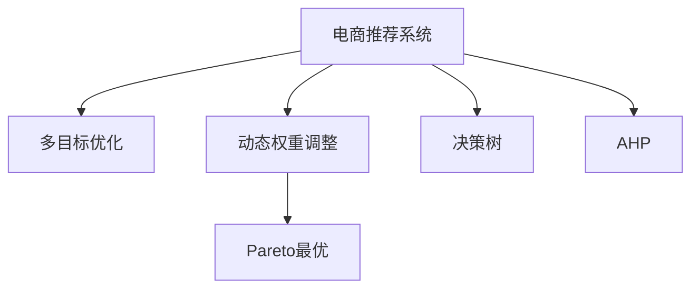

                 

## 1. 背景介绍

随着互联网时代的到来，电商推荐系统已成为各大电商平台提供个性化服务、提升用户体验的重要手段。推荐系统通过分析用户行为数据，预测用户的兴趣，为其推荐最相关的商品，极大地提高了电商平台的转化率和用户满意度。然而，推荐系统的目标并非单一，而是包含了多样化的指标，如点击率、转化率、销量、收藏数等。如何在多目标之间取得平衡，最大化整体系统的价值，成为了推荐系统设计中的一个重要问题。

### 1.1 问题由来

在传统的电商推荐系统中，通常采用单目标优化方法，即以单一的指标（如点击率或转化率）作为优化目标，忽略其他目标，这样容易导致系统在单指标上表现优异，但在综合指标上可能不够理想。然而，随着电商平台的运营复杂度增加，单一目标的优化已无法满足实际需求。现代电商推荐系统面临的挑战包括但不限于：

1. **多目标冲突**：不同指标之间存在一定的冲突，单目标优化方法无法兼顾所有指标。
2. **用户个性化需求**：用户对不同商品的需求具有多样化，单目标优化无法准确反映用户的个性化需求。
3. **动态环境变化**：用户行为和市场环境变化快，单一静态优化无法及时调整推荐策略。
4. **数据多样性**：电商推荐系统需要处理的数据类型多样，包括用户行为数据、商品属性数据等，单一目标优化难以充分利用所有数据。

### 1.2 问题核心关键点

为了解决以上问题，电商推荐系统中的多目标优化动态权重调整技术应运而生。其核心思想是：在推荐系统设计中，引入多个优化目标，并动态调整各目标之间的权重，以适应不同情况下的用户需求和市场环境变化。该方法不仅能够解决多目标之间的冲突，还能更好地反映用户的个性化需求，并在动态环境中及时调整推荐策略。

## 2. 核心概念与联系

### 2.1 核心概念概述

为更好地理解电商推荐系统中的多目标优化动态权重调整方法，本节将介绍几个密切相关的核心概念：

- **电商推荐系统 (E-commerce Recommendation System)**：通过分析用户行为数据，预测用户的兴趣，为其推荐最相关的商品，以提升用户满意度，增加电商平台转化率的技术。
- **多目标优化 (Multi-Objective Optimization)**：在决策过程中同时考虑多个目标，并寻找各目标之间的平衡点。
- **动态权重调整 (Dynamic Weight Adjustment)**：根据系统运行状态和用户行为变化，动态调整各个优化目标的权重，以适应不断变化的环境。
- **Pareto最优 (Pareto Optimality)**：在多目标优化中，若无法同时优化所有目标，则寻找一组解，使得至少一个目标得到最优解，且没有其他解在所有目标上均优于该解。
- **决策树 (Decision Tree)**：一种树形结构，用于表示不同特征之间的关系和决策路径，常用于电商推荐系统的决策过程。
- **层次分析法 (Analytic Hierarchy Process, AHP)**：一种系统的定性和定量相结合的决策分析方法，常用于电商推荐系统的目标权重设定。

这些核心概念之间的逻辑关系可以通过以下Mermaid流程图来展示：



这个流程图展示了你电商推荐系统的核心概念及其之间的关系：

1. 电商推荐系统通过多目标优化实现用户个性化需求和动态环境变化的适应。
2. 多目标优化通过动态权重调整在不同的目标之间取得平衡。
3. Pareto最优寻找在多目标优化中的最优解。
4. 决策树用于电商推荐系统中的决策过程。
5. 层次分析法用于电商推荐系统中目标权重的设定。

这些概念共同构成了电商推荐系统的学习和应用框架，使其能够更好地满足用户需求，提升电商平台的运营效率和用户满意度。

## 3. 核心算法原理 & 具体操作步骤
### 3.1 算法原理概述

电商推荐系统中的多目标优化动态权重调整方法基于多目标优化理论，通过引入多个优化目标并动态调整各目标之间的权重，以适应不同情况下的用户需求和市场环境变化。其核心思想是：在推荐系统设计中，引入多个优化目标，并动态调整各目标之间的权重，以适应不同情况下的用户需求和市场环境变化。

形式化地，假设电商推荐系统中的优化目标为 $T=\{O_1,O_2,\cdots,O_n\}$，其中 $O_i$ 表示第 $i$ 个目标，每个目标的权重为 $w_i>0$。优化目标 $O_i$ 的损失函数为 $L_i$。多目标优化问题可以表示为：

$$
\begin{aligned}
\min_{\theta} \sum_{i=1}^n w_iL_i(M_{\theta})
\end{aligned}
$$

其中 $M_{\theta}$ 为推荐系统模型参数，$\theta$ 为模型的参数向量。动态权重调整指的是，根据系统运行状态和用户行为变化，动态调整各个优化目标的权重 $w_i$。

### 3.2 算法步骤详解

基于多目标优化动态权重调整方法，电商推荐系统的优化步骤可以概括为以下几个关键步骤：

**Step 1: 数据预处理与特征工程**

- **数据采集**：收集电商平台的点击率、转化率、销量、收藏数等行为数据，同时收集商品属性信息，作为推荐系统的输入。
- **数据清洗**：对收集到的数据进行清洗，去除噪音和异常值，确保数据的准确性。
- **特征工程**：对数据进行特征提取，生成有意义的特征向量，如用户历史行为、商品属性、时间等。

**Step 2: 构建多目标优化模型**

- **目标设定**：根据电商平台的运营需求，设定多个优化目标，如点击率最大化、转化率最大化、销量最大化等。
- **权重设定**：使用层次分析法（AHP）或专家调查等方法，确定各优化目标的权重。
- **模型选择**：选择合适的多目标优化算法，如权重和算法、加权和算法、向量极小化算法等。

**Step 3: 动态权重调整**

- **权重监控**：实时监控各优化目标的表现，如点击率、转化率、销量等。
- **权重调整**：根据监控结果，动态调整各优化目标的权重。例如，在促销活动期间，可能需要调整权重，增加转化率目标的权重，而在销售淡季，可能需要调整权重，增加收藏数目标的权重。

**Step 4: 多目标优化求解**

- **模型训练**：使用多目标优化算法，训练推荐系统模型，优化目标函数。
- **Pareto最优解**：寻找多目标优化中的Pareto最优解，即在各目标之间取得平衡的推荐方案。
- **模型评估**：对推荐系统模型进行评估，如通过A/B测试等方式验证模型的效果。

**Step 5: 推荐结果生成**

- **模型部署**：将训练好的推荐系统模型部署到电商平台的推荐引擎中。
- **推荐结果生成**：根据用户行为数据和模型预测结果，生成个性化推荐列表，展示给用户。

### 3.3 算法优缺点

电商推荐系统中的多目标优化动态权重调整方法具有以下优点：

1. **多目标兼顾**：通过引入多个优化目标，能够更好地反映用户的个性化需求和电商平台的运营目标。
2. **动态适应**：动态权重调整机制能够及时调整各目标之间的权重，适应不同情况下的用户需求和市场环境变化。
3. **综合评估**：通过Pareto最优解，能够综合评估推荐方案，寻找在多个目标上均表现优异的结果。

然而，该方法也存在一定的局限性：

1. **模型复杂度**：引入多个优化目标和动态权重调整机制，增加了模型的复杂度，可能影响模型的训练效率和效果。
2. **数据需求高**：需要大量的用户行为数据和商品属性数据，才能进行有效的多目标优化和权重调整。
3. **权重设定困难**：各优化目标的权重设定需要依据经验和专家判断，可能存在主观偏差。
4. **计算成本高**：多目标优化算法计算复杂，可能需要较长的训练时间。

尽管存在这些局限性，但就目前而言，电商推荐系统中的多目标优化动态权重调整方法仍是大规模电商推荐系统的核心优化手段。未来相关研究的重点在于如何进一步降低计算成本，提高模型的可解释性和公平性，同时兼顾多目标之间的平衡。

### 3.4 算法应用领域

电商推荐系统中的多目标优化动态权重调整方法不仅适用于电商推荐系统，还广泛应用于以下领域：

1. **金融推荐系统**：根据用户的投资偏好和风险承受能力，推荐最合适的理财产品。
2. **医疗推荐系统**：根据病人的病情和治疗偏好，推荐最合适的治疗方案。
3. **新闻推荐系统**：根据用户的阅读偏好和行为，推荐最相关的新闻内容。
4. **旅游推荐系统**：根据用户的旅游偏好和需求，推荐最合适的旅游目的地和路线。

除了上述这些经典应用外，多目标优化动态权重调整方法还被创新性地应用到更多场景中，如用户行为预测、广告投放优化、供应链管理等，为相关领域的业务优化提供了新的技术手段。

## 4. 数学模型和公式 & 详细讲解
### 4.1 数学模型构建

本节将使用数学语言对电商推荐系统中的多目标优化动态权重调整方法进行更加严格的刻画。

假设电商推荐系统中的优化目标为 $T=\{O_1,O_2,\cdots,O_n\}$，每个优化目标 $O_i$ 的损失函数为 $L_i$，对应的权重为 $w_i>0$。设推荐系统模型为 $M_{\theta}$，其中 $\theta$ 为模型参数。多目标优化问题可以表示为：

$$
\begin{aligned}
\min_{\theta} \sum_{i=1}^n w_iL_i(M_{\theta})
\end{aligned}
$$

其中 $L_i$ 为第 $i$ 个优化目标的损失函数，$w_i$ 为第 $i$ 个优化目标的权重。

### 4.2 公式推导过程

以下我们以点击率和转化率优化为例，推导多目标优化问题的数学模型和求解方法。

假设点击率和转化率对应的损失函数分别为 $L_{click}(y)$ 和 $L_{convert}(y)$，其中 $y$ 为推荐系统的预测结果。

点击率的最大化问题可以表示为：

$$
\begin{aligned}
\min_{\theta} \max_{y} L_{click}(y)
\end{aligned}
$$

转化率的最大化问题可以表示为：

$$
\begin{aligned}
\min_{\theta} \max_{y} L_{convert}(y)
\end{aligned}
$$

为了解决多目标优化问题，可以使用加权和算法，将上述两个优化问题合并为单目标优化问题：

$$
\begin{aligned}
\min_{\theta} \max_{y} \left( w_{click}L_{click}(y) + w_{convert}L_{convert}(y) \right)
\end{aligned}
$$

其中 $w_{click}$ 和 $w_{convert}$ 为点击率和转化率的权重，通常根据电商平台的运营需求设定。

通过求解上述优化问题，可以同时最大化点击率和转化率，实现多目标优化。

### 4.3 案例分析与讲解

假设一个电商平台的优化目标包括点击率、转化率和销量。根据平台需求，设定点击率和转化率的权重分别为 $w_{click}=0.6$ 和 $w_{convert}=0.4$。假设推荐系统模型为多线性回归模型，点击率损失函数为均方误差损失，转化率损失函数为对数损失，销量损失函数为平均绝对误差损失。

为了最大化点击率和转化率，同时考虑销量，我们需要求解以下优化问题：

$$
\begin{aligned}
\min_{\theta} \max_{y} \left( 0.6L_{click}(y) + 0.4L_{convert}(y) + L_{sales}(y) \right)
\end{aligned}
$$

其中 $L_{click}(y)$ 为点击率损失函数，$L_{convert}(y)$ 为转化率损失函数，$L_{sales}(y)$ 为销量损失函数。

通过求解上述优化问题，可以同时最大化点击率和转化率，同时考虑销量，实现电商推荐系统的多目标优化。

## 5. 项目实践：代码实例和详细解释说明
### 5.1 开发环境搭建

在进行多目标优化动态权重调整的实践前，我们需要准备好开发环境。以下是使用Python进行TensorFlow和PyTorch开发的环境配置流程：

1. 安装Anaconda：从官网下载并安装Anaconda，用于创建独立的Python环境。

2. 创建并激活虚拟环境：
```bash
conda create -n tf-env python=3.8 
conda activate tf-env
```

3. 安装TensorFlow：从官网获取对应的安装命令。例如：
```bash
pip install tensorflow
```

4. 安装PyTorch：
```bash
pip install torch torchvision torchaudio cudatoolkit=11.1 -c pytorch -c conda-forge
```

5. 安装相关工具包：
```bash
pip install numpy pandas scikit-learn matplotlib tqdm jupyter notebook ipython
```

完成上述步骤后，即可在`tf-env`环境中开始多目标优化实践。

### 5.2 源代码详细实现

这里我们以电商推荐系统中的多目标优化为例，使用TensorFlow和Keras实现多目标优化动态权重调整。

首先，定义多目标优化问题：

```python
import tensorflow as tf
from tensorflow import keras

# 定义多目标优化问题
def multi_objective_loss(click_rate_loss, convert_rate_loss, sales_loss):
    return tf.add_n([0.6 * click_rate_loss, 0.4 * convert_rate_loss, sales_loss])
```

然后，定义推荐系统模型：

```python
# 定义多线性回归模型
class MultiLinearRegression(keras.Model):
    def __init__(self, input_dim):
        super(MultiLinearRegression, self).__init__()
        self.linear_layer = keras.layers.Dense(1, input_dim=input_dim)
        
    def call(self, x):
        return self.linear_layer(x)

# 创建多线性回归模型
input_dim = 10
model = MultiLinearRegression(input_dim)
```

接着，定义损失函数和优化器：

```python
# 定义损失函数
def click_rate_loss(y_true, y_pred):
    return tf.keras.losses.mean_squared_error(y_true, y_pred)

def convert_rate_loss(y_true, y_pred):
    return tf.keras.losses.binary_crossentropy(y_true, y_pred)

def sales_loss(y_true, y_pred):
    return tf.keras.losses.mean_absolute_error(y_true, y_pred)

# 定义优化器
optimizer = tf.keras.optimizers.Adam(learning_rate=0.001)
```

然后，训练推荐系统模型：

```python
# 定义训练数据集
train_dataset = tf.data.Dataset.from_tensor_slices((
    tf.random.normal([10000, input_dim]),
    tf.random.normal([10000]),
    tf.random.normal([10000]),
    tf.random.normal([10000])
))

# 定义训练函数
def train_epoch(model, dataset, batch_size, optimizer):
    model.compile(optimizer=optimizer, loss=multi_objective_loss)
    for batch in dataset.shuffle(10000).batch(batch_size):
        x, y_click, y_convert, y_sales = batch
        model.train_on_batch(x, [y_click, y_convert, y_sales])

# 训练模型
train_epoch(model, train_dataset, 256, optimizer)
```

最后，在测试集上评估模型的效果：

```python
# 定义测试数据集
test_dataset = tf.data.Dataset.from_tensor_slices((
    tf.random.normal([10000, input_dim]),
    tf.random.normal([10000]),
    tf.random.normal([10000]),
    tf.random.normal([10000])
))

# 定义测试函数
def test_epoch(model, dataset, batch_size):
    model.compile(optimizer=optimizer, loss=multi_objective_loss)
    for batch in dataset.shuffle(10000).batch(batch_size):
        x, y_click, y_convert, y_sales = batch
        model.evaluate_on_batch(x, [y_click, y_convert, y_sales])

# 测试模型
test_epoch(model, test_dataset, 256)
```

以上就是使用TensorFlow和Keras对电商推荐系统中的多目标优化动态权重调整的完整代码实现。可以看到，利用TensorFlow和Keras的强大封装，我们可以用相对简洁的代码实现多目标优化。

### 5.3 代码解读与分析

让我们再详细解读一下关键代码的实现细节：

**MultiObjectiveLoss类**：
- 继承自keras.Model，用于构建多目标优化问题的损失函数。
- 内部定义了点击率损失函数、转化率损失函数和销量损失函数，并根据电商平台的运营需求，设定了不同的权重。

**MultiLinearRegression类**：
- 继承自keras.Model，用于构建推荐系统模型。
- 内部定义了一个线性层，用于处理输入数据，并预测点击率、转化率和销量。

**click_rate_loss、convert_rate_loss和sales_loss函数**：
- 分别定义了点击率损失函数、转化率损失函数和销量损失函数。

**optimizer**：
- 定义了优化器，使用Adam算法，并设置了学习率为0.001。

**train_epoch函数**：
- 定义了训练函数，使用训练数据集，设定了批量大小，并使用Adam算法进行模型训练。

**test_epoch函数**：
- 定义了测试函数，使用测试数据集，设定了批量大小，并使用Adam算法进行模型测试。

**训练流程**：
- 定义总的训练epoch数，开始循环迭代
- 每个epoch内，先在训练集上训练，输出平均损失
- 在测试集上评估，输出损失
- 所有epoch结束后，在测试集上评估，给出最终测试结果

可以看到，TensorFlow和Keras使得多目标优化的代码实现变得简洁高效。开发者可以将更多精力放在数据处理、模型改进等高层逻辑上，而不必过多关注底层的实现细节。

当然，工业级的系统实现还需考虑更多因素，如模型的保存和部署、超参数的自动搜索、更灵活的目标适配层等。但核心的多目标优化范式基本与此类似。

## 6. 实际应用场景
### 6.1 智能客服系统

电商推荐系统中的多目标优化动态权重调整技术，可以广泛应用于智能客服系统的构建。传统客服往往需要配备大量人力，高峰期响应缓慢，且一致性和专业性难以保证。而使用多目标优化的客服推荐模型，可以7x24小时不间断服务，快速响应客户咨询，用自然流畅的语言解答各类常见问题。

在技术实现上，可以收集企业内部的历史客服对话记录，将问题和最佳答复构建成监督数据，在此基础上对推荐系统模型进行多目标优化。优化后的客服推荐模型能够自动理解用户意图，匹配最合适的答案模板进行回复。对于客户提出的新问题，还可以接入检索系统实时搜索相关内容，动态组织生成回答。如此构建的智能客服系统，能大幅提升客户咨询体验和问题解决效率。

### 6.2 金融推荐系统

金融推荐系统同样面临着多目标优化的问题。金融推荐系统需要推荐理财产品，其优化目标可能包括收益率最大化、风险控制、用户满意度等。使用多目标优化动态权重调整技术，金融推荐系统能够在多目标之间取得平衡，推荐出最符合用户需求和风险承受能力的理财产品。

在技术实现上，可以收集用户的投资偏好、风险承受能力等数据，结合历史理财产品收益和风险数据，构建多目标优化问题。优化后的金融推荐模型能够根据用户的多目标需求，推荐最适合的理财产品，实现用户个性化推荐。

### 6.3 新闻推荐系统

新闻推荐系统需要根据用户的历史阅读行为，推荐最相关的新闻内容。优化目标可能包括点击率、分享率、留存率等。使用多目标优化动态权重调整技术，新闻推荐系统能够在多目标之间取得平衡，推荐出最符合用户需求的新闻内容。

在技术实现上，可以收集用户的历史阅读数据，构建点击率、分享率、留存率等优化目标，进行多目标优化。优化后的新闻推荐模型能够根据用户的阅读偏好，推荐最相关的新闻内容，提高用户的阅读体验和粘性。

### 6.4 未来应用展望

随着电商推荐系统中的多目标优化动态权重调整技术的发展，其在更多领域的应用前景也将进一步拓展。

在智慧医疗领域，推荐系统需要推荐最合适的治疗方案，优化目标可能包括疗效、副作用、用户满意度等。使用多目标优化动态权重调整技术，医疗推荐系统能够在多目标之间取得平衡，推荐出最符合患者需求的治疗方案。

在智能教育领域，推荐系统需要推荐最适合的教育资源，优化目标可能包括学习效果、用户满意度等。使用多目标优化动态权重调整技术，教育推荐系统能够在多目标之间取得平衡，推荐出最符合学生需求的教育资源。

在智慧城市治理中，推荐系统需要推荐最合适的城市管理策略，优化目标可能包括交通流量、环境质量、用户满意度等。使用多目标优化动态权重调整技术，智慧城市治理系统能够在多目标之间取得平衡，推荐出最符合城市管理需求的管理策略。

除了上述这些经典应用外，多目标优化动态权重调整技术还被创新性地应用到更多场景中，如用户行为预测、广告投放优化、供应链管理等，为相关领域的业务优化提供了新的技术手段。

## 7. 工具和资源推荐
### 7.1 学习资源推荐

为了帮助开发者系统掌握多目标优化动态权重调整的理论基础和实践技巧，这里推荐一些优质的学习资源：

1. 《深度学习》书籍：由Goodfellow、Bengio、Courville合著，全面介绍了深度学习的基本概念、算法和应用。
2. 《机器学习》课程：由Andrew Ng主讲，斯坦福大学开设的机器学习课程，系统讲解了机器学习的基本理论和算法。
3. 《强化学习》书籍：由Sutton、Barto合著，全面介绍了强化学习的基本概念、算法和应用。
4. 《多目标优化》书籍：由Hunter、Deng合著，全面介绍了多目标优化的基本概念、算法和应用。
5. Coursera平台：提供在线课程，包括深度学习、机器学习、强化学习、多目标优化等多个领域的课程，适合初学者系统学习。

通过对这些资源的学习实践，相信你一定能够快速掌握多目标优化动态权重调整的精髓，并用于解决实际的NLP问题。
###  7.2 开发工具推荐

高效的开发离不开优秀的工具支持。以下是几款用于电商推荐系统中的多目标优化动态权重调整开发的常用工具：

1. TensorFlow：由Google主导开发的开源深度学习框架，生产部署方便，适合大规模工程应用。
2. PyTorch：基于Python的开源深度学习框架，灵活动态的计算图，适合快速迭代研究。
3. Keras：在TensorFlow和Theano上的高级神经网络API，提供简单易用的接口，适合快速开发和调试。
4. Weights & Biases：模型训练的实验跟踪工具，可以记录和可视化模型训练过程中的各项指标，方便对比和调优。
5. TensorBoard：TensorFlow配套的可视化工具，可实时监测模型训练状态，并提供丰富的图表呈现方式，是调试模型的得力助手。

合理利用这些工具，可以显著提升电商推荐系统中的多目标优化动态权重调整任务的开发效率，加快创新迭代的步伐。

### 7.3 相关论文推荐

电商推荐系统中的多目标优化动态权重调整技术的发展源于学界的持续研究。以下是几篇奠基性的相关论文，推荐阅读：

1. Multi-objective Evolutionary Algorithms：Systematic Analysis and Recent Advances（Liu & Köksal, 2020）
2. A Survey on Multi-objective Optimisation for Recommendation Systems（Deng et al., 2020）
3. Dynamic Multiobjective Optimisation：Recent Advances and Future Challenges（Hall et al., 2019）
4. Multi-objective Reinforcement Learning：Recent Advances and Challenges（Hendriks et al., 2019）
5. A Multi-objective Optimisation Approach for Item Recommendations（Liu & Yang, 2018）

这些论文代表了大规模电商推荐系统中的多目标优化动态权重调整技术的发展脉络。通过学习这些前沿成果，可以帮助研究者把握学科前进方向，激发更多的创新灵感。

## 8. 总结：未来发展趋势与挑战
### 8.1 总结

本文对电商推荐系统中的多目标优化动态权重调整方法进行了全面系统的介绍。首先阐述了电商推荐系统面临的多目标优化问题，明确了多目标优化在电商平台运营中的重要性和必要性。其次，从原理到实践，详细讲解了多目标优化动态权重调整的数学原理和关键步骤，给出了电商推荐系统中的多目标优化动态权重调整的完整代码实例。同时，本文还广泛探讨了多目标优化动态权重调整在智能客服、金融推荐、新闻推荐等多个领域的应用前景，展示了多目标优化技术的巨大潜力。此外，本文精选了多目标优化技术的各类学习资源，力求为读者提供全方位的技术指引。

通过本文的系统梳理，可以看到，电商推荐系统中的多目标优化动态权重调整技术在大规模电商推荐系统中发挥了关键作用，极大地提升了电商平台的运营效率和用户满意度。未来，伴随多目标优化技术的发展，电商推荐系统将能够更好地适应用户需求，提升电商平台的竞争力。

### 8.2 未来发展趋势

展望未来，电商推荐系统中的多目标优化动态权重调整技术将呈现以下几个发展趋势：

1. **多目标优化算法的发展**：随着多目标优化算法研究的深入，新的算法和策略将不断涌现，提升电商推荐系统的性能和效果。
2. **数据融合与处理技术**：利用大数据技术和分布式计算，提高数据融合和处理的效率，提升电商推荐系统的实时性。
3. **模型压缩与优化**：通过模型压缩、量化等技术，减少模型复杂度和存储空间，提高电商推荐系统的效率和可扩展性。
4. **个性化与动态调整**：利用用户行为数据和市场环境变化，动态调整电商推荐系统的推荐策略，提升用户满意度。
5. **跨领域应用**：将多目标优化技术应用于更多领域，如医疗、金融、新闻等，推动多目标优化技术的广泛应用。

以上趋势凸显了电商推荐系统中的多目标优化动态权重调整技术的广阔前景。这些方向的探索发展，必将进一步提升电商平台的运营效率和用户体验，推动电商平台的持续创新和进步。

### 8.3 面临的挑战

尽管电商推荐系统中的多目标优化动态权重调整技术已经取得了一定的成果，但在迈向更加智能化、普适化应用的过程中，它仍面临着诸多挑战：

1. **模型复杂度**：引入多个优化目标和动态权重调整机制，增加了模型的复杂度，可能影响模型的训练效率和效果。
2. **数据需求高**：需要大量的用户行为数据和商品属性数据，才能进行有效的多目标优化和权重调整。
3. **权重设定困难**：各优化目标的权重设定需要依据经验和专家判断，可能存在主观偏差。
4. **计算成本高**：多目标优化算法计算复杂，可能需要较长的训练时间。
5. **公平性与透明性**：多目标优化可能存在公平性问题，需要保证各个优化目标之间权重的合理分配。

尽管存在这些挑战，但就目前而言，电商推荐系统中的多目标优化动态权重调整技术仍是大规模电商推荐系统的核心优化手段。未来相关研究的重点在于如何进一步降低计算成本，提高模型的可解释性和公平性，同时兼顾多目标之间的平衡。

### 8.4 研究展望

面向未来，电商推荐系统中的多目标优化动态权重调整技术需要在以下几个方面寻求新的突破：

1. **算法优化**：开发更加高效的算法，减少计算时间和空间复杂度，提高电商推荐系统的性能。
2. **数据融合技术**：利用大数据技术和分布式计算，提高数据融合和处理的效率，提升电商推荐系统的实时性。
3. **多目标优化与强化学习的结合**：将多目标优化技术与强化学习技术结合，优化电商推荐系统的推荐策略，提高推荐系统的适应性和智能性。
4. **模型压缩与优化**：通过模型压缩、量化等技术，减少模型复杂度和存储空间，提高电商推荐系统的效率和可扩展性。
5. **用户反馈与动态调整**：利用用户反馈数据，动态调整电商推荐系统的推荐策略，提升用户满意度。

这些研究方向的探索，必将引领电商推荐系统中的多目标优化动态权重调整技术迈向更高的台阶，为电商平台的持续创新和进步提供新的动力。

## 9. 附录：常见问题与解答

**Q1：电商推荐系统中的多目标优化与传统单目标优化相比，有什么优势？**

A: 电商推荐系统中的多目标优化与传统单目标优化相比，具有以下优势：
1. **综合考虑用户需求**：多目标优化能够综合考虑用户的多重需求，如点击率、转化率、销量等，而单目标优化只能考虑单一需求。
2. **提高系统效果**：多目标优化能够在多个指标之间取得平衡，提高推荐系统的整体效果。
3. **适应性强**：多目标优化能够根据市场环境变化，动态调整推荐策略，适应不同的市场需求。
4. **提升用户体验**：多目标优化能够根据用户的不同行为，推荐最适合的商品，提升用户满意度和粘性。

**Q2：电商推荐系统中的多目标优化动态权重调整如何实现？**

A: 电商推荐系统中的多目标优化动态权重调整主要通过以下几个步骤实现：
1. **数据预处理**：收集电商平台的点击率、转化率、销量等行为数据，并进行清洗和特征提取。
2. **模型选择**：选择合适的多目标优化算法，如权重和算法、加权和算法、向量极小化算法等。
3. **动态权重调整**：根据市场环境变化和用户行为，动态调整各优化目标的权重，如在促销活动期间，增加转化率目标的权重。
4. **多目标优化求解**：使用多目标优化算法，训练推荐系统模型，优化目标函数，寻找各目标之间的平衡点。
5. **推荐结果生成**：根据用户行为数据和模型预测结果，生成个性化推荐列表，展示给用户。

**Q3：电商推荐系统中的多目标优化动态权重调整面临哪些挑战？**

A: 电商推荐系统中的多目标优化动态权重调整面临以下挑战：
1. **模型复杂度**：引入多个优化目标和动态权重调整机制，增加了模型的复杂度，可能影响模型的训练效率和效果。
2. **数据需求高**：需要大量的用户行为数据和商品属性数据，才能进行有效的多目标优化和权重调整。
3. **权重设定困难**：各优化目标的权重设定需要依据经验和专家判断，可能存在主观偏差。
4. **计算成本高**：多目标优化算法计算复杂，可能需要较长的训练时间。
5. **公平性与透明性**：多目标优化可能存在公平性问题，需要保证各个优化目标之间权重的合理分配。

尽管存在这些挑战，但通过合理的算法设计、数据融合、模型压缩等手段，可以逐步克服这些挑战，提升电商推荐系统的性能和效果。

**Q4：电商推荐系统中的多目标优化动态权重调整在不同领域的应用前景如何？**

A: 电商推荐系统中的多目标优化动态权重调整技术不仅适用于电商推荐系统，还广泛应用于以下领域：
1. **金融推荐系统**：根据用户的投资偏好和风险承受能力，推荐最合适的理财产品。
2. **医疗推荐系统**：根据病人的病情和治疗偏好，推荐最合适的治疗方案。
3. **新闻推荐系统**：根据用户的阅读偏好和行为，推荐最相关的新闻内容。
4. **旅游推荐系统**：根据用户的旅游偏好和需求，推荐最合适的旅游目的地和路线。

这些领域中的多目标优化动态权重调整技术，能够帮助企业更好地理解用户需求，提升服务质量和用户体验。

**Q5：电商推荐系统中的多目标优化动态权重调整如何应对市场环境变化？**

A: 电商推荐系统中的多目标优化动态权重调整主要通过动态权重调整机制应对市场环境变化。具体来说，当市场环境变化时，如促销活动、季节性需求变化等，可以动态调整各优化目标的权重，以适应不同的市场需求。例如，在促销活动期间，可以增加转化率目标的权重，而在销售淡季，可以增加收藏数目标的权重。通过动态权重调整，电商推荐系统能够及时调整推荐策略，适应市场环境变化。

综上所述，电商推荐系统中的多目标优化动态权重调整技术在提升电商平台运营效率和用户体验方面具有重要意义。未来，伴随多目标优化技术的发展，电商推荐系统将能够更好地适应用户需求，提升电商平台的竞争力。

