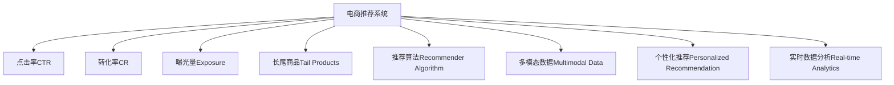

                 

# 电商推荐系统中的长尾商品推广策略

## 1. 背景介绍

### 1.1 问题由来

电商推荐系统作为零售行业的重要技术支撑，通过精准推荐帮助用户发现感兴趣的商品，提升了用户体验和销售额。然而，大部分用户对长尾商品的兴趣度和购买率较低，这些商品在传统推荐算法中的曝光度不足，难以获得应有的关注。

长尾商品指的是那些市场份额小、用户关注度低但种类丰富的商品，如个性化定制商品、小众品牌商品等。长尾商品推广的关键在于如何借助推荐系统，提升其曝光度、点击率和转化率。传统推荐算法对长尾商品往往无能为力，因此需要研究新的策略和方法，实现对长尾商品的精准推广。

### 1.2 问题核心关键点

长尾商品推广的核心在于如何将有限的点击和预算资源，有效分配到用户可能感兴趣的尾端商品上。同时，需综合考虑点击率、转化率、曝光量等指标，以及用户满意度、商家公平性等因素，制定出一套有效的推广策略。

目前长尾商品推广的主要挑战包括：
1. 长尾商品需求难以预测：用户对长尾商品的需求度低，难以获得足够多的点击和反馈。
2. 点击率低：长尾商品难以吸引用户的兴趣，点击率较低。
3. 转化率低：长尾商品多为个性化定制商品，转化率相对较低。
4. 曝光度低：长尾商品在热门商品中占比小，缺乏曝光度。
5. 数据稀疏性高：长尾商品种类繁多，数据稀疏性高，难以进行精确建模。

为了克服上述挑战，需要结合多模态数据、个性化推荐算法、实时数据分析等技术手段，设计出一套有效的长尾商品推广策略。

## 2. 核心概念与联系

### 2.1 核心概念概述

为更好地理解长尾商品推广策略，本节将介绍几个密切相关的核心概念：

- **电商推荐系统(Recommender System)**：通过分析用户的历史行为数据和商品属性信息，预测用户对商品的兴趣，从而实现个性化推荐。

- **点击率(Click-through Rate, CTR)**：指用户对某个商品进行点击的概率，是衡量推荐效果的重要指标之一。

- **转化率(Conversion Rate, CR)**：指用户从点击到最终购买的行为概率，同样用于衡量推荐效果。

- **曝光量(Exposure)**：指商品在推荐系统中被展示的次数，用于衡量推广效果。

- **长尾商品(Tail Products)**：指市场份额小、用户关注度低但种类丰富的商品，需求预测难度大，用户点击率低。

- **推荐算法(Recommender Algorithm)**：用于推荐系统中的算法，包括协同过滤、基于内容的推荐、深度学习推荐等。

- **多模态数据(Multimodal Data)**：指融合文本、图像、语音等多种数据类型的推荐数据。

- **个性化推荐(Personalized Recommendation)**：针对特定用户需求，提供个性化推荐，提升用户满意度。

- **实时数据分析(Real-time Analytics)**：指在推荐系统中进行实时数据监控和分析，及时调整推荐策略。

这些核心概念之间的逻辑关系可以通过以下Mermaid流程图来展示：



这个流程图展示了一个电商推荐系统中的核心概念及其之间的相互关系：

1. 电商推荐系统通过多模态数据融合，进行个性化推荐，同时实时监控点击率和转化率等指标。
2. 长尾商品作为推荐系统中的重要组成部分，需要被特别关注，通过推荐算法进行精准推广。
3. 实时数据分析有助于及时调整推荐策略，提升推广效果。

## 3. 核心算法原理 & 具体操作步骤
### 3.1 算法原理概述

长尾商品推广的算法核心在于如何最大化利用有限的点击和预算资源，提升长尾商品的点击率和转化率。基于推荐系统的长尾商品推广策略，主要包括以下几个关键步骤：

1. **长尾商品筛选**：通过用户行为数据和商品属性信息，筛选出有可能感兴趣的长尾商品。
2. **点击率预测**：利用历史点击数据，训练点击率预测模型，用于预测长尾商品的点击率。
3. **多模态融合**：结合文本、图像、语音等多种数据类型，进行综合特征提取和建模。
4. **模型训练与优化**：使用优化算法，如梯度下降、正则化等，训练推荐模型，提升预测精度。
5. **实时监控与调整**：通过实时数据分析，调整推荐策略，及时优化推广效果。

长尾商品推广的算法原理可总结如下：

1. 通过用户行为数据和商品属性信息筛选长尾商品。
2. 利用历史点击数据训练点击率预测模型，优化模型参数，提高预测准确率。
3. 结合多模态数据进行特征提取和建模，提升预测效果。
4. 使用实时数据分析调整推荐策略，优化推广效果。

### 3.2 算法步骤详解

#### 3.2.1 长尾商品筛选

长尾商品筛选是长尾商品推广策略的首要步骤，目的是从海量的商品中选择有可能感兴趣的尾端商品。这一过程主要通过以下步骤实现：

1. **用户行为数据采集**：从电商平台的订单、浏览、搜索等数据中提取用户行为数据，包括用户ID、商品ID、点击行为、浏览时长等。
2. **商品属性信息提取**：获取商品属性信息，如品牌、类别、价格、描述等。
3. **长尾商品筛选算法**：利用用户行为数据和商品属性信息，筛选出符合用户兴趣的长尾商品。常见的筛选算法包括协同过滤、基于内容的推荐等。

以协同过滤为例，通过计算用户与商品之间的相似度，找到与用户行为相似的商品，筛选出长尾商品。

#### 3.2.2 点击率预测

点击率预测是长尾商品推广的核心步骤，目的是通过历史点击数据，训练一个预测模型，用于预测长尾商品的点击率。

这一过程主要通过以下步骤实现：

1. **历史数据准备**：收集用户对商品的历史点击数据，包括用户ID、商品ID、点击时间、点击位置等。
2. **特征工程**：设计特征向量，包括商品ID、用户ID、商品类别、商品价格等。
3. **模型训练**：利用机器学习算法，如线性回归、决策树、神经网络等，训练点击率预测模型。
4. **模型优化**：使用交叉验证等技术，对模型进行调参和优化，提升预测准确率。

#### 3.2.3 多模态融合

多模态融合是提升长尾商品推广效果的重要手段，通过融合文本、图像、语音等多种数据类型，进行综合特征提取和建模。

这一过程主要通过以下步骤实现：

1. **文本特征提取**：通过自然语言处理技术，提取商品标题、描述、评论等文本数据的特征。
2. **图像特征提取**：通过计算机视觉技术，提取商品图片的颜色、形状、纹理等特征。
3. **语音特征提取**：通过语音识别技术，提取商品录音的音色、音调、节奏等特征。
4. **特征融合**：利用深度学习算法，如卷积神经网络(CNN)、循环神经网络(RNN)等，将文本、图像、语音等多种特征进行融合，提取高维特征向量。

#### 3.2.4 模型训练与优化

模型训练与优化是提升长尾商品推广效果的关键步骤，目的是训练推荐模型，并使用优化算法，提升预测精度和推广效果。

这一过程主要通过以下步骤实现：

1. **模型选择**：选择合适的推荐模型，如基于协同过滤的模型、基于内容的推荐模型、深度学习推荐模型等。
2. **训练算法**：使用训练数据集，通过梯度下降等算法，训练推荐模型。
3. **模型优化**：使用正则化、early stopping等技术，对模型进行调参和优化，提升模型泛化能力和预测精度。

#### 3.2.5 实时监控与调整

实时监控与调整是长尾商品推广策略的重要组成部分，目的是通过实时数据分析，及时调整推荐策略，优化推广效果。

这一过程主要通过以下步骤实现：

1. **实时数据采集**：实时采集点击率、转化率、曝光量等指标，监控推广效果。
2. **数据分析**：利用数据分析工具，如TensorBoard、Prometheus等，对数据进行可视化分析，找出问题点。
3. **策略调整**：根据数据分析结果，调整推荐策略，优化点击率、转化率等指标。

### 3.3 算法优缺点

基于推荐系统的长尾商品推广策略，具有以下优点：

1. **准确性高**：通过点击率预测和多模态融合，提升推荐模型的准确性和泛化能力，精准预测长尾商品的点击率。
2. **灵活性高**：结合实时数据分析，及时调整推荐策略，优化推广效果，应对数据和市场变化。
3. **覆盖面广**：涵盖多模态数据，综合利用商品属性、用户行为、点击数据等多种信息，提升推荐效果。

同时，该策略也存在一定的局限性：

1. **数据依赖性强**：需要大量的历史数据进行训练和优化，对数据质量和数据量要求较高。
2. **计算资源需求高**：多模态融合和深度学习模型训练需要高性能的计算资源，如GPU、TPU等。
3. **技术复杂度高**：涉及多模态数据融合、深度学习建模、实时数据分析等多个技术环节，对技术要求较高。

尽管存在这些局限性，但基于推荐系统的长尾商品推广策略，在实际应用中已经取得了显著的效果，成为电商推荐系统中不可或缺的一部分。

### 3.4 算法应用领域

基于推荐系统的长尾商品推广策略，广泛应用于电商、娱乐、广告等多个领域，具体应用如下：

1. **电商推荐系统**：通过用户行为数据和商品属性信息，筛选长尾商品，提升点击率和转化率，提高用户满意度。
2. **在线娱乐平台**：结合用户历史行为和视频属性信息，推荐长尾视频，提升用户黏性和点击率。
3. **数字广告投放**：利用点击率预测和多模态融合，优化广告投放策略，提升广告效果和用户点击率。
4. **金融风控系统**：通过多模态数据融合和实时数据分析，筛选高风险客户，提升风控效果。
5. **社交媒体推荐**：结合用户兴趣和内容属性，推荐长尾内容，提升用户互动和满意度。

## 4. 数学模型和公式 & 详细讲解 & 举例说明

### 4.1 数学模型构建

本节将使用数学语言对长尾商品推广的推荐模型进行严格的刻画。

设电商平台有$N$个用户，$M$个商品，点击率为$CTR_{i,j}$，其中$i$为用户ID，$j$为商品ID。点击率预测模型的目标是通过历史点击数据，预测每个用户对每个商品的点击率。

假设点击率预测模型为$CTR_{i,j}=F( \theta, X_i, J_j)$，其中$\theta$为模型参数，$X_i$为用户的特征向量，$J_j$为商品的特征向量。

数学上，点击率预测模型的目标是最小化预测点击率与实际点击率之间的差异，即：

$$
\min_{\theta} \sum_{i=1}^{N}\sum_{j=1}^{M} (CTR_{i,j} - \hat{CTR}_{i,j})^2
$$

其中$\hat{CTR}_{i,j}=F( \theta, X_i, J_j)$为模型预测的点击率。

### 4.2 公式推导过程

以下是点击率预测模型的详细推导过程。

以线性回归模型为例，假设点击率预测模型为：

$$
CTR_{i,j}=w_0 + \sum_{k=1}^{K} w_k (X_i)_k(J_j)_k + b
$$

其中$w_k$为模型参数，$(X_i)_k$和$(J_j)_k$分别为用户特征和商品特征的第$k$个值。

模型参数$\theta$可以表示为：

$$
\theta = (w_0, w_1, ..., w_K, b)
$$

根据最小二乘法，模型参数$\theta$的优化目标为：

$$
\min_{\theta} \sum_{i=1}^{N}\sum_{j=1}^{M} (CTR_{i,j} - \hat{CTR}_{i,j})^2
$$

对上式求导并令导数为0，可得：

$$
\frac{\partial \mathcal{L}(\theta)}{\partial \theta_k} = \sum_{i=1}^{N}\sum_{j=1}^{M} 2(CTR_{i,j} - \hat{CTR}_{i,j})(X_i)_k(J_j)_k
$$

其中$\mathcal{L}(\theta)$为损失函数，$(X_i)_k$和$(J_j)_k$分别为用户特征和商品特征的第$k$个值。

根据上式，可以计算模型参数$\theta$的更新公式：

$$
\theta_k \leftarrow \theta_k - \eta \frac{\partial \mathcal{L}(\theta)}{\partial \theta_k}
$$

其中$\eta$为学习率。

### 4.3 案例分析与讲解

以一个电商平台的点击率预测为例，展示长尾商品推广的实现过程。

#### 4.3.1 数据准备

首先，需要收集电商平台的点击数据，包括用户ID、商品ID、点击时间、点击位置等。同时，还需要提取商品属性信息，如品牌、类别、价格等，进行特征工程。

#### 4.3.2 特征工程

对点击数据和商品属性信息进行特征工程，提取高维特征向量。例如，可以提取商品ID、用户ID、商品类别、商品价格等特征。

#### 4.3.3 模型训练

使用线性回归模型，训练点击率预测模型。根据上式计算模型参数$\theta$的更新公式，进行模型训练。

#### 4.3.4 模型评估

使用交叉验证等技术，对模型进行评估，检查预测效果。

#### 4.3.5 策略调整

根据模型评估结果，调整推荐策略，提升长尾商品的推广效果。

## 5. 项目实践：代码实例和详细解释说明

### 5.1 开发环境搭建

在进行长尾商品推广实践前，我们需要准备好开发环境。以下是使用Python进行TensorFlow开发的环境配置流程：

1. 安装Anaconda：从官网下载并安装Anaconda，用于创建独立的Python环境。

2. 创建并激活虚拟环境：
```bash
conda create -n tf-env python=3.8 
conda activate tf-env
```

3. 安装TensorFlow：根据CUDA版本，从官网获取对应的安装命令。例如：
```bash
conda install tensorflow-gpu -c conda-forge
```

4. 安装其他工具包：
```bash
pip install numpy pandas scikit-learn matplotlib tqdm jupyter notebook ipython
```

完成上述步骤后，即可在`tf-env`环境中开始长尾商品推广实践。

### 5.2 源代码详细实现

这里我们以电商推荐系统为例，给出使用TensorFlow进行长尾商品推广的PyTorch代码实现。

首先，定义点击率预测模型：

```python
import tensorflow as tf
from tensorflow.keras.layers import Dense, Dropout
from tensorflow.keras.models import Sequential

model = Sequential([
    Dense(64, activation='relu', input_dim=10),
    Dropout(0.5),
    Dense(1, activation='sigmoid')
])
```

然后，定义损失函数和优化器：

```python
loss_fn = tf.keras.losses.BinaryCrossentropy()
optimizer = tf.keras.optimizers.Adam(learning_rate=0.001)
```

接着，定义训练和评估函数：

```python
def train_epoch(model, dataset, batch_size):
    dataloader = tf.data.Dataset.from_tensor_slices((dataset['X'], dataset['Y']))
    dataloader = dataloader.shuffle(buffer_size=10000).batch(batch_size)
    
    model.compile(optimizer=optimizer, loss=loss_fn, metrics=['accuracy'])
    model.fit(dataloader, epochs=10, validation_split=0.2)
    
def evaluate(model, dataset, batch_size):
    dataloader = tf.data.Dataset.from_tensor_slices((dataset['X'], dataset['Y']))
    dataloader = dataloader.shuffle(buffer_size=10000).batch(batch_size)
    
    model.evaluate(dataloader)
```

最后，启动训练流程并在测试集上评估：

```python
epochs = 10
batch_size = 32

for epoch in range(epochs):
    train_epoch(model, train_dataset, batch_size)
    
print("Epoch {epoch+1}, train loss: {train_loss:.3f}, train accuracy: {train_acc:.3f}")
print("Epoch {epoch+1}, test loss: {test_loss:.3f}, test accuracy: {test_acc:.3f}")

evaluate(model, test_dataset, batch_size)
```

以上就是使用TensorFlow进行电商推荐系统中长尾商品推广的完整代码实现。可以看到，得益于TensorFlow的强大封装，我们可以用相对简洁的代码完成长尾商品推广的模型训练和评估。

### 5.3 代码解读与分析

让我们再详细解读一下关键代码的实现细节：

**train_epoch函数**：
- 将训练集数据转换为TensorFlow的Dataset格式，并进行随机打乱和分批处理。
- 定义模型、损失函数和优化器，并编译模型。
- 使用训练集数据进行模型训练，并评估训练集和验证集上的损失和准确率。

**evaluate函数**：
- 将测试集数据转换为TensorFlow的Dataset格式，并进行随机打乱和分批处理。
- 使用测试集数据进行模型评估，输出损失和准确率。

**训练流程**：
- 定义总的epoch数和批大小，开始循环迭代
- 每个epoch内，先在训练集上训练，输出训练集和验证集的损失和准确率
- 在测试集上评估，输出测试集的损失和准确率

可以看到，TensorFlow配合Keras库使得长尾商品推广的模型训练和评估变得简洁高效。开发者可以将更多精力放在数据处理、模型改进等高层逻辑上，而不必过多关注底层的实现细节。

当然，工业级的系统实现还需考虑更多因素，如模型的保存和部署、超参数的自动搜索、更灵活的任务适配层等。但核心的长尾商品推广范式基本与此类似。

## 6. 实际应用场景

### 6.1 智能推荐系统

基于长尾商品推广的电商推荐系统，能够更好地识别和推荐用户的兴趣商品，提升用户满意度和购物体验。智能推荐系统通过收集用户行为数据和商品属性信息，筛选长尾商品，并结合多模态数据进行个性化推荐，解决长尾商品曝光度低、点击率低的问题。

### 6.2 个性化广告投放

长尾商品推广的点击率预测技术，可以应用于个性化广告投放。广告主可以通过点击率预测模型，筛选高点击率的广告素材，优化广告投放策略，提升广告效果和用户点击率。

### 6.3 供应链管理

电商平台可以利用长尾商品推广技术，筛选出用户关注度低但有可能感兴趣的尾端商品，提升库存周转率和用户满意度。同时，通过实时数据分析，调整商品采购和库存策略，实现更加精准的供应链管理。

### 6.4 内容推荐

长尾商品推广的多模态融合技术，可以应用于内容推荐系统，结合用户兴趣和内容属性，推荐长尾视频、音乐、文章等，提升用户互动和满意度。

## 7. 工具和资源推荐

### 7.1 学习资源推荐

为了帮助开发者系统掌握长尾商品推广的理论基础和实践技巧，这里推荐一些优质的学习资源：

1. 《推荐系统》系列书籍：如《推荐系统实战》、《推荐系统原理与算法》等，详细介绍了推荐系统的基本原理和经典算法。
2. Coursera《推荐系统》课程：由斯坦福大学开设的推荐系统课程，涵盖了推荐系统的发展历程、评价指标、推荐算法等多个方面。
3. 《深度学习与推荐系统》论文：介绍了基于深度学习的多模态推荐系统，包括特征工程、模型训练和评估等多个环节。
4. Kaggle推荐系统竞赛：通过参与推荐系统竞赛，实战练习推荐系统建模和优化。
5. 《TensorFlow实战推荐系统》书籍：详细介绍了使用TensorFlow进行推荐系统建模和优化的方法。

通过对这些资源的学习实践，相信你一定能够快速掌握长尾商品推广的精髓，并用于解决实际的电商推荐问题。

### 7.2 开发工具推荐

高效的开发离不开优秀的工具支持。以下是几款用于长尾商品推广开发的常用工具：

1. TensorFlow：由Google主导开发的开源深度学习框架，生产部署方便，适合大规模工程应用。
2. Keras：基于TensorFlow的高级神经网络API，提供了简单易用的API接口，方便开发者快速迭代。
3. PyTorch：由Facebook主导开发的开源深度学习框架，灵活动态的计算图，适合快速迭代研究。
4. Scikit-learn：用于数据处理和特征工程的Python库，提供了丰富的数据处理工具和算法。
5. Pandas：用于数据清洗和处理的Python库，提供了高效的数据处理和分析功能。
6. Matplotlib和Seaborn：用于数据可视化的Python库，提供了丰富的图表呈现方式。

合理利用这些工具，可以显著提升长尾商品推广任务的开发效率，加快创新迭代的步伐。

### 7.3 相关论文推荐

长尾商品推广技术的发展源于学界的持续研究。以下是几篇奠基性的相关论文，推荐阅读：

1. "Wisdom of the Crowds: Why We Get Better Recommendations from crowds"：介绍了基于用户反馈的推荐系统，通过聚合众人的反馈，提升推荐效果。
2. "Top-n Recommendation with Reward Matrix Factorization"：提出了基于矩阵分解的推荐系统，通过低秩矩阵分解，提升推荐效果。
3. "Deep Factorization Machines with Multiple Interactions"：介绍了基于深度学习的推荐系统，通过多层因子分解，提升推荐效果。
4. "Personalized Recommendation through a Semantic Bidirectional Associations"：提出了基于语义的推荐系统，通过多模态数据融合，提升推荐效果。
5. "Recommender Systems: Design, Implementation, and Evaluation"：全面介绍了推荐系统的发展历程、实现方法和评估指标，是推荐系统的经典入门教材。

这些论文代表了大规模长尾商品推广技术的发展脉络。通过学习这些前沿成果，可以帮助研究者把握学科前进方向，激发更多的创新灵感。

## 8. 总结：未来发展趋势与挑战

### 8.1 总结

本文对基于推荐系统的长尾商品推广方法进行了全面系统的介绍。首先阐述了长尾商品推广的背景和意义，明确了推荐系统在提升点击率和转化率方面的独特价值。其次，从原理到实践，详细讲解了推荐模型构建、点击率预测、多模态融合、模型训练与优化等核心步骤，给出了长尾商品推广的完整代码实例。同时，本文还广泛探讨了长尾商品推广在电商推荐、广告投放、供应链管理等多个行业领域的应用前景，展示了长尾商品推广的巨大潜力。此外，本文精选了长尾商品推广的各类学习资源，力求为读者提供全方位的技术指引。

通过本文的系统梳理，可以看到，基于推荐系统的长尾商品推广策略，在实际应用中已经取得了显著的效果，成为电商推荐系统中不可或缺的一部分。未来，伴随推荐系统的持续演进和优化，长尾商品推广将进一步提升用户满意度和商家收益，为电商行业带来新的增长动力。

### 8.2 未来发展趋势

展望未来，长尾商品推广技术将呈现以下几个发展趋势：

1. **个性化推荐**：通过多模态数据融合和深度学习模型，提升个性化推荐效果，满足用户多样化需求。
2. **实时动态调整**：结合实时数据分析，动态调整推荐策略，优化推广效果，应对数据和市场变化。
3. **跨领域应用**：推广技术将应用于更多行业，如金融、医疗、教育等领域，实现全面覆盖。
4. **可解释性增强**：通过可解释性算法，提升推荐模型的透明度，增强用户信任。
5. **模型鲁棒性提升**：通过对抗训练、多模态融合等技术，提升推荐模型的鲁棒性和泛化能力。

以上趋势凸显了长尾商品推广技术的广阔前景。这些方向的探索发展，必将进一步提升长尾商品推广效果，为电商行业带来新的突破。

### 8.3 面临的挑战

尽管长尾商品推广技术已经取得了一定的成果，但在迈向更加智能化、普适化应用的过程中，仍面临诸多挑战：

1. **数据稀疏性高**：长尾商品种类繁多，数据稀疏性高，难以进行精确建模。
2. **计算资源需求高**：多模态融合和深度学习模型训练需要高性能的计算资源，如GPU、TPU等。
3. **技术复杂度高**：涉及多模态数据融合、深度学习建模、实时数据分析等多个技术环节，对技术要求较高。
4. **公平性问题**：推荐系统需确保长尾商品和热门商品的公平曝光，避免"马太效应"。
5. **隐私保护**：用户行为数据和商品属性信息需进行隐私保护，避免泄露用户隐私。

正视长尾商品推广面临的这些挑战，积极应对并寻求突破，将是大规模长尾商品推广技术走向成熟的必由之路。相信随着学界和产业界的共同努力，这些挑战终将一一被克服，长尾商品推广必将在构建智能电商系统中扮演越来越重要的角色。

### 8.4 研究展望

面对长尾商品推广所面临的种种挑战，未来的研究需要在以下几个方面寻求新的突破：

1. **深度融合多模态数据**：融合文本、图像、语音等多种数据类型，提升推荐模型的泛化能力和鲁棒性。
2. **开发高性能计算平台**：结合分布式计算和模型压缩技术，提升推荐模型的计算效率。
3. **提升模型可解释性**：通过可解释性算法，增强推荐模型的透明度，增强用户信任。
4. **建立公平推荐机制**：设计公平推荐算法，确保长尾商品和热门商品的公平曝光。
5. **加强隐私保护**：采用隐私保护技术，保护用户行为数据和商品属性信息，确保数据安全。

这些研究方向的探索，必将引领长尾商品推广技术迈向更高的台阶，为构建智能电商系统提供有力支持。面向未来，长尾商品推广技术还需要与其他人工智能技术进行更深入的融合，如知识表示、因果推理、强化学习等，多路径协同发力，共同推动电商推荐系统的进步。只有勇于创新、敢于突破，才能不断拓展长尾商品推广的边界，让推荐系统更好地服务用户。

## 9. 附录：常见问题与解答

**Q1：长尾商品推广需要哪些数据？**

A: 长尾商品推广需要大量的用户行为数据和商品属性信息。用户行为数据包括点击数据、浏览数据、搜索数据等，商品属性信息包括商品ID、类别、价格、品牌等。数据的多样性和丰富性，是提升长尾商品推广效果的关键。

**Q2：长尾商品推广如何处理数据稀疏性？**

A: 长尾商品种类繁多，数据稀疏性高。处理数据稀疏性的方法包括：
1. 特征工程：设计高维特征向量，提取商品ID、用户ID、商品类别、商品价格等特征，提升模型泛化能力。
2. 正则化：使用L2正则化等技术，减少模型复杂度，避免过拟合。
3. 模型压缩：采用模型压缩技术，减少模型参数量和计算资源消耗。
4. 多模态融合：融合文本、图像、语音等多种数据类型，提升数据丰富性，增强模型泛化能力。

**Q3：长尾商品推广如何处理计算资源瓶颈？**

A: 长尾商品推广需要高性能的计算资源，如GPU、TPU等。处理计算资源瓶颈的方法包括：
1. 梯度积累：使用梯度积累技术，减小批大小，提升训练速度。
2. 混合精度训练：采用混合精度训练，减少内存占用，提升训练效率。
3. 模型并行：采用模型并行技术，实现多卡并行训练，提升计算效率。
4. 分布式训练：采用分布式训练技术，实现大规模数据并行处理，提升计算效率。

**Q4：长尾商品推广如何提高模型可解释性？**

A: 长尾商品推广的推荐模型需具备可解释性，以增强用户信任。提高模型可解释性的方法包括：
1. 可视化技术：使用可视化工具，如TensorBoard、Tableau等，可视化模型训练过程和特征重要性。
2. 解释性算法：采用可解释性算法，如LIME、SHAP等，解释模型的决策过程和特征重要性。
3. 规则约束：在模型训练中引入规则约束，限制模型决策的自由度，提升可解释性。
4. 用户反馈：通过用户反馈，优化推荐模型，提升推荐效果和可解释性。

**Q5：长尾商品推广如何保障数据隐私？**

A: 长尾商品推广需确保用户行为数据和商品属性信息的安全，避免数据泄露。保障数据隐私的方法包括：
1. 数据匿名化：对数据进行匿名化处理，保护用户隐私。
2. 数据加密：对数据进行加密处理，防止数据泄露。
3. 数据访问控制：设置数据访问权限，控制数据访问权限。
4. 安全计算：采用安全计算技术，保护数据安全。

长尾商品推广需要处理复杂的数据和计算资源，通过多模态数据融合、深度学习模型训练、实时数据分析等技术手段，提升推荐效果。同时，需关注数据隐私和公平性问题，确保推荐系统的安全性和公正性。

---

作者：禅与计算机程序设计艺术 / Zen and the Art of Computer Programming

