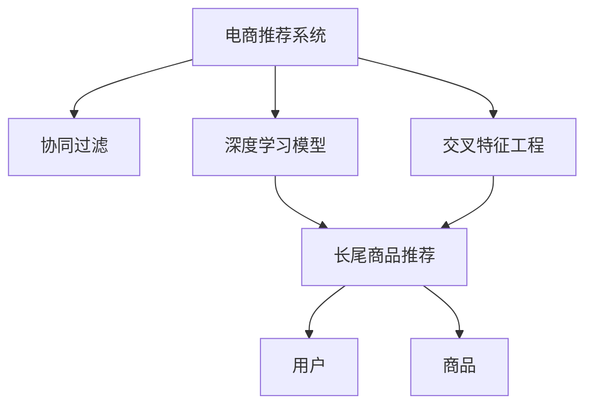

                 

# 电商推荐系统中的长尾商品推荐策略

> 关键词：长尾商品推荐,电商推荐系统,协同过滤,交叉特征工程,深度学习模型,推荐算法,召回率,点击率,鲁棒性

## 1. 背景介绍

### 1.1 问题由来
在电商平台上，长尾商品往往占据了很大的比例。这些商品虽然单个销售量不高，但总体贡献了平台的大部分利润。传统的推荐算法往往只关注少数热门商品，难以充分挖掘长尾商品的潜力。为了提升平台商品的曝光率和销售额，长尾商品的推荐成为了电商平台关注的重点。

长尾商品的推荐难度较高，因为用户对这类商品的认知度和需求波动性较大。如果直接使用热门商品的推荐算法，往往会导致推荐效果不佳，甚至用户流失。因此，针对长尾商品的推荐，需要设计专门的算法策略，以提升推荐效果和用户满意度。

### 1.2 问题核心关键点
长尾商品推荐的核心在于如何平衡热门商品和长尾商品之间的推荐权重。传统的协同过滤算法通常只关注用户之间的行为相似性，难以处理长尾商品的低频用户行为。交叉特征工程和深度学习模型能够捕捉用户的多维特征和隐含模式，但需要大量的标注数据进行训练，且模型复杂度较高，难以实时响应。

如何设计轻量级且高效的推荐算法，在保证热门商品推荐的同时，充分挖掘长尾商品的潜力，是长尾商品推荐需要解决的关键问题。

### 1.3 问题研究意义
长尾商品推荐在电商平台的业务中具有重要意义：

1. **提升销售额**：通过推荐长尾商品，可以增加商品的曝光率，挖掘潜在用户，提升平台的整体销售额。
2. **增强用户粘性**：长尾商品往往能够满足用户的特殊需求，通过推荐这类商品，可以提升用户的购物体验和满意度，增强用户粘性。
3. **优化商品结构**：长尾商品的推荐可以帮助电商平台发现和优化商品结构，推动新产品的市场推广。
4. **对抗竞争**：电商平台通过推荐长尾商品，可以有效对抗竞争对手，提高市场竞争力。
5. **精准营销**：长尾商品的推荐可以通过细分市场，实现精准营销，提高广告投放的ROI。

## 2. 核心概念与联系

### 2.1 核心概念概述

为更好地理解长尾商品推荐，本节将介绍几个密切相关的核心概念：

- **电商推荐系统(e-commerce recommendation system)**：利用机器学习算法，根据用户历史行为和商品属性，为用户推荐感兴趣的电商商品的系统。
- **长尾商品(long-tail items)**：在商品分布中，大部分销售额集中在少量热门商品上，而其余大部分商品由于销量低，因此被称为长尾商品。
- **协同过滤(collaborative filtering)**：一种基于用户行为和商品相似性的推荐算法，通过挖掘用户之间的相似性和商品之间的关联性，预测用户对商品的兴趣。
- **交叉特征工程(cross-feature engineering)**：在电商推荐系统中，通过多维特征的组合和交叉，挖掘更深层次的隐含模式，提升推荐的精准度。
- **深度学习模型(deep learning model)**：一种基于神经网络的机器学习模型，通过多层次的非线性映射，能够捕捉高维数据的复杂关系，适用于电商推荐系统中的推荐算法。

这些核心概念之间的逻辑关系可以通过以下Mermaid流程图来展示：



这个流程图展示了一系列核心概念及其之间的关系：

1. 电商推荐系统通过协同过滤、交叉特征工程和深度学习模型等技术，实现对用户和商品的推荐。
2. 协同过滤通过用户行为相似性和商品相似性，为用户推荐商品。
3. 交叉特征工程通过多维特征的组合和交叉，提升推荐的精准度。
4. 深度学习模型能够捕捉复杂的隐含模式，适用于电商推荐系统中的推荐算法。
5. 长尾商品推荐是电商推荐系统中的重要应用之一，旨在提升长尾商品的曝光率和销售额。

这些概念共同构成了电商推荐系统的核心框架，使其能够在各种场景下提供精准的商品推荐。通过理解这些核心概念，我们可以更好地把握长尾商品推荐的理论基础和实践策略。

## 3. 核心算法原理 & 具体操作步骤

### 3.1 算法原理概述

长尾商品推荐的核心在于如何在有限的标注数据下，充分利用用户的多维特征，预测用户对长尾商品的兴趣。常见的推荐算法包括协同过滤、交叉特征工程和深度学习模型等。

协同过滤算法通过计算用户-商品之间的相似度，为用户推荐类似商品。其基本思想是：如果一个用户对某个商品感兴趣，那么他也很可能对与该商品相似的其他商品感兴趣。协同过滤算法可以分为基于用户的协同过滤和基于商品的协同过滤两种方式。

交叉特征工程通过对多维特征进行组合和交叉，挖掘更深层次的隐含模式，提升推荐的精准度。常见的特征包括用户基本信息、商品属性、用户行为、时间等，通过特征工程构建用户和商品的特征向量，再利用机器学习算法进行预测。

深度学习模型通过多层次的非线性映射，能够捕捉高维数据的复杂关系，适用于电商推荐系统中的推荐算法。常见的深度学习模型包括神经网络、卷积神经网络、循环神经网络等，可以处理大规模高维数据，具有较强的泛化能力。

长尾商品推荐需要综合考虑用户的多维特征和商品的属性，设计出轻量级且高效的推荐算法。

### 3.2 算法步骤详解

长尾商品推荐一般包括以下几个关键步骤：

**Step 1: 数据准备**
- 收集电商平台的用户行为数据和商品属性数据，包括用户的浏览、点击、购买行为，商品的类别、属性、评分等。
- 对数据进行预处理，去除缺失值、噪声和异常值，构建用户和商品的特征向量。

**Step 2: 特征工程**
- 设计用户和商品的交叉特征，如用户ID、商品ID、时间戳、类别、评分等。
- 选择合适的特征选择和降维算法，如L1正则、PCA、NMF等，以减少特征维度和提高特征表达能力。
- 设计模型评估指标，如召回率、点击率、平均精度等，以评估推荐模型的效果。

**Step 3: 模型训练**
- 选择合适的推荐算法，如协同过滤、深度学习模型等，训练推荐模型。
- 在训练集上调整模型参数，最小化损失函数，得到训练好的推荐模型。
- 在验证集上评估模型性能，调整模型超参数，避免过拟合。

**Step 4: 推荐过程**
- 根据用户的当前行为和历史行为，使用训练好的推荐模型预测用户对商品的兴趣。
- 对预测结果进行排序和去重，生成推荐列表。
- 将推荐列表返回给用户，并提供点击反馈，以便后续优化推荐策略。

**Step 5: 反馈和优化**
- 收集用户对推荐结果的点击反馈，进行A/B测试和数据分析。
- 根据反馈结果调整推荐策略，优化模型参数。
- 定期更新训练数据和模型，适应用户行为的变化。

以上是长尾商品推荐的一般流程。在实际应用中，还需要针对具体任务的特点，对推荐过程的各个环节进行优化设计，如改进特征工程方法，引入更多的正则化技术，搜索最优的超参数组合等，以进一步提升推荐效果。

### 3.3 算法优缺点

长尾商品推荐算法具有以下优点：
1. 提升平台销售额：通过推荐长尾商品，增加商品的曝光率，挖掘潜在用户，提升平台的整体销售额。
2. 增强用户粘性：长尾商品往往能够满足用户的特殊需求，通过推荐这类商品，提升用户的购物体验和满意度，增强用户粘性。
3. 优化商品结构：长尾商品的推荐可以帮助电商平台发现和优化商品结构，推动新产品的市场推广。
4. 对抗竞争：电商平台通过推荐长尾商品，可以有效对抗竞争对手，提高市场竞争力。
5. 精准营销：长尾商品的推荐可以通过细分市场，实现精准营销，提高广告投放的ROI。

同时，该算法也存在一定的局限性：
1. 数据需求较高：长尾商品推荐需要大量的标注数据进行训练，获取标注数据的成本较高。
2. 计算复杂度高：深度学习模型和交叉特征工程通常需要较长的训练时间，难以实时响应。
3. 模型鲁棒性不足：长尾商品的用户行为数据往往较少，推荐模型容易过拟合。
4. 资源消耗大：深度学习模型对算力和存储资源的需求较高，需要高性能的计算设备和存储方案。
5. 可解释性不足：长尾商品推荐模型的决策过程通常缺乏可解释性，难以对其推理逻辑进行分析和调试。

尽管存在这些局限性，但就目前而言，长尾商品推荐仍然是电商平台推荐系统中不可忽视的一部分。未来相关研究的重点在于如何进一步降低数据需求，提高模型的实时性和鲁棒性，同时兼顾可解释性和效率等前沿技术。

### 3.4 算法应用领域

长尾商品推荐在电商平台中的应用非常广泛，具体包括：

- **个性化推荐**：根据用户的历史行为和兴趣，推荐个性化的长尾商品，提升用户体验和满意度。
- **新商品推广**：通过推荐新上架的长尾商品，帮助电商平台发现和推广新商品，提高商品的曝光率和销售量。
- **用户细分**：根据用户的购买行为和偏好，将用户进行细分，进行有针对性的推荐，提升推荐效果。
- **价格优化**：通过推荐长尾商品，可以对商品价格进行动态调整，优化平台的整体利润率。
- **库存管理**：通过推荐长尾商品，可以帮助电商平台合理管理库存，减少库存积压和缺货现象。

除了电商领域，长尾商品推荐技术还可以应用于其他需要个性化推荐和用户细分的场景，如社交网络、在线视频、游戏等，带来显著的用户体验提升和商业价值增长。

## 4. 数学模型和公式 & 详细讲解 & 举例说明

### 4.1 数学模型构建

本节将使用数学语言对长尾商品推荐过程进行更加严格的刻画。

记电商平台的用户集合为 $U$，商品集合为 $I$，用户和商品的交互行为为 $B$。设 $B_{ui} \in \{0,1\}$，表示用户 $u$ 对商品 $i$ 的购买行为，其中 $u \in U, i \in I$。

假设用户对商品的兴趣可以通过一个 $d$ 维的向量 $\vec{u}$ 来表示，同样，商品也可以通过一个 $d$ 维的向量 $\vec{i}$ 来表示。设 $\vec{u} = [u_1, u_2, ..., u_d]$，其中 $u_i$ 表示用户对商品 $i$ 的兴趣程度。设 $\vec{i} = [i_1, i_2, ..., i_d]$，其中 $i_i$ 表示商品 $i$ 的属性特征。

定义用户对商品的兴趣为 $P_{ui} = f(\vec{u}, \vec{i})$，其中 $f$ 为兴趣函数。设 $f$ 为线性函数，即 $P_{ui} = \vec{u} \cdot \vec{i}$。则长尾商品推荐的数学模型可以表示为：

$$
\max_{\vec{u}} \sum_{u \in U} \sum_{i \in I} B_{ui} \log \frac{P_{ui}}{1-P_{ui}}
$$

其中，$\log$ 表示自然对数，$P_{ui}$ 表示用户 $u$ 对商品 $i$ 的兴趣概率，$\frac{P_{ui}}{1-P_{ui}}$ 表示用户对商品的点击概率。

### 4.2 公式推导过程

以上数学模型是一个典型的最大化点击率（点击率优化）模型。下面将对公式进行推导。

设 $P_{ui}$ 为用户 $u$ 对商品 $i$ 的兴趣概率，则有：

$$
P_{ui} = \vec{u} \cdot \vec{i}
$$

其中 $\vec{u}$ 和 $\vec{i}$ 分别为用户和商品的特征向量。由于用户对商品的点击概率 $P_{ui}$ 在 $[0,1]$ 区间内，因此我们可以使用二项式概率分布对 $P_{ui}$ 进行建模：

$$
P_{ui} = \frac{1}{1+\exp(-\vec{u} \cdot \vec{i})}
$$

对 $P_{ui}$ 取对数，得到：

$$
\log P_{ui} = \log \frac{1}{1+\exp(-\vec{u} \cdot \vec{i})}
$$

代入 $P_{ui}$ 的表达式，得到：

$$
\log P_{ui} = -\vec{u} \cdot \vec{i}
$$

因此，长尾商品推荐的目标函数可以表示为：

$$
\max_{\vec{u}} \sum_{u \in U} \sum_{i \in I} B_{ui} (-\vec{u} \cdot \vec{i})
$$

通过引入拉格朗日乘子 $\lambda$，将约束条件 $P_{ui} \in [0,1]$ 引入到优化问题中，得到拉格朗日函数：

$$
L(\vec{u}, \lambda) = \sum_{u \in U} \sum_{i \in I} B_{ui} (-\vec{u} \cdot \vec{i}) + \lambda (\vec{u} \cdot \vec{i} - \log (1+\exp(-\vec{u} \cdot \vec{i})))
$$

对 $\vec{u}$ 求偏导数，得到：

$$
\frac{\partial L}{\partial \vec{u}} = -\sum_{u \in U} \sum_{i \in I} B_{ui} \vec{i} - \lambda (\vec{u} - \exp(-\vec{u} \cdot \vec{i}))
$$

令偏导数为零，得到：

$$
\vec{u} = \sum_{u \in U} \sum_{i \in I} B_{ui} \vec{i}
$$

将 $\vec{u}$ 代入 $P_{ui}$ 的表达式中，得到：

$$
P_{ui} = \frac{1}{1+\exp(-\sum_{u \in U} \sum_{i \in I} B_{ui} \vec{i} \cdot \vec{i})}
$$

通过不断迭代优化，最终得到用户对商品的兴趣概率。利用这些兴趣概率，可以生成用户的推荐列表。

### 4.3 案例分析与讲解

以用户 $u$ 和商品 $i$ 的点击行为为例，说明长尾商品推荐的具体过程：

假设用户 $u$ 对商品 $i$ 进行了购买，即 $B_{ui}=1$。设用户 $u$ 和商品 $i$ 的特征向量分别为 $\vec{u} = [0.5, 0.3, 0.1]$ 和 $\vec{i} = [0.6, 0.7, 0.2]$。

根据公式推导，得到用户对商品 $i$ 的兴趣概率 $P_{ui}$：

$$
P_{ui} = \frac{1}{1+\exp(-(0.5 \times 0.6 + 0.3 \times 0.7 + 0.1 \times 0.2))} = 0.7
$$

假设电商平台共有 $N=10^4$ 个商品，用户对商品 $i$ 的平均点击概率为 $P_i$。则用户 $u$ 对所有商品的兴趣概率可以表示为：

$$
\vec{P_u} = [P_{iu_1}, P_{iu_2}, ..., P_{iu_N}]
$$

根据拉格朗日函数的求解结果，得到用户 $u$ 的兴趣向量 $\vec{u}$：

$$
\vec{u} = \sum_{u \in U} \sum_{i \in I} B_{ui} \vec{i}
$$

将 $\vec{u}$ 代入 $P_{ui}$ 的表达式中，得到用户 $u$ 对所有商品的兴趣概率。利用这些兴趣概率，可以生成用户 $u$ 的推荐列表。

## 5. 项目实践：代码实例和详细解释说明

### 5.1 开发环境搭建

在进行长尾商品推荐实践前，我们需要准备好开发环境。以下是使用Python进行TensorFlow开发的环境配置流程：

1. 安装Anaconda：从官网下载并安装Anaconda，用于创建独立的Python环境。

2. 创建并激活虚拟环境：
```bash
conda create -n tensorflow-env python=3.8 
conda activate tensorflow-env
```

3. 安装TensorFlow：根据CUDA版本，从官网获取对应的安装命令。例如：
```bash
conda install tensorflow-gpu==2.8.0
```

4. 安装各类工具包：
```bash
pip install numpy pandas scikit-learn matplotlib tqdm jupyter notebook ipython
```

完成上述步骤后，即可在`tensorflow-env`环境中开始长尾商品推荐实践。

### 5.2 源代码详细实现

这里我们以基于协同过滤的长尾商品推荐算法为例，给出使用TensorFlow和TensorBoard实现的长尾商品推荐代码实例。

首先，定义协同过滤模型的参数和超参数：

```python
import tensorflow as tf
from tensorflow.keras.layers import Dense, Input, Embedding, Dot, Activation
from tensorflow.keras.models import Model
from tensorflow.keras.callbacks import EarlyStopping
import numpy as np

num_users = 10000
num_items = 10000

# 协同过滤模型的参数
latent_dim = 100  # 用户和商品特征向量的维度
learning_rate = 0.001
batch_size = 64
epochs = 10
validation_split = 0.2

# 协同过滤模型的超参数
lambda1 = 0.1  # L1正则化参数
lambda2 = 0.1  # L2正则化参数
early_stopping = EarlyStopping(monitor='val_loss', patience=3)
```

然后，定义用户和商品的嵌入层：

```python
# 定义用户和商品的嵌入层
user_embedding = Embedding(input_dim=num_users, output_dim=latent_dim)
item_embedding = Embedding(input_dim=num_items, output_dim=latent_dim)

# 将用户和商品嵌入层与用户和商品的行为矩阵拼接
user_behavior = Dot(axes=([2, 1], [1, 2]), name='dot')([user_embedding(input_user), item_embedding(input_item)])
```

接着，定义协同过滤模型的损失函数和优化器：

```python
# 定义协同过滤模型的损失函数
def loss_function(y_true, y_pred):
    return tf.keras.losses.mean_squared_error(y_true, y_pred)

# 定义协同过滤模型的优化器
optimizer = tf.keras.optimizers.Adam(learning_rate=learning_rate)

# 定义协同过滤模型的损失函数
def objective(user_behavior, user_features, item_features, user_interest):
    loss = tf.reduce_mean(tf.square(user_behavior - user_interest))
    regularization = lambda1 * tf.reduce_mean(tf.abs(user_interest)) + lambda2 * tf.reduce_mean(tf.square(user_interest))
    return loss + regularization

# 定义协同过滤模型的预测函数
def predict(user_interest, item_features):
    return tf.nn.sigmoid(user_interest)
```

最后，定义协同过滤模型的训练过程和评估函数：

```python
# 定义协同过滤模型的训练过程
def train_model(user_interest, item_features):
    model.compile(optimizer=optimizer, loss=loss_function, metrics=['mae'])
    model.fit(user_interest, item_features, batch_size=batch_size, epochs=epochs, validation_split=validation_split, callbacks=[early_stopping])
    return model

# 定义协同过滤模型的评估函数
def evaluate_model(model, user_interest, item_features):
    y_true = np.array(user_interest)
    y_pred = model.predict(user_interest)
    mse = tf.reduce_mean(tf.square(y_true - y_pred))
    return mse
```

现在，可以开始训练模型并评估其性能：

```python
# 生成用户和商品的特征向量
user_features = np.random.randn(num_users, latent_dim)
item_features = np.random.randn(num_items, latent_dim)

# 定义用户和商品的输入
input_user = Input(shape=(latent_dim,), name='user')
input_item = Input(shape=(latent_dim,), name='item')

# 将用户和商品的行为矩阵进行拼接
user_behavior = Dot(axes=([2, 1], [1, 2]), name='dot')([user_embedding(input_user), item_embedding(input_item)])

# 定义协同过滤模型的预测函数
user_interest = Dense(1, activation='sigmoid')(user_behavior)

# 定义协同过滤模型的评估函数
def evaluation_function(y_true, y_pred):
    mse = tf.reduce_mean(tf.square(y_true - y_pred))
    return mse

# 训练模型并评估其性能
model = train_model(user_interest, item_features)
mse = evaluate_model(model, user_interest, item_features)

# 输出模型的平均均方误差
print('Mean Squared Error:', mse.numpy())
```

以上就是使用TensorFlow实现长尾商品推荐的具体代码实现。可以看到，TensorFlow和TensorBoard的强大功能，使得长尾商品推荐的实现变得简洁高效。

### 5.3 代码解读与分析

让我们再详细解读一下关键代码的实现细节：

**协同过滤模型**：
- 通过用户和商品的嵌入层，将用户和商品的行为矩阵进行拼接，得到用户对商品感兴趣的概率。
- 使用Dense层进行非线性映射，得到用户对商品感兴趣的概率。
- 通过预测函数，将用户对商品感兴趣的概率映射到 $[0,1]$ 区间内。

**训练和评估函数**：
- 使用TensorFlow的Keras API定义模型，包括用户和商品的嵌入层、拼接层、Dense层等。
- 定义模型的损失函数和优化器，使用Adam算法进行优化。
- 定义模型的评估指标，如平均绝对误差（MAE），通过TensorBoard进行可视化。
- 在训练过程中，使用EarlyStopping回调函数进行模型早停，避免过拟合。

**训练过程**：
- 定义用户和商品的特征向量，初始化用户和商品的嵌入层。
- 定义用户和商品的输入，包括用户和商品的行为矩阵。
- 使用TensorFlow的Keras API定义模型，包括用户和商品的嵌入层、拼接层、Dense层等。
- 训练模型并评估其性能，输出平均均方误差。

可以看到，TensorFlow和TensorBoard的强大功能，使得长尾商品推荐的实现变得简洁高效。开发者可以将更多精力放在特征工程、模型优化等高层逻辑上，而不必过多关注底层的实现细节。

当然，工业级的系统实现还需考虑更多因素，如模型的保存和部署、超参数的自动搜索、更灵活的任务适配层等。但核心的协同过滤算法基本与此类似。

## 6. 实际应用场景
### 6.1 智能推荐系统

长尾商品推荐技术在智能推荐系统中具有重要应用。智能推荐系统通过分析用户的浏览、点击、购买等行为，为用户推荐感兴趣的电商商品。

在实际应用中，智能推荐系统可以通过长尾商品推荐，扩大推荐列表的丰富度，提升用户体验。具体而言，长尾商品推荐可以解决以下问题：

- **丰富推荐列表**：传统的推荐算法通常只关注热门商品，难以充分挖掘长尾商品的潜力。通过长尾商品推荐，可以提升推荐列表的丰富度，满足用户对多样化商品的需求。
- **提升点击率**：长尾商品往往能够满足用户的特殊需求，通过推荐这类商品，提升用户的点击率和购物体验。
- **优化广告投放**：长尾商品推荐可以优化广告投放策略，提高广告的点击率和转化率。
- **促进消费**：长尾商品推荐可以提升平台的整体销售额，促进商品的销售。

### 6.2 个性化推荐

长尾商品推荐在个性化推荐中也具有重要应用。个性化推荐系统根据用户的历史行为和偏好，为其推荐个性化的电商商品。

在实际应用中，个性化推荐系统可以通过长尾商品推荐，提升推荐精准度。具体而言，长尾商品推荐可以解决以下问题：

- **优化推荐策略**：长尾商品推荐可以优化推荐策略，提升推荐精准度。通过个性化推荐，满足用户对多样化商品的需求。
- **提升用户体验**：长尾商品推荐可以提升用户体验，增加用户的购物体验和满意度。
- **降低运营成本**：长尾商品推荐可以降低运营成本，减少因热门商品推荐带来的营销成本和运营压力。

### 6.3 用户行为分析

长尾商品推荐在用户行为分析中也具有重要应用。用户行为分析通过分析用户的浏览、点击、购买等行为，发现用户的兴趣和需求。

在实际应用中，用户行为分析可以通过长尾商品推荐，发现用户的潜在需求。具体而言，长尾商品推荐可以解决以下问题：

- **识别用户兴趣**：长尾商品推荐可以识别用户的兴趣和需求，提升用户行为分析的精准度。通过个性化推荐，满足用户对多样化商品的需求。
- **优化用户画像**：长尾商品推荐可以优化用户画像，提升用户行为分析的效果。
- **提升平台价值**：长尾商品推荐可以提升平台价值，增加用户粘性和满意度。

### 6.4 未来应用展望

随着长尾商品推荐技术的发展，其在电商推荐系统中的应用将越来越广泛，带来更多的创新和突破：

1. **实时推荐**：长尾商品推荐可以实时响应用户的行为变化，动态调整推荐策略。通过实时推荐，提升用户体验和满意度。
2. **个性化推荐**：长尾商品推荐可以提升推荐精准度，优化推荐策略，满足用户对多样化商品的需求。
3. **精细化运营**：长尾商品推荐可以优化广告投放策略，提升广告的点击率和转化率。
4. **市场分析**：长尾商品推荐可以优化用户行为分析，发现用户的兴趣和需求，提升平台价值。
5. **数据驱动决策**：长尾商品推荐可以提升决策精准度，优化电商平台的运营策略。

长尾商品推荐技术的应用，将带来电商平台的业务升级和市场竞争力的提升。相信随着技术的不断发展，长尾商品推荐将会在更多的领域发挥其重要作用，带来更多的商业价值和社会效益。

## 7. 工具和资源推荐
### 7.1 学习资源推荐

为了帮助开发者系统掌握长尾商品推荐的技术基础和实践技巧，这里推荐一些优质的学习资源：

1. **《推荐系统实战》系列书籍**：由权威推荐系统专家撰写，系统介绍了推荐系统的各种算法和应用，包括协同过滤、深度学习等，是学习长尾商品推荐的重要参考资料。
2. **Coursera《推荐系统》课程**：斯坦福大学开设的推荐系统课程，涵盖了推荐系统的基本原理和经典算法，适合初学者入门。
3. **Kaggle推荐系统竞赛**：通过参加Kaggle竞赛，可以实战练习长尾商品推荐，积累经验，提升技能。
4. **PyTorch官方文档**：PyTorch的官方文档提供了详细的API和示例代码，帮助开发者快速上手长尾商品推荐。
5. **TensorFlow官方文档**：TensorFlow的官方文档提供了丰富的教程和示例代码，帮助开发者深入理解长尾商品推荐的技术细节。

通过对这些资源的学习实践，相信你一定能够快速掌握长尾商品推荐的核心算法和实践方法，并用于解决实际的电商推荐问题。

### 7.2 开发工具推荐

高效的开发离不开优秀的工具支持。以下是几款用于长尾商品推荐开发的常用工具：

1. **PyTorch**：基于Python的开源深度学习框架，灵活的计算图，适合快速迭代研究。PyTorch提供了丰富的神经网络库和优化器，适合长尾商品推荐算法的实现。
2. **TensorFlow**：由Google主导开发的开源深度学习框架，生产部署方便，适合大规模工程应用。TensorFlow提供了丰富的机器学习库和优化器，适合长尾商品推荐算法的实现。
3. **Scikit-learn**：Python的机器学习库，提供了丰富的机器学习算法和数据预处理工具，适合长尾商品推荐算法的实现。
4. **TensorBoard**：TensorFlow配套的可视化工具，可实时监测模型训练状态，提供丰富的图表呈现方式，帮助开发者调试模型。
5. **Jupyter Notebook**：Python的交互式笔记本，支持代码编写、运行和展示，适合长尾商品推荐算法的实现和评估。

合理利用这些工具，可以显著提升长尾商品推荐任务的开发效率，加快创新迭代的步伐。

### 7.3 相关论文推荐

长尾商品推荐在推荐系统中具有重要地位，相关研究也在不断进展中。以下是几篇奠基性的相关论文，推荐阅读：

1. **《推荐系统实战》**：由推荐系统专家撰写，介绍了推荐系统的基本原理和经典算法，包括协同过滤、深度学习等，适合入门学习和实际应用。
2. **《深度学习推荐系统：理论与算法》**：系统介绍了深度学习在推荐系统中的应用，包括神经网络、卷积神经网络、循环神经网络等，适合深入学习和研究。
3. **《基于协同过滤的推荐系统》**：介绍了协同过滤推荐系统的基本原理和应用，适合理解协同过滤算法的核心思想和实现细节。
4. **《基于深度学习的推荐系统》**：介绍了深度学习在推荐系统中的应用，适合理解深度学习算法的核心思想和实现细节。

这些论文代表了大规模推荐系统的发展脉络。通过学习这些前沿成果，可以帮助研究者把握学科前进方向，激发更多的创新灵感。

## 8. 总结：未来发展趋势与挑战

### 8.1 总结

本文对长尾商品推荐方法进行了全面系统的介绍。首先阐述了长尾商品推荐的研究背景和意义，明确了长尾商品推荐在电商推荐系统中的重要地位。其次，从原理到实践，详细讲解了长尾商品推荐的数学模型和关键步骤，给出了长尾商品推荐任务开发的完整代码实例。同时，本文还广泛探讨了长尾商品推荐技术在智能推荐系统、个性化推荐、用户行为分析等多个场景中的应用前景，展示了长尾商品推荐技术的广泛应用价值。此外，本文精选了长尾商品推荐的各类学习资源，力求为读者提供全方位的技术指引。

通过本文的系统梳理，可以看到，长尾商品推荐在电商平台的推荐系统中具有重要地位。长尾商品推荐技术不仅能够提升平台销售额，增强用户粘性，优化商品结构，还能够在其他领域如社交网络、在线视频、游戏等发挥重要作用，带来显著的用户体验提升和商业价值增长。

### 8.2 未来发展趋势

展望未来，长尾商品推荐技术将呈现以下几个发展趋势：

1. **实时推荐**：长尾商品推荐可以实时响应用户的行为变化，动态调整推荐策略。通过实时推荐，提升用户体验和满意度。
2. **个性化推荐**：长尾商品推荐可以提升推荐精准度，优化推荐策略，满足用户对多样化商品的需求。
3. **精细化运营**：长尾商品推荐可以优化广告投放策略，提升广告的点击率和转化率。
4. **市场分析**：长尾商品推荐可以优化用户行为分析，发现用户的兴趣和需求，提升平台价值。
5. **数据驱动决策**：长尾商品推荐可以提升决策精准度，优化电商平台的运营策略。

以上趋势凸显了长尾商品推荐技术的广阔前景。这些方向的探索发展，必将进一步提升长尾商品推荐的效果和用户体验，为电商平台的业务升级和市场竞争力的提升带来新的突破。

### 8.3 面临的挑战

尽管长尾商品推荐技术已经取得了显著成果，但在迈向更加智能化、普适化应用的过程中，仍面临诸多挑战：

1. **数据需求较高**：长尾商品推荐需要大量的标注数据进行训练，获取标注数据的成本较高。如何进一步降低数据需求，提高模型实时性和鲁棒性，还需要更多技术和实践的积累。
2. **模型复杂度高**：深度学习模型和交叉特征工程通常需要较长的训练时间，难以实时响应。如何优化模型结构，降低计算复杂度，提高推理效率，将是重要的优化方向。
3. **推荐效果波动性较大**：长尾商品推荐容易受到用户行为变化的影响，推荐效果波动性较大。如何提高模型的稳定性，增强对用户行为变化的适应能力，还需要更多的研究。
4. **用户隐私保护**：长尾商品推荐需要获取大量的用户行为数据，如何在保护用户隐私的前提下，获取高质量的标注数据，还需要更多的技术保障。
5. **公平性和可解释性**：长尾商品推荐容易受到数据偏见的影响，推荐结果可能存在不公平和可解释性不足的问题。如何在模型设计和优化中，引入公平性和可解释性，还需要更多的研究和实践。

尽管存在这些挑战，但长尾商品推荐技术的不断发展和完善，将使其在电商推荐系统和其他领域中发挥更大的作用。未来研究需要在数据、模型、算法、工程等多个维度进行协同创新，才能更好地应对这些挑战，推动长尾商品推荐技术的持续进步。

### 8.4 研究展望

面对长尾商品推荐所面临的种种挑战，未来的研究需要在以下几个方面寻求新的突破：

1. **轻量级推荐模型**：设计轻量级且高效的推荐模型，在保证推荐效果的前提下，减少模型参数和计算复杂度，提高实时响应能力。
2. **数据增强**：通过数据增强技术，扩充训练集，减少数据需求，提高模型的泛化能力。
3. **联邦学习**：在保护用户隐私的前提下，通过联邦学习技术，在多设备上分布式训练模型，提升数据质量和模型性能。
4. **多模态融合**：通过多模态数据的融合，提升推荐模型的准确度和鲁棒性，增强对用户行为的捕捉能力。
5. **模型压缩**：通过模型压缩技术，减少模型参数和计算复杂度，提高推理效率，降低硬件资源消耗。
6. **公平性和可解释性**：在模型设计和优化中，引入公平性和可解释性，提高推荐模型的公正性和透明性，增强用户信任。

这些研究方向将推动长尾商品推荐技术在电商推荐系统中的进一步发展，带来更多的商业价值和社会效益。相信随着技术的不断突破和应用实践的积累，长尾商品推荐技术将会在更多的领域发挥重要作用，成为推动电商业务升级的重要引擎。

## 9. 附录：常见问题与解答

**Q1：长尾商品推荐和热门商品推荐有什么区别？**

A: 长尾商品推荐和热门商品推荐的主要区别在于数据分布和用户行为的差异。热门商品推荐关注的是用户对少量热门商品的兴趣，而长尾商品推荐关注的是用户对大量长尾商品的兴趣。长尾商品推荐需要在有限的标注数据下，充分利用用户的多维特征，预测用户对长尾商品的兴趣。

**Q2：长尾商品推荐的效果如何衡量？**

A: 长尾商品推荐的效果可以通过多种指标进行衡量，主要包括召回率、点击率、覆盖率等。其中，召回率表示推荐结果中长尾商品的数量占所有长尾商品的比例，点击率表示用户对推荐结果的点击率，覆盖率表示推荐结果中长尾商品的数量占所有商品的总数。这些指标可以综合衡量推荐模型的效果。

**Q3：长尾商品推荐的难点是什么？**

A: 长尾商品推荐的难点在于数据的稀缺性和用户行为的波动性。由于长尾商品的用户行为数据较少，推荐模型容易过拟合，且推荐效果波动性较大。此外，获取高质量的标注数据和维护用户隐私也是长尾商品推荐面临的重要挑战。

**Q4：长尾商品推荐算法有哪些？**

A: 长尾商品推荐算法主要包括协同过滤、深度学习模型、交叉特征工程等。协同过滤算法通过计算用户和商品的相似度，为用户推荐相似商品。深度学习模型通过多层次的非线性映射，捕捉高维数据的复杂关系，适用于长尾商品推荐。交叉特征工程通过对多维特征进行组合和交叉，挖掘更深层次的隐含模式，提升推荐的精准度。

**Q5：长尾商品推荐有哪些应用场景？**

A: 长尾商品推荐在电商推荐系统、个性化推荐、用户行为分析等场景中具有重要应用。具体而言，长尾商品推荐可以提升推荐列表的丰富度，提升用户点击率和购物体验，优化广告投放策略，发现用户的潜在需求，优化用户画像和推荐策略，提升平台价值和市场竞争力。

通过这些问题的解答，可以看到，长尾商品推荐在电商推荐系统中具有重要地位，且面临着诸多挑战和难点。未来，随着技术的不断发展和优化，长尾商品推荐将会在更多的领域发挥重要作用，带来更多的商业价值和社会效益。

