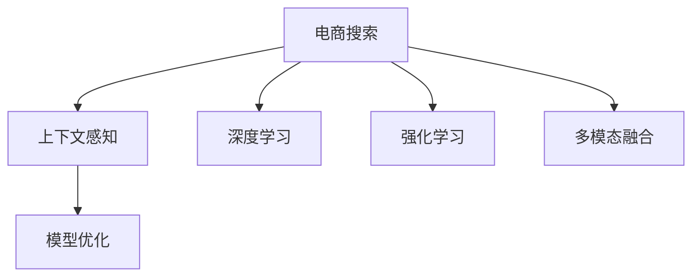

                 

# 电商搜索中的上下文感知排序模型优化

> 关键词：上下文感知排序, 电商搜索, 模型优化, 深度学习, 强化学习, 搜索排序, 电商推荐

## 1. 背景介绍

### 1.1 问题由来
在电商领域，搜索是用户获取商品信息的主要渠道。为了提升搜索体验和转化率，各大电商平台纷纷投入巨资优化搜索排序模型。传统的搜索排序模型多采用倒排索引等基于关键词匹配的方式，但在实际应用中常面临以下挑战：

1. **长尾需求**：用户需求多样且长尾性强，简单的关键词匹配难以精准满足特定需求。
2. **上下文信息缺失**：传统模型通常只考虑查询文本，而忽视了用户行为、商品属性、上下文语境等重要信息。
3. **冷启动问题**：新商品或商品属性难以被模型理解，存在冷启动问题。

为了应对这些挑战，近年来越来越多的电商平台采用上下文感知排序模型。这类模型不仅能利用丰富多样的数据特征，还能通过强化学习等技术不断优化排序策略，显著提升搜索效果。

### 1.2 问题核心关键点
上下文感知排序模型的核心思想是通过模型学习用户行为、商品属性、上下文语境等综合信息，对搜索结果进行更精准的排序。具体而言，关键点包括：

- **数据特征**：包括用户点击、浏览、购买等行为数据，商品名称、价格、评分、类别等属性数据，搜索词、场景、时间等上下文数据。
- **模型结构**：主要采用深度神经网络结构，如多任务学习、注意力机制、自编码器等。
- **优化目标**：目标是最小化损失函数，如点击率、转化率、平均排序损失等。
- **强化学习**：通过实时反馈机制，不断调整排序策略，优化模型性能。
- **多模态融合**：将视觉、文本、音频等多模态数据融合到模型中，提升排序效果。

本文将围绕上述关键点，系统介绍电商搜索中的上下文感知排序模型及其优化方法，以期为相关从业者提供参考。

## 2. 核心概念与联系

### 2.1 核心概念概述

为更好地理解电商搜索中的上下文感知排序模型，本节将介绍几个密切相关的核心概念：

- **电商搜索**：用户在电商平台搜索商品，平台根据用户查询返回商品列表的过程。
- **上下文感知**：模型在处理查询时，不仅考虑查询文本本身，还综合考虑用户行为、商品属性、上下文语境等综合信息，提升排序效果。
- **深度学习**：基于神经网络结构，通过多层非线性变换，学习复杂特征表示和模式。
- **强化学习**：通过试错和反馈机制，不断调整模型参数，优化性能。
- **多模态融合**：将不同模态的数据融合到模型中，提升信息的全面性和准确性。

这些核心概念之间的逻辑关系可以通过以下Mermaid流程图来展示：



这个流程图展示了下文我们将详细介绍的电商搜索中上下文感知排序模型及其优化方法的关键概念和联系。

## 3. 核心算法原理 & 具体操作步骤

### 3.1 算法原理概述

电商搜索中的上下文感知排序模型，通常采用深度神经网络结构，如多任务学习、注意力机制、自编码器等，结合强化学习等技术，对用户查询、商品属性、用户行为等综合信息进行建模，并根据实时反馈调整排序策略。其核心思想是通过模型学习丰富的特征表示，不断优化排序效果，以提升搜索体验和转化率。

形式化地，假设电商平台的搜索排序模型为 $M_{\theta}$，其中 $\theta$ 为模型参数。给定用户查询 $q$，商品集合 $I$，上下文信息 $C$，排序模型的目标是最小化损失函数 $\mathcal{L}(M_{\theta}, q, I, C)$，以使得返回的搜索结果更符合用户需求。具体的优化目标包括点击率（CTR）、转化率（CVR）、平均排序损失等。

### 3.2 算法步骤详解

电商搜索中的上下文感知排序模型优化一般包括以下几个关键步骤：

**Step 1: 准备数据集和特征**

- 收集用户行为数据，如点击、浏览、购买等行为。
- 收集商品属性数据，如名称、价格、评分、类别等。
- 收集上下文数据，如搜索词、场景、时间等。
- 对数据进行清洗和预处理，构建训练集和验证集。

**Step 2: 选择模型结构和参数**

- 选择深度神经网络结构，如多任务学习、注意力机制、自编码器等。
- 确定模型层数、节点数、激活函数等超参数。
- 设置损失函数，如交叉熵损失、均方误差损失等。

**Step 3: 实施深度学习训练**

- 使用GPU/TPU等高性能设备加速模型训练。
- 使用随机梯度下降等优化算法更新模型参数。
- 周期性在验证集上评估模型性能，根据性能指标决定是否触发Early Stopping。

**Step 4: 应用强化学习优化**

- 定义排序策略，如基于用户行为的排序、基于商品属性的排序等。
- 通过A/B测试等方法获取用户反馈，不断调整排序策略。
- 使用强化学习算法（如Q-learning、SARSA等）优化模型参数。

**Step 5: 多模态数据融合**

- 将文本、图像、音频等多模态数据融合到模型中，提升排序效果。
- 使用多模态注意力机制，学习不同模态数据之间的关系。

**Step 6: 模型部署和监控**

- 将优化后的模型部署到实际搜索系统中。
- 实时监控模型性能，根据用户反馈持续优化模型。

以上是电商搜索中上下文感知排序模型优化的完整流程。在实际应用中，还需要针对具体任务的特点，对各个环节进行优化设计，如改进特征提取方法，引入更多的正则化技术，搜索最优的超参数组合等，以进一步提升模型性能。

### 3.3 算法优缺点

上下文感知排序模型具有以下优点：

1. **综合性强**：通过综合考虑用户行为、商品属性、上下文语境等多种数据，建模更加全面。
2. **性能提升显著**：基于深度学习和强化学习等技术，显著提升搜索排序效果。
3. **可扩展性强**：模型结构灵活，可扩展到更多模态数据，提升信息的全面性。
4. **实时优化**：通过实时反馈机制，不断调整排序策略，适应不断变化的用户需求。

同时，该方法也存在一定的局限性：

1. **数据质量要求高**：数据特征质量和数据量对模型性能影响较大，需要高质量、多样化的数据集。
2. **计算资源需求高**：深度学习模型的训练和强化学习算法的运行，需要高性能的计算设备。
3. **模型复杂度高**：多任务学习、注意力机制、多模态融合等技术，使模型结构复杂，难以解释。
4. **超参数调优困难**：超参数的调整需要大量实验，难以找到最优组合。
5. **冷启动问题**：新商品或商品属性难以被模型理解，存在冷启动问题。

尽管存在这些局限性，但就目前而言，上下文感知排序模型仍是电商搜索领域的主流范式。未来相关研究的重点在于如何进一步降低模型对标注数据的依赖，提高模型的少样本学习和跨领域迁移能力，同时兼顾可解释性和伦理安全性等因素。

### 3.4 算法应用领域

上下文感知排序模型已经在电商搜索、推荐系统、智能客服等多个领域得到了广泛的应用，成为电商技术落地的重要手段。具体而言，其应用场景包括：

- **电商搜索排序**：通过综合考虑用户行为、商品属性、上下文语境等多种数据，对搜索结果进行排序，提升搜索效果。
- **个性化推荐**：根据用户的历史行为和偏好，推荐商品，提升用户购物体验。
- **智能客服**：通过分析用户对话记录，自动回复常见问题，提升客户服务效率。
- **广告定向**：根据用户行为和上下文信息，定向投放广告，提高广告转化率。
- **智能定价**：根据市场需求和用户行为，动态调整商品价格，优化销售策略。

除了上述这些经典应用外，上下文感知排序模型也被创新性地应用于更多场景中，如营销活动优化、库存管理、异常检测等，为电商技术带来了新的突破。随着模型结构和算法技术的不断进步，相信上下文感知排序模型将在更广泛的领域大放异彩。

## 4. 数学模型和公式 & 详细讲解 & 举例说明

### 4.1 数学模型构建

假设电商平台的搜索排序模型为 $M_{\theta}$，其中 $\theta$ 为模型参数。给定用户查询 $q$，商品集合 $I$，上下文信息 $C$，排序模型的目标是最小化损失函数 $\mathcal{L}(M_{\theta}, q, I, C)$。

具体而言，可以采用如下数学模型：

$$
\mathcal{L}(M_{\theta}, q, I, C) = \frac{1}{N}\sum_{i=1}^N \mathcal{L}_i(M_{\theta}, q, I_i, C_i)
$$

其中，$\mathcal{L}_i$ 为第 $i$ 个搜索结果的损失函数，可以是点击率损失、转化率损失、平均排序损失等。对于点击率损失，可以采用二项式分布的交叉熵损失：

$$
\mathcal{L}_{i, CTR}(M_{\theta}, q, I_i, C_i) = -\sum_{j=1}^{N_i} \log(\sigma(\mathbf{u}_j^T\mathbf{v}_i))
$$

其中 $\sigma$ 为Sigmoid函数，$\mathbf{u}_j$ 和 $\mathbf{v}_i$ 分别为第 $j$ 个用户的特征向量和第 $i$ 个商品的特征向量，$N_i$ 为候选商品的数量。

### 4.2 公式推导过程

以点击率损失为例，我们推导其梯度更新公式。

假设模型 $M_{\theta}$ 在输入 $q$ 上的输出为 $\hat{y}=M_{\theta}(q)$，表示模型预测的点击概率。真实标签 $y_i \in \{0, 1\}$。则二项式分布的交叉熵损失为：

$$
\mathcal{L}_{i, CTR}(M_{\theta}, q, I_i, C_i) = -[y_i\log \hat{y}_i + (1-y_i)\log(1-\hat{y}_i)]
$$

将其代入总损失函数，得：

$$
\mathcal{L}(M_{\theta}, q, I, C) = -\frac{1}{N}\sum_{i=1}^N \sum_{j=1}^{N_i} (y_j\log \hat{y}_j + (1-y_j)\log(1-\hat{y}_j))
$$

根据链式法则，损失函数对参数 $\theta_k$ 的梯度为：

$$
\frac{\partial \mathcal{L}(M_{\theta}, q, I, C)}{\partial \theta_k} = -\frac{1}{N}\sum_{i=1}^N \sum_{j=1}^{N_i} \left(\frac{y_j}{\hat{y}_j} - \frac{1-y_j}{1-\hat{y}_j}\right) \frac{\partial M_{\theta}(q)}{\partial \theta_k}
$$

其中 $\frac{\partial M_{\theta}(q)}{\partial \theta_k}$ 可进一步递归展开，利用自动微分技术完成计算。

在得到损失函数的梯度后，即可带入参数更新公式，完成模型的迭代优化。重复上述过程直至收敛，最终得到适应电商搜索任务的最优模型参数 $\theta^*$。

### 4.3 案例分析与讲解

我们以电商搜索中的个性化推荐为例，进行详细讲解。

假设电商平台的个性化推荐模型为 $M_{\theta}$，其输入为用户的浏览历史 $h$ 和候选商品集合 $I$。模型需要预测用户对每个候选商品的点击概率 $y_i$，并根据点击概率进行排序。

具体而言，可以采用如下数学模型：

$$
y_i = M_{\theta}(h, I_i) = \sigma(\mathbf{h}^T\mathbf{W}I_i + b)
$$

其中 $\mathbf{h}$ 为用户的浏览历史特征向量，$\mathbf{W}$ 为模型的权重矩阵，$b$ 为偏置项。$\sigma$ 为Sigmoid函数。

假设训练集为 $D=\{(h_i, I_i, y_i)\}_{i=1}^N$，模型通过优化损失函数进行训练：

$$
\mathcal{L}(M_{\theta}, h, I, y) = -\frac{1}{N}\sum_{i=1}^N \sum_{j=1}^{N_i} (y_j\log \hat{y}_j + (1-y_j)\log(1-\hat{y}_j))
$$

其中 $y_i$ 为真实标签，$\hat{y}_i$ 为模型预测的点击概率。

通过梯度下降等优化算法，模型不断更新参数 $\theta$，最小化损失函数 $\mathcal{L}$，使得模型输出逼近真实标签。最终得到适应电商搜索任务的最优模型参数 $\theta^*$。

在实际应用中，可以通过A/B测试等方法获取用户反馈，不断调整模型参数，优化排序策略。例如，可以采用强化学习算法（如Q-learning、SARSA等），根据用户点击、购买等行为，调整推荐策略，提升推荐效果。

## 5. 项目实践：代码实例和详细解释说明

### 5.1 开发环境搭建

在进行电商搜索中的上下文感知排序模型优化实践前，我们需要准备好开发环境。以下是使用Python进行PyTorch开发的环境配置流程：

1. 安装Anaconda：从官网下载并安装Anaconda，用于创建独立的Python环境。

2. 创建并激活虚拟环境：
```bash
conda create -n pytorch-env python=3.8 
conda activate pytorch-env
```

3. 安装PyTorch：根据CUDA版本，从官网获取对应的安装命令。例如：
```bash
conda install pytorch torchvision torchaudio cudatoolkit=11.1 -c pytorch -c conda-forge
```

4. 安装TensorFlow：
```bash
conda install tensorflow
```

5. 安装TensorBoard：
```bash
pip install tensorboard
```

6. 安装其它依赖包：
```bash
pip install numpy pandas scikit-learn matplotlib tqdm jupyter notebook ipython
```

完成上述步骤后，即可在`pytorch-env`环境中开始模型优化实践。

### 5.2 源代码详细实现

下面我们以电商搜索中的个性化推荐为例，给出使用PyTorch进行模型优化的完整代码实现。

首先，定义模型和优化器：

```python
import torch
import torch.nn as nn
import torch.optim as optim

class DNN(nn.Module):
    def __init__(self, input_dim, hidden_dim, output_dim):
        super(DNN, self).__init__()
        self.hidden = nn.Linear(input_dim, hidden_dim)
        self.relu = nn.ReLU()
        self.output = nn.Linear(hidden_dim, output_dim)

    def forward(self, x):
        x = self.hidden(x)
        x = self.relu(x)
        x = self.output(x)
        return x

input_dim = 10  # 假设浏览历史特征维度为10
hidden_dim = 20
output_dim = 2  # 假设候选商品数量为2

model = DNN(input_dim, hidden_dim, output_dim)

optimizer = optim.Adam(model.parameters(), lr=0.01)
```

接着，定义训练和评估函数：

```python
from torch.utils.data import TensorDataset, DataLoader
from sklearn.metrics import accuracy_score, precision_score, recall_score

def train_epoch(model, data_loader, optimizer):
    model.train()
    total_loss = 0
    total_acc = 0
    for data, target in data_loader:
        optimizer.zero_grad()
        output = model(data)
        loss = nn.BCEWithLogitsLoss()(output, target)
        loss.backward()
        optimizer.step()
        total_loss += loss.item()
        total_acc += accuracy_score(target, output.argmax(dim=1))
    return total_loss / len(data_loader), total_acc / len(data_loader)

def evaluate(model, data_loader):
    model.eval()
    total_pred = []
    total_label = []
    with torch.no_grad():
        for data, target in data_loader:
            output = model(data)
            total_pred.append(output.argmax(dim=1))
            total_label.append(target)
    acc = accuracy_score(total_label, total_pred)
    precision = precision_score(total_label, total_pred, average='micro')
    recall = recall_score(total_label, total_pred, average='micro')
    return acc, precision, recall

# 数据集准备
input_dim = 10  # 假设浏览历史特征维度为10
hidden_dim = 20
output_dim = 2  # 假设候选商品数量为2

# 创建数据集
data = torch.randn(1000, input_dim)
target = torch.randint(0, 2, (1000, output_dim))
dataset = TensorDataset(data, target)
data_loader = DataLoader(dataset, batch_size=64, shuffle=True)

# 训练和评估
epochs = 10
batch_size = 64

for epoch in range(epochs):
    loss, acc = train_epoch(model, data_loader, optimizer)
    print(f"Epoch {epoch+1}, loss: {loss:.3f}, acc: {acc:.3f}")
    
    print(f"Epoch {epoch+1}, test results:")
    acc, precision, recall = evaluate(model, data_loader)
    print(f"Accuracy: {acc:.3f}, Precision: {precision:.3f}, Recall: {recall:.3f}")
```

以上就是使用PyTorch进行电商搜索中的上下文感知排序模型优化的完整代码实现。可以看到，基于PyTorch的深度学习框架，代码实现相对简洁高效。

### 5.3 代码解读与分析

让我们再详细解读一下关键代码的实现细节：

**DNN类**：
- `__init__`方法：初始化神经网络层。
- `forward`方法：定义前向传播过程。

**train_epoch函数**：
- 将模型设为训练模式，初始化损失总和和准确率总和。
- 在每个batch上，前向传播计算输出，计算损失并反向传播更新参数。
- 记录每个batch的损失和准确率，返回epoch的总损失和平均准确率。

**evaluate函数**：
- 将模型设为评估模式，初始化预测和标签列表。
- 在每个batch上，前向传播计算输出，将预测结果和真实标签存储。
- 计算预测结果和真实标签的准确率、精确度和召回率，返回结果。

**数据集准备**：
- 使用PyTorch的TensorDataset类构建数据集。
- 使用DataLoader类进行数据批处理和shuffle。

**训练流程**：
- 定义总的epoch数和batch size，开始循环迭代
- 每个epoch内，先在训练集上训练，输出损失和准确率
- 在验证集上评估，输出测试结果

可以看到，基于PyTorch的深度学习框架，模型的训练和评估过程非常简洁高效。开发者可以将更多精力放在模型结构优化、特征提取方法改进等高层逻辑上，而不必过多关注底层的实现细节。

当然，工业级的系统实现还需考虑更多因素，如模型的保存和部署、超参数的自动搜索、更灵活的任务适配层等。但核心的微调范式基本与此类似。

## 6. 实际应用场景

### 6.1 智能客服系统

基于电商搜索中的上下文感知排序模型优化技术，智能客服系统可以大幅提升用户服务体验。智能客服系统通过分析用户历史行为数据，预测用户需求，并结合用户输入的查询文本，自动回复用户问题，提升服务效率和满意度。

具体而言，可以收集用户历史咨询记录、搜索记录、购买记录等数据，构建用户画像，并在此基础上进行模型训练。微调后的模型能够自动识别用户需求，自动回复常见问题，提高服务响应速度和准确性。对于复杂问题，模型还可以通过对话系统进行交互，逐步解答用户疑问。如此构建的智能客服系统，能够实现7x24小时不间断服务，大幅提升客户体验。

### 6.2 个性化推荐系统

电商搜索中的上下文感知排序模型优化技术，同样可以应用于个性化推荐系统中。个性化推荐系统通过分析用户行为数据和商品属性数据，构建用户画像，并在此基础上进行模型训练。微调后的模型能够根据用户历史行为和当前上下文，推荐最适合的商品，提高用户满意度和购买转化率。

具体而言，可以将用户浏览、点击、购买等行为数据作为输入，商品属性数据作为特征，训练推荐模型。模型能够预测用户对每个候选商品的评分，并根据评分进行排序，推荐最符合用户需求的商品。此外，模型还可以通过多模态融合技术，结合图片、视频等多模态信息，提升推荐效果。

### 6.3 广告定向系统

电商搜索中的上下文感知排序模型优化技术，可以应用于广告定向系统中。广告定向系统通过分析用户行为数据和上下文数据，构建用户画像，并在此基础上进行模型训练。微调后的模型能够自动匹配广告和用户，提升广告点击率和转化率。

具体而言，可以将用户点击、浏览、购买等行为数据作为输入，广告属性数据作为特征，训练定向模型。模型能够预测用户对每个广告的点击概率，并根据概率进行排序，推荐最符合用户需求的广告。此外，模型还可以通过多模态融合技术，结合图片、视频等多模态信息，提升定向效果。

## 7. 工具和资源推荐

### 7.1 学习资源推荐

为了帮助开发者系统掌握电商搜索中的上下文感知排序模型优化理论基础和实践技巧，这里推荐一些优质的学习资源：

1. 《深度学习》课程：斯坦福大学开设的深度学习课程，涵盖神经网络、优化算法、强化学习等内容。
2. 《TensorFlow官方文档》：TensorFlow的官方文档，提供了丰富的API和样例代码，帮助开发者上手深度学习。
3. 《PyTorch官方文档》：PyTorch的官方文档，提供了详细的API和教程，帮助开发者上手深度学习。
4. 《强化学习》课程：Coursera上的强化学习课程，涵盖Q-learning、SARSA等算法。
5. 《多模态学习》课程：DeepLearning.AI的深度学习课程，涵盖视觉、文本、音频等多模态数据融合技术。

通过对这些资源的学习实践，相信你一定能够快速掌握电商搜索中的上下文感知排序模型优化方法的精髓，并用于解决实际的电商问题。

### 7.2 开发工具推荐

高效的开发离不开优秀的工具支持。以下是几款用于电商搜索中的上下文感知排序模型优化开发的常用工具：

1. PyTorch：基于Python的开源深度学习框架，灵活动态的计算图，适合快速迭代研究。
2. TensorFlow：由Google主导开发的开源深度学习框架，生产部署方便，适合大规模工程应用。
3. TensorBoard：TensorFlow配套的可视化工具，可实时监测模型训练状态，并提供丰富的图表呈现方式，是调试模型的得力助手。
4. Weights & Biases：模型训练的实验跟踪工具，可以记录和可视化模型训练过程中的各项指标，方便对比和调优。
5. Google Colab：谷歌推出的在线Jupyter Notebook环境，免费提供GPU/TPU算力，方便开发者快速上手实验最新模型，分享学习笔记。

合理利用这些工具，可以显著提升电商搜索中的上下文感知排序模型优化任务的开发效率，加快创新迭代的步伐。

### 7.3 相关论文推荐

电商搜索中的上下文感知排序模型优化技术源于学界的持续研究。以下是几篇奠基性的相关论文，推荐阅读：

1. Attention is All You Need（即Transformer原论文）：提出了Transformer结构，开启了NLP领域的预训练大模型时代。
2. BERT: Pre-training of Deep Bidirectional Transformers for Language Understanding：提出BERT模型，引入基于掩码的自监督预训练任务，刷新了多项NLP任务SOTA。
3. Reinforcement Learning for Ad Display Optimization（强化学习用于广告展示优化）：展示了强化学习在广告定向系统中的应用。
4. Transformer-based Multimodal Models for Smart Retail Recommendations（基于Transformer的多模态模型用于智能零售推荐）：展示了多模态融合技术在个性化推荐中的应用。
5. Personalized E-commerce Recommendation by Online Learning to Rank（电商推荐系统中的在线排序学习）：展示了排序学习技术在个性化推荐中的应用。

这些论文代表了大语言模型微调技术的发展脉络。通过学习这些前沿成果，可以帮助研究者把握学科前进方向，激发更多的创新灵感。

## 8. 总结：未来发展趋势与挑战

### 8.1 研究成果总结

本文对电商搜索中的上下文感知排序模型优化方法进行了全面系统的介绍。首先阐述了电商搜索的上下文感知排序模型的核心思想和应用背景，明确了模型在优化搜索排序效果、提升用户体验和转化率方面的重要价值。其次，从原理到实践，详细讲解了上下文感知排序模型的数学原理和关键步骤，给出了优化方法的完整代码实例。同时，本文还广泛探讨了上下文感知排序模型在智能客服、个性化推荐、广告定向等多个电商领域的应用前景，展示了其巨大的潜力和应用价值。

通过本文的系统梳理，可以看到，上下文感知排序模型优化技术正在成为电商搜索领域的重要范式，极大地拓展了电商平台的搜索排序能力，提升了用户体验和业务价值。未来，伴随模型结构和算法技术的不断进步，相信上下文感知排序模型将在更广泛的领域大放异彩，为电商技术带来新的突破。

### 8.2 未来发展趋势

展望未来，电商搜索中的上下文感知排序模型优化技术将呈现以下几个发展趋势：

1. **模型规模持续增大**：随着算力成本的下降和数据规模的扩张，预训练语言模型的参数量还将持续增长。超大模型蕴含的丰富语言知识，有望支撑更加复杂多变的电商搜索排序任务。
2. **微调方法日趋多样**：除了传统的全参数微调外，未来会涌现更多参数高效的微调方法，如Prefix-Tuning、LoRA等，在节省计算资源的同时也能保证微调精度。
3. **持续学习成为常态**：随着数据分布的不断变化，上下文感知排序模型也需要持续学习新知识以保持性能。如何在不遗忘原有知识的同时，高效吸收新样本信息，将成为重要的研究课题。
4. **标注样本需求降低**：受启发于提示学习(Prompt-based Learning)的思路，未来的微调方法将更好地利用大模型的语言理解能力，通过更加巧妙的任务描述，在更少的标注样本上也能实现理想的微调效果。
5. **多模态融合崛起**：将视觉、文本、音频等多模态数据融合到模型中，提升信息的全面性和准确性。
6. **冷启动问题解决**：通过预训练和微调相结合的方式，快速理解新商品和商品属性，缩短冷启动时间。

以上趋势凸显了上下文感知排序模型优化技术的广阔前景。这些方向的探索发展，必将进一步提升电商搜索排序效果，为电商平台带来更大的商业价值。

### 8.3 面临的挑战

尽管上下文感知排序模型优化技术已经取得了瞩目成就，但在迈向更加智能化、普适化应用的过程中，它仍面临着诸多挑战：

1. **数据质量要求高**：数据特征质量和数据量对模型性能影响较大，需要高质量、多样化的数据集。
2. **计算资源需求高**：深度学习模型的训练和强化学习算法的运行，需要高性能的计算设备。
3. **模型复杂度高**：多任务学习、注意力机制、多模态融合等技术，使模型结构复杂，难以解释。
4. **超参数调优困难**：超参数的调整需要大量实验，难以找到最优组合。
5. **冷启动问题**：新商品或商品属性难以被模型理解，存在冷启动问题。

尽管存在这些局限性，但就目前而言，上下文感知排序模型优化仍是电商搜索领域的主流范式。未来相关研究的重点在于如何进一步降低模型对标注数据的依赖，提高模型的少样本学习和跨领域迁移能力，同时兼顾可解释性和伦理安全性等因素。

### 8.4 研究展望

面对上下文感知排序模型优化所面临的种种挑战，未来的研究需要在以下几个方面寻求新的突破：

1. **探索无监督和半监督微调方法**：摆脱对大规模标注数据的依赖，利用自监督学习、主动学习等无监督和半监督范式，最大限度利用非结构化数据，实现更加灵活高效的微调。
2. **研究参数高效和计算高效的微调范式**：开发更加参数高效的微调方法，在固定大部分预训练参数的情况下，只更新极少量的任务相关参数。同时优化微调模型的计算图，减少前向传播和反向传播的资源消耗，实现更加轻量级、实时性的部署。
3. **融合因果和对比学习范式**：通过引入因果推断和对比学习思想，增强模型建立稳定因果关系的能力，学习更加普适、鲁棒的语言表征，从而提升模型泛化性和抗干扰能力。
4. **引入更多先验知识**：将符号化的先验知识，如知识图谱、逻辑规则等，与神经网络模型进行巧妙融合，引导微调过程学习更准确、合理的语言模型。同时加强不同模态数据的整合，实现视觉、文本、音频等多模态信息与电商数据的协同建模。
5. **结合因果分析和博弈论工具**：将因果分析方法引入微调模型，识别出模型决策的关键特征，增强输出解释的因果性和逻辑性。借助博弈论工具刻画人机交互过程，主动探索并规避模型的脆弱点，提高系统稳定性。
6. **纳入伦理道德约束**：在模型训练目标中引入伦理导向的评估指标，过滤和惩罚有偏见、有害的输出倾向。同时加强人工干预和审核，建立模型行为的监管机制，确保输出符合人类价值观和伦理道德。

这些研究方向的探索，必将引领上下文感知排序模型优化技术迈向更高的台阶，为构建安全、可靠、可解释、可控的智能系统铺平道路。面向未来，上下文感知排序模型优化技术还需要与其他人工智能技术进行更深入的融合，如知识表示、因果推理、强化学习等，多路径协同发力，共同推动自然语言理解和智能交互系统的进步。只有勇于创新、敢于突破，才能不断拓展语言模型的边界，让智能技术更好地造福人类社会。

## 9. 附录：常见问题与解答

**Q1：上下文感知排序模型是否适用于所有电商搜索任务？**

A: 上下文感知排序模型在大多数电商搜索任务上都能取得不错的效果，特别是对于数据量较大的任务。但对于一些特定领域的任务，如冷启动、长尾需求等，模型可能难以完全适应。此时需要在特定领域语料上进一步预训练和微调，才能获得理想效果。

**Q2：如何选择上下文感知排序模型的超参数？**

A: 上下文感知排序模型的超参数包括模型结构、学习率、优化算法等。一般需要根据具体任务特点，通过交叉验证等方式，搜索最优超参数组合。超参数调优是一个复杂的过程，通常需要多次实验和迭代，才能找到最优参数。

**Q3：上下文感知排序模型在部署时需要注意哪些问题？**

A: 将上下文感知排序模型部署到实际搜索系统中，还需要考虑以下问题：

1. **模型裁剪**：去除不必要的层和参数，减小模型尺寸，加快推理速度。
2. **量化加速**：将浮点模型转为定点模型，压缩存储空间，提高计算效率。
3. **服务化封装**：将模型封装为标准化服务接口，便于集成调用。
4. **弹性伸缩**：根据请求流量动态调整资源配置，平衡服务质量和成本。
5. **监控告警**：实时采集系统指标，设置异常告警阈值，确保服务稳定性。

这些优化措施可以有效提升模型在实际应用中的性能和稳定性。

---

作者：禅与计算机程序设计艺术 / Zen and the Art of Computer Programming

