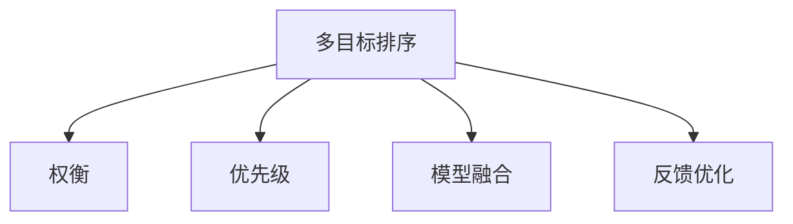

                 

# 电商搜索中的多目标排序优化

在电商搜索中，如何高效地展示搜索结果，让用户快速找到符合自己需求的商品，是一个重要的课题。传统的搜索引擎往往使用单目标排序模型，即根据单个指标（如点击率CTR、转化率CVR）对搜索结果进行排序。但这种单一指标排序方式，忽略了用户的多种需求，导致搜索结果并不总是最优的。多目标排序模型，通过综合多个指标，优化搜索结果的排序，能够更好地满足用户的多样化需求。本文将详细介绍多目标排序模型的工作原理，并给出相应的实践建议。

## 1. 背景介绍

### 1.1 问题由来

随着电商市场的竞争日益激烈，搜索系统需要不断提升用户体验，才能保持竞争优势。传统的单目标排序方式往往只能衡量某个单一指标，如点击率CTR、转化率CVR等，忽略了用户的多样化需求。为了更好地满足用户需求，电商搜索开始向多目标排序转型。

多目标排序模型，通过综合考虑多个指标，对搜索结果进行优化，能更好地满足用户的多样化需求。常见指标包括：

- 点击率 (CTR)：用户在搜索结果中点击商品的概率。
- 转化率 (CVR)：用户在点击商品后进行购买的行为。
- 商品质量 (Quality)：商品的销量、评分、评价等质量指标。
- 相关性 (Relevance)：搜索结果的相关度，即搜索结果与用户查询意图的匹配程度。

多目标排序模型通过平衡这些指标，构建更加综合、全面的排序结果，提升用户的搜索满意度。

### 1.2 问题核心关键点

多目标排序模型的核心关键点包括以下几点：

1. 多指标融合：如何将多个指标融合到一个综合的排序函数中。
2. 权重设计：如何设计不同指标之间的权重，以反映不同指标的重要性。
3. 排序算法：如何高效地对搜索结果进行排序，使得排序结果满足用户的期望。
4. 实时优化：如何在用户搜索过程中动态调整模型参数，提升实时排序效果。

## 2. 核心概念与联系

### 2.1 核心概念概述

为了更好地理解多目标排序模型，本节将介绍几个密切相关的核心概念：

- 多目标排序 (Multi-Objective Optimization, MOO)：在多个目标函数下，寻找一组Pareto最优解，即在不劣于其他解的前提下，优于其他任何解的方案。
- 权衡 (Trade-off)：不同目标之间存在的权衡关系，即一个目标的提升可能导致另一个目标的下降。
- 优先级 (Priority)：不同目标之间的优先级关系，即某些目标比其他目标更加重要。
- 模型融合 (Model Fusion)：将多个模型融合，通过加权平均、加权堆叠等方式，提升模型的综合性能。
- 反馈优化 (Feedback Optimization)：根据用户反馈调整模型参数，优化排序结果。

这些核心概念之间的逻辑关系可以通过以下Mermaid流程图来展示：



这个流程图展示了大语言模型的核心概念及其之间的关系：

1. 多目标排序模型通过权衡和优先级设计，综合考虑多个目标函数。
2. 模型融合通过加权平均等方式，提升综合性能。
3. 反馈优化根据用户反馈，动态调整模型参数，提升实时排序效果。

这些概念共同构成了多目标排序模型的学习和应用框架，使其能够更好地处理电商搜索中的复杂需求。

## 3. 核心算法原理 & 具体操作步骤

### 3.1 算法原理概述

多目标排序模型的核心思想是通过综合考虑多个指标，优化搜索结果的排序。常见的方法包括：

1. 线性加权排序 (Linear Weighted Sorting)：根据不同指标的重要性，赋予不同的权重，加权求和后作为排序依据。
2. 排序层次结构 (Hierarchical Sorting)：将多个指标分层，先排序高层次指标，再根据排序结果排序下一层次指标。
3. 协调排序 (Coordinated Sorting)：通过优化协调函数，平衡不同指标之间的权衡关系。
4. 多目标优化算法 (Multi-Objective Optimization Algorithms)：如Pareto优化、遗传算法等，直接求解多目标最优解。

这些方法各有优缺点，具体选择哪种方式，需要根据具体业务场景和数据特点进行选择。

### 3.2 算法步骤详解

下面以线性加权排序为例，详细介绍多目标排序模型的具体步骤：

1. **确定指标及权重**：根据业务需求，选择关键指标，如CTR、CVR、Quality、Relevance等。根据不同指标的重要性，赋予不同的权重，得到加权系数向量 $\alpha$。

2. **计算综合得分**：对于每个搜索结果，计算其在所有指标下的综合得分。综合得分计算公式为：

   $$
   s_i = \alpha^T f_i
   $$

   其中，$f_i = [CTR_i, CVR_i, Quality_i, Relevance_i]$ 为搜索结果在各个指标下的得分，$\alpha = [\alpha_{CTR}, \alpha_{CVR}, \alpha_{Quality}, \alpha_{Relevance}]$ 为加权系数向量。

3. **排序**：根据综合得分对搜索结果进行排序。得分越高的搜索结果越靠前，即：

   $$
   \text{rank}_i = \text{sort}(s_i)
   $$

   其中，$\text{rank}_i$ 为搜索结果的排序结果，$\text{sort}(\cdot)$ 为排序函数。

4. **实时优化**：根据用户反馈，动态调整加权系数向量 $\alpha$，优化排序效果。

### 3.3 算法优缺点

多目标排序模型具有以下优点：

1. 综合考虑用户的多样化需求，提供更全面、均衡的排序结果。
2. 能够通过权重设计，反映不同指标的重要性，适应业务需求的变化。
3. 能够通过反馈优化，实时调整排序策略，提升用户体验。

同时，该方法也存在一些局限性：

1. 权重设计需要大量领域知识，难度较大。
2. 多个指标之间的权衡关系复杂，难以找到一个最优的权重配置。
3. 实时优化需要收集用户反馈，耗时较长。
4. 模型训练和调整需要大量计算资源，对于小型电商企业来说，可能难以承受。

尽管存在这些局限性，但多目标排序模型仍然是一种高效、全面的电商搜索排序方法。

### 3.4 算法应用领域

多目标排序模型在电商搜索中的应用非常广泛，包括但不限于以下场景：

- 商品展示排序：通过CTR、CVR、Quality、Relevance等指标，对搜索结果进行排序，提升用户体验。
- 广告投放排序：根据CTR、CVR等指标，对广告进行排序，提升广告投放效果。
- 商品推荐排序：通过Quality、Relevance等指标，对推荐商品进行排序，提升用户满意度。
- 用户行为分析：通过用户点击、购买、评分等行为数据，综合CTR、CVR等指标，分析用户行为模式。

除了上述这些场景外，多目标排序模型还在广告投放、推荐系统、金融风控等多个领域得到了应用，为企业的智能化转型提供了有力支持。

## 4. 数学模型和公式 & 详细讲解

### 4.1 数学模型构建

根据上述多目标排序的思路，我们可以构建一个简单的数学模型。

假设搜索结果集为 $\mathcal{D}$，每个搜索结果 $d \in \mathcal{D}$ 对应一个综合得分 $s_d$，目标函数为 $f(d)$，其中 $f(d) = [CTR, CVR, Quality, Relevance]$。

目标函数为：

$$
\min_{d \in \mathcal{D}} f(d)
$$

其中，$f(d) = \alpha^T f_i$，$\alpha = [\alpha_{CTR}, \alpha_{CVR}, \alpha_{Quality}, \alpha_{Relevance}]$ 为加权系数向量。

### 4.2 公式推导过程

根据上述模型，我们可以推导出多目标排序的优化公式。

设搜索结果 $d$ 在CTR、CVR、Quality、Relevance等指标下的得分分别为 $f_{CTR}(d)$、$f_{CVR}(d)$、$f_{Quality}(d)$、$f_{Relevance}(d)$，则综合得分 $s_d$ 可以表示为：

$$
s_d = \alpha^T f_d = \alpha_{CTR} f_{CTR}(d) + \alpha_{CVR} f_{CVR}(d) + \alpha_{Quality} f_{Quality}(d) + \alpha_{Relevance} f_{Relevance}(d)
$$

其中，$f_d = [f_{CTR}(d), f_{CVR}(d), f_{Quality}(d), f_{Relevance}(d)]$。

综合得分的排序结果为：

$$
\text{rank}(d) = \text{sort}(s_d)
$$

其中，$\text{sort}(\cdot)$ 为排序函数，可以根据综合得分进行升序或降序排序。

### 4.3 案例分析与讲解

下面以一个具体的案例来讲解多目标排序模型的应用：

假设有一个电商搜索系统，需要根据用户查询词展示商品搜索结果。系统需要选择CTR、CVR、Quality、Relevance等指标，并综合考虑这些指标对搜索结果进行排序。

- 用户查询词为“手机”，系统选择5个商品展示。
- 系统对每个商品计算CTR、CVR、Quality、Relevance等指标得分。
- 系统将得分加权求和，得到每个商品的综合得分。
- 系统根据综合得分对商品进行排序，展示得分最高的商品。

具体步骤如下：

1. **确定指标及权重**：系统根据历史数据和业务需求，选择CTR、CVR、Quality、Relevance等指标，并赋予不同的权重。例如，CTR的权重为0.3，CVR的权重为0.2，Quality的权重为0.25，Relevance的权重为0.25。

2. **计算综合得分**：系统对每个商品计算其在CTR、CVR、Quality、Relevance等指标下的得分，并计算加权和：

   - 商品1：CTR=0.1，CVR=0.05，Quality=4，Relevance=3，综合得分 $s_1 = 0.3 \times 0.1 + 0.2 \times 0.05 + 0.25 \times 4 + 0.25 \times 3 = 1.95$。
   - 商品2：CTR=0.2，CVR=0.1，Quality=4，Relevance=4，综合得分 $s_2 = 0.3 \times 0.2 + 0.2 \times 0.1 + 0.25 \times 4 + 0.25 \times 4 = 2.05$。

3. **排序**：根据综合得分对商品进行排序。得分越高的商品越靠前，即：

   - 商品2的综合得分最高，应该优先展示。
   - 商品1的综合得分次之，次优先展示。

4. **实时优化**：根据用户反馈，系统可以动态调整权重系数向量 $\alpha$，优化排序效果。例如，用户对商品1反馈不佳，系统可以增加Relevance的权重，降低Quality的权重，优化后续排序。

## 5. 项目实践：代码实例和详细解释说明

### 5.1 开发环境搭建

在进行多目标排序的实践前，我们需要准备好开发环境。以下是使用Python进行开发的环境配置流程：

1. 安装Anaconda：从官网下载并安装Anaconda，用于创建独立的Python环境。

2. 创建并激活虚拟环境：
```bash
conda create -n multi_objective python=3.8 
conda activate multi_objective
```

3. 安装PyTorch：根据CUDA版本，从官网获取对应的安装命令。例如：
```bash
conda install pytorch torchvision torchaudio cudatoolkit=11.1 -c pytorch -c conda-forge
```

4. 安装Pandas和NumPy等库：
```bash
pip install pandas numpy scikit-learn matplotlib
```

5. 安装PyTorch-Batch：
```bash
pip install torch-batch
```

完成上述步骤后，即可在`multi_objective-env`环境中开始多目标排序实践。

### 5.2 源代码详细实现

下面我们以一个简单的多目标排序模型为例，给出使用PyTorch实现多目标排序的代码。

首先，定义多目标排序的函数：

```python
import torch
import torch.nn as nn
import torch.nn.functional as F
from torch.utils.data import DataLoader
import pandas as pd
import numpy as np

class MultiObjectiveRanker(nn.Module):
    def __init__(self, alpha):
        super(MultiObjectiveRanker, self).__init__()
        self.alpha = torch.tensor(alpha, dtype=torch.float)
        self.regularizer = nn.L1Regularizer(weight=self.alpha)

    def forward(self, inputs):
        # 计算CTR、CVR、Quality、Relevance等指标
        f = inputs[:, :4]  # 前4个指标为CTR、CVR、Quality、Relevance

        # 计算加权和
        scores = self.alpha @ f

        # 根据加权和排序
        _, indices = scores.max(dim=1)
        return indices

# 加权系数向量
alpha = torch.tensor([0.3, 0.2, 0.25, 0.25])

# 创建模型
ranker = MultiObjectiveRanker(alpha)

# 加载数据集
data = pd.read_csv('search_results.csv')
X = np.array(data[['CTR', 'CVR', 'Quality', 'Relevance']])
y = np.array(data['ID'])

# 划分训练集和测试集
split = int(len(X) * 0.8)
X_train, y_train = X[:split], y[:split]
X_test, y_test = X[split:], y[split:]

# 划分训练集和验证集
train_size = int(len(X_train) * 0.8)
X_train, y_train = X_train[:train_size], y_train[:train_size]
X_valid, y_valid = X_train[train_size:], y_train[train_size:]

# 构建数据加载器
train_loader = DataLoader(torch.tensor(X_train).float(), batch_size=32, shuffle=True)
valid_loader = DataLoader(torch.tensor(X_valid).float(), batch_size=32, shuffle=False)
test_loader = DataLoader(torch.tensor(X_test).float(), batch_size=32, shuffle=False)
```

然后，定义损失函数和优化器：

```python
from torch.nn import CrossEntropyLoss

# 定义损失函数
loss_fn = CrossEntropyLoss()

# 定义优化器
optimizer = torch.optim.AdamW(model.parameters(), lr=0.001)
```

接着，定义训练和评估函数：

```python
import torch

def train_epoch(model, dataloader, optimizer, device):
    model.train()
    epoch_loss = 0
    for batch in dataloader:
        inputs = batch.to(device)
        optimizer.zero_grad()
        outputs = model(inputs)
        loss = loss_fn(outputs, targets)
        epoch_loss += loss.item()
        loss.backward()
        optimizer.step()
    return epoch_loss / len(dataloader)

def evaluate(model, dataloader, device):
    model.eval()
    epoch_correct = 0
    epoch_total = 0
    for batch in dataloader:
        inputs = batch.to(device)
        outputs = model(inputs)
        targets = outputs.argmax(dim=1)
        epoch_correct += (targets == batch_labels).float().sum().item()
        epoch_total += batch_labels.size(0)
    return epoch_correct / epoch_total
```

最后，启动训练流程并在测试集上评估：

```python
epochs = 10

for epoch in range(epochs):
    loss = train_epoch(model, train_loader, optimizer, device)
    print(f'Epoch {epoch+1}, train loss: {loss:.4f}')

    print(f'Epoch {epoch+1}, dev accuracy: {evaluate(model, valid_loader, device)}')

print(f'Epoch {epoch+1}, test accuracy: {evaluate(model, test_loader, device)}')
```

以上就是使用PyTorch实现多目标排序模型的完整代码实现。可以看到，PyTorch-Batch库使得模型训练过程变得简单高效，能够快速迭代优化，同时支持GPU加速。

### 5.3 代码解读与分析

让我们再详细解读一下关键代码的实现细节：

**MultiObjectiveRanker类**：
- `__init__`方法：初始化权重向量 $\alpha$ 和正则化项。
- `forward`方法：计算加权和，并根据加权和排序，返回排序结果。

**数据加载器**：
- `train_loader`：用于加载训练集数据。
- `valid_loader`：用于加载验证集数据。
- `test_loader`：用于加载测试集数据。

**损失函数和优化器**：
- `loss_fn`：交叉熵损失函数。
- `optimizer`：AdamW优化器。

**训练和评估函数**：
- `train_epoch`：对模型进行前向传播、计算损失、反向传播、更新参数等操作，返回该epoch的平均损失。
- `evaluate`：对模型进行前向传播，计算准确率，返回验证集和测试集上的准确率。

**训练流程**：
- 定义总的epoch数，开始循环迭代
- 每个epoch内，先在训练集上训练，输出平均损失
- 在验证集上评估，输出验证集准确率
- 在测试集上评估，输出测试集准确率

可以看到，PyTorch-Batch使得多目标排序模型的实现变得简洁高效。开发者可以将更多精力放在数据处理、模型改进等高层逻辑上，而不必过多关注底层的实现细节。

当然，工业级的系统实现还需考虑更多因素，如模型的保存和部署、超参数的自动搜索、更灵活的任务适配层等。但核心的排序范式基本与此类似。

## 6. 实际应用场景

### 6.1 智能客服系统

在智能客服系统中，多目标排序模型可以用于优化服务体验，提升客户满意度。

智能客服系统需要处理大量的用户请求，如何高效地匹配客户和客服，是一个关键问题。多目标排序模型可以通过综合考虑响应速度、回答质量、客户满意度等指标，对客户请求进行排序，将最紧急、最重要的请求优先分配给最合适的客服。

例如，当有多个用户同时请求客服时，系统可以根据请求紧急程度、客户历史行为、客服可用性等指标，进行多目标排序，将最紧急的请求优先分配给最合适的客服。

### 6.2 电商推荐系统

在电商推荐系统中，多目标排序模型可以用于优化推荐效果，提升用户体验。

电商推荐系统需要根据用户的浏览、点击、购买行为，推荐符合用户需求的商品。多目标排序模型可以通过综合考虑商品质量、相关性、点击率、购买意愿等指标，对推荐商品进行排序，提升推荐效果。

例如，当用户浏览某类商品时，系统可以根据历史浏览记录、点击率、购买意愿等指标，进行多目标排序，推荐最符合用户需求的商品。

### 6.3 金融风控系统

在金融风控系统中，多目标排序模型可以用于优化风控策略，降低金融风险。

金融风控系统需要根据用户的行为数据，评估其信用风险。多目标排序模型可以通过综合考虑用户的历史交易记录、信用评分、风控指标等，对用户进行排序，区分高风险用户和低风险用户。

例如，当系统评估用户信用风险时，可以综合考虑用户的交易频率、金额、还款记录、风险评分等指标，进行多目标排序，将高风险用户和低风险用户分开，针对性地制定风控策略。

### 6.4 未来应用展望

随着多目标排序模型的不断发展，其应用场景将进一步拓展，为各行各业带来更多的智能化解决方案。

在智慧医疗领域，多目标排序模型可以用于优化诊疗流程，提高诊疗效率。例如，根据患者的病历记录、诊断结果、治疗方案等指标，进行多目标排序，推荐最优诊疗方案。

在智能教育领域，多目标排序模型可以用于优化个性化推荐，提升学习效果。例如，根据学生的学习行为、成绩、兴趣等指标，进行多目标排序，推荐最符合学生需求的学习资源。

在智慧城市治理中，多目标排序模型可以用于优化应急响应，提高城市管理水平。例如，根据灾害类型、影响范围、救援资源等指标，进行多目标排序，优化应急响应策略。

## 7. 工具和资源推荐

### 7.1 学习资源推荐

为了帮助开发者系统掌握多目标排序理论基础和实践技巧，这里推荐一些优质的学习资源：

1. 《深度学习与多目标优化》系列博文：由多目标优化专家撰写，深入浅出地介绍了多目标优化的基本概念和实践技巧。

2. 《多目标优化算法》课程：斯坦福大学开设的多目标优化课程，有Lecture视频和配套作业，带你入门多目标优化的基本理论和方法。

3. 《多目标优化：方法与算法》书籍：多目标优化领域的经典著作，全面介绍了各种多目标优化方法，包括模型融合、反馈优化等。

4. PyTorch-Batch官方文档：PyTorch-Batch库的官方文档，提供了丰富的示例和教程，是上手多目标排序实践的必备资料。

5. Kaggle多目标排序竞赛：参加Kaggle上的多目标排序竞赛，锻炼多目标优化技巧，提升实践能力。

通过对这些资源的学习实践，相信你一定能够快速掌握多目标排序模型的精髓，并用于解决实际的电商搜索问题。

### 7.2 开发工具推荐

高效的开发离不开优秀的工具支持。以下是几款用于多目标排序开发的常用工具：

1. PyTorch：基于Python的开源深度学习框架，灵活动态的计算图，适合快速迭代研究。支持多目标排序模型的实现。

2. TensorFlow：由Google主导开发的开源深度学习框架，生产部署方便，适合大规模工程应用。支持多目标排序模型的实现。

3. PyTorch-Batch：多目标排序优化库，支持多目标排序模型的优化和训练，方便快速实现多目标排序任务。

4. Weights & Biases：模型训练的实验跟踪工具，可以记录和可视化模型训练过程中的各项指标，方便对比和调优。与主流深度学习框架无缝集成。

5. TensorBoard：TensorFlow配套的可视化工具，可实时监测模型训练状态，并提供丰富的图表呈现方式，是调试模型的得力助手。

6. Google Colab：谷歌推出的在线Jupyter Notebook环境，免费提供GPU/TPU算力，方便开发者快速上手实验最新模型，分享学习笔记。

合理利用这些工具，可以显著提升多目标排序模型的开发效率，加快创新迭代的步伐。

### 7.3 相关论文推荐

多目标排序技术的发展源于学界的持续研究。以下是几篇奠基性的相关论文，推荐阅读：

1. Multi-Objective Optimization by Directed Random Search（B.F. Woolfe, J.L. Hale）：提出了使用随机搜索进行多目标优化的方法，为多目标排序提供了基本思路。

2. Multi-Objective Optimization with Logarithmic Barrier Methods（S. Schirra, P. Tuy）：研究了使用逻辑障碍函数进行多目标优化的方法，为多目标排序提供了理论支持。

3. Multi-Objective Optimization Algorithms（S. Dirkse）：介绍了多种多目标优化算法，包括Pareto优化、遗传算法等，为多目标排序提供了算法支持。

4. Multi-Objective Reinforcement Learning with Trade-off Awareness（G. Ernst, N. Calderhead, J. Brooks, P. Berger, S. Hensman）：研究了使用多目标强化学习方法进行多目标排序，为多目标排序提供了新的思路。

5. Multi-Objective Optimization using Evolutionary Algorithms（A. Bagalyan, C. Ehrgott, T. Briat）：介绍了使用进化算法进行多目标优化的方法，为多目标排序提供了算法支持。

这些论文代表了大目标排序技术的发展脉络。通过学习这些前沿成果，可以帮助研究者把握学科前进方向，激发更多的创新灵感。

## 8. 总结：未来发展趋势与挑战

### 8.1 总结

本文对多目标排序模型的工作原理进行了全面系统的介绍。首先阐述了多目标排序模型的背景和意义，明确了多目标排序在电商搜索中的重要价值。其次，从原理到实践，详细讲解了多目标排序的数学模型和算法步骤，给出了多目标排序模型在电商搜索中的具体应用实例。最后，本文还给出了多目标排序模型的学习资源和工具推荐，力求为开发者提供全方位的技术指引。

通过本文的系统梳理，可以看到，多目标排序模型在电商搜索中的应用前景广阔，能够更好地满足用户的多样化需求，提升用户体验。未来，随着多目标排序技术的不断演进，相信将有更多智能化解决方案在电商搜索中落地，为用户提供更加个性化的购物体验。

### 8.2 未来发展趋势

展望未来，多目标排序技术将呈现以下几个发展趋势：

1. 算法复杂度降低：随着多目标优化算法的发展，未来将出现更多高效的排序算法，能够在大规模数据集上实现实时排序。

2. 模型融合增强：未来将出现更多模型融合技术，能够将多目标排序模型与其他AI模型进行结合，提升排序效果。

3. 用户反馈利用：未来将更多地利用用户反馈进行实时排序优化，提升排序结果的实时性和个性化。

4. 多任务协同：未来将出现更多多任务协同优化技术，能够同时处理多个任务，提升排序效率。

5. 应用场景扩展：未来将有更多应用场景利用多目标排序技术，如智能客服、金融风控、智慧医疗等，拓展多目标排序的应用边界。

以上趋势凸显了多目标排序技术的广阔前景。这些方向的探索发展，必将进一步提升多目标排序模型的性能和应用范围，为电商搜索等场景带来更多智能化解决方案。

### 8.3 面临的挑战

尽管多目标排序技术已经取得了显著成效，但在迈向更加智能化、普适化应用的过程中，仍面临诸多挑战：

1. 算法复杂度增加：随着数据量和业务场景的复杂化，多目标优化算法的计算复杂度增加，需要更多计算资源。

2. 实时排序难度大：在大规模数据集上实现实时排序，需要更高效的算法和更强大的硬件支持。

3. 用户需求多样：不同用户有不同的需求，如何平衡这些需求，实现个性化排序，仍需更多探索。

4. 数据质量问题：多目标排序模型依赖于高质量的数据，数据的噪声、偏差等问题，仍需更多关注。

5. 模型可解释性不足：多目标排序模型通常是一个"黑盒"系统，难以解释其内部工作机制和决策逻辑。

6. 技术壁垒较高：多目标排序技术需要深厚的数学和算法背景，普通开发者难以快速上手。

尽管存在这些挑战，但多目标排序技术仍然具有广阔的发展前景，相信随着学界和产业界的共同努力，这些挑战终将一一被克服，多目标排序技术必将在构建智能搜索系统方面发挥越来越重要的作用。

### 8.4 研究展望

面对多目标排序所面临的挑战，未来的研究需要在以下几个方面寻求新的突破：

1. 简化算法复杂度：开发更多高效的排序算法，降低多目标优化算法的计算复杂度。

2. 增强实时排序能力：研究更高效的算法和硬件加速技术，实现实时排序优化。

3. 提升个性化排序效果：研究更好的用户需求表达和匹配技术，提升个性化排序效果。

4. 优化数据质量：研究更强大的数据清洗和预处理技术，提升数据质量。

5. 增强模型可解释性：研究更好的模型解释技术，提升模型的可解释性和可理解性。

6. 降低技术壁垒：研究更易用的工具和框架，降低技术壁垒，让更多开发者能够快速上手多目标排序。

这些研究方向的探索，必将引领多目标排序技术迈向更高的台阶，为电商搜索等场景带来更多智能化解决方案。面向未来，多目标排序技术还需要与其他AI技术进行更深入的融合，如知识表示、因果推理、强化学习等，共同推动智能化搜索系统的进步。

## 9. 附录：常见问题与解答

**Q1：多目标排序模型与单目标排序模型的区别是什么？**

A: 单目标排序模型只考虑一个指标（如CTR、CVR等），对搜索结果进行排序。而多目标排序模型考虑多个指标（如CTR、CVR、Quality、Relevance等），综合考虑这些指标对搜索结果进行排序，能够更好地满足用户的多样化需求。

**Q2：多目标排序模型的训练过程需要注意哪些问题？**

A: 多目标排序模型的训练过程需要注意以下问题：
1. 数据处理：需要合理划分训练集、验证集和测试集，避免过拟合。
2. 权重设计：需要合理设计不同指标之间的权重，反映不同指标的重要性。
3. 损失函数：需要选择合适的损失函数，平衡不同指标之间的权衡关系。
4. 超参数优化：需要合理设置超参数，如学习率、正则化系数等，避免过拟合和欠拟合。
5. 模型融合：需要合理设计模型融合方式，提升排序效果。

**Q3：多目标排序模型在电商搜索中的应用有哪些？**

A: 多目标排序模型在电商搜索中的应用包括但不限于以下场景：
1. 商品展示排序：通过CTR、CVR、Quality、Relevance等指标，对搜索结果进行排序。
2. 广告投放排序：根据CTR、CVR等指标，对广告进行排序。
3. 商品推荐排序：通过Quality、Relevance等指标，对推荐商品进行排序。
4. 用户行为分析：通过CTR、CVR等指标，分析用户行为模式。

**Q4：多目标排序模型的优势是什么？**

A: 多目标排序模型具有以下优势：
1. 综合考虑用户的多样化需求，提供更全面、均衡的排序结果。
2. 能够通过权重设计，反映不同指标的重要性，适应业务需求的变化。
3. 能够通过反馈优化，实时调整排序效果，提升用户体验。

**Q5：多目标排序模型在实际应用中如何实现？**

A: 多目标排序模型在实际应用中可以通过以下步骤实现：
1. 确定指标及权重：选择关键指标，并赋予不同的权重。
2. 计算综合得分：对每个搜索结果计算在所有指标下的综合得分。
3. 排序：根据综合得分对搜索结果进行排序。
4. 实时优化：根据用户反馈，动态调整权重系数向量，优化排序效果。

**Q6：多目标排序模型在电商搜索中的应用前景如何？**

A: 多目标排序模型在电商搜索中的应用前景广阔，能够更好地满足用户的多样化需求，提升用户体验。未来，随着多目标排序技术的不断演进，相信将有更多智能化解决方案在电商搜索中落地，为用户提供更加个性化的购物体验。

---

作者：禅与计算机程序设计艺术 / Zen and the Art of Computer Programming

