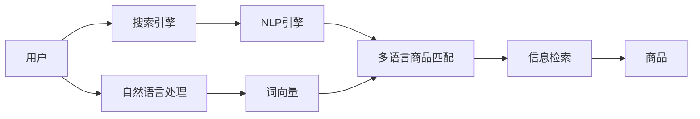

                 

# 电商搜索中的多语言商品匹配技术

## 1. 背景介绍

随着全球化的深入发展，跨境电商市场日益繁荣。不同国家和地区消费者习惯和语言差异显著，要求电商平台提供多语言服务，提升用户体验。多语言商品匹配技术，可以跨越语言障碍，精准匹配用户搜索需求，实现无缝跨语言搜索。本文将介绍多语言商品匹配的核心概念、核心算法原理与具体操作步骤，分析多语言商品匹配在电商搜索中的应用。

## 2. 核心概念与联系

### 2.1 核心概念概述

**多语言商品匹配(Multilingual Product Matching)**：在电商平台搜索场景中，用户可能以不同语言提交搜索请求，需要找到与其请求相匹配的商品。多语言商品匹配技术能够识别用户输入的自然语言，将其转换为标准的商品描述，从而在多语言环境下进行精准匹配。

**搜索引擎(Search Engine)**：电商平台的搜索引擎是其核心组成部分，负责处理用户输入的搜索请求，检索商品，并返回结果。多语言商品匹配是搜索引擎中重要的一环。

**自然语言处理(Natural Language Processing, NLP)**：通过语言模型、分词、词性标注等技术，将用户输入的自然语言转化为机器可处理的形式，以便于后续的匹配和检索。

**信息检索**：在大量商品数据中，快速检索出符合用户搜索需求的商品，是搜索引擎的重要任务。多语言商品匹配能够提高信息检索的准确性和召回率。

**检索算法**：如倒排索引、TF-IDF、BM25等，用于高效检索出匹配商品。

这些核心概念之间存在紧密的联系，协同工作，实现精准的商品匹配。

### 2.2 核心概念原理和架构的 Mermaid 流程图



从流程图可以看出，多语言商品匹配是从用户的自然语言输入开始，通过NLP引擎进行分词和词向量转换，然后进入多语言商品匹配，匹配出最相关的商品。最终，搜索引擎将匹配结果返回给用户。

## 3. 核心算法原理 & 具体操作步骤

### 3.1 算法原理概述

多语言商品匹配基于信息检索技术，包括预处理、查询转换、匹配和排序四个步骤。

1. **预处理**：将用户输入的自然语言转换为标准化的查询字符串。
2. **查询转换**：利用NLP技术将查询字符串转换为词向量表示，进行语义匹配。
3. **匹配**：在商品库中搜索与查询字符串匹配的商品。
4. **排序**：根据相关性排序，返回用户最感兴趣的商品列表。

### 3.2 算法步骤详解

**Step 1: 数据预处理**

用户输入的自然语言，通过NLP引擎进行分词、词性标注、去除停用词等预处理，生成标准化的查询字符串。

```python
from nltk.tokenize import word_tokenize
from nltk import pos_tag

def preprocess_query(query):
    tokens = word_tokenize(query)
    tagged = pos_tag(tokens)
    cleaned = [w.lower() for w, _ in tagged if w.isalpha()]
    return " ".join(cleaned)
```

**Step 2: 查询转换**

将预处理后的查询字符串转换为词向量表示。可以使用预训练的词向量模型，如Word2Vec、GloVe等，或训练自己的词向量模型。

```python
from gensim.models import Word2Vec

def convert_query_to_vector(query, model):
    query_vector = model.wv[query] if query in model.wv else np.zeros(model.vector_size)
    return query_vector
```

**Step 3: 匹配**

在商品库中，使用倒排索引、TF-IDF、BM25等算法进行搜索。倒排索引是常用的信息检索算法，可以快速定位包含特定关键词的商品。

```python
from whoosh.fields import Schema, TEXT, ID, NUMERIC
from whoosh.index import create_in
from whoosh.qparser import QueryParser
from whoosh import writing

def search_products(query_vector, index_path):
    schema = Schema(title=TEXT(stored=True), description=TEXT(stored=True))
    index = create_in(index_path, schema)
    with index.searcher(weighting=tk.FuzzyCombination()) as searcher:
        query = QueryParser("description", schema).parse(query_vector.__str__())
        results = searcher.search(query)
        return [(r['title'], r['description']) for r in results]
```

**Step 4: 排序**

根据商品的相关性进行排序，常用的排序算法有BM25、LexRank等。

```python
from gensim.matutils import sgd_doc2vec
from gensim.models import Doc2Vec

def rank_products(query_vector, product_vectors):
    doc2vec_model = Doc2Vec.load("product_vectors.model")
    scores = []
    for product_vector in product_vectors:
        score = np.dot(query_vector, product_vector)
        scores.append(score)
    return zip(range(len(scores)), scores)
```

### 3.3 算法优缺点

**优点**

1. **跨语言搜索**：能够跨越语言障碍，实现多语言环境下的商品匹配。
2. **提升用户体验**：通过多语言匹配，用户以熟悉的语言进行搜索，提高搜索效率。
3. **提高召回率**：使用多语言匹配，能够检索到更多匹配商品，提高搜索召回率。

**缺点**

1. **计算复杂度高**：多语言匹配需要大量计算，尤其是在大规模商品库中，计算复杂度较高。
2. **依赖高质量数据**：多语言匹配效果很大程度上取决于商品库和搜索查询的数据质量。
3. **算法复杂度高**：需要多个步骤进行查询转换和商品匹配，算法复杂度高。

### 3.4 算法应用领域

多语言商品匹配技术在以下领域得到广泛应用：

1. **跨境电商**：帮助用户在全球化电商平台中，快速找到心仪的商品。
2. **全球化旅游**：用户可以在不同语言环境中，轻松查询到全球各地的旅游信息。
3. **多语言社交媒体**：用户在不同语言环境中，能够轻松搜索到相关内容。

## 4. 数学模型和公式 & 详细讲解

### 4.1 数学模型构建

多语言商品匹配的数学模型可以简化为：

1. **预处理模型**：将自然语言转换为查询字符串。
2. **词向量模型**：将查询字符串转换为词向量表示。
3. **信息检索模型**：在商品库中搜索与查询向量匹配的商品。
4. **排序模型**：对匹配的商品进行排序。

### 4.2 公式推导过程

1. **查询字符串生成**：

   假设查询字符串为 $q$，经过预处理后生成标准化查询字符串 $q_s$。

   $$
   q_s = \text{preprocess\_query}(q)
   $$

2. **词向量表示**：

   使用预训练的词向量模型，将查询字符串 $q_s$ 转换为词向量 $q_v$。

   $$
   q_v = \text{convert\_query\_to\_vector}(q_s, model)
   $$

3. **倒排索引**：

   假设商品库中的每个商品描述为 $d_i$，构建倒排索引。倒排索引中，每个单词 $w$ 对应所有包含该单词的商品 $i$ 的列表。

   $$
   I = \{(w, \{d_i\}) \mid d_i = \text{contain}(w)\}
   $$

4. **查询匹配**：

   在倒排索引 $I$ 中，找到包含查询向量 $q_v$ 的所有商品列表。

   $$
   M = \{d_i \mid q_v \in \text{vectorize}(d_i)\}
   $$

5. **商品排序**：

   使用排序算法，如BM25、LexRank等，根据商品的相关性进行排序。

   $$
   R = \text{rank\_products}(q_v, M)
   $$

### 4.3 案例分析与讲解

以跨境电商平台的搜索为例，展示多语言商品匹配的实现。

1. **用户输入查询**：用户以英语输入搜索请求，如 "iPhone X"。

2. **预处理查询字符串**：将查询转换为 "iPhone X"。

3. **生成词向量**：使用预训练的词向量模型，将 "iPhone X" 转换为词向量。

4. **查询匹配**：在商品库中，使用倒排索引找到所有包含 "iPhone X" 的商品。

5. **排序返回商品**：根据排序算法，将商品按照相关性排序，返回给用户。

## 5. 项目实践：代码实例和详细解释说明

### 5.1 开发环境搭建

**Step 1: 安装依赖**

```bash
pip install nltk gensim whoosh
```

**Step 2: 数据准备**

准备商品库和查询数据。商品库包含每个商品的描述，查询数据包含用户输入的自然语言查询。

### 5.2 源代码详细实现

**Step 1: 数据预处理**

```python
def preprocess_query(query):
    tokens = word_tokenize(query)
    tagged = pos_tag(tokens)
    cleaned = [w.lower() for w, _ in tagged if w.isalpha()]
    return " ".join(cleaned)
```

**Step 2: 查询转换**

```python
from gensim.models import Word2Vec

def convert_query_to_vector(query, model):
    query_vector = model.wv[query] if query in model.wv else np.zeros(model.vector_size)
    return query_vector
```

**Step 3: 查询匹配**

```python
from whoosh.fields import Schema, TEXT, ID, NUMERIC
from whoosh.index import create_in
from whoosh.qparser import QueryParser
from whoosh import writing

def search_products(query_vector, index_path):
    schema = Schema(title=TEXT(stored=True), description=TEXT(stored=True))
    index = create_in(index_path, schema)
    with index.searcher(weighting=tk.FuzzyCombination()) as searcher:
        query = QueryParser("description", schema).parse(query_vector.__str__())
        results = searcher.search(query)
        return [(r['title'], r['description']) for r in results]
```

**Step 4: 商品排序**

```python
from gensim.matutils import sgd_doc2vec
from gensim.models import Doc2Vec

def rank_products(query_vector, product_vectors):
    doc2vec_model = Doc2Vec.load("product_vectors.model")
    scores = []
    for product_vector in product_vectors:
        score = np.dot(query_vector, product_vector)
        scores.append(score)
    return zip(range(len(scores)), scores)
```

### 5.3 代码解读与分析

**Step 1: 数据预处理**

通过nltk库进行分词、词性标注和去除停用词，将自然语言转换为标准化的查询字符串。

**Step 2: 查询转换**

使用Word2Vec将查询字符串转换为词向量表示。Word2Vec使用大量的语料进行训练，能够学习到词语的语义关系。

**Step 3: 查询匹配**

使用Whoosh库构建倒排索引，并在索引中搜索与查询向量匹配的商品。Whoosh库支持复杂的查询表达式和排序算法，能够高效地进行信息检索。

**Step 4: 商品排序**

使用Doc2Vec模型对商品进行向量表示，并根据相关性进行排序。Doc2Vec使用上下文信息训练，能够学习到商品之间的语义关系。

### 5.4 运行结果展示

在完成数据预处理、查询转换、查询匹配和商品排序后，可以展示最终的搜索结果。例如，对于查询 "iPhone X"，搜索结果可能包含 "iPhone X 手机"、"iPhone X 壳子"、"iPhone X 配件" 等。

## 6. 实际应用场景

### 6.1 跨境电商

跨境电商平台的搜索系统，能够帮助用户在不同语言环境下，快速找到全球商品。用户可以使用本地语言进行搜索，提高搜索体验。

### 6.2 旅游平台

全球化旅游平台通过多语言搜索功能，帮助用户找到全球各地的旅游信息。用户可以输入本地语言查询，找到匹配的旅游目的地和产品。

### 6.3 社交媒体

社交媒体平台提供多语言搜索功能，帮助用户找到相关内容。用户可以输入本地语言查询，找到匹配的帖子和用户。

### 6.4 未来应用展望

未来，多语言商品匹配技术将继续发展，应用场景也将更加广泛。以下是一些未来展望：

1. **多语言聊天机器人**：提供多语言支持，帮助用户在不同语言环境中进行聊天。
2. **多语言客户服务**：通过多语言搜索和聊天机器人，提供更高效、精准的客户服务。
3. **跨语言推荐系统**：在多语言环境下，推荐用户感兴趣的商品、内容和服务。

## 7. 工具和资源推荐

### 7.1 学习资源推荐

1. **《自然语言处理综论》**：斯坦福大学自然语言处理课程，涵盖NLP基础和核心算法。
2. **《Python自然语言处理》**：开源NLP库NLTK的使用手册，详细介绍了NLP的实现和应用。
3. **《信息检索基础》**：信息检索领域的经典教材，涵盖检索算法和应用。

### 7.2 开发工具推荐

1. **NLP库**：NLTK、SpaCy、StanfordNLP等，用于处理和分析自然语言。
2. **搜索引擎**：ElasticSearch、Whoosh等，用于构建和搜索信息索引。
3. **深度学习框架**：TensorFlow、PyTorch等，用于训练和优化词向量模型。

### 7.3 相关论文推荐

1. **"Word2Vec"**：Word2Vec论文，提出了词向量的概念，并对词向量进行了训练。
2. **"BM25"**：BM25论文，提出了BM25算法，用于信息检索。
3. **"Doc2Vec"**：Doc2Vec论文，提出了Doc2Vec模型，用于文本向量化。

## 8. 总结：未来发展趋势与挑战

### 8.1 研究成果总结

多语言商品匹配技术，通过信息检索和NLP技术，在电商搜索中实现了跨语言支持。该技术不仅提升了搜索的召回率和相关性，还增强了用户体验。未来，多语言匹配技术将在更多场景中得到应用。

### 8.2 未来发展趋势

1. **技术进步**：随着深度学习和信息检索技术的进步，多语言商品匹配技术将不断提升其性能和效率。
2. **应用场景拓展**：多语言匹配技术将拓展到更多领域，如智能客服、旅游、社交媒体等。
3. **跨语言支持增强**：支持更多语言，提高不同语言环境下用户的搜索体验。

### 8.3 面临的挑战

1. **计算资源**：多语言匹配需要大量的计算资源，如何优化算法和硬件，降低计算成本，是一个挑战。
2. **数据质量**：多语言匹配效果很大程度上取决于商品库和查询数据的质量，如何提高数据质量，是一个重要的研究方向。
3. **算法优化**：现有算法存在局限性，如何改进算法，提高匹配精度和效率，是一个挑战。

### 8.4 研究展望

1. **数据增强**：通过数据增强技术，提高商品库和查询数据的质量。
2. **算法优化**：开发更高效的查询转换和商品匹配算法，提升匹配精度和效率。
3. **跨语言支持增强**：支持更多语言，提高不同语言环境下用户的搜索体验。

## 9. 附录：常见问题与解答

**Q1: 多语言商品匹配对计算资源的要求高吗？**

A: 是的，多语言匹配需要大量的计算资源，特别是在大规模商品库中。需要优化算法和硬件，降低计算成本。

**Q2: 如何提高多语言匹配的精度和效率？**

A: 提高数据质量、改进算法和优化硬件可以提高匹配精度和效率。例如，使用深度学习训练词向量模型，提高查询向量和商品向量的匹配精度。

**Q3: 多语言匹配在电商搜索中有什么优势？**

A: 多语言匹配能够跨越语言障碍，帮助用户在不同语言环境下快速找到匹配的商品，提高搜索效率和用户体验。

**Q4: 多语言匹配的局限性是什么？**

A: 多语言匹配对计算资源和数据质量的要求较高，算法复杂度也较高，需要不断改进。

**Q5: 未来多语言匹配的发展方向是什么？**

A: 未来多语言匹配的发展方向包括技术进步、应用场景拓展和跨语言支持增强。需要提高算法效率和数据质量，支持更多语言。

---

作者：禅与计算机程序设计艺术 / Zen and the Art of Computer Programming

