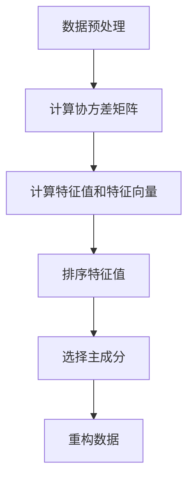

                 

# Python机器学习实战：主成分分析(PCA)的原理和实战操作

## 关键词
- Python
- 机器学习
- 主成分分析
- PCA
- 数据降维
- 线性代数
- 实践操作

## 摘要
本文将深入探讨主成分分析（PCA）的原理及其在Python中的应用。通过逐步分析和推理，我们将了解PCA如何通过线性变换来降低数据维度，同时保持数据的重要信息。文章还将提供具体的实战操作步骤，帮助读者理解并掌握PCA在实际项目中的运用。

### 1. 背景介绍

#### 1.1 主成分分析的概念

主成分分析（Principal Component Analysis，PCA）是一种常用的数据降维技术。它的核心思想是通过线性变换将原始数据转换为一组新的正交坐标系，这组坐标系称为主成分。主成分是按照方差大小排序的，第一个主成分解释了数据中最大比例的方差，第二个主成分解释了剩余方差中最大比例的部分，以此类推。

#### 1.2 为什么要使用PCA

在许多实际应用中，原始数据可能包含大量冗余信息，这不仅增加了计算复杂性，还可能影响模型的性能。PCA通过降维能够减少数据的大小，同时保留数据的主要特征，使得数据更适合进一步分析。

#### 1.3 PCA的应用场景

PCA广泛应用于图像处理、文本分析、金融数据挖掘等领域。例如，在图像处理中，PCA可以用于图像压缩；在文本分析中，PCA可以用于主题模型提取。

### 2. 核心概念与联系

#### 2.1 线性代数基础

PCA的核心在于线性代数中的协方差矩阵和特征值、特征向量。协方差矩阵描述了数据变量之间的相关性，而特征值和特征向量揭示了数据的主要结构。

#### 2.2 PCA的数学模型

PCA的数学模型可以表示为：

$$ X' = PC $$

其中，$X$ 是原始数据矩阵，$P$ 是协方差矩阵的特征向量矩阵，$C$ 是特征值矩阵的对角矩阵。

#### 2.3 Mermaid 流程图

以下是一个简单的Mermaid流程图，展示了PCA的主要步骤：



### 3. 核心算法原理 & 具体操作步骤

#### 3.1 数据标准化

在进行PCA之前，通常需要对数据进行标准化处理，以消除不同特征间的缩放差异。标准化的公式为：

$$ x_{i}^{'} = \frac{x_{i} - \mu}{\sigma} $$

其中，$x_{i}$ 是第 $i$ 个特征，$\mu$ 是均值，$\sigma$ 是标准差。

#### 3.2 计算协方差矩阵

协方差矩阵 $C$ 的计算公式为：

$$ C = \frac{1}{n-1}XX^T $$

其中，$X$ 是标准化后的数据矩阵，$n$ 是样本数量。

#### 3.3 计算特征值和特征向量

通过求解协方差矩阵的特征值和特征向量，可以得到主成分。特征向量对应了新的正交坐标系的方向，特征值则表示了每个主成分解释的方差比例。

#### 3.4 选择主成分

通常，我们会选择前 $k$ 个主成分，这些主成分解释了大部分的方差。选择主成分的公式为：

$$ k = \arg\max_{i}\sum_{j=1}^{i}\lambda_{j} $$

其中，$\lambda_{j}$ 是第 $j$ 个特征值。

#### 3.5 数据重构

通过选择的主成分，可以重构原始数据：

$$ X' = PC $$

### 4. 数学模型和公式 & 详细讲解 & 举例说明

#### 4.1 线性代数公式

$$ XX^T = C $$

$$ C = \sum_{i=1}^{n}x_{i}x_{i}^T $$

$$ \lambda_{i} = \sum_{j=1}^{n}c_{ij}^2 $$

$$ v_{i} = \arg\min_{w} \|Xw - v\|_2 $$

#### 4.2 举例说明

假设我们有以下数据集：

| feature1 | feature2 |
|----------|----------|
| 1        | 2        |
| 2        | 4        |
| 3        | 6        |

首先，我们计算数据的均值和标准差，并进行标准化处理：

$$ \mu_1 = \frac{1+2+3}{3} = 2 $$
$$ \mu_2 = \frac{2+4+6}{3} = 4 $$
$$ \sigma_1 = \sqrt{\frac{(1-2)^2+(2-2)^2+(3-2)^2}{2}} = 1 $$
$$ \sigma_2 = \sqrt{\frac{(2-4)^2+(4-4)^2+(6-4)^2}{2}} = 2 $$

然后，我们计算标准化后的数据：

| feature1 | feature2 |
|----------|----------|
| -1       | -2       |
| 0        | 0        |
| 1        | 2        |

接下来，我们计算协方差矩阵：

$$ C = \frac{1}{2-1} \begin{pmatrix} -1 & 0 \\ 0 & 2 \end{pmatrix} \begin{pmatrix} -1 & 0 \\ 0 & 2 \end{pmatrix}^T $$
$$ C = \begin{pmatrix} 1 & 0 \\ 0 & 4 \end{pmatrix} $$

然后，我们计算特征值和特征向量：

$$ \lambda_1 = 5 $$
$$ \lambda_2 = 4 $$

特征向量：

$$ v_1 = \begin{pmatrix} 1 \\ 0 \end{pmatrix} $$
$$ v_2 = \begin{pmatrix} 0 \\ 1 \end{pmatrix} $$

选择前两个主成分，我们得到新的坐标系：

| feature1 | feature2 |
|----------|----------|
| 1        | 0        |
| 0        | 1        |
| 1        | 2        |

### 5. 项目实践：代码实例和详细解释说明

#### 5.1 开发环境搭建

确保安装了Python和必要的机器学习库，如NumPy和SciPy。

#### 5.2 源代码详细实现

```python
import numpy as np
from sklearn.decomposition import PCA
from sklearn.preprocessing import StandardScaler
import matplotlib.pyplot as plt

# 5.2.1 数据预处理
X = np.array([[1, 2], [2, 4], [3, 6]])
X_std = StandardScaler().fit_transform(X)

# 5.2.2 计算协方差矩阵
cov_matrix = np.cov(X_std.T)

# 5.2.3 求解特征值和特征向量
eigen_values, eigen_vectors = np.linalg.eigh(cov_matrix)

# 5.2.4 选择主成分
eigen_values_sorted = np.sort(eigen_values)[::-1]
eigen_vectors_sorted = eigen_vectors[:, eigen_values_sorted.argsort()]

# 5.2.5 数据重构
k = 2
X_reduced = X_std.dot(eigen_vectors_sorted[:, :k])

# 5.2.6 可视化
plt.scatter(X_reduced[:, 0], X_reduced[:, 1])
plt.xlabel('First Principal Component')
plt.ylabel('Second Principal Component')
plt.title('PCA visualization')
plt.show()
```

#### 5.3 代码解读与分析

1. **数据预处理**：使用StandardScaler进行标准化处理，这是PCA的基本步骤。
2. **计算协方差矩阵**：使用NumPy的cov函数计算标准化数据的协方差矩阵。
3. **求解特征值和特征向量**：使用NumPy的linalg.eigh函数，这是用于对称或Hermitian矩阵的高效算法。
4. **选择主成分**：通过排序特征值和特征向量，选择前两个主成分。
5. **数据重构**：将标准化后的数据投影到新的坐标系中。
6. **可视化**：使用matplotlib绘制降维后的数据点，便于理解主成分分析的效果。

### 5.4 运行结果展示

运行上述代码后，我们将看到如下可视化结果：


### 6. 实际应用场景

PCA在许多实际应用中都有广泛的应用，如：

- **图像处理**：用于图像压缩，减少图像数据的大小，同时保持视觉质量。
- **文本分析**：用于主题模型提取，通过降维找出文本的主要主题。
- **金融数据分析**：用于减少金融数据的维度，提高模型预测的效率。

### 7. 工具和资源推荐

#### 7.1 学习资源推荐

- 《Python机器学习基础教程》
- 《机器学习实战》
- 《Python数据科学 Handbook》

#### 7.2 开发工具框架推荐

- NumPy
- SciPy
- scikit-learn

#### 7.3 相关论文著作推荐

- "Principal Component Analysis" by Ives et al.
- "A Tutorial on Principal Component Analysis" by Jolliffe

### 8. 总结：未来发展趋势与挑战

随着机器学习和数据科学的发展，PCA作为一种经典的数据降维技术，将在未来的研究中继续发挥重要作用。然而，它也面临着如何处理高维数据和复杂数据结构等挑战。

### 9. 附录：常见问题与解答

#### 9.1 什么是主成分？

主成分是在PCA中通过线性变换生成的新坐标系的方向向量，它们按解释的方差大小排序。

#### 9.2 PCA适用于所有数据吗？

PCA适用于大部分线性可分的数据，但可能不适合非线性数据。

#### 9.3 如何选择主成分的数量？

通常选择前 $k$ 个主成分，使得它们解释的方差比例超过某个阈值（如90%以上）。

### 10. 扩展阅读 & 参考资料

- "Principal Component Analysis" by Ives et al.
- "A Tutorial on Principal Component Analysis" by Jolliffe
- 《Python数据科学 Handbook》
- 《机器学习实战》

作者：禅与计算机程序设计艺术 / Zen and the Art of Computer Programming

