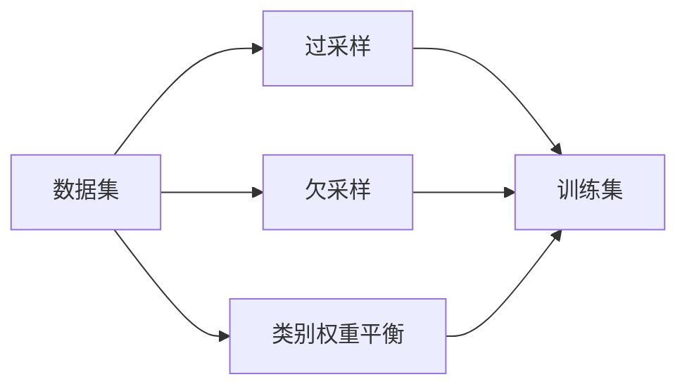

                 

## 1. 背景介绍

随着互联网电商的迅猛发展，人工智能技术在大规模推荐系统中得到了广泛应用。AI大模型如BERT、GPT-3、T5等，因其强大的自然语言理解和生成能力，在电商搜索推荐中被广泛采用。然而，在实际应用中，这些模型往往面临数据不平衡的问题，即训练数据中某些类别样本明显少于其他类别，导致模型在预测时偏向于样本较多的类别，从而影响推荐效果。

### 1.1 问题由来

电商搜索推荐系统需要根据用户的查询请求，从海量的商品信息中筛选出最匹配的推荐结果。由于用户查询具有高度个性化，每个查询结果往往只有少数商品满足要求，导致样本分布极度不平衡。例如，在一个检索系统的训练集中，某个特定商品的查询可能只有数百条记录，而热门的商品查询可能数万乃至数十万条。

在数据不平衡的情况下，AI大模型容易产生偏差，导致模型在训练中过度拟合数据较多的类别，而对少数类别的商品推荐效果不佳。这不仅影响用户体验，也会导致平台推荐商品的丰富性和多样性下降，最终影响商业转化率。

### 1.2 问题核心关键点

电商搜索推荐中的数据不平衡问题核心关键点包括：
- 样本分布不均衡：部分商品查询样本数量远低于其他商品查询，导致模型在预测时倾向于推荐热门商品。
- 类别权重失衡：热门商品的权重较高，而冷门商品的权重较低，影响推荐公平性。
- 性能下降：模型在少数类商品上的预测准确率显著低于多数类商品。

为了解决这些问题，本文将介绍几种常见且有效的数据不平衡解决策略，包括过采样、欠采样、类别权重平衡等方法，并结合电商搜索推荐场景进行详细讲解。

## 2. 核心概念与联系

### 2.1 核心概念概述

要解决电商搜索推荐中的数据不平衡问题，首先需要明确几个关键概念：

- **过采样(Over-sampling)**：在训练集中增加少数类样本的数目，使其与多数类样本数量相近。常见的过采样方法包括SMOTE、ADASYN等。
- **欠采样(Under-sampling)**：在训练集中减少多数类样本的数目，使其与少数类样本数量相近。常见的欠采样方法包括随机欠采样、Tomek链接等。
- **类别权重平衡**：通过调整不同类别样本在损失函数中的权重，使得模型更加关注少数类样本，从而平衡不同类别的影响。

这些策略可以帮助模型更加公平地对待不同类别的样本，从而提升整体推荐效果。

### 2.2 核心概念原理和架构的 Mermaid 流程图



## 3. 核心算法原理 & 具体操作步骤

### 3.1 算法原理概述

电商搜索推荐中的数据不平衡问题，可以通过多种数据增强和样本重加权的方法进行解决。下面详细讲解这些方法的原理和操作步骤。

### 3.2 算法步骤详解

#### 3.2.1 过采样

**过采样步骤详解**：

1. **选择过采样方法**：
   - **SMOTE**（Synthetic Minority Over-sampling Technique）：基于k近邻，通过线性插值生成新样本，从而增加少数类的样本数。
   - **ADASYN**（Adaptive Synthetic Sampling）：根据少数类的分布，动态生成新的样本，减少过拟合风险。

2. **生成新样本**：
   - **SMOTE**：对少数类的样本 $x_i$，找到其k近邻样本 $x_j$，生成新样本 $x_{new}$ 为 $x_i$ 与 $x_j$ 的线性插值。
   - **ADASYN**：通过计算少数类的分布密度，动态生成新的样本，确保样本生成质量和多样性。

3. **合并训练集**：
   - 将过采样后的新样本与原始训练集合并，得到新的训练集。

**代码实现示例**：

```python
from imblearn.over_sampling import SMOTE
from sklearn.model_selection import train_test_split

# 定义数据集
X_train, y_train = load_data()

# 进行过采样
smote = SMOTE()
X_train_resampled, y_train_resampled = smote.fit_resample(X_train, y_train)

# 划分训练集和测试集
X_train, X_test, y_train, y_test = train_test_split(X_train_resampled, y_train_resampled, test_size=0.2, random_state=42)
```

#### 3.2.2 欠采样

**欠采样步骤详解**：

1. **选择欠采样方法**：
   - **随机欠采样**：随机删除多数类的样本，使得训练集中多数类和少数类的样本数量相等。
   - **Tomek链接**：删除Tomek链接样本，即删除那些与其他类别样本的欧氏距离相同，但与本类别样本的欧氏距离较近的样本。

2. **删除样本**：
   - **随机欠采样**：随机删除多数类样本。
   - **Tomek链接**：删除Tomek链接样本。

3. **合并训练集**：
   - 将欠采样后的样本与原始训练集合并，得到新的训练集。

**代码实现示例**：

```python
from imblearn.under_sampling import RandomUnderSampler
from sklearn.model_selection import train_test_split

# 定义数据集
X_train, y_train = load_data()

# 进行欠采样
rus = RandomUnderSampler()
X_train_resampled, y_train_resampled = rus.fit_resample(X_train, y_train)

# 划分训练集和测试集
X_train, X_test, y_train, y_test = train_test_split(X_train_resampled, y_train_resampled, test_size=0.2, random_state=42)
```

#### 3.2.3 类别权重平衡

**类别权重平衡步骤详解**：

1. **计算类别权重**：
   - **基于样本数量**：将类别权重设置为该类别样本数与总样本数的比例。
   - **基于类别性能**：根据不同类别的性能，动态调整类别权重。

2. **调整损失函数**：
   - 在损失函数中，为不同类别设置不同的权重。

3. **训练模型**：
   - 使用带有类别权重的损失函数训练模型。

**代码实现示例**：

```python
from sklearn.utils.class_weight import compute_class_weight

# 定义数据集
X_train, y_train = load_data()

# 计算类别权重
class_weights = compute_class_weight(class_weight='balanced', classes=np.unique(y_train), y=y_train)

# 调整损失函数
def custom_loss(y_true, y_pred):
    loss = loss_fn(y_true, y_pred)
    loss *= class_weights[y_true]
    return loss

# 训练模型
model.fit(X_train, y_train, loss=custom_loss)
```

### 3.3 算法优缺点

#### 3.3.1 过采样的优缺点

**优点**：
- **提升少数类样本数量**：通过增加少数类样本，使其与多数类样本数量相近，可以显著提升模型对少数类的识别能力。
- **减少数据失衡**：使得训练集中不同类别的样本数量均衡，有利于提升模型的泛化能力。

**缺点**：
- **引入噪声**：过度生成的样本可能包含噪声，导致模型过拟合。
- **计算复杂**：增加样本数后，模型训练和推理时间会增加。

#### 3.3.2 欠采样的优缺点

**优点**：
- **减少噪声**：通过删除多数类中的噪声样本，可以提高训练集的纯净度。
- **提高训练效率**：减少样本数后，模型训练和推理时间会减少。

**缺点**：
- **丢失信息**：删除过多样本可能导致重要信息丢失，影响模型的泛化能力。
- **数据失衡**：可能进一步加剧数据不平衡问题。

#### 3.3.3 类别权重平衡的优缺点

**优点**：
- **平衡类别影响**：通过调整类别权重，使得模型更加关注少数类样本，提升整体性能。
- **减少数据失衡**：能够缓解数据不平衡问题，提高模型的公平性。

**缺点**：
- **计算复杂**：调整类别权重会增加计算复杂度。
- **过拟合风险**：如果权重设置不当，可能导致模型对少数类样本过度拟合，影响整体效果。

### 3.4 算法应用领域

数据不平衡问题在多个领域中广泛存在，如医疗诊断、金融风控、生物信息学等。在电商搜索推荐领域，数据不平衡问题会导致模型倾向于推荐热门商品，而对少数类商品的推荐效果不佳。因此，这些策略在电商搜索推荐中得到了广泛应用。

## 4. 数学模型和公式 & 详细讲解 & 举例说明

### 4.1 数学模型构建

假设电商搜索推荐系统的训练集为 $D=\{(x_i, y_i)\}_{i=1}^N$，其中 $x_i \in \mathbb{R}^d$ 为输入特征，$y_i \in \{1,2,\ldots,C\}$ 为类别标签，$C$ 为类别数。

定义损失函数 $\ell(y_i, \hat{y_i})$ 为模型对样本 $i$ 的预测损失，$w_c$ 为类别 $c$ 的权重。则模型的经验风险为：

$$
\mathcal{L}(w) = \frac{1}{N} \sum_{i=1}^N w_{y_i} \ell(y_i, \hat{y_i})
$$

其中，类别权重 $w_c$ 定义为：

$$
w_c = \frac{N_c}{\sum_{j=1}^C N_j}
$$

其中，$N_c$ 为类别 $c$ 的样本数量，$N_j$ 为所有类别的样本数量。

### 4.2 公式推导过程

**过采样**：
- **SMOTE**：对于样本 $x_i$ 的 $k$ 近邻，生成新样本 $x_{new}$：
  $$
  x_{new} = x_i + \alpha (x_j - x_i)
  $$
  其中，$\alpha$ 为缩放因子。

**欠采样**：
- **随机欠采样**：随机删除多数类样本 $x_i$。

**类别权重平衡**：
- 调整损失函数：
  $$
  \mathcal{L}(w) = \frac{1}{N} \sum_{i=1}^N w_{y_i} \ell(y_i, \hat{y_i})
  $$
  其中，类别权重 $w_c$ 根据样本数量计算：
  $$
  w_c = \frac{N_c}{\sum_{j=1}^C N_j}
  $$

### 4.3 案例分析与讲解

**案例**：某电商平台的商品搜索推荐系统，训练数据中热门商品（C=1）的样本数量远大于冷门商品（C=2）。使用过采样、欠采样和类别权重平衡的方法，优化推荐模型。

**数据不平衡问题**：
- 热门商品（C=1）：$N_1=10000$
- 冷门商品（C=2）：$N_2=500$

**过采样**：
- **SMOTE**：生成新样本 $x_{new}$，使得 $N_1=10001$，$N_2=1001$。

**欠采样**：
- **随机欠采样**：删除热门商品样本 $x_i$，使得 $N_1=10000$，$N_2=500$。

**类别权重平衡**：
- 计算类别权重 $w_1 = \frac{N_1}{N_1+N_2}$，$w_2 = \frac{N_2}{N_1+N_2}$。
- 调整损失函数，使得少数类样本的权重 $w_2$ 增大。

## 5. 项目实践：代码实例和详细解释说明

### 5.1 开发环境搭建

**环境配置**：
- **Python**：使用3.8及以上版本。
- **Pandas**：用于数据处理。
- **Scikit-learn**：用于数据预处理和模型训练。
- **Matplotlib**：用于绘制数据分布图。
- **Seaborn**：用于绘制数据分布图。

**代码实现示例**：

```python
# 导入必要的库
import pandas as pd
import numpy as np
from sklearn.model_selection import train_test_split
from sklearn.preprocessing import StandardScaler
from sklearn.ensemble import RandomForestClassifier
from sklearn.metrics import classification_report

# 读取数据集
df = pd.read_csv('data.csv')

# 数据预处理
X = df.drop('label', axis=1)
y = df['label']
X_train, X_test, y_train, y_test = train_test_split(X, y, test_size=0.2, random_state=42)

# 标准化特征
scaler = StandardScaler()
X_train = scaler.fit_transform(X_train)
X_test = scaler.transform(X_test)

# 过采样
from imblearn.over_sampling import SMOTE
smote = SMOTE()
X_train_resampled, y_train_resampled = smote.fit_resample(X_train, y_train)

# 欠采样
from imblearn.under_sampling import RandomUnderSampler
rus = RandomUnderSampler()
X_train_resampled, y_train_resampled = rus.fit_resample(X_train, y_train)

# 类别权重平衡
from sklearn.utils.class_weight import compute_class_weight
class_weights = compute_class_weight(class_weight='balanced', classes=np.unique(y_train), y=y_train)

# 训练模型
model = RandomForestClassifier()
model.fit(X_train_resampled, y_train_resampled)

# 评估模型
y_pred = model.predict(X_test)
print(classification_report(y_test, y_pred))
```

### 5.2 源代码详细实现

**代码实现示例**：

```python
# 导入必要的库
import pandas as pd
import numpy as np
from sklearn.model_selection import train_test_split
from sklearn.preprocessing import StandardScaler
from sklearn.ensemble import RandomForestClassifier
from sklearn.metrics import classification_report

# 读取数据集
df = pd.read_csv('data.csv')

# 数据预处理
X = df.drop('label', axis=1)
y = df['label']
X_train, X_test, y_train, y_test = train_test_split(X, y, test_size=0.2, random_state=42)

# 标准化特征
scaler = StandardScaler()
X_train = scaler.fit_transform(X_train)
X_test = scaler.transform(X_test)

# 过采样
from imblearn.over_sampling import SMOTE
smote = SMOTE()
X_train_resampled, y_train_resampled = smote.fit_resample(X_train, y_train)

# 欠采样
from imblearn.under_sampling import RandomUnderSampler
rus = RandomUnderSampler()
X_train_resampled, y_train_resampled = rus.fit_resample(X_train, y_train)

# 类别权重平衡
from sklearn.utils.class_weight import compute_class_weight
class_weights = compute_class_weight(class_weight='balanced', classes=np.unique(y_train), y=y_train)

# 训练模型
model = RandomForestClassifier()
model.fit(X_train_resampled, y_train_resampled)

# 评估模型
y_pred = model.predict(X_test)
print(classification_report(y_test, y_pred))
```

### 5.3 代码解读与分析

**代码解读**：

1. **数据预处理**：
   - 使用Pandas读取数据集。
   - 将特征和标签分开。
   - 使用Scikit-learn的train_test_split函数，将数据集划分为训练集和测试集。
   - 使用StandardScaler对特征进行标准化处理。

2. **过采样**：
   - 使用imblearn库的SMOTE函数对训练集进行过采样。
   - 生成新的训练集，使得少数类样本数量与多数类样本数量相近。

3. **欠采样**：
   - 使用imblearn库的RandomUnderSampler函数对训练集进行欠采样。
   - 删除多数类中的样本，使得少数类样本数量与多数类样本数量相近。

4. **类别权重平衡**：
   - 使用sklearn.utils.class_weight库的compute_class_weight函数计算类别权重。
   - 根据类别样本数量计算权重，使得模型更加关注少数类样本。

5. **训练和评估**：
   - 使用Scikit-learn的RandomForestClassifier函数训练模型。
   - 使用classification_report函数评估模型性能。

**代码分析**：

- **数据预处理**：标准化处理特征，防止不同特征对模型的影响不一致。
- **过采样**：通过SMOTE生成新样本，使得少数类样本数量增加。
- **欠采样**：删除多数类样本，使得少数类样本数量增加。
- **类别权重平衡**：通过计算类别权重，使得模型更加关注少数类样本。

## 6. 实际应用场景

### 6.1 智能推荐系统

在智能推荐系统中，数据不平衡问题会导致推荐结果失衡，热门商品推荐多，冷门商品推荐少。通过过采样、欠采样和类别权重平衡的方法，可以提升少数类商品的推荐效果，增加推荐多样性，提升用户体验。

**应用示例**：
- **过采样**：通过增加少数类商品的推荐次数，提升冷门商品的曝光率。
- **欠采样**：删除热门商品的多余推荐，减少推荐量，平衡推荐效果。
- **类别权重平衡**：增加冷门商品的推荐权重，提升推荐公平性。

### 6.2 医疗诊断系统

在医疗诊断系统中，数据不平衡问题会导致模型偏向于高发病率疾病，对低发病率疾病的诊断效果不佳。通过过采样、欠采样和类别权重平衡的方法，可以提高对少数类疾病的诊断效果，提升医疗诊断的全面性和准确性。

**应用示例**：
- **过采样**：生成新样本，增加少数类疾病的诊断样本数量。
- **欠采样**：删除多数类疾病的诊断样本，平衡诊断样本数量。
- **类别权重平衡**：增加少数类疾病的诊断权重，提升诊断效果。

### 6.3 金融风控系统

在金融风控系统中，数据不平衡问题会导致模型偏向于高风险用户，对低风险用户的识别效果不佳。通过过采样、欠采样和类别权重平衡的方法，可以提升对少数类用户的识别效果，提升风控系统的准确性和安全性。

**应用示例**：
- **过采样**：生成新样本，增加少数类用户的识别样本数量。
- **欠采样**：删除多数类用户的识别样本，平衡识别样本数量。
- **类别权重平衡**：增加少数类用户的识别权重，提升识别效果。

## 7. 工具和资源推荐

### 7.1 学习资源推荐

1. **《Python数据科学手册》**：由Jake VanderPlas撰写，全面介绍Python在数据科学中的应用。
2. **《机器学习实战》**：由Peter Harrington撰写，涵盖机器学习的基础和常用算法。
3. **Kaggle学习资源**：提供丰富的数据集和竞赛项目，帮助学习者进行实战练习。

### 7.2 开发工具推荐

1. **Python**：Python是数据科学和机器学习的主流语言，拥有丰富的科学计算库和框架。
2. **Jupyter Notebook**：交互式编程工具，方便进行数据探索和模型调试。
3. **TensorBoard**：可视化工具，帮助监测模型训练过程和结果。

### 7.3 相关论文推荐

1. **《A Survey on Synthetic Minority Over-sampling Techniques》**：介绍SMOTE等过采样方法的原理和应用。
2. **《Under-Sampling Techniques for Classification in Imbalanced Data Sets: A Survey》**：介绍欠采样方法的基本原理和实际应用。
3. **《Learning from Imbalanced Data Sets》**：介绍类别权重平衡方法的原理和应用。

## 8. 总结：未来发展趋势与挑战

### 8.1 研究成果总结

本文系统介绍了电商搜索推荐中的数据不平衡问题及解决策略。通过过采样、欠采样和类别权重平衡的方法，可以有效缓解数据不平衡问题，提升模型对少数类样本的识别能力，从而提升推荐效果。

### 8.2 未来发展趋势

未来，随着AI大模型的不断发展，数据不平衡问题将更加突出。未来的研究趋势包括：
- **多模态数据融合**：将图像、语音等多模态数据与文本数据结合，提升模型的泛化能力。
- **自适应采样**：动态调整采样方法，根据数据分布变化进行自适应调整。
- **深度学习模型优化**：使用深度学习模型进行数据不平衡问题处理，提升处理效果。

### 8.3 面临的挑战

尽管数据不平衡问题已有所缓解，但仍面临诸多挑战：
- **计算资源消耗**：过采样和欠采样方法会增加计算资源消耗，需要进一步优化。
- **模型性能提升**：在少数类样本数量较少的情况下，如何提升模型性能，仍需进一步探索。
- **数据质量提升**：数据质量不高，导致模型在处理数据不平衡问题时效果不佳。

### 8.4 研究展望

未来的研究方向包括：
- **自适应采样算法**：动态调整采样方法，适应数据分布变化。
- **多模态数据融合**：将多模态数据与文本数据结合，提升模型泛化能力。
- **深度学习优化**：使用深度学习模型进行数据不平衡问题处理，提升模型效果。

总之，数据不平衡问题是电商搜索推荐系统面临的重要挑战，通过过采样、欠采样和类别权重平衡等方法，可以有效缓解数据不平衡问题，提升推荐效果。未来，随着技术的不断发展，这些方法将更加高效、灵活，为电商搜索推荐系统带来更好的用户体验和商业价值。

## 9. 附录：常见问题与解答

**Q1：数据不平衡问题是否会影响推荐系统的公平性？**

A: 数据不平衡问题会导致模型在训练时偏向于样本较多的类别，影响推荐系统的公平性。通过过采样、欠采样和类别权重平衡的方法，可以有效缓解数据不平衡问题，提升少数类商品的推荐效果，增加推荐多样性，提升用户体验。

**Q2：如何选择过采样和欠采样方法？**

A: 过采样和欠采样方法的选择应根据具体任务和数据分布情况进行。对于少数类样本数量较少的任务，建议使用过采样方法。对于多数类样本数量较少的任务，建议使用欠采样方法。

**Q3：如何调整类别权重平衡？**

A: 类别权重平衡的调整应根据具体任务和数据分布情况进行。可以通过计算类别样本数量，使用sklearn.utils.class_weight库的compute_class_weight函数计算类别权重。

**Q4：数据不平衡问题在电商推荐系统中如何解决？**

A: 在电商推荐系统中，可以通过过采样、欠采样和类别权重平衡的方法，缓解数据不平衡问题。过采样方法可以通过SMOTE等生成新样本，增加少数类样本数量。欠采样方法可以通过删除多数类样本，减少样本数量。类别权重平衡可以通过计算类别权重，调整损失函数，使得模型更加关注少数类样本。

**Q5：数据不平衡问题在医疗诊断系统中如何解决？**

A: 在医疗诊断系统中，可以通过过采样、欠采样和类别权重平衡的方法，缓解数据不平衡问题。过采样方法可以通过生成新样本，增加少数类疾病的诊断样本数量。欠采样方法可以通过删除多数类疾病的诊断样本，平衡诊断样本数量。类别权重平衡可以通过计算类别权重，增加少数类疾病的诊断权重，提升诊断效果。

---

作者：禅与计算机程序设计艺术 / Zen and the Art of Computer Programming

